# 名誉保护投诉指引

> 本文转载自微信公众号 **微信公众平台**，已获作者授权。  
> 原文发布于 2020年11月27日 16:23  
> 原文链接：[mp.weixin.qq.com](https://mp.weixin.qq.com/s/_2kC-fXw7UjneZSrsC9CVQ)

---

如你发现平台内存在内容侵犯了你的名誉/商誉/隐私/肖像等合法权益，可以通过手机提交投诉，平台核实后，会限制文章的分享能力，并对被投诉内容进行遮盖/模糊处理。

处理效果可参考下图:

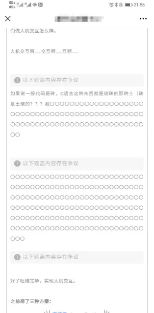 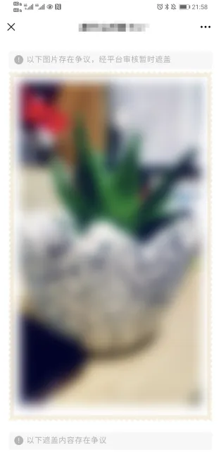

**一、投诉入口：**

1.进入文章详情页，点击右上方的【...】

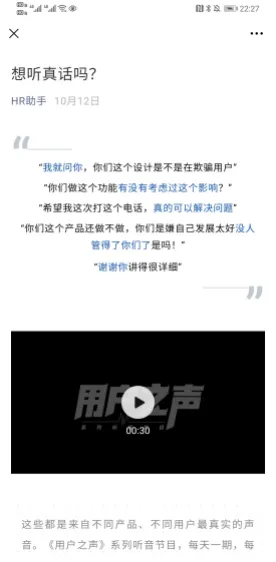

2.选择【投诉】

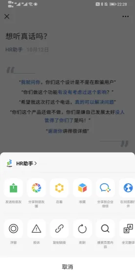

3.选择页面底部的【侵权（冒充他人、侵犯名誉等）

    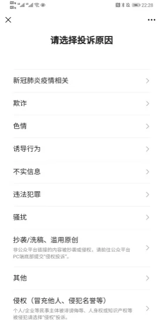

4.选择【内容侵犯名誉/商誉/隐私/肖像】

    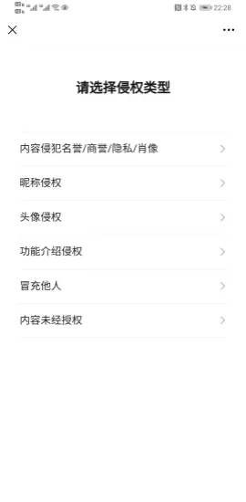 

5.被侵权主体选择【个人类型】

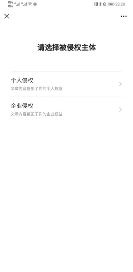

 

6.投诉范围选择【局部内容投诉】，即可进入投诉流程

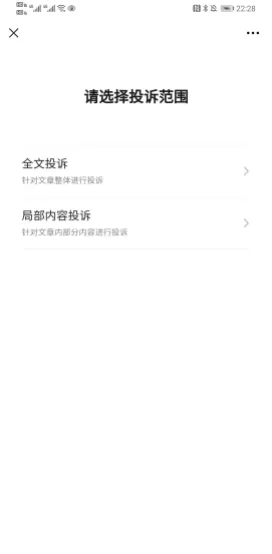

**二、投诉流程**

1.填写投诉人姓名+身份证号

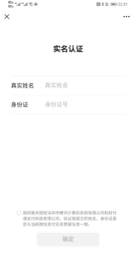

 

2.选择投诉人身份：权利人/代理人

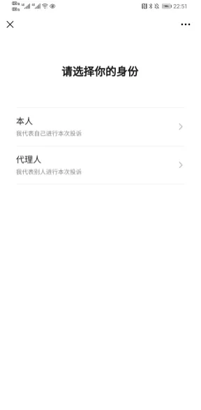

 

3.上传手持身份证照片

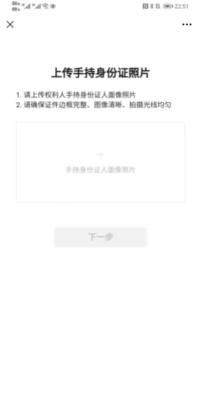

 

4.长按文字选取投诉内容

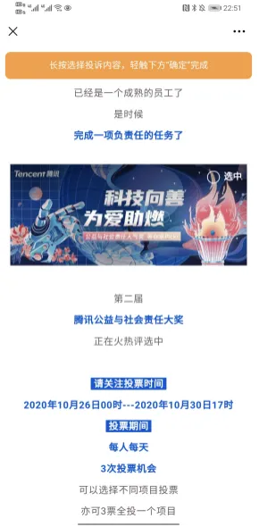

 

5.在投诉详情页完善相应的投诉信息

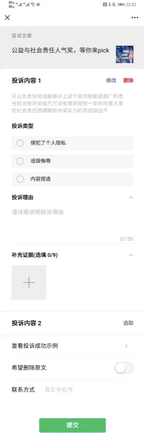

 

6.完成投诉提交，平台收到后会尽快进行审核 

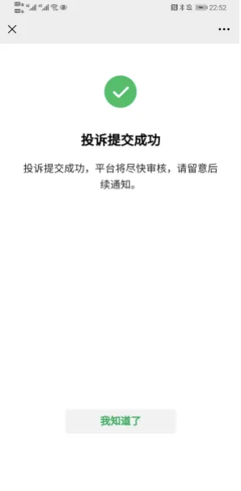