# 2021年度国内酒店集团盘点——锦江篇

> **作者**：不同的角落  
> **发布时间**：2022年1月6日 22:07  
> **原文链接**：[2021年度国内酒店集团盘点——锦江篇](http://mp.weixin.qq.com/s?__biz=MzU4OTczMzkwNw==&mid=2247486565&idx=1&sn=f2af1bb53949ba019bd1ddafc2b49ddc&chksm=fdc84519cabfcc0f2901d3ebe231618704ad14392a358a3092915323d49ff2fae9e7542f761f&scene=21)

---

全球第二大酒店集团，国内第一大集团，大而不强的锦江，2021年再度用一系列令人眼花缭乱的神操作，完美诠释了锦江集团以折腾会员为己任，将折腾会员进行到底的企业理念；完美展现了其没有不专业只有更不专业的的企业风采。

1、2021年1月18日，锦江会员积分体系再度变更，将原来的尊享积分和标准积分合并为锦江积分，标准积分余额按1:1比例转换为锦江积分，尊享积分余额按1:2比例转换为锦江积分，又重新恢复到2018年12月18日推出尊享酒店前只有一种锦江积分状态。

2、2021年1月18日，锦江变更储值规则，由单次储值1元至5000元任意整数金额变更为单次储值只能998元、2998元、4998元三档。

3、2021年2月1日，锦江酒店APP恢复签到功能，签到可以获得积分和优惠券。

4、2021年2月1日，锦江解除官方渠道点评里的锦江会员ID屏蔽，锦江于2020年对官方点评会员ID进行了屏蔽，所有会员ID只显示为两种，所有实名点评用户ID信息显示都是“此用户没有留下联系信息”，如果点评时勾选了“匿名点评”则显示为“匿名用户”。

锦江发音：锦江旗下门店员工在锦江官方渠道自己刷好评的事情你们居然都知道了，本来以为屏蔽会员ID后你们就看不出来了呢！！！

屏蔽会员ID后你们居然把所有好评都当成是酒店员工刷的了，其实我们锦江旗下门店员工只刷了部分好评，不是全部啊！！！

现在解除锦江会员ID屏蔽，让你们看看不是所有好评都是锦江门店员工自己刷的，还有一部分好评是锦江会员真实点评，还我锦江清白！！！

5、2021年2月2日，锦江收购的丽笙旗下上海兴国宾馆丽笙酒店升级为上海兴国宾馆丽笙精选，成为丽笙精选品牌亚太首店，上海兴国宾馆丽笙精选可以对标洲际旗下的国内唯一一家洲际历史经典酒店上海瑞金宾馆洲际酒店。

由丽笙酒店升级为丽笙精选后，锦江会员对锦江旗下所谓的高端酒店同样还是和之前一样不感冒。

从2019年7月国内18家丽笙系酒店上线锦江官方预订平台后，到2021年12月31日两年半时间内，锦江官方预订平台上海兴国宾馆丽笙酒店仅有我当初入住后给的一个点评。另外奇怪的是我四项给的都是5分好评，锦江酒店APP上显示是4.7分，等到2021年6月丽笙系4个高端品牌下线后于2021年7月恢复上线后，又上调成了4.8分（同期发现锦江酒店APP上很多酒店评分也都上调了，包括一些没有新增加点评的酒店）。

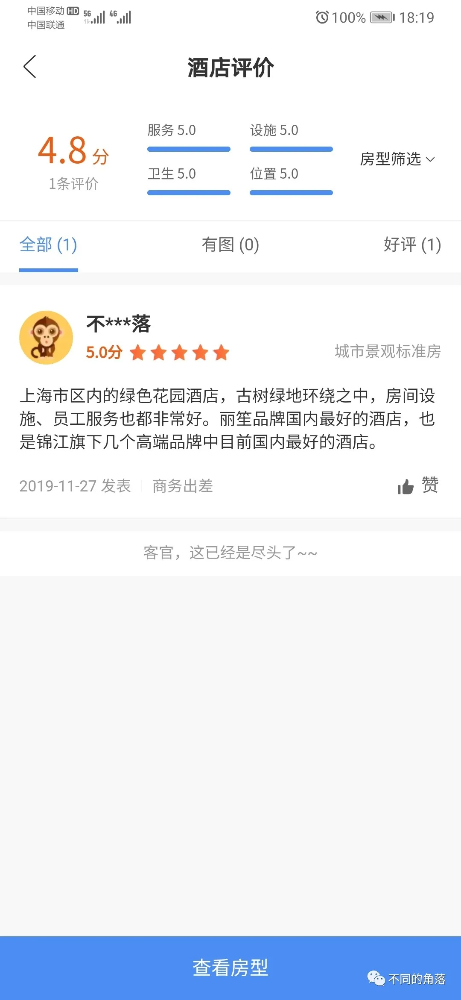

上海西郊庄园丽笙大酒店仅有我（首个点评）与另一位会员的2个点评，

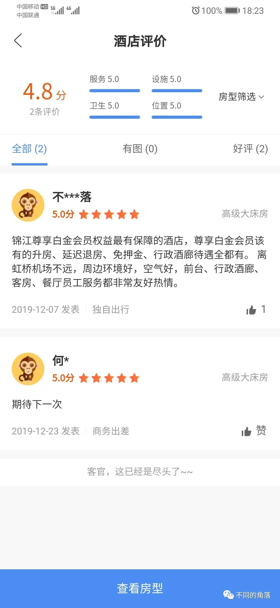

上海宝龙丽笙仅有1个点评，上海新世界丽笙7个点评，上海宏泉丽笙更是早就翻牌为君亭酒店集团旗下上海白厦pagoda君亭设计酒店。

6、2021年3月，锦江会员储值增加200元和498元两档，并且强行捆绑超级会员卡，变更后各档储值不能全额转为储值金，分别为：

200元（170元储值金+超级会员季度卡+优惠券）、

498元（400元储值金+超级会员半年卡+优惠券）、

998元（850元储值金+超级会员半年卡+优惠券）、

2998元（2700元储值金+超级会员年卡+2000锦江积分+优惠券）、

4998元（4600元储值金+超级会员年卡+3000锦江积分+优惠券）。

7、2021年3月18日，锦江酒店中国区系列品牌中的40个有限服务酒店品牌，包括被拉进尊享酒店充数的丽柏、丽怡、丽亭、郁锦香、欧暇·地中海品牌以及所有非尊享酒店品牌，在锦江官方渠道线上预订（不包括在维也纳、丽笙、卢浮官方平台预订），会员在不同品牌酒店享受统一会员折扣和延时退房权益，会员早餐权益还是不保证，多个品牌白金入住还是无早餐。具体为：

线上预订折扣：蓝卡 95折、银卡 9折、金卡 8折、白金卡85折。

延迟退房时间：蓝卡 12:00、银卡 13:00、金卡 14:00、白金卡15:00。

会员早餐权益还是不保证，多个品牌酒店白金会员入住还是无早餐。

8、2021年3月30日，锦江旗下原上海白玉兰宾馆翻牌为丽笙旗下上海五角场丽芮酒店。锦江由白玉兰宾馆衍生出了白玉兰品牌，但上海白玉兰宾馆却不是白玉兰品牌，之前一直是锦江都城品牌，白玉兰品牌很多都是由原锦江之星品牌门店升级改造。

9、2021年6月10日，锦江创始店同时也是锦江品牌服务最不专业的上海锦江饭店举办70周年店庆活动。

10、2021年6月19日，锦江旗下奢华五星酒店品牌J酒店上海中心试营业半年后正式开业，房价3400多元起（现在是3800多元起），成为锦江旗下房价最高酒店，也是全球酒店公共区域最高的酒店，全球酒店客房最高的酒店还是广州瑰丽。

11、2021年6月19日，锦江酒店APP下线了锦江旗下丽笙系列丽笙精选、丽笙、丽筠、丽亭4个高端品牌国内酒店，丽笙系列的丽芮、丽怡、丽柏3个中档品牌国内酒店并未下线。

我打电话给锦江客服咨询，锦江客服告诉我说酒店下架就是不和锦江合作了，不是锦江旗下酒店了，和锦江没有半毛钱关系了。我问客服确定不，客服告诉我确定。

我再打电话给丽笙客服咨询，丽笙客服告诉我只是暂时调整，过段时间还会上线，一个多月后重新上线了。

12、2021年6月，锦江在锦江酒店APP、锦江会员俱乐部微信公众号、锦江趣旅游微信公众号上开始力推浙江达人旅业随心宿299元单次卡。

特意购买了一张单次卡，等到预订时和猜想的一样，很多当初宣传名单中的酒店已经全部消失（温州香格里拉、温州空港万豪、绍兴大禹开元观堂、杭州天域开元观堂等），很多日期只有一两家民宿可以预订，最后预订了一家二线城市下辖县城下面一个乡村已经从花筑APP下线的民宿入住了一晚。

13、2021年7月，锦江再度力推浙江达人旅业随心宿899元年卡，**想起之前的如程、半边山下、寄居蟹**。

14、2021年7月1日，锦江旗下维也纳绅士会常旅客会员计划取消，维也纳绅士会合并到锦江会员俱乐部常旅客会员计划。

原绅士会会员可按不同的等级匹配锦江会员，并以合并当天（2021年7月1日）为起始，设置会员等级保护期（原维也纳绅士会会员只有绅士卡才需要保级，每年8晚保级，其余等级都不需要保级；锦江银卡、金卡、白金卡明面上还都需要保级）。

若用户既有绅士会员卡也有锦江会员卡，则合并之后的锦江会员等级就高原则体现。

原维也纳绅士会积分1:1转换为锦江会员积分。

神奇的是原维也纳至尊钻石卡匹配了2年半锦江白金，比维也纳至尊钻石卡高一级的绅士卡却能匹配一年半锦江白金，绅士卡是维也纳会员体系里唯一需要保级的会员等级，保级不成功降为至尊钻石卡。

15、2021年7月1日，上海扬子江丽笙精选酒店（原普通五星档次的上海扬子江万丽酒店）、上海丽笙精选海仑宾馆（原四星级的上海索菲特海仑宾馆）、南京丽笙精选度假酒店开业，本来以为丽笙精选可以对标洲际历史经典酒店，现在发现丽笙精选品牌成了大白菜。

**扬子江万丽翻牌为丽笙精选后，万豪白金及以上会员可以拨打扬子江丽笙精选酒店电话免费匹配为丽笙丽赏会金卡会员（无早餐无行政待遇）和锦江白金会员（有早餐有行政待遇），本来以为活动搞半年就差不多结束，2022年1月4日晚上我打电话问酒店，酒店告知目前仍旧可以免费匹配**。

16、2021年7月中旬，锦江会员入住非尊享酒店部分品牌早餐权益变更，但还是限会员预订正价房才享受免费早餐权益，丽枫、潮漫、ZMAX等多个品牌还是无早餐，锦江都城品牌酒店早餐由1人升级至2人，但锦江都城经典品牌的单人免费早餐权益消失（最初是免费双早权益）。

锦江官方宣传锦江都城品牌时都会用锦江都城经典品牌酒店来举例提高锦江都城牌高大上形象，给锦江都城品牌会员权益时就把锦江都城经典品牌一脚踢开了，毕竟6家锦江都城经典门店早餐都贵（68元到108元），取消免费改成收费能给一切朝钱看的锦江带来很大创收呢。

17、2021年7月29日锦江在线微信公众号、7月30日锦江豪华酒店微信公众号、7月31日锦江都城酒店微信公众号相继发布相同内容推文，锦江都城微信公众号把董先生的出生年份写成1990年，我当天留言提出质疑半个多月后，于2021年8月17日终于做出了修改。

。

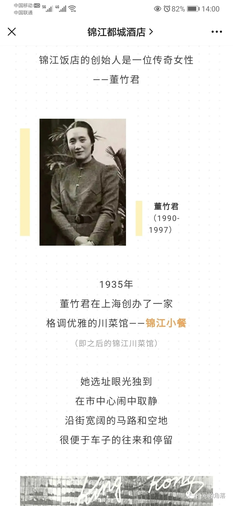

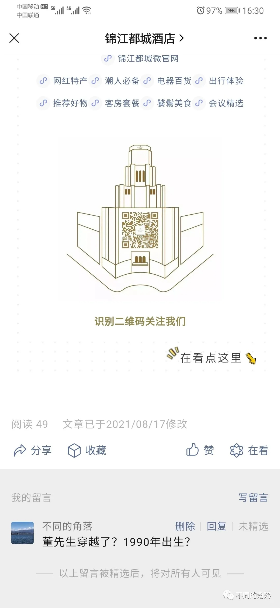

18、2021年8月，锦江在锦江酒店APP、锦江会员俱乐部微信公众号、锦江趣旅游微信公众号力推四川享筑旅业的1398元（后期899元）的享筑尊享会员权益年卡，宣称一晚回本，除了宣传中的几家高大上国际连锁品牌酒店外，还有多家100多元到200多元起的民宿，恰好其中有3家花筑民宿是我住过的，一晚回本是根本不可能的，目前其中2家已经从花筑APP下线。**再次想起如程、半边山下、寄居蟹**。

19、2021年11月4日19:30，锦江会员俱乐部直播间推出限时积分房五折兑换活动。

想起2019年双11锦江的尊享酒店五折兑换活动，锦江豪华酒店微信公众号11月9日推文宣称2019年11月11日10点开始锦江尊享酒店五折积分兑换（10000积分、15000积分、20000积分酒店各自可以五折兑换一次）。

结果从11月11日10点守到10点半也没有五折兑换，打电话给锦江客服，也联系了锦江微信客服，都告知我活动已经结束了（活动都没开始就结束了？这个顺序也不对啊），我问她们锦江的领导是不是都是离婚在前、结婚在后，锦江客服表示很迷惘，不清楚锦江领导的婚姻和X生活。之后三天又多次电话沟通，锦江客服终于相信五折兑换尊享房活动的确没有上线，反馈后于2021年11月14日晚上终于开启五折积分兑换（锦江豪华酒店微信公众号于11月14日晚上重新发了推文），活动刚开始时还出现了大BUG，火速撸了BUG第一单，看到后续又有4人撸了BUG后才恢复正常。

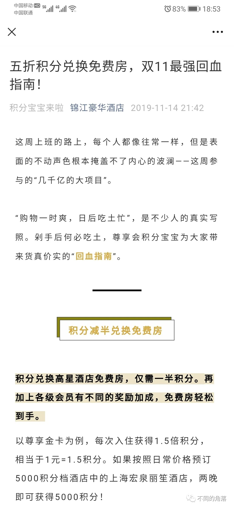

20、2021年11月下旬，锦江取消白金会员五折兑换尊享酒店权益，11月中旬时锦江酒店APP里会员福利里还写着白金会员每年可以五折兑换原价20000/30000/40000积分尊享酒店各一次，到下旬就突然消失了。

21、2021年11月30日，维也纳酒店APP升级为锦江酒店APP，锦江终于完成了旗下国内酒店APP的整合，由当初的锦江礼享APP、锦江都城APP、锦江之星APP、铂涛旅行APP、维也纳酒店APP五合一，整合为一个锦江酒店APP。

以后再也看不到维也纳酒店APP上门店员工经典的维也纳式刷好评了，经典难再现，遗憾啊！！！

回顾一下维也纳系列品牌酒店在维也纳酒店APP自己刷好评的经典时光。

      2020年10月3日查询的一家维也纳酒店实时点评如下，又任意查询了其它几十个城市的几十家维也纳系列酒店，也都是同样情况。

某个城市2020年6月6日开业的酒店，其在维也纳酒店APP上线开放预订应该是在开业半个月后6月21日前后，同一个ID到7月下旬刷了90多个好评，最开始的几个点评还多写了几个字，后期就全部都是只有“好评”两个字了，基本上2秒间隔一个好评，最搞笑的是前面的点评有一条还写了“一个月总要来酒店住几天”，一个月住几天就住了90多天写了90多个好评。  
    先看下这家酒店在锦江APP上的评价，只有7个点评，平均分是3.9分。

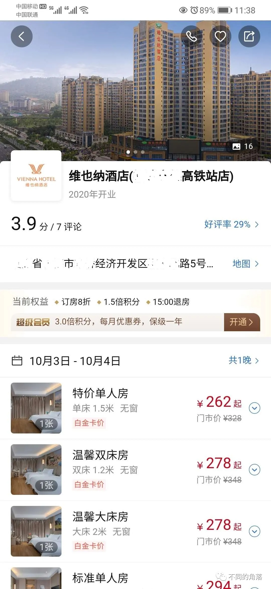

     再看下这家店在维也纳APP上的评价，241条点评，平均分是5分。

     2020年6月26日会员HZ6开头这位是真实点评，也是该维也纳酒店在维也纳APP上的第一个和第二个点评，都是给了4分，之后2020年6月27日开业一个多月住了90多间夜刷了90多个好评的第一个ID：EP8\*\*\*\*\*209闪亮登场承包了之后的一个多月点评。

  一开始为了显得真实点，几个点评还是都多写了几个字的，还特意写明每个月来几次。

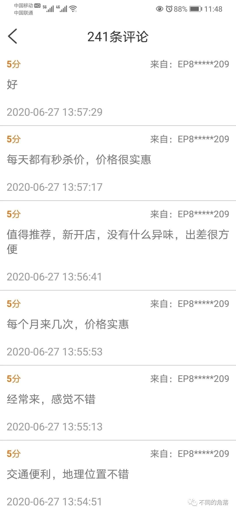

     前面点评还是一个月住几次，现在就变成持续住了一个多月，然而酒店是6月6日才开业的，维也纳APP上线开放预订应该是在开业半个月后6月21日前后。

没过几分钟这又变成了每个月来几回，这到底是来几回还是来几回呢。

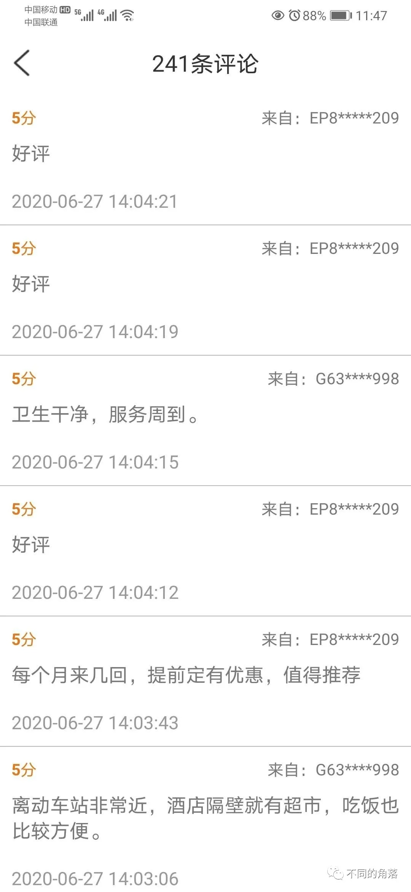

之后就开启两个字点评模式了，到6月29日已住了50多晚50多个好评了。

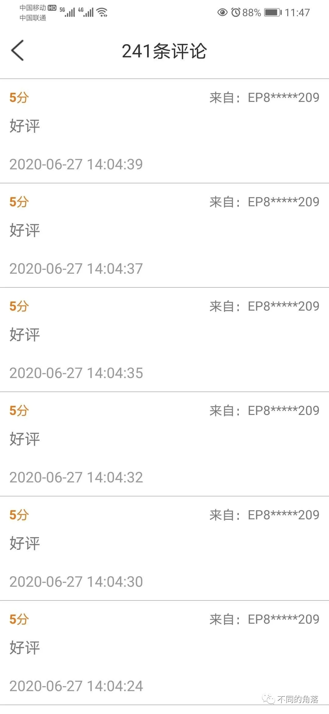

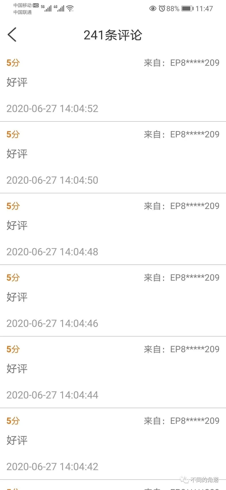

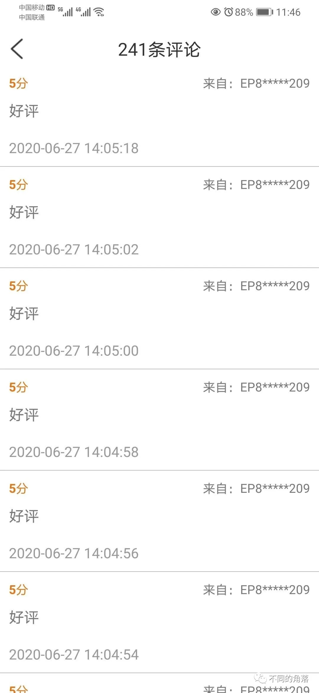

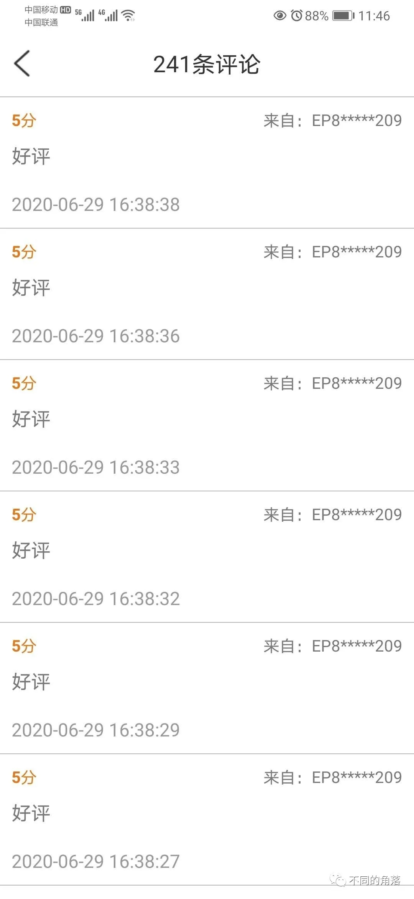

到7月26日又住了差不多50晚（图片太多只上了7月首末两个点评订单），这也是超能力啊。

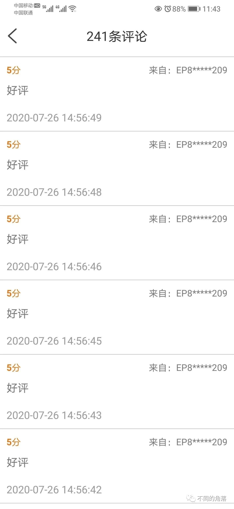

再来看该酒店另一个同样发了90多个评价的选手，和上面的选手应该是亲兄弟，会员号挨着，EP8\*\*\*\*\*210,随便截图发一张，其它都是同样两字，同样差不多2秒一个好评。

今后只能在锦江酒店APP欣赏希岸系列品牌门店与维也纳系列品牌门店双雄刷好评对决了，让我们拭目以待看看哪个品牌系列能刷得更高刷得更强。

22、2021年12月27日，锦江酒店APP上线发布锦江豪华间经典酒店会员，与2018年12月18日刚发布锦江尊享酒店会员时相同，将锦江嫡亲的三个高端品牌J酒店（1家）、昆仑（2家，北京昆仑和上海昆仑，上海昆仑是原国内第一家希尔顿酒店上海静安希尔顿酒店于2018年1月1日翻牌，上海昆仑创造了一项全球酒店史奇葩记录，从翻牌为昆仑后，锦江旗下明面上的最高级会员锦江白金包括短暂生存一年多的锦江尊享白金，在上海昆仑只享有一份免费早餐和一份行政待遇；而从2016年起就烂大街随便免费匹配的希尔顿钻卡会员，从一切非锦江官方渠道预订入住上海昆仑，都可以享受原希尔顿钻卡会员待遇双人免费早餐双人行政待遇，持续给了三年从2018年1月1日到2020年12月31日，这是多么伟大的国际主义精神），锦江（55家，2013时64家，2020年时63家）。

2021年12月28日，锦江酒店APP由5.4.0版更新至5.5.0版，重新发布豪华经典酒店会员权益，除了J酒店、昆仑、锦江这三个划至豪华经典酒店品牌外，以及丽笙精选、丽笙、丽筠、丽亭（仅限北京丽亭1家）外，其余品牌国内会员计划更名为优选酒店会员计划。

豪华经典酒店会员权益如下：

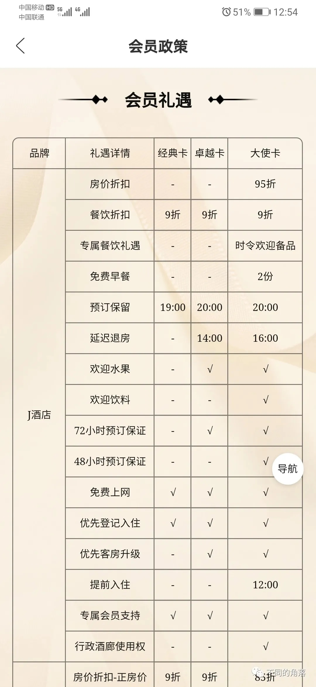

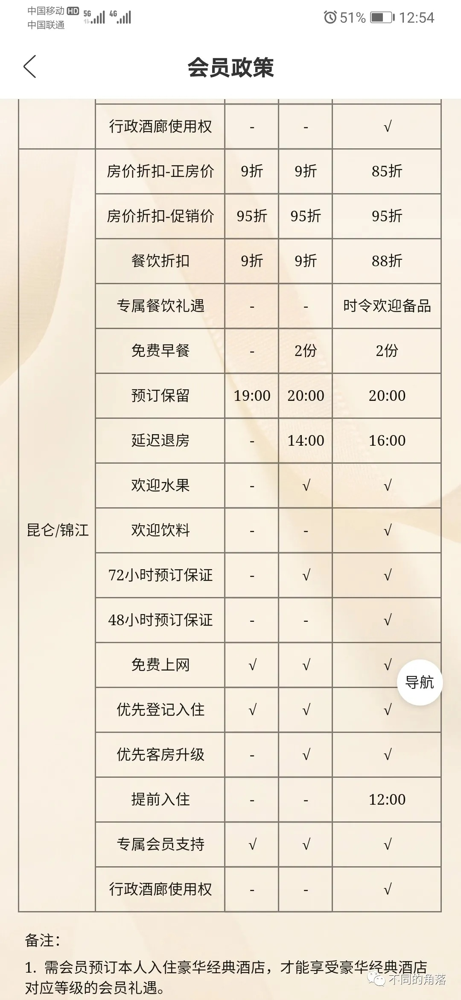

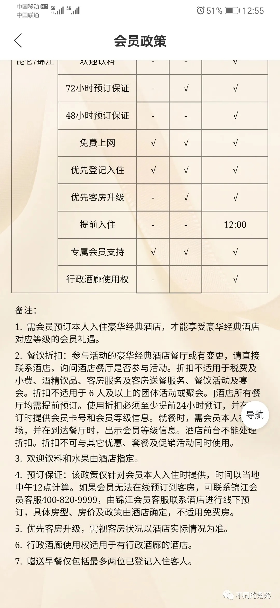

**其中备注4明确写明仅有预订保证不适用于免费房。**

2021年12月30日第二次入住上海锦江饭店，之前积分兑换的免费房，已领取卓越卡，锦江饭店锦楠楼一位20多岁瘦高个大堂经理，还有前台两位员工（一男一女都是30多岁，个子都不高，身体都发福），对上面豪华经典酒店会员权益备注4的解读就是免费房不享受一切豪华经典酒店会员待遇，问他们如果是这样，直接备注里写一条免费房不享受会员权益不是更简单明了，大堂经理说备注4按照他们的智商解读就是同一个意思，说的就是一切会员权益部适用于免费房。

打电话给锦江客服，接电话的男客服不知道豪华经典酒店会员，过一会儿打电话过来说按照他的智商解读，也是免费房不享受一切会员待遇。

告知锦江酒店锦楠楼员工他们和锦江客服的解读有误，提出要找锦江饭店总经理或是房务总监、前厅经理等有可能了解会员权益的管理层，被无视，要电话也不给，想想咱不是洋大人也不是达官显贵，这个情况也正常，毕竟锦江饭店一向看人下菜碟。

最终当天仅享受到了免费上网权益，锦江饭店居然没向我要上网费，实在是感谢锦江集团管理层和锦江饭店总经理十八辈祖宗啊！！！

打了上海12315投诉了上海锦江饭店与锦江国际酒店管理有限公司，从12月30日至今未收到上海12315工作人员回电（毕竟锦江是上海国资委旗下代表上海形象和地位的国企，在上海能量还是相当大的，毕竟是全球老二）。

2018年12月18日锦江推出尊享酒店会员后，我的锦江白金卡变成了锦江礼享白金和锦江尊享金卡，本着支持民族品牌民族酒店的想法，入住20S升级到了锦江尊享白金，又住了10S保级完尊享白金，结果锦江推出98元保级尊享白金活动，锦江尊享白金与锦江礼享白金开启支付宝免费匹配，后期又合并锦江礼享白金与尊享白金，恢复到推出尊享白金前。

这次本来还想继续支持一下民族品牌民族酒店近期多住锦江品牌酒店升级大使卡，毕竟是董先生创建的品牌，可现在发现实在是不值得支持，锦江品牌越做越少不是没有原因的，能在几次店庆时都把锦江品牌锦江酒店创始人董先生从酒店历史抹去，割断锦江饭店前身革命贡献历史的酒店集团，一家能给其它酒店集团高级会员远超自家最高等级会员权益的酒店集团，**不服不行！！！**

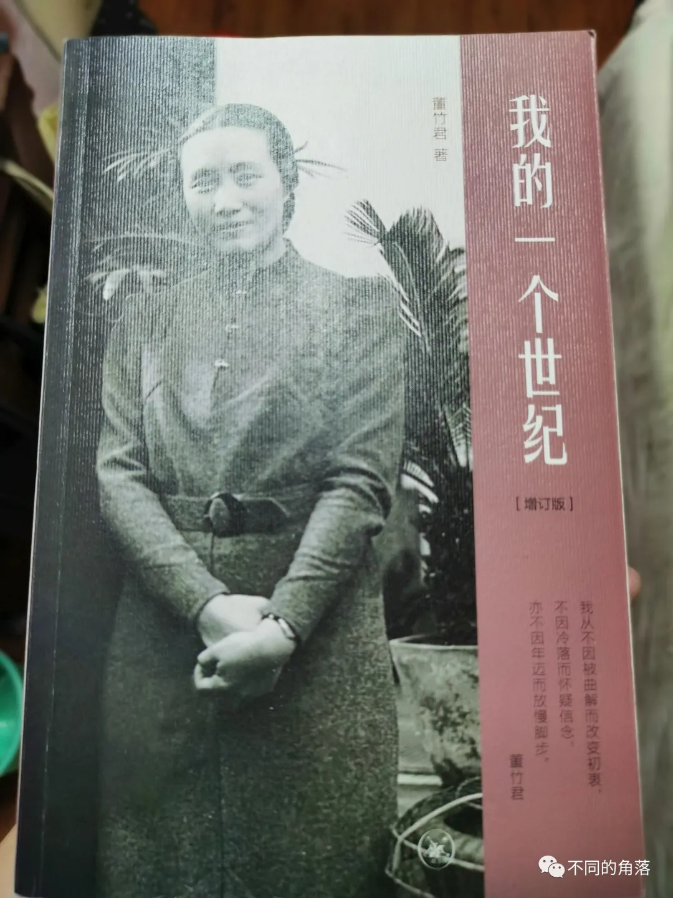

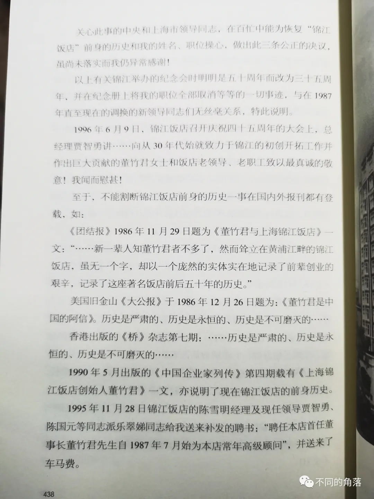

董先生自传《我的一个世纪》里文章截图，建议所有锦江旗下酒店员工都看一遍董先生这本书。

       23、2021年12月31日，锦江酒店APP再度下线签到功能。

24、2021年不知几月起，锦江酒店官方订单会员点评需要审核，审核通过才会显示，上传正常会员权益截图都会提示审核不通过。2022年1月4日给上海锦江饭店做了点评，现在还是显示审核中，估计是不会审核通过了，毕竟这样又少了一个差评，点评里上传的锦江豪华经典酒店会员权益和董先生《我的一个世纪》书中内容截图，也只有一张通过，果然很锦江。

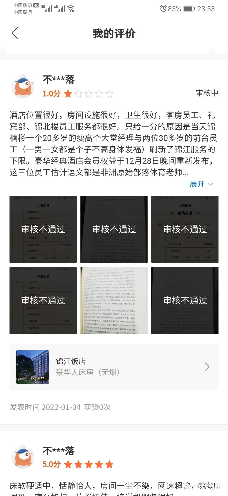

可惜了董先生创建的品牌，现在居然如此之滥，难怪酒店规模排名全球第二，但是酒店市值、营收、利润基本上都只能在第十位徘徊，被酒店规模排名其后的多家酒店集团吊打。

支持了锦江这么多年，住过2家昆仑几十家锦江还有其它品牌多家酒店，感觉值得入住体验的酒店真不多，还是推荐一下入住过的一些在硬件设施、环境风景、历史文化等方面不错的锦江旗下酒店（个别酒店别考虑服务）。

上海兴国宾馆丽笙精选

上海虹桥西郊庄园丽笙大酒店

上海中信泰富朱家角锦江酒店

上海锦江饭店

上海锦江金门大酒店

屏边大围山锦江度假酒店

文山凤凰锦江大酒店

江苏锦江南京饭店

锦江都城经典上海外滩新城饭店

锦江都城经典上海南京东路外滩酒店

锦江都城经典上海南京饭店

锦江都城经典上海青年会人民广场酒店

上海外滩郁锦香新亚酒店（原锦江都城经典上海外滩新亚酒店）

                                                                            更多的酒店行业资讯、酒店常识、酒店集团、酒店入住体验、航空常识、沈阳旅游等相关内容可以到我的微信公众号里查看。

也欢迎大家关注我的微信公众号：**sfk024**

公众号名称：**不同的角落**

在微信公众号搜索sfk024或是不同的角落都可以搜索到，也可以直接扫码或长按识别下方二维码关注。

