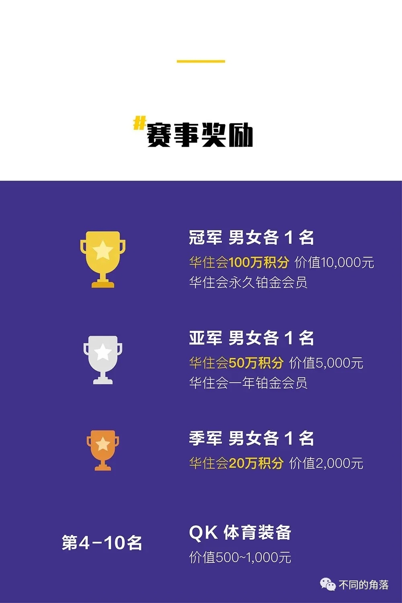
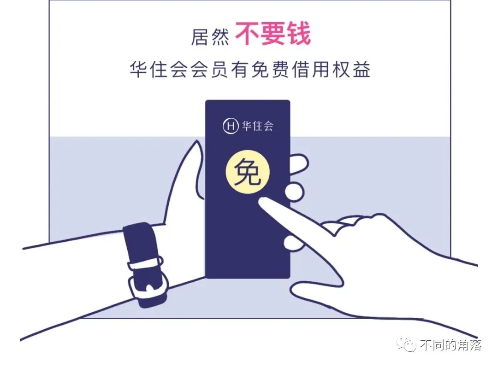
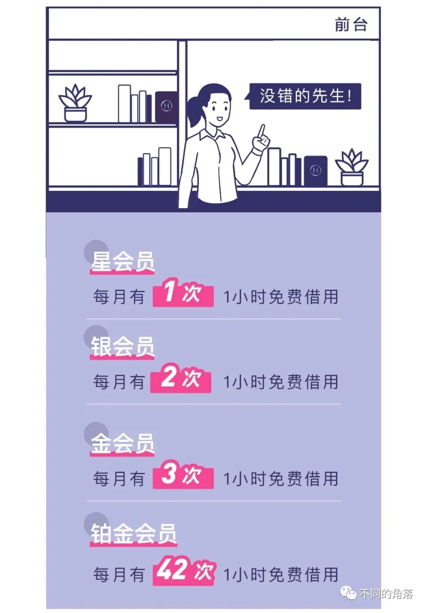
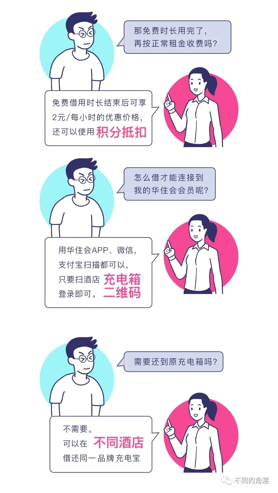
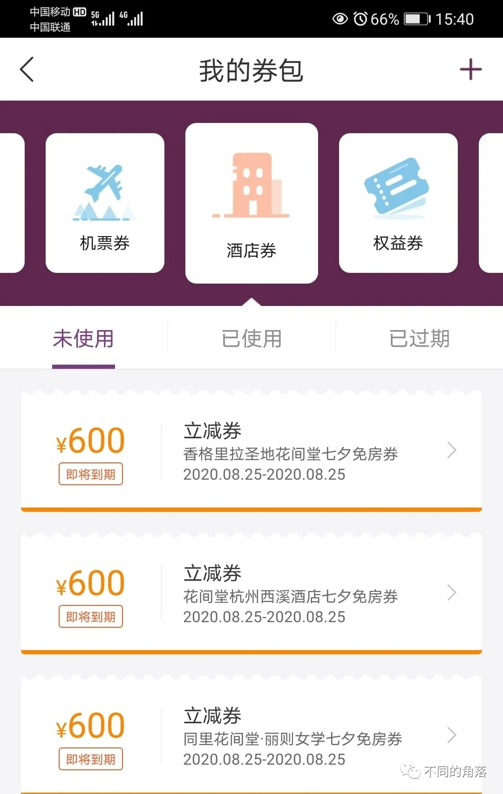
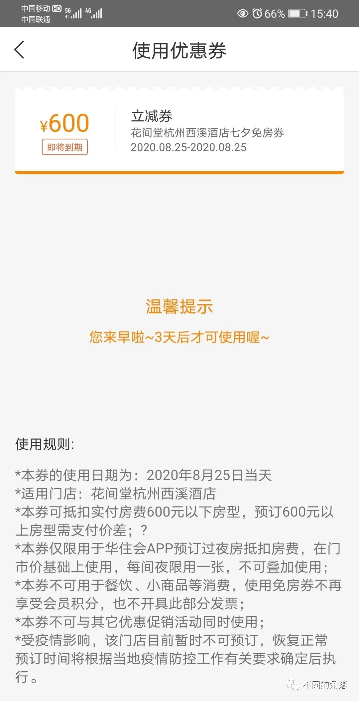

# 2021年度国内酒店集团盘点——华住篇

> **作者**：不同的角落  
> **发布时间**：2022年2月4日 20:44  
> **原文链接**：[2021年度国内酒店集团盘点——华住篇](http://mp.weixin.qq.com/s?__biz=MzU4OTczMzkwNw==&mid=2247487027&idx=1&sn=b1f819190f1534f66fe388cc27dde8ad&chksm=fdc8474fcabfce595e2c542cb58aa3c5799fc5c1c9d53502b424a3e9b7d507eb5271027e991c)

---

1、2021年1月起，华住会员入住美居品牌（限华住特许经营的国内美居品牌门店，雅高运营的几家美居品牌门店不享受华住会员权益）酒店权益升级，金卡会员退房时间延至15点，铂金卡退房时间延至16点。

2、2021年1月，华住西藏自治区成立，规划三年开出100家酒店，开店规模做到当地第一，318沿线布点，运营质量、产品质量、服务质量有质的提升，成为西藏标杆。

几年前住过一次拉萨的全季酒店，是住过的所有全季酒店里唯一一家不给铂金卡会员提供早餐的全季，酒店的理由很充足：没有餐厅。

住过其它一些没有餐厅的华住旗下酒店，或者是让会员到酒店合作的餐厅去吃早餐，或者是有合作的早餐商家送早餐到酒店，酒店再送早餐到客人房间。

华住旗下品牌除了海友外，其余品牌铂金会员/金会员官方渠道预订入住都有免费早餐权益。

3、2021年1月18日，华住旗下汉庭杭州四季青服装市场店，成功开出国内酒店行业首张电子专票。

4、2021年2月起，华住员工通过华住会APP预订禧玥/花间堂/美爵/诺富特品牌部分酒店，可享当日最优价格6折。

相比之下，一些国际连锁酒店集团的亲友价是当日最优价格五折，员工价折扣还要更低。

5、2021年3月16日，网易云音乐独家首发左罗乐团单曲《江浦街的汉庭酒店只有雨季》，由左小祖咒&罗永浩进行词曲创作，比左小祖咒几年之前创作的钢琴曲《决定住在汉庭酒店》要好听，吴蓓雅演唱的版本比左小祖咒演唱的版本要好很多。

6、2021年3月22日，华住与融创文旅宣布成立合资公司—永乐华住，永乐华住公司将管理运营施柏阁、施柏阁大观、堇山、堇悦、花间堂、花间系列、宋品、永乐半山、凤栖桃源等品牌酒店。

7、2021年3月28日华住会员日，推出积分1折兑换房券、1000积分兑换华住铂金会员、100积分兑换华住金会员活动。

之后有几期会员日活动也有1000积分兑换铂金卡、100积分兑换金卡活动。

有时有1积分抽汉庭免房券和早餐券活动。

有时还有28积分抽盲盒活动，奖品有免房券、蓝牙音箱、保温杯、行李箱等。

每天华住会APP签到，攒100积分很容易，攒1000积分需要连续签到三个月多。

8、2021年3月28日起，华住取消个人玫瑰金会员，针对2021年3月28日前注册的玫瑰金会员，自2021年3月28日起将升级为个人金卡会员。

9、2020年4月1日起，企业员工使用绑定企业卡的个人会员卡进行预订且本人实际入住具有“华住会权益”标签的酒店时，员工个人会员账户按照企业会员等级对应的个人会员等级累积积分（企业银会员按个人银会员规则累积、企业金会员按个人金会员规则累积、企业铂金会员按个人铂金会员规则累积）。

10、2021年4月，华住会•跑遍中国2021年10KM巡回赛上海站，一对情侣选手分别获得男女组冠军，各自获得华住会100万积分和华住会永久铂金会员。

后续的华住会•跑遍中国巡回赛武汉站，冠军奖励也是华住会100万积分和华住会永久铂金会员。

11、2021年4月，长兴花间堂•沂水开业，位于湖州市长兴县水口乡顾渚村苗山自然村，共有108间客房。

12、2021年4月7日，华住酒店集团人力资源部主办的“首届华住文化峰会暨真shan美报告会”在华住集团吴中路699号中庭盛大举行。11位年度真shan美候选人受聘“华住荣誉体系明星顾问”。

13、2021年4月，华住旗下的德意志酒店集团创建施柏阁大观酒店品牌，把一些风格独特的施柏阁品牌酒店划为这个品牌。也可以理解为施柏阁Plus。

14、2021年4月17日，全季官方发布全季人集体承诺，全国各岗位积极做好防疫，让更多人安心享受美好的假期。严苛执行36道客房消杀步骤，从公区到房间75个点位彻底消毒，为每位住客提供360度无死角的安心住宿体验。

之前国内多地全季门店都有曝出过卫生问题上过新闻，当然不止是全季，华住旗下其它品牌和各大国内/国际连锁酒店集团旗下多家酒店也都曝出过卫生问题。我个人入住过的万豪旗下万豪、万丽、喜来登酒店就曾遇到过房间里有蠼螋、蚂蚁、蟑螂等卫生问题。

15、2021年4月，华住会与京东PLUS开展合作，京东PLUS会员每月可以领取88折优惠券（相当于金卡折扣）和早餐券，6月起又增加了延时券，数量也改成了每种每月领两次。

16、2021年4月21日，华住员工大会暨15周年庆在上海开幕，评选出了年度真shan美人物。

17、2021年5月29日，施柏阁品牌国内首店济南融创施柏阁酒店开业，共有258间客房。

18、2021年5月29日，宋品品牌国内首店济南凤鸣宋品酒店开业，共有60间雅致静谧的中式院墅套房。

19、2021年6月，禧玥品牌会员日上线，6月每周一禧玥会员日，会员通过华住会APP预订禧玥酒店，铂金会员6折，金卡会员7折。

20、2021年6月，南京老东门花间堂•朱雀里开业，共有38间客房，是南京的第二家花间堂。

21、2021年6月10日，华住与四川省旅游投资集团及旗下四川旅投锦江酒店有限责任公司正式签署战略合作协议，共同组建合资公司。

四川旅投锦江酒店在中国旅游饭店业协会2020年度中国饭店60强榜单中以30824间客房157家酒店排名第20位，实际截止2020年12月31日开业24家酒店4588间客房，真实排名不能上榜60强榜单。

22、2021年6月25日，华住会员日预热开盲盒活动，奖品有永久铂金卡、酒店试睡、积分翻万倍。

23、2021年7月，华住旗下德意志酒店集团施柏阁品牌与保时捷设计精品集团宣布将于全球范围内的国际化大都市共同打造施柏阁保时捷设计酒店。

24、2021年7月20日郑州暴雨，星程酒店郑州京广路地铁站店（目前暂停营业中，预计春节后恢复营业），在店长孟晓钰的带领下，打开酒店大门，迎接每一位前来避难的陌生人（很多是酒店周边居民），尽可能安排人们在客房和大堂里休息，为他们提供电力、热水和充足的冷气，一直持续到8月2日最后一名客人退房郑州恢复正常。

相比之下，锦江旗下与维也纳系列并列点评zao假最不诚信第一名的希岸系列品牌（希岸酒店创始人及CEO陆斯云），旗下希岸酒店郑州高铁站店（现已退出锦江，加盟首旅如家，貌似酒店股东也已更换）坐地起价200多元的房间涨价到2888元一晚，简直是天壤之别。

25、2021年8月，花间堂子品牌花间系列首店成都青羊宫花间府•三生邸院开业，共有25间客房，酒店前身是青羊宫招待所。

今年1月时对比了一下房价，这家花间府的基础房价比成都瑞吉/成都丽思卡尔顿/成都万达瑞华这三家奢华五星酒店的基础房价都要高。

26、2021年9月1日，华住会所有会员等级顺延6个月有效期。

27、2021年9月，华住会推出会员免费借用充电宝权益。

28、2021年9月27日，华住旗下所谓高端精品酒店品牌花间堂正式发布全新子品牌花间系列。

华住官方宣称花间系列，是花间堂所衍生出的特色高端度假酒店品牌。花间系列着眼于度假生活方式的升级，打造出5个产品类别：城中隐居为府、时髦避世为邸，乡野田园为苑、悠然山岭为岭、傍山临湖为亭。

花间苑、花间岭、花间亭三个品牌没看过实店不予评论，以看过的成都一家花间府一间花间邸来说，应该是花间堂的降级产品。

丽江、苏州等地花间堂很多就是中档民宿，与高端精品酒店定位相距甚远。

花间堂被华住收购后新开业的一些花间堂，有的才有一些中高档度假酒店的样子，但一些门店的管理和服务实在是一言难尽。

2020年8月曾经在华住会APP用北京花间堂•后海600元立减券（当初用400华住会积分兑换了国内4家花间堂4张仅供单店使用600立减券，房价600元内免费，超过600元补差价）抵扣后299元预订了北京花间堂·后海胡同大床房，预订后接到后海酒店值班经理电话，问我是从哪里预订的，说他们酒店没有299元的价格。

告诉他华住会APP上预订的，参加的华住活动100积分兑换600元券，他说他和店总都不知道华住有这个活动，问他来华住多久了，说来了2年多了，问他家店总来华住多久了，说来华住好几年了。

第二天酒店值班经理又在华住会APP给我留言，说在系统里没有查到我的预订，让我留个电话好和我沟通。真的很神奇，在华住会APP里查不到客人的订单还能给客人留言，昨天能查到电话并打过来，第二天就查不到了。

几番沟通之后，酒店说可以正常入住，但是不享受华住会员权益，因为优惠券使用规则写着本券不可与其它优惠促销活动同时使用。

不得不佩服这家花间堂管理团队的智商，华住会很多房价都有不可与其它优惠促销活动同时使用的限制，但只是针对房价，会员权益都是可以正常享受。

比如有时部分门店房价五折、会员价折上八折、提前三天折扣价等，都有不可与其它优惠促销活动同时使用的限制，但这限制是不能再叠加使用10/20/30/50/100元优惠券，或者是房价五折和提前三天折扣价不能再叠加使用铂金会员85折/金卡会员88折，并不影响会员权益使用。

不如预订其它三家花间堂了

600元立减券使用规则。

当天到店，酒店店总在（店总说他原来在北京瑞吉工作），沟通后说是可以正常享受华住会会员权益，永久铂金会员可以升一级到胡同豪华大床房。

看了一下各种房型客房，也就是桔子酒店档次，除了当天铂金会员价2000多元的院落湖景套房（79平米）和4000多元的花间私景套房（135平米）有可以打开通风的窗户，其它房型都是全封闭窗不能打开通风，酒店三栋平行建筑都是三层楼。除了院落湖景套房和花间私景套房外，其它房型窗户都是与院里的相邻楼房客房窗户相对，楼与楼间距并不是很大，在房间时需要全天拉上厚窗帘（不介意对面客房客人观看的不用拉窗帘）。又看了网上评价这家花间堂的早餐还不如汉庭，果断取消299元订单去住了其它酒店。

29、2021年10月1日，青岛阿朵花间堂•岚舍开业，共有74间客房。

30、2021年10月1日，巴中恩阳花间堂•米仓道开业，共有59间客房。

31、2021年10月9日，永乐华住酒店管理有限公司宣布，融创文旅计划将旗下广州、成都、重庆等城市的22家原万达文华/万达嘉华/万达锦华品牌酒店授权至永乐华住进行管理。

32、2021年10月28日，华住官方预订平台上线部分融创系万达品牌酒店，奇葩的是上线的13家已退出万达管理的融创系万达品牌酒店并未更名，还是使用万达文华/万达嘉华/万达锦华品牌名称。

在华住会APP上线的融创系万达品牌酒店有南昌融创万达文华、南昌融创万达嘉华、合肥融创万达文华、合肥融创万达嘉华、无锡融创万达文华、无锡融创万达嘉华、广州融创万达文华、广州融创万达嘉华、桂林融创万达文华、桂林融创万达嘉华、重庆融创万达文华、重庆融创万达嘉华、重庆融创万达锦华共13家酒店，华住会会员预订这13家酒店可享受华住会会员权益。

33、2021年11月5日，华住会发布铂金会员专享施柏阁/施柏阁大观品牌八重礼遇（目前仅限济南融创施柏阁、长沙施柏阁大观、长沙环球融创施柏阁3家酒店可享受）。

华住铂金会员通过华住会平台预订且本人入住，可享受如下八重礼遇，部分权益需要到华住会APP领取会员权益券（24小时入住券2张、客房升级券2张、提前入住券2张、免费加床券2张。领券时间：2021年10月30日至2021年12月31日）：

①、24小时入住，领取“24小时入住”券享入住期间最多24小时权益。

②、客房升级，领取“客房升级”券可享受房间升级至行政楼层，享受行政酒廊接待（如无行政楼层的酒店可升级至套房）。

③、免费Mini Bar。

④、时令靓汤，入住当晚可享受时令老火靓汤。

⑤、欢迎水果及特制甜点。

⑥、提前入住，入住当天上午10点入住。

⑦、延时退房，离店日延迟至16点退房。

⑧、免费加床，领取“免费加床”券后可享受。

34、2021年11月10日，19家原融创系万达酒店更名完成上线华住会，在华住官方预订可以享受华住会会员权益。

已经更名成西双版纳宋品酒店的原西双版纳万达文华度假酒店仍旧未上线华住会APP，这家酒店后来业主变更，融创不再是业主，酒店名称也变更为西双版纳稷泽万达文华度假酒店，又重新上线万达酒店小程序。

首批13家上线华住会APP融创系万达酒店：

①、南昌融创万达文华——南昌融创施柏阁

②、南昌融创万达嘉华——南昌融创永乐半山酒店

③、合肥融创万达文华——合肥施柏阁大观

④、合肥融创万达嘉华——合肥融创永乐半山

⑤、无锡融创万达文华——无锡雪浪宋品

⑥、无锡融创万达嘉华——无锡融创施柏阁

⑦、广州融创万达文华——广州施柏阁大观

⑧、广州融创万达嘉华——广州融创施柏阁

⑨、桂林融创万达文华——桂林雁山宋品

⑩、桂林融创万达嘉华——桂林融创施柏阁

⑪、重庆融创万达文华——重庆山前宋品

⑫、重庆融创万达嘉华——重庆融创施柏阁

⑬、重庆融创万达锦华——重庆融创永乐半山

第二批6家上线华住会APP融创系万达酒店：

①、成都融创万达文华——成都青城宋品

②、成都融创万达嘉华——成都融创施柏阁      

③、昆明融创万达文华——昆明滇池宋品

④、昆明融创万达嘉华——昆明融创施柏阁

⑤、哈尔滨融创万达嘉华——哈尔滨融创施柏阁

⑥、青岛东方影城融创万达嘉华——青岛融创施柏阁

35、2021年11月27日，花间系列花间邸品牌首店成都武侯花间邸•在城汐开业，为2019年开业的成都ATINN・在酒店翻牌。

我去这家酒店看了一下，在成都同等价格我是肯定不会考虑入住这家酒店的。

36、2021年12月2日，华住与京能集团签订战略合作框架协议，双方将在酒店住宿业投资建设、运营管理等方面进行全方位合作。

37、2021年12月，杭州花间邸·鲨鱼SHARQUE开业，为2019年开业的杭州鲨鱼SHARQUE酒店翻牌，这也是花间邸品牌国内第二家酒店。

更多的酒店行业资讯、酒店常识、酒店集团、酒店入住体验、航空常识、沈阳旅游等相关内容可以到我的微信公众号里查看。

也欢迎大家关注我的微信公众号：**sfk024**

公众号名称：**不同的角落**

在微信公众号搜索sfk024或是不同的角落都可以搜索到，也可以直接扫码或长按识别下方二维码关注。

