# 行业资讯：百达星系APP点评造假、开元商祺会APP屏蔽差评、开元旗下酒店品牌更名整合

> **作者**：不同的角落  
> **发布时间**：2022年5月5日 14:09  
> **原文链接**：[行业资讯：百达星系APP点评造假、开元商祺会APP屏蔽差评、开元旗下酒店品牌更名整合](http://mp.weixin.qq.com/s?__biz=MzU4OTczMzkwNw==&mid=2247487711&idx=1&sn=890cd6ba67bd16e92307d408cd22eed1&chksm=fdc859a3cabfd0b5b48f4aad384ab18a8de74300b633fa4ba476efd3d9ed0acf18ddc7866fd3&scene=21)

---

**一、百达星系APP点评造假**

2022年3月1日，百达星系会员计划上线，百达星系APP亮相，开元酒店上线百达星系APP平台。

为了推广宣传百达星系会员体系，老郑真是煞费苦心，带领百达屋系人马无所不用其极，公然在百达星系APP平台发布虚假会员点评。

我3月时在百达星系APP已经注册会员，我在百达星系APP会员信息如下，未曾在百达星系APP预订过酒店。

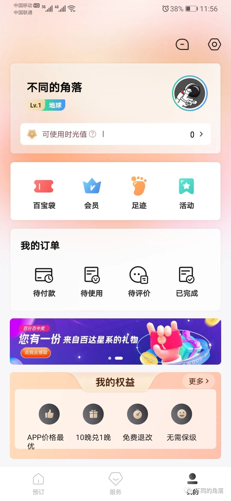

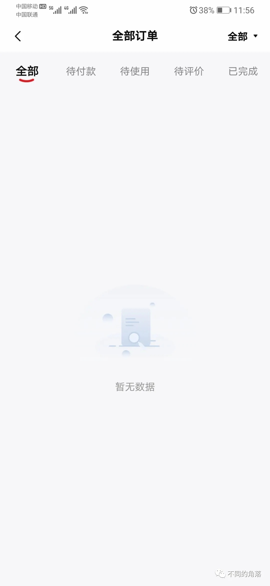

我在百达星系平台会员ID:不同的角落。

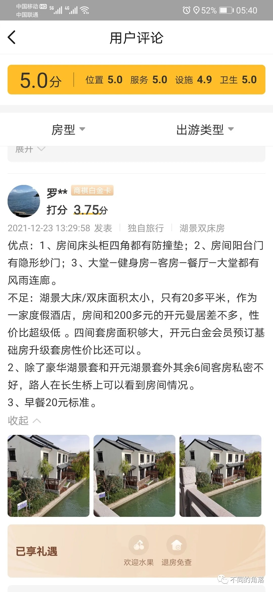

我发布在开元商祺会APP上的点评（嘉兴揽秀园开元观堂）。

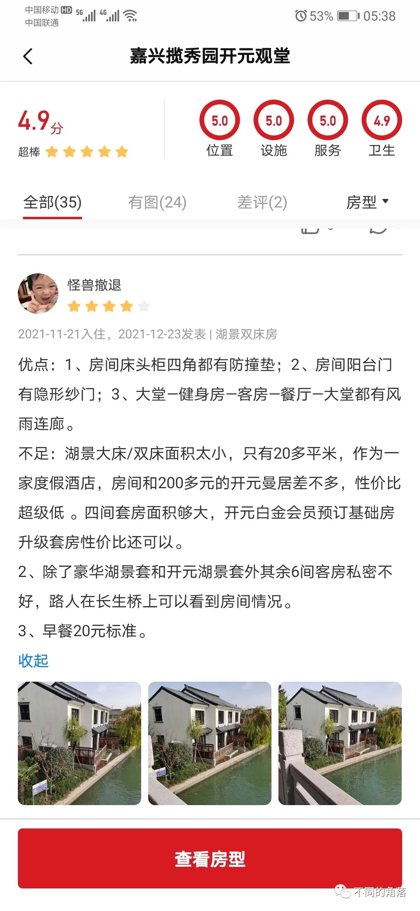

百达星系APP上ID被更名为怪兽撤退的点评。

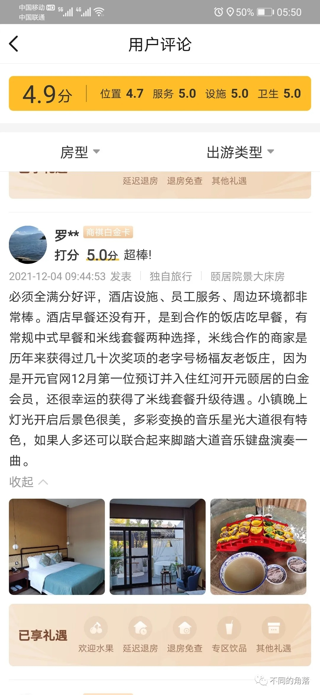

我发布在开元商祺会APP上的点评（红河开元颐居）。

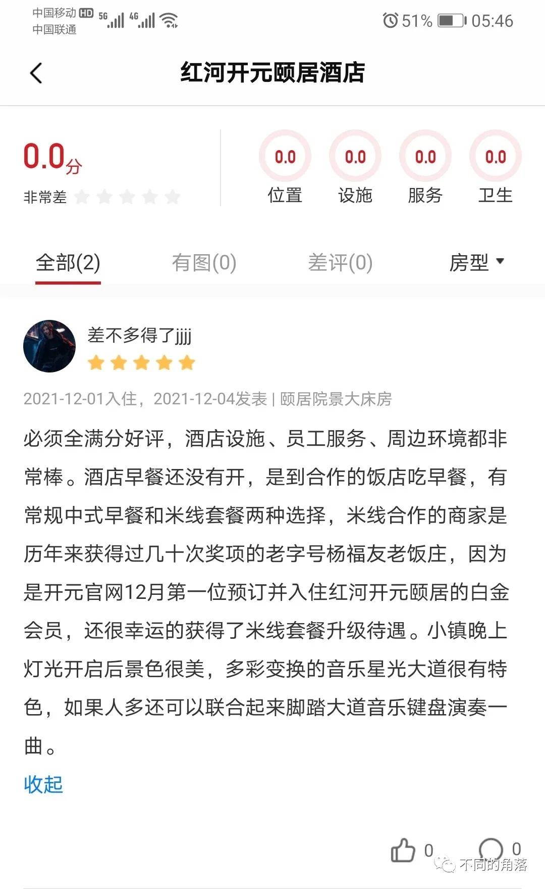

百达星系APP上ID被更名为差不多得了jjjj的点评。

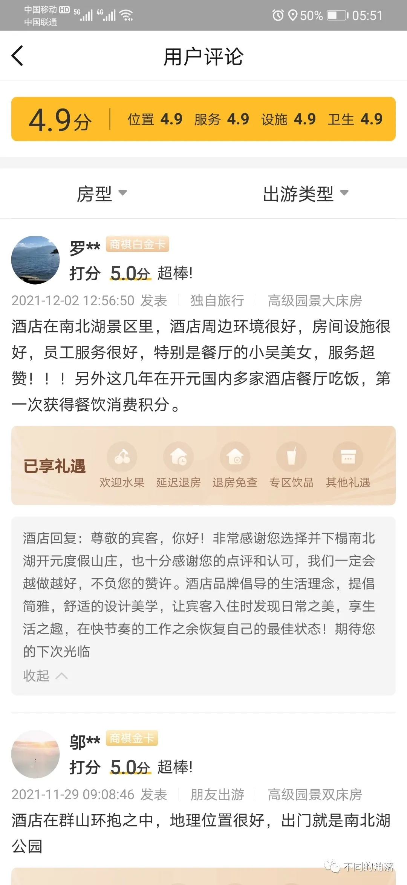

我发布在开元商祺会APP上的点评（南北湖开元度假山庄）。

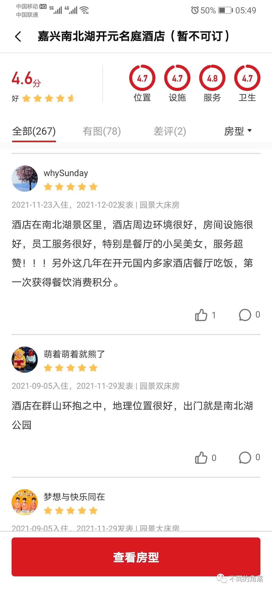

百达星系APP上ID被更名为 whySunday的点评。

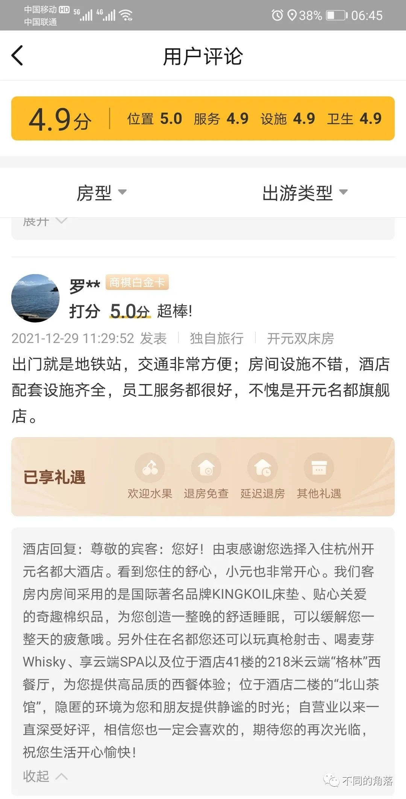

我发布在开元商祺会APP上的点评（杭州开元名都）。

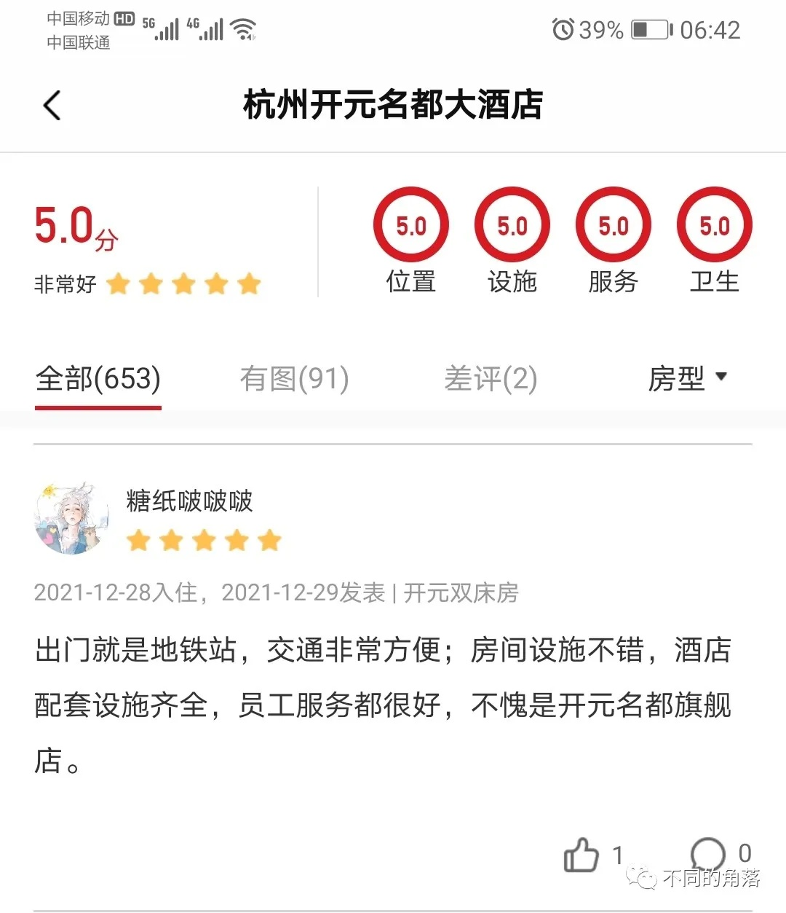

百达星系APP上ID被更名为糖纸啵啵啵的点评。

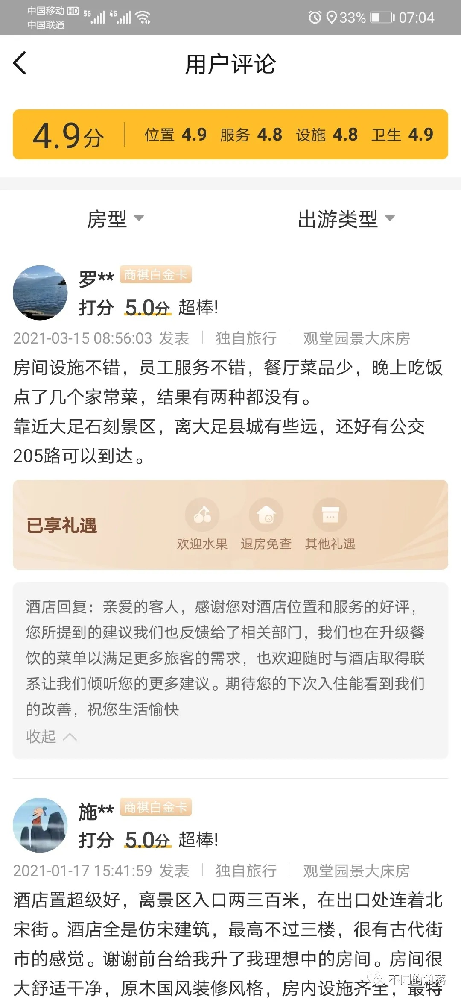

我发布在开元商祺会APP上的点评（重庆大足石刻开元观堂）。

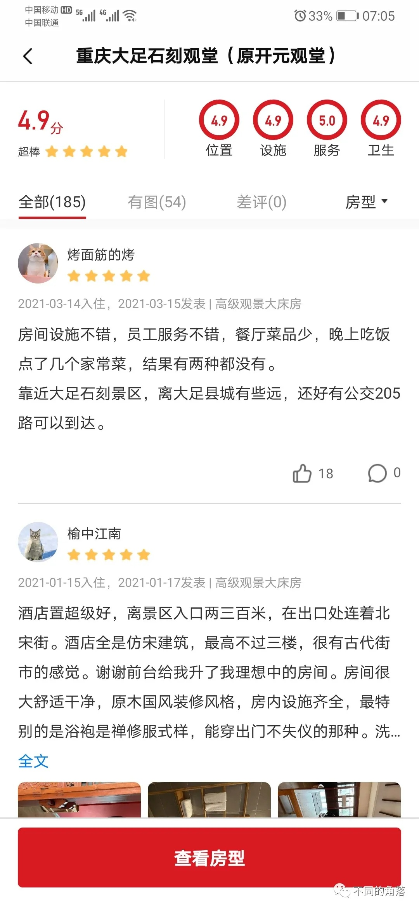

百达星系APP上ID被更名为烤面筋的烤的点评。

我发布在开元商祺会APP上的点评（第二次入住开元曼居杭州拱墅万达店，下方为第一次入住时给酒店好评的截图）。

百达星系APP上ID被更名为吉崎祐智（极其幼稚）的点评。

另外，不知道这位入住杭州富春方外的是张先生还是张女士。

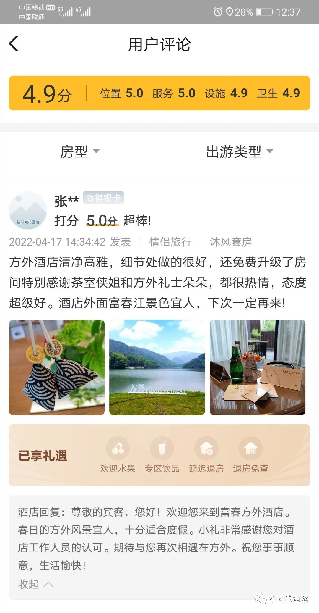

张先生或是张女士发布在开元商祺会APP上的点评。

这位张先生或张女士在百达星系APP上也被更名为吉崎祐智（极其幼稚）。

估计大都是百达屋员工用网名生成器软件随机生成的网名。

不了解郑南雁、陈妙林、德胧、百达屋、开元酒店之间关系的可以去看这几个帖子：

[行业资讯：KUNPENG更名为德胧成为开元母公司、百达星系会员计划上线、君亭完成收购君澜](http://mp.weixin.qq.com/s?__biz=MzU4OTczMzkwNw==&mid=2247487386&idx=1&sn=771a14cc2121cd99c42e5c4a2e3c4c53&chksm=fdc846e6cabfcff0885b82dee164b3161b876527784f648778606d37da70e3318f8ec2d0f9fb&scene=21#wechat_redirect)。

[行业资讯：开元祺行梦想家活动落幕、百达星系会员计划房价改版、亚朵会员延期、世茂喜达新增铂金会员](http://mp.weixin.qq.com/s?__biz=MzU4OTczMzkwNw==&mid=2247487676&idx=1&sn=05df2c87494e88651d9a5cedf1be3feb&chksm=fdc859c0cabfd0d6507b0b646e2405da10d23430516ab778155c08b417e07db7326216cf1cd6&scene=21#wechat_redirect)。

[行业资讯：浙旅投酒店集团启航、开元私有化要约收购先决条件达成、君亭创业板IPO过会](http://mp.weixin.qq.com/s?__biz=MzU4OTczMzkwNw==&mid=2247485017&idx=1&sn=995b6ff9400b173e27fc71e6d31115df&chksm=fdc84f25cabfc63365b3befe1b9547be77508a3cc4bab798964792af87abacf7cf4d06ba07a2&scene=21#wechat_redirect)。

**德胧管理层不止是文盲，还是法盲。**

《中华人民共和国反不正当竞争法》

第八条 经营者不得对其商品的性能、功能、质量、销售状况、用户评价、曾获荣誉等作虚假或者引人误解的商业宣传，欺骗、误导消费者。

经营者不得通过组织虚假交易等方式，帮助其他经营者进行虚假或者引人误解的商业宣传。

第二十条 经营者违反本法第八条规定对其商品作虚假或者引人误解的商业宣传，或者通过组织虚假交易等方式帮助其他经营者进行虚假或者引人误解的商业宣传的，由监督检查部门责令停止违法行为，处二十万元以上一百万元以下的罚款;情节严重的，处一百万元以上二百万元以下的罚款，可以吊销营业执照。

经营者违反本法第八条规定，属于发布虚假广告的，依照《中华人民共和国广告法》的规定处罚。

《互联网信息管理办法》

第二十五条 任何组织和个人不得以营利为目的或为获取其他非法利益，实施下列行为，扰乱网络秩序：

（一）明知是虚假信息而发布或者有偿提供信息发布服务的；

（二）为他人有偿提供删除、屏蔽、替换、下沉信息服务的；

（三）大量倒卖、注册并提供互联网信息服务账号，被用于违法犯罪的；

（四）从事虚假点击、投票、评价、交易等活动，破坏互联网诚信体系的。

第四十四条 违反本办法第二十五条规定的，由网信部门、电信主管部门、公安机关依据各自职责给予警告，责令限期改正，没收违法所得；拒不改正或者情节严重的，处10万元以上100万元以下罚款，并可以责令暂停相关业务、停业整顿、关闭网站、由原发证机关吊销相关业务许可证或者吊销营业执照，对直接负责的主管人员和其他直接责任人员，处1万元以上10万元以下罚款。

**二、开元商祺会APP屏蔽会员差评**

不是一家人，不进一家门。

百达屋与开元酒店能走到一起，两个团队的当家人在不诚信这一点上可以说是难分高下。

**不止百达星系APP上点评造假，开元商祺会APP上点评同样造假**。

会员登陆后在我的评论里可以查看到自己在开元官方平台订单发布的全部点评，但在评论过的酒店页面点评里，一些中评和差评被屏蔽（**没有全部屏蔽，还保留部分中评差评**），这样实际查看到的点评数量要少于酒店页面显示的点评数量。

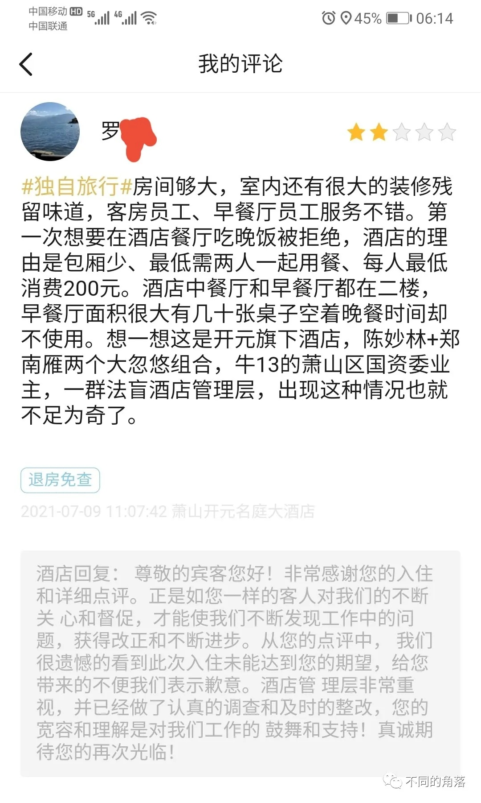

我发布在开元商祺会APP上的点评，在我的评论页面可见，在萧山开元名庭酒店点评页面里已被屏蔽看不到。

不止**开元酒店集团管理层法盲多，开元酒店管理团队法盲同样不少**，我和其他开元会员已经在多家开元酒店遇到酒店餐饮消费设置最低消费问题了。

《消费者权益保护法》2014年3月15日施行

第三章第十六条

经营者向消费者提供商品或者服务，应当恪守社会公德，诚信经营，保障消费者的合法权益；不得设定不公平、不合理的交易条件，不得强制交易。

第七章五十六条

经营者有下列情形之一，除承担相应的民事责任外，其他有关法律、法规对处罚机关和处罚方式有规定的，依照法律、法规的规定执行；法律、法规未做规定的，由工商行政管理部门或者其他有关行政部门责令改正，可以根据情节单处或者并处警告、没收违法所得、处以违法所得一倍以上十倍以下的罚款，没有违法所得的，处以五十万以下的罚款；情节严重的，责令停业整顿、吊销营业执照：

（六）对商品或者服务做虚假或者引人误解的宣传的；

（十）法律、法规规定的对损害消费者权益应当予以处罚的其他情形。

《餐饮业经营管理办法（试行》2014年11月1日施行

第十二条

禁止餐饮经营者设置最低消费。

第二十一条第二款

对于餐饮经营者违反本办法的行为，法律法规及规章有规定的，商务主管部门可提请有关部门依法处罚；没有规定的，由商务主管部门责令限期改正，其中有违法所得的，可处违法所得3倍以下罚款，但最高不超过3万元；没有违法所得的，可处1万元以下罚款；对涉嫌犯罪的，依法移送司法机关处理。”

《杭州市市场调节价监督管理若干规定》2013年12月1日施行，

第六条第三款

经营者销售商品、提供服务时，不得设置最低消费金额。

第二十条

经营者违反第六条第三款规定的，由价格主管部门责令其改正，并处2000元以上10000元以下罚款。

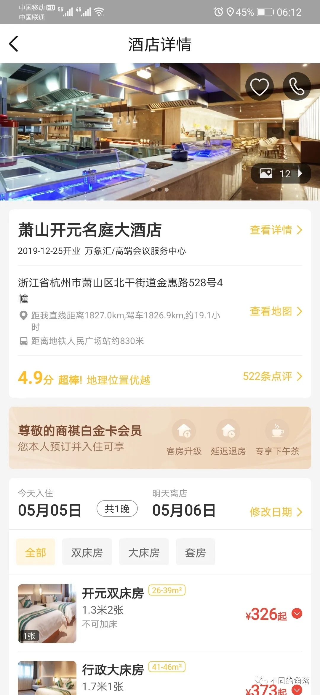

酒店所有点评我都查看了一遍没有找到我发的点评。

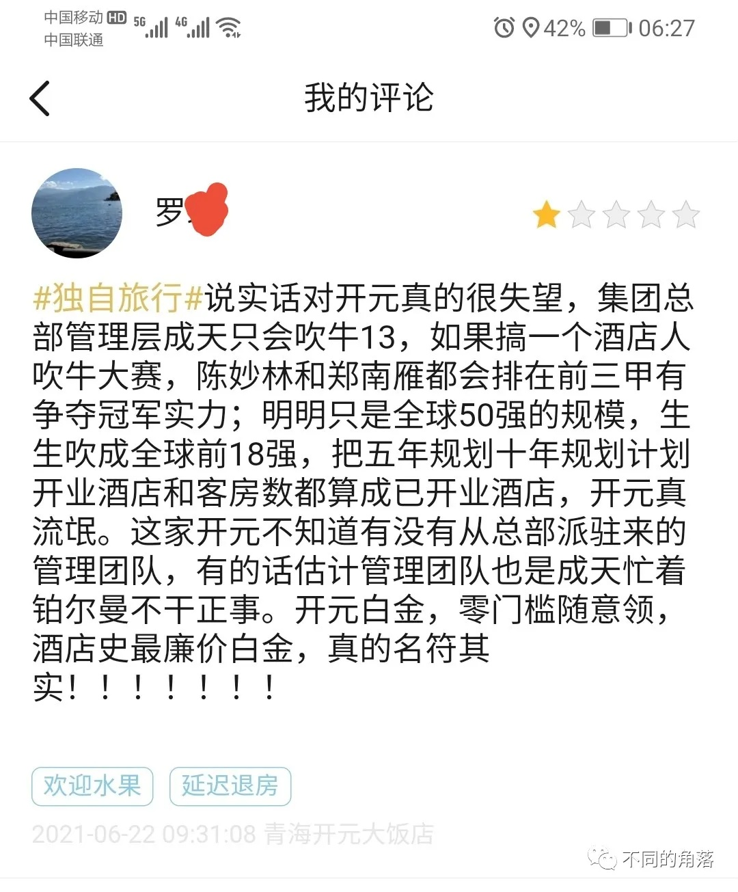

我发布在开元商祺会APP上的点评，在我的评论页面可见，在青海开元大酒店点评页面里已被屏蔽看不到。

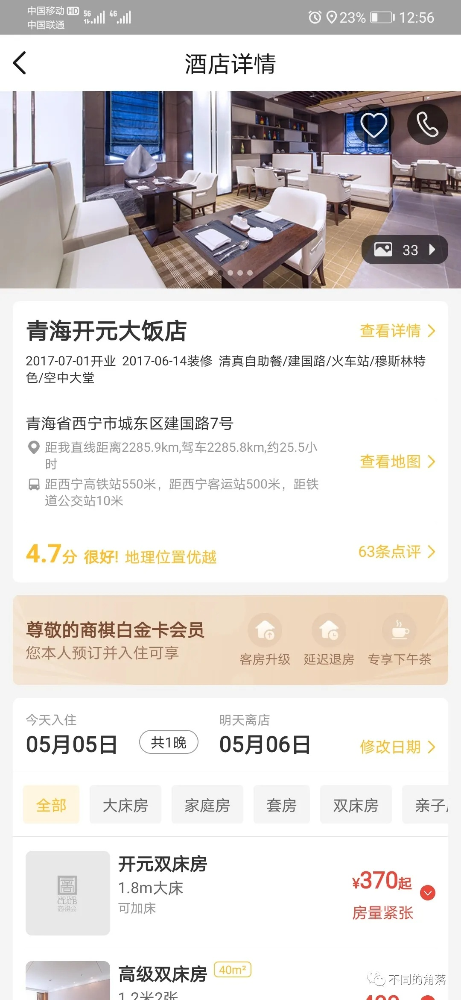

酒店所有点评我都查看了一遍没有找到我发的点评。

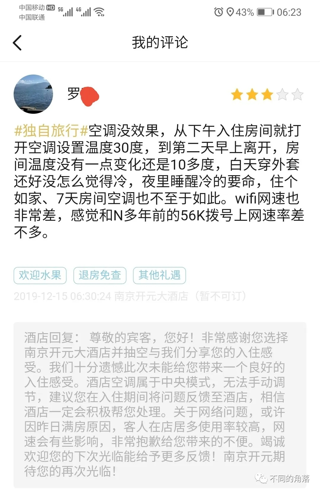

我发布在开元商祺会APP上的点评，在我的评论页面可见，在南京开元大酒店点评页面里已被屏蔽看不到。

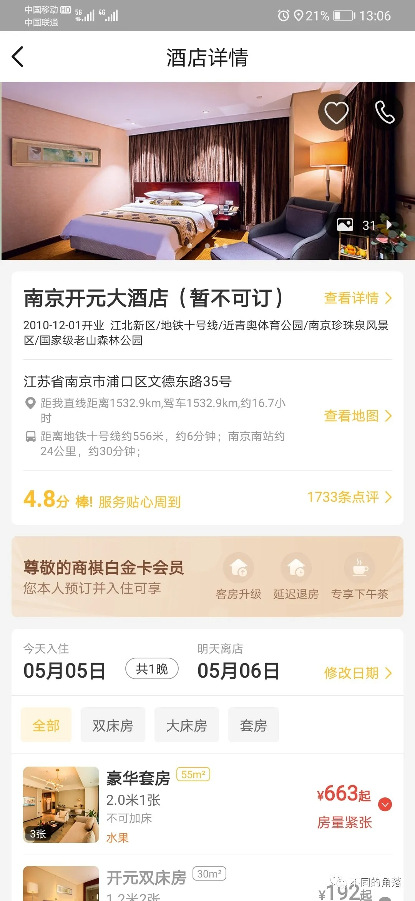

酒店所有点评我都查看了一遍没有找到我发的点评。

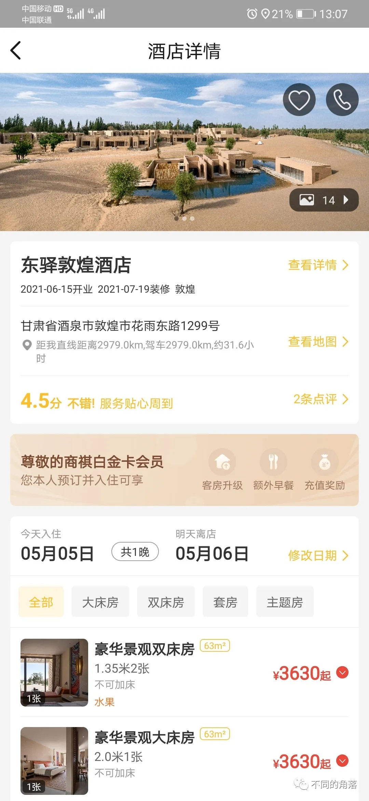

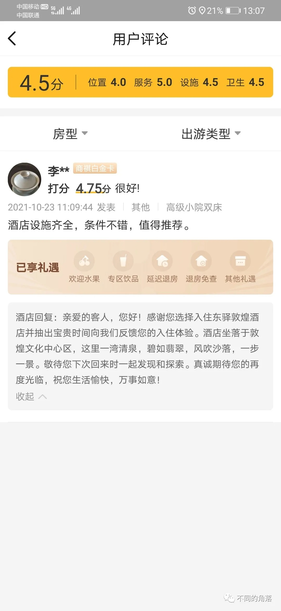

页面显示2条点评，点进去只能看到1条点评。

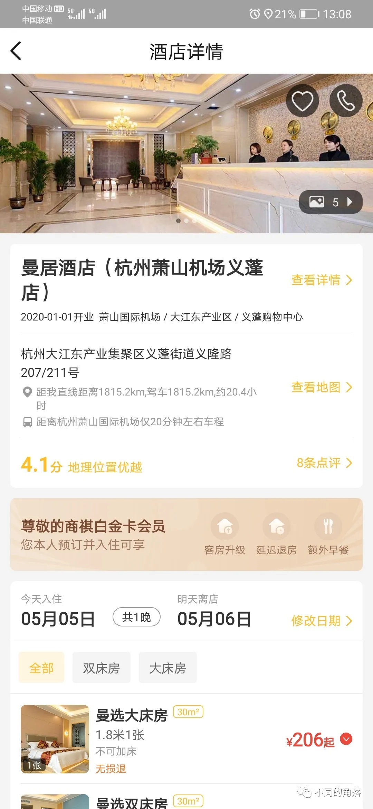

页面显示8条点评，点进去只能看到7条点评。

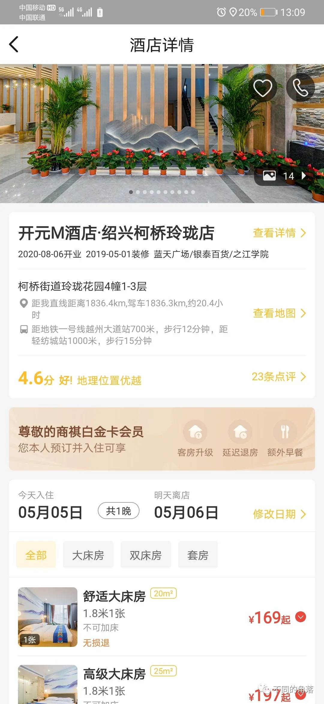

页面显示23条点评，点进去只能看到19条点评。

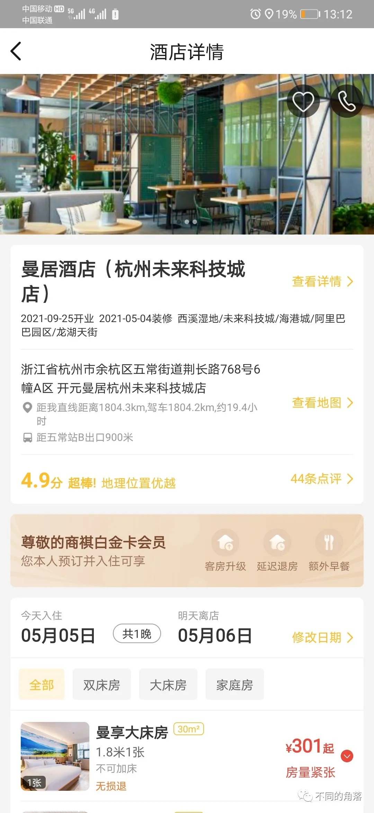

页面显示44条点评，点进去只能看到27条点评。

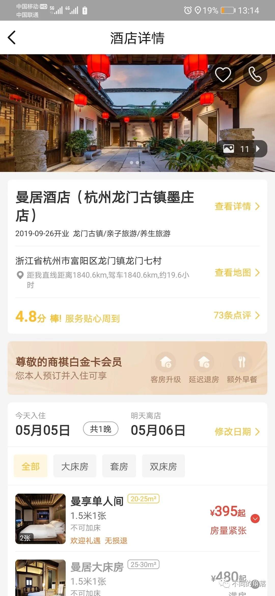

页面显示73条点评，点进去只能看到65条点评。

开元商祺会APP上更多酒店点评，大家可以自行查找对比。

**三、开元旗下酒店品牌更名整合**

百达屋团队全面接手开元酒店管理后，对开元酒店旗下众多品牌进行大幅度的更名整合。由于事先准备工作没做好考虑不周到，结果到现在也没有整合完成，同时又三天两头对原来的变更进行调整。

将开元观堂品牌更名为观堂品牌，所有开元观堂酒店更名为观堂酒店，后期又将几家开元观堂老店重新更名为开元观堂，现在观堂品牌旗下既有开元观堂品牌酒店又有观堂品牌酒店。

将开元曼居品牌更名为曼居，将开元曼居臻选品牌与开元曼居品牌都更名为曼居酒店品牌，同时将开元悦居、阿缇客、开元美途等品牌酒店都划至曼居品牌，后期又将开元悦居、阿缇客、开元美途等酒店重新剔出来划至其它品牌。

将开元芳草地品牌与房车营地品牌整合到一起更名为芳草地度假酒店。

将部分开元大酒店、开元度假村翻牌为开元名都酒店。

将部分开元大酒店、开元颐居、开元曼居翻牌为开元名庭。

确定开元旗下方外、观堂、芳草地度假酒店、开元名都、开元名庭、曼居酒店6个品牌以及百达屋旗下巴塞罗（百达屋引进的西班牙巴塞罗酒店集团旗下品牌，创建于1931年，巴塞罗酒店集团2020年度全球酒店200强排名第29位，旗下240家酒店54974间客房，酒店规模与开元酒店规模相仿，国内目前无酒店）、瑰宝（百达屋引进的德国酒店品牌，2013年在德国创立，国内目前无酒店）、穆拉（百达屋自主创建品牌，2020年12月百达屋与携程旗下丽呈酒店集团曾达成战略合作，共同拓展穆拉酒店中国市场，全球目前无酒店）3个品牌为德胧旗下9大核心品牌。

东驿敦煌酒店、北海银滩皇家海湾S酒店、北海皇家海湾公馆公寓式酒店之前显示为业主自有品牌，现在已经无任何品牌显示。

更多的酒店行业资讯、酒店常识、酒店集团、酒店入住体验、航空常识、沈阳旅游等相关内容可以到我的微信公众号里查看。

也欢迎大家关注我的微信公众号：**sfk024**

公众号名称：**不同的角落**

在微信公众号搜索sfk024或是不同的角落都可以搜索到，也可以直接扫码或长按识别下方二维码关注。

