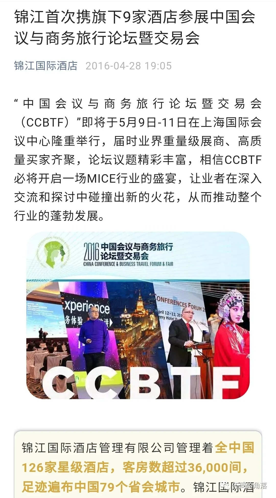
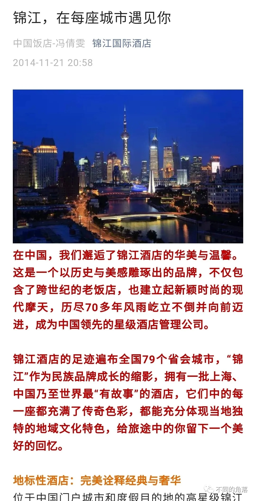
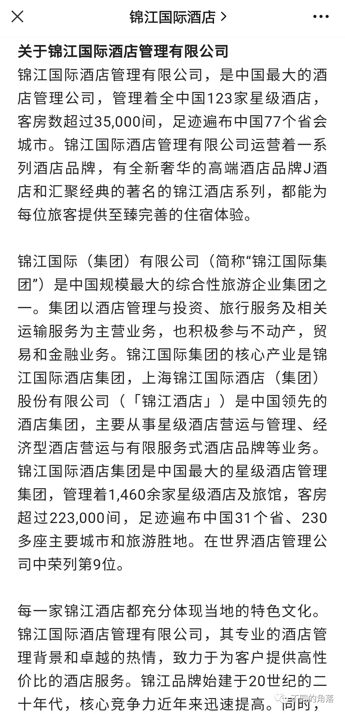
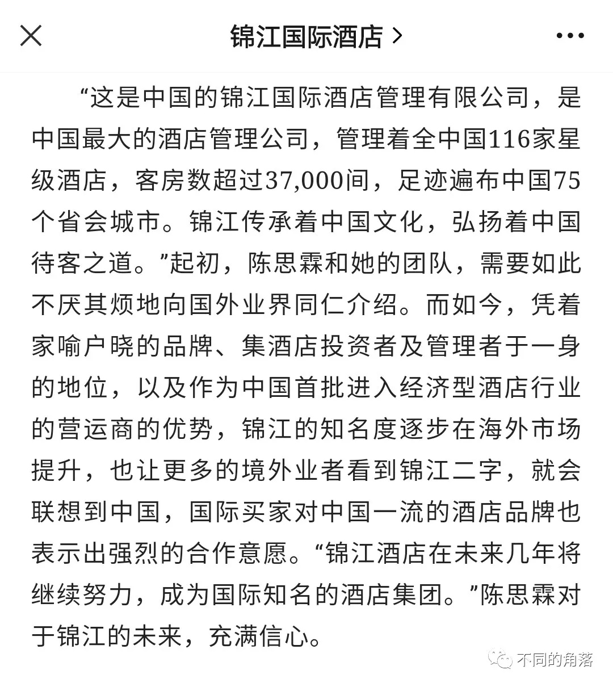

# 那些年，退出的锦江酒店

> **作者**：不同的角落  
> **发布时间**：2022年10月18日 23:27  
> **原文链接**：[那些年，退出的锦江酒店](http://mp.weixin.qq.com/s?__biz=MzU4OTczMzkwNw==&mid=2247488010&idx=1&sn=8a2ed086a7723501619c7011f3a84f2b&chksm=fdc85b76cabfd2601e598d033de44ea4549e86829f4f950fb4b8aba1e09826fbf7fe29a08b6b)

---

锦江酒店，是锦江集团旗下与集团同名的酒店品牌，锦江官方多年来对锦江酒店的宣传是“一个有愿景并蓬勃发展的中国酒店管理品牌”、“拥有华夏文明的本土酒店品牌代表”，锦江官方将其定位为高端连锁酒店品牌，内部又细分为锦江（豪华）和锦江（高端）两档，分别对应普通五星档次和四星档次酒店，然而现实是部分锦江（高端）品牌酒店顶多三星档次，有些酒店的客房设施甚至还不如一些星程、如家商旅。

截至2021年12月31日，锦江官方平台锦江品牌酒店共有55家酒店15902间客房，在锦江集团客房总量占比1.2832%。

同期全球酒店前四强中其它三家旗下与集团同名的酒店品牌：

万豪集团旗下万豪品牌酒店207386间客房，在万豪集团客房总量占比14.336%。

希尔顿集团旗下希尔顿品牌酒店221782间客房，在希尔顿集团客房总量占比20.8165%。

洲际集团旗下洲际品牌酒店69402间客房，在洲际集团客房总量占比7.8358%。

同期另一家全球知名酒店集团凯悦集团旗下凯悦品牌酒店94241间客房，在凯悦集团客房总量占比33.0735%。

截至2022年10月18日，2022年已有4家锦江品牌酒店退出锦江，这4家酒店分别为北京锦江亚洲大酒店、北京北邮锦江酒店、郑州正方元锦江国际饭店、吉安井冈山锦江大酒店。

近十年退出的锦江酒店如下，其中红色数字开头是我曾经住过的：

北京

1、北京贵州大厦

2、北京泰山饭店

3、北京广播大厦

4、北京亚洲大酒店

5、北京长安大饭店（陕西大厦）

6、北大博雅国际酒店

7、北京北邮锦江酒店

8、北京益田影人花园酒店（现北京益田影人花园酒店喜来登）

上海（两家酒店物业出售后退出）

1、上海银河宾馆

2、上海锦沧文华大酒店

重庆

1、重庆欧瑞锦江大酒店

2、重庆欧瑞锦江商务酒店

石家庄

1、河北敬业大酒店

唐山

1、唐山饭店

承德

1、平泉亮达国际酒店

秦皇岛

1、秦皇岛锦江半岛四季酒店

郑州

1、郑州正方元锦江国际饭店

信阳

1、信阳锦江国际大酒店（现信阳温德姆酒店）

沈阳

1、沈阳天丰国际酒店

哈尔滨

1、哈尔滨正明锦江大酒店

呼和浩特

1、内蒙古锦江国际大酒店（现内蒙古开元名都大酒店）

鄂尔多斯

1、鄂尔多斯泰华锦江国际大酒店

苏州

1、苏州姑苏锦江大酒店

2、苏州吴江盛世锦江国际大酒店

3、常熟虞山锦江饭店

4、太仓锦江国际大酒店

无锡

1、无锡锦江大酒店（现无锡万达颐华酒店）

常州

1、常州锦江国际大酒店

青岛

1、青岛多元锦江大饭店（现青岛开元名都大酒店）

日照

1、日照岚桥锦江大酒店

蚌埠

1、安徽水利锦江大酒店

六安

1、六安沃尔特大酒店

温州

1、温州锦江王朝大酒店

宜昌

1、宜昌锦江国际大酒店（现宜昌均瑶国际酒店，当初退出锦江后加盟华住翻牌为宜昌均瑶禧玥酒店，今年上半年刚退出华住）

深圳

1、深圳绿景锦江国际酒店

南昌

1、南昌锦江锦峰大酒店     吉安 1、井冈山锦江大酒店

成都

1、成都比邻奈儿青城锦江酒店

自贡

1、自贡英祥锦江国际大酒店

六盘水

1、凉都锦江温泉国际大酒店（现六盘水福朋喜来登酒店）

三亚

1、三亚半山锦江海景度假酒店

2、三亚锦江宝宏大酒店

喀什

1、喀什月星锦江国际大酒店

还有2家目前仍是锦江管理的酒店，重未上线过锦江官网，也不能享受锦江会员权益。

西宁：青海锦江国际大酒店

南平：武夷山悦武夷茶生活美学锦江酒店

在国内其它高端连锁品牌酒店数量逐年增长的情况下，只有锦江酒店不一样，十年前60多家锦江品牌酒店（锦江官方在2013年至2016年时一直宣称管理着120多家星级酒店足迹遍布中国75/77/79个省会城市，就算加上锦江为业主或部分持股的

上海和平饭店、上海华尔道夫、上海锦江汤臣洲际、上海东锦江希尔顿逸林、上海扬子江万丽、上海海仑宾馆索菲特等酒店，也不到70家。并且想一想中国实际上只有22个省会城市，在锦江官方这里能膨胀成70多个省会城市，水分可想而知），现在50多家锦江品牌酒店，十年来一直保持稳定的负增长（和中国男足一样稳），基本上每年新开1、2家，退出3、4、5、6家。

锦江国际酒店管理有限公司管理锦江旗下高端品牌酒店（J、昆仑、锦江、岩花园），目前包括1家J酒店、2家昆仑酒店、51家锦江酒店（一些是锦江自有物业），多年前还有1家北京榈园岩花园酒店。

当然，就算锦江品牌酒店数量负增长，也丝毫不影响锦江酒店和锦江集团这些年在国内外各种评奖中拿奖拿到手软，“大中华市场最佳本地连锁酒店”、“最佳年度酒店集团奖”、“十大影响力国内酒店品牌”、“亚洲最佳连锁酒店集团”、“最佳海外传播奖”、“中国杰出本土酒店管理公司”、“中国杰出酒店管理公司”、“最受消费者欢迎中国民族品牌酒店集团”、“最具成长性本地连锁酒店集团奖”、“最佳连锁饭店品牌”、“国际优秀品牌奖”、“最具经营价值酒店管理集团奖”、“最具影响力高端酒店集团”、“中国最佳客户忠诚度计划”、“中国最具发展潜力民族酒店领军品牌”、“最受常旅客喜爱的大中华酒店会员奖励计划”、“最佳内容传播奖”、“中国饭店业集中采购最具影响力奖”、“中国最佳酒店管理集团”、“亚洲最佳酒店雇主”等等。

锦江品牌酒店持续多年的负增长，再度见证了锦江的高端酒店管理超能力，现在就连**锦江创始店锦江品牌旗舰店上海锦江饭店的服务都是相当的垃圾**（锦江豪华经典酒店卓越卡会员入住，早餐、延时退房、欢迎水果、升房等卓越卡会员应有的礼遇一律不给，投诉锦江客服毫无用处，投诉到上海12345后，过了半个月上海锦江饭店大堂经理联系我，居然告诉我下次入住可以送我一份早餐升房一级，而双早餐和升房本来就是卓越卡会员应有的权益。更垃圾的是锦江现在订单点评要审核，我在锦江官网给上海锦江饭店写差评，到现在10个月了还是一直显示点评审核中不予通过不能发出来）。

对于上海锦江饭店这一任总经理，我也只能祝他家楼上楼下左邻右舍的男主人都姓王了。

之前住锦江品牌其它酒店时，一些酒店也是会员该有的权益能不给就不给，只在少数锦江品牌酒店会员权益才能得到保障，这样的品牌酒店负增长也就不足为奇了。

**希望几年后，锦江酒店都是直营店**。

更多的酒店行业资讯、酒店常识、酒店集团、酒店入住体验、航空常识、沈阳旅游等相关内容可以到我的微信公众号里查看。

也欢迎大家关注我的微信公众号：**sfk024**

公众号名称：**不同的角落**

在微信公众号搜索sfk024或是不同的角落都可以搜索到，也可以直接扫码或长按识别下方二维码关注。

