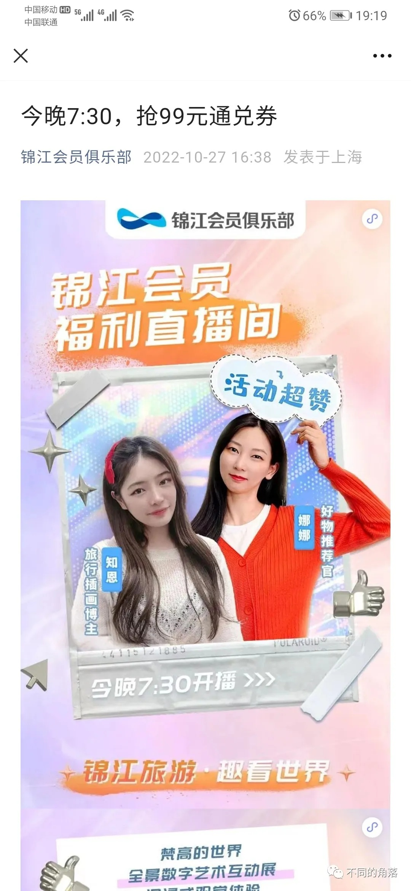
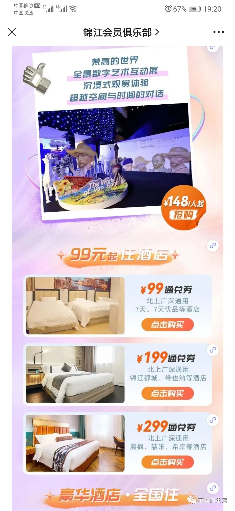
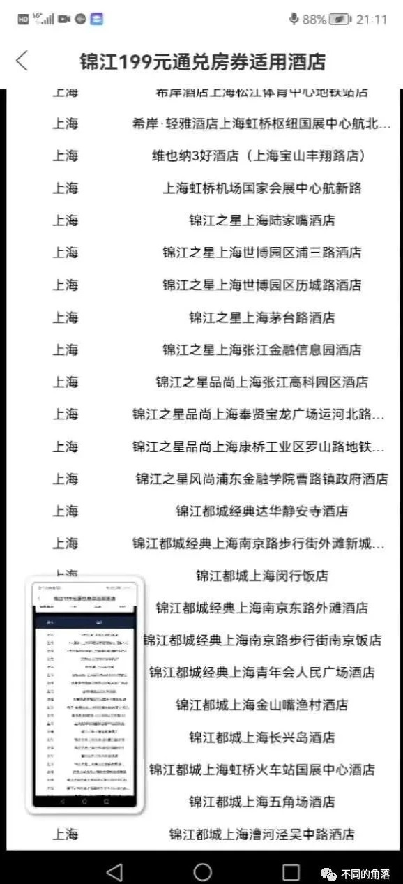

# 行业资讯：锦江再涉虚假宣传、两家亚朵ZHotel翻牌为亚朵X、君澜品宣社会员培训认证

> **作者**：不同的角落  
> **发布时间**：2022年11月1日 20:47  
> **原文链接**：[行业资讯：锦江再涉虚假宣传、两家亚朵ZHotel翻牌为亚朵X、君澜品宣社会员培训认证](http://mp.weixin.qq.com/s?__biz=MzU4OTczMzkwNw==&mid=2247488024&idx=1&sn=e774070864780cbe8e1eb10388c4202f&chksm=fdc85b64cabfd2720037485c2e3605848b51159f0901ad8dbb2c593c6df8e39630dca9aa010e&scene=21)

---

**一、锦江再涉虚假宣传**

2022年10月下旬，锦江酒店APP和锦江会员俱乐部微信公众号上都发力推介通兑房券，其中锦江优选酒店（锦江旗下有限服务酒店）通兑房券有99元、199元、299元三档。

在锦江会员俱乐部微信公众号上的推文里还可以看到部分推介内容：

99元通兑券可以兑换范围包括北上广深7天系列、锦江之星等经济酒店。

199元通兑券可以兑换范围包括北上广深锦江都城、凯里亚德等中档酒店。

299元房券可以兑换范围包括北上广深丽枫、喆啡等中档品牌酒店。

之前还可以查看三档房券可兑换酒店名单。视频里可以看到199通兑房券原本可兑换酒店名单里包括上海的几家锦江都城经典。

已关注

关注

重播    分享     赞

关闭

**观看更多**

更多

*退出全屏*

*切换到竖屏全屏**退出全屏*

不同的角落已关注

分享视频

，时长00:51

0/0

00:00/00:51

切换到横屏模式

继续播放

进度条，百分之0

播放

00:00

/

00:51

00:51

倍速

*全屏*

倍速播放中

0.5倍0.75倍1.0倍1.5倍2.0倍

超清流畅

继续观看

行业资讯：锦江再涉虚假宣传、两家亚朵ZHotel翻牌为亚朵X、君澜品宣社会员培训认证

观看更多

转载

,

行业资讯：锦江再涉虚假宣传、两家亚朵ZHotel翻牌为亚朵X、君澜品宣社会员培训认证

不同的角落已关注

分享点赞在看

已同步到看一看写下你的评论

 

视频详情

视频为一位上海的朋友提供，他之前录屏保留了证据。

这位上海的朋友，购买了199元通兑房券，在锦江酒店APP上兑换查询时，发现在可兑换酒店名单中的很多酒店根本查询不到，城市选择上海，品牌选择锦江都城和凯里亚德，在可以兑换的30天内，每天只能查询到1家锦江都城或是1家凯里亚德，然后还是每天都显示满房状态不可以兑换（大家可以购买199房券后自行查询，房券不兑换可退）。

这位上海的朋友去了锦江都城品牌旗舰店，也是锦江都城品牌创始店锦江都城经典上海南京路步行街外滩新城饭店，我曾经写过这家酒店的入住体验报告，这家酒店前身是1934年开业的都城饭店，锦江都城品牌诞生就是源自这家都城饭店。

[锦江都城经典之一上海外滩新城饭店](http://mp.weixin.qq.com/s?__biz=MzU4OTczMzkwNw==&mid=2247485532&idx=1&sn=71cc7304571eaf228c86a0b357130b6c&chksm=fdc84120cabfc8368a97f7e8e396a92c3831e5a3ef9dac1ca109d580334d91d4e2c971c8d302&scene=21#wechat_redirect)

他找到锦江都城经典上海外滩新城饭店当天的一位年长男性值班经理，出示了手机上显示的199元房券可兑换酒店名单，咨询酒店为什么没有在锦江酒店APP开放兑换，值班经理说不参加锦江的活动，还像打发叫花子一样赶人。我听了上海朋友与酒店值班经理的录音，他全程都是文明用语，提出自己的合理诉求，并没有提出额外的不合理要求；而酒店值班经理话语中充满了高高在上的优越感，趾高气扬的口吻把顾客当成要饭的叫花子对待。

上海朋友打锦江客服电话进行了投诉，在锦江都城经典上海外滩新城饭店大堂等待了2个多小时，也没有等到事情的解决。

不过，锦江官方在某些方面还是有高效率，事情没有解决，先把证据销毁，在锦江酒店APP上查询199元房券可兑换酒店名单，已经查询不到上海的几家锦江都城经典酒店，其它锦江都城酒店和凯里亚德酒店也不在名单内。

与锦江酒店中国区员工的对话。

锦江旗下公司之前因虚假宣传被处罚已经有先例，现在仍不是悔改。

锦江旗下的锦江之星旅馆有限公司因发布违法广告2019年2月19日被上海市浦东新区市场监督管理局罚款30000元，处罚事由为，锦江之星在其官网发布“2015年……这也标志着国内酒店业积淀最深的锦江国际集团将携手铂涛集团，一跃成为中国最大的酒店集团，也将成为首家跻身全球前五的中国酒店集团。……10月，锦江之星位于菲律宾的首家酒店——锦江之星奥迪加斯酒店喜迎开业。该店由上好佳（国际）按照锦江之星的海外标准打造，成为进军菲律宾市场的首家中国经济型连锁酒店品牌。”经查，锦江之星均无法提供上述广告内容的证实材料，锦江之星上述宣传的目的是为了吸引客流。上述行为构成《广告法》第二十八条第二款第（二）项所指的虚假广告。

就在2022年，锦江之星再次因发布虚假宣传被处罚。上海市浦东新区市场监督管理局行政处罚决定书（沪市监浦处〔2022〕152021006078 号）显示，锦江之星旅馆有限公司（以下简称“锦江之星”）从2018年1月1日起在互联网自建网站，并在该网站发布加盟信息（招商），上述网页广告内容未对可能存在的风险及风险责任承担有合理提示或警示，上述行为属于发布违法广告。

据悉，锦江之星在自建网站发布加盟信息对外宣传，违法行为持续时间超过两年。

《广告法》第二十五条第一款规定：招商等有投资回报预期的商品或者服务广告，应当对可能存在的风险以及风险责任承担有合理提示或者警示，并不得含有下列内容：（一）对未来效果、收益或者与其相关的情况作出保证性承诺，明示或者暗示保本、无风险或者保收益等，国家另有规定的除外。依据《广告法》 第五十八条第一款第（七）项，上海市浦东新区市场监督管理局对锦江之星罚款3200元。

黑猫投诉平台上，锦江之前的房券活动和其它投诉也有很多。

锦江之前持续多年位居如家、华住、铂涛、格林之后位居国内老五，后续通过收购卢浮、铂涛、维也纳、丽笙，在客房数量上成为国内酒店老大，全球酒店老二，锦江多年来的宣传也一直以国内老大，全球老二自居。

然而，锦江除了在酒店客房数量上可以位居全球第二外，其它各项数据如年营收、年利润、总市值等均排不上前列。

大而不硬，也没用；不持久，更不行；名声滥，更完蛋。

作为连锁酒店最重要的留客法宝-常旅客会员计划，锦江这几年来一直不断对其修改调整，结果就是锦江的常旅客会员计划酒店员工经常搞不明白，锦江客服经常搞不明白，会员该有的权益也经常得不到保证。

希望锦江今后在宣传时，能给大众解释一下之前在维也纳APP和锦江酒店APP上几个ID承包维也纳系列酒店和希岸系列酒店95%好评的情况；希望能正面回复一下锦江官方点评审核不予通过的情况；以及炫耀全球酒店老二身份的同时，也公布一下锦江酒店的营收、利润、市值在全球酒店的排名。

毕竟，全球酒店集团里，比不专业，锦江称第二，没有哪家敢称第一。

[2021年度国内酒店集团盘点——锦江篇](http://mp.weixin.qq.com/s?__biz=MzU4OTczMzkwNw==&mid=2247486565&idx=1&sn=f2af1bb53949ba019bd1ddafc2b49ddc&chksm=fdc84519cabfcc0f2901d3ebe231618704ad14392a358a3092915323d49ff2fae9e7542f761f&scene=21#wechat_redirect)

**二、亚朵两家Z Hotel翻牌为亚朵X**

亚朵旗下北京望京798Z Hotel翻牌为北京望京798亚朵X、上海静安寺淮海中路Z Hotel翻牌为上海静安寺淮海中路亚朵X。

亚朵旗下Z Hotel品牌酒店目前仅有上海外滩沙美大楼Z Hotel一家。

亚朵旗下其它三个特色品牌A·T·House、The Drama、萨和目前也都是只有1家酒店，也都在上海。

上海外滩沙美大楼Z Hotel、上海徐家汇A·T·House、上海The Drama、上海世博萨和（新开业）也是亚朵旗下最值得体验的4家酒店。

**三、君澜品宣社第一期会员培训认证活动**

君亭旗下君澜酒店“这一刻”君澜品宣社第一期会员培训认证活动近日结束。君澜酒店牵手云谷传声为旗下酒店传讯人员进行从认知到实操的培训。此次培训共认证2名中级新媒体运营师、2名中级摄影剪辑师、9名初级新媒体运营师、9名初级摄影剪辑师、4名初级文案编辑师、3名初级平面设计师。

其实，感觉君澜更应该进行培训的，是如何诚实做人踏实做事。

毕竟这么多年来能一直坚持吹牛虚报三倍在营酒店规模自封国内酒店集团前10强，也挺不容易的。

而所谓的常旅客会员计划也基本形同虚设，一共几十家酒店的规模，还有不少酒店不能在君澜官方平台预订，在君澜官方平台可以预订的，会员权益在实际执行中也基本为零。

更多的酒店行业资讯、酒店常识、酒店集团、酒店入住体验、航空常识、沈阳旅游等相关内容可以到我的微信公众号里查看。

也欢迎大家关注我的微信公众号：**sfk024**

公众号名称：**不同的角落**

在微信公众号搜索sfk024或是不同的角落都可以搜索到，也可以直接扫码或长按识别下方二维码关注。

