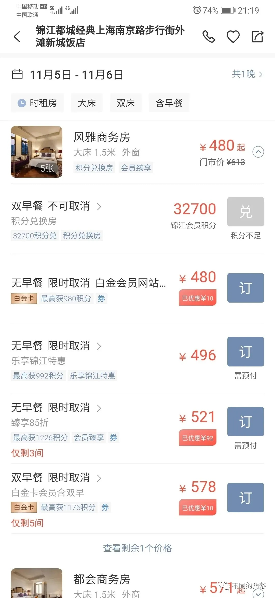
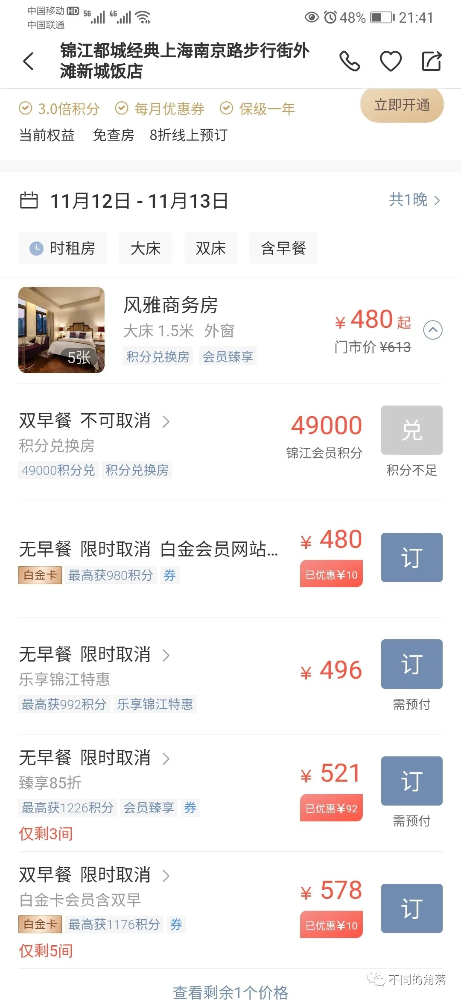
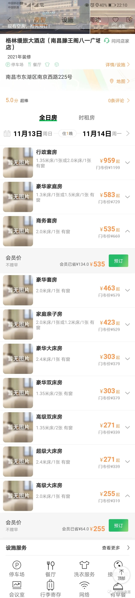

# 行业资讯：亚朵酒店上市、锦江积分再度贬值、格林缦旅大酒店首店上线

> 本文转载自微信公众号 **不同的角落**，已获作者授权。  
> 原文发布于 2022年11月13日 02:42  
> 原文链接：[mp.weixin.qq.com](http://mp.weixin.qq.com/s?__biz=MzU4OTczMzkwNw==&mid=2247488061&idx=1&sn=6ceba0deb562ec4f9b6629524e949f55&chksm=fdc85b41cabfd257eec1a51a63d297029b7357570d828d63d7eaedd76c6cbe82a19c45fc0751)

---

**一、亚朵酒店上市**

2022年11月11日，亚朵于纳斯达克挂牌上市，以ADS的方式公开发行475万股，发行价11美元/股。

之前亚朵曾于2019年和2020年两次筹划登陆A股，未成；2021年6月转战美股计划2021年7月1日登陆纳斯达克，拟发行1974.47万股ADS，未果。此次终于成功登陆纳斯达克，但发行475万股比起之前拟发行的1974.5万股，缩水了四分之三还多。

亚朵旗下目前有A·T·House、The Drama、萨和、亚朵S、亚朵、亚朵X、亚朵轻居等7个酒店品牌，其中A·T·House、The Drama、萨和都是只有一家门店均在上海。

截至2022年9月30日旗下酒店880家（2021年底745家），酒店客房数量位居国内锦江、华住、首旅、格林、东呈、尚美之后排第七位。

亚朵旗下基本都是中档酒店，旗下中档酒店数量位居锦江、华住、首旅之后排国内第四位。

在国内中档酒店为主的酒店集团排名中，亚朵酒店数量、客房数量都遥遥领先于丽呈、美豪等几家有一定规模的酒店集团。

曾经的国内中档酒店三剑客，老大维也纳被锦江收购后发展迅猛目前维也纳系列品牌酒店数量已突破3000家；老二桔子水晶被华住收购后发展比较缓慢目前桔子系列品牌酒店数量才600家左右，酒店数量和房价、名气都被老三亚朵赶超。

亚朵一向以门店服务好著称，以我这十年的入住酒店体验（平均每年住200晚酒店）来说，感觉亚朵门店的服务的平均水准的确是优于锦江、华住、首旅、格林、东呈、尚美、开元、金陵、万达、美豪、丽呈、旅悦等国内连锁和万豪、希尔顿、洲际、温德姆、雅高、香格里拉等国际连锁。

曾经入住过一家南方省会城市亚朵酒店，距离机场30多公里，距离两个高铁站10多公里20多公里，酒店也都提供免费接送服务，单人就可以成行。

但亚朵的高房价同样令人恼火，国内很多城市一些亚朵门店的房价比起同城的一些万豪、万丽、喜来登、艾美、威斯汀、希尔顿、希尔顿逸林、皇冠假日等国际高端品牌酒店的房价都要高。在国内比亚朵性价比低的中档品牌也就希尔顿欢朋、希尔顿惠庭、万枫、雅乐轩等少数几个国际品牌。

亚朵的四个主流品牌中，亚朵S房价超过400我基本不会考虑，亚朵/亚朵X/亚朵轻居房价超过300我基本不会考虑。

**二、锦江积分再度贬值**

近日，锦江积分再度贬值。

以下为同一家酒店同一房型（前后日期房价也相同）一周前后查询的积分兑换价格对比。

查询了其它锦江优选酒店积分兑换房价，相比一周前查询的积分兑换价格也都是同样上涨幅度，积分兑换房所需积分是白金会员会员价金额的100倍以上比例。

当年为了收快递曾经2000积分兑换过白金会员价400元的7天酒店，现在如果兑换白金会员价400元的7天酒店，需要44000多积分。

**三、格林缦旅大酒店首店上线**

近日，格林酒店集团旗下全服务品牌格林缦旅大酒店首店——格林缦旅大酒店南昌滕王阁八一广场店上线格林官方平台。

格林缦旅是格林酒店集团与江西缦旅酒店管理有限公司于2021年成立的合资公司江西格林缦旅商务集团有限公司旗下酒店品牌，格林酒店（上海）有限公司全资子公司格安酒店管理（上海）有限公司持有江西格林缦旅51%股份，江西缦旅酒店管理有限公司持有江西缦旅49%股份。

江西缦旅旗下原有三个品牌缦旅、维珍天使、碧尤蒂in及几个子品牌，与格林成立合资公司格林缦旅后，三个品牌都加上了格林前缀。

格林缦旅品牌下有格林缦旅大酒店与格林缦旅酒店两个子品牌，品牌定位都是四星级档次酒店，目前两个子品牌各有一家酒店。

格林缦旅酒店南昌红谷滩万达广场店于2020年底开业，2021年四季度上线格林酒店官方平台，

格林缦旅大酒店南昌滕王阁八一广场店前身是2004年开业日本独资的江西七星商务酒店。2021年格林缦旅与江西七星商务酒店签约合作，2022年8月1日翻牌为格林缦旅大酒店，近日上线格林官方平台。

格林缦旅旗下目前21家酒店，有单独的格林缦旅会员计划，会员等级分为格林缦旅贵宾卡、格林缦旅金卡、格林缦旅铂金卡三个等级。

格林缦旅旗下品牌部分酒店上线格林平台，只享受格林会员折扣和延时退房权益，无其它权益。

格林缦旅大酒店南昌滕王阁八一广场店在格林APP上钻石会员价如下，

其中高级大床房255元无早、商务套房535元无早。

打电话咨询酒店，酒店员工不知道格林还有钻石会员等级，告知在酒店预订，格林铂金会员可以享受8折优惠房价和延时退房至15点权益，8折优惠房价高级大床房无早239元双早287元，商务套房无早479元双早535元。价格均低于格林APP上的钻石价。

格林战略投资并控股的雅阁酒店，国内的的50多家门店目前在格林APP上只有不到20家，且所有门店所有日期都是“今日满房”状态不可预订。

目前国内酒店集团前四家，只有格林旗下没有高端酒店。

更多的酒店行业资讯、酒店常识、酒店集团、酒店入住体验、航空常识、沈阳旅游等相关内容可以到我的微信公众号里查看。

也欢迎大家关注我的微信公众号：**sfk024**

公众号名称：**不同的角落**

在微信公众号搜索sfk024或是不同的角落都可以搜索到，也可以直接扫码或长按识别下方二维码关注。

