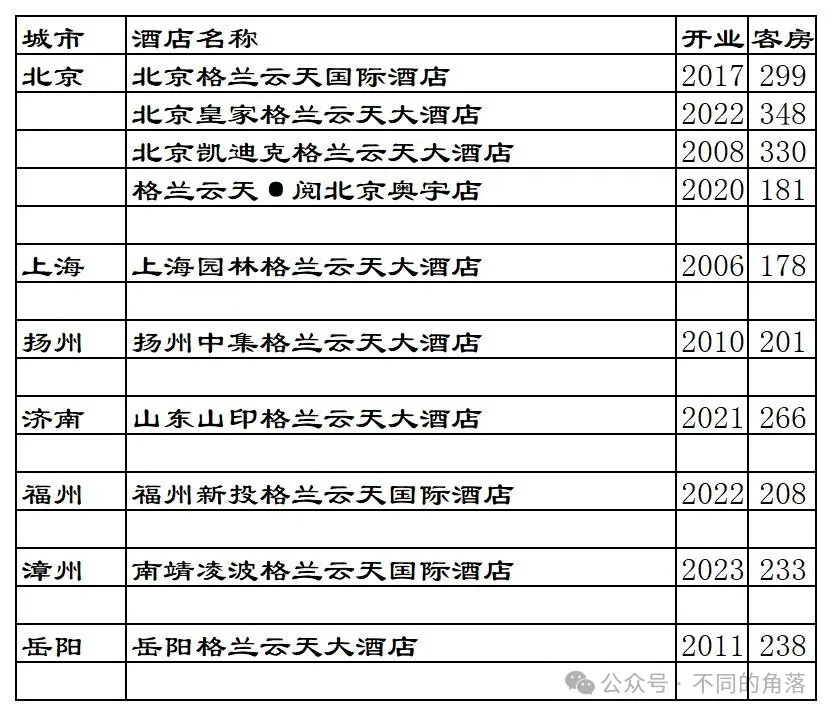
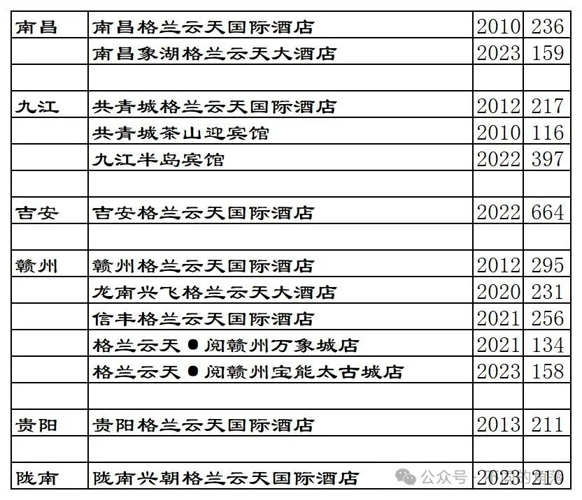
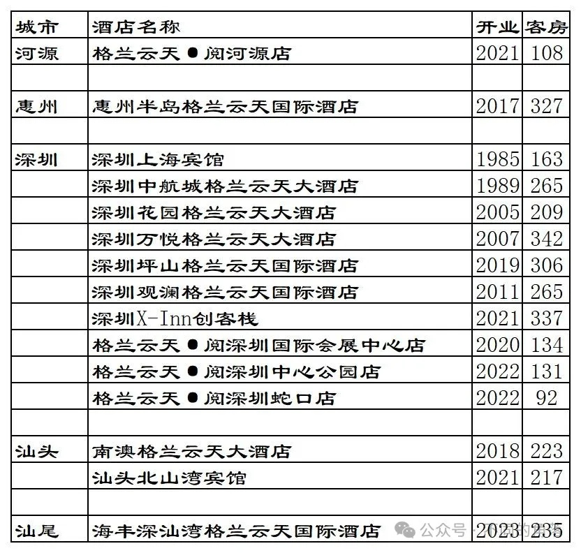
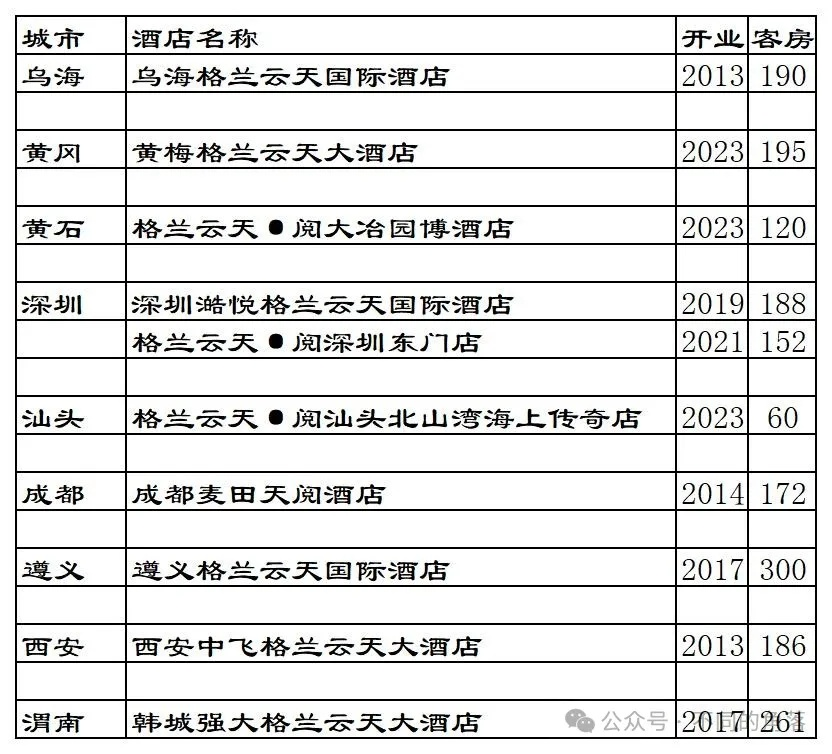

# 格兰云天开业酒店统计2023版

> 本文转载自微信公众号 **不同的角落**，已获作者授权。  
> 原文发布于 2024年2月27日 10:30  
> 原文链接：[mp.weixin.qq.com](http://mp.weixin.qq.com/s?__biz=MzU4OTczMzkwNw==&mid=2247513181&idx=1&sn=32a224decdc9ddcfe6f354fae77cd0e2&chksm=fdcbfd21cabc7437a95d31c6139bbe996c5a6bcfef7239fa363886053772486633a3598a8b4c)

---

格兰云天旗下已开业酒店统计，统计截至2023年12月31日。

客房数据主要来自于格兰云天官方平台与OTA，部分酒店客房数量打过酒店电话核实，记录的是酒店员工告知的客房数量。

个人精力有限，部分酒店开业/退出/下线时间以及客房数量难免有错误，欢迎各位告知指正，谢谢！

截至2023年12月31日格兰云天官方平台可以查询到的国内已开业酒店共计38家酒店9120间客房。

OTA平台还有10家格兰云天旗下品牌酒店1824间客房，其中几家酒店之前曾上线过格兰云天官方平台后来下线，预订入住这些酒店不能累积格兰云天嘉赏会会员积分间夜也大都不能享受格兰云天会员权益（个别酒店说可以享受格兰云天会员权益，未实测）。

格兰云天旗下酒店主要分布在广东省和江西省，这2个省的格兰云天酒店目前已有29家，还有多家待开业酒店。格兰云天这几年新开业酒店数量都是多于退出酒店数量，旗下已开业酒店数量每年都是个位数的正增长。

格兰云天嘉赏会会员计划最高等级金钻卡会员目前还可以免费匹配，金钻卡会员权益还算可以。

目前格兰云天在北京、上海、内蒙古、江苏、山东、福建、湖北、湖南、江西、广东、甘肃、四川、贵州、陕西有酒店。

开业：新酒店开业或是其它酒店翻牌开业时间；客房：客房数量。

格兰云天官方平台可以查询到的38家酒店。

10家目前只能在OTA查询到的格兰云天旗下酒店。

更多的国内酒店统计、年度酒店排行、酒店常识、酒店行业资讯、酒店集团、航空常识、沈阳旅游等相关内容可以到我的微信公众号里查看。

也欢迎大家关注我的微信公众号：**sfk024**

公众号名称：**不同的角落**

在微信公众号搜索sfk024或是不同的角落都可以搜索到，也可以直接扫码或长按识别下方二维码关注。

