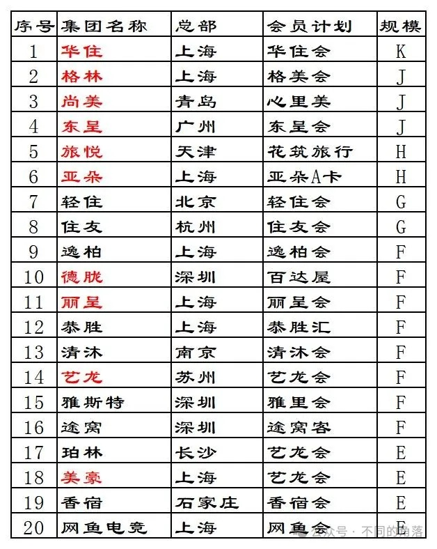
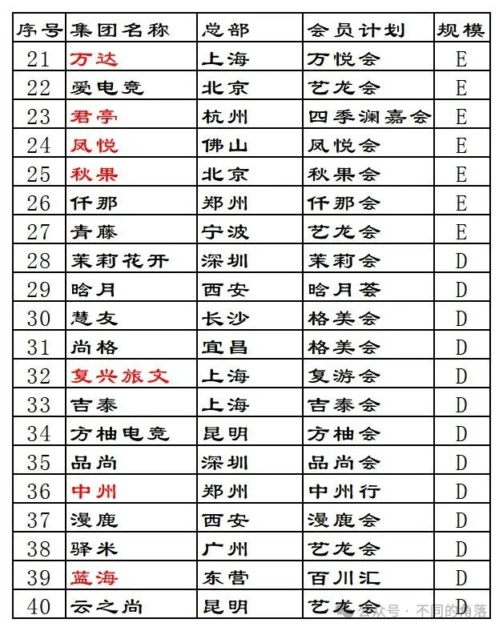
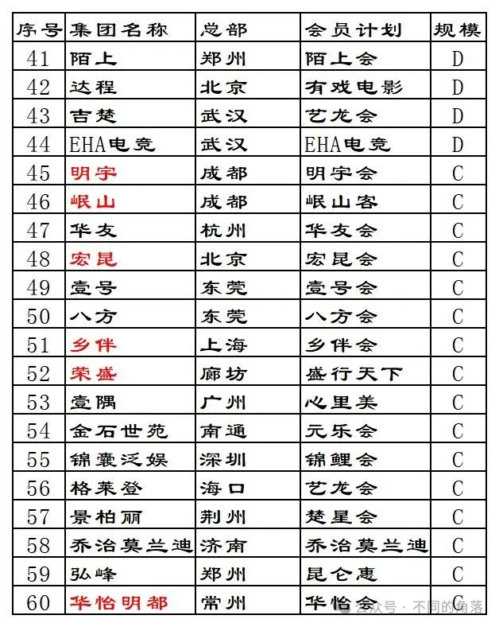
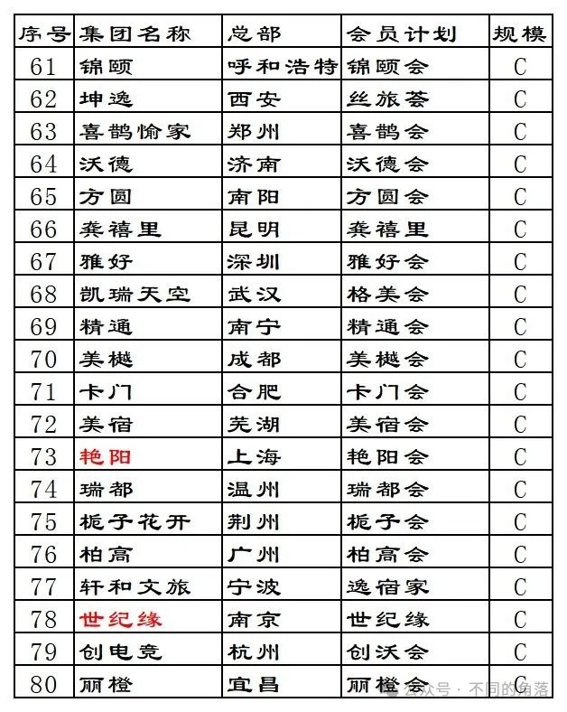
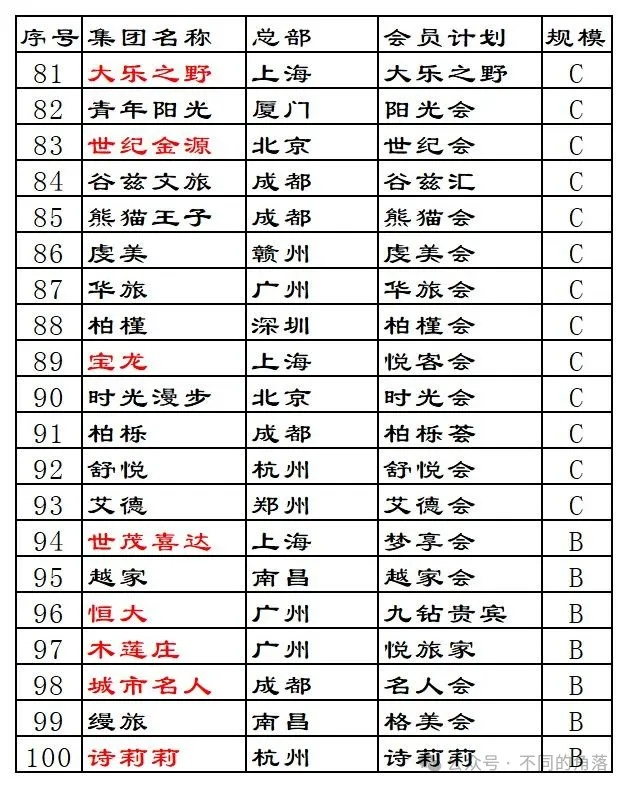
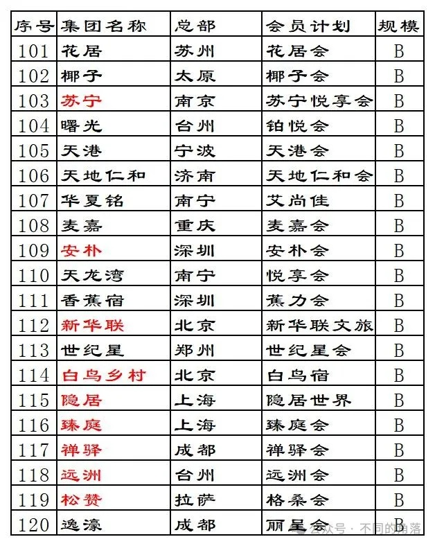
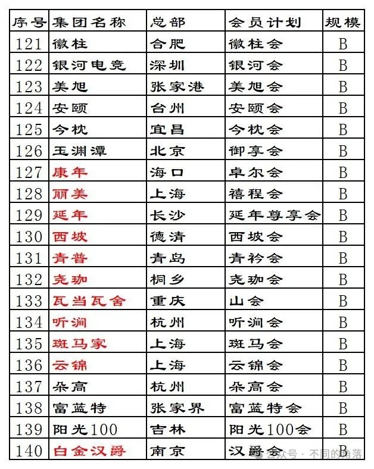
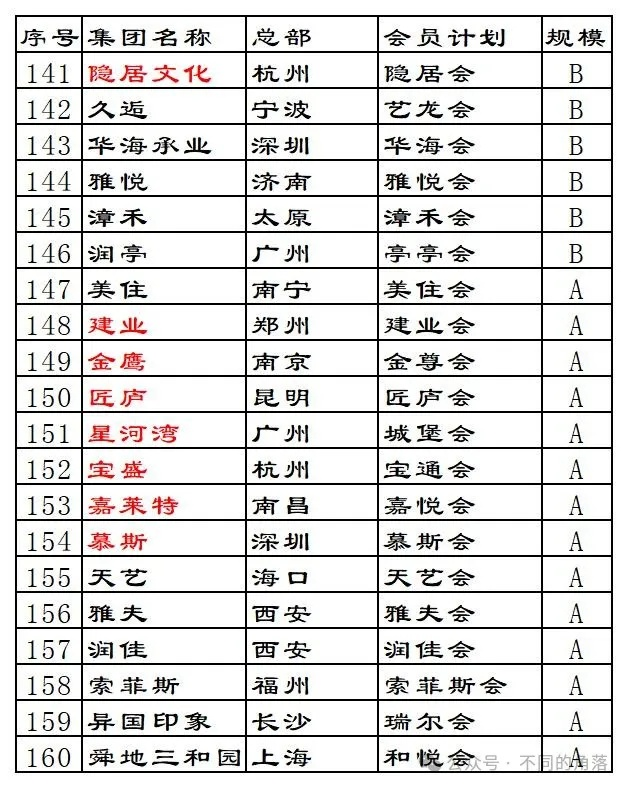
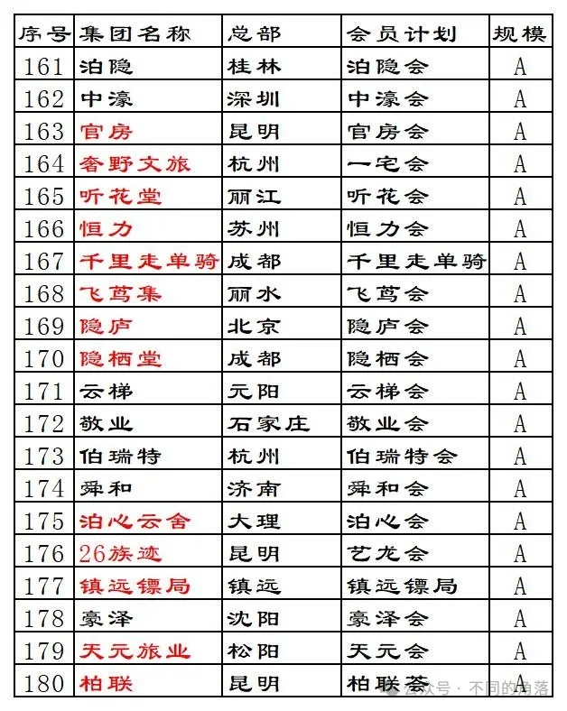
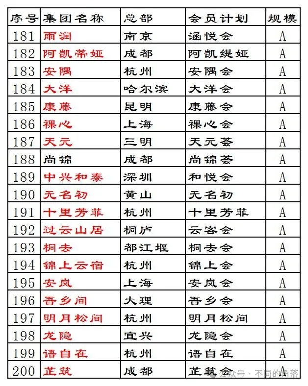

# 酒店常识十五国内酒店集团统计民营篇

> 本文转载自微信公众号 **不同的角落**，已获作者授权。  
> 原文发布于 2024年3月4日 23:55  
> 原文链接：[mp.weixin.qq.com](http://mp.weixin.qq.com/s?__biz=MzU4OTczMzkwNw==&mid=2247513493&idx=1&sn=34f5a9e0638361c912223f6e8f5d88d5&chksm=fdcbfce9cabc75ffe87f4762c396dfbbbf46f6d8a4bfaf295e86308a94abd40779839a8f63be)

---

本文已设置关键词自动回复，公众号发送“民营酒店”即可看到。

**关于更新**：不定期更新，更新就不群发通知了，在公众号发送“民营酒店”就可以看到自动回复的最新文章内容。更新也只统计200家。

国内酒店集团（管理公司）或是旗下有酒店业务的集团公司。

民营酒店集团（管理公司）只统计旗下有只有品牌的，规模在20家酒店以内的酒店集团只统计了一部分，以有一定特色和知名度的为主，当然其中很多酒店的设施服务与高房价完全不匹配，妥妥的智商税。

民营酒店集团（管理公司）中富力、融创2家卖卖卖的未统计。

旗下有1000多家已开业酒店的华驿70%股权2022年时已经被首旅酒店集团旗下如家收购；旗下有800多家已开业酒店的都市70%股权已经被岭南收购（之前2019年12月格林收购都市70%股权，后又于2022年底将70%股权出售给都市创始人）。华驿、都市不再是独立存在的民营酒店集团不予统计。

同程旗下艺龙酒店科技平台目前已与10多家酒店集团合作上线1500多家酒店，共用“艺龙会”会员计划。本次艺龙酒店管理（苏州）有限公司只统计了艺龙前缀和艺选前缀品牌酒店，这些品牌由艺龙酒店科技平台多家不同酒管公司运营管理；另外统计了与艺龙酒店科技平台合作的美豪、珀林、爱电竞、青藤、驿米、云之尚、吉楚、艾德、久逅、26族迹10家酒店集团，其中美豪、爱电竞已被同程收购，青藤、艾德、26族迹暂时还未上线艺龙会；已进驻艺龙酒店科技平台的其它酒店集团未统计。

知名度和影响力不够的中小规模酒店集团加入有一定规模和影响力的常旅客会员计划平台已成为趋势。目前看来选择同程旗下艺龙会和携程旗下丽呈会的比较多一些。

部分酒店集团常旅客会员计划并无特定名称，只是XX酒店会员，其会员计划暂以XX会代替，比如仟那酒店会员计划写成仟那会，秋果酒店会员计划写成秋果会。

留给各家酒店集团的常旅客会员计划可选名称已经不多了，想起名的可要尽快了。目前已有酒店集团常旅客会员计划重名的了，也有一些连锁酒店加入2个常旅客会员计划的。

一些中小规模酒店集团官方平台常旅客会员计划只有部分酒店加入，有些酒店集团会员计划形同虚设，已经无法在酒店官方平台预订。

个人精力有限，如有差错纰漏烦请各位指正！！！

**民营酒店集团**

规模栏各字母代表酒店集团旗下开业酒店数量如下：

A：1—10，B：11—20，C：21—50，

D：51—100，E：101—200，F：201—500，

G：501—1000，H：1001—2000，          

J：2001—5000，K：5001—10000，      

L：10001—20000。

01、华住酒店管理有限公司，旗下有宋品、施柏阁大观、施柏阁、禧玥、美仑美奂、花间堂、桔子水晶、漫心、全季、星程、汉庭、怡莱、海友、瑞贝庭公寓、城家公寓等众多品牌；还特许经营雅高旗下美爵、诺富特、美居、宜必思尚品、宜必思5个品牌，特许经营雅诗阁旗下馨乐庭公寓品牌，目前旗下已开业酒店9000多家。

旗下有上海长兴宋品、重庆山前宋品、桂林雁山宋品、无锡雪浪宋品、济南凤鸣宋品、成都青山宋品、昆明滇池宋品、长沙施柏阁大观、合肥施柏阁大观、广州施柏阁大观、济南融创施柏阁、哈尔滨融创施柏阁、上海东方美仑美奂、西安野生动物园美仑美奂、上海古北禧玥、北京后海鼓楼四合院漫心府、北京前门四合院漫心府、丽江花间堂·植梦园等酒店。

华住会会员计划。

02、格林酒店（上海）有限公司，旗下有雪上、格林东方、格美、格雅、格菲、格林电竞、格丽、格林豪泰、格林联盟、青皮树、贝壳、格林公寓、格林客栈等品牌；合作的湖南慧友酒店集团旗下慧友国际、悦致、菲伦、欢漫、欢致、美宿等品牌；与武汉凯瑞酒店合资公司格林凯瑞旗下的格林凯瑞国际、格林凯瑞精选、凯瑞美宿等品牌（部分酒店在格林官方平台但所有日期都显示满房不能预订）；与武汉尚格酒店合资公司旗下的尚一特品牌；与江西缦旅酒店合资公司旗下的格林缦旅系列品牌；与雅阁合资公司雅阁（北京）酒店管理有限公司旗下雅阁、雅阁璞邸、澳斯特等品牌（部分酒店在格林官方平台但所有日期都显示满房不能预订）；合作的马来西亚豪利维拉酒店旗下豪利维拉品牌，目前旗下已开业酒店4000多家。

旗下有雪上喀什塔什库尔干县红其拉甫酒店、格林东方喀什莎车县火车站酒店、格林东方昌吉准东经济技术开发区五彩新城酒店、格林东方贵溪市政府酒店、格林东方盐城滨海县欧堡利亚北辰酒店、格林东方佛山顺德区美的总部酒店等酒店。

格美会会员计划。

03、青岛尚美数智科技集团有限公司，旗下有兰欧国际酒店、美玥、云泊、兰欧、花美时、尚客优品、兰斐、兰里、品睿、骏怡、尚客优、AA连锁等品牌；入股的广州壹隅酒店旗下希诺、迎商2个品牌，还有特许经营的雅高旗下雅高瑞享品牌，目前旗下已开业酒店4000多家。

旗下有青岛五四广场香港中路兰欧国际酒店、上海松江MAXMA美玥酒店、云泊酒店武汉国际博览四新店、成都天府新区华阳麓山大道花美时酒店、南京江宁山水畔度假村花美时酒店、青岛雅高瑞享酒店等酒店。

心里美会员计划。

04、广西东呈酒店管理集团股份有限公司，旗下有吾公馆、蓓利夫人、殿影、臻程、怡程、宜尚PLUS、隐沫、宜尚、铂顿、锋态度、柏曼、城市精选、精途、城市便捷等品牌；还有特许经营的万豪旗下经济品牌万枫，目前旗下已开业酒店2000多家。

旗下有殿影酒店苏州元和塘店、隐沫酒店衢州凉亭湾店、臻程酒店北京南站西铁营地铁站店、臻程酒店武汉汉口火车站泛海CBD店等酒店。

东呈会会员计划。

05、旅悦（天津）酒店管理有限公司，携程旗下，旗下有花筑、花筑奢、蔚来、柏纳、檀程、般蓝、索性等品牌，目前旗下已开业酒店1500多家。

花筑旅行会员计划。

06、上海亚朵商业管理（集团）有限公司，旗下有萨和、A.T.HOUSE、The Drama、Z Hotel、亚朵S、亚朵、亚朵X、轻居（原亚朵轻居）等酒店品牌，目前旗下已开业酒店1000多家。

旗下有上海The Drama、上海外滩沙美大楼Z Hotel、上海徐家汇A.T.HOUSE、上海世博萨和、烟台璞园萨和、西安钟楼亚朵S吴酒店、西安南门亚朵S酒店（亚朵首店，已下线）、成都太古里商业区轻居·网易云音乐酒店。

亚朵A CARD会员计划。

07、轻住（南京）酒店管理有限公司，旗下有轻住、轻住·悦享、轻BOX、悦楹、秘栈INN等品牌。目前轻住平台可以预订的酒店有600多家。还有1400多家酒店所有日期都不能预订，打电话给这些不能预订的酒店打过去很多都不知道轻住，不将这些计入轻住旗下酒店名单。

轻住走的是OYO模式，更恰当来说是一个酒店联盟更合适，自有5个品牌没有多少店，其余很多都是挂到轻住平台的单体酒店前面加个轻住前缀，还有很多仍是单体酒店名称，大万豪、小希尔顿、小如家、新汉庭、新速8都有；还有一些是国内几大连锁酒店集团旗下品牌酒店，有锦江旗下欧暇地中海（不能预订，锦江官方平台有，120多元起房价）、7天（不能预订，锦江官方平台已下线），首旅旗下睿柏云（可预订，首旅官方平台有）、派柏云（不能预订，首旅官方平台有）、华驿精选（可预订，首旅官方平台有），格林旗下格菲（不能预订，格林官方平台有）、格林豪泰（不能预订，格林官方平台已下线）、贝壳（不能预订，格林官方平台有），东呈旗下宜尚（不能预订，酒店之前是首旅旗下莫泰，未上线东呈官方平台，150多元起房价）、城市便捷（不能预订，东呈官方平台无、OTA无、酒店无，电话是其它酒店），尚美旗下尚客优品（可预订，尚美官方平台有）、尚客优（可预订，尚美官方平台有），温德姆旗下速8（不能预订，速8官方平台已下线），住友旗下布丁（不能预订，住友官方平台有），逸柏旗下易佰（不能预订，逸柏官方平台有），青藤旗下南苑e家精选/南苑e家（有的可预订，有的不能预订，青藤官方平台有）等。轻住平台房价最贵的是一家所有房型都1999元的民宿，在OTA平台这家民宿房价399元起。

轻住会会员计划。

08、布丁酒店浙江股份有限公司，旗下有布丁、布丁精选、布丁严选、布丁驿、智尚、智尚臻选、智尚惠选、春秋布舍、蔷薇蔓居、爆米花、莱住、心逸、漫果公寓等品牌。目前住友官方平台可查询已开业酒店有500多家。

住友会会员计划。

09、逸柏酒店集团有限公司，旗下有途客中国、途客呈舍、君奢、锐思特逸致、锐思特、逸柏联盟、易佰良品、易佰等品牌。目前逸柏平台可查询已开业酒店400多家。2024年1月逸柏与格林分手，重新启用逸柏会会员计划。

逸柏会会员计划。

10、海南德胧酒店管理有限公司，包括浙江开元酒店管理股份有限公司和百达屋酒店管理（深圳）有限公司，旗下有方外、开元观堂、开元名都、芳草地、开元名庭、颐居、曼居、穆拉、瑰宝等品牌，目前旗下已开业酒店400多家。

旗下有杭州富春方外、宁波十七房开元观堂、绍兴大禹开元观堂、杭州天域开元观堂、余姚阳明开元观堂、嘉兴揽秀园开元观堂、东驿敦煌酒店、杭州开元名都、长兴芳草地、杭州富春芳草地、绍兴镜湖开元颐居、开元萧山宾馆等酒店。原开元商祺会会员计划已停用。

百达屋会员计划。

11、丽之呈科技（上海）有限公司，携程旗下，其实也更像一个酒店联盟。旗下有丽呈华廷、丽呈、丽呈别院、丽呈睿轩等品牌，目前十多家中小酒店集团与丽呈合作，部分酒店上线丽呈会平台。目前旗下已开业酒店300多家。

丽呈会会员计划。

12、上海恭胜酒店管理有限公司，旗下有99旅馆、99优选、青季、青季MINI、云绯、云宽、开蔓、艾陌等品牌。目前恭胜平台可查询已开业酒店300多家。

恭胜汇会员计划。

13、江苏清沐酒店管理有限公司，旗下有清沐、清沐精选、清沐铂金、清沐·尚、清沐·礼、沐江南、榴莲糖果、榴莲小星、咖居、迷潮等品牌。目前清沐平台可查询已开业酒店300多家。

清沐会会员计划。

14、艺龙酒店管理（苏州）有限公司，同程旗下，旗下有艺龙国际、艺龙、艺龙壹棠、艺龙玺程、艺龙安悦、艺龙海雅、艺龙瑞云、艺龙安云、艺龙亦云、艺选安来、艺选等品牌；这些品牌由艺龙酒店科技平台多家不同酒管公司运营管理。目前旗下艺龙/艺选前缀品牌已开业酒店300多家。

艺龙会会员计划。

15、雅斯特酒店（深圳）集团有限公司，旗下有雅斯特、雅斯特国际、雅斯菲尔、雅美途等品牌。目前旗下已开业酒店200多家。

雅里会会员计划。

16、途窝酒店集团（深圳）有限公司，旗下有途窝假日、途窝假日庄园、迹墨文化客栈、迹墨主题酒店、五悦、途窝上品等品牌。目前旗下已开业酒店200多家。

途窝客会员计划。

17、珀林酒店集团有限公司，旗下有廷泊、君屿、莫林、莫林风尚、莫林锦尚、莫林精选、麓元林等品牌。目前旗下已开业酒店200多家。

艺龙会会员计划。

18、上海美豪商业管理有限公司，同程旗下，旗下有美豪雅致、美豪丽致、美丽豪、美豪、怡致、R ROYALSS等品牌。目前旗下已开业酒店近200家。

艺龙会会员计划。

19、河北香宿酒店集团有限公司，旗下有驿家365、唐年商旅、千里行公寓酒店、VS电竞酒店等品牌。目前旗下近200家已开业酒店。

香宿会会员计划。

20、上海网鱼信息科技有限公司，旗下有网鱼电竞酒店品牌。目前旗下近200家已开业酒店。

网鱼俱乐部会员计划。

21、万达酒店管理（上海）有限公司，万达旗下，旗下有万达瑞华、万达文华、万达嘉华、万达锦华、万达颐华、万达美华、万达悦华等品牌。目前旗下150多家已开业酒店。

旗下有上海万达瑞华、成都万达瑞华、武汉万达瑞华、三亚海棠湾万达瑞华、北京万达文华、苏州宜兴西岸凰川酒店、西双版纳稷泽万达文华、延安万达嘉华、营口万达锦华等酒店。

万悦会会员计划。

22、北京爱电竞酒店管理有限公司，同程旗下，旗下有IDG爱电竞、IEH爱电竞、艺龙电竞、艾特摩高电竞、优恩电竞联盟酒店品牌。目前旗下已开业酒店150多家。

艺龙会会员计划。

23、君亭酒店集团股份有限公司，旗下有君澜理、君澜大饭店、君澜度假酒店、君亭、夜泊君亭、Pagoda君亭设计、君亭尚品、景澜、景澜度假、景澜青棠等品牌。目前旗下已开业酒店近150家。

四季澜嘉会会员计划。

24、凤悦酒店管理（广东）有限公司，碧桂园旗下，旗下有凤凰、凤颐、凤悦、凤祺公寓、凤悦轻尚、凤祺公寓等品牌；特许经营的希尔顿旗下进驻国内最低端品牌希尔顿惠庭（凤悦官方平台将一些希尔顿惠庭酒店标注为五星级，还有的标注为豪华型，希尔顿惠庭品牌与希尔顿旗下普通五星级酒店品牌希尔顿相差四档）；特许经营的雅高旗下进驻国内最低端品牌JO&JOE；还与美诺酒店集团成立的合资公司凤悦美诺，负责美诺旗下安纳塔拉、安凡尼、缇沃丽、诺瀚、诺瀚精选、盛橡公寓等8个品牌在国内的管理运营。目前旗下已开业酒店100多家。

凤悦会会员计划。

25、北京秋果酒店管理有限公司，旗下有秋果S、秋果酒店品牌。目前旗下已开业酒店100多家。

秋果会会员计划。曾与丽呈合作部分酒店加入丽呈会，后又退出。

26、河南省仟那酒店管理咨询有限公司，旗下有仟那、仟那千寻、仟那万熙、仟那旅途、仟那美宿、仟那观山等酒店品牌。目前旗下已开业酒店100多家。

仟那会会员计划。

27、宁波青藤酒店集团有限公司，旗下有墨憩、四季青藤、青藤艺宿、南苑e家plus、南苑e家等酒店品牌。目前旗下已开业酒店100多家。

艺龙会会员计划（2月底上线）。原青藤荟会员积分继续在青藤荟会员计划使用。

28、深圳市和悦茉莉花开酒店管理有限公司，旗下有茉莉花开、途泊拉、悦薇酒店品牌。目前旗下已开业酒店近100家。

蓝精灵会员计划。

29、西安晗月酒店管理集团有限公司，旗下有H酒店、Y酒店、度假云、晗月云、晗途酒店品牌。目前旗下已开业酒店近100家。

晗月荟会员计划。

30、湖南慧友酒店集团有限公司，旗下有悦致、欢致、欢漫、菲伦、美宿酒店品牌。目前旗下已开业酒店近100家。

格美会会员计划。

31、尚格酒店管理（武汉）有限公司，旗下有尚一特、尚玥、岸边酒店品牌。目前旗下已开业酒店80多家。

格美会会员计划。

32、上海复兴旅游发展有限公司，复兴旗下，旗下地中海俱乐部酒店集团有地中海俱乐部度假村、地中海·白日方舟度假村、地中海·邻境度假村品牌，还有特许经营的柯兹纳酒店集团旗下亚特兰蒂斯品牌。目前旗下已开业酒店70家。

旗下有三亚亚特兰蒂斯、地中海俱乐部长白山度假村、地中海俱乐部北大壶度假村、地中海俱乐部亚布力度假村、地中海俱乐部桂林度假村、地中海俱乐部丽江度假村、地中海白日方舟南京仙林度假村、地中海邻境安吉度假村、地中海邻境北京延庆度假村、地中海邻境千岛湖度假村等酒店。

复游会会员计划。

33、吉泰酒店集团有限公司，旗下有吉泰、唯庭、渝舍印象酒店品牌。目前旗下已开业酒店60多家。

吉泰会会员计划。

34、深圳方柚酒店管理有限公司，旗下有方柚电竞酒店品牌。目前旗下已开业酒店60多家。

方柚会会员计划。

35、深圳品尚酒店管理有限公司，旗下有品尚、品尚奕、品尚瑾、品尚优艺、品牌微等酒店品牌。目前旗下已开业酒店50多家。

品尚会会员计划。

36、河南中州国际酒店集团有限公司，旗下有中州国际、中州悦隐、中州颐和、中州雅致、中州商务酒店品牌。目前旗下已开业酒店60多家。

中州行会员计划。

37、西安漫鹿酒店管理集团有限公司，旗下有漫鹿云际、漫鹿CC、漫鹿INS设计、漫鹿Loft等酒店品牌。目前旗下已开业酒店60多家。

漫鹿会会员计划。

38、广州驿米酒店管理有限公司，旗下有逸米、逸米精选酒店品牌。目前旗下已开业酒店60多家。

艺龙会会员计划。

39、山东蓝海酒店管理股份有限公司，旗下有蓝海御华、蓝海钧华、蓝海禧华、蓝海朗汀、蓝海酒店品牌。目前旗下已开业酒店50多家。

百川汇会员计划。

40、云南云之尚酒店管理有限责任公司，旗下有云之尚、锦顺天华、四季柔光酒店品牌。目前旗下已开业酒店50多家。

艺龙会会员计划。

41、河南陌上酒店管理集团有限公司，旗下有陌上轻奢、陌上轻雅、陌上轻居、陌上艺宿酒店品牌。目前旗下已开业酒店50多家。

陌上会会员计划。

42、湖北乐创酒店管理有限公司，旗下有有邦、有戏电影、有戏度假、有戏电竞、有戏程缘、影宿互娱、恋乡有戏、艾特、蓝鱼电影、蓝鱼电竞等酒店品牌。目前旗下已开业酒店50多家。

有戏电影会员计划。另外有戏电影酒店与雅斯特合作加入雅里会会员计划。

43、湖北吉楚酒店有限公司，旗下有吉楚、优驿、曼品、九尾狐主题酒店品牌。目前旗下已开业酒店50多家。

艺龙会会员计划。

44、湖北宇竞互娱酒店管理有限公司，旗下有EHA电竞、EHA萤火电竞、EHA辉月电竞等酒店品牌。目前旗下已开业酒店50多家。

EHA电竞会员计划。

45、明宇商旅股份有限公司，旗下有明宇豪雅、明宇丽雅、明宇尚雅酒店品牌；与丽呈合作的明宇丽呈系列品牌；经营管理台湾蕃薯藤品牌；还特许经营凯悦旗下凯悦嘉轩、凯悦嘉寓、凯悦臻选、凯悦尚萃等酒店品牌；持有并管理一家雅高旗下索菲特品牌酒店。目前旗下已开业酒店40多家。目前旗下有成都三岔湖蕃薯藤度假酒店、成都瑯珀凯悦臻选、成都青城山尊、成都东大明宇豪雅、北京索菲特等酒店。

明宇会会员计划。与丽呈合作的明宇丽呈系列酒店加入丽呈会会员计划。

46、四川岷山酒店管理有限责任公司，旗下有岷山饭店、岷山大酒店、岷山安逸、行者牧心酒店品牌，与丽呈合作的岷山丽呈系列品牌，目前查询到岷山旗下已开业酒店40多家。

岷山客会员计划。与丽呈合作的明宇丽呈系列酒店加入丽呈会会员计划。

47、杭州恒八快捷酒店管理连锁有限公司，旗下有恒8、恒8优选、此印酒店品牌。目前旗下已开业酒店40多家。

华友会会员计划。

48、北京宏昆酒店管理有限公司，旗下有朗丽兹、康福瑞、怡和东方酒店品牌。目前旗下已开业酒店40多家。

宏昆会会员计划。

49、东莞市壹号酒店有限公司，旗下有壹号、壹号优客、欧斯卡、欧斯卡国际酒店品牌。目前旗下已开业酒店40多家。

壹号会会员计划。

50、东莞市八方快捷酒店有限公司，旗下有八方、八方精选酒店品牌。目前旗下已开业酒店40多家。

八方会会员计划。

51、上海大乡伴文化旅游发展有限公司，旗下有原舍、树蛙部落、圃舍、野邻、绿乐园酒店品牌。目前旗下已开业酒店40多家。

旗下目前有原舍揽树松阳店、原舍阅江太仓店、原舍阅水昆山人民雅集、原舍祝甸周庄古镇店、原舍阿者科元阳梯田店、原舍慕拉雅元阳梯田店、原舍绿茵成都新都店、树蛙部落铜仁店、树蛙部落余姚店、树蛙部落婺源店、树蛙部落新余店、树蛙部落安庆菜子湖店、树蛙部落西宁店、树蛙部落太仓店、树蛙部落天津童梦闹天空、野邻·莫干山花园营地、童廿民宿彭州店、童廿树屋庐江万山店、圃舍悦江佛山里水店等酒店。

乡伴会会员计划。

52、廊坊荣盛酒店经营管理有限公司，旗下有荣玺庄园、阿尔卡迪亚、荣逸、荣馨酒店品牌。目前旗下已开业酒店30多家。

盛行天下会员计划。

53、广州市壹隅酒店管理有限公司，旗下有希诺、迎商酒店品牌。目前旗下已开业酒店30多家。

心里美会员计划。

54、南通金石世苑酒店有限公司，旗下有金石国际、金石精品、格雷斯、格雷斯精选、格集曼、格集曼优选等酒店品牌。目前旗下已开业酒店30多家。

元乐会会员计划。

55、赋能酒店管理（深圳）有限公司，旗下有锦囊泛娱、锦囊泛娱电竞、IDEA、IDEA电竞等酒店品牌。目前旗下已开业酒店30多家。

锦鲤会会员计划。

56、海南格莱登酒店管理有限公司，旗下有格莱登智慧、格莱登S、枫林晚、M酒店、漫亦、假日宣言等酒店品牌。目前旗下已开业酒店30多家。

艺龙会会员计划。

57、湖北景柏丽酒店管理有限公司，旗下有楚星欣禧、楚星欣选、雅诗景、欧非特、楚星等酒店品牌。目前旗下已开业酒店30多家。

楚星会会员计划。

58、山东百宅一生酒店管理有限公司，旗下有乔治莫兰迪酒店品牌。目前旗下已开业酒店30多家。

乔治莫兰迪俱乐部会员计划。部分酒店加入丽呈会会员计划。

59、河南弘峰酒店管理有限公司，旗下有昆仑乐居、昆仑雅居、昆仑精选、静果、静呈等酒店品牌。目前旗下已开业酒店30多家。

昆仑惠会员计划。

60、江苏华怡明都酒店集团有限公司，旗下有明都、华庭、明庭酒店品牌。目前旗下已开业酒店30多家。

华怡会会员计划。

61、内蒙古锦颐酒店管理股份有限公司，旗下有云颐自在、锦颐优选、锦颐品牌。目前旗下已开业酒店30多家。

锦颐会会员计划。

62、西安坤逸商业运营管理有限责任公司，旗下有坤逸精品、坤逸时光、坤逸星光、坤逸月光、东方非凡等酒店品牌。目前旗下已开业酒店30多家。

丝旅荟会员计划。

63、河南喜鹊愉家旅馆管理服务有限公司，旗下有喜鹊洛神、喜鹊CC、喜鹊愉家酒店品牌。目前旗下已开业酒店30多家。

喜鹊会会员计划。

64、山东尚儒沃德酒店管理有限公司，旗下有沃德、沃德Smart酒店品牌。目前旗下已开业酒店30多家。

沃德会会员计划。

65、河南方圆酒店管理有限公司，旗下有方圆、麒御酒店品牌。目前旗下已开业酒店30多家。

方圆会会员计划。

66、云南龚禧里酒店管理有限公司，旗下有龚禧里·玺阁、龚禧里、米朵、君遨、遨登、清渡、清伴、G.GAME、恬芒果等酒店品牌。目前旗下已开业酒店30多家。

龚禧里会员计划。

67、深圳雅好酒店集团有限公司，旗下有雅好、雅好精选、雅好花园、雅赞、蓝图花园等酒店品牌。目前旗下已开业酒店30多家。

雅好会会员计划。

68、武汉凯瑞天空酒店管理有限公司，旗下有凯瑞国际、凯瑞精选、凯瑞美宿酒店品牌。目前旗下已开业酒店近30家。

之前与格林合作加入格美会会员计划，现在已经不能在格林平台预订，原有会员计划尊爵会也没有恢复。

69、广西精通酒店管理有限公司，旗下有精通、精通101酒店品牌。目前旗下已开业酒店近30家。

精通会会员计划。

70、成都美樾商旅旅游发展有限公司，旗下有来住星辰、来住别院、仅禧等酒店品牌。目前旗下已开业酒店近30家。

美樾会会员计划。与丽呈合作的丽呈来住系列酒店加入丽呈会会员计划。

71、安徽卡门酒店管理有限公司，旗下有卡门影宿、云之家影宿、领航居酒店品牌。目前旗下已开业酒店20多家。

卡门会会员计划。

72、芜湖美宿酒店管理有限公司，旗下有美宿、美宿艺术品、美泊艺术、美乐汀酒店品牌。目前旗下已开业酒店20多家。

美宿会会员计划。

73、深圳艳阳度假旅游投资发展有限公司，金恪旗下，旗下有艳阳度假、艳阳国际等酒店品牌。目前旗下已开业酒店20多家。

艳阳会会员计划。

74、浙江瑞都酒店集团有限公司，旗下有瑞都国际、瑞都商务、瑞都E、瑞都连锁酒店品牌。目前旗下已开业酒店20多家。

瑞都会会员计划。

75、荆州市栀子花开酒店管理有限公司，旗下有栀子花开酒店品牌。目前旗下已开业酒店20多家。

栀子花开会员计划。

76、广州柏高酒店管理有限公司，旗下有骑士物语、柏高·雅、柏高酒店品牌。目前旗下已开业酒店20多家。

柏高会会员计划。

77、宁波轩和文旅企业管理有限公司，旗下有逸宿、逸宿泊庭、逸宿印象、逸宿轻居酒店品牌。目前旗下已开业酒店20多家。

逸宿家会员计划。

78、南京世纪缘酒店集团有限公司，旗下有世纪缘国际、世纪缘、世纪缘泊漫、世纪缘精品、世纪之星等酒店品牌。目前旗下已开业酒店20多家。

世纪缘会员计划。

79、杭州创沃酒店管理有限公司，旗下有创电竞、创电竞智选、创电竞智慧、创沃电竞酒店品牌。目前旗下已开业酒店20多家。

创沃会会员计划。

80、湖北丽橙连锁酒店有限公司，旗下有丽橙水晶、丽橙·趣、丽橙·智、丽橙·悦酒店品牌。目前旗下已开业酒店20多家。

丽橙会会员计划。

81、上海野舍酒店管理有限公司，旗下有大乐之野、向野而生酒店品牌。目前旗下已开业酒店20多家。

旗下目前有大乐之野·中卫沙坡头、大乐之野·杭州桐庐、大乐之野·呼和浩特黄河大峡谷、大乐之野·兴安盟乌兰毛都、大乐之野·宁波慈城古镇、大乐之野·当阳山与寺、大乐之野·重庆四面山、大乐之野·龙南围屋、大乐之野·随州银杏谷、向野而生·杭州神都武备、向野而生·丽江在云端、向野而生·绍兴夏意等酒店。

大乐之野会员计划。

82、厦门青年阳光酒店有限公司，旗下有青年阳光S、青年阳光、在路上酒店品牌。目前旗下已开业酒店20多家。

阳光会会员计划。

83、世纪金源酒店管理有限公司，旗下有睿世、世纪金源、君豪、世纪金源域景、世纪金源域美等酒店品牌。目前旗下已开业酒店20多家。

世纪会会员计划。

84、四川谷兹酒店管理有限公司，旗下有谷兹尊铂、谷兹铂雅名人、谷兹怡家丽景、谷兹怡家、谷兹怡家城市等酒店品牌。目前旗下已开业酒店20多家。

谷兹汇会员计划。

85、四川泰合熊猫王子酒店管理股份有限公司，泰合旗下，旗下有熊猫王子、熊猫仔酒店品牌。目前旗下已开业酒店20多家。

熊猫会会员计划。

86、江西省虔美酒店管理有限公司，旗下有虔美国际、虔美悦季、虔美、微速、微速优选等品牌。目前旗下已开业酒店20多家。

虔美会会员计划。

87、广州华旅酒店集团有限公司，旗下有宜致、华旅酒店品牌。目前旗下已开业酒店20多家。

华旅会会员计划。

88、深圳市柏槿酒店管理有限公司，旗下有柏槿、八号季、八号酒店品牌。目前旗下已开业酒店20多家。

柏槿会会员计划。

89、上海宝龙艺境酒店管理有限公司，宝龙旗下，旗下有宝龙艺珺、宝龙艺悦酒店品牌，还有与万豪、温德姆、丽笙等国际酒店集团合作的国际连锁品牌酒店。目前旗下已开业酒店20多家。

悦客会会员计划。

90、北京时光漫步酒店管理有限公司，旗下有时光漫步S、时光漫步、时光赞歌花园酒店品牌。目前旗下已开业酒店20多家。

时光会会员计划。

91、柏栎酒店管理（成都）有限公司，旗下有柏栎、柏栎荟舍、栎宜酒店品牌。目前旗下已开业酒店20多家。

柏栎会会员计划。

92、浙江舒悦酒店管理有限公司，旗下有舒悦、喆遇酒店品牌。目前旗下已开业酒店20多家。

舒悦会会员计划。与越家、维朵等酒店集团共用会员计划。

93、河南艾德酒店管理有限公司，旗下有艾德品悦、艾德悦朋、艾德笙澜等酒店品牌。目前旗下已开业酒店20多家。

艾德酒店会员计划。即将加入艺龙会会员计划。

94、上海世茂喜达酒店管理有限公司，世茂旗下，旗下有世御、茂御、睿选、凡象等酒店品牌。目前旗下已开业酒店20多家。

旗下目前有建水和院世御精品酒店、上海崇明由由世御别墅酒店等酒店。

世茂旗下的上海世茂酒店管理有限公司旗下还有还有多家与万豪、希尔顿、洲际、凯悦等国际酒店集团合作的国际连锁品牌酒店。

梦享会会员计划。部分酒店加入丽呈会会员计划。

95、上海东吴越家酒店（集团）有限公司，科扬网络旗下，旗下有越家国际、越家逸品、越家智选、越家轻奢、越家、越家轻居、越家优品、越家青旅酒店品牌。目前旗下已开业酒店20多家。

越家会会员计划。与舒悦、维朵等酒店集团共用会员计划。

96、广州市恒大酒店有限公司，恒大旗下，旗下有恒大酒店品牌。目前旗下已开业酒店20家。

九钻贵宾会员计划。

97、广州市木莲庄酒店管理有限公司，旗下有木莲庄、木文缇、Mordon酒店品牌。目前旗下已开业酒店20家。

悦旅家会员计划。

98、城市名人酒店管理（中国）股份有限公司，旗下有城市名人、名人酒店品牌。目前旗下已开业酒店近20家。

名人会会员计划。

99、江西缦旅酒店管理有限公司，旗下有缦旅、维珍天使、碧尤蒂、阳光假日等酒店品牌。目前旗下已开业酒店近20家。

格美会会员计划。

100、深圳市中宿酒店管理有限公司，旗下有诗莉莉、漫戈塔酒店品牌。目前旗下已开业酒店近20家。

旗下目前有金华诗莉莉·北山三十六院溪温泉度假酒店、黄山诗莉莉·慰颜府文化遗址汤泉度假酒店、黄山诗莉莉·宏村青梅学社温泉酒店、博罗诗莉莉漫戈塔·非洲假日野奢酒店、桐庐漫戈塔·大奇山酒店、肥西诗莉莉·山南钓影园度假村等酒店。

诗莉莉会员计划。

101、苏州花居酒店管理集团有限公司，旗下有花居、漫际、逅居、柏筑酒店品牌。目前旗下已开业酒店近20家。

花居会会员计划。

102、山西椰子酒店管理有限公司，旗下有椰子水晶、椰子丽致、初泮酒店品牌。目前旗下已开业酒店近20家。

椰子会会员计划。

103、江苏苏宁银河酒店管理有限公司，苏宁旗下，旗下有苏宁雅悦酒店品牌。还有与雅高、凯悦、美高梅等酒店集团合作的国际品牌酒店，目前旗下已开业酒店近20家。

旗下目前有上海苏宁宝丽嘉酒店、苏宁钟山国际高尔夫酒店、南京苏宁索菲特银河大酒店、无锡苏宁凯悦酒店、南京河西苏宁雅悦酒店等酒店。

苏宁悦享会会员计划。

104、曙光酒店管理集团有限公司，旗下有曙光国际、曙光铂尊、曙光薇酒店品牌。目前旗下已开业酒店近20家。

铂悦会会员计划。

105、天港酒店集团有限公司，旗下有天港禧悦、天港漫非酒店品牌。目前旗下已开业酒店近20家。

天港会会员计划。

106、山东天地仁和酒店管理有限公司，旗下有天地仁和酒店品牌。目前旗下已开业酒店近20家。

天地仁和会员计划。

107、广西华夏铭酒店集团有限公司，旗下有优范、优范PLUS、优范Light、优逸、优轩、艾尚佳酒店品牌。目前旗下已开业酒店近20家。

艾尚佳会员计划。

108、重庆麦十嘉酒店集团有限公司，旗下有麦嘉·拾趣、麦瑞卡酒店品牌。目前旗下已开业酒店近20家。

麦嘉会会员计划。

109、深圳安朴酒店管理有限公司，华为旗下。旗下有安朴、安朴珀莱、安朴逸城、安朴悦庭、安朴怡庭等品牌。目前旗下已开业酒店近20家。

安朴会会员计划。

110、广西天龙湾酒店管理有限公司，旗下有天龙湾璞悦、天龙湾景悦、天龙湾融悦酒店品牌。目前旗下已开业酒店近20家。

悦享会会员计划。

111、深圳市香蕉宿科技有限公司，旗下有香蕉、力亚、香蕉FUN、香蕉设计酒店等品牌。目前旗下已开业酒店近20家。

蕉力会会员计划。

112、新华联酒店管理有限公司，新华联旗下，旗下有新华联绿心谷、新华联丽景、新华联瑞景、新华联主题客栈酒店品牌，还有与万豪、雅高合作的国际品牌酒店。目前旗下已开业酒店10多家。

旗下目前有长沙铜官窑新华联绿心谷酒店、长沙新华联铜官窑古镇主题客栈、西宁新华联海洋度假酒店等酒店。

新华联文旅会员计划。

113、郑州世纪星快捷酒店有限公司，旗下有艾尚、世纪星精品、世纪星、世纪星连锁酒店品牌。目前旗下已开业酒店10多家。

世纪星会员计划。

114、北京驿时空酒店管理有限公司，旗下有白鸟VILLA民宿、白鸟精品民宿、白鸟小院酒店品牌。

旗下目前有白鸟VILLA私汤民宿·青石岭、白鸟VILLA私汤民宿·神堂峪、白鸟VILLA乡村度假民宿·杨树林、白鸟VILLA汤池民宿·火星人店、白鸟宿精品民宿·远山宿说店、白鸟田野精品民宿·天津九山顶店、白鸟小院·桥梓山吧店、觅迦小居·慕田峪店等10多家酒店。

白鸟宿会员计划。

115、上海隐居酒店管理有限公司，旗下有隐居酒店品牌。

旗下目前有上海隐居繁华武康路公馆、扬州隐居瘦西湖温泉度假酒店、泰安隐居泰山大酒店、丽水隐居画乡院落酒店、苏州挫政园隐居酒店、苏州隐居天平山人文度假酒店、宁波隐居溪口漫休谷度假村、景德镇隐居景德艺术酒店、重庆隐居璧山夜泊秀湖度假酒店、桂林万象隐居酒店、西昌领地隐居酒店、蓬莱隐居人文度假酒店、烟台隐居养马岛别墅度假酒店、杭州千岛湖隐居酒店、嘉善越里隐居酒店、镇江金山寺隐居酒店等16家酒店。

隐居世界会员计划。

116、上海臻庭酒店管理有限公司，旗下有云和夜泊、臻庭、吴先生的酒店、麦新格等酒店品牌。目前旗下已开业酒店10多家。

臻庭汇会员计划。曾与丽呈合作部分酒店加入丽呈会会员计划，后退出。

117、四川禅驿酒店管理有限公司，旗下有禅驿酒店品牌。旗下目前有乐山金叶·禅驿度假酒店、乐山嘉定院子·禅驿度假酒店、绵阳禅驿·仙海别院、青神禅驿·忆村院子、彭州禅驿·丹景度假酒店等10多家酒店。

禅驿会会员计划。曾与丽呈合作部分酒店加入丽呈会会员计划，后退出。

118、远洲旅业有限公司，旗下有远洲、庐境、逸廷、轩廷酒店品牌。目前旗下已开业酒店10多家。

远洲会会员计划。

119、迪庆松赞文化旅游有限责任公司，旗下有松赞、松赞山居等品牌。

旗下目前有松赞绿谷山居、松赞丽江山居、松赞石月亮山居、松赞奔子栏山居、松赞塔城山居、松赞梅里山居、松赞波密山居、松赞来古山居、松赞南迦巴瓦山居、松赞香格里拉林卡、松赞巴松措林卡、松赞拉萨林卡等10多家酒店。

格桑会会员计划。

120、四川逸濠雅致酒店管理有限公司，旗下有西姆善居、西姆逸居、酒店品牌。目前旗下已开业酒店10多家。

丽呈会会员计划。

121、合肥徽柱酒店管理有限公司，旗下有海豚愉悦、海豚轻住、海豚美智酒店品牌。目前旗下已开业酒店10多家。

徽柱会会员计划。

122、银河电竞酒店管理有限公司，旗下有海豚愉悦、海豚轻住、海豚美智酒店品牌。目前旗下已开业酒店10多家。

徽柱会会员计划。

123、张家港美旭酒店管理集团有限公司，旗下有美旭系列酒店品牌。目前旗下已开业酒店10多家。

美旭会会员计划。

124、浙江安颐酒店管理有限公司，旗下有安颐、帕瑞思、帕菲克酒店品牌。目前旗下已开业酒店10多家。

安颐会会员计划。

125、湖北今枕酒店有限公司，旗下有运七、水云岚酒店品牌。目前旗下已开业酒店10多家。

今枕会会员计划。

126、北京玉渊潭酒店管理集团有限公司，旗下有御柏、御瑞、御骊、御朗酒店品牌，玉渊潭酒店母公司旗下还有洲际旗下品牌北京西南华邑酒店。目前旗下已开业酒店10多家。

御享会会员计划。

127、海南康年酒店管理有限公司，旗下有康年、康年方廷、康年方雅等酒店品牌。目前旗下已开业酒店10多家。

卓尔会会员计划。

128、上海丽美酒店管理有限公司，旗下有原美豪酒店旗下直营店10多家。有雅致、丽致、美丽豪、美豪等品牌。

禧程会会员计划。

129、长沙延年酒店管理有限公司，旗下有延年酒店品牌。目前旗下已开业酒店10多家。

延年尊享会会员计划。

130、德清县西坡酒店管理有限公司，旗下有西坡民宿品牌。旗下目前有西坡中卫、西坡象山、西坡震泽、西坡江山、西坡千岛湖、西坡莫干山、西坡劳岭良室、西坡龙南围屋等10多家民宿。

西坡会会员计划。

131、青岛青普旅游文化有限公司，旗下有青普文化行馆、青普甄选、青普这厢等酒店品牌。

旗下目前有青普文化行馆·扬州瘦西湖、青普文化行馆·苏州木渎、青普文化行馆·南靖土楼、青普文化行馆·丽江白沙、青普文化行馆·八达岭瑞云、青普文化行馆·晋江梧林、青普文化行馆·阳朔云庐、青普文化行馆·成都淼兮、青普文化行馆·蓬莱龙亭酒庄、青普文化行馆·杭州山也度、青普·婺源水岸边、青普这厢·芳华李窑等10多家酒店。

青衿会会员计划。

132、浙江黄金水岸酒店管理有限公司，旗下有尧珈酒店品牌。

旗下目前有新昌尧珈·观岚听雲、诸暨尧珈·禅悦民宿、诸暨尧珈·养心墅、安吉尧珈·1913民宿、安吉尧珈·清水谷民宿、安吉尧珈丨乡见·云竹谷民宿、安吉尧珈·仲夏Dream野奢酒店、温岭尧珈·星罗海野曙光民宿、关岭尧珈·望瀑悬崖民宿、关岭尧珈·凡舍悬崖精品民宿、黄果树尧珈·瀑布村度假酒店等10多家酒店。

尧珈会会员计划。

133、重庆瓦岗瓦舍酒店企业管理有限公司，旗下有瓦当瓦舍、既下山、咏归川酒店品牌。

旗下目前有既下山·德钦梅里、既下山·重庆、既下山·黄山文郁堂、既下山·大理古城、既下山·大理兰往、既下山·大理沙溪拾野花园、既下山·贡山雾里营地、咏归川·汉中秦岭、咏归川·隆化热河谷等10多家酒店。

山会会员计划。

134、浙江听涧文化旅游开发有限责任公司，旗下有听涧民宿品牌。

旗下目前有听涧·舟山登观海景Villa设计师民宿、听涧·六安不知周Brandy野奢庄园民宿、听涧·湖州莫干山卜宿喜度民宿、听涧·宜兴二十三湾岩壁私汤设计民宿、听涧·大理空院子田园设计民宿等10多家民宿。

听涧会会员计划。

135、上海班达旅游文化发展有限公司，旗下有班马家酒店品牌。目前旗下已开业酒店10多家。

班马家会员计划。

136、上海云锦未来酒店集团有限责任公司，旗下有云睿、云睿F、云睿@、趣栗酒店品牌。目前旗下已开业酒店10多家。

云锦会会员计划。

137、浙江朵高酒店管理有限公司，旗下有朵高、朵江南酒店品牌。目前旗下已开业酒店10多家。

朵高会会员计划。

138、张家界富蓝特酒店投资集团有限责任公司，旗下有富蓝特系列酒店品牌。目前旗下已开业酒店10多家。

富蓝特会员计划。

139、吉林阳光一百酒店管理有限公司，旗下有阳光100假日、阳光100快捷酒店品牌，还有首旅旗下的驿居、YUNIKE品牌酒店。目前旗下已开业酒店10多家。

阳光100会员计划。

140、宁波白金汉爵酒店投资有限公司，旗下有白金汉爵、汉爵酒店品牌。目前旗下已开业酒店10多家。

汉爵会会员计划。

141、隐居（上海）文化旅游发展有限公司，旗下有隐居、乡宿、悦隐堂、隐居度假等酒店品牌。

旗下有杭州隐居江南运河雅院、丽水隐居画乡院落酒店、杭州隐居安处城市度假酒店、ME酒店杭州西湖黄龙体育中心店、丽水杨家堂乡宿、宁波乡遇隐居云湖民宿、宁波小隐慈城·十八花房、宁波隐居慈城庭院公馆、盐城隐居穆沟、武汉隐居伴山、重庆隐居鹅岭美术馆酒店等10多家酒店。

隐居会会员计划。

142、宁波久逅酒店管理有限公司，旗下有久逅、久逅空谷幽兰酒店品牌。目前旗下已开业酒店10多家。

艺龙会会员计划。

143、深圳华海承业酒店管理（集团）有限公司，旗下有BUFF电竞、TOK电竞、柏丽驿米精选酒店品牌。目前旗下已开业酒店10多家。

华海会会员计划。BUFF电竞酒店曾与丽呈加入丽呈会会员计划，后退出。

144、雅悦酒店投资管理有限公司，旗下有雅悦、雅悦和美、雅悦精致酒店品牌。目前旗下已开业酒店10多家。

雅悦会会员计划。

145、山西漳禾酒店管理集团有限责任公司，旗下有漳禾、漳禾品沐酒店品牌。目前旗下已开业酒店10多家。

漳禾会会员计划。

146、广州润亭酒店管理有限公司，旗下有润亭、润亭云雅、润亭星漫、诗艺城栈等酒店品牌。目前旗下已开业酒店10多家。

亭亭会会员计划。

147、广西美住酒店管理有限公司，旗下有美住悦檐、美住洛美施、美住曼途酒店品牌。目前旗下已开业酒店10多家。

美住会会员计划。

148、河南建业新生活酒店管理有限公司，旗下有建业星舍、花满地、只有·剧场酒店品牌，还有与万豪、洲际、雅高合作的国际品牌酒店。目前旗下已开业酒店10家。

旗下有鄢陵建业花满地温泉酒店、禹州神垕古镇·建业星舍、信阳鸡公山·建业星舍、开封建业铂尔曼、郑州只有·剧场酒店等酒店。

建业会会员计划。

149、南京金鹰国际酒店管理有限公司，旗下有金鹰G酒店、金鹰国际、金鹰尚美、国仕达等酒店品牌。目前旗下已开业酒店10家。

金尊会会员计划。

150、云南匠庐文旅发展有限公司，旗下有匠庐酒店品牌。

旗下有赤水匠庐·雅路古、黄果树匠庐·阅山、黄果树匠庐·村晓、西双版纳匠庐·南糯山、锦屏匠庐·耕读地、重庆匠庐·风吹云台、洱海匠庐·蜜湾、泸沽湖匠庐·悠蓝、龙宫匠庐·翠山房、昆明匠庐·艺宿等酒店。

匠庐会会员计划。

151、广州星河湾物业酒店管理有限公司，旗下有星河湾酒店品牌。

城堡会会员计划。

152、浙江宝盛酒店管理有限公司，旗下有宝盛、宝盛道谷酒店品牌。

宝通会会员计划。

153、嘉莱特国际饭店集团有限公司，旗下有嘉莱特、嘉莱特精选酒店品牌。

嘉悦会会员计划。

154、慕氏酒店管理（深圳）有限公司，旗下有慕思、慕思睡眠酒店品牌。

慕思会会员计划。

155、海南天艺酒店管理有限公司，旗下有天艺·轩、天艺·睿、天艺·奢、天艺·悦、天艺0898等酒店品牌。目前旗下已开业酒店10家。

天艺会会员计划。

156、西安天泰酒店管理有限公司，旗下有雅夫酒店品牌。

雅夫会会员计划。

157、西安润佳酒店管理有限公司，旗下有润佳、润佳·沁尚酒店品牌。

润佳会会员计划。

158、索菲斯（福建）酒店管理集团有限公司，旗下有索菲斯酒店品牌。

索菲斯会员计划。

159、湖南瑞尔酒店管理有限公司，旗下有异国印象、异国风情、港探号未酒店品牌。

瑞尔会会员计划。

160、上海舜地实业集团酒店管理有限公司，旗下有舜地三和园酒店品牌。

和悦会会员计划。

161、桂林市并瓦酒店管理有限责任公司，旗下有泊隐、港舍酒店品牌。

泊隐酒店会员计划。

162、深圳中濠酒店管理有限公司，旗下有中濠、中濠S、中濠国际、中濠悦际等酒店品牌。

濠享会会员计划。部分酒店加入丽呈会会员计划。

163、曲靖官房大酒店管理有限公司，旗下有官房酒店品牌。

旗下有曲靖官房大酒店、保山官房大酒店、丽江官房大酒店、丽江官房大酒店花园别墅区店、腾冲官房大酒店、保山青华海官房花园酒店、福贡知子罗云上官房酒店、红河官房酒店8家酒店。

官房酒店会员计划。

164、杭州奢野文化旅游发展有限公司，旗下有奢野一宅、奢野一拍、奢野既来等民宿品牌。

旗下有奢野一宅温岭石塘店、奢野一宅湖州莫干山店、奢野一宅杭州雷峰塔店、奢野一拍德清奇幻店、奢野一拍杭州龙坞店、奢野既来·温岭静沁、奢野既来·温岭石塘店、奢野既来·永嘉楠舍等民宿。

一宅会员计划。

165、云南听花堂酒店管理有限公司，旗下有听花堂、听花岛酒店品牌。

听花堂会员计划。

166、苏州恒力酒店管理有限公司，恒力集团旗下，旗下有恒力大酒店、恒力度假、恒力悠客酒店品牌。

恒力酒店会员计划。

167、成都千里走单骑酒店管理有限公司，旗下有千里走单骑酒店品牌。

旗下有大邑朗基·千里走单骑大地之眼民宿、乐山千里走单骑民宿、腾冲千里走单骑高黎贡庄园、桂林千里走单骑民宿、大理千里走单骑·云何住海景酒店等酒店。

千里走单骑会员计划。

168、松阳飞茑集文化创意有限公司，旗下有飞茑集、元白乡奢酒店品牌。

旗下有澡雪佳隐衢州江山店、空山九帖汉中秦岭店、元白乡奢重庆垫江店、元白乡奢中卫店、飞茑集丽水松阳店、飞茑集重庆垫江店、飞茑集中卫店、飞茑集兴安盟乌兰毛都店等酒店。

飞茑集会员计划。

169、北京天地大美酒店管理有限公司，旗下有隐庐、隐庐别院酒店品牌。

旗下有隐庐·苏州同里别院、隐庐别院·苏州晴澜堂、阳朔隐庐公馆、阿那亚隐庐酒店公寓、承德森之谷隐庐山房、北戴河公元山隐庐别院、泸州桂里泊院酒店等酒店。

隐庐会会员计划。

170、四川隐栖堂酒店管理有限公司，旗下有隐栖堂酒店品牌。

隐栖会会员计划。

171、元阳县云梯大酒店有限责任公司，旗下有云梯酒店品牌。

云梯会会员计划。

172、河北敬业酒店管理集团有限公司，旗下有敬业酒店品牌。

敬业酒店会员计划。

173、伯瑞特酒店管理集团有限公司，旗下有伯瑞特酒店品牌。目前旗下有4家伯瑞特品牌酒店和1家萧山众安假日酒店（洲际旗下品牌）。

伯瑞特会员计划。

174、山东舜和酒店集团有限公司，旗下有舜和国际、舜和酒店品牌。

舜和会会员计划。

175、大理泊心云舍民宿文化管理有限公司，旗下有泊心云舍酒店品牌。

旗下有大理古城泊心云舍·MCA、丽江古城泊心云舍·文苑、香格里拉独克宗古城泊心云舍·稿公府、黄山西递泊心云舍·明经园、梅州泊心云舍·山里客家、三清山泊心云舍·山墅6家酒店。

泊心云舍会员计划。

176、昆明有度文化旅游管理有限公司，旗下有26Life族迹主题客栈品牌。

艺龙会会员计划（暂时还未尚未上线）。

177、镇远镖局旅游文化有限公司，旗下有镇远镖局主题客栈品牌。

镇远镖局会员计划。

178、沈阳豪泽酒店管理有限公司，旗下有豪泽、豪泽芮丽、豪泽芮兹、豪泽格芮酒店品牌。

豪泽会会员计划。

179、松阳天元名都酒店有限公司，旗下有天元名都、天元国际、天元唯家酒店品牌。

天元会会员计划。

180、云南柏联酒店管理有限公司，云南柏联集团旗下，旗下有精品五星品牌柏联。

旗下有重庆柏联、黄果树柏联、昆明柏联、腾冲和顺柏联、澜沧景迈柏联5家酒店。

柏联荟会员计划。

181、江苏雨润涵悦酒店投资管理有限公司，旗下有涵月楼酒店品牌。

旗下有南京雨润涵月楼、黄山雨润涵月楼、九华山涵月楼、白山涵月楼、黄山高尔夫酒店5家酒店。

涵悦会会员计划。

182、四川阿凯蒂娅酒店管理有限公司，旗下有阿凯缇娅、安隐、安止酒店品牌。

旗下有大理阿凯缇娅海景度假酒店、大理安隐·李氏大院酒店、大理安隐·水时光海景度假酒店、大理安止·樱桃小树酒店、大理安止·樱落海景度假酒店5家酒店。

阿凯缇娅会员计划。

183、安隅酒店管理（杭州）有限公司，旗下有安隅酒店品牌。

旗下有杭州安隅、大理安隅、丽江安隅、丽江古城安隅、三亚安隅5家酒店。

安隅会会员计划。

184、哈尔滨龙升大洋酒店管理有限公司，旗下有大洋、大洋君逸酒店品牌。

旗下有哈尔滨中央大街大公馆1903酒店、哈尔滨君逸酒店中央大街索菲亚教堂店、哈尔滨君逸酒店宣化街店、哈尔滨中央大街大洋宾馆、哈尔滨中央大街惟景假日酒店5家酒店。

大洋会会员计划。

185、云南康藤旅游发展有限公司，旗下有康藤帐篷营地品牌。

旗下有康藤·红河红河谷帐篷营地、康藤·腾冲南方丝绸古道帐篷营地、康藤·贡山阿鲁腊卡帐篷营地、康藤·屏边滇越铁路帐篷营地、康藤红河苏红古寨5家酒店。

康藤会会员计划。

186、裸心酒店管理（上海）有限公司，旗下有裸心酒店品牌。

旗下有湖州莫干山裸心谷、湖州莫干山裸心堡、苏州太湖裸心泊、南京无想山裸心岭、郑州伏羲山裸心园5家酒店。

裸心会会员计划。

187、福建省天元酒店管理有限公司，旗下有天元酒店品牌。

旗下有厦门天元酒店、厦门天元君隆大酒店、三明宾馆天元国际、三明天元列东饭店、三明天元庐山酒店5家酒店。

天元荟会员计划。

188、四川尚锦酒店集团有限公司，旗下有尚锦品、尚锦礼酒店品牌。

旗下目前有尚锦品成都锦里店/玉林店/春熙路店/太古里店、永城尚锦礼酒店5家酒店。

尚锦荟会员计划。

189、深圳市中兴和泰酒店投资管理有限公司，中兴通讯旗下，旗下有中兴和泰酒店品牌。旗下目前有上海中兴和泰酒店、南京中兴和泰酒店、西安中兴和泰酒店、深圳大梅沙中兴和泰酒店4家酒店。

和悦会会员计划。

190、黄山市无名初乡村酒店有限公司，旗下有无名初酒店品牌。

旗下目前有无名初·黟县自然隐世酒店、无名初·黟县我的收藏甲级民宿、无名初寿县八公居精品酒店、无名初·成都宽窄贵院酒店4家酒店。

无名初会员计划。

191、杭州十里芳菲文化发展有限公司，旗下有十里芳菲酒店品牌。

旗下目前有杭州西溪十里芳菲、吉安钓源古村十里芳菲、雅安野玫瑰村十里芳菲、日喀则夏宫疗愈酒店4家酒店。

十里芳菲会员计划。

192、桐庐过云丘田酒店管理有限公司，旗下有过云山居酒店品牌。

旗下目前有过云山居松阳店、过云山居桐庐店、过云山居苏州店、龙南过云山居民宿4家酒店。

云客会会员计划。

193、都江堰忘尘隐泉酒店管理有限公司，旗下有桐去酒店品牌。

旗下目前有青城山桐去隐泉、青城山悦溪山居、石棉桐去108社、荥经龙苍沟108招待社4家酒店。

桐去会会员计划。

194、杭州锦舍文旅发展有限公司，旗下有锦上云宿酒店品牌。

旗下目前有锦上云宿杭州西湖北院、锦上云宿岱山海上花开、锦上云宿开化星宿高田、锦上云宿上海陆家嘴民国大宅4家酒店。

锦上云宿会员计划。

195、安岚（北京）酒店管理有限公司，上海锦和旗下，负责吉合睦旗下精品五星品牌安岚的国内运营管理。

旗下目前有宁海安岚、新昌安岚、千岛湖安岚3家酒店。锦和集团旗下还有上海御锦轩凯宾斯基酒店（凯宾斯基旗下品牌）。

安岚会会员计划。

196、大理吾乡间酒店管理有限公司，旗下有吾乡间酒店品牌。

旗下目前有大理吾乡间·林舞鸟鸣、大理吾乡间·东方海景Villa、大理吾乡间·寻幽隐奢酒店3家酒店。

吾乡间会员计划。

197、上海芽墨酒店管理有限公司，旗下有明月松间酒店品牌。

旗下目前有杭州明月松间·潜川酒店、大理明月松间·洱海、大理明月松间·海街酒店3家酒店。

明月松间会员计划。

198、江苏龙隐企业管理有限公司，旗下有龙隐酒店品牌。

旗下目前有宜兴龙隐江南酒店、宜兴龙隐别院酒店、宜兴龙隐溪山酒店3家酒店。

龙隐会会员计划。

199、杭州素墨堂文化旅游发展有限公司，旗下有语自在、隐西酒店品牌。

旗下目前有安吉语自在民宿、宜兴语自在竹海民宿、莫干山隐西39精品民宿3家酒店。

语自在会员计划。

200、汉悦秘境酒店管理成都有限公司，旗下有芷筑、饮马川、慧龄、KEEMALA酒店品牌。

旗下目前有青城山饮马川温泉度假酒店、广元曾家山芷筑温泉度假酒店、峨眉山芷筑酒店3家酒店。

芷筑会会员计划。

更多的酒店常识、酒店行业资讯、酒店集团、航空常识、沈阳旅游等相关内容可以到我的微信公众号里查看。

也欢迎大家关注我的微信公众号：**sfk024**

公众号名称：**不同的角落**

在微信公众号搜索sfk024或是不同的角落都可以搜索到，也可以直接扫码或长按识别下方二维码关注。

