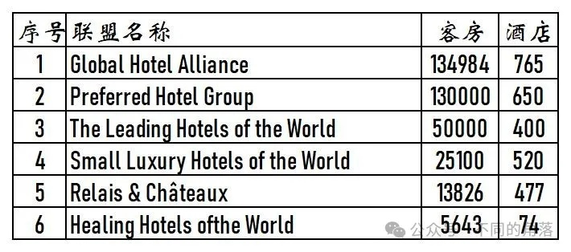
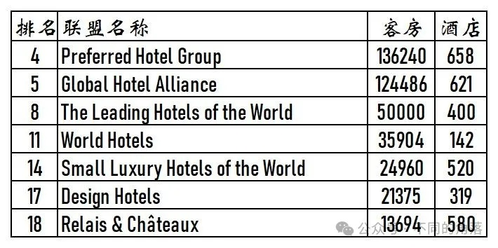
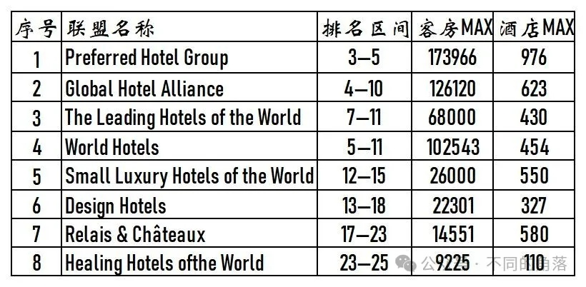

# 酒店常识之六酒店联盟介绍

> 本文转载自微信公众号 **不同的角落**，已获作者授权。  
> 原文发布于 2024年3月24日 23:57  
> 原文链接：[mp.weixin.qq.com](https://mp.weixin.qq.com/s?__biz=MzU4OTczMzkwNw==&mid=2247514721&idx=1&sn=c35e25082ba6b4a06de4e70424feb1fa&scene=21)

---

酒店联盟，通俗来说就是一个提供联盟内酒店预订的第三方组织，通过联盟这个平台，可以实现联盟内各酒店间资源共享，客源互通，一些酒店联盟也有类似酒店集团一样的会员忠诚计划。

联盟内成员酒店与联盟只是合作关系，联盟内成员酒店不受酒店联盟管理，酒店联盟对加入联盟的酒店也没什么约束力，有的酒店同时加入两家酒店联盟。

酒店联盟酒店的组成有单体酒店也有各品牌连锁酒店，有的酒店联盟由多家酒店集团组成，酒店联盟更像一个仅提供联盟内酒店预订的小型OTA平台。

目前各酒店联盟内成员酒店的订单主要还是来自于各大OTA网站，在联盟的预订平台上预订所占比例并不多。

酒店联盟成员的组成主要有如下几种：

1、全部由单体酒店组成。

2、主要由单体酒店组成，少部分成员为一些规模不大的连锁酒店集团部分品牌门店。

3、一些小型、中型连锁酒店集团联合组成。

4、一家大型连锁酒店集团为主，联合一些单体酒店或是小型连锁酒店集团，在大型连锁酒店集团预订平台上提供一些单体酒店和小型连锁酒店集团酒店预订。

之前美国《Hotels》杂志发布每年全球酒店集团排行榜单（以各酒店集团旗下已开业酒店客房总数量排名）时会同步发布年度全球酒店联盟25强榜单。

2021年越来越不靠谱的《Hotels》杂志将万豪、希尔顿、温德姆、精选国际旗下的软品牌系列酒店（各大酒店集团旗下软品牌系列酒店归属各大酒店集团管理，各大酒店集团对旗下软品牌酒店有约束力）纳入全球酒店联盟25强榜单统计。

2022年度《Hotels》直接将全球酒店200强榜单与全球酒店联盟25强榜单合并，将酒店联盟直接与酒店集团混和一起排列。自此全球酒店联盟25强榜单退出江湖。

历年来的全球酒店联盟25强榜单中，有8家酒店联盟已经进驻国内，目前有的国内已经没有酒店。

2022年底时其中6家酒店联盟旗下酒店与客房数量如下：

2021年度全球酒店联盟25强排名与客房、酒店数量如下：8家酒店联盟2012-2021年排名区间、客房与酒店最大值如下：

1、Preferred Hotels & Resorts（璞富腾酒店联盟），国内目前有7家酒店，分别是上海龙之梦酒店、沈阳龙之梦酒店、上海虹桥绿地铂瑞酒店（绿地旗下）、上海博雅酒店、上海前滩31雅辰酒店（雅辰旗下）、四川锦江宾馆（安逸旗下）、北京北辰五洲皇冠国际酒店。之前国内加入璞富腾的还有太谷居舍系列3家酒店（北京瑜舍、上海镛舍、成都博舍）、万达瑞华3家酒店（上海、武汉、成都）、富豪上海3家酒店、明宇成都2家酒店、北京万达文华（万达旗下）、北京京伦（首旅旗下四星级酒店）、上海东方商旅（现华住旗下上海东方美仑美奂）、苏州音昱水中天等酒店，后都已退出。

2、Global Hotel Alliance（GHA全球酒店联盟），凯宾斯基酒店集团（目前76家凯宾斯基）联合其它中小规模酒店集团创建的酒店联盟，包括凯宾斯基、美诺（包括美诺收购的诺瀚、盛橡、缇沃丽）、泛太平洋、九龙仓、嘉佩乐、素凯泰等酒店集团。在美诺陆续收购盛橡、缇沃丽、诺瀚后，美诺旗下酒店在GHA酒店联盟已占近70%比例，其中诺瀚系列（诺瀚+诺瀚精选+诺皓）323家、盛橡61家、安纳塔拉54家、安凡尼42家、缇沃丽17家、Elewana15家。联盟内各酒店共用常旅客会员计划GHA Discovery，联盟内已进驻国内的酒店集团有凯宾斯基、美诺、泛太平洋、九龙仓、嘉佩乐、素凯泰等；国内目前有46家酒店，其中凯宾斯基旗下21家凯宾斯基、首旅与凯宾斯基合资公司凯燕旗下的2家诺金（第三家诺金北京环球诺金未加入GHA）、九龙仓旗下4家尼依格罗+4家马哥孛罗+1家玛珂、泛太平洋旗下6家泛太平洋（宁波酒店与公寓在一起）、美诺旗下贵阳安纳塔拉+西双版纳安纳塔拉+成都缇沃丽+成都盛橡+郑州诺瀚（沈阳诺瀚未加入GHA）、嘉佩乐旗下上海嘉佩乐+海南嘉佩乐、上海素凯泰。

3、The Leading Hotels of the World（LHW，立鼎世酒店联盟），国内目前有7家酒店，分别是J酒店上海中心（锦江旗下）、上海阿纳迪（远洲旗下）、上海嘉佩乐（嘉佩乐旗下）、丽江物与岚、上海璞丽（URC旗下）、北京璞瑄（URC旗下）、厦门七尚（原URC旗下厦门璞尚），之前国内加入立鼎世的还有南京金陵饭店（金陵旗下）、上海朱家角安麓（首旅旗下）、上海苏宁宝丽嘉（钓鱼台美高梅旗下），后来都已退出。

4、World Hotels（世尊酒店联盟），2017年Associated Luxury Hotels（ALHI，2016年全球酒店联盟排名第三）收购世尊（2016年排名全球酒店联盟排名第六），2019年时ALHI将世尊出售给最佳西方酒店集团。世尊酒店联盟旗下有同名的世尊酒店集团，旗下有世尊品牌酒店。目前世尊酒店联盟属于最佳西方酒店集团旗下。国内目前有15家酒店，分别是北京亮马河大厦（首旅旗下）、北京昆仑饭店（锦江旗下）、北京天伦王朝酒店（天伦旗下）、上海大酒店（中维旗下）、上海王宝和大酒店（中维旗下）、上海静安昆仑大酒店（锦江旗下）、上海虹桥锦江大酒店（锦江旗下）、广州中国大酒店（岭南旗下）、广州南沙花园酒店（岭南旗下）、广州花园酒店（岭南旗下）、昆明中维翠湖宾馆（中维旗下）、长沙佳兴世尊、苏州独墅湖世尊、无锡君来世尊、南京玄武饭店。之前还有北京建国饭店（首旅旗下）、广州白天鹅酒店（白天鹅旗下）、佛山德徕等酒店加入，后都已退出。

5、Small Luxury Hotel(SLH，全球奢华精品酒店联盟），2018年与凯悦合作，SLH旗下酒店上线凯悦官方预订平台，可以享受凯悦会员权益，与凯悦合作到2024年5月15日结束；目前SLH与希尔顿已签订合作计划，后续SLH旗下酒店将上线希尔顿官方预订平台，可享受希尔顿会员待遇。国内目前有18家酒店，分别是北京怡亨酒店、北京雁柏山庄、上海素凯泰酒店、南京新晶丽酒店、杭州秋水山庄、杭州木守西溪酒店、杭州玫瑰园（Vallie）度假酒店、绍兴璞祺艺境酒店、泉州七栩礁石酒店、泉州七栩钟楼、安溪悦泉行馆、广州岭南五号酒店（岭南旗下）、阳朔玖壤酒店、成都尧棠公馆、昆明玉龙湾湖景酒店、大理巍山·耘熹进士第、大理海纳尔·云墅度假酒店、敦煌碧玥酒店。之前还有北京古城·老院、江油花厢欧洲院子、苏州震泽水岸寒舍精品酒店（寒舍旗下）、鄢陵建业花满地、徐州回悦精品酒店等酒店加入SLH，后都已退出。

6、Design Hotels（设计酒店联盟），2011年时被喜达屋收购，2015年设立酒店联盟加入SPG俱乐部上线SPG官方预订平台，喜达屋被万豪收购后，只有少数酒店选择与万豪合作上线万豪官方预订平台，可以享受万豪会员权益。国内之前上海有3家酒店加入，上海璞丽、上海水舍、上海斯沃琪和平饭店艺术中心，2015年设计酒店联盟加入SPG俱乐部后，上海璞丽与上海斯沃琪和平饭店艺术中心退出，只有上海水舍选择与SPG合作，万豪收购喜达屋后，上海水舍与万豪合作上线万豪官方预订平台可以享受万豪会员权益，直至上海水舍2020年停业。2017年起陆续又有北京后海VUE酒店（现北京后海花间堂）、厦门乐雅无垠酒店（签订合同未加入）、厦门青普文化行馆扬州瘦西湖店、青普文化行馆南靖土楼、既下山·梅里加入设计酒店联盟，都未与万豪合作未上线万豪官方预订平台，后来都已退出。

7、Relais & Chateaux（罗莱夏朵酒店联盟），国内目前有6家酒店，分别是北京悉昊酒店、南京颐和公馆、杭州湖边邨、杭州紫萱度假村、珠海静云山庄、成都青城山宿仙谷6家。之前柏联旗下云南3家柏联（昆明柏联、景迈柏联、和顺柏联）、北京健一公馆等酒店也曾加入罗莱夏朵，后都已退出。

8、Healing Hotels of the World（HHOW，世界养生酒店联盟），原定开业就加入成为HHOW国内首家酒店成员的上海阿纳迪酒店未等开业就已退出改为加盟立鼎世，目前国内仅有北京海湾半山温泉酒店一家酒店加入。

国内之前如家、华住、铂涛、格林都与一些中小酒店集团搞过联盟，在如家、华住、铂涛、格林官方平台可以预订联盟酒店，不过后来都没能继续下去。

开元之前与城市名人结盟会员互通；2015年开元、城市名人、华天、纽宾凯、曙光、粤海在北京发起成立酒店联盟，结果最后不了了之，6家酒店集团里只有开元发展不错成长起来。

目前国内酒店联盟做的不错的是同程旗下的艺龙酒店科技，平台除了艺龙旗下多家酒管公司管理的艺龙系列品牌外，还收购、入股多家中等规模酒店集团，并与多家中小规模酒店集团合作。

目前艺龙酒店科技平台入驻的酒店集团已近20家，上线已开业酒店超1500家，已覆盖国内31个省/直辖市/自治区的200多个地市州及部分省直辖县市，包括美豪、珀林、爱电竞、青藤、逸米、云之尚、吉楚等酒店集团旗下品牌酒店及艺龙系列品牌酒店，其中半数以上为中档酒店。共用艺龙会会员计划，银卡会员起就有免费早餐（限有早餐门店），最高等级白金会员保级也只要15个间夜。目前艺龙会酒店数量和覆盖城市均已超过亚朵，位居锦江、华住、首旅、格林、东呈、尚美国内6大酒店集团之后。

国内其余2家成规模的酒店联盟都是打着酒店集团旗号，实际本质就是酒店联盟。

轻住，旗下已上线开业酒店超1600家，但可以预订的只有600多家，基本都是经济酒店，轻住会员最高等级钻石卡也没有免费早餐权益（大多数酒店都没有早餐）。加入轻住的有锦江、首旅、东呈、尚美、住友、逸柏、青藤、温德姆旗下速8中国旗下的品牌门店，甚至有锦江和东呈旗下的中档品牌门店加入。

丽呈，携程旗下中档酒店联盟，与国内20多家中小规模酒店集团合作，目前已上线开业酒店超500家，不过退出的也差不多已有150家，另外合作的中等规模酒店集团大都是只有少数酒店上线丽呈官方预订平台，共用丽呈会会员计划的同时，各酒店集团原有的会员计划仍继续使用。丽呈酒店集团对旗下酒店并没有什么约束力，很多酒店都拒不提供丽呈会会员权益，丽呈会最高等级钻卡保级需要40房晚。

更多的酒店常识、酒店行业资讯、酒店集团、航空常识、铁路常识、沈阳旅游、沙发客、打油诗等相关内容可以到我的微信公众号里查看。

也欢迎大家关注我的微信公众号：**sfk024**

公众号名称：**不同的角落**

在微信公众号搜索sfk024或是不同的角落都可以搜索到，也可以直接扫码或长按识别下方二维码关注。

