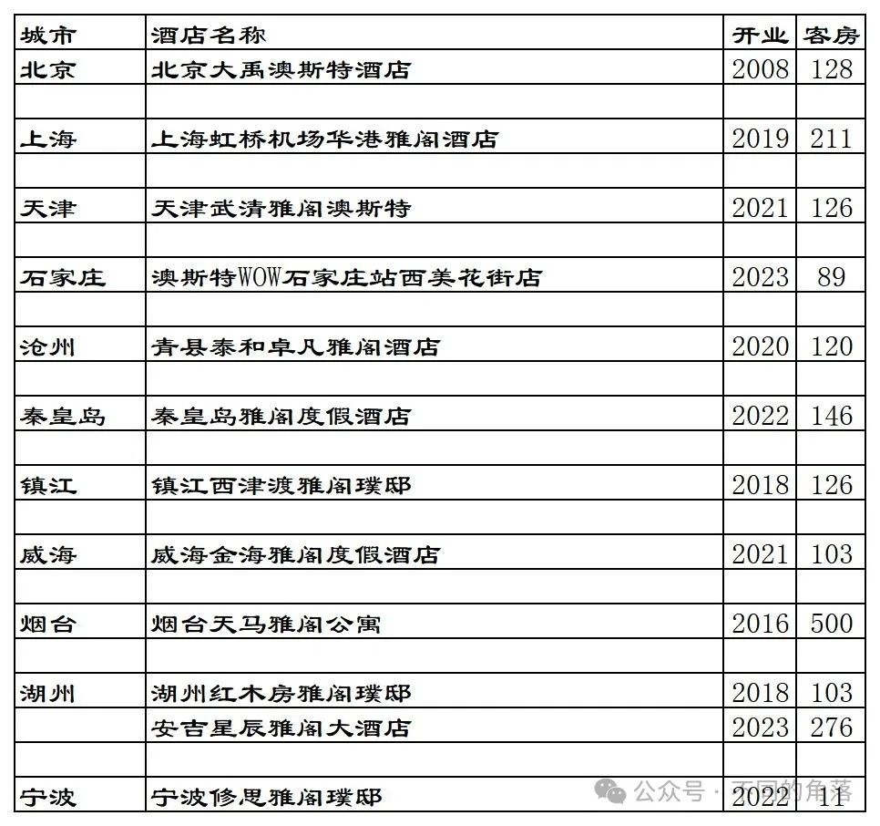
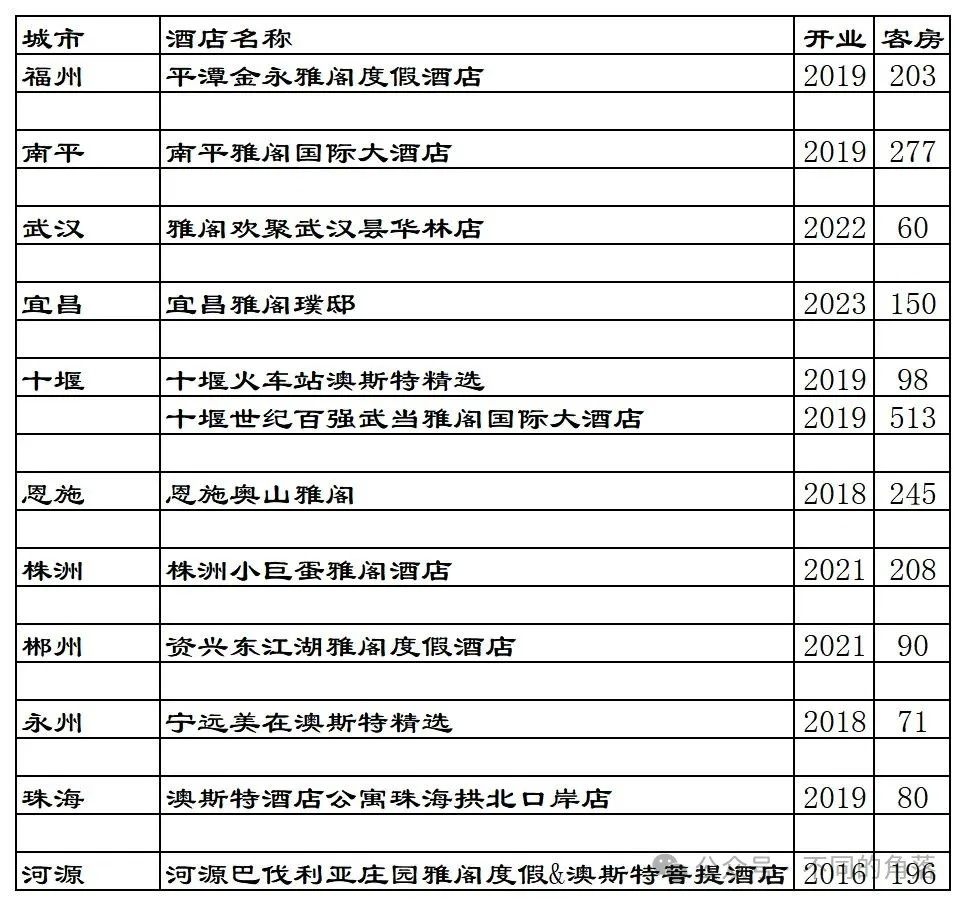
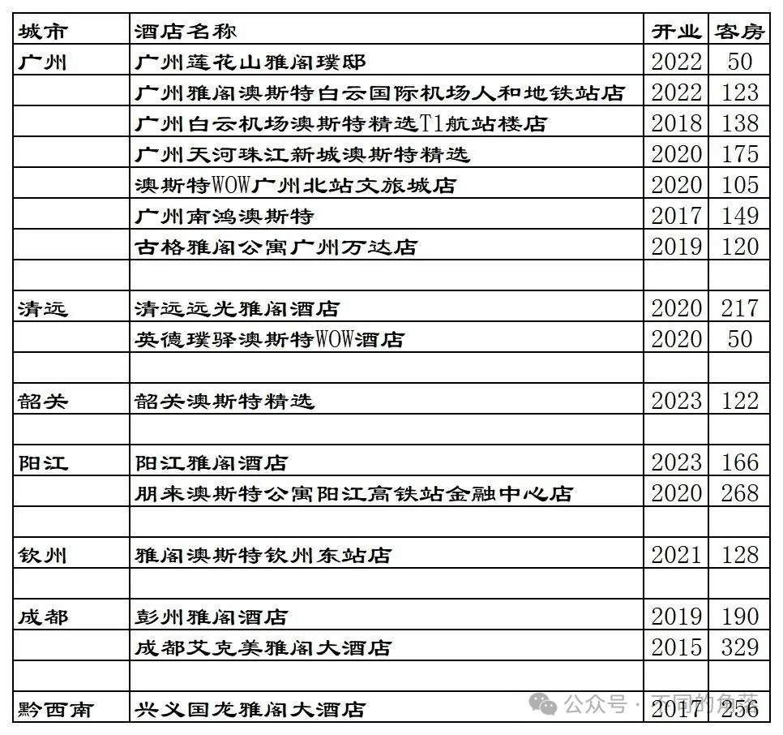
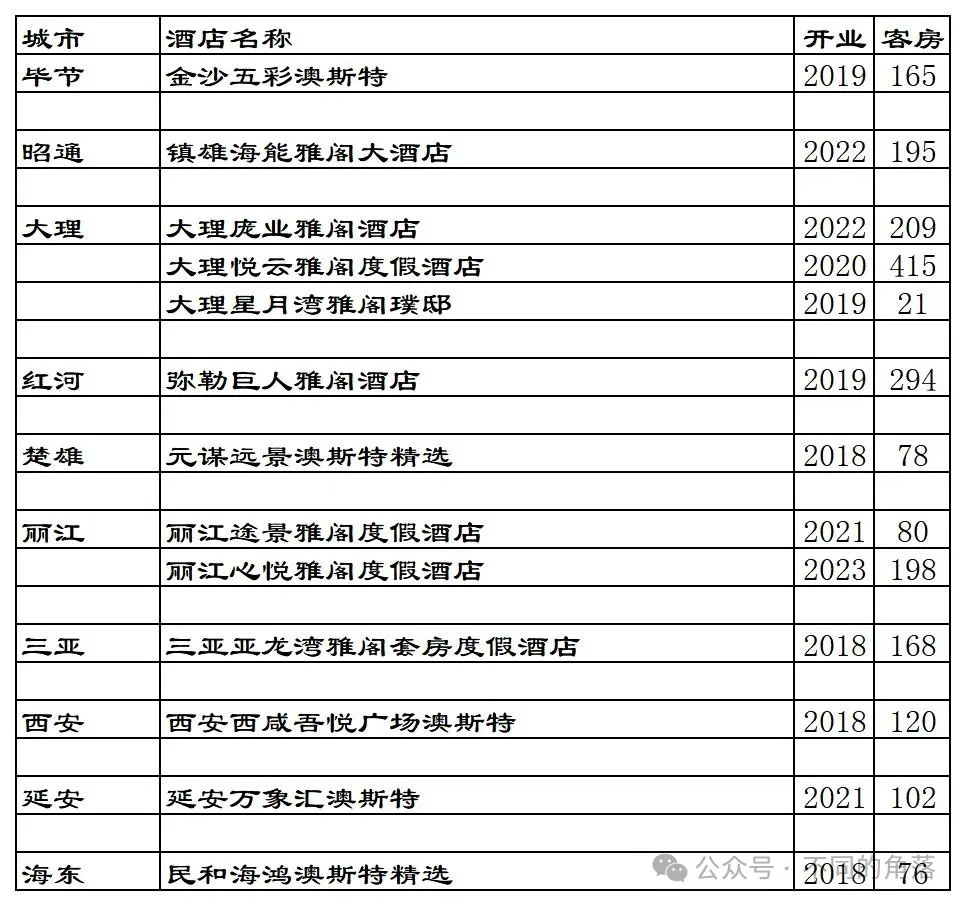

# 雅阁国内开业酒店统计2023版

> **作者**：不同的角落  
> **发布时间**：2024年3月25日 22:56  
> **原文链接**：[雅阁国内开业酒店统计2023版](http://mp.weixin.qq.com/s?__biz=MzU4OTczMzkwNw==&mid=2247514736&idx=1&sn=ec5f9817d92ce5490c8b0a73a9ec15d2&chksm=fdcbf30ccabc7a1ab55fecd861369dcab4d8525cd43d56a5277125690b8da324af10731bd93c)

---

雅阁旗下国内已开业酒店统计，统计截至2023年12月31日。

客房数据主要来自于雅阁官方平台与OTA，部分酒店客房数量打过酒店电话核实，记录的是酒店员工告知的客房数量。

个人精力有限，部分酒店开业/退出/下线时间以及客房数量难免有错误，欢迎各位告知指正，谢谢！

截至2023年12月31日雅阁官方平台可以查询到的国内已开业酒店共计70家，其中29家酒店可以预订，其余41家酒店所有日期都无法预订。

70家酒店中，有10家公寓是广州维福顿旗下公寓，与雅阁合作上线雅阁官方预订平台，但其中自有3家可以预订。去除这10家维福顿公寓后，雅阁官方平台雅阁旗下品牌国内酒店60家。

雅阁官方平台可以查询到的国内60家酒店中，西安2家澳斯特（1家可以预订）实际上是一家酒店，另外还有6家不能预订的酒店早已退出翻牌为其它酒店。在OTA平台还可以查询到1家雅阁品牌其它酒店，不过酒店已经不与雅阁合作，后续也会翻牌为其它品牌。

雅阁国内目前一共53家酒店8837间客房，其中26家酒店可以在雅阁官方平台预订。

雅阁官方平台预订价格基本都比OTA价格贵，有的贵了近20%。

格林酒店官方平台上目前还有10多家雅阁酒店，都不能预订。自格林2019年入股雅阁以来，仅有大约一年多时间可以在格林官方平台预订雅阁旗下20多家酒店。

目前雅阁在北京、上海、天津、河北、江苏、山东、浙江、福建、湖北、湖南、广东、广西、江西、四川、贵州、云南、海南、陕西、青海有酒店。

开业：新酒店开业或是其它酒店翻牌开业时间；客房：客房数量。

更多的国内酒店统计、年度酒店排行、酒店常识、酒店行业资讯、酒店集团、航空常识、沈阳旅游等相关内容可以到我的微信公众号里查看。

也欢迎大家关注我的微信公众号：**sfk024**

公众号名称：**不同的角落**

在微信公众号搜索sfk024或是不同的角落都可以搜索到，也可以直接扫码或长按识别下方二维码关注。

