# 2003-2012全球酒店集团325强

> **作者**：不同的角落  
> **发布时间**：2024年3月27日 22:31  
> **原文链接**：[2003-2012全球酒店集团325强](https://mp.weixin.qq.com/s?__biz=MzU4OTczMzkwNw==&mid=2247514985&idx=1&sn=89156e4fa6f318c27c0d93b28a4e88cb&scene=21)

---

全球酒店行业媒体美国《HOTELS》杂志自1971年开始，每年夏季发布上一年度全球酒店集团排名。

《HOTELS》是国际酒店与餐厅协会会刊，至今已连续50多年在全球170多个国家发行，是全球酒店业最关注的杂志之一。

 

至2000年时《HOTELS》杂志的“**全球酒店集团325强**”年度全球酒店集团排名，已经成为全球酒店业内最知名的酒店集团排名体系。

2020年起更改为全球酒店集团225强排名。

2022年起更改为全球酒店集团200强排名。

年度全球酒店集团325强数据统计，**截至当年12月31日各酒店集团已签订正式合同并已开业**（指委托管理、特许经营、投资兼管理、租赁兼管理等方式的管理合同）或自由产权并已开业的酒店，不含顾问式管理及咨询管理的酒店，不含**持有饭店产权（全部或部分）**但**委托其他企业管理**或**使用其他企业旗下酒店品牌**的酒店。

 

数据由各酒店集团在线上自行申报，由国际酒店与餐厅协会对申报数据通过公开资料进行核实，通过委托第三方独立机构进行调查得出。

数据从酒店数量、客房数对酒店集团进行排名。

年度**全球酒店集团325强**包括如下排名：

**全球酒店集团300强**（全球300家酒店集团客房总数排名，2020年时更改为全球200家酒店集团客房总数排名，2022年起将酒店联盟与酒店集团合并排名）。

**全球酒店品牌50强**（单一品牌酒店客房总数排名）

**全球酒店数量50强**（各酒店集团酒店总数排名）

**全球酒店管理10强**（各酒店集团委托管理酒店总数排名）

**全球酒店特许经营10强**（各酒店集团特许经营酒店总数排名）

**全球酒店联盟25强**（各酒店联盟旗下酒店总数排名，2022年起取消，将酒店联盟与酒店集团合并排名）。

《HOTELS》325强排名只是统计各酒店集团的客房总数，与酒店的建筑设备、酒店规模、服务质量、管理水平统统无关，所以**这个排名只能做参考**，并不能真实反映各家酒店集团实力和管理水平。

由于是**各酒店集团自行申报门店数量和客房数量**（国内**开元、金陵、君澜、明宇等酒店集团每年都翻倍虚报**），国际酒店与餐厅协会委托进行核实的第三方机构也是**质不优**但**价格廉**的机构，造成每年的325强排名一些酒店集团开业酒店数量和客房数量都会有很大的水分。

另外由于连锁酒店大多数都是委托管理模式和特许经营模式，很多酒店都被两家酒店集团同时申报重复统计。

委托管理模式的酒店，按规则该酒店只应算在酒店品牌管理方酒店集团旗下，实际上酒店业主方也有自己的酒店管理公司拥有自己的连锁酒店品牌情况下通常也会对该酒店进行申报。

特许经营模式的酒店，酒店品牌方所属酒店集团和特许经营品牌被授权方酒店集团也都会同时对酒店进行申报。

比如国内的希尔顿欢朋品牌酒店，品牌所属方希尔顿会将国内的希尔顿欢朋酒店纳入希尔顿旗下进行申报；希尔顿欢朋品牌国内的特许经营方锦江（之前是铂涛，后铂涛被锦江收购）也会将国内的希尔顿欢朋酒店纳入自家旗下进行申报。

国内的美爵、诺富特、美居、宜必思尚品、宜必思这五个品牌酒店，品牌所属方雅高会将国内的这五个品牌酒店纳入雅高旗下进行申报；这五个品牌国内的特许经营方华住也会将国内的这五个品牌酒店纳入自家旗下进行申报。

**2003年至2012年全球酒店集团300强排名前10强名单如下****：**

**2003年度全球酒店集团前20强排名：**

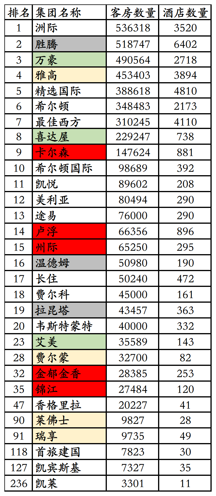

1、2003年六洲酒店集团更名为洲际酒店集团。

2、希尔顿国际总部位于英国，1949年希尔顿将酒店业务拓展至美国以外，希尔顿国际成立，当时为希尔顿集团子公司。1964年希尔顿国际成为单独公司，拥有全球除北美洲外其它地区希尔顿酒店品牌使用权。

3、2003年度凯悦排名第11位，旗下89602间客房208家酒店。

**2004年度全球酒店集团前20强****排名：**

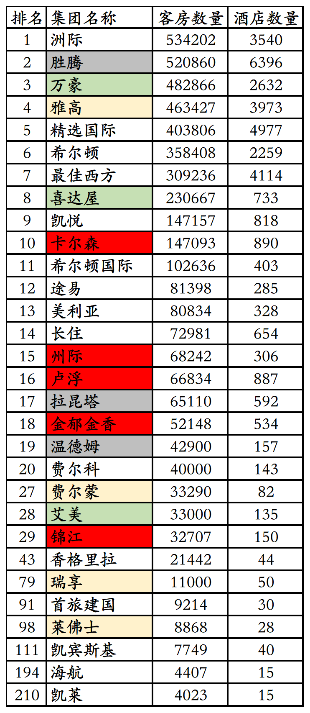

1、2004年胜腾从万豪收购华美达酒店全球（美国和加拿大外）特许经营业务，之前胜腾已经收购华美达在美国和加拿大的特许经营业务，至此华美达成为胜腾旗下品牌。

2、2004年凯悦从黑石集团处收购经济连锁酒店Ameri Suites，后来将Ameri Suites品牌更名为Hyatt Place（凯悦嘉轩）。

3、2004年度希尔顿国际排名第11位，旗下102636间客房403家酒店。

**2005年度全球酒店集团前10强排名：**

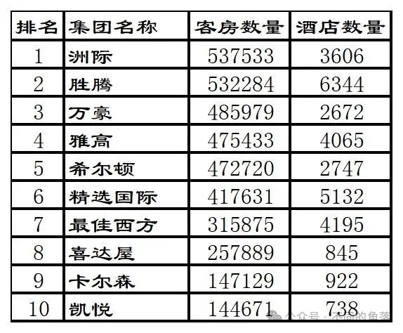

1、2005年胜腾收购温德姆酒店品牌及其特许经营系统。

2、2005年希尔顿收购希尔顿国际，并购后希尔顿品牌成为一个统一的实体，客房规模超过精选国际升至第5位。

3、2005年喜达屋资本集团旗下的喜达屋酒店集团收购艾美酒店品牌及其管理业务。

4、2005年卡尔森酒店集团（Carlson Hotel Group）收购北欧航空旗下瑞德酒店集团（Rezidor Hotel Group）25%股份。

5、2005年喜达屋资本集团收购泰亭（Taittinger）集团旗下酒店和香槟酒业务，酒店业务包括14家豪华酒店和旗下有800家经济酒店的卢浮酒店集团（Louvre Hotel Group）。

**2006年度全球酒店集团前10强排名：**

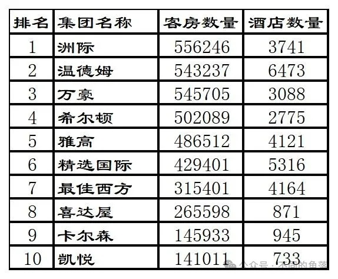

1、2006年胜腾集团更名为温德姆集团。

2、2006年希尔顿超过雅高升至第四位。

3、2006年凯悦收购Summerfield Suites。

**2007年度全球酒店集团前10强排名：**

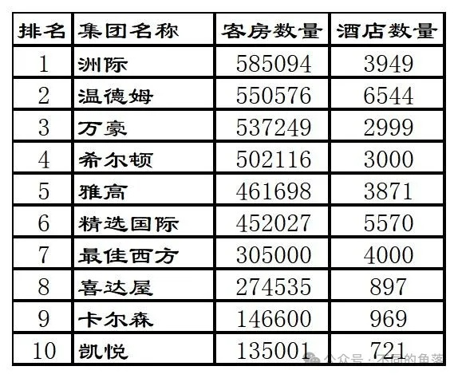

1、2007年黑石集团收购希尔顿酒店集团并将其私有化。

2、2007年卡尔森酒店集团增持瑞德酒店集团股份至35%。

**2008年度全球酒店集团前10强排名：**

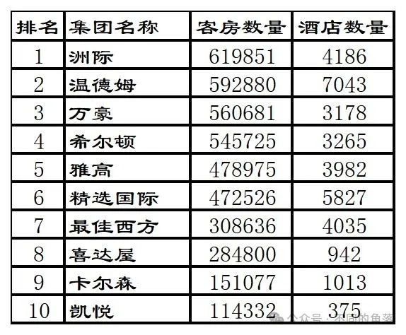

**2009年度全球酒店集团前10强排名：**

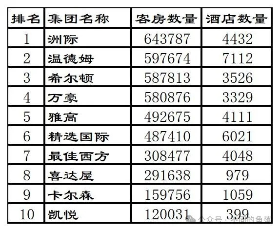

1、2009年希尔顿超过万豪升至第三位。

**2010年度全球酒店集团前10强排名：**

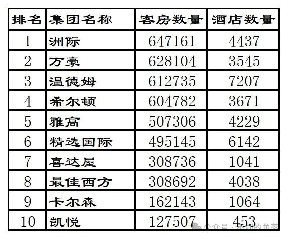

1、2010年万豪超过希尔顿和温德姆升至第二位。

2、2010年卡尔森将丽晶酒店品牌出售给台湾晶华酒店集团。

3、2010年锦江与美国德尔联合收购第三方酒店管理公司美国州际（非洲际）酒店集团，州际旗下管理经营228家万豪、希尔顿、喜达屋等酒店集团旗下多个品牌酒店，共约46000间客房。

4、2010年锦江收购经济连锁金广快捷70%股权，金广快捷在太原有11家直营酒店。

**2011年度全球酒店集团前20强排名:**

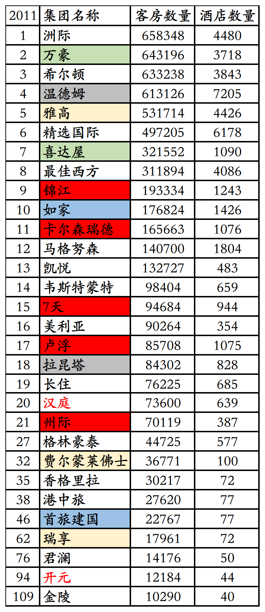

1、2011年万豪收购西班牙连锁酒店AC Hotel。

2、2011年喜达屋酒店集团收购Design Hotels（设计酒店联盟）49.8%股份，但并未将其接入SPG俱乐部。

3、2011年如家收购莫泰168酒店，莫泰旗下已开业酒店281家共45669间客房。

4、2011年度卡尔森以165663间客房1076家酒店排名第11位。

5、2011年度凯悦以132727间客房483家酒店排名第13位。

 

**2012年度全球酒店集团前20强排名：**

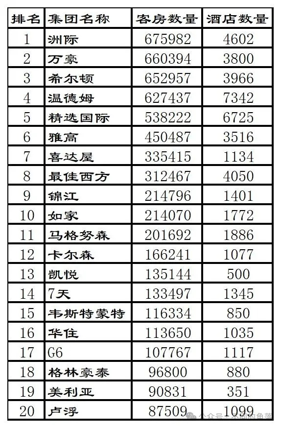

1、2012年万豪收购美国本土的盖洛德酒店（Gaylord Hotels）。

2、2012年雅高出售旗下有800多家汽车旅馆的美国经济型酒店品牌Motel 6（雅高1990年收购）给黑石集团。

3、2012年锦江完成对金广快捷剩余30%股权收购。

4、2012年如家收购安徽优乐时尚酒店管理有限公司和安徽美邦酒店管理有限公司，e家快捷连锁13家直营店翻牌为如家。

5、2012年卡尔森增持瑞德酒店集团股份至51%，卡尔森瑞德酒店集团成立。

6、2012年汉庭从携程收购中档酒店联盟星程酒店；同年汉庭酒店集团更名为华住酒店集团。

 

**2012年度全球酒店联盟25强榜单如下：**

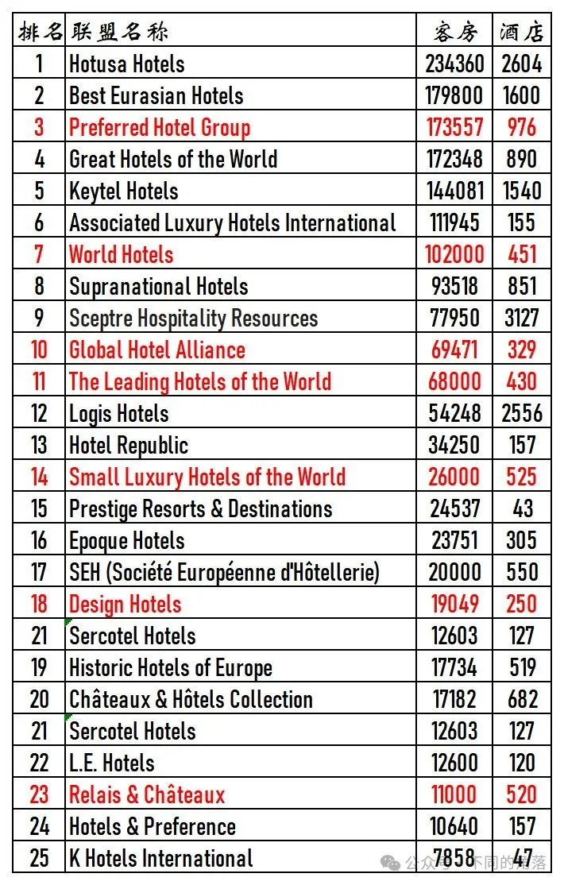

更多的年度酒店排行、国内酒店统计、酒店常识、酒店行业资讯、酒店集团、航空常识、沈阳旅游、沙发客、打油诗等相关内容可以到我的微信公众号里查看。

也欢迎大家关注我的微信公众号：**sfk024**

公众号名称：**不同的角落**

在微信公众号搜索sfk024或是不同的角落都可以搜索到，也可以直接扫码或长按识别下方二维码关注。

