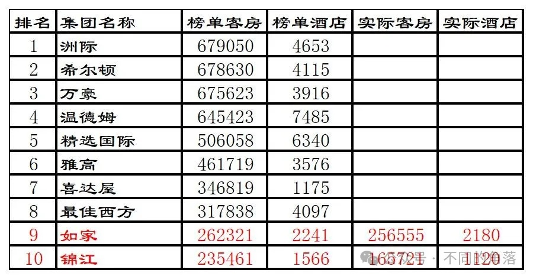
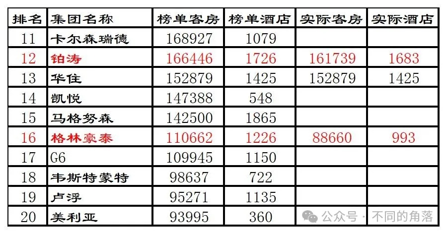
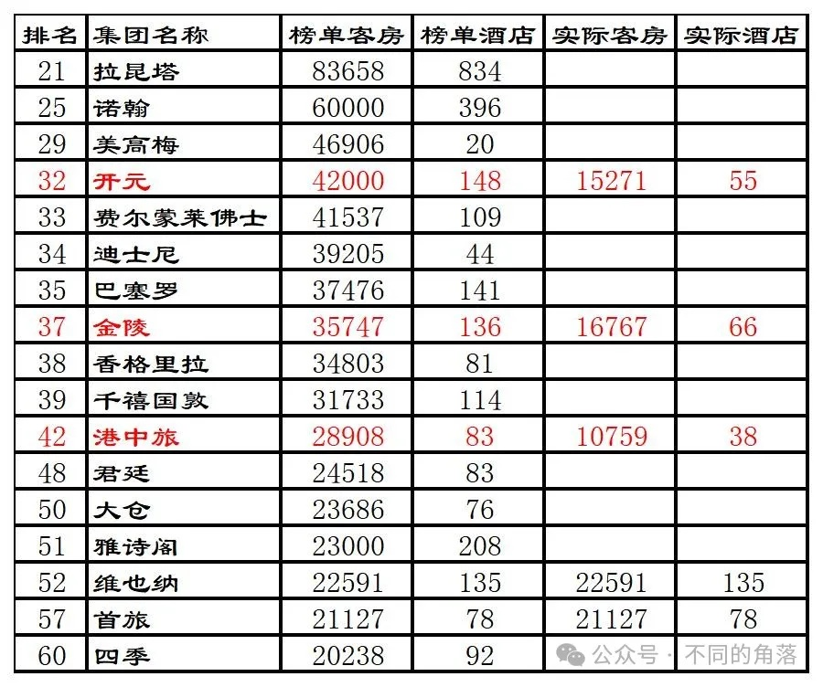
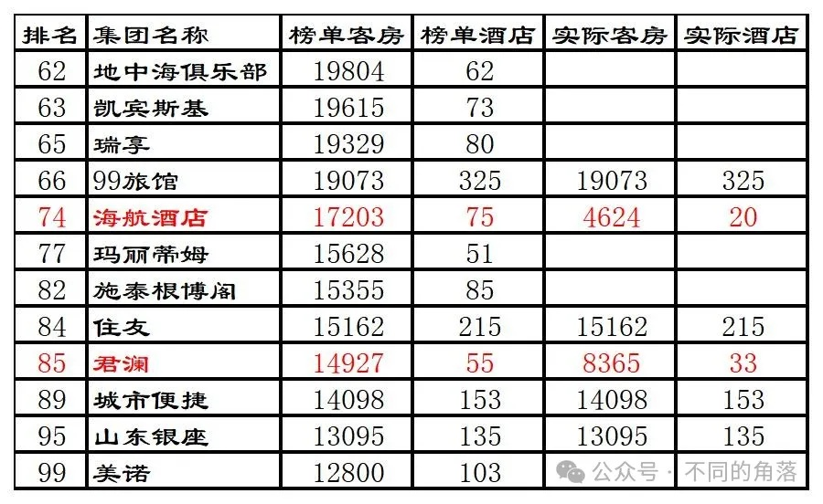
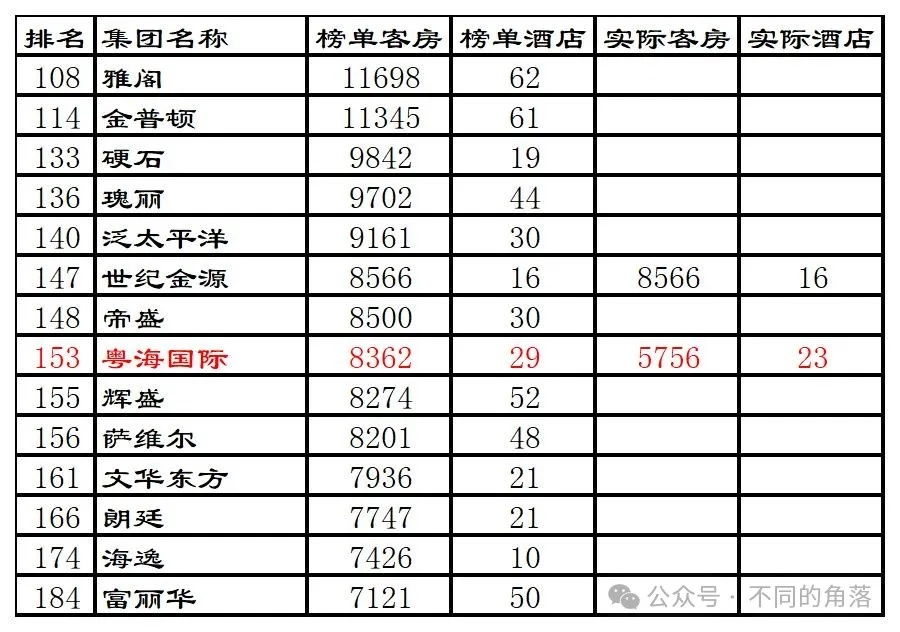
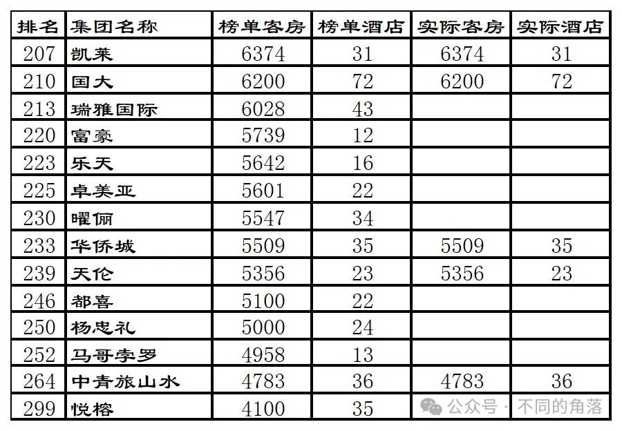
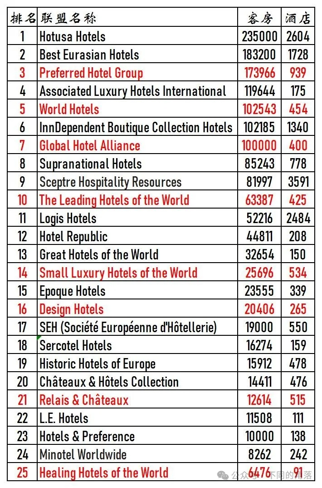

# 2013年度全球酒店集团325强

> 本文转载自微信公众号 **不同的角落**，已获作者授权。  
> 原文发布于 2024年4月1日 21:52  
> 原文链接：[mp.weixin.qq.com](https://mp.weixin.qq.com/s?__biz=MzU4OTczMzkwNw==&mid=2247515113&idx=1&sn=50aadb619d605d16fe29a4b47042f162)

---

全球酒店行业媒体美国《HOTELS》杂志自1971年开始，每年夏季发布上一年度全球酒店集团排名。

《HOTELS》是国际酒店与餐厅协会会刊，至今已连续50多年在全球170多个国家发行，是全球酒店业最关注的杂志之一。

 

至2000年时《HOTELS》杂志的“**全球酒店集团325强**”年度全球酒店集团排名，已经成为全球酒店业内最知名的酒店集团排名体系。

2020年起更改为全球酒店集团225强排名。

2022年起更改为全球酒店集团200强排名。

年度全球酒店集团325强数据统计，**截至当年12月31日各酒店集团已签订正式合同并已开业**（指委托管理、特许经营、投资兼管理、租赁兼管理等方式的管理合同）或自由产权并已开业的酒店，不含顾问式管理及咨询管理的酒店，不含**持有饭店产权（全部或部分）**但**委托其他企业管理**或**使用其他企业旗下酒店品牌**的酒店。

数据由各酒店集团在线上自行申报，由国际酒店与餐厅协会对申报数据通过公开资料进行核实，通过委托第三方独立机构进行调查得出。

数据从酒店数量、客房数对酒店集团进行排名。

年度**全球酒店集团325强**包括如下排名：

**全球酒店集团300强**（全球300家酒店集团客房总数排名，2020年时更改为全球200家酒店集团客房总数排名，2022年起将酒店联盟与酒店集团合并排名）。

**全球酒店品牌50强**（单一品牌酒店客房总数排名）

**全球酒店数量50强**（各酒店集团酒店总数排名）

**全球酒店管理10强**（各酒店集团委托管理酒店总数排名）

**全球酒店特许经营10强**（各酒店集团特许经营酒店总数排名）

**全球酒店联盟25强**（各酒店联盟旗下酒店总数排名，2022年起取消，将酒店联盟与酒店集团合并排名）。

《HOTELS》325强排名只是统计各酒店集团的客房总数，与酒店的建筑设备、酒店规模、服务质量、管理水平统统无关，所以**这个排名只能做参考**，并不能真实反映各家酒店集团实力和管理水平。

由于是**各酒店集团自行申报门店数量和客房数量**（国内**开元、金陵、君澜、明宇等酒店集团每年都翻倍虚报**），国际酒店与餐厅协会委托进行核实的第三方机构也是**质不优**但**价格廉**的机构，造成每年的325强排名一些酒店集团开业酒店数量和客房数量都会有很大的水分。

另外由于连锁酒店大多数都是委托管理模式和特许经营模式，很多酒店都被两家酒店集团同时申报重复统计。

委托管理模式的酒店，按规则该酒店只应算在酒店品牌管理方酒店集团旗下，实际上酒店业主方也有自己的酒店管理公司拥有自己的连锁酒店品牌情况下通常也会对该酒店进行申报。

特许经营模式的酒店，酒店品牌方所属酒店集团和特许经营品牌被授权方酒店集团也都会同时对酒店进行申报。

比如国内的希尔顿欢朋品牌酒店，品牌所属方希尔顿会将国内的希尔顿欢朋酒店纳入希尔顿旗下进行申报；希尔顿欢朋品牌国内的特许经营方锦江（之前是铂涛，后铂涛被锦江收购）也会将国内的希尔顿欢朋酒店纳入自家旗下进行申报。

国内的美爵、诺富特、美居、宜必思尚品、宜必思这五个品牌酒店，品牌所属方雅高会将国内的这五个品牌酒店纳入雅高旗下进行申报；这五个品牌国内的特许经营方华住也会将国内的这五个品牌酒店纳入自家旗下进行申报。

2013年全球酒店集团325强部分榜单如下，全球酒店300强榜单20名后只列出**国内酒店集团**、**港澳台酒店集团**以及**已进驻中国内地的国际酒店集团**。

榜单上国际酒店集团全球数量没那个能力去统计，只对榜单上部分国内酒店集团截至2013年底已开业酒店数量进行了统计。

个人精力有限，如有差错纰漏烦请各位指正！！！

**2013年全球酒店集团300强排名前10强名单如下****：**

**2013年度全球酒店集团前10强排名：**

1、洲际继续排名第一，这也是洲际最后一年当老大。

2、希尔顿超过万豪，当上老二，与老大洲际只相差400多间客房。

3、万豪退居第三，与老大洲际相差3000多间客房。

4、温德姆继续当老四，同时也是当年开业酒店数量最多的酒店集团。

5、精选国际、雅高、喜达屋、最佳西方排名不变。

6、如家开业酒店数量2180家，其中872家直营酒店。18家和颐、1784家如家、378家莫泰。

7、2013年锦江收购时尚之旅酒店共计21家酒店（已开业19家），国内有限服务酒店828家100566间客房，全服务酒店64家19155间客房（不包含锦江为业主委托给其它酒店集团管理的上海和平饭店、上海华尔道夫、上海锦江汤臣洲际、上海花园饭店、上海扬子江万丽等酒店）；国外有228家酒店约46000间客房，是锦江收购的第三方酒店管理公司州际酒店管理集团特许经营的其它酒店集团旗下品牌（包括希尔顿、威斯汀、喜来登、万豪等33个品牌）。锦江国内828家有限服务酒店，其中直营店239家。锦江都城1家、锦江之星700家、百时快捷66家、金广快捷29家、白玉兰9家，整合中即将翻牌酒店23家（19家时尚之旅+新亚饭店、新城饭店、青年会、白玉兰4家拟翻牌为锦江都城酒店）。

**2013年度全球酒店集团11-20强****排名：**

1、2013年7天连锁酒店退市，铂涛酒店集团成立并完成对7天连锁酒店的私有化收购，推出铂涛菲诺、丽枫、喆啡、ZMAX潮漫四个中高端品牌。2013年11月，广州丽柏·铂涛菲诺酒店开业（原丽柏酒店加盟挂牌）。铂涛开业酒店1683家，1682家7天、1家铂涛菲诺。

2、2013年华住从雷迪森收购经济连锁酒店怡莱，当时怡莱有10多家酒店，但2013年华住并未将怡莱纳入华住酒店体系。华住开业酒店1425家，其中565家直营店。1226家汉庭、68家全季、83家海友、48家星程。

3、格林豪泰开业酒店993家，906家格林豪泰、81家格林联盟、3家格林东方、3家格林贝壳。

**2013年度全球酒店集团21-60强排名：**

1、2013年开元收购德国法兰克福金郁金香酒店，关店升级改造。国内开业酒店55家15271间客房。开元名都18家、开元大酒店25家、开元度假村5家、开元文化主题酒店（开元观堂品牌前身，2017年改为开元观堂品牌，绍兴大禹2011年刚开业时是开元度假村品牌，后来改为开元文化主题酒店）1家、开元曼居6家。

2、金陵开业酒店66家，包括8家自营的金一村经济酒店。

3、港中旅开业酒店38家。

4、维也纳10年前只有100多家开业酒店。

5、2013年首旅集团旗下北京首都旅游股份有限公司更名为北京首旅酒店（集团）股份有限公司。旗下有首旅建国（四星级到五星级档次）、首旅酒店（现首旅京伦，三星级到四星级档次）、欣燕都（经济型酒店）品牌。

**2013年度全球酒店集团61-100强排名：**

1、海航开业酒店20家。

2、君澜国外1家澳大利亚珀斯君亭101间客房，国内32家。

3、城市便捷（现东呈）10年前只有100多家酒店，都是经济酒店城市便捷品牌。

**2013年度全球酒店集团101-200强排名：**

1、世纪金源开业酒店16家。

2、粤海国际开业酒店23家。

**2013年度全球酒店集团201-300强排名：**

1、凯莱开业酒店31家。

2、华侨城开业酒店35家，包括10家有限服务酒店城市客栈。

 

**2013全球酒店联盟25强榜单如下：**

更多的年度酒店排行、国内酒店统计、酒店常识、酒店行业资讯、酒店集团、航空常识、沈阳旅游、沙发客、打油诗等相关内容可以到我的微信公众号里查看。

也欢迎大家关注我的微信公众号：**sfk024**

公众号名称：**不同的角落**

在微信公众号搜索sfk024或是不同的角落都可以搜索到，也可以直接扫码或长按识别下方二维码关注。

