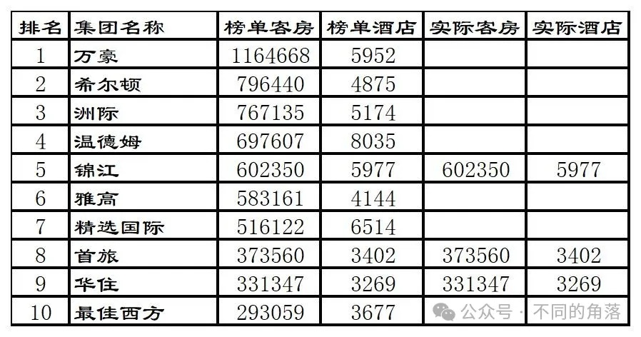
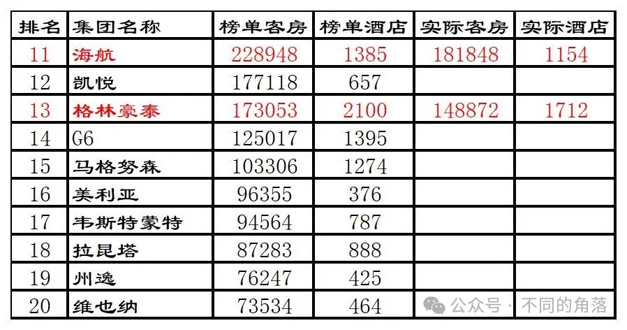
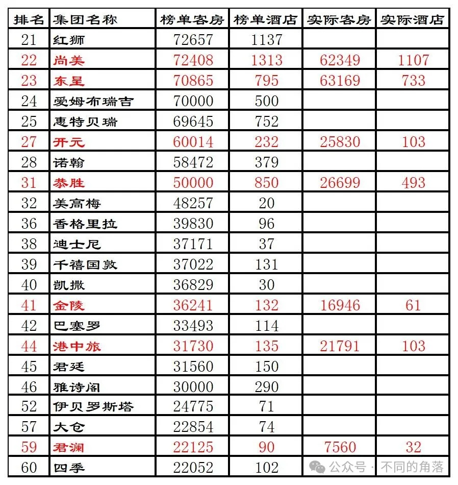
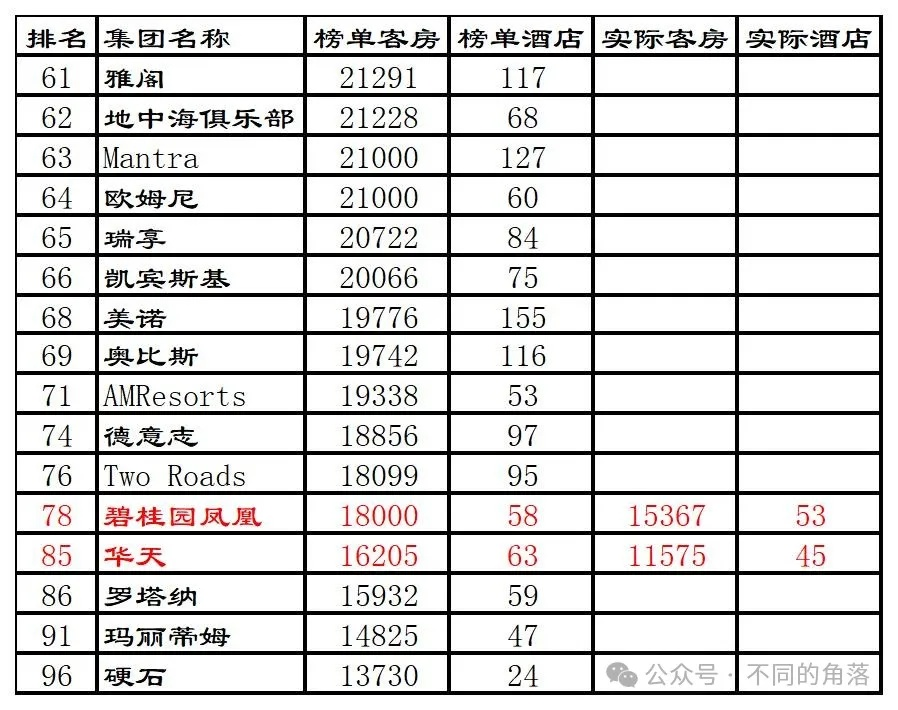
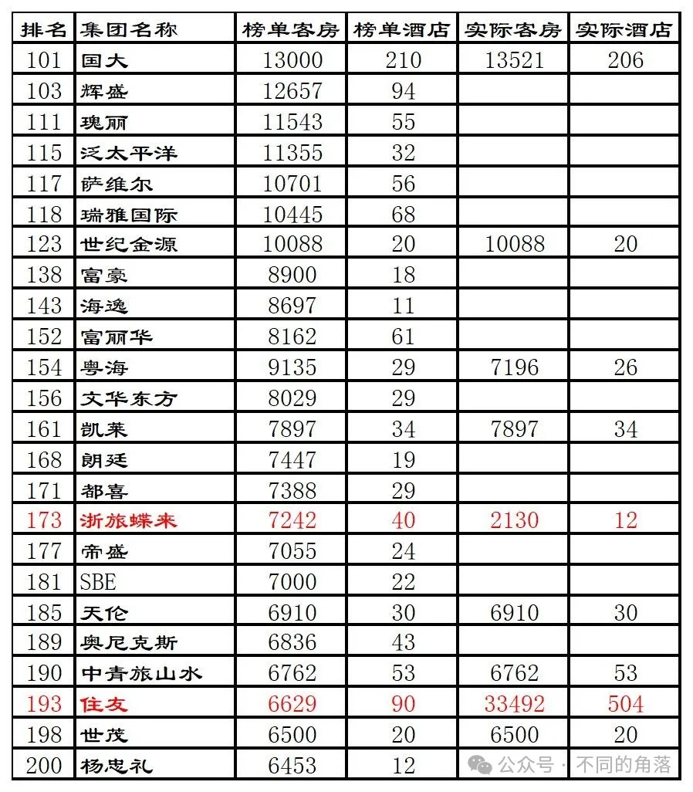
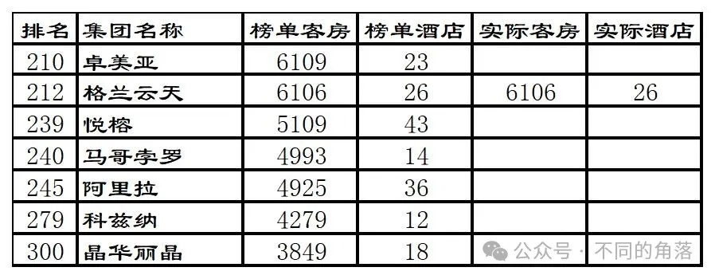
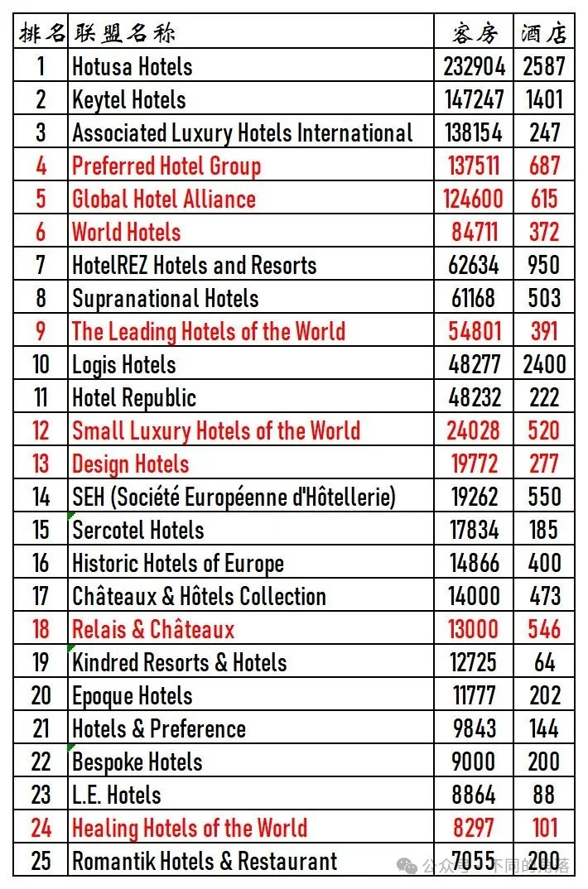

# 2016年度全球酒店集团325强

> 本文转载自微信公众号 **不同的角落**，已获作者授权。  
> 原文发布于 2024年4月11日 23:47  
> 原文链接：[mp.weixin.qq.com](http://mp.weixin.qq.com/s?__biz=MzU4OTczMzkwNw==&mid=2247516199&idx=1&sn=69d915912c12f5b7e6c2589638602604&chksm=fdcbc95bcabc404d28d76cd86dd7d92ae64a647f207198f04e1e4412358b9516abe2cc5c8530&scene=21)

---

全球酒店行业媒体美国《HOTELS》杂志自1971年开始，每年夏季发布上一年度全球酒店集团排名。

《HOTELS》是国际酒店与餐厅协会会刊，至今已连续50多年在全球170多个国家发行，是全球酒店业最关注的杂志之一。

 

至2000年时《HOTELS》杂志的“**全球酒店集团325强**”年度全球酒店集团排名，已经成为全球酒店业内最知名的酒店集团排名体系。

2020年起更改为全球酒店集团225强排名。

2022年起更改为全球酒店集团200强排名。

年度全球酒店集团325强数据统计，**截至当年12月31日各酒店集团已签订正式合同并已开业**（指委托管理、特许经营、投资兼管理、租赁兼管理等方式的管理合同）或自由产权并已开业的酒店，不含顾问式管理及咨询管理的酒店，不含**持有饭店产权（全部或部分）**但**委托其他企业管理**或**使用其他企业旗下酒店品牌**的酒店。

数据由各酒店集团在线上自行申报，由国际酒店与餐厅协会对申报数据通过公开资料进行核实，通过委托第三方独立机构进行调查得出。

数据从酒店数量、客房数对酒店集团进行排名。

年度**全球酒店集团325强**包括如下排名：

**全球酒店集团300强**（全球300家酒店集团客房总数排名，2020年时更改为全球200家酒店集团客房总数排名，2022年起将酒店联盟与酒店集团合并排名）。

**全球酒店品牌50强**（单一品牌酒店客房总数排名）

**全球酒店数量50强**（各酒店集团酒店总数排名）

**全球酒店管理10强**（各酒店集团委托管理酒店总数排名）

**全球酒店特许经营10强**（各酒店集团特许经营酒店总数排名）

**全球酒店联盟25强**（各酒店联盟旗下酒店总数排名，2022年起取消，将酒店联盟与酒店集团合并排名）。

《HOTELS》325强排名只是统计各酒店集团的客房总数，与酒店的建筑设备、酒店规模、服务质量、管理水平统统无关，所以**这个排名只能做参考**，并不能真实反映各家酒店集团实力和管理水平。

由于是**各酒店集团自行申报门店数量和客房数量**（国内**开元、金陵、君澜、明宇等酒店集团每年都翻倍虚报**），国际酒店与餐厅协会委托进行核实的第三方机构也是**质不优**但**价格廉**的机构，造成每年的325强排名一些酒店集团开业酒店数量和客房数量都会有很大的水分。

另外由于连锁酒店大多数都是委托管理模式和特许经营模式，很多酒店都被两家酒店集团同时申报重复统计。

委托管理模式的酒店，按规则该酒店只应算在酒店品牌管理方酒店集团旗下，实际上酒店业主方也有自己的酒店管理公司拥有自己的连锁酒店品牌情况下通常也会对该酒店进行申报。

特许经营模式的酒店，酒店品牌方所属酒店集团和特许经营品牌被授权方酒店集团也都会同时对酒店进行申报。

比如国内的希尔顿欢朋品牌酒店，品牌所属方希尔顿会将国内的希尔顿欢朋酒店纳入希尔顿旗下进行申报；希尔顿欢朋品牌国内的特许经营方锦江（之前是铂涛，后铂涛被锦江收购）也会将国内的希尔顿欢朋酒店纳入自家旗下进行申报。

国内的美爵、诺富特、美居、宜必思尚品、宜必思这五个品牌酒店，品牌所属方雅高会将国内的这五个品牌酒店纳入雅高旗下进行申报；这五个品牌国内的特许经营方华住也会将国内的这五个品牌酒店纳入自家旗下进行申报。

上一篇：[2015年度全球酒店集团325强](http://mp.weixin.qq.com/s?__biz=MzU4OTczMzkwNw==&mid=2247515674&idx=1&sn=12cc8c974c448221138353a4d280fb4d&chksm=fdcbf766cabc7e70170c8e44c5c22dbdb7de0775f3b2659c94eb2ed2ae5328a2df3fa4896cd4&scene=21#wechat_redirect)

2016年全球酒店集团325强部分榜单如下，全球酒店300强榜单20名后只列出**国内酒店集团**、**港澳台酒店集团**以及**已进驻中国内地的国际酒店集团**。

榜单上国际酒店集团全球数量没那个能力去统计，只对榜单上部分国内酒店集团截至2016年底已开业酒店数量进行了统计。

个人精力有限，如有差错纰漏烦请各位指正！！！

**2016年全球酒店集团300强排名前10强名单如下****：**

**2016年度全球酒店集团前10强排名：**

1、2016年万豪完成从喜达屋资本收购上一年度排名第八的喜达屋酒店，将之前相差无几的希尔顿、洲际远远甩在后边，与之前洲际一样开始连续多年霸榜老大。

2、希尔顿与万豪相差一个喜达屋，已经追赶无望，继续当老二。

3、洲际已无力追赶万豪，与希尔顿客房数量差距也继续增加，只能继续当老三。

4、2016年温德姆收购精品生活酒店品牌Fen酒店、Dazzler酒店和Esplendor精品酒店，继续当老四，仍是当年开业酒店数量最多的酒店集团。

5、2016年锦江完成收购维也纳，锦江旗下的卢浮收购印度连锁酒店Sarovar Hotels，Sarovar Hotels旗下共有73家酒店。同时锦江出售了之前购买的第三方酒店管理公司州际，锦江排名继续保持第五。锦江旗下开业酒店5977家，其中有限服务酒店5868家，有限服务直营酒店1093家。

铂涛旗下3039家酒店，其中7天系列（7天+7天优品+7天阳光）2424家、派酒店163家、IU酒店135家、丽枫169家、喆啡63家、其它品牌85家；维也纳旗下464家酒店，其中维纳斯皇家3家、维也纳国际140家、维也纳130家、维也纳智好150家、维也纳3好41家；原锦江旗下有限服务酒店1066家126889间客房。原锦江旗下锦江都城43家、锦江之星1011家、金广快捷28家、百时快捷60家。

6、2016年雅高收购上一年度排名30的费尔蒙莱佛士，将奢华五星酒店费尔蒙、莱佛士和豪华五星酒店瑞士3个品牌100多家酒店纳入旗下。继续排名第六。

7、精选国际继续排名第七。

8、2016年首旅收购连续多年排名国内经济酒店老大的如家，排名跃升至第八位。首旅开业酒店3402家，其中国外1家白俄罗斯明斯克北京饭店；首旅建国65家、首旅京伦7家、首旅南苑5家、首旅寒舍6家、欣燕都25家、雅客怡家33家、如家2385家、莫泰411家、如家精选100家、和颐85家、云上四季33家、派柏云77家、睿柏云27家、如家商旅23家、驿居（蓝牌+金牌）21家、璞隐1家、扉缦2家、素柏云2家、其它80家。

9、2016年华住将从中州国际收购的经济酒店中州快捷20多家酒店翻牌为汉庭。2016年华住收购雅高国内的宜必思尚品和宜必思，并获得授权特许经营雅高在大中华区和蒙古区的美爵、诺富特、美居、宜必思尚品、宜必思5个品牌，排名升至第九位。华住开业酒店3269家，其中禧玥6家、漫心2家、全季284家、星程136家、怡莱185家、汉庭2181家、海友375家；特许经营的雅高旗下美爵1家、诺富特2家、美居15家、宜必思尚品10家、宜必思72家。

10、最佳西方排名降至第十。

**2016年度全球酒店集团11-20强****排名：**

1、2016年海航收购上一年度排名第12的卡尔森瑞德，卡尔森瑞德旗下1132酒店，原海航旗下22家酒店，其中国外1家为2016年开业的比利时布鲁塞尔唐拉雅秀酒店。排名跃升至第11位。

2、格林豪泰开业酒店1712家，国外6家酒店；格林豪泰连锁酒店1332家。

3、维也纳已经被锦江收购，还是被单列出来。

**2016年度全球酒店集团21-60强排名：**

1、尚美开业酒店1107家。

2、东呈开业酒店733家。

3、开元开业酒店103家25830间客房，包括国外1家酒店223间客房，为2013年收购的法兰克福金郁金香（锦江收购的卢浮旗下品牌，进驻国内后定名为郁锦香）酒店升级改造翻牌为法兰克福开元名都大酒店于2016年开业。开元酒店大股东开元旅业旗下开元产业信托2016年收购的荷兰埃因霍温假日酒店是洲际旗下品牌，开元产业信托收购后也并未转由开元酒店管理，不算开元酒店旗下酒店。

4、恭胜开业酒店493家。

5、金陵开业酒店61家。

6、港中旅开业酒店103家，包括收购的英国第三方酒店管理公司Kew Green Hotels，在英国管理运营的50多家酒店，包括皇冠假日、假日、智选假日、华美达、万豪等品牌酒店。

7、君澜开业酒店32家。

**2016年度全球酒店集团61-100强排名：**

1、2016年美诺继续收购葡萄牙缇沃丽酒店在葡萄牙的7家酒店和缇沃丽品牌在巴葡萄牙的所有权，完成对缇沃丽14家酒店和缇沃丽品牌的全权收购。

2、施泰根博阁酒店集团更名为德意志酒店集团。

3、碧桂园凤凰开业酒店53家。

4、华天开业酒店45家。

**2016年度全球酒店集团101-200强排名：**

1、石家庄国大开业酒店206家。

2、世纪金源开业酒店20家。

3、粤海开业酒店26家。

4、凯莱开业酒店34家，包括国外1家莫桑比克马普托安徽外经凯莱酒店258间客房。

5、浙旅蝶来开业酒店12家。

6、天伦开业酒店30家。

7、中青旅山水开业酒店53家。

8、住友开业酒店504家。

9、世茂开业酒店20家。

**2016年度全球酒店集团201-300强排名：**

1、格兰云天开业酒店26家。

 

**2016全球酒店联盟25强榜单如下：**

更多的年度酒店排行、国内酒店统计、酒店常识、酒店行业资讯、酒店集团、航空常识、沈阳旅游、沙发客、打油诗等相关内容可以到我的微信公众号里查看。

也欢迎大家关注我的微信公众号：**sfk024**

公众号名称：**不同的角落**

在微信公众号搜索sfk024或是不同的角落都可以搜索到，也可以直接扫码或长按识别下方二维码关注。

