# 提供劣质生活用纸的智选假日，用卫生纸替代纸巾纸的塔城机场头等舱休息室，聊聊卫生纸和纸巾纸

> **作者**：不同的角落  
> **发布时间**：2024年4月15日 23:10  
> **原文链接**：[提供劣质生活用纸的智选假日，用卫生纸替代纸巾纸的塔城机场头等舱休息室，聊聊卫生纸和纸巾纸](https://mp.weixin.qq.com/s?__biz=MzU4OTczMzkwNw==&mid=2247516796&idx=1&sn=04f97fc854288defb840455408a285dc&scene=21)

---

上周从新疆塔城飞乌鲁木齐，在塔城机场头等舱候机室（下图这个休息室）休息，候机室里只有小食品和饮料。

看了下小食品在保质期内，吃了一袋小食品后想擦嘴，才发现休息室里纸巾盒里没有纸巾了。

告诉休息室里机场员工没有纸巾了，当班员工去了休息室储物间，估计是储物间里没有纸巾，员工去了储物间对面卫生间，扯了一些卫生卷纸拿回来放到纸巾盒里。还好翻了下衣服兜里还有小包手帕纸。

现在吃小食品都要先看下是否还在保质期，是因为前几天从新疆其它机场飞塔城时，在那家机场休息室吃了一袋小食品后才发现过了保质期，然后仔细看了下那家机场休息室里摆放的小食品居然一半都过了保质期。

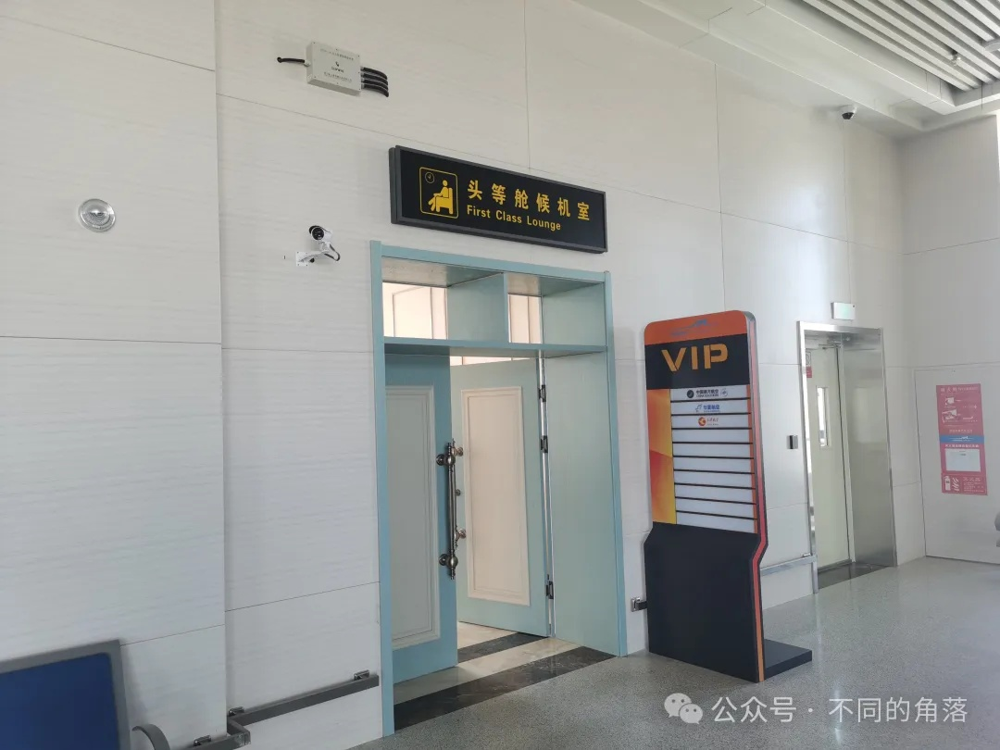

当天乘飞机离开塔城，晚上入住新疆其它城市一家新开业的智选假日酒店，酒店3月下旬开始试营业，我入住那天是正式开业。

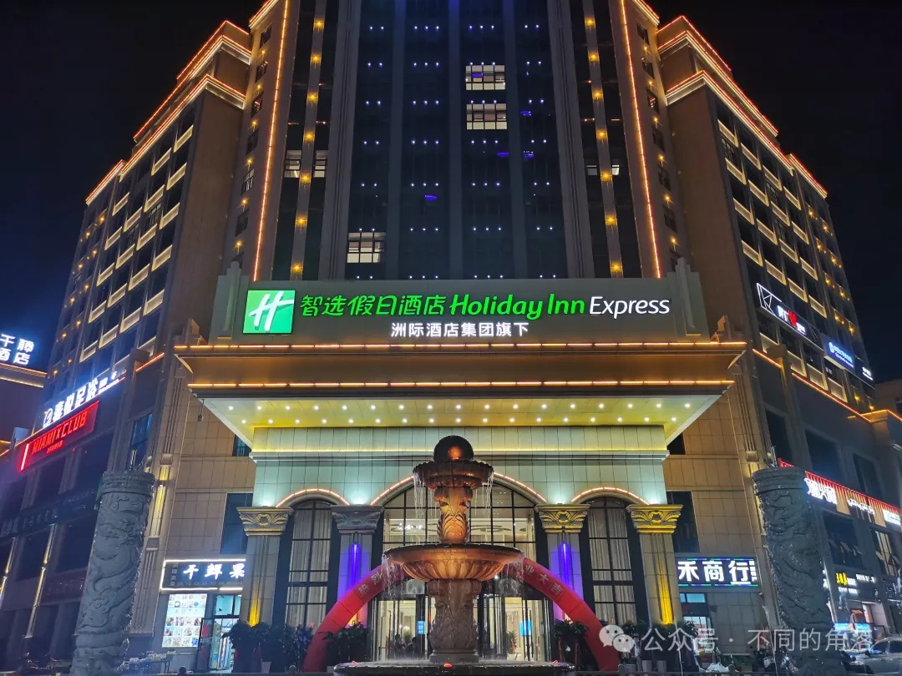

酒店外观很气派，大堂空间也够大，客房和其它配套设施也都很好，客房里配备的免费水是农夫山泉，客房里小度智能语音控制，房间相比一些假日酒店也毫不逊色。

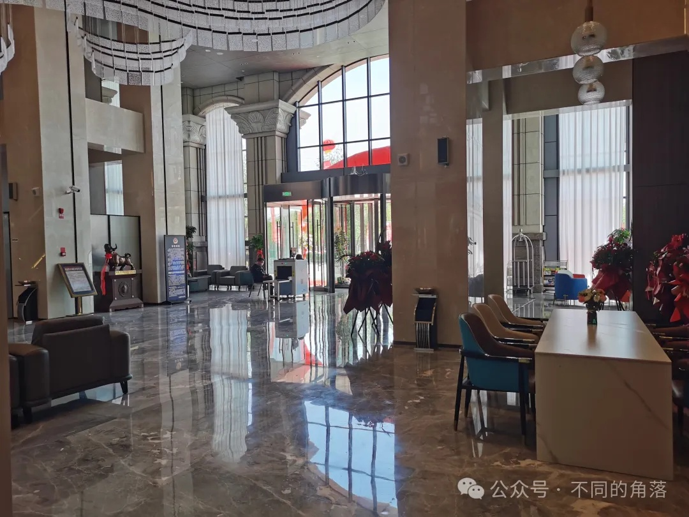

智选假日是洲际旗下的经济酒店品牌，进入国内后拔高成中档酒店，在国内众多OTA平台上与希尔顿旗下低端品牌希尔顿欢朋/希尔顿惠庭以及万豪旗下低端品牌万枫一样大都被划分到四星（钻）/高档酒店一档，少数智选假日/希尔顿惠庭/希尔顿欢朋/万枫还被国内多家不靠谱的OTA平台划分到五星（钻）/豪华酒店一档，与丽思卡尔顿、华尔道夫、瑞吉、柏悦、丽晶、安缦、香格里拉、洲际、JW万豪、君悦、威斯汀、索菲特、万豪、希尔顿、喜来登、皇冠假日等真正五星档次酒店一档。

一个国外经济酒店品牌在国内能被拔高，自有它的过人之处，国内智选假日的品控做的比较好。

之前入住过国内多家智选假日酒店，入住体验都不错，和现在华住旗下经济品牌汉庭新版体验差不多。

这次入住的智选假日，本来觉得应该是我入住过的国内智选假日酒店天花板了，直到我用了房间里配备的纸巾盒里纸巾擦手，发现纸巾质量很糟糕，是劣质品。又去卫生间看了一下配备的卫生纸，也是劣质品。

卫生间里配备两卷卫生纸，有一卷是没撕开带外包装的，拍照如下：

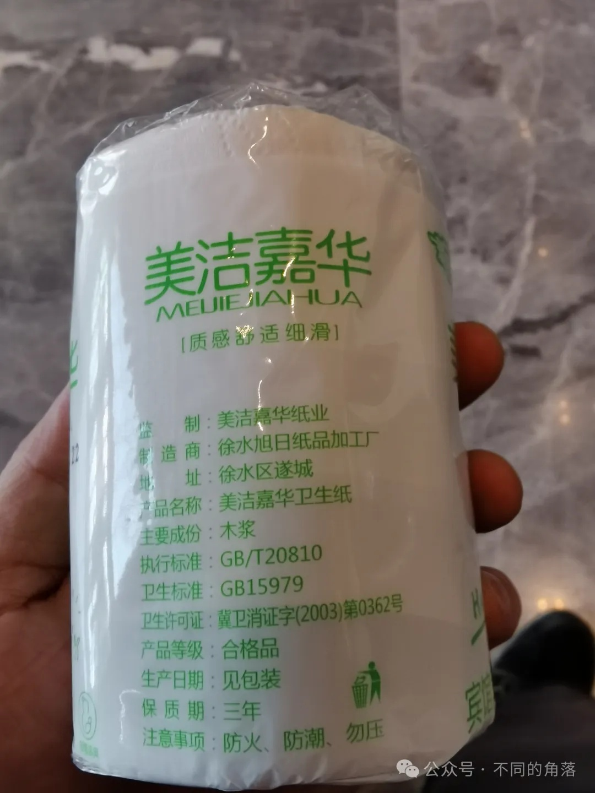

卫生纸看着好像很正规，外包装上生产厂家、主要成份、执行标准、卫生标准、卫生许可证（“消”字号）、产品等级、生产日期、保质期等一应俱全。

第二天在酒店吃过早餐后，告知酒店前台员工客房里的纸巾纸和卫生纸是劣质品，让找个管事的出来。前台员工打电话喊来了房务总监。

告诉酒店房务总监拿一卷未撕开的卫生纸和一包纸巾纸过来。房务总监说单包的纸巾纸包装上没有任何标识，包装箱上才有生产厂家等标识，我告诉他拿空的纸巾纸包装箱和一卷卫生纸来。结果他只拿来一卷卫生纸，估计是纸巾纸包装箱上也没有什么标识。

卫生纸和纸巾纸都属于生活用纸，生活用纸是指为照顾个人居家、外出等所使用的各类卫生擦拭用纸。包括卷筒卫生纸、抽取式卫生纸、盒装面纸、袖珍面纸、纸手帕、餐巾纸、擦手纸、厨房纸巾等。

生活用纸常用种类有卫生纸、纸巾纸和湿巾。

卫生纸，也就是厕用纸，通俗说就是擦屁股的纸，遇水易分解；包括卷筒卫生纸、盘式卫生纸、平切卫生纸和抽取卫生纸等，以卷筒状卫生纸居多；卫生纸不在卫监部门监管范畴。合格的卫生纸使用纯木浆制作，允许使用回收料作为原材料，对是否含有迁移性荧光增白剂无明确要求。执行标准是GB/T 20810，要求细菌菌落总数≤600cfu/g。

2019年央视《每周质量报告》节目曝光抽检出的不合格卫生纸细菌菌落总数有的居然达到7800cfu/g，超标13倍。估计没抽查的卫生纸厂家中，还会有超标更多的。

纸巾纸，合格的纸巾纸柔软亲肤，可以用来擦脸、擦嘴、擦手等，浸湿后韧性较好，不易破碎，比如常用的纸面巾、纸餐巾、纸手帕，属于消毒产品，在卫监部门的监管范围。合格的卫生纸使用原生木浆制作，禁止使用回收料作为原材料，不得使用有毒有害原料、不含迁移性荧光增白剂。执行标准是GB/T 20808，卫生标准GB 15979，要求细菌菌落总数≤200cfu/g。

湿巾，人体用湿巾包括湿巾、卫生湿巾，属于消毒产品，在卫监部门的监管范围。

湿巾用于手、皮肤、黏膜的清洁，含有水分润肤剂和香料，可以去污清洁。执行标准是GB15979《一次性使用卫生用品卫生标准》。

卫生湿巾用于手、皮肤、黏膜的清洁、抑菌、杀菌，添加生产用水和消毒液等原材料，具有清洁杀菌作用。执行标准是GB15979《一次性使用卫生用品卫生标准》与WS575-2017《卫生湿巾卫生要求》，对大肠杆菌和金黄色葡萄球菌的杀灭率必须≥90%，如标明对真菌的作用，还须对白色念珠菌的杀灭率≥90%。

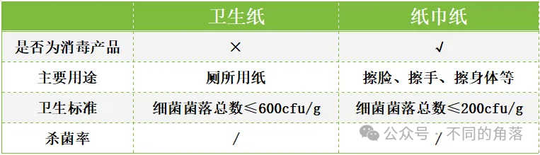

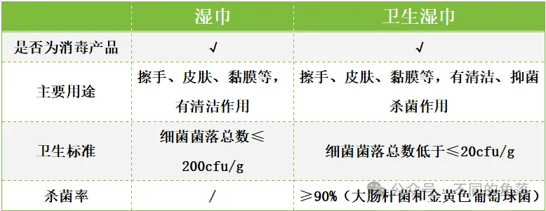

**✔ **让专业的纸干专业的事****

1、卫生纸是厕用纸，擦嘴非常不卫生~

2、纸巾纸韧性好，代替卫生纸可能会堵塞马桶~

3、需要消毒杀菌用卫生湿巾，普通湿巾只有清洁作用~

**✔**查看产品销售包装标注的内容****

**纸巾纸、湿巾、卫生湿巾**都是消毒产品，都需关注是否有“消”字号，及产品名称，净含量，生产企业名称/地址/联系方式、生产日期及有效期等；

**湿巾**还应标注产品规格、主要原料名称、执行标准编号；

**卫生湿巾**还应标注挤出液中的有效成分及含量、杀灭微生物类别、使用范围等。

以上部分文字和图片来自“江苏卫监”微信公众号。

劣质生活用纸很多都是回收纸再生制造的，所用纸浆原料来源甚广，甚至包括用过的卫生巾、报纸及其他废纸等，经回收漂白后被一些小加工厂或黑窝点非法制造，最后流通到市场上。

国内生活用纸市场份额最大的四家分别是维达国际（前身为成立于1985年的新会日用工业品厂；2013年9月后控股股东为欧洲第一大全球第二大的消费用纸生产商瑞典Essity，旗下有生活用纸维达品牌和Essity旗下的德宝、添宁、多康等品牌；2024年3月被新加坡金鹰集团旗下亚太资源集团收购）、恒安国际（旗下有生活用纸心相印品牌和安尔乐品牌卫生巾/纸尿裤、七度空间品牌卫生巾等，心相印纸巾连续多年市场占有率位居国内第一）、中顺洁柔（旗下有生活用纸洁柔和太阳品牌以及朵蕾蜜品牌卫生巾）、金红叶（隶属于印尼金光集团旗下亚洲浆纸业有限公司（APP）中国公司，旗下有生活用纸清风、唯洁雅、真真品牌），这四家都具有全国性生产基地，年产能均达到60万吨以上，产品以中高档原生木浆纸为主，旗下品牌也被大众熟知。

先来看下正经厂家的卫生纸和纸巾外包装标注。

先看卫生纸：

维达卫生纸

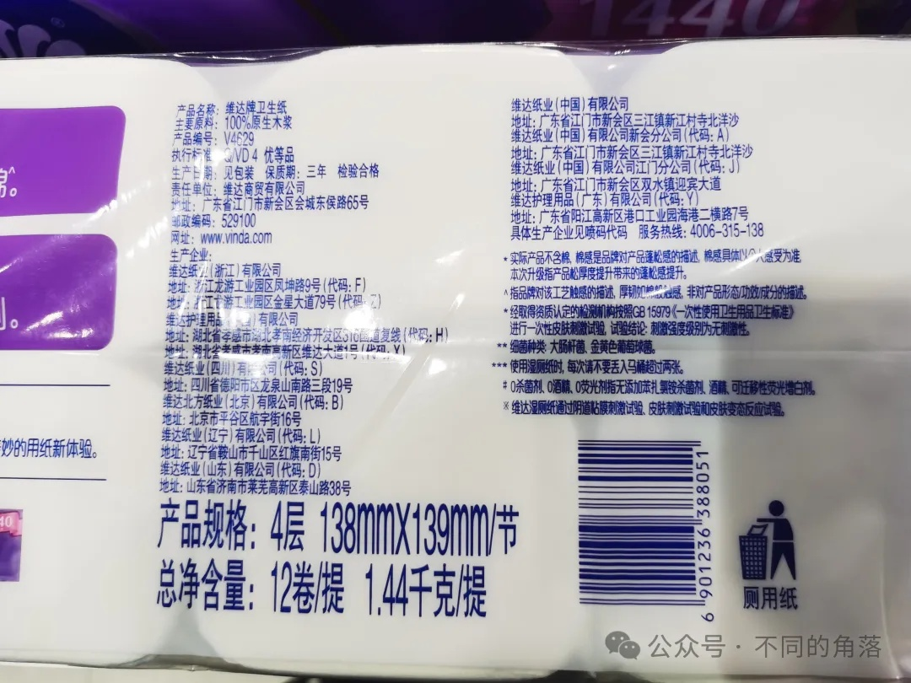

洁柔卫生纸

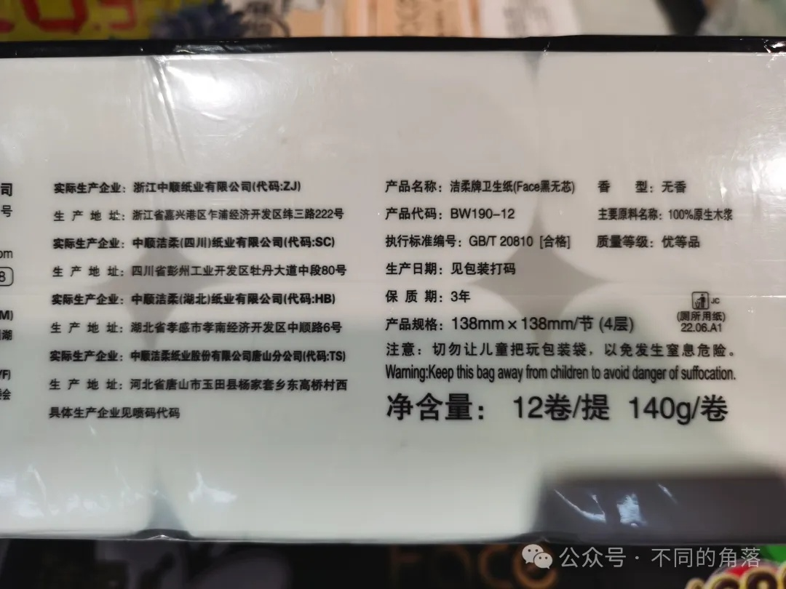

清风卫生纸

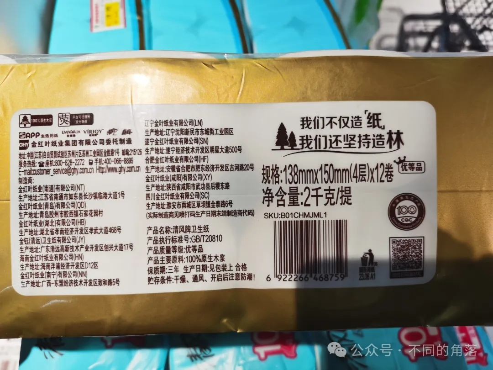

正经厂家的卫生纸包装标注，只标注执行标准（GB/T 20810或是企业标准），上图维达卫生纸标注的就是企业标准QVD4，企业标准相关指标高于国家标准。不会标注卫生标准GB 15979和“消”字号，GB/T 20810标准指标是低于GB 15979的，这两个标准卫生纸不可能同时符合。

再看纸巾纸：

清风纸手帕

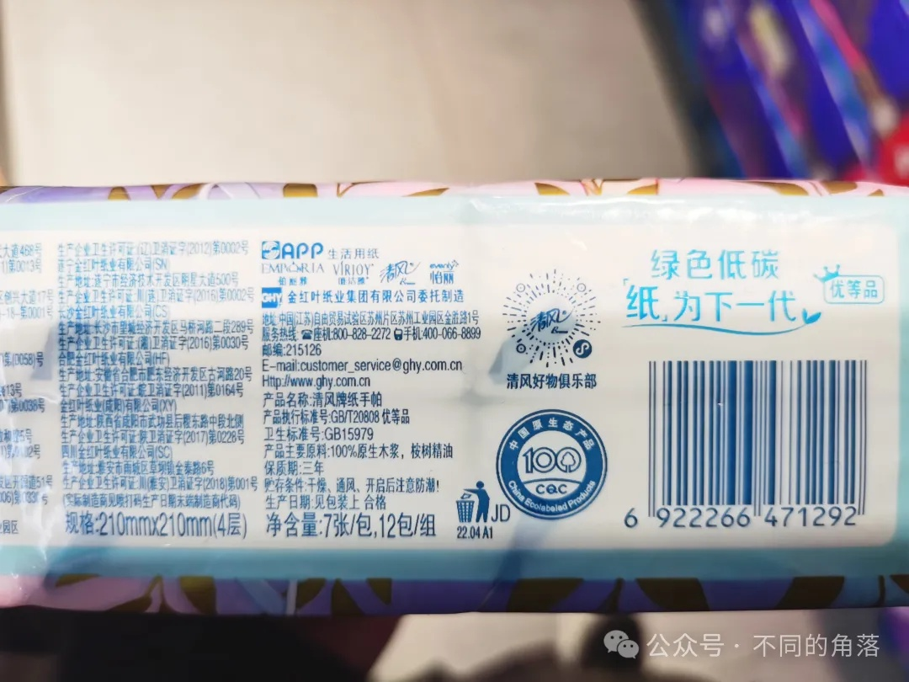

洁柔纸手帕

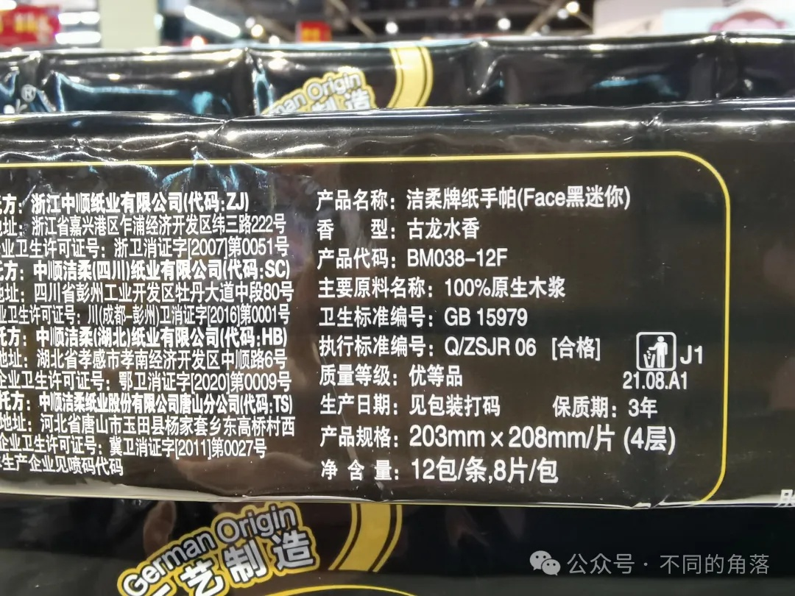

心相印纸手帕

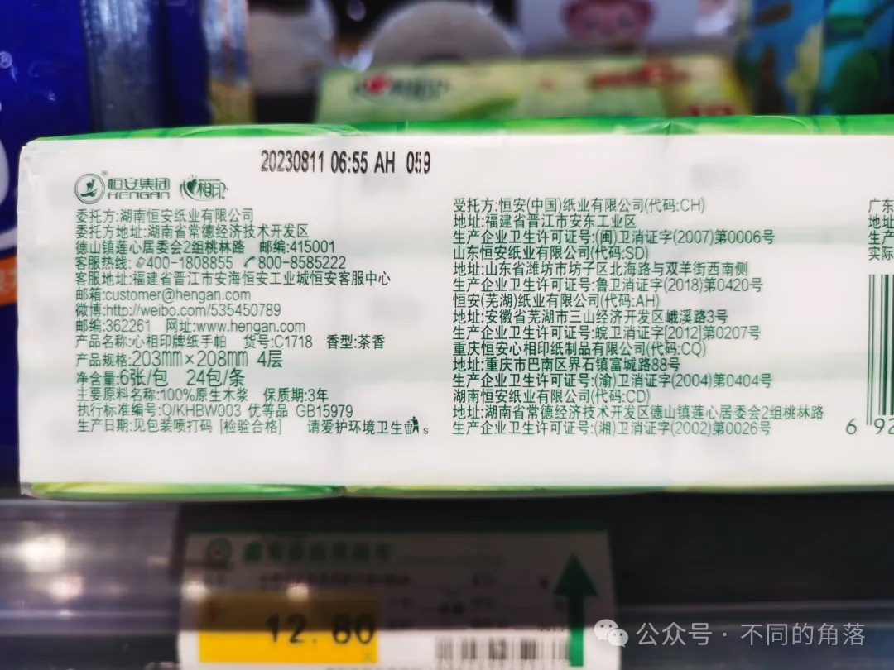

维达纸面巾

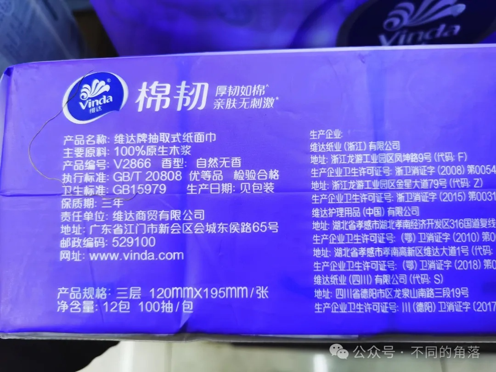

洁柔纸面巾

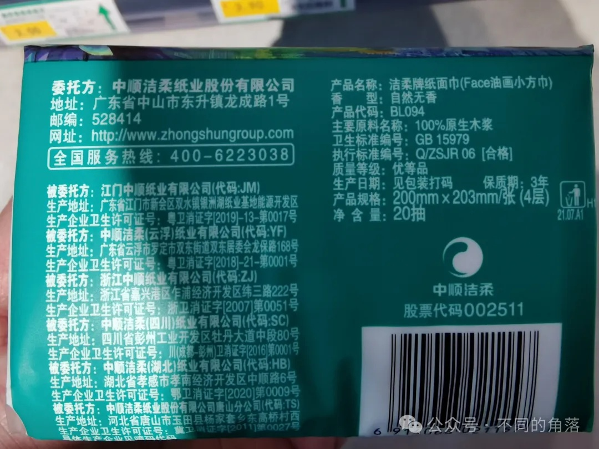

心相印纸面巾

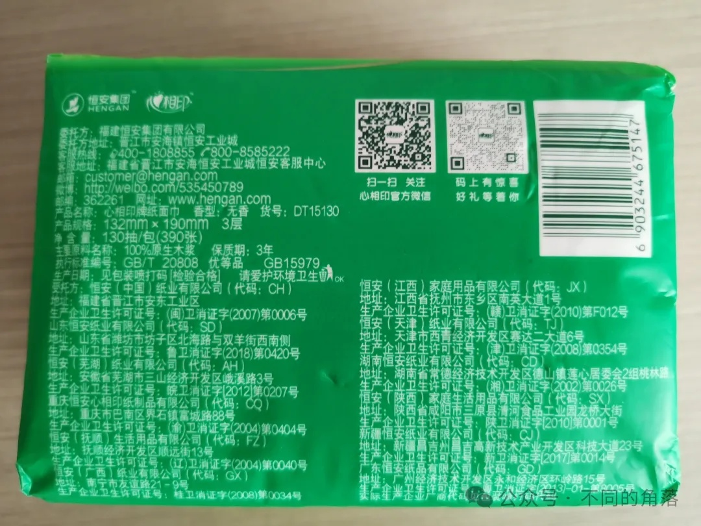

正经厂家的纸巾纸包装标注，标注执行标准（GB/T 20808或是企业标准），上图清风/洁柔/心相印纸手帕和洁柔纸面巾标注的就是各自的企业标准，企业标准相关指标高于国家标准。同时标注卫生标准GB 15979，GB/T 20808标准和GB 15979部分指标是相同的。还有卫生许可证（“消”字号）。

原生木浆和100%原生木浆不一样！

100%原生木浆没有添加任何再生纸浆或其它材料，其原料全部是天然木材，只经过蒸煮漂洗等工序，没有任何其他化学成分污染。一般来说，100%原生木浆多用于制造更高档的纸品，如高端纸巾、湿巾等卫生用品，这些产品的质量、卫生标准都相对较高。

正经厂家的卫生纸和纸巾纸主要原料都是100%原生木浆。

可以看到上面照片里维达、清风、洁柔、心相印品牌的卫生纸和纸巾主要原料都是100%原生木浆。

而原生木浆制作过程中添加过其它再生浆料和其它材料。

GB 15979《一次性使用卫生用品卫生标准》，一次性使用卫生用品是指使用一次后即丢弃的、与人体直接或间接接触的、并为达到人体生理卫生或卫生保健(抗菌或抑菌)目的而使用的各种日常生活用品，产品性状可以是固体也可以是液体。例如，一次性使用手套或指套(不包括医用手套或指套)、纸巾、湿巾、卫生湿巾、电话膜、帽子、口罩、内裤、妇女经期卫生用品(包括卫生护垫)、尿布等排泄物卫生用品(不包括皱纹卫生纸等厕所用纸)、避孕套等，统称为“卫生用品”。

本色纸，近几年在生活用纸使用选择上，一种浅黄色的纸受到追捧，它被商家宣称为“无漂白、无添加”，这就是本色纸。受到商家宣传影响，很多人觉得本色纸比普通纸更健康。然而实际上，本色纸与普通白色生活用纸本质上没有区别，普通纸的原料多为木浆，本色纸原料则多为竹浆，由于竹浆原本的暖黄色，会使得制造出来的纸更贴近“本色”。但是，从原料上分析，二者都是常见的纸浆，没有关于使用健康方面的明显差异。两种纸最终的颜色差异体现在加工过程中：在经历蒸煮后，制造普通纸需要加入漂白剂进行漂白，本色纸是直接对竹浆进行加工。纯白生活用纸在漂白过程中会加入氯气或者含氯化合物如次氯酸等，但是经过后续的反复清洗，其含量会下降至极低，符合国标的要求。

本色卫生纸执行标准也是GB/T 20810或是企业标准。

本色纸巾纸执行标准大都是QB/T4509，主要指标与GB/T 20808基本相同，其中细菌菌落总数≤200cfu/g。

这几天特意去逛了几家大型超市，结果发现一些大超市里售卖的卫生纸也有一些不正经厂家生产的，虽然比我入住的那家智选假日酒店客房里的卫生纸要看起来正规好很多，但外包装标注上和我入住的那家智选假日酒店卫生纸一样，也都是执行标准GB/T 20810加上卫生标准GB15979，反正外包装厂家自行随便印刷。其中一些品牌是之前曝光过的不合格品牌卫生纸。

2019年央视《每周质量报告》节目曾经曝光过“毒纸巾”，现在看来曝光后并没有什么变化。

生活用纸实际应用场景中，很多经济酒店（包括规模排名国内前几位的知名连锁酒店品牌部分酒店）和餐馆，现在还要加上智选假日这个中档品牌酒店和其它一些中档连锁品牌酒店，提供给顾客使用的都是不正经厂家生产的劣质卫生纸和纸巾纸，甚至很多餐馆直接用卫生纸替代纸巾纸提供给顾客。

看到过很多餐馆饭桌上摆放的都是那种卫生卷纸，昨天在广州一家烧腊店吃猪脚饭，吃完后想擦擦嘴，才发现饭桌上的是卫生纸（执行标准GB/T 20810），不是纸巾纸（执行标准GB/T 20808）。

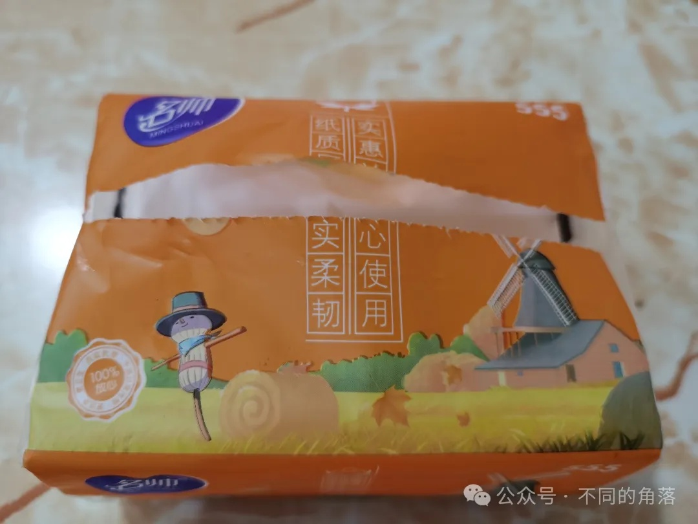

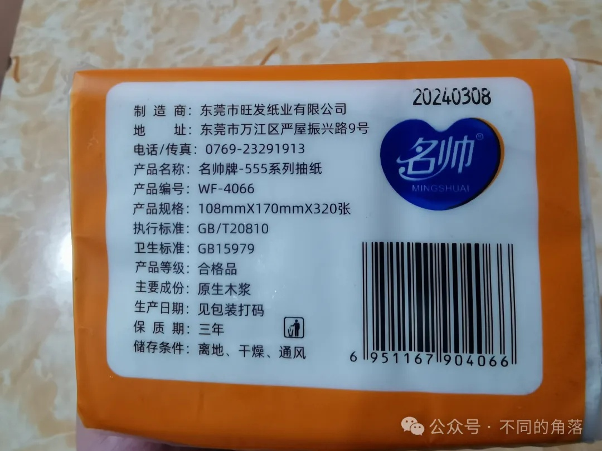

很多餐馆都打着不使用地沟油不使用添加剂的旗号，然而这些餐馆中提供给顾客的是劣质纸巾纸或是用卫生纸代替纸巾纸的不在少数，并且很多还是不正经厂家的劣质卫生纸。

虽说国人的胃这些年来已经被锤炼得和小强差不多，但想想用擦屁股纸擦嘴，还是挺恶心的。很多得呼吸道疾病的病人，也不知道和使用劣质卫生纸擦嘴擦鼻子有没有关系。

最后说下塔城机场和那家智选假日酒店后续。

第二天我打了塔城机场问询电话反馈后，接到了休息室主管的电话，和预料之中的一样，开口就是当天休息室当班员工的错，绝口不提塔城机场大大小小LD的失职，也不说她姓氏名谁。直到我问她是不是别人花10元钱雇来给我打电话的，才报上姓名，最后说欢迎我下次再去塔城机场休息室感受他们的服务。

新疆那家智选假日酒店房务总监说会在开会时反馈卫生纸和纸巾情况，不知道会不会更换。毕竟智选假日是经济酒店，不能要求太高。然后房务总监去酒店旁边超市买了两包心相印纸巾纸送到我房间，说超市里没有卫生纸。那两包心相印纸巾纸估计也得几元钱，不容易！！！

个人建议：

随身携带带两小包正经厂家的手帕纸备用。

更多的酒店常识、酒店行业资讯、酒店集团、航空常识、铁路常识、沈阳旅游、沙发客、打油诗等相关内容可以到我的微信公众号里查看。

也欢迎大家关注我的微信公众号：**sfk024**

公众号名称：**不同的角落**

在微信公众号搜索sfk024或是不同的角落都可以搜索到，也可以直接扫码或长按识别下方二维码关注。

