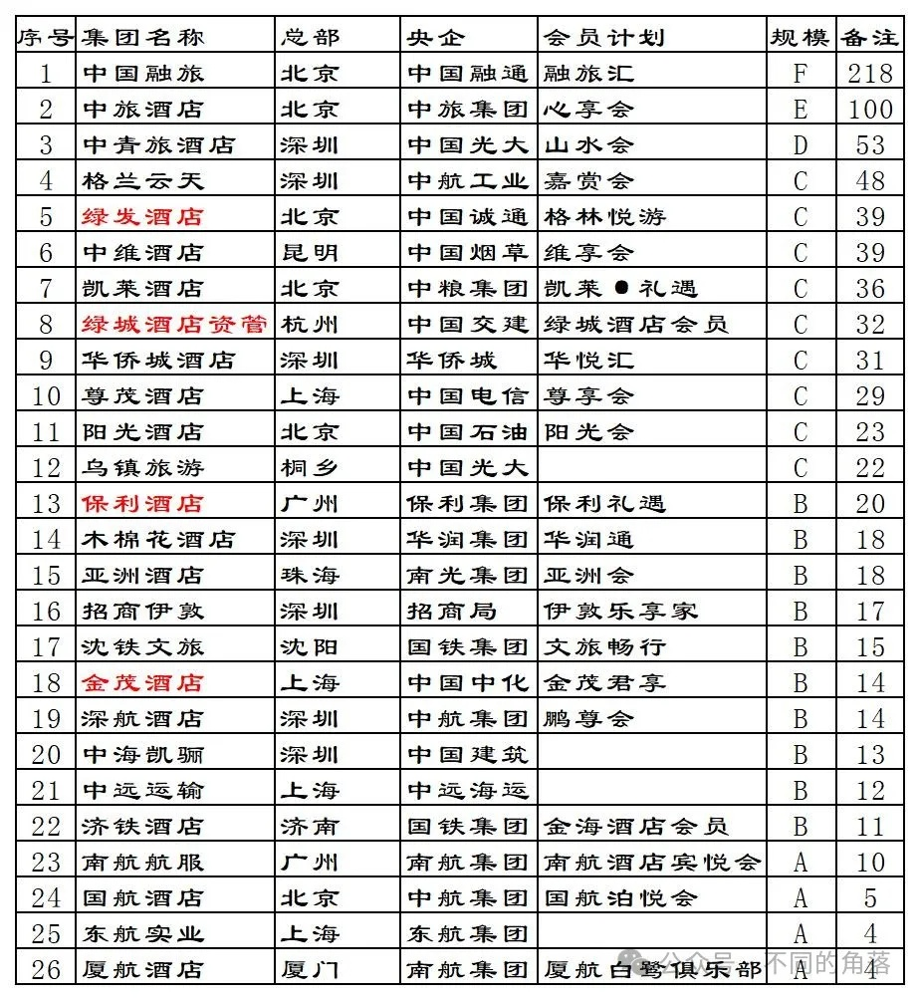
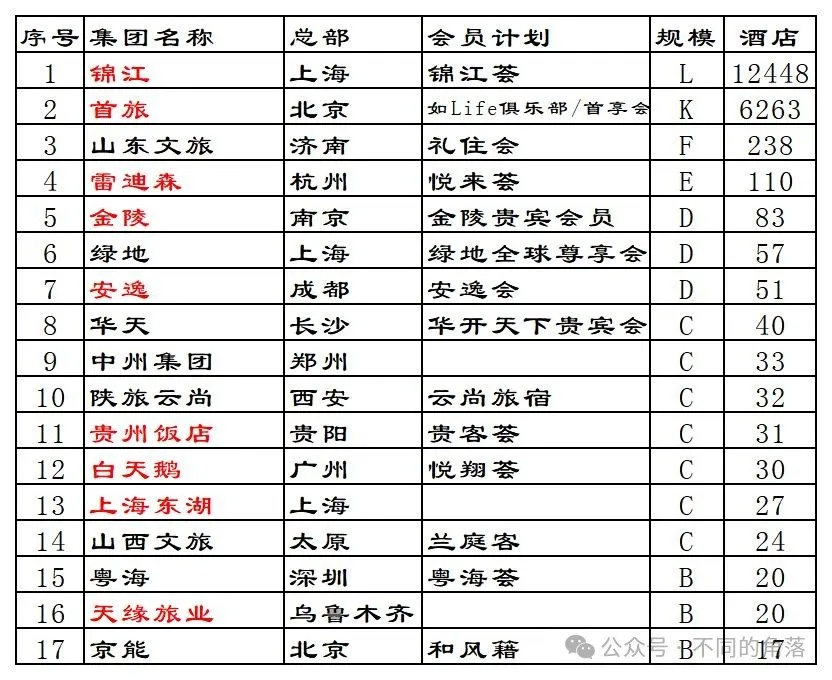
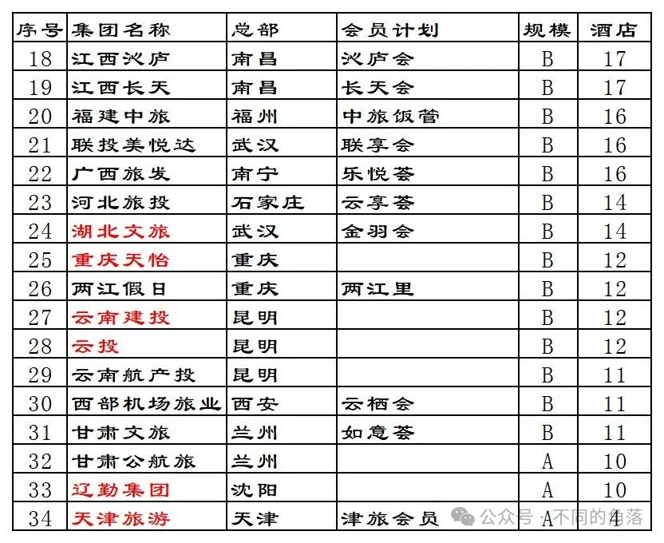
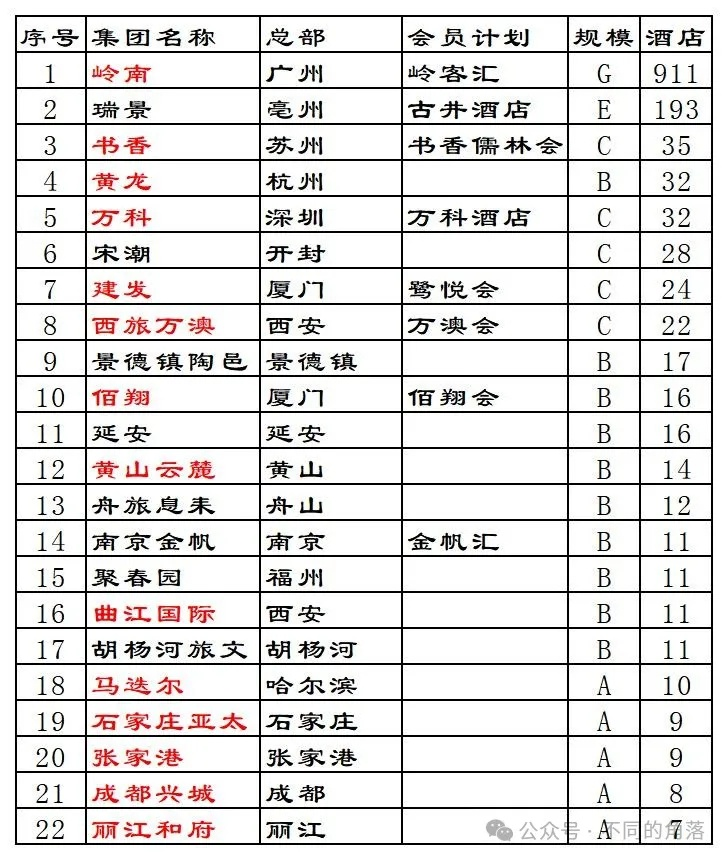

# 酒店常识十五国内酒店集团统计国资篇

> **作者**：不同的角落  
> **发布时间**：2024年5月20日 21:39  
> **原文链接**：[酒店常识十五国内酒店集团统计国资篇](http://mp.weixin.qq.com/s?__biz=MzU4OTczMzkwNw==&mid=2247518714&idx=1&sn=69a7281ceb5b7e549ef607c136a40fcb&chksm=fdcbc086cabc4990190d3397d4337283332e6a9ac17f7f21c9c518cdde0b084105f922202f90)

---

国内国资背景的酒店集团（管理公司）或是旗下有酒店业务的集团公司。

本文已设置关键词自动回复，本文关键词“国资酒店”，公众号发送“国资酒店”即可看到。

不含已注销的酒店集团（管理公司），比如之前南航（20多家酒店）、东航（40多家酒店）、国航（30多家酒店）旗下已注销的酒店集团（管理公司），现在三大航旗下剩余的几家酒店归属三大航旗下新的酒店集团（管理公司）。

被其它酒店集团（管理公司）合并、被收购的酒店集团（管理公司）不单列。比如上海市衡山（集团）有限公司（原上海市政府接待办）已划归上海市东湖（集团）有限公司（原上海市委接待办），统计只单独列出上海市东湖（集团）有限公司。

本次更新规模在10家酒店以内的酒店集团（管理公司）只保留了几家。

央企背景酒店只保留了国航、东航、厦航3家；省级国资背景的只保留了旗下有“华夏第一店天津利顺德大饭店”的天津旅游；地级/县级国资背景的只保留了旗下有百年老店正太饭店的石家庄亚太、旗下有苏州第一代国宾馆南园宾馆的张家港、旗下有国资酒店里体量最大4900间客房的成都兴城、旗下有5家丽世的丽江和府。

锦江、首旅开业酒店数量截至2023年12月31日，其它酒店集团开业酒店数量有些截至2024年5月。

个人精力有限，如有差错纰漏烦请各位指正！！！

**国家机关事务管理局宾馆管理中心**

下辖的宾馆平时大都正常对外营业，可以在各大OTA平台上预订。

旗下有北京友谊宾馆、北京国谊宾馆、北京达园宾馆、北京紫金宾馆、北京首都宾馆、北京国二招宾馆。

**国宾馆背景**

钓鱼台美高梅酒店集团有限公司，大股东钓鱼台酒店管理有限公司持股51%，钓鱼台酒店管理有限公司两个股东分别为钓鱼台经济开发有限责任公司（持股90%）和中国钓鱼台国际旅行社有限责任公司（持股10%），钓鱼台经济开发有限责任公司和中国钓鱼台国际旅行社有限责任公司都是外交部钓鱼台宾馆管理局（钓鱼台国宾馆）的全资子公司。

目前旗下有成都钓鱼台、青岛钓鱼台、青岛美高梅、深圳美高梅、上海西岸美高梅、南京鲁能美高梅美荟、上海苏宁宝丽嘉、三亚美高梅8家酒店。

美狮荟会员计划，三亚美高梅不参加。

**央企背景**

先来一张简图：

规模栏各字母代表酒店集团旗下开业酒店数量如下：

A：1—10，B：11—20，C：21—50，D：51—100，E：101—200，F：201—500。

01、中国融通旅业发展集团有限公司，是中国融通资产管理集团有限公司的全资子公司。

旗下有南京中央饭店、杭州华北饭店、重庆红楼宾馆、成都望江宾馆、上海延安饭店、广州东山宾馆、北京赵家楼饭店等众多老字号酒店，还有北京远望楼、广州珠江宾馆、舟山碧海山庄、济南燕子山庄、兰州西北宾馆、上海蓝天宾馆、成都新华宾馆、三亚海棠湾9号度假酒店、拉萨珠峰饭店等知名酒店。

融旅汇会员计划。

02、中国旅游集团酒店控股有限公司，是中国旅游集团有限公司的全资子公司。

旗下自营品牌酒店有北京维景国际大酒店、北京远通维景国际大酒店、北京广安门维景国际大酒店、北京金海湖维景国际大酒店、北京龙熙维景国际会议中心、北京丽都维景酒店、北京和平里旅居酒店、上海吉臣维景酒店、重庆维景国际大酒店、重庆丽苑维景国际大酒店、张家口雪如意维景酒店、沈阳北约客维景国际大酒店、长春乐府维景酒店、长白山观岳民俗酒店、南京维景国际大酒店、苏州旅居姑苏饭店、山东政协大厦维景大酒店、杭州维景国际大酒店、深圳维景酒店、樟树汇安达旅居酒店等40多家。

心享会会员计划，10多家酒店不参加。

03、中青旅山水酒店集团股份有限公司，中青旅控股股份有限公司持有中青旅山水酒店集团股份有限公司51%股份，中国青旅集团有限公司及其全资子公司中青创益投资管理有限公司共计持有中青旅控股股份有限公司20%股份（中国青旅集团直接持股17.17%为第一大股东），中国青旅集团有限公司是中国光大集团股份有限公司的全资子公司（中国光大集团股份有限公司还直接持有中青旅控股股份有限公司2.99%股份）。

旗下有武汉山水富丽华酒店、武汉山水富丽华酒店王家湾人信汇店、山水D武汉光谷店、山水S北京西站丽泽商务区店、山水S大连火车站中山广场店、山水S成都天府广场店、山水S乐山嘉定坊店、山水花园平遥古城店、山水时尚北海老街市政府店、山水时尚西安钟楼地铁站店等酒店。

山水酒店会员计划。

04、深圳格兰云天酒店管理有限公司，是中国航空技术深圳有限公司的全资子公司，中国航空技术深圳有限公司是中国航空技术国际控股有限公司的全资子公司，中国航空工业集团有限公司直接持有中国航空技术国际控股有限公司91.1344%股份。

旗下有北京皇家格兰云天大酒店、北京格兰云天国际酒店、上海园林格兰云天大酒店、漳州凌波格兰云天国际酒店、深圳花园格兰云天大酒店、共青城格兰云天国际酒店、陇南兴朝格兰云天国际酒店、深圳上海宾馆、九江半岛宾馆、共青城茶山迎宾馆等酒店。

嘉赏会会员计划，目前38家酒店参加。

05、中国绿发投资集团有限公司北京幸福产业公司，隶属于中国绿发投资集团有限公司，中国诚通控股集团有限公司持有中国绿发投资集团41.11%股份，另两家央企中国国新控股有限责任公司和国家电网有限公司分别持有中国绿发投资集团27.78%和26.67%股份。

旗下有四季旗下品牌大连四季酒店、万豪旗下品牌的日赛谷丽思卡尔顿隐世酒店、上海艾迪逊、上海鲁能JW万豪侯爵、曲阜鲁能JW万豪、三亚山海天JW万豪、三亚山海天傲途格精选、无锡鲁能万豪、无锡鲁能万怡，希尔顿旗下品牌的九寨康莱德、天津康莱德、九寨鲁能希尔顿、大连金石滩鲁能希尔顿、海口鲁能希尔顿、文安鲁能希尔顿、济南鲁能希尔顿、文昌鲁能希尔顿、文安郝力克希尔顿启缤精选、九寨鲁能希尔顿花园，洲际旗下品牌的济南鲁能贵和洲际、九寨英迪格、宜宾鲁能皇冠假日、VOCO千岛湖阳光、大连金石滩鲁能温泉假日、北京礼士智选假日、大连金石滩智选假日、文昌南洋美丽汇智选假日，温德姆旗下品牌的泰安东尊华美达广场、海南澄迈鲁能蔚景温德姆，雅高旗下品牌的长白山鲁能胜地瑞士、望·长白鲁能美憬阁精选，还有地中海俱乐部旗下品牌的地中海俱乐部·长白山度假村、地中海邻境·千岛湖度假村，雅诗阁旗下的三亚山海天雅诗阁服务公寓、硬石旗下品牌的大连硬石酒店、钓鱼台美高梅旗下品牌的南京鲁能美高梅美荟酒店。

中国绿发自营的有长白山鲁能胜地原乡客栈、千岛湖郝力克酒店、三亚华源温泉海景度假酒店三家酒店。

目前已签约项目推进中的有万豪旗下品牌的乌鲁木齐丽思卡尔顿、乌鲁木齐万豪、乌鲁木齐雅乐轩、库尔勒万丽、库尔勒万怡，洲际旗下品牌的伊宁洲际、伊宁假日、那拉提英迪格、那拉提智选假日、雄安皇冠假日、雄安智选假日。

格林悦游会员计划，上线有日赛谷丽思卡尔顿隐世、大连四季、地中海俱乐部·长白山度假村外其余30多家已开业酒店，相比各连锁酒店集团官方和OTA价格无优势。

06、云南中维酒店管理有限责任公司，云南合和（集团）股份有限公司持有云南中维酒店管理有限责任公司80%股份（中国烟草投资管理有限公司持有其余20%股份），云南中烟有限责任公司及其另两个全资子公司红塔烟草（集团）有限责任公司和红云红河烟草（集团）有限责任公司共计持有云南合和（集团）股份有限公司100%股份（其中红塔烟草持股75%，红云红河烟草持股13%，云南中烟直接持股12%），云南中烟有限责任公司是中国烟草总公司的全资子公司。

旗下有上海大酒店、上海王宝和大酒店、昆明中维翠湖宾馆、昆明维笙望湖宾馆、大理维笙山海湾酒店、大理维笙古榕酒店等酒店。

维享会会员计划。

07、凯莱国际酒店管理（北京）有限公司，是凯莱国际酒店有限公司（香港）的全资子公司，凯莱国际酒店有限公司（香港）隶属于中粮集团有限公司。旗下有北京东升凯莱、北京宝之谷国际会议中心、苏州亨通凯莱、青岛凯莱湘潭福星凯莱、西安天域凯莱、三亚凤凰水城凯莱等酒店。

凯莱·礼遇会员计划，部分酒店参加。

中粮旗下大悦城控股还有几家酒店不在凯莱旗下，北京华尔道夫、三亚美高梅、三亚亚龙湾瑞吉以及北京大悦酒店（大悦城推出的自有酒店品牌）。

08、绿城酒店资产管理有限公司，为绿城资产管理集团有限公司全资子公司，绿城资产管理集团有限公司为绿城房地产集团有限公司全资子公司，绿城房地产集团有限公司由绿城中国控股有限公司全资子公司才智控股有限公司100%控股，中国交通建设集团有限公司通过旗下子公司合计持有绿城中国控股有限公司28.42%股权，为绿城中国控股有限公司第一大股东。

旗下有悦榕旗下品牌的安吉悦榕庄，星野旗下品牌的星野天台山嘉助酒店，洲际旗下品牌的宁波洲际酒店，希尔顿旗下品牌的台州希尔顿酒店、诸暨希尔顿，万豪旗下品牌的杭州绿城尊蓝钱江豪华精选、海南蓝湾绿城威斯汀、舟山朱家尖绿城威斯汀和6家绿城喜来登，还有2家尊蓝山居、4家绿城玫瑰园酒店等酒店。

09、深圳市华侨城国际酒店管理有限公司，是深圳华侨城股份有限公司的全资子公司，华侨城集团有限公司及其全资子公司深圳华侨城资本投资管理有限公司共计持有深圳华侨城股份有限公司47.97股份（华侨城集团直接持股47.01%）。

旗下有洲际旗下品牌的深圳华侨城洲际、深圳威尼斯英迪格、深圳国际会展中心皇冠假日，万豪旗下品牌的深圳前海华侨城JW万豪、深圳欢乐海岸万豪行政公寓、深圳华侨城艾美。

自营品牌有深圳蓝汐蓝楹湾、深圳东部华侨城茵特拉根、重庆华侨城嘉途、武汉玛雅嘉途、襄阳华侨城云海等20多家酒店。

华悦汇会员计划。

10、尊茂酒店控股有限公司，是新国脉数字文化股份有限公司的全资子公司，中国电信集团有限公司直接持有新国脉数字文化股份有限公司51.16%股份。

旗下有北京辰茂鸿翔酒店、北京辰茂南粤苑酒店、上海尊茂酒店、江苏辰茂新世纪大酒店、北海辰茂海滩酒店、新疆尊茂鸿福酒店、新疆尊茂银都酒店等酒店。

尊享会会员计划。

11、阳光酒店管理集团有限公司，是中国华油集团有限公司的全资子公司，中国华油集团有限公司是中国石油天然气集团有限公司的全资子公司。

旗下有北京天坛饭店、北京中油宾馆、北京石油科技交流中心、上海中油阳光大酒店、广州阳光酒店、深圳中油阳光大酒店、昆明阳光酒店、拉萨阳光酒店、三亚阳光大酒店、西安阳光国际大酒店、甘肃阳光大酒店、敦煌阳光沙洲大酒店、乌鲁木齐阳光国际酒店等酒店。

12、乌镇旅游股份有限公司，大股东为持股66%的中青旅控股股份有限公司，中国青旅集团有限公司为中青旅控股股份有限公司第一大股东，中国青旅集团有限公司为中国光大集团股份有限公司的全资子公司。

旗下有益大丝业会馆、恒益行馆、锦堂行馆、盛庭行馆、堤上度假酒店、稻舍乡村酒店、宜园精品酒店、乌村酒店、水市客舍、昭明书舍、通安客栈、乌镇青年驿站、水巷青年旅馆等酒店。

13、保利酒店管理有限公司，是保利发展控股集团股份有限公司的全资子公司，中国保利集团有限公司及其全资子公司保利南方集团有限公司共计持有保利发展控股集团股份有限公司40.49%股份。

旗下有瑰丽旗下品牌的的三亚保利瑰丽，洲际旗下品牌的广州保利洲际、佛山保利洲际、佛山东平保利洲际、重庆保利皇冠假日、广州增城保利皇冠假日、江门保利皇冠假日、南昌保利皇冠假日、成都保利花园皇冠假日、海陵岛保利皇冠假日、广州保利假日，万豪旗下品牌的中山保利艾美、长春保利万怡，希尔顿旗下品牌的抚州保利华章希尔顿逸林。

自营品牌有广州保利山庄、广州保利悦雅、德州保利悦雅、林芝保利雅途、湄洲岛国际会展中心郡雅、广州白云设计之都郡雅等6家酒店。

保利礼遇会员计划。

14、木棉花酒店管理（深圳）有限公司，是木棉花酒店管理有限公司（香港）的全资子公司，木棉花酒店管理有限公司（香港）隶属于华润集团有限公司。

旗下有深圳木棉花、深圳罗湖木棉花、深圳后海木棉花、深圳深圳湾木棉花、北京木棉花、北京大兴机场木棉花、成都木棉花、成都东安湖木棉花、雄安白洋淀木棉花、杭州木棉花、惠州小径湾木棉花、日照木棉花、无锡米兰花、徐州米兰花、井冈山米兰花、延安米兰花、红安米兰花、剑河米兰花、巴中南江米兰花、三明清流米兰花等多家酒店。

华润通会员计划。另木棉花与凯悦合作部分木棉花上线凯悦官方预订平台官，冠名凯悦旗下非标品牌凯悦臻选。

15、亚洲酒店（广东）集团有限公司，隶属于国米有限责任公司，中国南光集团有限公司成员。

旗下有江门亚洲福永温泉酒店、珠海永春酒店、中山南朗亚洲福永酒店、福建永春亚洲酒店、北京福永御龙酒店、景德镇朗逸酒店、荔波澳门大酒店、荔波亚洲连锁酒店、河口亚洲主题酒店、云南福永银发大酒店、澳门莲居、澳门东亚酒店、澳门港湾大酒店、澳门亚洲精品旅馆、澳门富豪酒店（富豪旗下品牌）、澳门京都酒店、澳门帝濠酒店、澳门濠璟酒店等多家酒店。

亚洲会会员计划。

16、深圳招商伊敦酒店及公寓管理有限公司，是招商局蛇口工业区控股股份有限公司的全资子公司，招商局集团有限公司及其全资子公司招商局轮船有限公司共计持有招商局蛇口工业区控股股份有限公司64.83%股份（招商局集团直接持股59.53%）。

旗下有希尔顿旗下品牌的北京康莱德、深圳国际会展中心希尔顿、深圳蛇口希尔顿南海酒店，洲际旗下品牌的深圳国际会展中心洲际，朗廷旗下品牌的徐州伊敦康德思酒店，雅高旗下品牌的西安伊敦诺福特酒店。

自营品牌有千岛湖伊敦度假酒店、漳州华商酒店、漳州招商卡达凯斯美伦山庄、深圳太子伊敦睿选酒店4家酒店和北京华商壹棠服务公寓、天津奥体壹棠服务公寓、重庆壹棠服务公寓、苏州科技城壹棠服务公寓、深圳东门壹棠服务公寓、深圳半山壹棠服务公寓、深圳蛇口壹棠服务公寓7家酒店公寓。还有北京、上海、广州、深圳、杭州、厦门、重庆等地多家长租公寓。

伊敦乐享家会员计划。

17、沈阳铁道文旅集团，隶属于中国铁路沈阳局集团有限公司，国家铁路集团。

旗下有沈阳东北大厦、沈阳铁道1912饭店、沈铁大酒店、大连铁道宾馆、大连铁道1896花园酒店、丹东五龙背温泉酒店、锦州御园宾馆、兴城水调歌城温泉酒店、长春铁联商旅酒店、吉林国际大酒店、山海关望海度假村、通辽草原酒店、赤峰赤铁宾馆等多家酒店。

文旅畅行会员计划。

18、上海金茂酒店管理有限公司，是中国金茂（集团）有限公司的全资子公司，中国金茂（集团）有限公司是中国金茂控股集团有限公司的全资子公司，中国中化控股有限责任公司旗下的中化香港（集团）有限公司是中国金茂控股集团有限公司的第一大股东（持股35.28%）。

旗下有万豪旗下品牌的金茂三亚亚龙湾丽思卡尔顿、长沙梅溪湖金茂豪华精选、金茂深圳JW万豪、南京金茂威斯汀、广州南沙金茂万豪、北京金茂万丽，希尔顿旗下品牌的金茂三亚亚龙湾希尔顿，凯悦旗下品牌的上海金茂君悦大酒店、上海崇明金茂凯悦、丽江金茂酒店凯悦臻选酒店。

自营品牌有丽江金茂璞修雪山酒店、北京金茂怡生园酒店、上饶饶商金茂诚悦酒店、西安金茂酒店4家酒店。

金茂君享会员计划，14家酒店都参加。

19、深圳市深航物业酒店管理有限公司，是深圳航空有限公司的全资子公司，中国国际航空股份有限公司持有深圳航空有限公司51%股份，中国航空集团有限公司及中国航空（集团）有限公司（香港）共计持有中国国际航空股份有限公司51.7%股份（中国航空集团有限公司持股40.98%）。

目前旗下有深圳深航国际酒店、深圳星都深航鹏雅酒店、深圳观澜海拓深航鹏逸酒店、深圳深航鹏轩空勤公寓、深职院深航鹏轩公寓、南宁深航鹏轩空勤公寓、防城港深航国际酒店、柳州深航鹏逸酒店、运城深航国际酒店、郑州易元深航国际酒店、南京深航鹏雅酒店、遵义深航国际酒店、喀什深航国际酒店等10多家酒店。

鹏尊会会员计划，目前仅剩深圳深航国际酒店一家参加。

20、深圳市中海凯骊酒店管理有限公司，是中海地产（佛山）有限公司的全资子公司，中海地产（佛山）有限公司是中国海外兴业有限公司（香港）的全资子公司，中国海外兴业有限公司（香港）是中国建筑集团有限公司旗下成员。

旗下有凯悦旗下品牌的万宁神州半岛君悦，万豪旗下品牌的万宁神州半岛喜来登、万宁神州半岛福朋喜来登、珠海中海万丽，洲际旗下品牌的苏州金普顿竹辉酒店，雅高旗下品牌的珠海中海铂尔曼，雅诗阁旗下品牌的成都雅诗阁秦皇服务公寓、澳门雅诗阁服务公寓。

自营品牌有北京国泰饭店、雄安凯骊、济南中海凯骊、福州中海凯骊、珠海中海凯骊酒店。

21、中国远洋运输有限有限公司，是中国远洋海运集团有限公司的全资子公司。

旗下有北京远洋宾馆、上海远洋宾馆、天津远洋宾馆、天津塘沽远洋宾馆、广州远洋宾馆、青岛远洋大酒店、大连中远海运洲际大酒店（洲际旗下品牌）、广州海员宾馆、博鳌亚洲论坛大酒店、博鳌亚洲论坛金海岸大酒店、博鳌亚洲论坛东屿岛大酒店、香港中远宾馆等多家酒店。

22、山东济铁酒店管理有限责任公司，隶属于中国铁路济南局集团有限公司，国家铁路集团。

旗下有济南铁道大酒店、济南金海精品酒店、青岛金海大酒店、青岛金海花园假日酒店、青岛金海高铁精品酒店（红宇楼+商务楼）、烟台金海大酒店、曲阜金海大酒店、日照金海假日酒店、泰安金海铁道大酒店等多家酒店。

金海酒店会员计划。

23、广东南航明珠航空服务有限公司，是中国南方航空股份有限公司的全资子公司，中国南方航空集团有限公司直接持有中国南方航空股份有限公司50.75%股份。

目前有广州南航明珠大酒店、北京明珠酒店大兴机场店、上海南航明珠大酒店、大连南航明珠大酒店、武汉南航明珠大酒店、桂林南航明珠大酒店、珠海南航明珠大酒店、乌鲁木齐南航明珠国际酒店等酒店。

南航酒店宾悦会会员计划。

24、国航物业酒店管理有限公司，由中国航空集团建设开发有限公司及其旗下全资子公司中国航空集团旅业有限公司100%持股，中国航空集团建设开发有限公司是中国航空集团有限公司的全资子公司。

目前旗下有北京中航泊悦、上海中航泊悦、重庆国航饭店、大连国航大厦、内蒙古国航大厦5家酒店。

国航泊悦酒店会员计划。

25、东航实业集团有限公司，是中国东方航空集团有限公司的全资子公司。

旗下目前只有上海航空酒店浦东机场店、上海国际机场宾馆、杭州东航云逸酒店、陕西航空大酒店等酒店，不包括东航江苏公司、东航云南公司旗下酒店、公寓。

26、厦门航空酒店管理有限公司，是厦门航空有限公司的全资子公司，中国南方航空股份有限公司持有厦门航空有限公司55%股份，中国南方航空集团有限公司直接持有中国南方航空股份有限公司50.75%股份。

目前旗下有厦航酒店1987（厦门航空宾馆）、厦航金雁酒店、泉州厦航酒店、晋江厦航酒店。

厦航白鹭俱乐部会员计划。

**省级国资委背景**

也是先来一张简图：

规模栏各字母代表酒店集团旗下开业酒店数量如下：

A：1—10，B：11—20，C：21—50，D：51—100，E：101—200，F：201—500，G：501—1000，H：1001—2000，             J：2001—5000，K：5001—10000，        L：10001—20000。

01、上海锦江国际酒店股份有限公司，隶属于锦江国际（集团）有限公司，上海市国资委。

完成收购锦江国际酒店管理有限公司后，旗下有J、昆仑、锦江、暻阁、锦江都城、维也纳国际、维也纳、丽枫、希岸、喆啡、白玉兰、锦江之星、7天、百时快捷等酒店品牌，还有特许经营的希尔顿旗下中档品牌希尔顿欢朋。

旗下有上海锦江饭店（建国初期上海市国宾馆）、上海J酒店、上海和平饭店（雅高旗下品牌）、上海锦江汤臣洲际（洲际旗下品牌）、北京昆仑饭店、上海静安昆仑大酒店、上海锦江国际酒店、上海虹桥锦江大酒店、上海锦江华亭宾馆、上海锦江金门大酒店、云南大围山锦江度假酒店、江苏锦江南京饭店、锦江都城经典上海南京路步行街外滩新城饭店、锦江都城经典上海南京路步行街南京饭店、锦江都城经典上海南京东路外滩酒店、锦江都城经典上海青年会人民广场酒店、锦江都城经典上海达华静安寺酒店、上海外滩郁锦香新亚酒店、上海虹桥宾馆、上海静安暻阁酒店、腾冲暻阁半山温泉酒店等酒店。

锦江荟会员计划。旗下丽笙酒店集团还有单独的丽赏会会员计划。

02、北京首旅酒店（集团）股份有限公司，隶属于北京首都旅游集团有限责任公司，北京市国资委。

旗下有诺金、安麓、建国、京伦、南苑、和颐、如家精选、如家商旅、如家、莫泰等酒店品牌，还有轻管理模式合作（类似OYO）的睿柏云、素柏云、诗柏云、派柏云、云上四季民宿和华驿（已被如家收购70%股权）系列品牌，以及与凯悦合作的中档品牌逸扉。

旗下有北京饭店诺金、北京诺金酒店、北京环球度假区诺金、上海朱家角安麓、绍兴兰亭安麓、成都官塘安麓、北京建国饭店、北京京伦饭店、北京国际饭店、北京东方饭店、北京民族饭店、北京远东饭店等知名酒店，目前旗下已开业酒店6000多家。

首旅集团旗下还有北京安缦（安缦旗下品牌）、北京宝格丽（万豪管理品牌）、北京燕莎凯宾斯基（凯宾斯基旗下品牌）、首北兆龙饭店（凯悦旗下凯悦臻选品牌）、北京饭店、北京长富宫饭店、北京长城饭店等酒店尚未划归首旅酒店。

如Life俱乐部（经济、中档酒店品牌）、首享会（诺金、安麓、建国、京伦、南苑品牌）两个会员计划。

03、山东文旅酒店管理集团有限公司，隶属于山东文旅集团有限公司，山东文旅集团隶属于山东省商业集团有限公司，山东省国资委。

旗下有济南怡豪大饭店、青岛鲁商凯悦酒店（凯悦旗下品牌）、临沂鲁商铂尔曼酒店（雅高旗下品牌）、淄博银座华美达酒店（温德姆旗下品牌）、济南银座颐庭酒店、北京泰山饭店等酒店。

礼住会会员计划。

04、雷迪森酒店集团有限公司，浙江省国资委。

旗下有浙江宾馆、杭州龙井雷迪森庄园、杭州运河塘栖雷迪森庄园、普陀雷迪森庄园、杭州蝶来雅谷泉山庄、宁波东钱湖万金雷迪森酒店、建德江月湾酒店、景德镇雷迪森度假酒店、武义璟园蝶来望境、建德芳草地雷迪森怿曼等酒店。

悦来荟会员计划，30多家酒店参加。

05、南京金陵饭店集团有限公司，江苏省国资委。

旗下有南京金陵饭店、苏州金陵南林饭店、北京中信金陵酒店、上海金陵紫金山大酒店、深圳江苏宾馆等酒店。

金陵贵宾会员计划，10多家酒店不参加。

06、上海绿地酒店旅游（集团）有限公司，由绿地控股集团股份有限公司及其全资子公司100%持股，上海地产（集团）有限公司（持股25.8229%）和上海城投（集团）有限公司（持股20.5523%）为绿地控股集团股份有限公司第二大和第三大股东，合计持股46.3752%超过绿地控股集团股份有限公司第一大股东，上海市国资委。

做为酒店业主方上海绿地酒店旅游集团旗下有万豪旗下品牌的郑州绿地JW万豪、上海绿地万豪、上海绿地万怡、合肥绿地福朋喜来登，洲际旗下品牌的南京绿地洲际、南昌绿地华邑、徐州绿地皇冠假日、西安绿地假日，美利亚旗下品牌的济南绿地美利亚酒店。

以及上海三甲港绿地铂瑞、上海虹桥绿地铂瑞、上海虹桥绿地铂骊、上海三甲港绿地铂骊、上海绿地公馆会议中心、郑州绿地铂派、南京绿地御豪温泉酒店、济南雪野湖绿地游邑精品酒店、武汉汉南绿地铂瑞、武汉魔奇公寓、三亚海棠湾中国太平铂骊、银川国际交流中心等酒店。

原上海绿地酒店旅游集团旗下负责酒店管理业务的上海绿地酒店管理有限公司现在大股东为持股52%的明宇商旅，上海绿地酒店管理有限公司旗下有铂瑞、铂骊、铂派、游邑、魔奇等自营品牌。

绿地全球尊享会会员计划。

07、安逸酒店集团有限责任公司，隶属于四川省旅游投资集团有限责任公司，四川省国资委。

旗下有成都金牛宾馆（四川省国宾馆）、四川锦江宾馆、四川花园宾馆、自贡锦江檀木林宾馆、广元凤台宾馆等酒店。

安逸会会员计划。

08、华天酒店集团股份有限公司，隶属于湖南阳光华天旅游发展集团有限责任公司，湖南省国资委。

旗下有湖南华天大酒店、湖南宾馆、北京世纪华天大酒店、张家界华天大酒店等酒店。

华开天下贵宾会会员计划。

09、河南中州集团有限公司，河南省国资委。

旗下有河南省黄河迎宾馆（河南省国宾馆）、河南饭店、河南省委第二招待所、河南中州皇冠假日（洲际旗下品牌）、郑州中州假日、郑州中州智选假日等酒店。

10、陕西云尚精品酒店管理有限公司，接收同为西安唐城饭店资产投资有限公司旗下破产的陕西旅游饭店管理集团旗下酒店，隶属于西安唐城饭店资产投资有限公司，西安唐城饭店资产投资有限公司隶属于陕西旅游集团有限公司，陕西省国资委。

旗下有西安宾馆、西安唐城宾馆、西安东方大酒店、云尚陕西雍村饭店、西安云尚王府、宜川云尚观瀑舫、岐山云尚原舍等酒店。

云尚旅宿会员计划。

11、贵州饭店酒店管理集团有限公司，隶属于贵州酒店集团有限公司，贵州省国资委。

旗下有贵州饭店、贵州省政府迎宾馆、花溪迎宾馆（贵州省国宾馆）、遵义贵州饭店、六盘水贵州饭店、黄果树迎宾馆、织金饭店、北京贵州大厦等酒店。

贵客荟会员计划，目前仅7家酒店参加。

12、白天鹅酒店集团有限公司，隶属于广东省旅游控股集团有限公司，广东省国资委。

旗下有广州白天鹅宾馆、广东胜利宾馆、广东大厦、广东迎宾馆等酒店。

悦翔荟会员计划。

13、上海市东湖（集团）有限公司（原上海市委接待办），上海市国资委。

旗下有上海东郊宾馆（上海市国宾馆）、上海西郊宾馆（上海市国宾馆）、虹桥迎宾馆（上海市国宾馆）、上海瑞金洲际宾馆（洲际旗下品牌）、上海瑞金宾馆•太原别墅（上海市国宾馆）、上海兴国宾馆（锦江旗下丽笙管理）等知名酒店，还有衡山集团（原上海市政府接待办）旗下的上海衡山花园宾馆、上海扬子饭店、上海大厦、衡山马勒别墅饭店、上海浦江饭店（现为中国证券博物馆）等老酒店。

14、山西文旅酒店管理集团有限公司，隶属于山西省文化旅游投资控股集团有限公司，山西省国资委。

旗下有山西大酒店、太原兰博泰尔酒店、太原凯宾斯基饭店（凯宾斯基旗下品牌）、五台山友谊宾馆等酒店。

兰庭客会员计划，显示14家酒店参加，实际仅有4家酒店参加。

15、粤海国际酒店管理集团，隶属于粤海控股集团有限公司，广东省国资委。

旗下有深圳粤海酒店、上海粤海酒店、郑州粤海酒店、珠海粤海酒店、大连星海假日酒店、镇江佰润粤海国际酒店、张家港中联粤海国际酒店、海口兴泰粤海酒店、楚天粤海国际大酒店、西安唐隆国际酒店、佛山南海承载千灯湖酒店、香港粤海酒店、香港粤海华美湾际酒店等多家酒店。

粤海荟会员计划。

16、新疆机场集团天缘旅业有限公司，隶属于新疆天缘航旅有限责任公司，新疆天缘航旅隶属于新疆机场集团有限公司，新疆维吾尔自治区国资委。

旗下有乌鲁木齐机场宾馆、乌鲁木齐天缘酒店、阿克苏天缘国际酒店、库车天缘国际酒店、喀纳斯天缘山庄、那拉提天缘商务酒店、伊宁天缘国际酒店、喀什天缘国际酒店等酒店。

17、北京京能酒店管理有限公司，隶属于北京京煤集团有限责任公司，北京能源集团有限责任公司，北京市国资委。

旗下有北京天湖会议中心、和风景里四合院恭王府店、和风景里四合院西单店、和风景里四合院积水潭店、北京金泰海博大酒店、北京金泰绿洲大酒店、金泰之家北京通华苑饭店/北京大郊亭店/北京站店/北京南站店/甘家口店/西直门店/北京北站交通大学店、北京京西晨光饭店、贵州华联大酒店、银川国贸中心等酒店。

和风籍会员计划。

18、江西沁庐酒店资产管理集团有限公司，隶属于江西省旅游集团股份有限公司，江西省国有资本运营控股集团有限公司为江西省旅游集团股份有限公司大股东持股37%，江西省国资委。

旗下有江西饭店、江西宾馆、南昌赣江宾馆、鹰潭沁庐豪生大酒店（温德姆旗下品牌）、弋阳沁庐君澜大饭店（君亭旗下品牌）、庐山汤太宗温泉度假村等酒店。

沁庐会会员计划。

19、江西长天酒店管理集团有限公司，隶属于江西长天集团有限公司，江西长天集团有限公司隶属于江西大成国有资产经营管理集团有限公司，江西省国资委。

旗下有长天南昌园中源大酒店、江西宾馆、长天庐山莲花湖酒店、长天井冈山映山红宾馆、长天奉新九仙君澜温泉度假酒店（君亭旗下品牌）、景德镇昌南里长天酒店、井冈山园中源大酒店、靖安园中源大酒店等酒店。

长天会会员计划。

20、福建中旅饭店管理集团有限公司，隶属于福建省旅游发展集团有限公司，福建省国资委。

旗下有福州闽江饭店、南平武夷山庄、厦门华侨大厦、泉州华侨大厦等酒店。

中旅饭管会员计划。

21、湖北联投美悦达酒店管理集团有限公司，隶属于湖北联投城市运营有限公司，湖北联投城市运营有限公司隶属于湖北省联合发展投资集团有限公司，湖北省联合发展投资集团有限公司隶属于湖北联投集团有限公司，湖北省国资委。

旗下有武汉联投丽笙酒店（锦江旗下丽笙旗下品牌）、武汉光明万丽酒店（万豪旗下品牌）、武汉联投鲁湖酒店、三亚联投君亭酒店（君亭旗下品牌）、深圳清能楚天大酒店等酒店。

联享会会员计划。

22、广西旅发酒店集团有限公司，隶属于广西旅游发展集团有限公司，广西壮族自治区国资委。

旗下有广西华侨宾馆、南宁饭店、北海冠岭山庄、涠洲岛海景大酒店等酒店。

乐悦荟会员计划。

23、河北旅投国际酒店管理集团有限公司，隶属于河北旅游投资集团股份有限公司，河北省国资委。

旗下有石家庄云臻金陵世贸广场酒店、北京云臻金陵莲花酒店、沧州云臻金陵杂技酒店、崇礼云臻金陵翠云山酒店等酒店。

云享荟会员计划。

24、湖北文旅酒店集团有限公司，隶属于湖北文化旅游集团有限公司，湖北省国资委。

旗下有湖北洪山宾馆、武汉光谷皇冠假日酒店（洲际旗下品牌）、神农架木鱼大酒店、随州大洪山自在谷酒店、随州大洪山绿林山庄、洪湖悦兮半岛国际温泉度假村、随县筱泉湾度假村、麻城龟峰山庄、京山中国农谷院士村、黄梅问梅村客栈、松滋洈水假日酒店、房县天悦温泉酒店等酒店。

金羽会会员俱乐部会员计划。

25、重庆天怡控股集团有限公司，目前隶属于重庆市机关事务管理局，改制中，改制完成后重庆市国资委将成为实控人。

旗下有重庆渝州宾馆（重庆市国宾馆）、重庆雾都宾馆、重庆东方花苑饭店、广州重庆大厦宾馆等酒店。

26、重庆两江假日酒店管理有限公司，隶属于重庆旅游投资集团有限公司，重庆市国资委。

旗下有重庆JW万豪酒店（万豪旗下品牌）、重庆两江假日丽呈华廷酒店、道真两江假日丽呈酒店、黄水两江假日森林酒店等酒店。

两江里会员计划。另外与丽呈合作，部分酒店上线丽呈平台，丽呈会会员计划。

27、云南建投集团有限责任公司，云南省国资委。

旗下有弥勒东风韵美憬阁精选酒店（雅高旗下品牌）、玉溪新平戛洒外滩豪生酒店（温德姆旗下品牌）、玉溪元江栖霞山温泉花园酒店、保山青华海官房花园酒店、德宏梁河南甸伴山温泉酒店、玉溪峨山云茶山庄、玉溪澄江小院、怒江贡山独龙江天境酒店、昭通巧家金沙酒店、云南建投昭通发展大厦酒店、毕节大方慕俄格酒店、防城港深航国际酒店等酒店。

28、云投酒店集团有限公司，隶属于云南投资集团有限公司，云南省国资委。

旗下有西双版纳安纳塔拉酒店（安纳塔拉旗下品牌）、西双版纳云投喜来登酒店（万豪旗下品牌）、昆明西驿酒店、曲靖麒麟温泉SPA精品酒店、龙陵县邦腊掌酒店、景谷雁林酒店、通海秀山客栈、云南经贸宾馆、云南省工商行政管理培训中心、安宁工商培训中心、珠海云海酒店、深圳金碧酒店等酒店。

29、云南航空产业投资集团，隶属于云南省交通投资建设集团，云南省国资委。

旗下有昆明百事特悦航机场酒店、昆明机场宾馆、云南航空西双版纳观光酒店、腾冲空港观光酒店、临沧空港观光酒店、沧源机场宾馆、腾冲民航假日酒店、腾冲热海温泉度假酒店（包括养生阁、美女池、玉温泉3家酒店）、全季酒店昆明长水国际机场T1航站楼店等酒店。

30、西部机场集团旅业有限公司，隶属于西部机场集团有限公司，陕西省国资委。

旗下有西港航空酒店西安机场店、西港航空酒店西宁店、西港航空酒店银川店、西港航空酒店玉树店、西港航空饭店固原店、西港航空酒店南山温泉店等酒店。

云栖会会员计划。

31、甘肃文旅酒店管理有限公司，隶属于甘肃文旅产业集团有限公司，甘肃省国资委。

旗下有兰州饭店、兰州饭店天水和谐园、北京丰瑞如意云璟酒店、花桥如意鎏璟温泉度假酒店、七彩丹霞海圣帐篷温泉酒店、张掖丹霞如意云摄影酒店、陇愿·凤凰塬舍等酒店，委托管理西宁青海宾馆。

如意荟会员计划。

32、甘肃省公航旅酒店管理有限公司，隶属于甘肃省公路航空旅游投资集团有限公司，甘肃省国资委。

旗下有甘肃公航旅金陵大酒店、天水公航旅麦积山明珠酒店、张掖公航旅祁连山大酒店、民勤公航旅苏武明珠酒店等酒店。

33、辽宁省辽勤集团有限公司，辽宁省国资委。

旗下有辽宁友谊宾馆（辽宁省国宾馆）、辽宁宾馆（建国初期辽宁省国宾馆）、辽宁大厦、辽宁政协会馆、北京辽宁大厦、北京辽宁饭店等酒店。

旗下有6家酒店与丽呈合作，上线丽呈平台，丽呈会会员计划。

34、天津市旅游（控股）集团有限公司，天津市国资委。

旗下有天津利顺德大饭店、天津燕园国际大酒店、天津津利华大酒店、天津友谊宾馆等酒店。

津旅会员计划。

**地级/县级国资背景**

也是先来一张简图：

规模栏各字母代表酒店集团旗下开业酒店数量如下：

A：1—10，B：11—20，C：21—50，D：51—100，E：101—200，F：201—500，G：501—1000，H：1001—2000。

01、广州岭南国际酒店管理有限公司，为广州岭南集团控股股份有限公司全资子公司，广州岭南国际企业集团及其全资子公司广州东方酒店集团合计持有广州岭南集团股控股股份有限公司51.55%股份，广州市国资委。

旗下有广州花园酒店、中国大酒店、广州岭南五号酒店、广州白云国际会议中心、广州东方宾馆、南沙花园酒店、广州宾馆、广州流花宾馆等几十家酒店，还有收购的都市酒店集团旗下800多家酒店。

岭客汇会员计划。都市酒店集团目前还是都市会会员计划。

02、安徽瑞景商旅集团有限责任公司，为安徽古井集团全资子公司，亳州市国有资本运营有限公司持有古井集团54%股份，亳州市国资委。

旗下有上海古井假日（州际旗下品牌）、合肥古井假日（洲际旗下品牌）、亳州宾馆、合肥君莱·红源朴宿、舒城古井君莱国际酒店等酒店。

古井酒店会员计划。

03、苏州书香酒店集团有限公司，苏州市国资委。

旗下有周庄书香府邸、昆山拾柒·隐书香府邸、苏州书香府邸·平江府、苏州山塘书香府邸、无锡巡堂书香府邸、宿迁书香府邸、宜昌书香府邸、淮安白鹭湖山庄书香府邸、响水书香世家、梵净山书香世家、西昌千寻唐迹书香世家、杭州滨江书香世家等酒店。

书香儒林会会员计划。

04、浙江黄龙酒店管理集团有限公司，隶属于杭州市商贸旅游集团有限公司，杭州市国资委。

旗下有杭州黄龙饭店、杭州新侨饭店、杭州暄和·吴山居、杭州西溪悦榕庄（悦榕旗下品牌）、杭州西溪喜来登（万豪旗下品牌）、杭州东方寓舍·黄龙饭店、杭州凤起潮鸣·黄龙饭店、杭州仁和饭店、杭州运河祈利酒店、绿城桃花源·黄龙度假酒店、杭州西湖五洋宾馆、杭州天元大厦、建德梅城望山梅院子民宿、绍兴鉴湖·黄龙璀丽度假酒店、宁波象山心舟·黄龙度假酒店、布鲁克系列等多家酒店。与凯悦合作特许经营凯悦旗下凯悦嘉轩、凯悦臻选、凯悦悠选等品牌，与丽呈合作丽呈布鲁克品牌酒店。

黄龙酒店管理有限公司还持有绿城服务旗下的浙江绿城酒店管理有限公司27%股权，为浙江绿城酒店管理有限公司第二大股东，浙江绿城酒店管理有限公司旗下有11家优屋美宿酒店公寓。

05、广东瞻云酒店管理有限公司（万科酒店及度假村），隶属于佛山市万科企业有限公司，深圳万科置业有限公司，深圳市万科发展有限公司，万科企业股份有限公司，深圳市地铁集团持有万科企业股份有限公司27.18%股份为最大股东，深圳市国资委。

旗下有悦榕旗下品牌黄山悦榕庄、阳朔悦榕庄、丽江悦榕庄、香格里拉仁安悦榕庄、成都温江悦椿，雅诗阁旗下品牌宁波雅诗阁万科槐树路服务公寓、成都盛捷高新服务公寓、武汉盛捷未来中心服务公寓，还有抚仙湖希尔顿（希尔顿旗下品牌）、深圳盐田凯悦（凯悦旗下品牌）、西昌将军会馆、吉林松花湖西武王子大酒店、吉林瞻云精选酒店、深铁浪骑瞻云度假酒店、潮州古城有熊酒店、苏州畅园有熊酒店、苏州敬文里有熊酒店、深圳南头有熊酒店、东莞松山湖高新诺富特（雅高旗下品牌）、西昌琼海湿地美居（雅高旗下品牌）、东莞松山湖雅乐轩（万豪旗下品牌）、宁波滨江奥体中心亚朵S（亚朵旗下品牌）、西安浐灞悦苑酒店、呼和浩特马鬃山民宿等酒店。

万科酒店会员计划。

06、河南宋潮酒店管理有限公司，大股东为持股51%的开封市文化旅游股份有限公司，开封市文化旅游投资集团有限公司，开封文投城市投资开发有限公司，开封市国有资本投资运营集团有限公司，开封市财政局。

旗下有开封双龙别院、开封一桐酒店、开封龙禧酒店、开封雅瑟星辰酒店等酒店。

07、厦门建发旅游集团股份有限公司，隶属于厦门建发集团有限公司，厦门市国资委。

旗下有厦门海悦山庄、福建鲤鱼洲酒店、厦门国际会议中心、厦门悦华酒店、福州西湖大酒店、厦门国际会展酒店、福州外贸中心悦华酒店、武夷山大红袍山庄等酒店。

鹭悦会会员计划。

08、西安西旅万澳酒店管理有限责任公司，大股东为西安旅游股份有限公司持股40%，西安旅游集团有限责任公司，西安曲江新区管理委员会。

旗下有西安铂金万澳胜利饭店、西安锐思特逸致解放饭店、上海铂金万澳酒店等酒店。

万澳会会员计划。

09、景德镇陶邑酒店管理有限公司，隶属于景德镇陶文旅控股集团有限公司，景德镇市国资委。

旗下有景德镇陶溪川凯悦臻选酒店（凯悦旗下品牌）、景德镇陶溪川凯悦嘉轩酒店（凯悦旗下品牌）、景德镇陶邑上弄酒店、景德镇陶溪川国贸饭店、景德镇陶溪川川上行酒店、景德镇陶邑阊阳酒店、景德镇陶邑观英酒店、景德镇陶邑龙珠酒店、景德镇陶邑陶欣饭店、景德镇溪汀酒店、景德镇陶邑梨园酒店、景德镇陶邑迎祥酒店、景德镇陶邑遇遥酒店、景德镇陶邑景院酒店、景德镇陶溪川陶公寓、景德镇陶邑船公客栈、龙泉望瓯陶溪川酒店等酒店。

10、厦门佰翔酒店集团有限公司，隶属于厦门翔业集团有限公司，厦门市国资委。

旗下有厦门佰翔五通酒店、宁德佰翔三都澳大酒店、福州海瀛湾佰翔度假酒店、龙岩冠豸山秘谷佰翔度假酒店、龙岩佰翔京华酒店、漳州佰翔圆山酒店、厦门佰翔软件园酒店、福州空港佰翔花园酒店、拉萨空港佰翔花园酒店、上海佰翔花园酒店、南京佰翔花园酒店、武夷山佰翔花园酒店、厦门佰翔家望海公寓等酒店。

佰翔会会员计划。

11、延安酒店管理有限公司，隶属于延安旅游（集团）有限公司，延安市城市建设投资（集团）有限责任公司，延安市国资委。

旗下有延安宾馆、延安万花山宾馆、延安隆华花园酒店等酒店。

12、黄山旅游云麓酒店管理有限公司，隶属于黄山旅游发展股份有限公司，黄山旅游集团有限公司，黄山市国资委。

旗下有雲人·曙光里、雲人·狮林崖舍、雲人·玉屏崖舍、雲人·舍得墨韵、黄山雲麓国际大酒店、黄山雲麓北海宾馆、黄山雲麓西海饭店、黄山昱城雲麓皇冠假日酒店（洲际旗下品牌）、黄山雲颐狮林大酒店、黄山雲颐轩辕大酒店、黄山雲颐汤泉大酒店、黄山雲野排云型旅酒店、黄山雲野白云型旅酒店、黄山崇德楼酒店等酒店。另黄山旅游发展股份有限公司旗下黄山玉屏楼宾馆、黄山天都国际饭店目前还未划归云麓酒店管理有限公司。

13、浙江舟山旅游集团息耒酒店管理有限公司，隶属于浙江舟山旅游集团有限公司，舟山市国资委。

旗下有舟旅南苑海上丝绸之路酒店（首旅旗下品牌）、悦来度假酒店、息耒·朵丽思度假村、息耒·宝陀行舍、息耒·紫竹行舍、息耒·梵心行舍、息耒·海路行舍、息耒·磐龙驿舍、息耒·白华驿舍、息耒·香华驿舍、息耒·天竺驿舍、息耒小庄等酒店。

14、南京金帆酒店管理股份有限公司，大股东为持股50%的南京青奥城建设发展有限责任公司和持股20%的南京旅游集团有限责任公司，南京市国资委。

旗下有南京国际青年会议酒店、南京新华传媒大酒店、南京六州荟大酒店、南京高淳归来兮桠溪庄园酒店、南京金帆万源酒店、南京金帆金牛湖度假公寓、南京大吉温泉度假村、扬州金帆万源酒店、盐城金帆万源酒店、镇远贵州青酒日月国际大酒店等酒店。南京青奥城建设发展有限责任公司旗下的南京卓美亚酒店目前尚未划归金帆酒店。

金帆汇会员计划。

15、福州聚春园饭店有限公司，隶属于福州聚春园集团有限公司，福州古厝集团有限公司，福州市国资委。

旗下有福州聚春园大酒店、福州聚春园会展酒店、福州聚春园璟春酒店、福州聚春园瑞春酒店、福州聚春园滨江假日酒店、福州于山宾馆、福州海青营地、北京福州宾馆等酒店。

16、西安曲江国际酒店管理有限公司，隶属于西安曲江文化旅游股份有限公司，西安曲江旅游投资集团有限公司，西安曲江文化产业投资集团有限公司，西安曲江文化控股有限公司，西安曲江新区管理委员会。

旗下有西安关中大院、西安大堂芙蓉园芳林苑酒店、西安金花大酒店、西安帛薇酒店、西安曲江银座酒店、西安钟楼饭店、西安渭水园温泉度假村、西安唐华华邑酒店（洲际旗下品牌）、周至楼观印象酒店、陇南西和大酒店、雁荡山建国附度假酒店（首旅旗下品牌）等酒店。

17、新疆胡杨河旅游文化产业发展有限公司，隶属于新疆天北城市建设投资集团，新疆生产建设兵团第七师国有资产投资运营集团有限公司。

旗下有胡杨河宾馆、胡杨河开元酒店、胡杨河创客酒店、奎屯胡杨明珠宾馆、奎屯军垦宾馆、克拉玛依风城宾馆等酒店。

18、哈尔滨马迭尔酒店管理有限公司，隶属于哈尔滨马迭尔集团股份有限公司，哈尔滨文化旅游集团有限公司，哈尔滨市国资委。

旗下有哈尔滨马迭尔宾馆、哈尔滨马迭尔M酒店、哈尔滨马迭尔M+酒店、哈尔滨马迭尔MIX酒店、哈尔滨马迭尔宿·宾馆、哈尔滨马迭尔·宿汽车主题酒店、哈尔滨马迭尔民防商务酒店等酒店。

19、石家庄旅投亚太酒店集团有限公司，隶属于石家庄文化旅游投资集团有限责任公司，石家庄市国资委。

旗下有石家庄正太饭店、石家庄亚太大酒店、石家庄滹沱新世界度假酒店（瑰丽旗下品牌）、石家庄滹沱河开元名庭度假酒店（开元旗下品牌）、石家庄华文国际酒店、石家庄柏润东方大酒店、石家庄驼梁度假宾馆、石家庄新京商务酒店、北京石家庄商务酒店等多家酒店。

20、张家港市酒店管理集团有限公司，张家港市国有资产管理中心。

旗下有苏州南园宾馆、张家港沙洲宾馆、张家港江州饭店、张家港沙洲湖酒店、张家港暨阳湖大酒店、张家港金厦阳光半岛酒店、张家港金水源酒店、张家港豪苑大酒店、张家港美致风尚酒店等酒店。

张家港酒店会员计划。

21、成都兴城酒店管理有限公司，隶属于成都兴城文化产业发展投资有限公司，成都兴城投资集团有限公司，成都市国资委。

旗下有成都天府国际大酒店（国内国资体量最大酒店，共有4900间客房，目前开放约2000间客房）、成都交子国际酒店、成都盛美利亚酒店（美利亚旗下品牌）、成都青城豪生国际酒店（温德姆旗下品牌）、成都青源国际大酒店、雅安蜀天星月宾馆、松潘弥锦酒店等酒店。

青城会会员计划。

22、丽江和府酒店管理有限公司，隶属于丽江玉龙股份有限公司，丽江玉龙雪山旅游开发有限责任公司为大股东/丽江市玉龙雪山景区投资管理有限公司为第四大股东，丽江市国资委。

旗下有丽江和府洲际（洲际旗下品牌）、丽江和府英迪格（洲际旗下品牌）以及丽世旗下品牌的丽江茶马道丽世、玉龙石头城丽世山居、玉龙小米地丽世山居、玉龙三谷水丽世山居、玉龙桃花谷丽世山居等酒店。玉龙拉市海丽世山居和香格里拉丽世酒店隶属于丽江玉龙股份有限公司，尚未划归丽江和府酒店管理有限公司管理。

更多的酒店常识、酒店行业资讯、酒店集团、航空常识、沈阳旅游等相关内容可以到我的微信公众号里查看。

也欢迎大家关注我的微信公众号：**sfk024**

公众号名称：**不同的角落**

在微信公众号搜索sfk024或是不同的角落都可以搜索到，也可以直接扫码或长按识别下方二维码关注。

隶属于中国铁路呼和浩特局集团有限公司，国家铁路集团。