# 2023年度全球酒店集团221强

> **作者**：不同的角落  
> **发布时间**：2024年7月20日 14:37  
> **原文链接**：[2023年度全球酒店集团221强](http://mp.weixin.qq.com/s?__biz=MzU4OTczMzkwNw==&mid=2247523528&idx=1&sn=d6ea8152a6f05bcdfd57c924f1172ccb&chksm=fdcbd5b4cabc5ca25a1bb1fd7edec8a9d1b76c19d84c021d868c41ca6d3620b51a5659c6f33f&scene=21)

---

全球酒店行业媒体美国《HOTELS》杂志自1971年开始，每年夏季发布上一年度全球酒店集团排名。

《HOTELS》是国际酒店与餐厅协会会刊，至今已连续50多年在全球170多个国家发行，是全球酒店业最关注的杂志之一。

 

至2000年时《HOTELS》杂志的“**全球酒店集团325强**”年度全球酒店集团排名，已经成为全球酒店业内最知名的酒店集团排名体系。

2020年起更改为全球酒店集团225强排名。

2022年起更改为全球酒店集团200强排名。

2023年起更改为全球酒店集团221强排名。

**近几年来《Hotels》榜单错误越来越多越来越不靠谱****！！！**

**2022年《Hotels》榜单中，有近一半2021年上榜酒店集团都没有参与2022年榜单排名**！！！以至于一些只有1000多间客房实际排名连全球酒店集团500强都排不上的酒店集团都上榜了2022年200强榜单。

**2023年《Hotels》榜单中，同样有近一半2021年上榜酒店集团都没有参与2023年榜单排名**！！！以至于**榜单末名只有100间客房3家酒店实际排名连全球酒店集团1000强都排不上的酒店集团都上榜了2023年221强榜单**。

估计也是各家酒店集团都觉得**《Hotels》榜单排名越来越水越来越不靠谱了****！！！**

另2020年时《Hotels》认为OYO的数据难以核实，并且觉得OYO模式与其它连锁酒店集团不一样，故从2020年起将OYO剔除在外。OYO的模式其实更像酒店联盟而非酒店集团，结果2022年《Hotels》直接将酒店联盟合并到酒店集团榜单里一起排列。

如果2020年不将OYO剔除，以OYO虚报的数据，OYO2020年起将超过万豪排名全球酒店集团200强老大，这会很打脸！！！所以OYO必须不能再出现在《Hotels》200强榜单里。

**2023年《Hotels》榜单依然将OYO剔除在外，国内的艺龙酒店联盟和轻住酒店联盟仍然没有收录，2022年就从榜单消失的东呈、韦斯特蒙特、惠特贝瑞、凯撒、迪斯尼、美高梅、千禧等酒店集团依然消失不见；唯一改进是亚朵、旅悦终于收录。**

**榜单统计了华住、瑰丽、大仓，还将华住国际（华住旗下原德意志）、新世界同派（瑰丽旗下）、大仓日航（大仓旗下）也重复上榜统计。**

**此次榜单去年上榜的SLH、HHOW2家酒店联盟和10000多间客房的都喜酒店集团都消失不见。**

**按不靠谱的《Hotels》上榜标准，国内酒店集团够资格上榜的最少还有200家酒店集团。**

**榜单里德胧、凤悦、明宇、雷迪森等集团还是虚报了三倍多，不靠谱的《Hotels》根本就不核实，榜单可信度越来越低！！！**

年度全球酒店集团325/225/200/221强数据统计，**截至当年12月31日各酒店集团已签订正式合同并已开业**（指委托管理、特许经营、投资兼管理、租赁兼管理等方式的管理合同）的酒店。

数据由各酒店集团在线上自行申报，由国际酒店与餐厅协会对申报数据通过公开资料进行核实（**实际从不核实**），通过委托第三方独立机构进行调查得出。

数据从酒店数量、客房数对酒店集团进行排名。

年度**全球酒店集团325/225/200/221强**包括如下排名：

**全球酒店集团300/200/221强**（全球300家酒店集团客房总数排名，2020年时更改为全球200家酒店集团客房总数排名；2022年起将酒店联盟与酒店集团合并排名；2023年起更改为全球221家酒店集团客房总数排名）。

**全球酒店品牌50强**（单一品牌酒店客房总数排名）

**全球酒店数量50强**（各酒店集团酒店总数排名）

**全球酒店管理10强**（各酒店集团委托管理酒店总数排名，2022年起取消）

**全球酒店特许经营10强**（各酒店集团特许经营酒店总数排名，2022年起取消）

**全球酒店联盟25强**（各酒店联盟旗下酒店总数排名，2022年起取消，将酒店联盟与酒店集团合并排名）。

《HOTELS》325/225/200/221强排名只是统计各酒店集团的客房总数，与酒店的建筑设备、酒店规模、服务质量、管理水平统统无关，所以**这个排名只能做参考**，并不能真实反映各家酒店集团实力和管理水平。

由于是**各酒店集团自行申报门店数量和客房数量**（国内**开元/德胧、凤悦、金陵、君澜/君亭、明宇等酒店集团每年都虚报**），国际酒店与餐厅协会委托进行核实的第三方机构也是**质不优**但**价格廉**的机构，造成每年的325/225/200/221强排名一些酒店集团开业酒店数量和客房数量都会有很大的水分。

另外由于连锁酒店大多数都是委托管理模式和特许经营模式，很多酒店都被两家酒店集团同时申报重复统计。

委托管理模式的酒店，按规则该酒店只应算在酒店品牌管理方酒店集团旗下，实际上酒店业主方也有自己的酒店管理公司拥有自己的连锁酒店品牌情况下通常也会对该酒店进行申报。

特许经营模式的酒店，酒店品牌方所属酒店集团和特许经营品牌被授权方酒店集团也都会同时对酒店进行申报。

比如国内的希尔顿欢朋品牌酒店，品牌所属方希尔顿会将国内的希尔顿欢朋酒店纳入希尔顿旗下进行申报；希尔顿欢朋品牌国内的特许经营方锦江（之前是铂涛，后铂涛被锦江收购）也会将国内的希尔顿欢朋酒店纳入自家旗下进行申报。

国内的美爵、诺富特、美居、宜必思尚品、宜必思这五个品牌酒店，品牌所属方雅高会将国内的这五个品牌酒店纳入雅高旗下进行申报；这五个品牌国内的特许经营方华住也会将国内的这五个品牌酒店纳入自家旗下进行申报。

上一篇：[2022年度全球酒店集团200强](http://mp.weixin.qq.com/s?__biz=MzU4OTczMzkwNw==&mid=2247519830&idx=1&sn=bf4fb40f8abaef5dfceabf8b293d5c24&chksm=fdcbc72acabc4e3c9ea0000415c4bbc36c7e6639f8b5d82dd986f1d2ed907dc4c665c38efea3&scene=21#wechat_redirect)

去年的《Hotels》200强发布后，又发布了200强修改版，上面链接《2022年度全球酒店集团200强》里各酒店集团榜单排名和客房/酒店数量都是按照最初版本填写的。

2023年全球酒店集团221强部分榜单如下，全球酒店221强榜单30名后只列出**国内酒店集团**、**港澳台酒店集团**以及**已进驻中国内地的国际酒店集团**、**已进驻中国内地的酒店联盟**，还有部分尚未进驻国内的亚洲其它国家酒店集团。

可以和2023年度中国饭店集团60强榜单对照查看。

[2023年度中国饭店集团60强](http://mp.weixin.qq.com/s?__biz=MzU4OTczMzkwNw==&mid=2247521721&idx=1&sn=2c48fdeda2daf80ffe685e438b6b31ed&chksm=fdcbdcc5cabc55d306fb4c3ad17638b299924c44cd672b5650b0ec76c0f2daf2f760f7498532&scene=21#wechat_redirect)

榜单上国际酒店集团全球数量没那个能力去统计，只对榜单上部分国内酒店集团截至2023年底已开业酒店数量进行了统计，还有个别几家国际酒店集团。

个人精力有限，如有差错纰漏烦请各位指正！！！

**2023年度全球酒店集团前10强排名：**

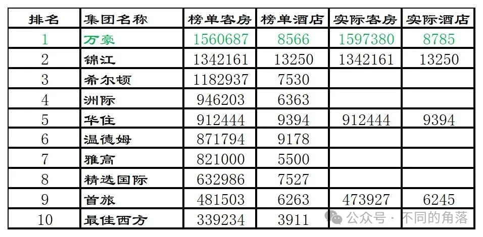

1、万豪连续第九年霸榜老大。万豪旗下自营+租赁经营+委托管理酒店2096家589078间客房；特许经营酒店6563家994354间客房；分时度假酒店93家22745间客房，游轮1轮149间客房。

部分品牌数量如下：丽思卡尔顿119家（包括5家丽思卡尔顿隐世）、瑞吉58家、豪华精选113家、艾迪逊19家、宝格丽9家、W酒店71家、JW万豪121家，万豪587家、喜来登436家、威斯汀243家、傲途格304家、万丽175家、艾美119家、臻品之选118家、设计酒店联盟111家、德尔塔135家、万怡1312家、福朋喜来登309家、源宿99家、AC酒店236家、雅乐轩232家、万枫1290家、Moxy酒店138家。

2、锦江继续排名第二位，锦江旗下开业酒店13250家。此锦江为锦江国际集团，旗下包括其全资持股的上海锦江资本有限公司旗下上海锦江国际酒店股份有限公司和美洲外其它海外丽笙酒店（美洲丽笙600多家酒店2022年时已被精选国际收购）。国内60强排名统计的是上海锦江国际酒店股份有限公司，不包括美洲外其它海外丽笙酒店。

部分品牌数量如下：J酒店1家、昆仑2家、锦江49家、锦江都城206家、麗枫1199家、希岸616家、喆啡526家、非繁系列341家、潮漫161家、维也纳国际1094家、维也纳1426家、维也纳智好251家、维也纳3好430家、凯里亚德（国内）230家、康铂（国内）82家、白云兰337家、锦江之星932家、7天系列1944家、IU451家、派481家，特许经营的希尔顿旗下品牌希尔顿欢朋341家。

[锦江高星开业酒店统计2023版](http://mp.weixin.qq.com/s?__biz=MzU4OTczMzkwNw==&mid=2247514395&idx=1&sn=99d521abe7b2576f4e84ec7764acc643&chksm=fdcbf067cabc7971c2ae931e602e51e51159cd4e336e63ef845657837eaf614364b6193737a7&scene=21#wechat_redirect)

3、希尔顿继续排名第三位。

部分品牌数量如下：华尔道夫35家、LXR酒店13家、康莱德47家、嘉悦里40家、希尔顿西嘉3家、希尔顿613家、格芮161家、希尔顿逸林677家，希尔顿花园1010家、希尔顿欢朋2971家、希尔顿惠庭652家。

4、洲际继续排名第四位，与前三强差距越来越大。

部分品牌数量如下：六善25家、丽晶10家、洲际222家、金普顿78家、英迪格153家、皇冠假日408家、华邑20家、逸衡26家，假日1202家、智选假日3171家，合作的伊贝罗斯塔49家。

5、华住排名升至第五位。

华住自营酒店（自有物业+租赁经营）703家。

各品牌数量：宋品7家、禧玥7家、花间堂63家、美仑国际+美仑90家、漫心137家、全季2115家、星程670家、桔子水晶183家、桔子652家、欢阁35家、怡莱404家、汉庭3598家(包含汉庭优佳）、你好269家、海友471家；施柏阁大观9家、施柏阁54家、美仑美奂9家、城际63家、Jaz in the City3家、Zleep16家；特许经营的雅高旗下品牌美爵10家、诺富特23家、美居164家、宜必思尚品105家、宜必思226家；与融创合作的永乐华住旗下永乐半山4家、堇山1家、堇悦1家，其它合作酒店4家。

[华住开业高端酒店统计2023版](http://mp.weixin.qq.com/s?__biz=MzU4OTczMzkwNw==&mid=2247515044&idx=1&sn=20cea47c226544be6be8cbedb39a1436&chksm=fdcbf2d8cabc7bce2a90cd6d4e70a95157cd95b88bf2e00c5271e269b3391296781ffd440b3c&scene=21#wechat_redirect)

5、温德姆排名降至第五位。

6、雅高继续排名第七位。

8、精选国际继续排名第八位。

9、首旅继续排名第九位。首旅开业酒店6245家（去除旗下持股50%合资公司首旅诺金管理的大中华区21家凯宾斯基酒店7733间客房；加上首旅持股40%的安麓旗下3家酒店157间客房），不含首旅集团旗下尚未划归至首旅酒店旗下的北京饭店、北京颐和安缦、北京宝格丽、首北兆龙饭店、北京长富宫饭店、北京长城饭店、北京贵宾楼饭店、北京新世纪饭店、北京亮马河大厦、北京诺富特和平宾馆等酒店；其中国外1家白俄罗斯明斯克北京饭店；首旅自营酒店（自有物业+租赁经营）675家。

各品牌数量：如家1579家、莫泰110家、蓝牌驿居140家、云上四季35家、欣燕都11家、雅客怡家6家、如家商旅770家、如家精选371家、和颐系列151家、艾扉86家、万信系列43家、金牌驿居35家、璞隐34家、Yunik19家、云上四季尚品18家、柏丽艾尚15家、扉缦9家、嘉虹6家、首旅建国68家、首旅南苑19家、首旅京伦12家、建国铂萃6家、安麓3家、诺金3家、华驿系列1236家、云系列（素柏云、睿柏云、派柏云、诗柏云）1409家、如家小镇1家、漫趣乐园2家、管理输出13家，与凯悦合作的中档品牌逸扉35家。

[首旅开业高端酒店统计2023版](http://mp.weixin.qq.com/s?__biz=MzU4OTczMzkwNw==&mid=2247520137&idx=1&sn=b851a6f49f91a3487ab804cb8feed16e&chksm=fdcbc6f5cabc4fe37cfe5062db30c1bd04c641c7ef70d60907527d27b618470700141274e11a&scene=21#wechat_redirect)

10、最佳西方继续排名第十位。

**2023年度全球酒店集团11-20强****排名：**

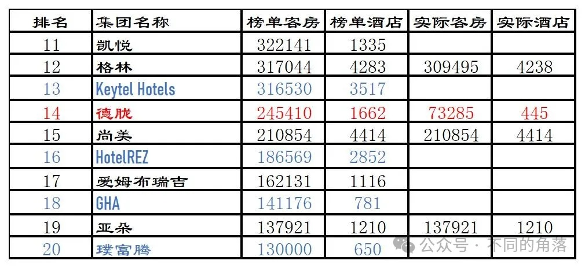

1、凯悦继续排名第11位。

2、格林开业酒店4238家，都是格林旗下品牌酒店，不含格林投资的雅阁和逸柏旗下品牌酒店。格林自营酒店（租赁经营）61家。

各品牌数量：雪上1家、格林东方222家、无眠7家、格美71家、格雅71家、格菲92家、格林豪泰2220家、格林联盟+格盟568家、格林公寓20家、青皮树110家、贝壳789家、格丽+格林电竞+格林客栈67家。

3、2021年全球酒店联盟排名第一位的Keytel Hotels排名第13位。

4、开元已成为德胧旗下公司，德胧旗下酒店包括开元旗下441家酒店（部分酒店2023年底时可以在百达屋平台查询到但不能预订，其中多家已退出开元，实际应该是330家左右）和百达屋旗下4家酒店。2023年德胧与印尼酒店管理投资控股平台Indies Hospitality Investments（IHI）达成战略合作，IHI旗下ARTOTEL（2023年底108家10474间客房排名第116位）与Swiss-Belhotel International Indonesia（约105家酒店14500间客房，2020年底93家酒店14257间客房排名第104位）加一起也才210多家酒店约25000间客房，就算将其算做德胧旗下酒店也距榜单数据相差甚远。德胧实际排名大约在第30位。

[开元开业酒店统计2023版](http://mp.weixin.qq.com/s?__biz=MzU4OTczMzkwNw==&mid=2247506511&idx=1&sn=725020b4345674f1173666cfaf289de4&chksm=fdcb9333cabc1a253dae21d0e1093a8d6e4199f26fdeb652424723284442e5f03ec08e9983f4&scene=21#wechat_redirect)

5、东呈仍未参与2023年度《Hotels》排名，尚美再次没有虚报排名第15位，实际排名第14位。

6、2021年度全球酒店联盟排名第三位的HotelREZ排名第16位。

7、第三方酒店管理公司爱姆布瑞吉排名降至第13位。

8、2021年度全球酒店联盟排名第五位的GHA排名第18位。

9、亚朵终于上榜，排名第19位。

10、2021年度排名全球酒店联盟第四位的璞富腾排名第20位。

**2023年度全球酒店集团21-60强排名：**

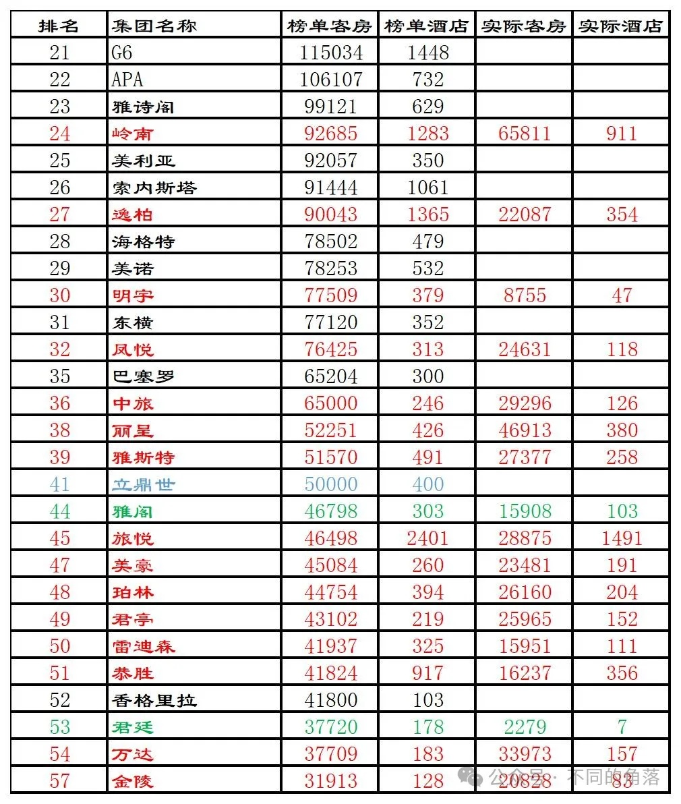

1、岭南2023年收购都市酒店集团（旗下开业800多家经济酒店）后上榜排名第24位，实际排名30名后。

2、逸柏官方平台我只查询到开业酒店354家。2024年1月初逸柏与格林闹掰重启单独会员计划时，曾多次发文宣称旗下酒店近8000家约500000客房。

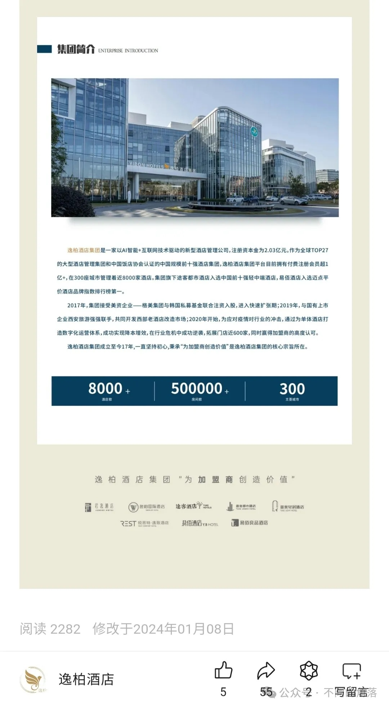

3、美诺排名降至第29位，去掉吹牛13上位的德胧、岭南、逸柏，美诺实际排名还是第26位，美诺旗下酒店除沈阳诺瀚外其它全部酒店都可以在GHA平台预订。

4、明宇国内开业酒店45家，国外开业酒店2家，反正吹牛不用上税，就算加上明宇收购52%股权的绿地50多家酒店，也才100家出头。明宇实际排名第120位后。

[明宇开业酒店统计2023版](http://mp.weixin.qq.com/s?__biz=MzU4OTczMzkwNw==&mid=2247507269&idx=1&sn=69e0e961c753d7d39ceb8fd7e391c9f6&chksm=fdcb9439cabc1d2fc7e8c52604d5fac49a6bd99093dd12f1d30641c4d5c48b6c941535b3dde2&scene=21#wechat_redirect)

4、凤悦开业酒店118家，其中凤悦旗下自有品牌66家，特许经营的希尔顿旗下进驻国内最低端品牌希尔顿惠庭51家，与美诺合资的凤悦美诺公司管理美诺旗下高端品牌诺瀚1家。

[凤悦开业酒店统计2023版](http://mp.weixin.qq.com/s?__biz=MzU4OTczMzkwNw==&mid=2247507068&idx=1&sn=92ee7d35b6bbc34040fbe623d1a30d05&chksm=fdcb9500cabc1c16f9ecdc68aea8291940ec290a214b042c3e734efae778b7043d9d59b84df8&scene=21#wechat_redirect)

5、中旅开业酒店126家，旗下中旅旗下自有品牌酒店59家。

6、丽呈开业酒店380家。

[丽呈开业酒店统计2023版](http://mp.weixin.qq.com/s?__biz=MzU4OTczMzkwNw==&mid=2247506670&idx=1&sn=c73541304c7c8ba7228970af23534022&chksm=fdcb9392cabc1a846b1dfee9973d3828e06929293ec608eabc624dd2d0b2f3c07d420a1e90ea&scene=21#wechat_redirect)

7、雅斯特官方平台只查询到开业酒店258家。

8、2021年度排名全球酒店联盟第八位的立鼎世排名第41位。

9、雅阁全球开业酒店103家，国内53家。

[雅阁国内开业酒店统计2023版](http://mp.weixin.qq.com/s?__biz=MzU4OTczMzkwNw==&mid=2247514736&idx=1&sn=ec5f9817d92ce5490c8b0a73a9ec15d2&chksm=fdcbf30ccabc7a1ab55fecd861369dcab4d8525cd43d56a5277125690b8da324af10731bd93c&scene=21#wechat_redirect)

10、旅悦官方平台只查询到开业酒店1491家。OTA平台有一些旅悦旗下品牌酒店，打电话咨询都是告知已退出旅悦。

11、美豪开业酒店191家。

[美豪开业酒店统计2023版](http://mp.weixin.qq.com/s?__biz=MzU4OTczMzkwNw==&mid=2247509203&idx=1&sn=406ffc534cc5b9efe8a8caca806fcc8c&chksm=fdcbedafcabc64b974a9a13aac7a226fb680d969b0b51f7b4f55954e1e4224b28b1a184d0f3e&scene=21#wechat_redirect)

12、艺龙会平台只查询到珀林开业酒店204家。

13、君亭开业酒店152家，旗下君亭、君澜、景澜三个版块都是单独运营。

[君亭开业酒店统计2023版](http://mp.weixin.qq.com/s?__biz=MzU4OTczMzkwNw==&mid=2247507495&idx=1&sn=c72d84cb644846100d926c26b6d0940a&chksm=fdcb975bcabc1e4d686cd70aa6ab1c4b78320a8dc1bf3025a488b7520fa656db597103730322&scene=21#wechat_redirect)

14、雷迪森国内开业酒店110家，国外日本开业酒店1家28间客房。

[雷迪森开业酒店统计2023版](http://mp.weixin.qq.com/s?__biz=MzU4OTczMzkwNw==&mid=2247509703&idx=1&sn=0ca5bce7b2a88c989e2aefb6bcdf1d90&chksm=fdcbefbbcabc66adfc738299ac519aabf223afba9cbc887c6787dbcc99bac16f3658f23f560b&scene=21#wechat_redirect)

15、恭胜官方平台只查询到开业酒店356家。

16、香格里拉全球开业酒店103家。

[香格里拉开业酒店统计2023版](http://mp.weixin.qq.com/s?__biz=MzU4OTczMzkwNw==&mid=2247510521&idx=1&sn=b890ac100b925bf4f764850342b416b4&chksm=fdcbe085cabc69933953ca64d9f1020d97f21685d80b9715f971f5c27aec3cb3c5fb18d3a0cc&scene=21#wechat_redirect)

17、君廷只查询到国内开业酒店7家，未查询到其国外开业酒店。

18、万达开业酒店157家，国内156家，国外土耳其1家447间客房。

各品牌数量：万达瑞华4家、万达文华18家、万达嘉华44家、万达锦华11家、万达颐华4家、万达美华23家、万达悦华11家、其它7家。

[万达开业酒店统计2023版](http://mp.weixin.qq.com/s?__biz=MzU4OTczMzkwNw==&mid=2247506840&idx=1&sn=c32b2793fc027b1707b30e467567dba7&chksm=fdcb92e4cabc1bf27924e536417b9151b48d4a47011aa5a72b9312ac891df59c773070e61e8b&scene=21#wechat_redirect)

19、金陵开业酒店83家。

[金陵开业酒店统计2023版](http://mp.weixin.qq.com/s?__biz=MzU4OTczMzkwNw==&mid=2247508580&idx=1&sn=fe721a971a134095182b12977c71de12&chksm=fdcbeb18cabc620ed146749f2b6373aef496bda0aebf6c0704f9befd8c2e37c03b2f7595f095&scene=21#wechat_redirect)

**2023年度全球酒店集团61-100强排名：**

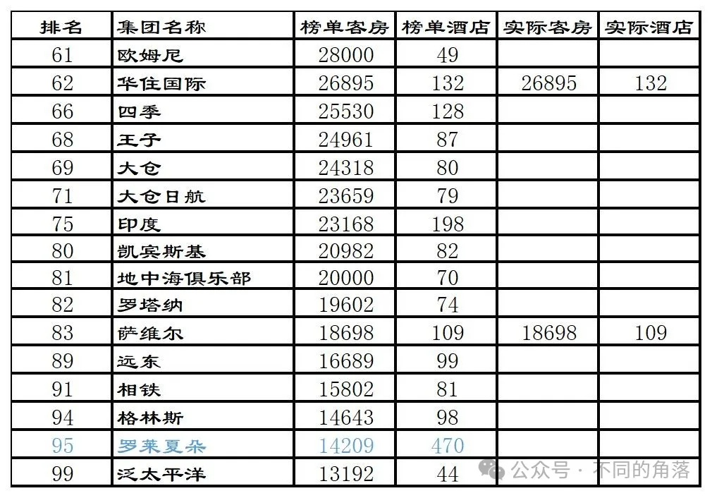

1、华住将收购的德意志酒店集团更名为华住国际，不靠谱的《Hotels》又将其单独上榜。

2、不靠谱的《Hotels》将大仓饭店集团与大仓饭店集团旗下大仓日航酒店管理公司分别排名第69位和第71位。大仓饭店集团旗下全部酒店就是大仓日航酒店管理公司旗下全部酒店，大仓日航酒店管理公司管理运营大仓酒店与度假村、日航酒店国际连锁、日航都市酒店。

3、凯宾斯基排名第80位，凯宾斯基全部酒店都可以在GHA平台预订，凯宾斯基是GHA酒店联盟的发起人。

4、2021年度排名全球酒店联盟18位的罗莱夏朵排名第95位。

**2023年度全球酒店集团101-150强排名：**

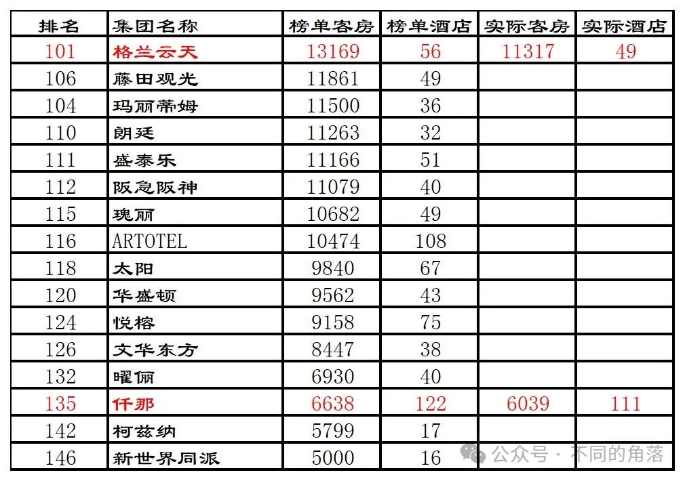

1、格兰云天国内开业酒店48家，国外埃塞俄比亚1家酒店373间客房。

[格兰云天开业酒店统计2023版](http://mp.weixin.qq.com/s?__biz=MzU4OTczMzkwNw==&mid=2247513181&idx=1&sn=32a224decdc9ddcfe6f354fae77cd0e2&chksm=fdcbfd21cabc7437a95d31c6139bbe996c5a6bcfef7239fa363886053772486633a3598a8b4c&scene=21#wechat_redirect)

2、不靠谱的《Hotels》将瑰丽酒店集团与瑰丽酒店集团旗下新世界同派酒店分别排名上榜。

3、仟那官方平台只查询到开业酒店111家。

4、柯兹纳全球开业酒店17家，国内只有一家酒店，复星旅文特许经营的三亚亚特兰蒂斯酒店。

**2023年度全球酒店集团151-221强排名：**

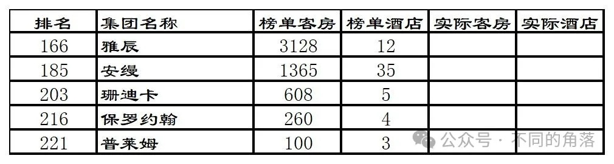

1、由于众多酒店集团/联盟未参与统计，旗下只有35家酒店1300多间客房的精品五星酒店第一品牌安缦得以再次上榜排名第35位。

**《Hotels》2023年全球酒店集团221强**原榜单如下：

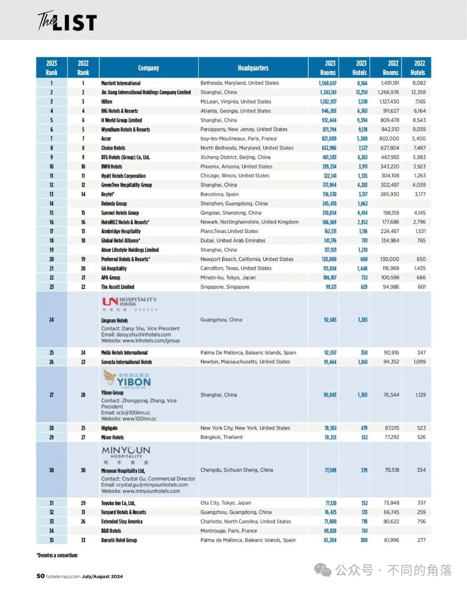

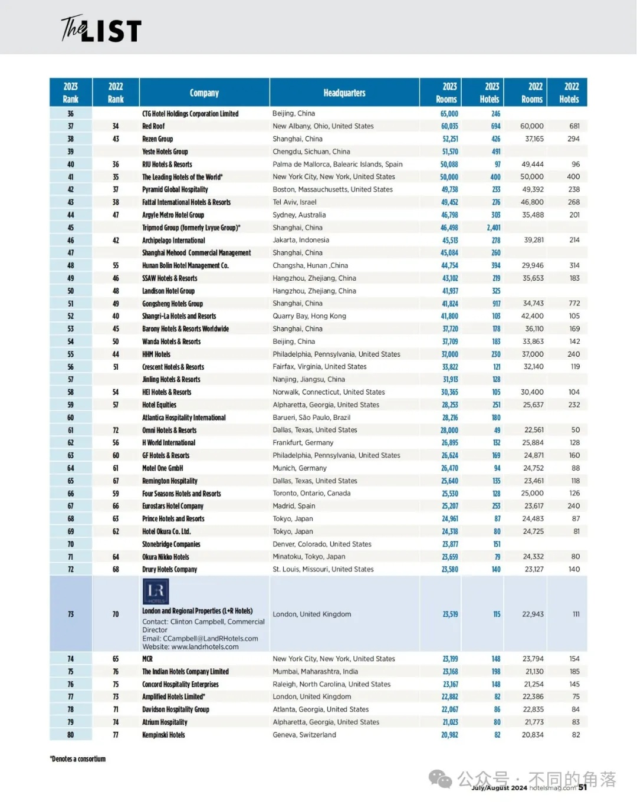

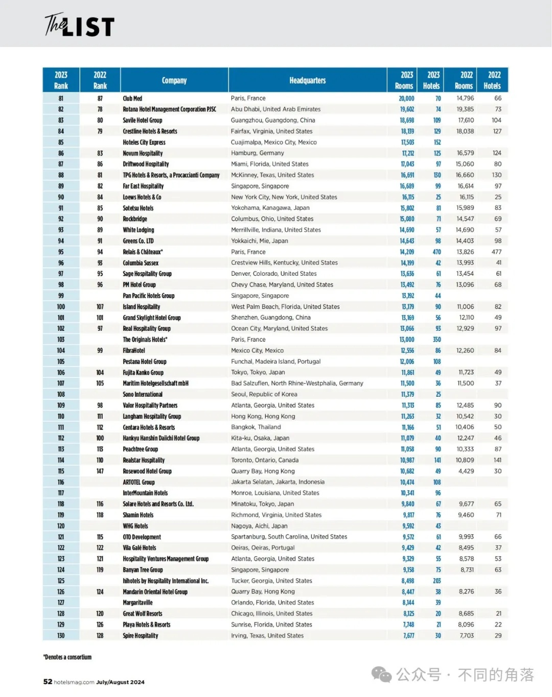

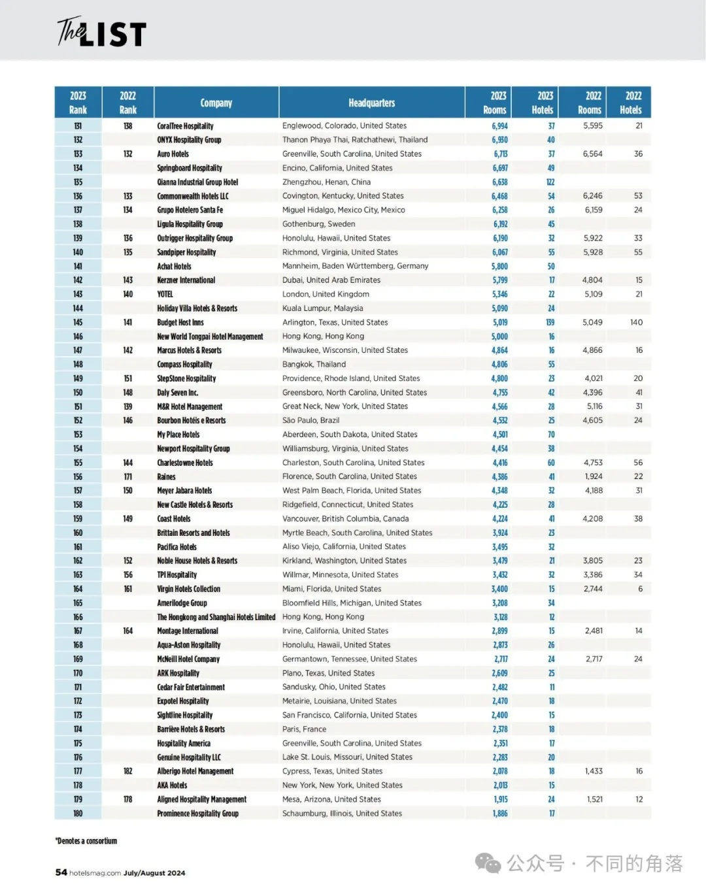

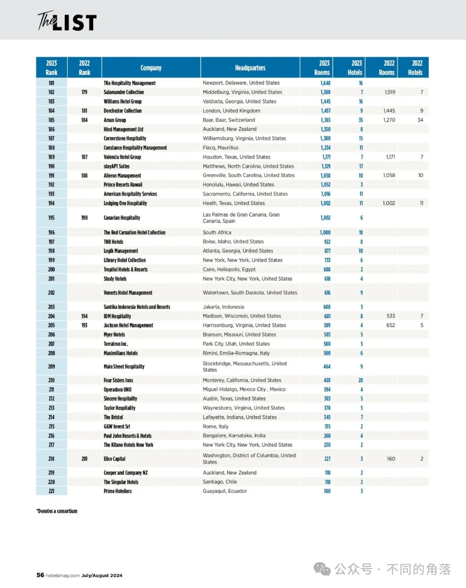

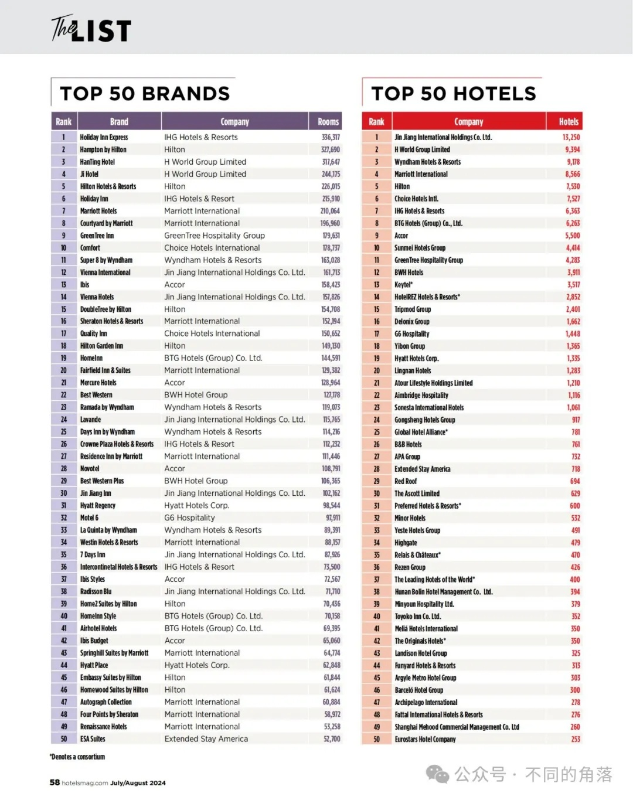

更多的年度酒店排行、国内酒店统计、酒店常识、酒店行业资讯、酒店集团、航空常识、沈阳旅游、沙发客、打油诗等相关内容可以到我的微信公众号里查看。

也欢迎大家关注我的微信公众号：**sfk024**

公众号名称：**不同的角落**

在微信公众号搜索sfk024或是不同的角落都可以搜索到，也可以直接扫码或长按识别下方二维码关注。

