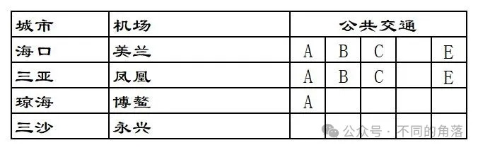
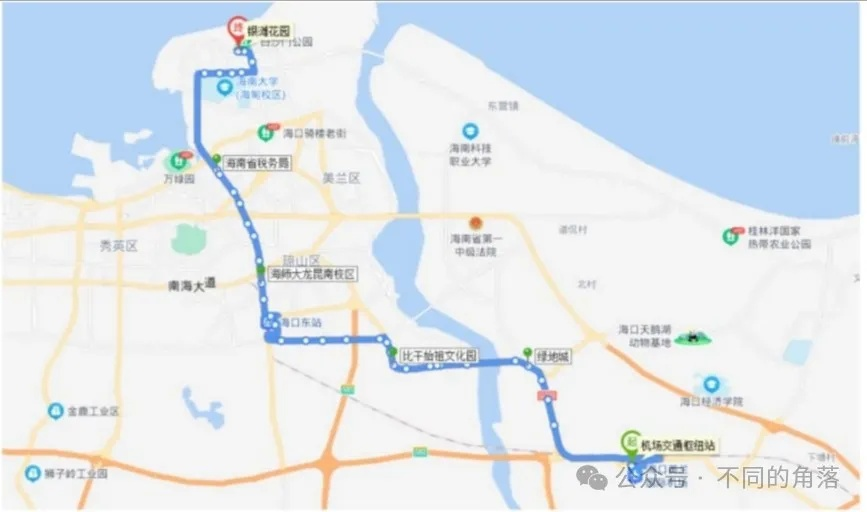
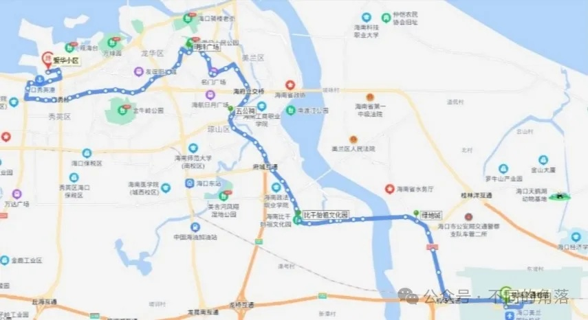
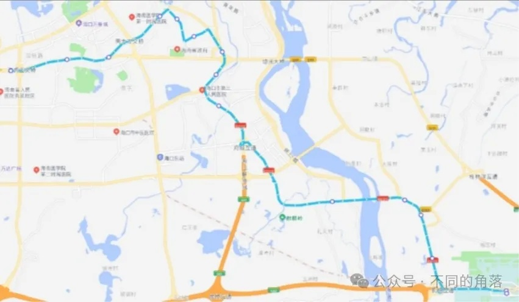
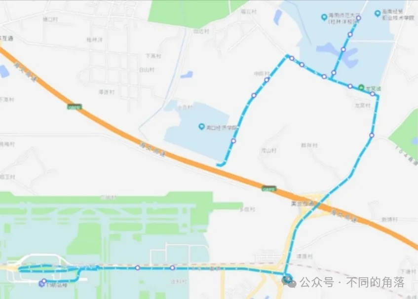
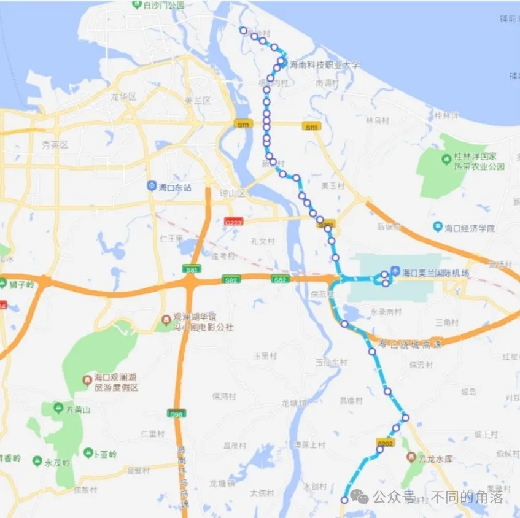
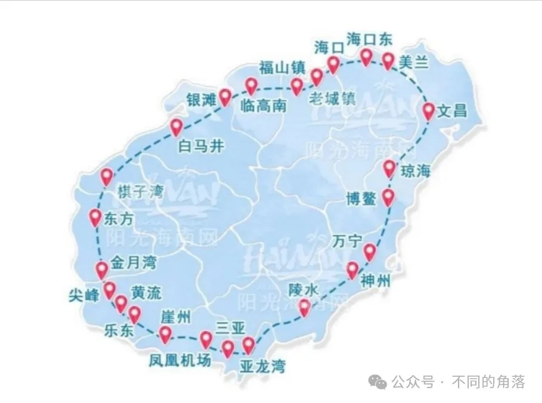
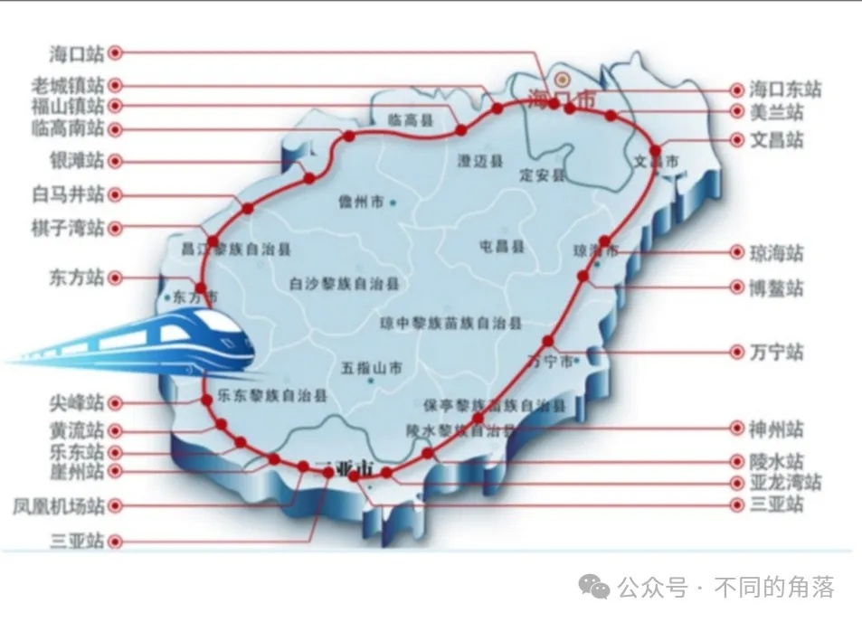

# 航空常识之五国内城市机场交通海南篇

> 本文转载自微信公众号 **不同的角落**，已获作者授权。  
> 原文发布于 2024年8月8日 18:28  
> 原文链接：[mp.weixin.qq.com](https://mp.weixin.qq.com/s?__biz=MzU4OTczMzkwNw==&mid=2247526801&idx=1&sn=8870a982773c64626f5e70910709fe1c)

---

听从各位朋友们的建议，分直辖市/省/自治区单独发帖，多个省份机场交通放在一篇文章中查找是不方便。

并分别设置关键词自动回复，本文关键词“海南交通”，公众号发送“海南交通”即可看到。

A——市区机场巴士，市区/县城城区机场巴士。部分机场巴士可刷公交卡，部分机场巴士支持交通联合一卡通、支付宝乘车码、微信乘车码、银联乘车码、银行卡闪付等方式乘车。

B——机场公交，经停多个站点，大都可刷公交卡，很多城市机场公交支持交通联合一卡通、支付宝乘车码、微信乘车码、银联乘车码、银行卡闪付等方式乘车。

部分城市机场巴士与机场公交专线无区分，随意划分到A或B。

C——城际班车，包括城际/省际机场巴士、长途汽车、定制专线等，以及县城机场发往县城周边班车。

D——城市轨道交通，包括地铁、轻轨、跨座式单轨、市域快轨、磁浮系统、有轨电车等。

E——铁路交通，C/D/G开头的动车组旅客列车，可以在铁路12306查询购票。

除了A、B、C、D、E这五类公共交通外，各机场都有出租车，少数机场有网约车。

另很多机场周边酒店会提供免费接送机服务，少数距离机场较远的酒店也提供免费接送机服务。上海浦东机场周边多家距离10公里以上的酒店提供免费接送机服务，贵阳一家距离机场30多公里远的亚朵酒店提供免费接送机服务。

极少数机场官方微信公众号才可以查询到正确的机场公共交通！！！

极少数机场客服电话工作人员才能告知准确的机场交通！！！

另外不建议到航旅纵横/机场行/飞常准/航班管家四款航服APP查询机场交通信息，这四款航服APP上机场交通信息基本都是几年之前的信息，错误太多，并且大多数机场交通信息为零。

本文各机场公共交通时间都是2024年夏秋季运营时间。

各地机场地铁、公交线路大都只写首末站和中途经停主要站（火车站、汽车站），各城市地铁/公交经停站、时间、票价、详细站点等信息请自行百度/高德/腾讯地图查询（仅供参考，百度、高德、腾讯有时不准确）或是拨打当地地铁/公交公司电话咨询。

受不确定因素（包括但不限于大雨、大雪、沙尘暴、雾霾等天气因素）影响，部分城市机场巴士/机场公交/城市轨道交通线路、站点、时刻、票价可能会发生变动调整，相关信息以各机场当天实际情况为准。

**关于更新**：各机场公共交通有变动时争取同步更新，更新不一定群发通知，在公众号发送“海南交通”就可以看到自动回复的最新内容。

**本次更新如下**：

1、海口美兰机场巴士三号线运营时间延长。

2、2024年8月1日起，开通定安县汽车站至海口美兰机场定制客运专线。

3、2024年7月1日起，开通澄迈金江至海口美兰机场专线。

4、2024年7月15日起，开通保亭至三亚凤凰机场专线，初期每天5班，目前减至每天2班，估计再过段时间会只剩一班。

5、海口美兰机场↔屯昌班车加密。

6、开通五指山站至海口美兰机场定制客运专线。

**特别提示：**

各地机场巴士咨询电话，手机号码大都为调度、司机、售票员**个人手机号码**，未标注问询时间的，**请于当地上班时间时段内拨打**，**谢谢**！！！

新疆地区大都10:00上班，14:00-16:00为午休时间。

新疆各地有机场巴士的支线机场，机场巴士（非6座8座商务车）大都根据外地进出疆航班时间以及乌鲁木齐到发航班时间安排发车，很少为疆内支线航班单独安排发车。

疆内各地支线机场间航班大都是小飞机执飞旅客大多数时候都不多，我乘坐过的疆内支线航班10位旅客、11位旅客的情况都遇到过，还有一次在一个支线机场，当天只有我一位出港旅客。

个人精力有限，如有差错纰漏烦请各位指正！！！

**1、海口美兰机场**

**A**：市区机场巴士目前有**一号线**、**二号线**、**三号线**。

一号线/二号线是大巴票价20元，三号线是商务车票价30元，三号线可到小区门口接送。

可以在“海汽客运”微信公众号或“海汽e行”微信公众号查询购票。机场发往市区选择综合出行→美兰机场巴士(海汽e行)/买车票→机场巴士(海汽客运)。

咨询电话：0898-66668855。

咨询电话：13098988001。

**机场巴士一号线**

美兰机场→下坎公交站→琼山一小公交站→五公祠公交站→省林业局公交站→省琼剧院公交站→海口鑫源温泉大酒店，

发车时间：7:40-次日2:10，半小时一班。

海口鑫源温泉大酒店→海南银行(国宾大厦)→昌茂花园→金霖花园→琼山侨中(绿色佳园)→美兰机场，

发车时间：6:30-21:30，半小时一班。

备注：鑫源温泉大酒店→美兰机场购票需要选择综合出行-汽车票(海汽e行)/买车票→汽车票(海汽客运)，然后出发站和到达站都选择“美兰机场巴士站”才能查询到海口鑫源温泉大酒店发往机场班车信息，中间站上车买票。

**机场巴士二号线**

美兰机场→海口汽车总站→高登西路公交站→原海口汽车南站→海南职业技术学院公交站→海口汽车西站，

发车时间：8:30-次日0:30，每小时一班。

海口汽车西站→美兰机场，

发车时间：7:00-21:00，每小时一班。

海口汽车总站→美兰机场，

发车时间：8:50-18:50，每小时一班。

备注：汽车西站→美兰机场/汽车总站→美兰机场汽车购票需要选择综合出行-汽车票(海汽e行)/买车票→汽车票（海汽客运）才能查询到。

**机场巴士三号线**

美兰机场→七彩澜湾→枫林晚S酒店(盈滨路口)→恒大御景湾→四季康城二期→老城镇政府公交站→蓝海钧华酒店，

发车时间:11:00-23:00，90分钟一班。

蓝海钧华酒店→老城镇政府公交站→四季康城二期→恒大御景湾→枫林晚S酒店(盈滨路口)→七彩澜湾→美兰机场，

发车时间:11:00-21:30，90分钟一班。

**B**：**机场1路、机场2路、机场3路、219路、市郊3路**。

咨询电话：0898-66663066。

乘车地点：

1号航站楼：一楼到达厅对面交通枢纽中心（GTC），

2号航站楼：一楼到达厅3号门外。

**机场1路**，票价1-5元。

机场1号航站楼→机场2号航站楼→银滩花园，

发车时间：6:30-22:00；

银滩花园→机场2号航站楼→机场1号航站楼，

发车时间：6:00-22:00。

**机场2路**，票价1-6元。

机场1号航站楼→机场2号航站楼→金外滩，

发车时间：6:15-22:00；

金外滩→机场2号航站楼→机场1号航站楼，

发车时间：6:00-22:00。

**机场3路**，票价2-10元。

机场1号航站楼→机场2号航站楼→新海港，

发车时间：8:15-22:30；

新海港→机场2号航站楼→机场1号航站楼，

发车时间：6:30-20:30。

**219路**，票价2-5元。

机场1号航站楼→机场2号航站楼→桂林洋海师大东二门，

发车时间：7:30-19:30；

桂林洋海师大东二门→机场2号航站楼→机场1号航站楼，

发车时间：7:00-19:00。

**市郊3路**，票价3-6元。

东和公交场站→机场1号航站楼→机场2号航站楼→南国威尼斯城，

发车时间：7:00-19:00；

南国威尼斯城→机场2号航站楼→机场1号航站楼→东和公交场站，

发车时间：8:30-20:30。

**C：城际班车，**有发往文昌、儋州那大、屯昌、白沙、昌江石碌、五指山、澄迈金江、定安8条线路。节假日有时会加开三亚海棠湾专线。

乘车地点：

1号航站楼：一楼到达厅对面交通枢纽中心（GTC），

2号航站楼：一楼到达厅4号门外。

具体运营时间以客运站当天发布为准，可以在“海汽客运”微信公众号或“海汽e行”微信公众号查询购票。

咨询电话：0898-65687290。

**美兰机场↔文昌**

美兰机场→文昌汽车站，票价20元。

发车时间：10:20、11:20、12:45、15:10。

文昌汽车站→美兰机场，20/22元

发车时间：7:40、8:10、13:10、13:40、14:30。

**美兰机场↔儋州**

美兰机场→儋州那大站，56/60元。

发车时间：8:50-22:00，30分钟至60分钟一班。

儋州那大站→美兰机场，56/60元。

发车时间：6:10-19:00，30分钟至60分钟一班。

美兰机场↔屯昌，票价50元。

美兰机场→屯昌百佳汇超市，

发车时间：8:30-20:00，60分钟至90分钟一班。

屯昌老车站海汽e行驿站→美兰机场，

发车时间：6:00-18:00，60分钟至90分钟一班。

美兰机场↔白沙，票价74元。

美兰机场→白沙汽车站，

发车时间：14:40。

白沙汽车站→美兰机场，

发车时间：8:00。

美兰机场↔昌江，票价57元。

美兰机场→昌江石碌站，

发车时间：8:50。

昌江汽车站→美兰机场，

发车时间：12:50。

美兰机场↔五指山，票价80元。

美兰机场→五指山站，

发车时间：13:30。

五指山站→美兰机场，

发车时间：9:30。

美兰机场↔澄迈金江，票价50元。

咨询电话：13976317686。

美兰机场→澄迈金江汽车站，

发车时间：9:40-21:10，半小时一班。

澄迈金江汽车站→定安县定城镇见龙大道沿途公交站→美兰机场，

发车时间：7:00-19:30，半小时一班。

美兰机场↔定安，票价35元。

美兰机场→定安县汽车站，

发车时间：7:10-22:10，每小时一班。

定安汽车站海汽e行驿站→定安县定城镇见龙大道沿途公交站→美兰机场，

发车时间：6:00-21:00，每小时一班。

**节假日三亚海棠湾专线**

咨询电话:0898-88252656。

海棠湾海昌不夜城游客中心→美兰机场，

票价120元，商务车。

节假日有时会开行，可以在“海汽客运”微信公众号或“海汽e行”微信公众号查询购票。

**E：美兰机场城际/市域铁路**，海南环岛高铁东环线美兰站位于美兰国际机场1号航站楼、2号航站楼负1层，1号航站楼、2号航站楼步行至高铁站直线距离约400米，步行5分钟。

**东环线** 海口东站—美兰站(美兰机场乘车站点)—文昌站—琼海站—博鳌站—万宁站—神州站—陵水站—亚龙湾站—三亚站。

**市域列车** 美兰站(美兰机场乘车站点)—海口东站—城西站—秀英站—长流站—海口站。

详细运营时间和票价可以到铁路12306官网/APP查询。

**2、三亚凤凰机场**

**A**：市区机场巴士亚龙湾和海棠湾两条线路，单程票价都是25元。

咨询电话：19989002950。

**凤凰机场↔亚龙湾**

凤凰机场→(海虹路)三亚国光豪生度假酒店→(三亚湾路)海月广场→(新风路)中国光大银行→(解放路)汽车总站→(榆亚路)三亚市委→(榆亚路)大东海→(榆亚路)红沙社区→(榆亚路)吉阳镇→(海榆东线)亚龙湾路口→亚龙湾各酒店，

发车时间：9:00-次日2:00，每小时一班。

亚龙湾各酒店→(田独路)亚龙湾高铁站→(线绕城高速路)凤凰机场，

发车时间：11:00-22:00，每小时一班。

**凤凰机场↔海棠湾**

凤凰机场→(水蛟路)凤凰机场高速互通→(海南环岛高速)海棠湾(林旺)互通→海棠湾301医院→海棠湾各酒店→海棠区旅客集散中心(海昌不夜城)→海棠湾三亚国际免税城，

发车时间：10:00-22:00，每90分钟一班。

海棠湾各酒店→海棠湾三亚国际免税城→海棠区旅客集散中心(海昌不夜城)→海棠湾301医院→(海南环岛高速)海棠湾(林旺)互通→(线绕城高速路)凤凰机场，

发车时间：12:00-19:30，每90分钟一班。

**节假日海棠湾专线**

咨询电话:0898-88252656。

海棠湾海昌不夜城游客中心→凤凰机场，

票价大巴25元，商务车40元。

节假日有时会开行，可以在“海汽客运”微信公众号或“海汽e行”微信公众号查询购票。

**B**：**公交8路、24路、27路、33路、36路、D9路、D25路**。

咨询电话：0898-96789。

**公交8路**，票价2-5元。

凤凰机场→汽车总站→香港百货广场，

发车时间：6:54-23:25；

香港百货广场→汽车总站→凤凰机场，

发车时间：6:00-22:30。

**公交24路**，票价2-8元。

凤凰机场→亚龙湾公交枢纽站，

发车时间：7:25-19:50；

亚龙湾公交枢纽站→凤凰机场，

发车时间：7:00-18:00。

**公交27路**，票价2-10元。

凤凰机场→亚龙湾火车站→亚龙湾公交枢纽站，

发车时间：7:30-19:50；

亚龙湾公交枢纽站→亚龙湾火车站→凤凰机场，

发车时间：7:00-18:00。

**公交33路**，票价2-16元。

凤凰机场→三亚火车站→南田农场，

发车时间：9:00-17:30；

南田农场→三亚火车站→凤凰机场，

发车时间：7:00-15:30。

**公交36路**，票价1-5元。

凤凰机场→三亚火车站→红沙中学，

发车时间：7:00-20:30；

红沙中学→三亚火车站→凤凰机场，

发车时间：7:00-20:30。

**公交D9路**，票价6元。

三亚火车站→凤凰机场→崖州湾壹号，

发车时间：5:40-19:40；

崖州湾壹号→凤凰机场→三亚火车站，

发车时间：7:00-21:00。

**公交D25路**，票价2-15元。

三亚火车站→凤凰机场→梅联社区，

发车时间：7:00-18:30；

梅联社区→凤凰机场→三亚火车站，

发车时间：7:00-18:30。

**C：城际班车，**有发往保亭专线。

具体运营时间以客运站当天发布为准，可以在“海汽客运”微信公众号或“海汽e行”微信公众号查询购票。

咨询电话：0898-83662623。

**凤凰机场↔保亭**，票价45元。

凤凰机场→保亭汽车站，

发车时间：11:30、17:30。

保亭汽车站→凤凰机场，

发车时间：9:00、14:30。

**E：凤凰机场城际铁路**，海南环岛高铁西环线凤凰机场站与凤凰机场候机楼送客平台相连， T1航站楼西侧为主要入口。

**西环线** 海口站—老城镇站—福山镇站—临高南站—银滩站—白马井站—棋子湾站—东方站—尖峰站—黄流站—乐东站—崖州站—凤凰机场站—三亚站。

详细运营时间和票价可以到铁路12306官网/APP查询。

**3、琼海博鳌机场**

**A**：市区机场巴士潭门老码头公交站和琼海高铁站两条线路。

咨询电话：18889190897。

**博鳌机场↔潭门老码头公交站**

博鳌机场→博鳌动车站→博鳌东屿岛旅游度假区旅客中心→博鳌镇医院→潭门老码头公交站。

发车时间根据航班到港时间，大约航班到港30分钟发车。

博鳌机场—博鳌高铁公交站4元；

博鳌机场—博鳌东屿岛旅游度假区旅客中心10元；

博鳌机场—博鳌镇医院15元；

博鳌机场—潭门镇老码头公交站 20元；

潭门镇老码头→博鳌机场，是否有车看运气。

**博鳌机场↔琼海高铁站**

博鳌机场→琼海高速路口→红色娘子军→琼海高铁站。

发车时间根据航班到港时间，大约航班到港30分钟发车。

博鳌机场—琼海高速路口10元；

博鳌机场—红色娘子军/琼海高铁站 15元。

琼海高铁站→博鳌机场，是否有车看运气。

**C**：**节假日三亚海棠湾专线**

咨询电话:0898-88252656。

海棠湾海昌不夜城游客中心→博鳌机场，

票价90元，商务车。

节假日有时会开行，可以在“海汽客运”微信公众号或“海汽e行”微信公众号查询购票。

**4、三沙永兴机场**

**都无**，目前三沙市不对普通游客开放。

更多的航空常识、酒店常识、酒店行业资讯、酒店集团、沈阳旅游、沙发客等相关内容可以到我的微信公众号里查看。

也欢迎大家关注我的微信公众号：**sfk024**

公众号名称：**不同的角落**

在微信公众号搜索sfk024或是不同的角落都可以搜索到，也可以直接扫码或长按识别下方二维码关注。

