# 国内酒店集团之一锦江2024版

> 本文转载自微信公众号 **不同的角落**，已获作者授权。  
> 原文发布于 2024年8月25日 21:54  
> 原文链接：[mp.weixin.qq.com](https://mp.weixin.qq.com/s?__biz=MzU4OTczMzkwNw==&mid=2247530974&idx=1&sn=f60552db1b496639acda9eb1d66288f3&scene=21)

---

本文关键词“锦江”，公众号发送“锦江”就可看到。

**锦江一本书**：《我的一个世纪》。

锦江品牌锦江饭店创始人董竹君先生的自传，锦江旗下酒店每个员工都应该好好看看的一本书。

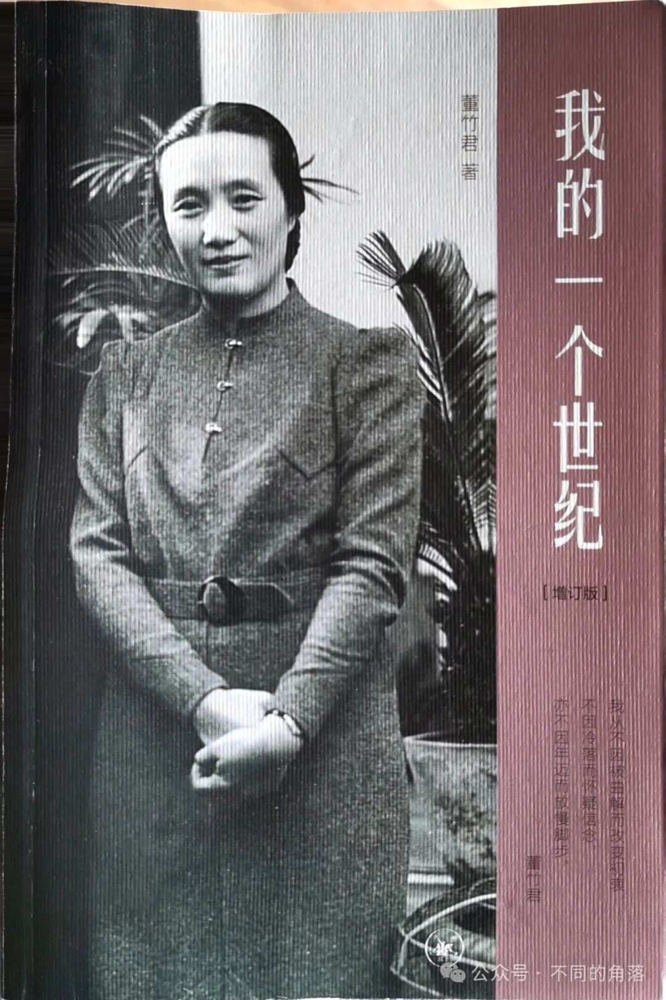

本文中常用词语含义如下：

**锦江**：也就是上海锦江，可能指锦江酒店，也可能指锦江资本(201907前未更名时)，也可能指锦江集团。

**锦江酒店**：上海锦江国际酒店股份有限公司，原名“上海锦江国际酒店发展股份有限公司”(200309-201908)、“上海新亚(集团)股份有限公司”(1994-200309)。

公司控股股东为持股45.05%的锦江资本。

参与2019/2020/2023年度中国饭店集团60强排名统计。

2010年5月31日前，公司主营业务为酒店投资营运、星级酒店管理(锦江品牌全服务酒店)和连锁餐饮投资。

2010年5月31日起，公司主营业务变更为经济性酒店业务(锦江之星、百时快捷品牌经济酒店)和连锁餐饮投资。

2013年3月起，主营业务变更为有限服务酒店业务（当时为中档品牌锦江都城和经济品牌锦江之星、金广快捷、百时快捷，后续又包括收购的法国卢浮集团、铂涛集团、维也纳集团旗下有限服务酒店品牌，以及锦江集团收购的丽笙集团旗下丽亭（不含北京2家丽笙酒店中国区管理的全服务丽亭酒店）、丽芮、丽柏、丽怡等有限服务酒店品牌国内业务）和连锁餐饮投资。

2023年底完成收购锦江酒管后，主营业务变更为全服务酒店业务（J酒店、岩花园、昆仑、锦江品牌，丽笙精选、丽笙、丽祺品牌中国区域和2家原丽笙酒店中国区管理的全服务丽亭酒店）、有限服务酒店业务和连锁餐饮投资。

**锦江资本**：上海锦江资本有限公司，原名上海锦江资本股份有限公司(201907-202209)、上海锦江国际酒店(集团)股份有限公司(200612-201907)。

公司股东为持股100%的锦江集团。

参与2013-2018年度中国饭店集团60强排名统计。

参与2013-2017年度全球酒店集团325强排名统计。

旗下控股“锦江酒店”(600754，900934)、“锦江投资”(600650，900914)、“锦江旅游”(900929)3家上市公司。

**锦江集团**：锦江国际(集团)有限公司，上海国资委全资控股。

参与2021/2022年度中国饭店集团60强排名统计。

参与2018-2023年度全球酒店集团325/225/200/221强排名统计。

锦江集团拥有酒店、旅游、客运三大核心主业和地产、实业、金融等相关产业及基础产业。

旗下直接控股“锦江资本”(2006HK，股票原名锦江酒店)，间接控股“锦江酒店”(600754，900934，股票原名锦江股份)、“锦江投资”(600650，900914)、“锦江旅游”(900929)3家上市公司。

拥有上海国旅国际旅行社有限公司、上海锦江旅游有限公司、上海旅行社有限公司等3家国际G、国内旅行社和“锦江汽车”7500辆中、高档客车；合资经营上海及江浙部分地区“麦德龙”、“肯德基”、“新亚大包”、“吉野家”等著名品牌；合资组建锦江国际HRG商务旅行有限公司、锦江国际理诺士酒店管理学院、锦江国际JTB会展有限公司、锦江德尔互动有限公司等。

锦江集团当初还出资参股与其它单位共同组建了国内第一家非民航总局直属的地方航空公司—上海航空(锦江为第三大股东，后上海航空2010年被东方航空整体合并)。

2018年收购丽笙酒店集团，2022年丽笙酒店集团美洲区业务被美国精选国际酒店集团收购。

**锦江酒管**：锦江国际酒店管理有限公司，公司原股东为持股100%的锦江资本，2023年底股东变更为持股100%的锦江酒店。

主营业务为全服务酒店业务(J酒店、岩花园、昆仑、锦江品牌)。

2023年9月与丽笙中国区合作，接管原丽笙酒店中国区运营的丽笙精选、丽笙、丽筠、丽祺品牌以及北京2家全服务丽亭酒店，推出所谓的全新业务架构“锦江丽笙酒店”，其实就是和2018年底推出的“锦江尊享酒店”、2021年底推出的“豪华经典酒店”差不多，只是这次锦江资本没有分拆锦江会员计划（之前两次分拆会员计划后都是一年多又再次合并），锦江丽笙酒店与锦江有限服务酒店共用一个会员计划。

2024年2月又将郁锦香、丽亭2个品牌纳入锦江丽笙酒店体系。目前锦江丽笙酒店体系包括J酒店、岩花园、昆仑、锦江品牌，中国区域丽笙精选、丽笙、丽筠、丽祺、丽亭、郁锦香品牌。

**丽笙集团**：丽笙酒店集团，原名卡尔森瑞德酒店集团，2012年时美国的卡尔森酒店集团与欧洲的瑞德酒店联合成立卡尔森瑞德酒店集团。2016年被海航集团收购，2018年卡尔森瑞德酒店集团更名为丽笙酒店集团，锦江集团从海航处收购丽笙酒店集团。

2021年丽笙酒店集团美洲区业务单独拆分出来，分成丽笙国际和丽笙美洲两部分，2022年丽笙酒店集团美洲区业务(丽笙美洲全部600多家酒店)被美国的精选国际酒店集团收购。丽笙集团旗下还剩下丽笙国际600多家酒店(包括中国区丽笙精选、丽笙、丽筠、丽祺4个品牌和北京2家全服务丽亭酒店)。

目前丽笙集团中国区丽笙精选、丽笙、丽筠、丽祺、丽亭5个品牌由锦江丽笙酒店运营，丽芮、丽柏、丽怡由锦江酒店中国区运营。

**四川锦江**

在四川省成都市、巴中市、达州市、广元市、乐山市、眉山市、南充市、攀枝花市、宜宾市、阿坝州、凉山州等地，也有多家锦江品牌酒店。

四川省内的锦江品牌酒店都是四川省旅游投资集团有限公司旗下四川旅投锦江有限责任公司旗下酒店。创始店是1960年建成开业的四川锦江宾馆，占地面积70亩，素有“花园宾馆”之美誉。安逸酒店集团成立后，四川旅投锦江酒店有限责任公司划归安逸酒店集团。上海锦江和四川锦江曾对锦江品牌商标的归属有过多轮商讨争议，最后国家商标局认定“锦江”不属于专有名词，上海锦江和四川锦江都可以使用。

上海锦江之前在四川自贡有一家锦江品牌酒店，不过早已退出，之后四川省内上海锦江再无锦江品牌酒店开业。而安逸集团旗下锦江品牌酒店至今未出四川，划归安逸酒店集团旗下的北京、上海、广州、深圳四个四个城市四川省属国资酒店，之前都是单体酒店，现在划归安逸后也没有翻牌为锦江品牌。

**杭州锦江**

杭州锦江集团有限公司，成立于1993年，是以环保能源、有色金属、化工为主产业的大型民营企业，集团在浙江、山东等地建设资源综合利用电厂，成为国内拥有垃圾焚烧电厂最多、累计处理垃圾能力最大的企业集团之一。另外旗下在内蒙、新疆、甘肃、河南等地还有多家氧化铝、电解铝产业公司，集团旗下成员企业300多家。集团控股股东钭正刚家族以250亿元财富位居2023年胡润百富榜第205位。

**锦江概述**：

锦江国际(集团)有限公司，是上海市国资委全资控股的中国规模最大的综合酒店旅游企业集团之一。

近些年通过陆续收购卢浮酒店集团、铂涛集团、维也纳酒店集团、丽笙酒店集团，锦江自2015年起国内酒店集团排名由老五跃居至老大并保持至今；自2018年起全球酒店集团排名由老五跃居至老二并保持至今。

不过锦江只是在酒店客房数量上排名国内老大全球老二；在年营收、年利润、市值等指标排名连全球前十都进不去，在国内也是被华住吊打；至于全球每间可售客房收入(RevPAR)、已售客房平均房价(ADR)、客房入住率(OCC)等指标，更是被八大国际酒店集团和国内华住、亚朵等酒店集团碾压。

国内最大酒店集团，同时也是国内最不靠谱的酒店集团。

截至2023年12月31日，锦江旗下全球已开业酒店数量13250家(包括丽笙国际旗下600多家酒店)，客房数量1342161间。

截至2023年12月31日，锦江旗下国内开业酒店数量11273家，客房数量1097997间。

锦江旗下部分品牌数量如下：

J酒店1家、昆仑2家、锦江49家、锦江都城206家、麗枫1199家、希岸616家、喆啡526家、非繁系列341家、潮漫161家、维也纳国际1094家、维也纳1426家、维也纳智好251家、维也纳3好430家、凯里亚德（国内）230家、康铂（国内）82家、白云兰337家、锦江之星932家、7天系列1944家、IU451家、派481家，特许经营的希尔顿旗下品牌希尔顿欢朋341家。Golden Tulip（郁锦香）系列（国内+国外）218家、Kyriad 系列（凯里亚德国外，经济酒店）309家、Campanile（康铂国外，经济酒店）329家、Première Classe（国外经济酒店）229家、Sarovar（印度经济酒店）96家。

**酒店APP**：锦江荟APP，可以预订锦江全球酒店(国内个别丽笙高端酒店未上线)。丽笙集团还有单独的丽笙酒店APP。

**客服电话**：24小时人工接听，两个电话实际相同。

锦江荟：4008209999。

锦江商旅：4008740087。

**品牌由来**：

“锦江”是具有80多年历史的中国民族品牌，中国驰名商标、上海市著名商标，获中国商标金奖，品牌价值超过360亿元，锦江品牌创始人为董竹君先生（女），源自解放前在上海开办的锦江川菜馆和锦江茶室，建国后又在锦江两店基础上开办的锦江饭店。

**发展历程**：

1935年3月，董竹君在旧上海法租界华格臬路（现上海宁海西路）开了一家三层楼的川菜馆-锦江川菜馆，从开业起就一直门庭若市，包括杜月笙、黄金荣、张啸林等都是常客，后杜月笙因每次来吃饭都要等候多时才能就座极为不满，提议让店面扩充，董竹君又租下旁边店面扩大了几倍经营面积。

1936年又在锦江川菜馆旁开起了锦江茶室，同样宾客盈门。

1951年，上海市政府拟在上海设立招待高级干部与外宾的食宿场所，时任上海市长陈毅、副市长潘汉年等认为锦江名声饮誉海内外，董竹君声誉和能力也都得到大家认可，就派人与董竹君商议希望她能挑头开办一家有一定规模的大型饭店，董竹君欣然应允。经商定将锦江川菜馆与锦江茶室两店的所有设备与人员，迁移至长乐路189号（现为长乐路175号）华懋公寓（锦江饭店锦北楼）；所有资产由政府以三亿元（旧币）盘下；新的饭店沿用“锦江”牌子，名“锦江饭店”，店徽仍是竹叶；由董竹君出任锦江饭店董事长。

1951年6月9日，锦江饭店正式挂牌开业，上海第一家国宾馆诞生，董竹君任董事长兼经理，任百尊、宣铎、应竞任副经理。

1953年秋，董竹君被排挤退居二线离开锦江饭店，改任锦江饭店空头董事长兼顾问，任百尊成为锦江实际管理者。

1957年，上海市政府将锦江饭店南侧的茂名公寓（原格林文纳公寓，也叫高纳公寓，又名峻岭寄庐）划归锦江饭店，成为锦江饭店贵宾楼和峻岭楼。

1959年，在锦北楼和贵宾楼之间用21天时间建起了锦江小礼堂。

1960年，上海市政府将原法国总会大楼（今花园饭店老楼）划归锦江饭店营业。

1964年，在锦江饭店贵宾楼南侧兴建锦江饭店锦楠楼。

1965年，锦江饭店新南楼（现锦楠楼）建成营业。

1984年，以原属上海市政府机关事务管理局的锦江饭店、和平饭店、国际饭店、上海大厦、静安宾馆、龙柏宾馆、华侨饭店、达华宾馆等10多家涉外饭店和友谊汽车服务公司为基础，组建了上海市锦江联营公司，以锦江饭店为核心企业，后更名为上海市锦江（集团）联营公司，任百尊任董事长兼总经理。

1985年，在原上海市饮食服务公司10多家饭店基础上成立了上海市新亚联营公司，以新亚大酒店为龙头，后又陆续贷款兴建了扬子江大酒店、海伦宾馆、建国宾馆、浦东汤臣大酒店、广场长城大酒店等涉外饭店，后更名为上海新亚（集团）联营公司。

1987年，锦江接手北京昆仑饭店，作家海岩之前在昆仑任职董事、副总经理，昆仑饭店与公安部脱钩后锦江接手，海岩加入锦江后任职昆仑饭店代理总经理，总经理，董事长。

1990年，以上海市旅游局系统的华亭宾馆、虹桥宾馆等10多家涉外饭店为基础组建了上海市华亭联营公司，以华亭宾馆为核心企业，后更名为上海市华亭（集团）联营公司。

1992年锦江集团国际管理公司成立，成为国内大型专业化饭店管理企业。

1993年，上海上海新亚（集团）联营公司改制为上海新亚（集团）股份有限公司。

1995年 5月，上海市华亭（集团）联营公司更名为上海市华亭（集团）公司。

1996年，锦江决定进军经济酒店市场，徐祖荣创建国内第一个经济连锁酒店品牌锦江之星，成立锦江之星旅馆有限公司。

1997年，国内第一家经济型连锁酒店锦江之星上海锦江乐园店开业。

2001年 9月，锦江（集团）有限公司与华亭（集团）有限公司资产重组，锦江合并华亭。

2003年，锦江（集团）有限公司与新亚（集团）有限公司资产重组，成立锦江国际（集团）有限公司。

2006年12月，锦江国际（集团）成立后酒店版块成立的上海锦江国际酒店（集团）股份有限公司在香港上市。

2009年，锦江之星旅馆有限公司推出超经济酒店品牌百时快捷。

2010年，锦江酒店附属全资子公司CG和美国房地产投资公司Thayer子公司德尔联合收购了第三方酒店管理公司美国州际酒店集团，包括其酒店管理业务及若干自有酒店业务，双方分别持有50%股权。当时的总交易价格约3.07亿美元。州际酒店集团是北美最大的第三方酒店管理公司，管理的228家酒店分布在美国、印度、俄罗斯、英国和墨西哥等，使用33个酒店品牌，其中包括“希尔顿”“威斯汀”“喜来登”“万豪”等诸多国际一线酒店品牌，客房总数超过46000间。该公司对其中56项物业拥有权益，包括6个全资拥有的资产。

2010年9月，锦江1.34亿元收购金广快捷70%股权（太原11家直营店）。

2012年3月，锦江以6491.88万元完成对金广快捷酒店剩余30%股权的收购。

2013年，上海锦江都城酒店管理有限公司成立，推出锦江旗下首个中档品牌锦江都城。

2013年6月，锦江7.1亿元收购时尚之旅酒店100%股权。

2014年9月，锦江7000万元收购深圳华侨城酒店集团旗下城市客栈公司100%股权（广东10家自营店）。

2014年11月，锦江国际12亿欧元（约14.9亿美元）从喜达屋资本集团收购分布在47个国家有1100多家门店（全部是有限服务酒店，2013年度全球酒店集团排名19位）的法国卢浮酒店集团100%股权。

2015年6月，郑南雁在中国旅游研究院院长戴斌的“牵线”之下与锦江系高层见面。

2015年9月，锦江宣布以现金约82.69亿元收购铂涛集团81.0034%的股权。

2016年1月，锦江国际增持雅高股份至5.5%，成为雅高第二大股东。

2016年2月，锦江继续增持雅高股份至11.7%，成为雅高第一大股东。

2016年6月，锦江继续增持雅高股份至15.6%。

2016年2月，锦江完成收购铂涛集团81.0034%的股权并成为其控股股东。

2016年4月，锦江宣布以17.488亿元收购国内中档酒店领军品牌维也纳酒店集团80%股权。

2016年5月，锦江国际与美国德尔将剥离保留资产后（5家自有酒店产权，其中3家希尔顿、1家喜来登、1家威斯汀）的第三方酒店管理公司美国州际酒店与度假村集团卖给纽约私基金 Kohlberg & Company LLC，州际为锦江与美国德尔2010年收购。

2016年7月，锦江完成对维也纳酒店集团80%股权收购。

2017年2月，锦江旗下卢浮酒店集团3316.4万欧元（约2.47亿元人民币）收购2016年度全球酒店集团排名202位的印度萨洛娃（Sarovar）酒店集团74%股权，萨洛娃旗下有75家自有品牌高中低档酒店，还特许经营10家丽笙酒店集团旗下酒店。

2017年10月，锦江以12.05亿元收购股东PrototalEnterprisesLimited（实际控制人为何伯权）持有的12.0001%股权，总计持有铂涛股权93.0035%。

2018年，锦江之星第一家店上海锦江乐园店升级改造成白玉兰品牌。

2018年8月，锦江国际确认将花费大约20亿美元从海航收购2017年度全球酒店集团排名13位的丽笙酒店集团100%的股权。

2018年11月，锦江国际完成对丽笙酒店集团的收购。

2019年1月，锦江以3.51亿元收购Fortune News International Limited（实际控制人为郑南雁）持有的铂涛3.03815% 股权和Ever Felicitous Limited（实际控制人为郑南雁）持有的铂涛0.46010%的股权，共计铂涛3.49825%股权，锦江对铂涛的持股比例由93.0035%上升至96.50175%。

2019年7月，上海锦江国际酒店（集团）股份有限公司更名为上海锦江资本股份有限公司。

2020年3月，锦江旗下新品牌欧暇·地中海首店上海莘庄地铁站店开业，为原锦江之星上海莘庄地铁站翻牌升级。

2020年5月，锦江旗下锦江都城酒店管理公司、铂涛集团、维也纳酒店集团完成战略重组，成立锦江酒店中国区公司，设立上海、深圳双总部。

2020年6月，锦江旗下新品牌暻阁首店上海静安暻阁开业，为原锦江之星上海胶州路店翻牌升级。

2021年6月，锦江再度以3.51亿元收购郑南雁持有的铂涛3.49825%铂涛股权。此次交易完成后，锦江对铂涛集团的持股比例由96.50175%上升至100%。

2022年6月中旬，美国精选国际酒店集团（Choice Hotels）宣布已签订协议，以6.75亿美元的价格收购锦江国际集团旗下丽笙酒店集团分拆出来的美洲区业务。丽笙旗下9个品牌在美洲区的酒店加盟、运营和知识产权将归属于精选国际酒店集团。丽笙在美洲区有624家酒店，超过6.8万间客房。收购完成后，锦江旗下丽笙酒店集团业务剩下非洲、亚太、欧洲、中东区域600多家酒店。

发展历程(铂涛)

2004年10月，郑南雁离开携程。

2005年初，郑南雁创建7天连锁酒店并担任CEO，广东今日投资董事长何伯权（乐百氏创办人）投资入股并担任7天连锁酒店董事长。

2005年3月，第一家分店——广州北京路店开业。

2005年4月，7天网站正式开通，自主开发的中央预定系统（CRS）和会员系统正式投入使用。

2006年11月，获得美国华平投资集团注资。

2007年5月，分店数突破100家，开通24小时手机短信订房服务。

2007年9月，获得美国华平、德意志银行、美林集团9500万美元融资。

2007年10月，开通24小时手机WAP预订服务。

2008年9月，创立国内首家品牌经济型酒店跨区域酒店联盟—“星月联盟”。

2008年10月，获得英联投资、美国华平6500万美元注资。

2009年1月，分店数突破300家。

2009年11月，成功登陆美国纽约证券交易所，成为第一家在纽交所上市的中国酒店集团。（上市前何伯权持股35.3%，郑南雁持股13.4%）。

2011年7月，收购华天酒店集团旗下经济酒店华天之星21家直营店。

2011年，分店数突破1000家。

2013年6月27日，7天连锁酒店集团从美国退市，退市前市值约6.67亿美元（按当时汇率约42.44亿元人民币）。

2013年7月17日，何伯权、郑南雁等7天连锁酒店集团原有股东携手凯雷投资集团、红杉资本，以及英联投资共同组建铂涛酒店集团，完成对美股上市的7天连锁酒店的私有化收购；并推出铂涛菲诺、丽枫、喆啡、ZMAX潮漫四个中高端品牌。

2013年11月，首家铂涛菲诺酒店广州丽柏·铂涛菲诺酒店开业（原丽柏酒店翻牌），酒店开业不久就退出铂涛。

2014年1月22日，首家丽枫酒店珠海拱北口岸店开业。

2014年4月，7天连锁酒店推出旗下两大子品牌，分别是7天优品、7天阳光。

2014年7月，发布女性视角主题酒店品牌希岸。

2014年10月，举办战略发布会，推出从法国引进的安铂酒店品牌。

2014年10月，铂涛与国际酒店巨头希尔顿共同举行希尔顿欢朋品牌发布会，宣布希尔顿欢朋酒店在中国落地，铂涛全面负责希尔顿欢朋酒店在中国的市场运营。

2014年12月，奥地利艺术酒店品牌H12加入铂涛。

2015年2月，推出所谓互联网概念连锁酒店IU酒店。

2015年3月，推出所谓轻标准连锁酒店品牌派酒店。

2015年4月，在上海举办引进的奥地利艺术酒店品牌H12发布会，H12和铂涛集团成立了合资公司H12 Ltd，公布了国内第一个H12品牌签约项目上海崇明横沙岛H12酒店。

2015年4月底，推出长租公寓品牌窝趣。

2015年5月18日，首家希岸酒店上海静安寺店开业，由原7天酒店升级改造，原7天的10多平米小客房卖出五星级酒店的房价。

2015年9月18日，铂涛发布公告被锦江收购，锦江斥资82.69亿元收购铂涛81%股权，铂涛估值约108亿元。

2015年9月，宜昌海逸·铂涛菲诺酒店开业，酒店开业不久就退出铂涛。

2015年9月底，推出城品、品乐、瑞辰、铂乐精选品牌。

2016年2月，锦江完成对铂涛81%股权收购。

2016年3月，铂涛集团与德国Althoff 酒店集团举行Ameron品牌发布会，铂涛作为“品牌运营商”将全面负责Ameron品牌在亚洲地区的市场运作。

2016年6月，铂涛集团与西班牙巴塞罗集团在北京联合举办发布会，正式宣告巴塞罗这一欧洲的酒店品牌进入中国。

2016 年设立高端酒店事业部，共有5个品牌，来自奥地利的 H12 、来自法国的安珀（ Masion Albar ）、来自德国 的亚美隆（Ameron）、来自西班牙的巴塞罗（Barceló）以及于中国成立的 铂涛菲诺（Portofino）。

2017年6月，国内首家H12酒店上海Paper H12艺术精品酒店开业，但并未上线铂涛官网和铂涛旅行APP。

2017年8月，国内首家安珀酒店成都麓山安珀酒店开业，上线铂涛官方预订平台。

2018年7月，将ZMAX潮漫拆分为ZMAX和潮漫两个品牌。

2018年12月，推出喆啡·锐品品牌。

2019年4月8日，铂涛旅行APP与锦江旅行APP合并升级为锦江酒店APP。

2019年5月，国内首家亚美隆酒店六安金寨亚美隆玉博园酒店开业，并未上线铂涛官网和锦江酒店APP。

发展历程(维也纳)

1993年，黄德满创建首家维也纳酒店开业。

2005年，维也纳酒店集团成立，开始连锁经营。

2006年，维也纳预订热线开通，维也纳连锁酒店发展至16家。

2007年，开通网上预订，开始由深圳向全国发展，引进风险投资（软银赛富1500万美元）。

2008年，维也纳正式开放特许加盟。

2010年，完成第二轮融资（奇力资本）。

2012年，推出升级品牌维也纳国际酒店。

2014年8月，维也纳酒店集团旗下首家高端酒店维纳斯皇家温泉酒店广东阳江店开业。

2015年，举行“深睡眠·大健康”全球峰会，并推出集团旗下九大品牌。

2015年底，维也纳酒店集团开业酒店数量突破280家（对外宣称开业718家）。

2016年4月，锦江宣布以17.488亿收购维也纳80%股权。

2016年7月，锦江完成对维也纳酒店集团80%股权收购，收购后维也纳继续保持独立经营。

2016年底，维也纳酒店集团开业酒店数量464家。

2018年2月，维也纳酒店集团旗下首家好眠品牌酒店深圳新机场店开业。

2018年8月，维也纳酒店集团旗下首家维纳斯度假村酒店丽江古城祥和一号店开业，但未上线维也纳官网。

2021年7月1日，维也纳绅士会常旅客会员计划合并到锦江会员俱乐部常旅客会员计划。

**我与锦江**

2010年注册锦江之星锦尚卡会员。

2014年3月花费158元购买锦江之星蓝鲸卡会员，那时锦江旗下锦江全服务酒店会员计划是锦江礼享会员计划，锦江旗下有限服务酒店会员计划是锦江之星俱乐部。

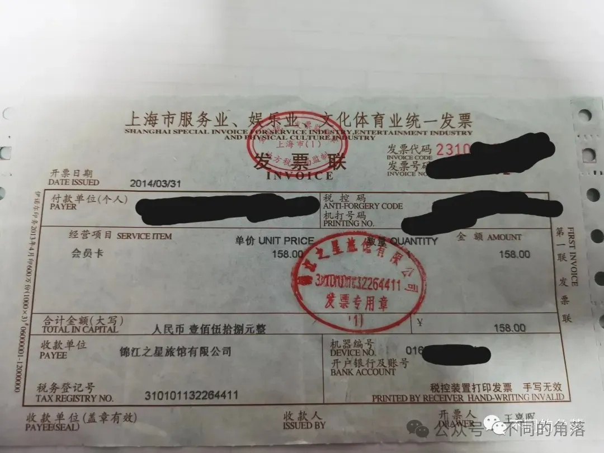

2013年铂涛酒店会员升级为白金卡并每年保级。

2014年维也纳酒店绅士会员俱乐部会员升级为至尊钻石卡。

2015年维也纳酒店绅士会员俱乐部会员升级为绅士卡并每年保级。

2015年锦江旗下全服务酒店与有限服务酒店会员计划合并为一个锦江礼享会员计划。用万事达卡匹配了锦江礼享白金会员。那时锦江礼享白金会员付费购买1858元(送房券餐券)，入住升级要求是2年内80间夜，入住保级要求是2年内60间夜。

2017年锦江推出整合原锦江会员计划和铂涛会员计划的WeHotel礼享会会员计划，我的锦江礼享白金与铂涛白金合并为WeHotel白金并每年保级。

2018年12月18日，锦江将WeHotel礼享会会员计划拆分为运营全服务酒店(当时70家，2家昆仑品牌68家锦江品牌)的WeHotel尊享会会员计划和和运营有限服务酒店的WeHotel礼享会会员计划，原锦江WeHotel礼享白金卡变成WeHotel礼享白金和WeHotel尊享金卡。尊享会金卡有升房一级和单早权益。我入住20S升级为尊享会白金卡，尊享会白金卡有升房两级和单早权益。

后来得知很多锦江WeHotel礼享白金卡会员在会员计划拆分后投诉，然后锦江直接将投诉会员由尊享会金卡升级为尊享会白金卡。

再次入住10S保级完尊享会白金会员，结果2020年3月，锦江合并WeHotel尊享会与礼享会，重新恢复为一个锦江会员计划。我的尊享白金和礼享白金会员合并为一个锦江白金会员。

2021年7月1日，维也纳酒店绅士会员俱乐部会员计划合并到锦江会员计划，维也纳至尊钻石卡会员给了2.5年锦江白金会员，维也纳最高等级绅士卡会员给了1.5年锦江白金会员。

2021年12月27日，抽风的锦江再度将锦江会员计划拆分为运营58全服务酒店(当时1家J酒店2家昆仑品牌55家锦江品牌)的锦江豪华经典酒店会员计划和运营有限服务酒店的锦江优选酒店会员计划。原锦江白金卡变成锦江优选酒店白金和豪华经典酒店卓越卡(金卡)，豪华经典酒店卓越卡有升房和双早权益。2021年12月30日入住锦江创始店上海锦江饭店，结果酒店拒不给任何豪华经典酒店卓越卡会员权益，之后再未入住锦江旗下所谓的豪华经典酒店，豪华经典酒店卓越卡降级为经典卡(普卡)。

后来得知很多锦江礼享白金卡会员在会员计划再度拆分后再次投诉，然后锦江直接将投诉会员由豪华经典酒店卓越卡升级为大使卡(白金卡)。

2023年5月11日锦江合并锦江豪华经典酒店会员计划与锦江优选酒店会员计划，再度恢复为一个锦江酒店会员计划。我的锦江优选酒店白金与豪华经典酒店经典卡合并为一个锦江酒店白金会员。

我这十多年入住过的锦江/铂涛/维也纳/丽笙旗下各品牌酒店应该有300多家。

**入住过的部分锦江旗下品牌酒店如下**：

2家昆仑：北京昆仑、上海静安昆仑。

30家锦江：其中21家目前还是锦江的有上海锦江饭店、上海中信泰富朱家角锦江度假酒店、上海锦江天诚大酒店、上海锦江金门大酒店、北京锦江富园大酒店、郑州大河锦江饭店、沈阳海韵锦江国际酒店、沈阳明程锦江国际酒店、江苏锦江南京饭店、常州锦江国际大酒店(现常州丽亭酒店)、青岛广业锦江大酒店、莱阳锦江金山国际酒店、武汉锦江国际大酒店、缙云锦江国际大酒店、海宁皮都锦江大酒店、云南大围山锦江度假酒店、曲靖福邦锦江国际酒店、昆明锦江大酒店、西安锦江国际酒店、西安锦江西京国际饭店、兰州锦江阳光酒店，

其中9家已退出锦江的有信阳锦江大酒店(现信阳温德姆酒店)、文山凤凰锦江国际酒店(现文山凤凰酒店)、唐山锦江国际饭店、唐山锦江贵宾楼饭店、南昌锦江锦峰大酒店(现南昌锦峰大酒店)、秦皇岛锦江半岛四季酒店(现秦皇岛半岛四季酒店)、自贡英祥锦江大酒店(现自贡英祥国际大酒店)、无锡锦江大酒店(现无锡万达颐华酒店)、内蒙古锦江国际大酒店(现内蒙古开元名都大酒店)。

6家锦江都城经典：锦江都城经典上海外滩新城饭店、锦江都城经典上海南京饭店、锦江都城经典上海南京东路外滩酒店、锦江都城经典上海青年会人民广场酒店、锦江都城经典上海达华静安寺酒店、锦江都城经典上海外滩新亚酒店(现上海外滩郁锦香新亚酒店)。

入住过的丽笙旗下高端品牌酒店如下：

1家丽笙精选：上海兴国宾馆丽笙精选。

2家丽笙：上海虹桥西郊庄园丽笙大酒店、重庆丽笙世嘉酒店。

入住过的锦江为业主由国际品牌管理酒店：上海和平饭店。

**部分酒店入住体验帖**如下：

锦江之一上海锦江饭店：

[锦江之一上海锦江饭店](http://mp.weixin.qq.com/s?__biz=MzU4OTczMzkwNw==&mid=2247486583&idx=1&sn=bf1dad65d322f5425f68e841d6ce436d&chksm=fdc8450bcabfcc1dd2efcc1cf0cb3593b35428629ecb03ea9e2d9064d60b0032830f98b35bac&scene=21#wechat_redirect)

上海老酒店之一上海和平饭店：

[上海老酒店之一上海和平饭店](http://mp.weixin.qq.com/s?__biz=MzU4OTczMzkwNw==&mid=2247489424&idx=1&sn=372ff79a328c45072bd1726d86ae81b3&chksm=fdc85eeccabfd7fa93254f49fcedfe212f9dc823e14952f7422b23d97fab6f479bd9875c2d31&scene=21#wechat_redirect)

锦江都城经典之一上海外滩新城饭店：

[锦江都城经典之一上海外滩新城饭店](http://mp.weixin.qq.com/s?__biz=MzU4OTczMzkwNw==&mid=2247485532&idx=1&sn=71cc7304571eaf228c86a0b357130b6c&chksm=fdc84120cabfc8368a97f7e8e396a92c3831e5a3ef9dac1ca109d580334d91d4e2c971c8d302&scene=21#wechat_redirect)

锦江都城经典之二上海达华静安寺酒店:

[锦江都城经典之二上海达华静安寺酒店](http://mp.weixin.qq.com/s?__biz=MzU4OTczMzkwNw==&mid=2247496637&idx=1&sn=dd9237a91a6b459f280f3a3d8f595f95&chksm=fdcbbac1cabc33d7ee56a46412660882de849b544b2a7fce1e579af2b799dd70285e7240d500&scene=21#wechat_redirect)

欧暇地中海之一深圳机场国际会展中心店(退出后翻牌为深圳宝安机场怀德地铁站亚朵X酒店，现又翻牌为美豪丽致酒店深圳宝安机场怀德地铁站店):

[欧暇·地中海之一深圳机场国际会展中心店](http://mp.weixin.qq.com/s?__biz=MzU4OTczMzkwNw==&mid=2247488470&idx=1&sn=160f66c844e0c57c07539ee1ddc13e4a&chksm=fdc85aaacabfd3bc753cd051055983b46a7e8745b9a404a4767a91f6a0ec4cc30db9495dd4f1&scene=21#wechat_redirect)

潮漫之一沈阳火车站太原街医大一院店(现沈阳站东广场亚朵X酒店)：

[潮漫之一沈阳火车站太原街医大一院店](http://mp.weixin.qq.com/s?__biz=MzU4OTczMzkwNw==&mid=2247487928&idx=1&sn=6eff1f456b224b22aab4af99bcd5ab51&chksm=fdc858c4cabfd1d2fa0b1c6542a4a8b82a4e64594ce2eee73cca3deb5e02b71cddf548158984&scene=21#wechat_redirect)

丽枫之一沈阳盛京医院万达广场店：

[丽枫之一沈阳盛京医院万达广场店](http://mp.weixin.qq.com/s?__biz=MzU4OTczMzkwNw==&mid=2247493308&idx=1&sn=ffe55c40988baa9fa90d9dc07020fba5&chksm=fdcbafc0cabc26d64b3e67e751bd6d35a707fdc7ed5da7f6686161ccd5801c5510f7cc58a2c8&scene=21#wechat_redirect)

**我的投诉**

投诉过2家酒店，秦皇岛锦江半岛四季酒店和上海锦江饭店，都是第二次入住后投诉的。

第一次投诉经过：2019年1月初，第一次入住秦皇岛锦江半岛四季酒店，那时是尊享会金卡，金卡有升房一级和单早权益，房间未升级给了单早，酒店客房里没有暖气供暖，空调制热效果不好，开了一晚上空调还是只有十多度，但还是给了酒店5分好评。然后收到酒店点评回复如下（2020年截的图，那时锦江会员点评页面已经不显示会员ID名称和头像了，都被统一为相同头像和此用户没有留下信息这个昵称了），说下次入住时有问题告知酒店前台，会第一时间为我解决。

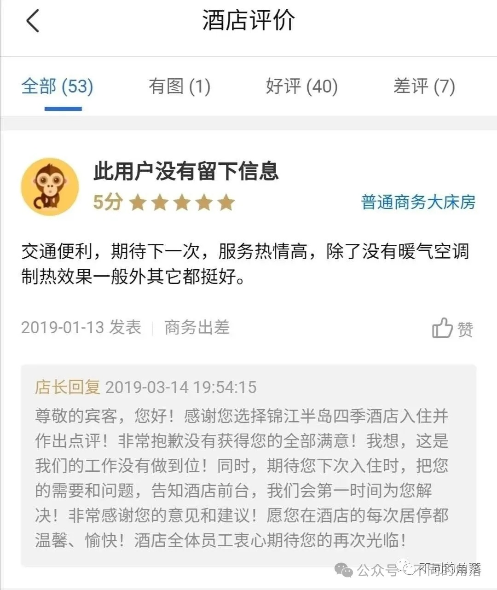

2019年9月时已经升级为尊享会白金，再次入住秦皇岛锦江半岛四季酒店，尊享会白金有升房两级和单早权益，结果酒店仍然不给升房（当天入住率不高，锦江官方平台酒店各种房型都很充足）；想着上次点评酒店管理层回复说了遇到问题告诉酒店前台，就给前台员工出示了之前的点评和回复，还有锦江尊享会会员权益页面，酒店前台员工给酒店所谓的运营总监打了电话，然后说还是不能免费升房，要升房只能付费升。

我说找酒店当天值班经理，一个前台女员工说她就是酒店前台经理，也是当天值班经理，我和她说锦江尊享会权益明确有写尊享会白金可以升房两级，她说锦江给他们酒店培训时告知的尊享会白金卡/金卡会员升房权益是到店后预订房型没有了，才升房。我告诉她预订订单确认后到店无房升级这种不是高级会员权益，是所有预订酒店客人都有的权益，到店无房酒店如果不免费升级，那就是按照消费者权益保护法规定退一赔三了。和她沟通无果，说找上次回复点评人员，不给找；问她上次回复点评人员电话，也不给。

打锦江客服电话投诉，锦江客服开始也是说尊享会白金会员升房权益是预订房型到店无房才升级。

问锦江客服普卡会员预订房型到店无房给不给免费升级，锦江客服回答不出来，又改口说升房权益执行要看酒店当天房态，可升级房型有空房时才可以升级。

我告诉锦江客服让她自行查询一下当天秦皇岛锦江半岛四季酒店是不是各种房型房源充足，锦江客服查询后认同当天可升级房型房源充足，又说升房权益以具体酒店自行规定为准。

无语，退房后给出了入住锦江酒店多年来第一个差评，给出差评后酒店也不回复了，后来发现酒店将之前的点评都翻到了前面，将我这个差评给沉底。

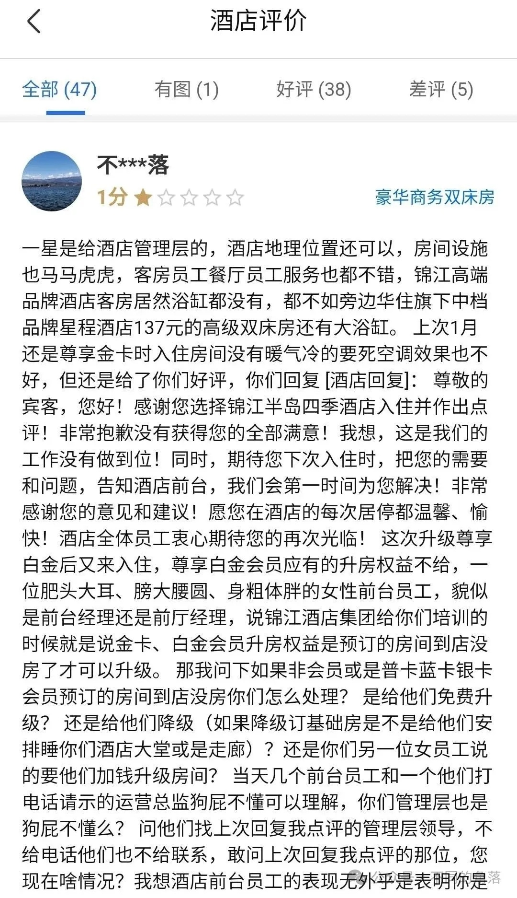

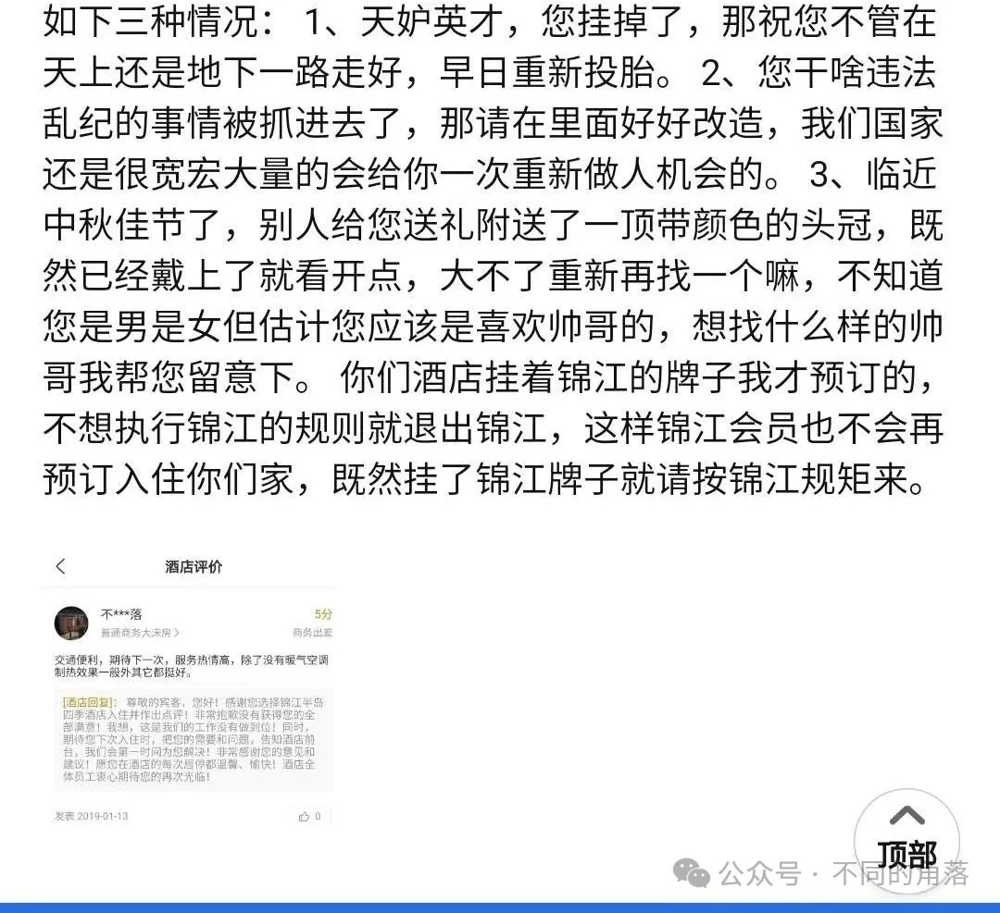

第二次投诉经过：2021年12月27日锦江重新拆分会员计划为全服务酒店的豪华经典酒店会员计划和有限服务酒店的优选酒店会员计划。12月28日锦江官方APP重新发布豪华经典酒店会员权益如下，备注4明确写明预订保证政策不适用于免费房。

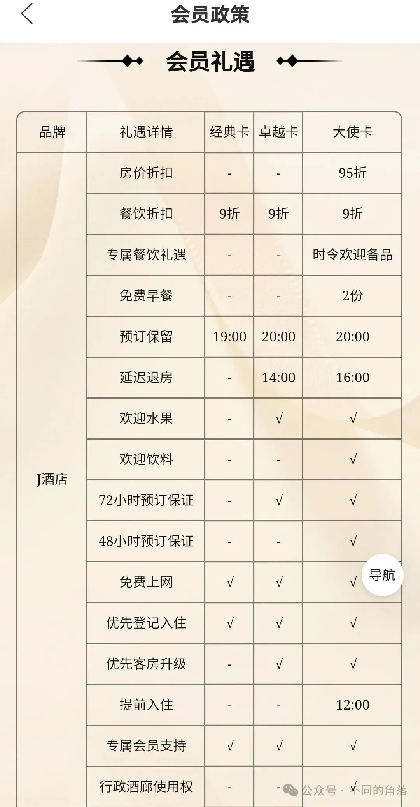

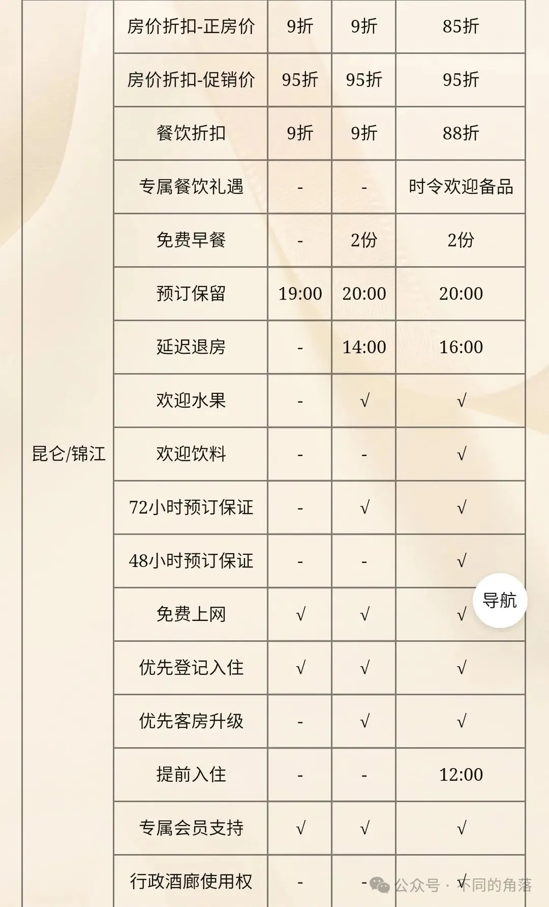

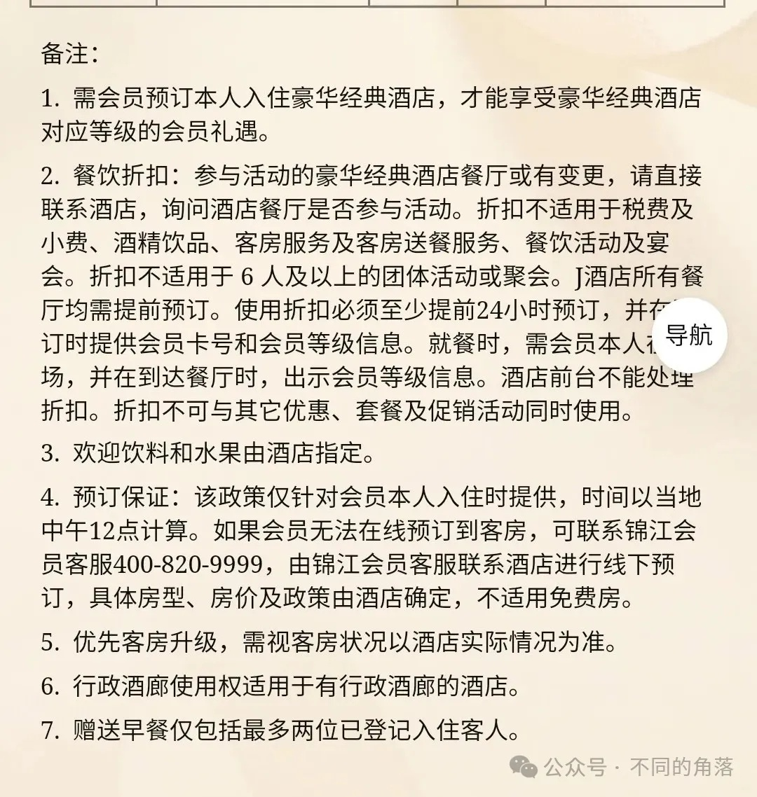       同日锦江官方APP上海锦江饭店页面也同步显示我作为豪华经典酒店卓越卡可以享受的相关会员权益。

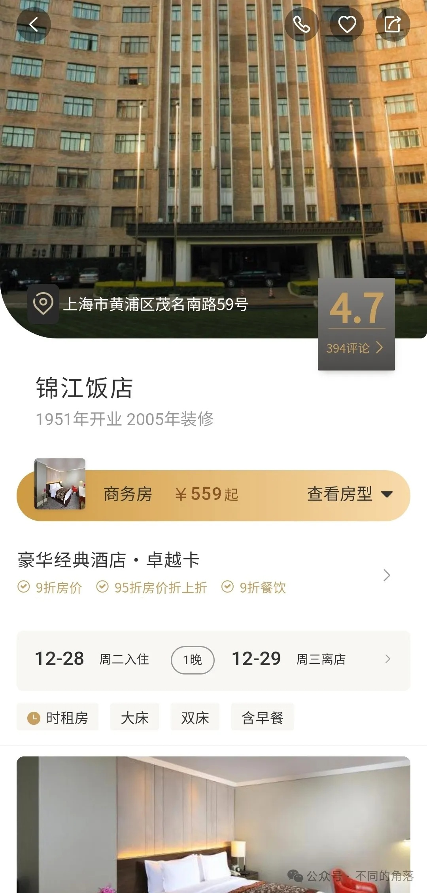

2021年12月30日锦江官方平台积分兑换免房入住，是我第二次入住上海锦江饭店(第一次入住上海锦江饭店是2019年时，第三方平台订单，不享受会员权益)，当天上海锦江饭店一男一女两个前台和一个男性大堂经理，说按照12月28日发布的豪华经典酒店会员政策，以它们的智商对备注4解读，就是免费房不享受一切会员权益。告诉他们找锦江饭店管理层，不给找。

现场打锦江客服电话投诉，接电话的锦江男客服开始说锦江没有什么豪华经典酒店会员，告诉它去看看锦江官方平台相关公告；它挂了电话后一会儿打电话过来，说现在有豪华经典酒店会员，说以它的智商对备注4解读，也是免费房不享受一切会员权益。

最终我应该享有的卓越卡会员免费早餐、延迟退房、欢迎水果、客服升级权益都被它们的智商给解读掉了，只享受到了免费上网权益。

当天就打了上海12315投诉，等待了半个多月期间又打了几次上海12345催促。

2022年1月17日终于接到上海锦江饭店一位女性大堂经理（还是大堂经理，估计上海锦江饭店高层每天与国际友人打扑克下象棋忙得很）电话，询问情况，她还用上海锦江饭店大堂经理专用微信号加了我好友，我把相关情况和豪华经典酒店卓越卡会员权益截图内容发给她。

1月18日，再度接到上海锦江饭店女大堂经理电话，说是锦江饭店酒店总经理很重视我反馈的情况，说为了表示歉意，下次我再入住上海锦江饭店，可以送我一份早餐/房间升一级。告诉她我是卓越卡，本人入住本来就享有两份免费早餐和升房权益，她告诉我可以额外再赠送我一份早餐，可以让我一个人一次吃三份早餐，可以在原有升房权益上再升一级。

卓越卡/大使卡会员享有房间升房权益，不过写的是优先升房权益，需视客房状况以酒店实际情况为准，按照锦江的尿性，升房权益可以忽略，一切看当班员工心情！

遇到过锦江酒店员工说日历房可升级房间还在卖，还存在其他客人预订可能，所以不能升级；当天可升级房间要一直卖到午夜0点，过了0点后还可以继续卖午夜房，存在其他客人预订可能，所以过了0点后还是不能升级。

这样我入住酒店只要给我升一级，也可以说是在原有升房权益上升一级了。

退房后给了上海锦江饭店差评，点评里上传了锦江豪华经典酒店会员权益和董先生《我的一个世纪》书中内容截图，结果锦江管理层智商见涨，已经学会给锦江官方点评开启差评拦截功能。最终我2022年1月4日发布的上海锦江饭店点评到现在还是显示审核中，只有我自己可以看到。

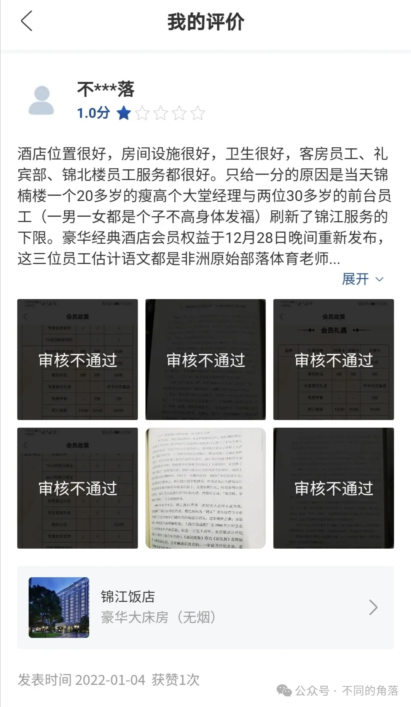

再后来，发现被上海锦江饭店大堂经理删除了微信好友，估计如果我再去上海锦江饭店入住，它之前说的赠送一份早餐和升房一级肯定也都会赖掉不算数了。

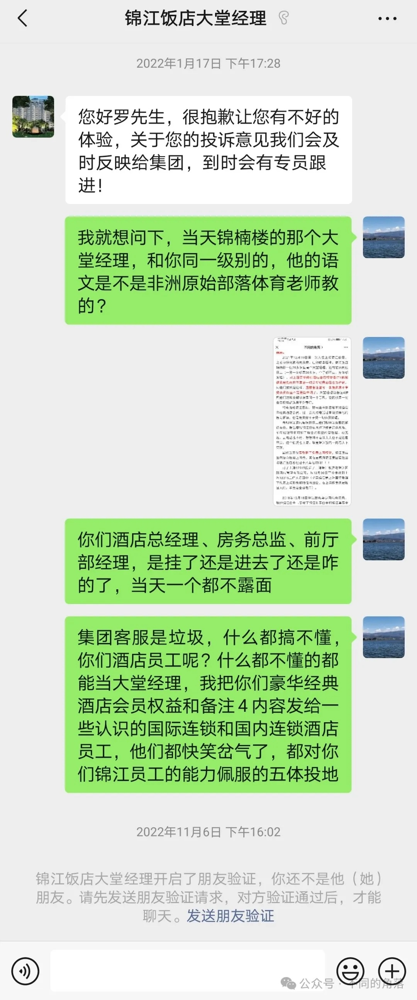

本来豪华经典酒店会员计划拆分出来后，还计划继续支持民族酒店品牌入住豪华经典酒店升级大使卡。这次糟糕的体验后直接放弃了，直至卓越卡降级为经典卡再未入住锦江所谓的豪华经典酒店。

投诉锦江，再次完败。只能祝愿第二次入住时的上海锦江饭店时任总经理它家楼上楼下左邻右舍男主人都姓王了。

**锦江故事**

1、毫无底线发国难财

2021年7月17日至23日，河南省遭遇历史罕见特大暴雨，发生严重洪涝灾害，特别是7月20日郑州市遭受重大人员伤亡和财产损失。灾害共造成河南省150个县（市、区）1478.6万人受灾，因灾死亡失踪398人，其中郑州市380人、占全省95.5%；直接经济损失1200.6亿元，其中郑州市409亿元、占全省34.1%。

7月20日当天郑州因暴雨造成很多人只能就近找酒店避雨有家不能回，为了帮助这些落难民众，郑州大部分酒店都未涨价甚至降价帮助受灾群众共度难关。

然而锦江旗下以点评造假出名的希岸品牌希岸酒店郑州高铁东站店，面对大雨洪水中无家可归无处可去的落难同胞，不仅不伸出援手，反而还落井下石，坐地起价200多元的房间涨价到2888元一间。

被网友网上曝光后，希岸酒店7月22日才发布了一篇致歉声明。郑州市市场监督管理局也对该酒店处以50万元罚款。没多久这家酒店退出锦江，加盟首旅如家，貌似业主方也更换了。

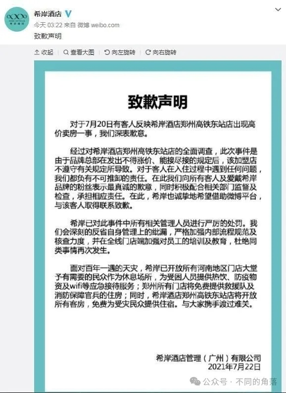

2、数典忘本割裂历史

上海锦江饭店在几次店庆时都把锦江品牌锦江饭店创始人董先生从酒店历史抹去，割断锦江饭店前身革命贡献历史。下方为董先生自传《我的一个世纪》里文章截图。

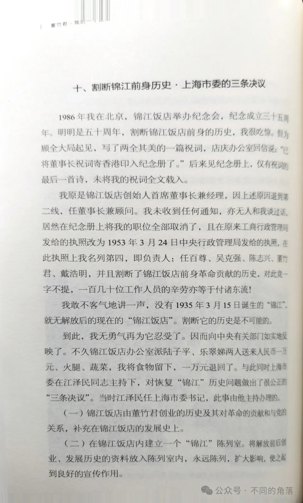

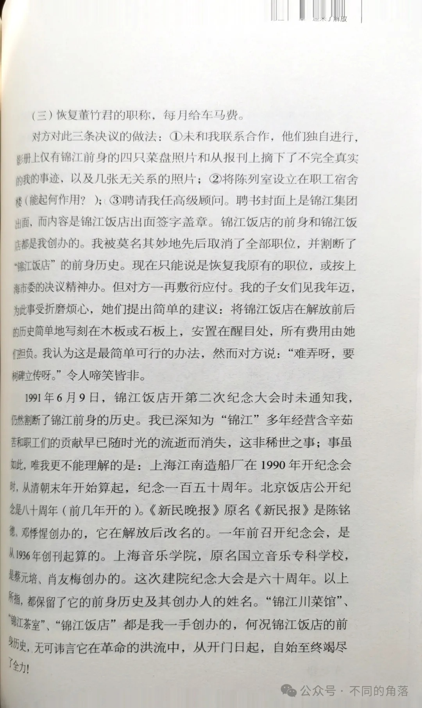

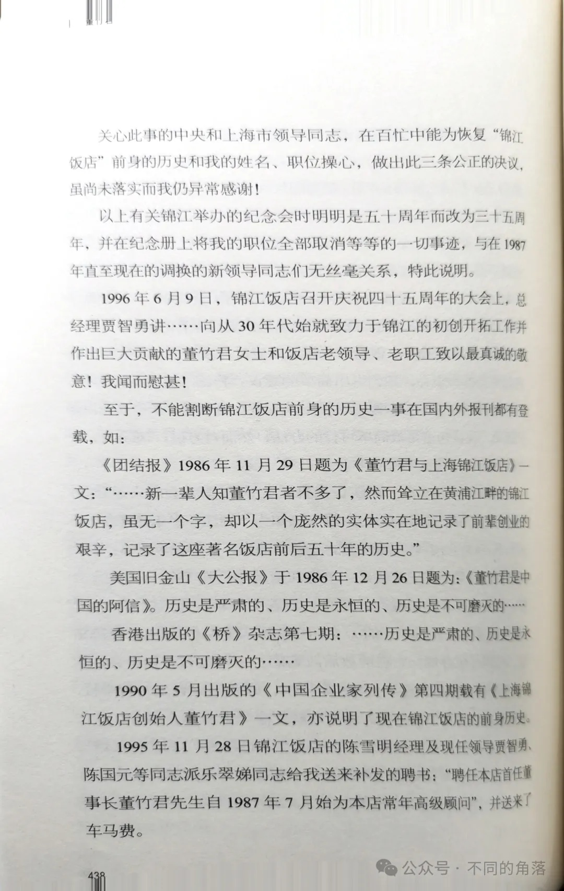

3、国际友爱感动全球

2018年1月1日，上海静安希尔顿酒店翻牌为上海静安昆仑酒店。翻牌为昆仑后，锦江旗下明面上的最高级别会员锦江白金卡(包括短暂生存一年多的锦江尊享白金卡)，在上海静安昆仑只享有一份免费早餐和一份行政待遇(那时锦江白金/尊享会白金入住锦江全服务酒店都只有单早和单人行政待遇)；而希尔顿钻卡会员(2016年起希尔顿钻卡开始烂大街，随便免费匹配，不会匹配的网上直接买，百家姓钻价格从最初的400元一路降到最低28元)不管哪个渠道预订入住上海静安昆仑，都可以享受原希尔顿钻卡会员权益：双人免费早餐+双人行政待遇+升房+延时退房。

2019年我入住上海静安昆仑时和酒店员工聊天，酒店员工说之前酒店是希尔顿时，一些外国宾客经常住，翻牌为昆仑后，一些外国宾客还来住，不过他们都没有注册锦江会员，按照规定没有早餐、行政酒廊、升房、延时退房等权益，为了让这些外国宾客住的满意，上海静安昆仑酒店就首开全球酒店业先河，给烂大街的希尔顿钻卡会员远超锦江自家白金会员待遇。

就此出现了全球酒店史的奇迹，入住锦江旗下豪华五星档次酒店上海静安昆仑，其它酒店集团高级会员享有的权益吊打锦江自家最高等级会员权益，且锦江最高等级会员需要在锦江官方平台预订才可以享受会员权益。奇迹一直持续了三年到2020年12月31日，估计是口罩原因外国宾客都走了，这个感动全球关爱国际友人的全球酒店史奇迹才结束。

4、锦江祖师爷被穿越

2021年7月29日锦江在线微信公众号、7月30日锦江豪华酒店微信公众号、7月31日锦江都城酒店微信公众号相继发布相同内容推文，锦江都城微信公众号把董先生的出生年份写成1990年，我当天留言提出质疑半个多月后，于2021年8月17日终于做出了修改。

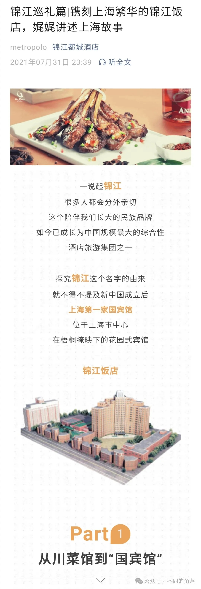

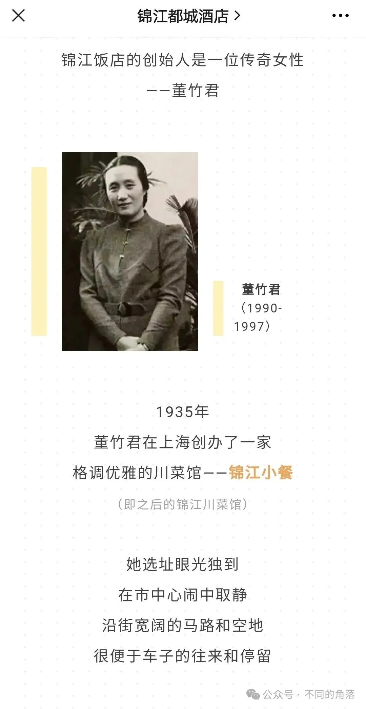

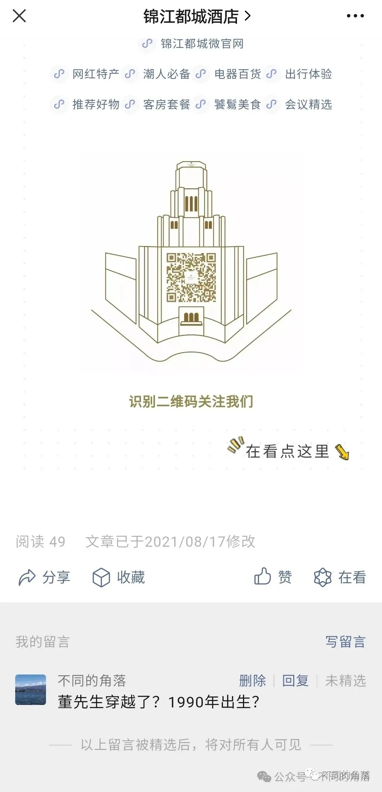

5、点评造假肆无忌惮

锦江旗下铂涛系品牌酒店（希岸系列、丽枫、7天优品等）尤其是所谓的女性主题酒店品牌希岸系列品牌，以及锦江旗下维也纳系列品牌酒店门店自己刷好评只能用丧心病狂来形容了。

2021年11月30日前维也纳酒店APP和维也纳绅士会会员计划还存活时期，最初维也纳酒店APP上点评发布后不能修改不能删除，但可以打电话给维也纳客服对点评进行屏蔽不让其他会员看到，会员点评发布差评后，酒店都会打电话给会员请求会员给维也纳客服打电话屏蔽差评。

2019年下半年起维也纳APP修改点评规则，点评发布完可以修改，酒店收到差评后都会给客人打电话请求客人修改点评，并且是几年前发的点评也都可以修改。

维也纳更疯狂的是自己刷好评（那时在维也纳APP上刷，锦江APP上不刷）。

维也纳酒店APP上99%酒店99%点评都是门店员工自己刷的，都是几个ID承包酒店99%的点评(都是好评)，同一ID发布的几十条好评大都是间隔只有几秒时间。

同期锦江酒店APP上希岸系列品牌酒店，大多数酒店95%的点评(都是好评)也都是几个ID承包的。

以我2020年住过的一家维也纳酒店为例，维也纳酒店宁德高铁站店2020年6月6日开业，那时我刚好在宁德出差，住过这家维也纳酒店。这家酒店在维也纳酒店APP上线开放预订大约是在开业半个月后6月21日前后。2020年9月时查询维也纳酒店宁德高铁站店实时点评如下，又任意查询了其它几十个城市的几十家维也纳系列酒店，也都是同样情况。

维也纳酒店宁德高铁站店同一个ID到7月下旬刷了90多个好评，最开始的几个点评还多写了几个字，后期就全部都是只有“好评”两个字了，基本上2秒间隔一个好评，最搞笑的是前面的点评有一条还写了“一个月总要来酒店住几天”，一个月住几天就住了90多天写了90多个好评。后续换了个只相差一位数的ID，几天时间又刷了90多个点评。

先看下这家酒店在锦江APP上的评价，只有7个点评，平均分是3.9分。

     再看下这家店在维也纳APP上的评价，241条点评，平均分是5分。

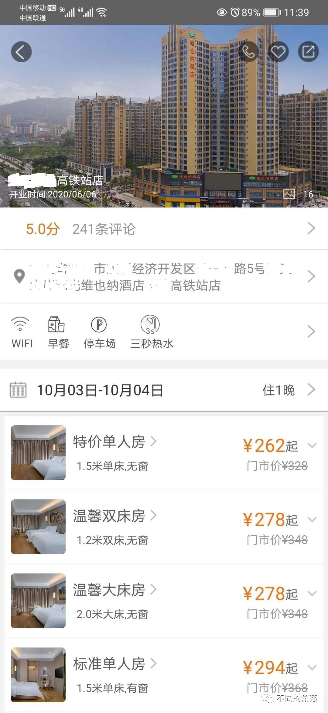

     2020年6月26日会员HZ6开头这位是真实点评，也是该维也纳酒店在维也纳APP上的第一个和第二个点评，都是给了4分，之后2020年6月27日开业一个多月住了90多间夜刷了90多个好评的第一个ID：EP8\*\*\*\*\*209闪亮登场承包了之后的一个多月点评。

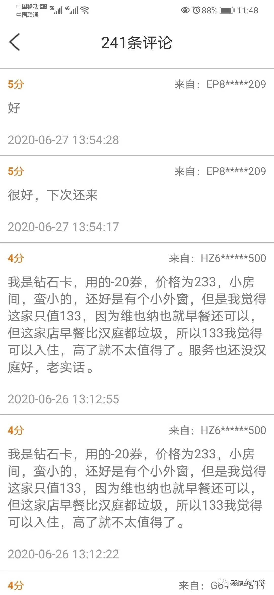

一开始为了显得真实点，几个点评还是都多写了几个字的，还特意写明每个月来几次。

     前面点评还是一个月住几次，现在就变成持续住了一个多月，然而酒店是6月6日才开业的，维也纳APP上线开放预订应该是在开业半个月后6月21日前后。

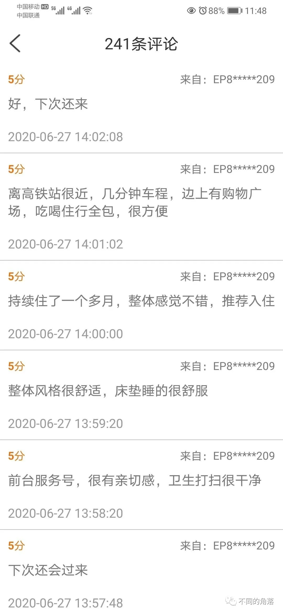

没过几分钟这又变成了每个月来几回，这到底是来几回还是来几回呢。

之后就开启两个字点评模式了，到6月29日已住了50多晚50多个好评了。

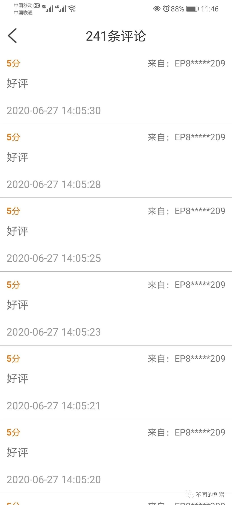

到7月26日又住了差不多50晚（图片太多只上了7月首末两个点评订单），这也是超能力啊。

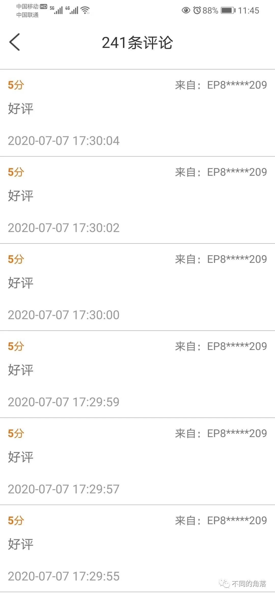

再来看该酒店另一个同样发了90多个评价的选手，和上面的选手应该是亲兄弟，会员号挨着，EP8\*\*\*\*\*210,随便截图发一张，其它都是同样两字，同样差不多2秒一个好评。

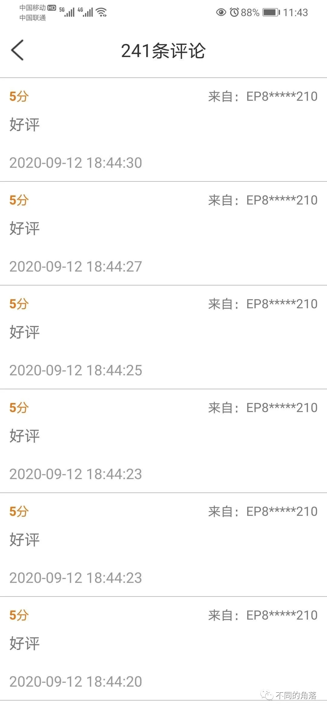

再说说希岸系列，我2019年7月下旬时入住希岸·轻雅酒店沈阳张士经济技术开发区店(酒店2021年已退出锦江现在是栖岸·轻雅酒店沈阳张士经济技术开发区店)，这家店2019年3月下旬新开业，2019年7月下旬我入住那天统计了一下共493个评论，共有5个ID刷好评，其中最多的一个刷了192个好评，第二多的刷了173个好评，第三多的刷了70个好评，这三个ID就刷了435个好评，占全部评论的88%，算上其余2个ID刷的好评，差不多占全部评论的95%。3月下旬到7月下旬才4个月120天，刷第一多和第二多好评的ID住过的房间有希岸玲玲房、希岸大床房、希岸双床房、希岸豪华大床房、希岸豪华双床房、希岸女神大床房等所有房型，出行目的商务出差、情侣出游、家庭出游、朋友出游、独自出游、其他6种方式都有。

当天又随便在锦江酒店APP上查看其它希岸系列品牌酒店的点评情况。

武汉一家2019年3月下旬新开业的希岸品牌酒店，2019年7月下旬时我统计了一下共383个好评，其中90%以上也都是几个ID刷的，刷的多的ID同样是各种房型都有住过，出行目的6种方式都有。

一家2019年7月时刚开业没几天的希岸品牌酒店，共22个评论，18个好评都是同一个ID刷的。

查看的其它希岸系列品牌酒店，基本也是如此。

估计是锦江高管知道锦江旗下门店员工自己刷好评的事情被锦江广大会员发现了，拍屁股又想出了神操作。

2020年8月，锦江对官方点评会员ID进行屏蔽，所有会员ID只显示为两种，所有实名点评用户ID信息显示都是“此用户没有留下联系信息”，如果点评时勾选了“匿名点评”则显示为“匿名用户”。

锦江高管想当然的以为以为屏蔽会员ID后广大锦江会员就看不出来酒店员工自己刷好评了！！！看不到点评人ID了，酒店就可以说这些好评不是一个ID刷的了。

没想到屏蔽会员ID后，广大锦江会员觉得所有好评都是是酒店员工刷的了！

估计锦江高管觉得太冤了，锦江旗下门店员工明明只刷了部分好评，不是全部，还有一些好评是真实的。

半年后，2021年2月1日，锦江解除官方渠道点评里的锦江会员ID屏蔽。

6、活动未开始先结束

2019年11月9日锦江豪华酒店微信公众号发推文宣称2019年11月11日10点开始锦江尊享酒店五折积分兑换（10000积分、15000积分、20000积分酒店各自可以五折兑换一次）。

结果我从11月11日10点守到10点半也没有五折兑换，打电话给锦江客服，也联系了锦江微信客服，都告知我活动已经结束了（活动都没开始就结束了？这个顺序也不对啊），我问她们锦江的领导是不是都是离婚在前、结婚在后，锦江客服表示很迷惘，不清楚锦江领导的婚姻和X生活。

之后三天又多次电话沟通，锦江客服终于相信五折兑换尊享房活动的确没有上线，反馈后于2021年11月14日晚上终于开启五折积分兑换（锦江豪华酒店微信公众号于11月14日晚上重新发了推文），活动刚开始时还出现了大BUG，火速撸了BUG第一单，看到后续又有4人撸了BUG后才恢复正常。

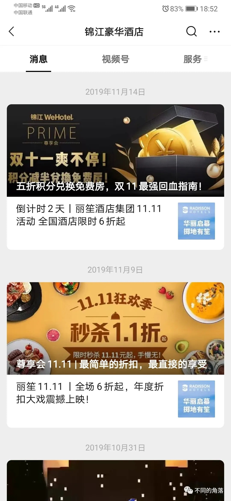

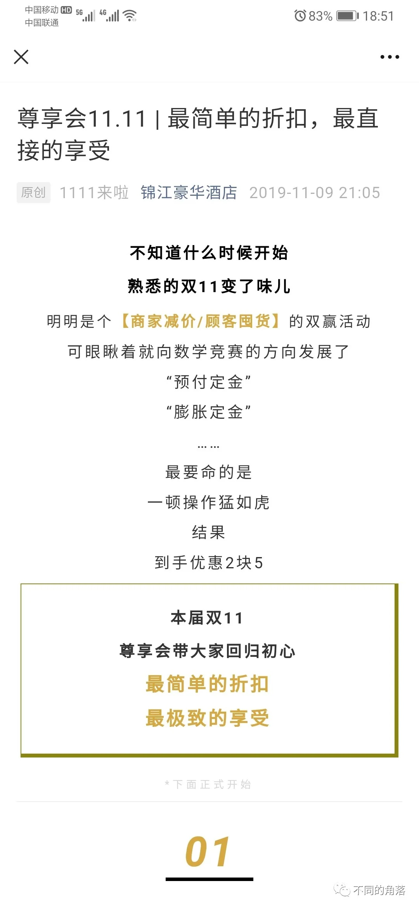

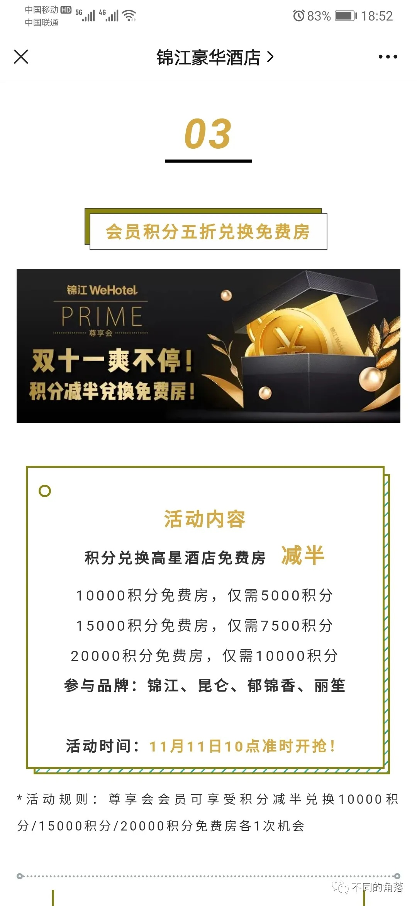

7、会员合并权益倒挂

2021年7月1日，锦江旗下维也纳绅士会常旅客会员计划取消，维也纳绅士会合并到锦江会员俱乐部常旅客会员计划。

原绅士会会员可按不同的等级匹配锦江会员，并以合并当天（2021年7月1日）为起始，设置会员等级保护期（原维也纳绅士会会员只有绅士卡才需要保级，每年8晚保级，其余等级都不需要保级；锦江银卡、金卡、白金卡明面上还都需要保级）。

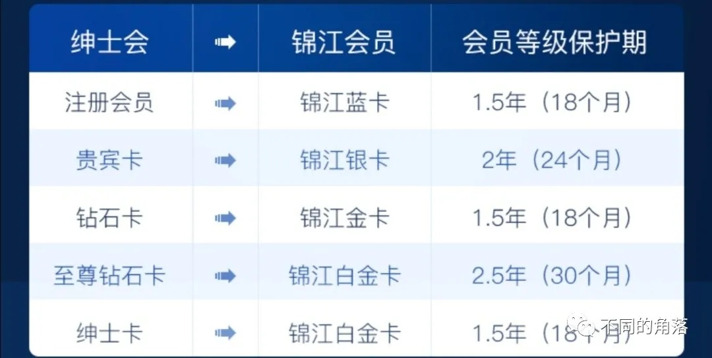

若用户既有绅士会员卡也有锦江会员卡，则合并之后的锦江会员等级就高原则体现。

原维也纳绅士会积分1:1转换为锦江会员积分。

神奇的是原维也纳至尊钻石卡匹配了2年半锦江白金，比维也纳至尊钻石卡高一级的绅士卡却能匹配一年半锦江白金，绅士卡是维也纳会员体系里唯一需要保级的会员等级，保级不成功降为至尊钻石卡。

8、通兑房券虚假宣传

2022年10月下旬，锦江酒店APP和锦江会员俱乐部微信公众号上都发力推介通兑房券，其中锦江优选酒店（锦江旗下有限服务酒店）通兑房券有99元、199元、299元三档。

在锦江会员俱乐部微信公众号上的推文里还可以看到部分推介内容：

99元通兑券可以兑换范围包括北上广深7天系列、锦江之星等经济酒店。

199元通兑券可以兑换范围包括北上广深锦江都城、凯里亚德等中档酒店。

299元房券可以兑换范围包括北上广深丽枫、喆啡等中档品牌酒店。

酒店名单是我那个上海朋友当时录屏保留了活动宣传内容，截屏活动宣传的199元房券上海可兑换锦江都城酒店。

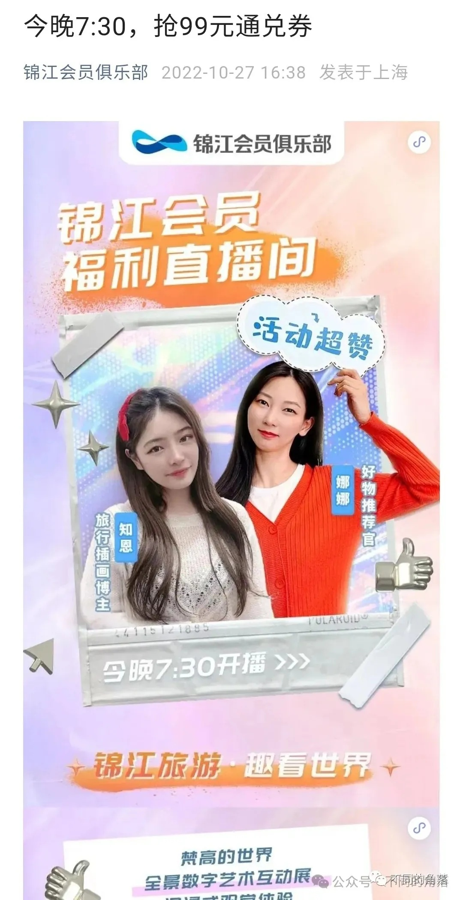

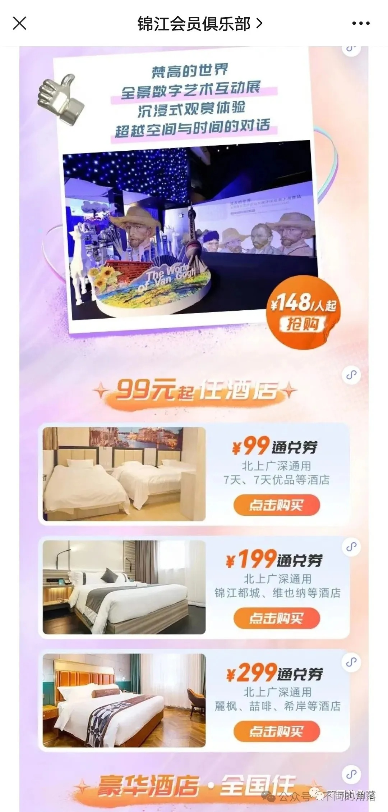

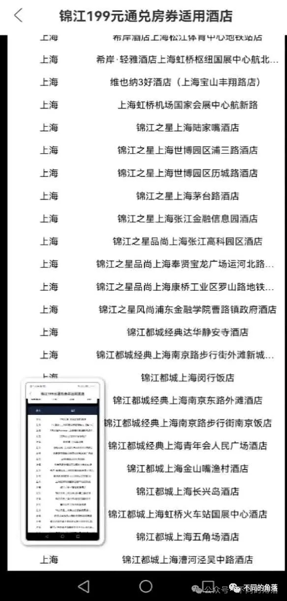

结果实际兑换时，在锦江酒店APP上兑换查询，在可兑换酒店名单中的很多酒店根本查询不到，城市选择上海，品牌选择锦江都城和凯里亚德，在可以兑换的30天内，每天只能查询到1家锦江都城或是1家凯里亚德，然后还是每天都显示满房状态不可以兑换。

事件经过可以看这篇文章：

[行业资讯：锦江再涉虚假宣传、两家亚朵ZHotel翻牌为亚朵X、君澜品宣社会员培训认证](http://mp.weixin.qq.com/s?__biz=MzU4OTczMzkwNw==&mid=2247488024&idx=1&sn=e774070864780cbe8e1eb10388c4202f&chksm=fdc85b64cabfd2720037485c2e3605848b51159f0901ad8dbb2c593c6df8e39630dca9aa010e&scene=21#wechat_redirect)

我也买了一张199元房券，实际兑换时当初宣传的锦江都城、维也纳等品牌酒店是都没有，只有7天、锦江之星、百时快捷这些经济酒店。

锦江旗下公司之前因虚假宣传被处罚已经有先例，仍不是悔改。

锦江旗下的锦江之星旅馆有限公司因发布违法广告2019年2月19日被上海市浦东新区市场监督管理局罚款30000元，处罚事由为，锦江之星在其官网发布“2015年……这也标志着国内酒店业积淀最深的锦江国际集团将携手铂涛集团，一跃成为中国最大的酒店集团，也将成为首家跻身全球前五的中国酒店集团。……10月，锦江之星位于菲律宾的首家酒店——锦江之星奥迪加斯酒店喜迎开业。该店由上好佳（国际）按照锦江之星的海外标准打造，成为进军菲律宾市场的首家中国经济型连锁酒店品牌。”经查，锦江之星均无法提供上述广告内容的证实材料，锦江之星上述宣传的目的是为了吸引客流。上述行为构成《广告法》第二十八条第二款第（二）项所指的虚假广告。

就在2022年，锦江之星再次因发布虚假宣传被处罚。上海市浦东新区市场监督管理局行政处罚决定书（沪市监浦处〔2022〕152021006078 号）显示，锦江之星旅馆有限公司（以下简称“锦江之星”）从2018年1月1日起在互联网自建网站，并在该网站发布加盟信息（招商），上述网页广告内容未对可能存在的风险及风险责任承担有合理提示或警示，上述行为属于发布违法广告。

据悉，锦江之星在自建网站发布加盟信息对外宣传，违法行为持续时间超过两年。

《广告法》第二十五条第一款规定：招商等有投资回报预期的商品或者服务广告，应当对可能存在的风险以及风险责任承担有合理提示或者警示，并不得含有下列内容：（一）对未来效果、收益或者与其相关的情况作出保证性承诺，明示或者暗示保本、无风险或者保收益等，国家另有规定的除外。依据《广告法》 第五十八条第一款第（七）项，上海市浦东新区市场监督管理局对锦江之星罚款3200元。

9、投诉收到辱骂短信

2022年11月初，我那位投诉锦江的上海朋友，收到锦江赔偿的35000积分，之后连续两天收到辱骂短信。

事件经过可以看这篇:

[行业资讯：投诉锦江顾客收到辱骂短信、美豪官宣会员权益升级、珀乐荟升级为艺龙会](http://mp.weixin.qq.com/s?__biz=MzU4OTczMzkwNw==&mid=2247488041&idx=1&sn=71b0791b6e26a4434f7c050e5efd23f6&chksm=fdc85b55cabfd2435afd8261c0fb46a0eb59f889721da1d92fab7c41e0ca90db5ab31a65b25a&scene=21#wechat_redirect)

10、热衷为希尔顿打工

2014年10月，铂涛集团与希尔顿集团签署独家战略合作协议，获得希尔顿集团旗下低端有限服务酒店品牌希尔顿欢朋在国内的特许经营权。

2015年9月，锦江官宣收购铂涛81.0034%股权。

2015年12月，希尔顿欢朋国内首店在三亚开业(早已退出)。

2016年2月，锦江完成收购铂涛81.0034%股权。锦江完成收购铂涛，接收铂涛旗下品牌，也包括铂涛特许经营的希尔顿欢朋品牌。

2020年12月，锦江与希尔顿集团续签希尔顿欢朋特许经营协议至2034年。

2023年底，希尔顿欢朋国内已开业酒店341家。同期锦江旗下中档品牌锦江都城已开业酒店206家。

锦江都城首店2013年开业。锦江都城是锦江官方宣称的国际四星级酒店品牌。比希尔顿欢朋高两个档次的希尔顿逸林是国际四星级酒店品牌(国内拔高到五星档次)。

锦江特许经营希尔顿欢朋酒店品牌，说得好听点是什么国际合作新实践，成为全球酒店行业新的合作典范。

但实际本质上，就是锦江给希尔顿打工。全球酒店老二给全球酒店老三打工，在全球酒店史上也是前所未有的事情。

2020年续签之前，还可以说是之前铂涛签的协议。

2020年续签时，锦江在酒店规模上早已超过希尔顿成为国际酒店老二。

也不用说什么学习国际酒店品牌先进管理经验，一是锦江旗下酒店之前是威斯汀、喜来登的都有，希尔顿大中华区总裁钱进，1986年入职上海喜来登华亭宾馆（2001年锦江集团与华亭集团重组，华亭宾馆成为锦江旗下酒店），开启他的酒店生涯。锦江旗下上海静安昆仑，前身就是希尔顿国内首店。更何况华尔道夫国内首店上海华尔道夫，锦江也是业主之一。锦江旗下还有上海东锦江希尔顿逸林酒店。还有上海锦江汤臣洲际、上海和平饭店等国际连锁品牌管理的酒店。想学习国际高端品牌的管理经验早就学完了。并且希尔顿欢朋只是一个低端有限服务酒店品牌，国内的全季、亚朵等品牌国内都比希尔顿欢朋做的成功多了。

锦江做了几十年酒店，曾经锦江旗下酒店的员工都是希尔顿大中华区总裁了，锦江还要一而再再而三的向一个希尔顿集团旗下低端有限服务酒店品牌学习，这真的不是搞笑么。

全球酒店集团规模排名前列的酒店集团里，不管是万豪、希尔顿、洲际、温德姆还是雅高、精选国际、最佳西方、凯悦，特许经营竞争对手旗下酒店品牌的事情，哪家都做不出来，丢不起那个人。更何况还是排名在自己规模之后的酒店集团旗下低端品牌。

11、一帮高管个个眼盲

2022年9月22日，锦江酒店(中国区)酒店投资人沙龙会(深圳站)，锦江酒店（中国区）深圳一部开发中台副总裁孙亮和四大品牌负责人（谌业伟-锦江酒店中国区副总裁/维也纳国际&丽柏品牌总裁、张敏-锦江酒店中国区副总裁/维也纳酒店&欧暇·地中海品牌总裁、陆斯云-锦江酒店中国区副总裁/锦江都城&丽亭品牌总裁/希岸酒店品牌创始人及CEO、李炜-锦江酒店中国区康铂-荟语品牌BU总裁）都有参加。

活动当天上午，锦江酒店（中国区）提供旗下3家品牌酒店门店及1间品牌样板间供投资人参观探访，实地感受产品细节，让投资变成看得见的回报。3家品牌酒店门店中第一家就是欧暇·地中海深圳机场福永地铁站店。

锦江酒店(中国区)负责人带众多新老投资人赴欧暇·地中海深圳机场福永地铁站店进行了实地考察。

我是2022年9月底入住的这家酒店，也是因为看了锦江酒店(中国区)酒店投资人沙龙会(深圳站)活动宣传，觉得众多锦江酒店(中国区)肿才副肿才带投资人实地考察的这家酒店应该有与众不同之处，结果还真开了眼了。

不知道是哪个神人设计的，不知道很多欧暇·地中海酒店的酒店介绍里充满肌理感的墙壁是不是就是这种？照片看着不明显，应该有人看到过农村围墙上插满玻璃碴子的画面吧，客房里这种就类似于墙立面上嵌满玻璃碴子。我特意用手摸了一下，真扎手，问了客房保洁人员，她们说打扫卫生时经常会把手划伤。去了其它几个房间查看，也都是这种情况。

不知道之前锦江酒店（中国区）众多肿才带领投资人来这家酒店实地考察时到底考察了啥？客房里这么严重的安全隐患视而不见。

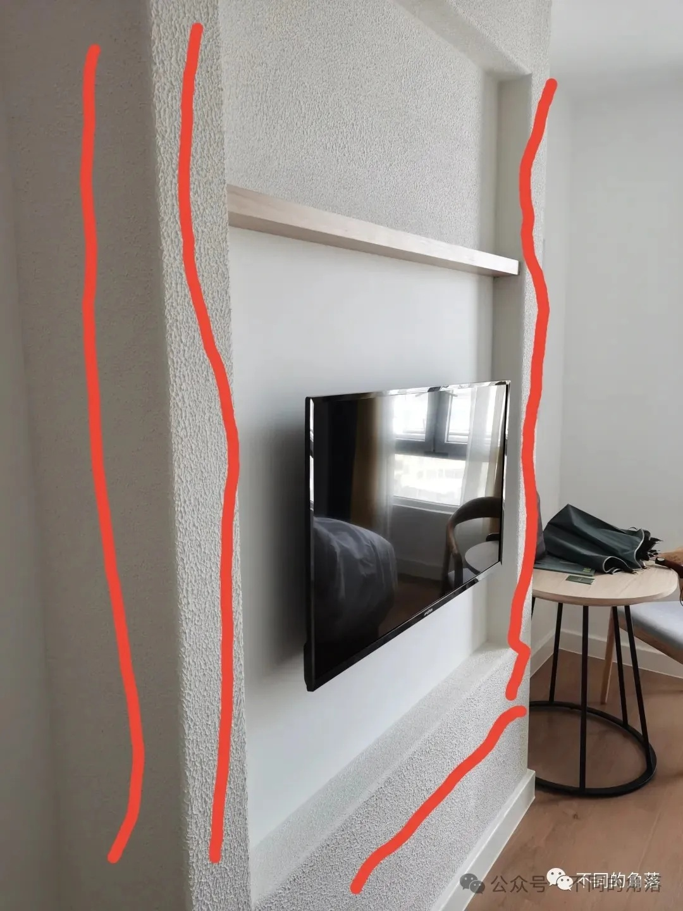

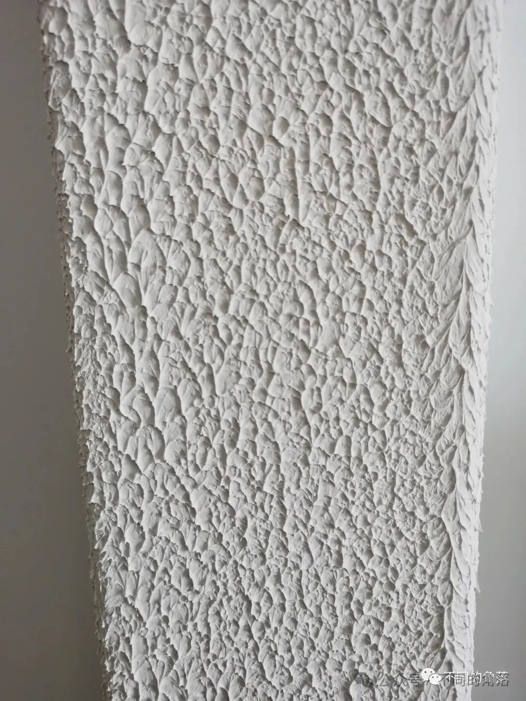

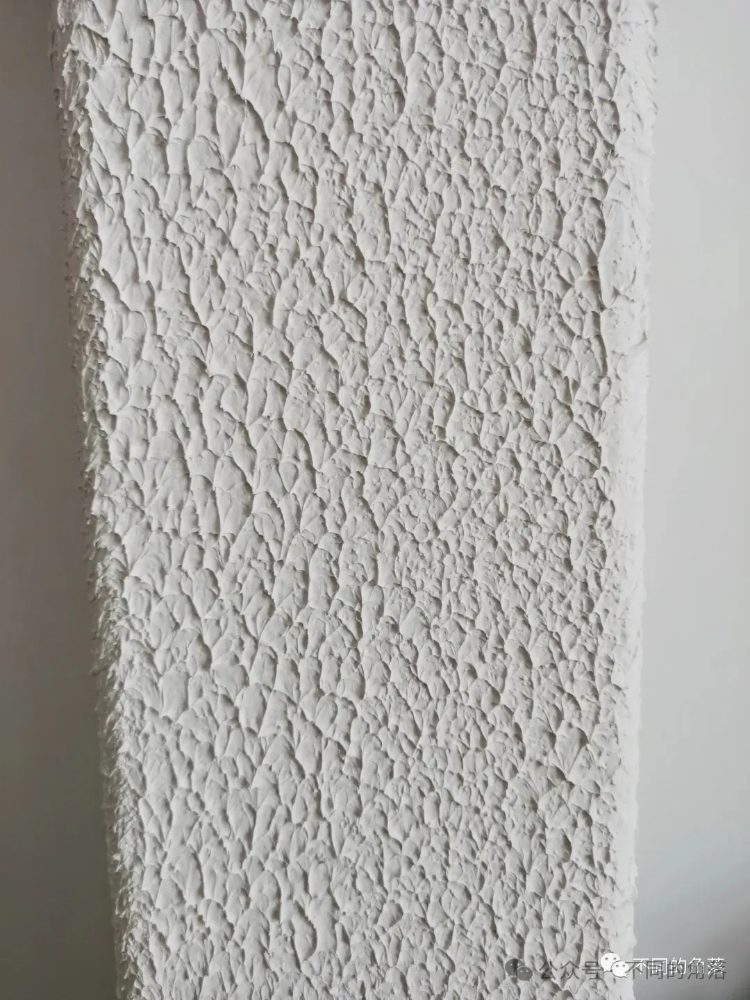

12、高星酒店越开越少

锦江集团从成立起就一直霸占国内高星级酒店老大位置，之前只有首旅能与之相比，“南锦江，北首旅”多年来一直占据国内高星级酒店前两强。

然而如今，锦江全服务酒店规模早已被开元、万达、君亭、雷迪森等酒店集团赶超，也被同为国资的首旅赶超。

锦江旗下高端品牌酒店管理团队能力实在欠佳，锦江旗下高星级酒店大多数订单还是依靠OTA平台。

国内部分锦江全服务酒店官方点评为个位数，多家锦江全服务酒店首个点评还是我当初在锦江官方渠道下订单入住后发布的。

加盟费收着，管理费交着，管理团队能力堪忧，官方订单都很少，酒店的入住率和房价持续走低，酒店难以盈利。管理合同到期后，大多数酒店业主选择摘牌退出锦江管理也就不足为奇了。之前多年锦江旗下高端品牌酒店每年新加入数量与退出数量基本持平；近几年锦江旗下高端品牌酒店每年退出数量都多于新加入酒店数量。

2013年底时，锦江旗下锦江品牌酒店64家；2023年底时，锦江旗下锦江品牌酒店47家，考虑到其中1家翻牌为郁锦香品牌，1家翻牌为丽亭，10年时间尽减少15家。同期开元、万达、君亭、雷迪森、凤悦等酒店集团旗下全服务酒店数量增加几十家到100多家。

13、老店翻牌锦江之星

2018年锦江将锦江都城经典上海外滩新亚酒店翻牌为郁锦香上海外滩新亚酒店后，为了继续保持6家锦江都城经典数量，将锦江之星上海田子坊酒店翻牌为锦江都城经典凑数。

锦江都城经典原本都为有历史沉淀的上海老建筑改造，而今为了凑数将一家非上海老建筑的锦江之星翻牌为锦江都城经典。

锦江旗下有100多年历史的上海先施百货大楼东亚饭店符合锦江都城经典品牌要求，却被改造为锦江之星品尚酒店。

上海同为100多年历史的上海总会大楼(1910年建成，解放后的东风饭店)被改造成奢华五星级的华尔道夫酒店，锦江旗下其它一些老建筑被改造为中档的锦江都城经典或是锦江品牌酒店，只有东亚饭店被改造成经济酒店。

14、推民宿卡虚假宣传

2021年6月23日、6月25日，锦江在锦江酒店APP、锦江会员俱乐部微信公众号(现锦江荟微信公众号)、锦江趣旅游微信公众号上开始力推浙江达人旅业随心宿299元单次卡。

2021年7月14日，锦江再度力推浙江达人旅业随心宿899元年卡。

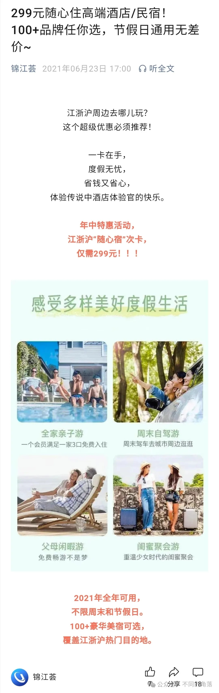

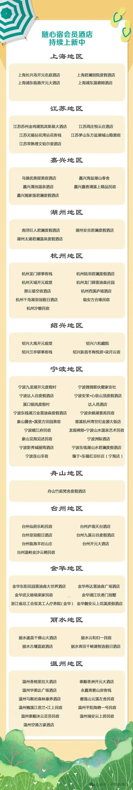

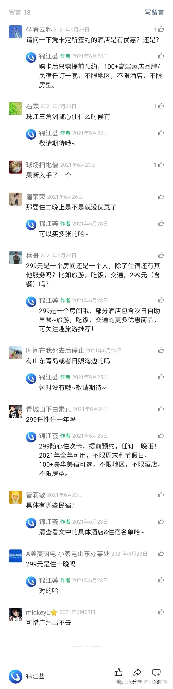

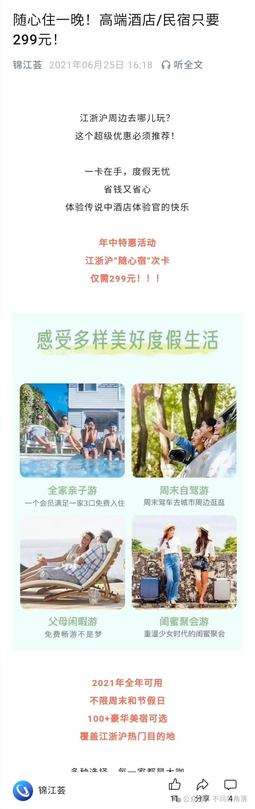

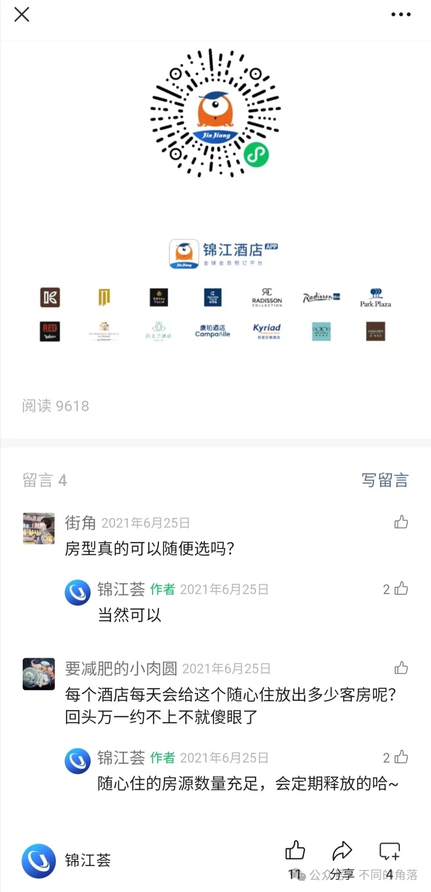

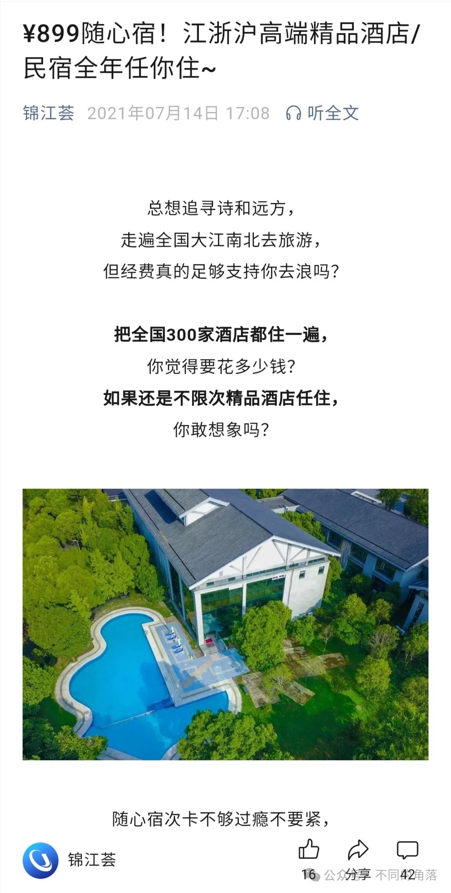

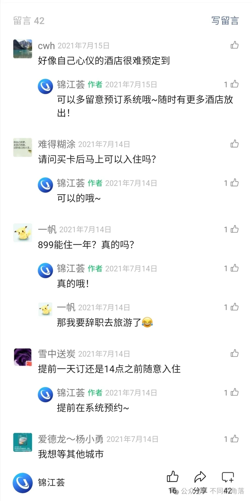

特意购买了一张随心宿单次卡，等到预订时和猜想的一样，很多当初宣传名单中的酒店已经全部消失（苏州金鸡湖凯宾斯基大酒店、常熟文旅铂尔曼酒店、温州香格里拉、温州空港万豪、宁波影视城丽筠、绍兴大禹开元观堂、杭州天域开元观堂、杭州千岛湖皇冠假日、台州皇冠假日以及其它开元、温德姆、君澜、雷迪森、世纪金源品牌酒店），很多日期只有一两家不在当初宣传名单中的民宿可以预订，最后预订了一家二线城市下辖县城下面一个乡村已经从花筑APP下线的花筑民宿入住了一晚。

2021年8月19日，锦江在锦江酒店APP、锦江会员俱乐部微信公众号(现锦江荟微信公众号)、锦江趣旅游微信公众号力推四川享筑旅业的1398元（后期899元）的享筑尊享会员权益年卡，宣称一晚回本，除了宣传中的几家高大上国际连锁品牌酒店外，还有多家100多元到200多元起的民宿，恰好其中有3家100多元的花筑民宿是我住过的。

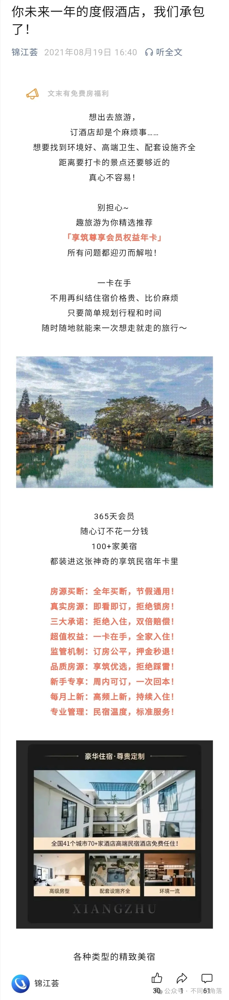

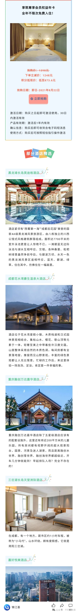

达人随心宿和享筑旅业的年卡模式，和之前的**如程、半边山下、寄居蟹**都差不多，入坑早的精明的会享受到福利轻松回本甚至血赚，入坑晚的，就不用说了，网上自己搜索吧。这两家民宿卡现在的情况，大家可以网上搜索一下就知道了。

**锦江代表酒店**

锦江为业主或持有部分股份，非锦江旗下自家品牌酒店：

1、上海和平饭店：中国首家世界著名饭店，原1929年时建成开业的沙逊大厦华懋饭店，曾经的远东第一楼，建国后1956年开业的和平饭店北楼，2010年重新装修开业由锦江与费尔蒙酒店集团合资成立的锦江费尔蒙酒店管理有限公司管理，费尔蒙莱佛士酒店集团（2016年被雅高收购）旗下奢华五星品牌费尔蒙。

2、上海外滩华尔道夫酒店：国内第一家华尔道夫，锦江持股49%，上海久事持股51%，2010年开业，希尔顿酒店集团旗下奢华五星品牌华尔道夫，由新落成的现代化塔楼和一栋1910年建成的英国上海总会老楼(解放后为东风饭店，1998年停业)组成。

3、上海斯沃琪和平饭店艺术中心：旧上海时的汇中饭店，建国后1956年开业的和平饭店南楼，2012年改为斯沃琪和平饭店艺术中心。

4、上海锦江汤臣洲际大酒店：国内第一家洲际酒店，1996年开业，洲际酒店集团旗下豪华五星品牌洲际。

5、上海花园饭店：1990年开业，由一栋33层新楼和旧上海时法国上海总会老楼组成，大仓日航酒店集团旗下大仓品牌。

6、上海东锦江希尔顿逸林酒店：2001年开业，希尔顿旗下希尔顿逸林品牌。

锦江旗下自家品牌经典酒店：

1、上海锦江饭店：锦江集团始创酒店，由董竹君开办的锦江川菜馆和锦江茶室搬迁至华懋公寓挂牌成立，后来又并入茂名公寓，新建锦楠楼，并由此衍生出了后来的锦江集团。

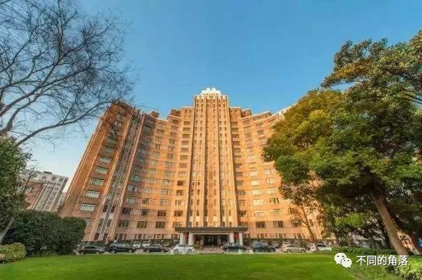

2、上海中心J酒店：锦江打造的奢华五星品牌J酒店，位于中国第一高楼（世界第二高楼）上海中心大厦84至110层，是世界上酒店大堂最高酒店。

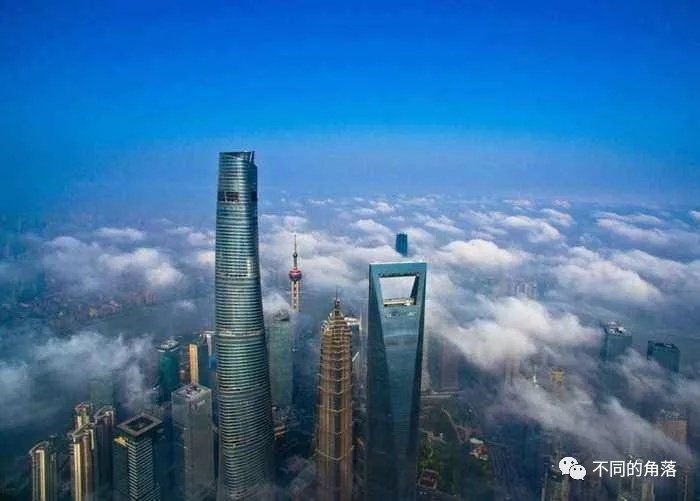

3、北京昆仑饭店：原公安部直属酒店，1987年改制由锦江接手，由此衍生出了锦江旗下豪华五星品牌昆仑。

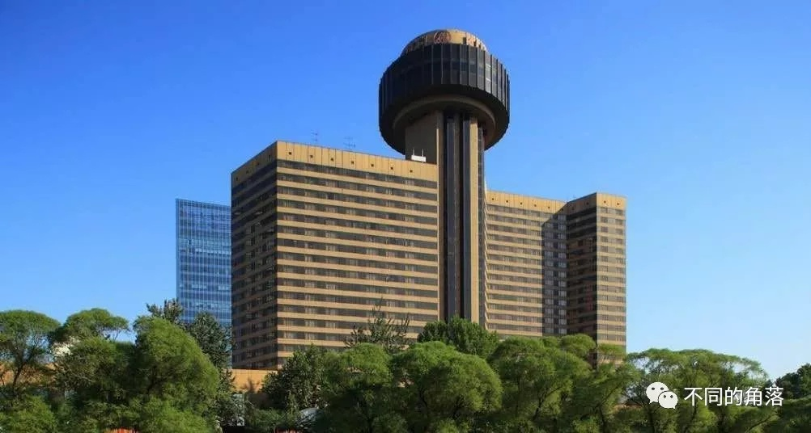

4、上海静安昆仑大酒店：原上海静安希尔顿，1988年开业，国内第一家希尔顿酒店，2018年合约到期后锦江收回翻牌成自家旗下豪华五星品牌昆仑。

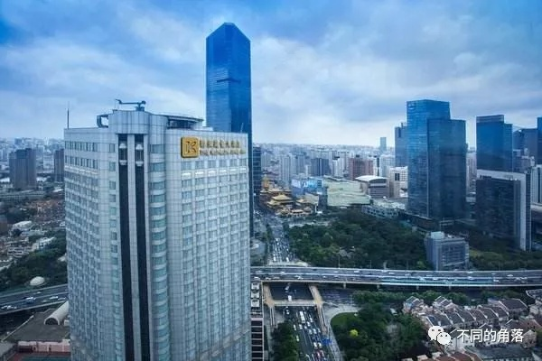

5、上海锦江国际饭店：原1934年开业的国际酒店，建成后超过沙逊大厦华懋饭店（和平饭店）成为当时全国也是当时亚洲最高建筑，有三十年代“远东第一高楼”之称，1983年之前的上海第一高楼，旧上海外滩三大高楼之首，旧上海四大饭店之一。

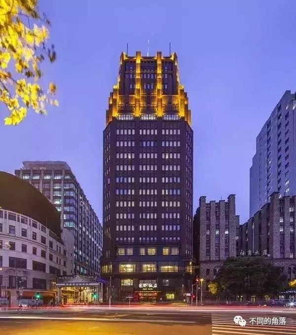

6、上海虹桥锦江大酒店：原上海威斯汀太平洋大饭店，国内的第一家威斯汀品牌酒店，1992年开业，后降级为虹桥喜来登太平洋大饭店，2017年合约期满锦江收回翻牌成自家旗下普通五星品牌锦江。

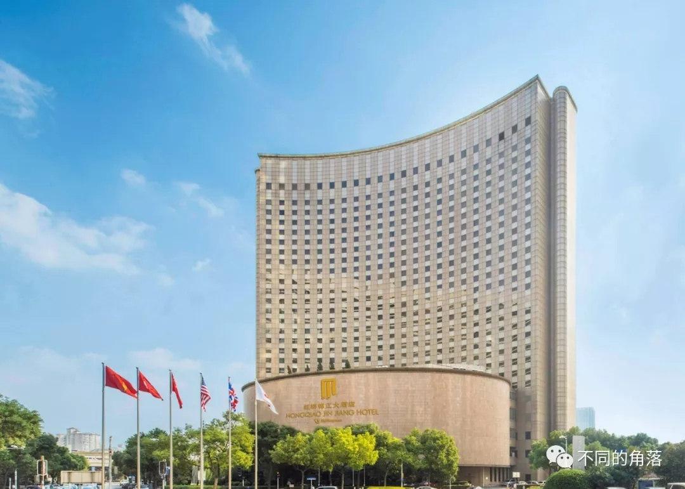

7、上海锦江华亭宾馆：原上海华亭宾馆喜来登，改革开放后利用外资兴建的第一批六大宾馆之一，1986年开业，国内第二家喜来登，后合约期满锦江收回翻牌成自家旗下普通五星品牌锦江。

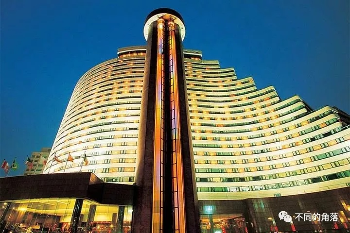

8、上海兴国宾馆：业主是上海东湖集团，委托丽笙管理。原建于上世纪30年代的太古洋行大班和太古洋行高级职员住宅，坐拥市内7万余平米花园，由20多栋英、德、法、美等国建筑风格历史老别墅和一栋16层新楼组成。其中一号楼为太古洋行大班住宅，建于1935年；现在对外营业的是2001年开业委托丽笙管理的新楼，老别墅都为长租房。

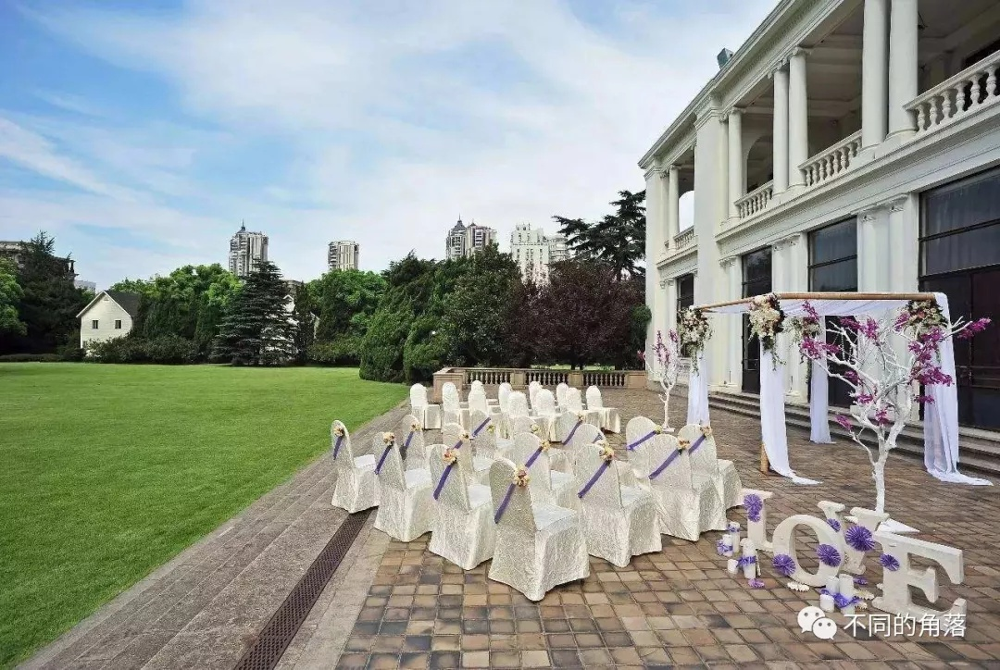

9、云南大围山锦江度假酒店：酒店位于有“中国最南端的春城”之称的云南省红河哈尼族彝族自治州屏边苗族自治县“滴水苗城”核心区域，有大、小温泉泡池10个，儿童戏水乐池个，水上乐园一座，成人游泳池1个，水景观池2个和热带风情园绿化美化景观。

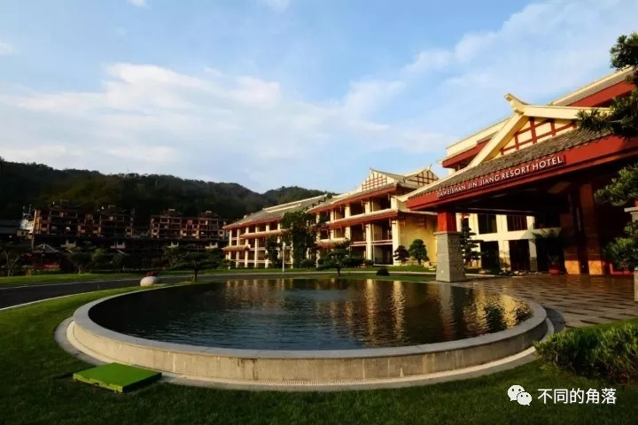

10、上海中信泰富朱家角锦江度假酒店：位于上海郊区1700多年历史的朱家角古镇，风景宜人的大淀湖湖畔，建筑设计以院落为主题，位置比朱家角安麓好。

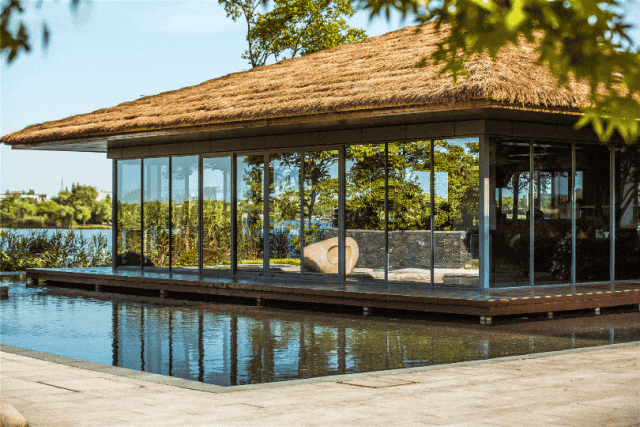

11、上海锦江金门大酒店：原1926年开业的金门大酒店，意大利建筑风格，1958年改名为华侨饭店，1992年又恢复原名金门大酒店。

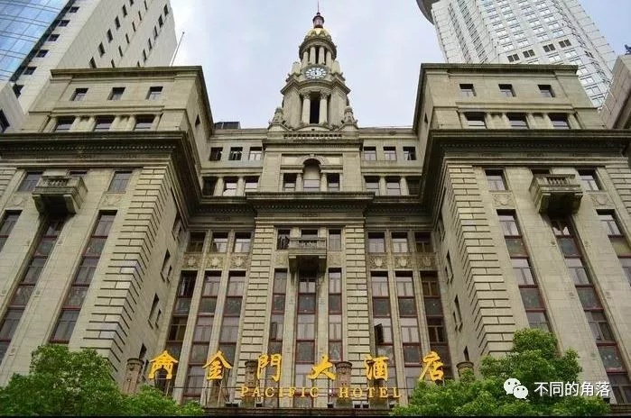

12、江苏锦江南京酒店：原1936年开业的“国际联欢社”，为当时的国民政府和社会名流主要交际场所。1949年新中国成立后更名为南京饭店，承担着重要的国宾接待任务，曾接待过毛泽东、周恩来、陈毅等党和国家领导人以及越南、柬埔寨等外国元首。酒店由紫金楼(主楼)、紫霞楼(附楼)、国际联欢社和潮州园、集庆楼等组成。2006年改制更名为锦江南京饭店。

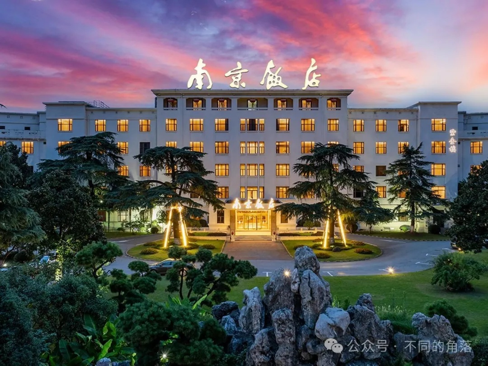

13、锦江都城经典上海南京路步行街南京饭店：原1931年开业的上海南京饭店。

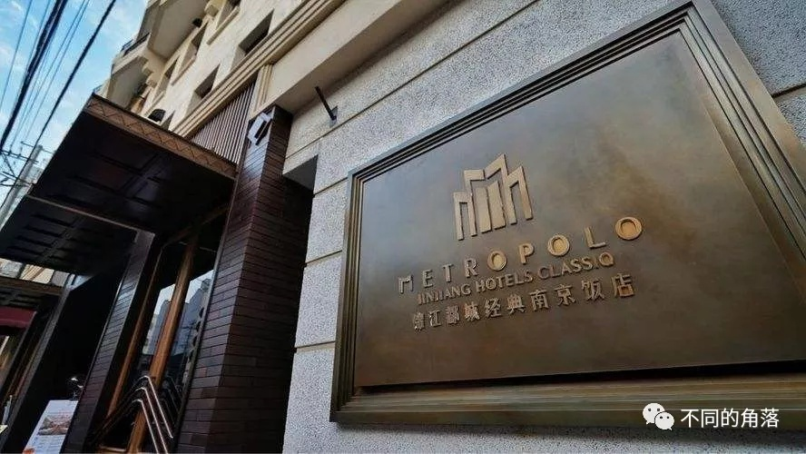

14、锦江都城经典上海南京东路外滩酒店：原1931年开业的旧上海时著名百货商场工联大厦。

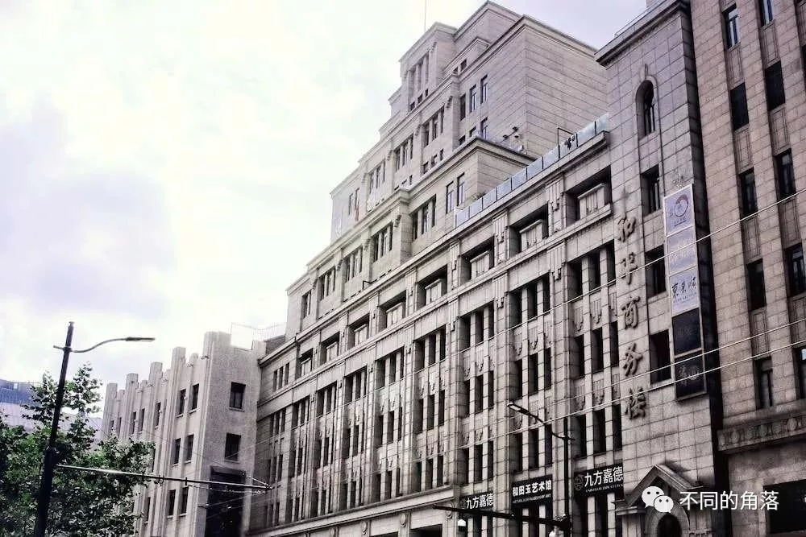

15、锦江都城经典上海青年会人民广场酒店：原1931年开业的中国基督教青年会大楼，俗称“八仙桥青年会大楼”。

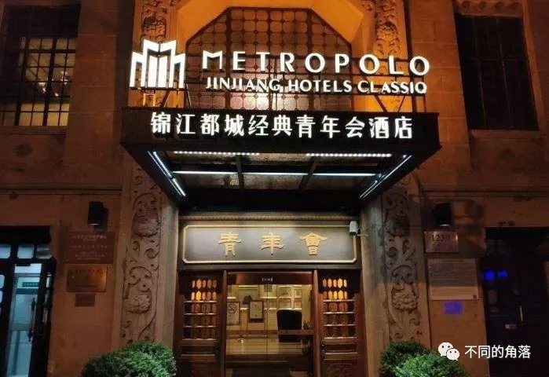

16、锦江都城经典上海新城外滩酒店：原1934年开业的上海都城饭店，与和平饭店风格一致，有小和平饭店之称，在旧上海时是“大上海名人社交中心”。

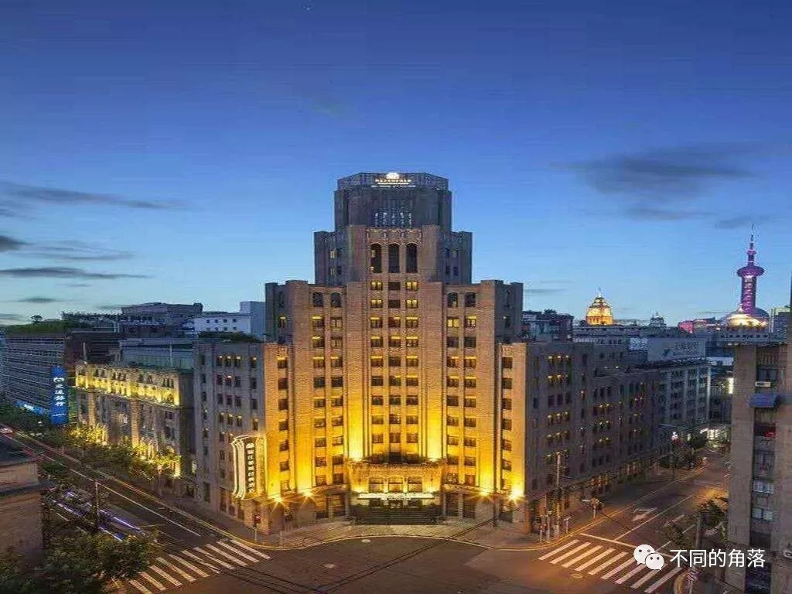

17、锦江都城经典上海外滩新亚酒店：原1934年开业的旧上海第一家由中国人创办和经营的酒店—新亚大酒店，现被锦江翻牌成收购的法国卢浮酒店集团旗下郁锦香品牌，现为上海外滩郁锦香新亚饭店。

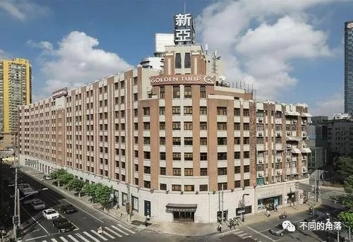

18、锦江都城经典上海静安寺酒店：原1934年开业的上海达华公寓，旧上海时有小国际饭店之称。

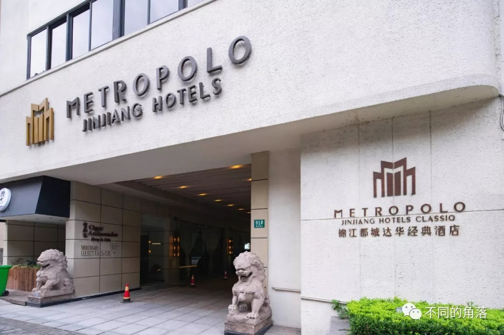

19、上海静安暻阁酒店：原锦江之星上海胶州路店升级翻牌，日式风格酒店，开业以来房价长期处于锦江旗下国内8000多家酒店的前十位。

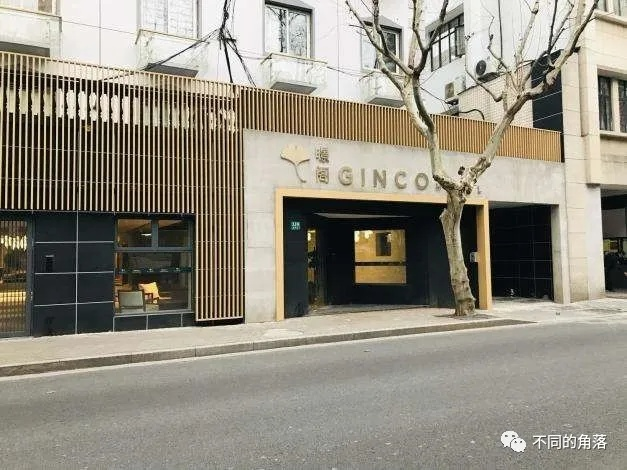

20、腾冲暻阁半山温泉酒店：暻阁品牌第三家店，酒店档次远高于暻阁第一家店和第二家店，应该挂牌锦江度假酒店更符合。

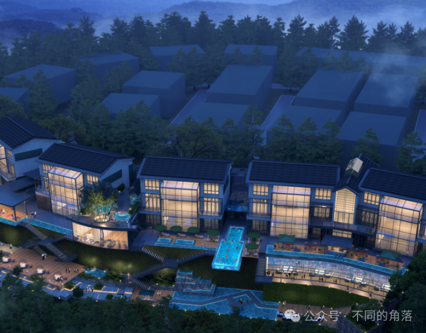

21、上海崇明信澜天地晖廷酒店：云居升级品牌晖廷云居首店，中信养老旗下CCRC旗舰项目信澜天地与锦江合作打造的文旅度假酒店。

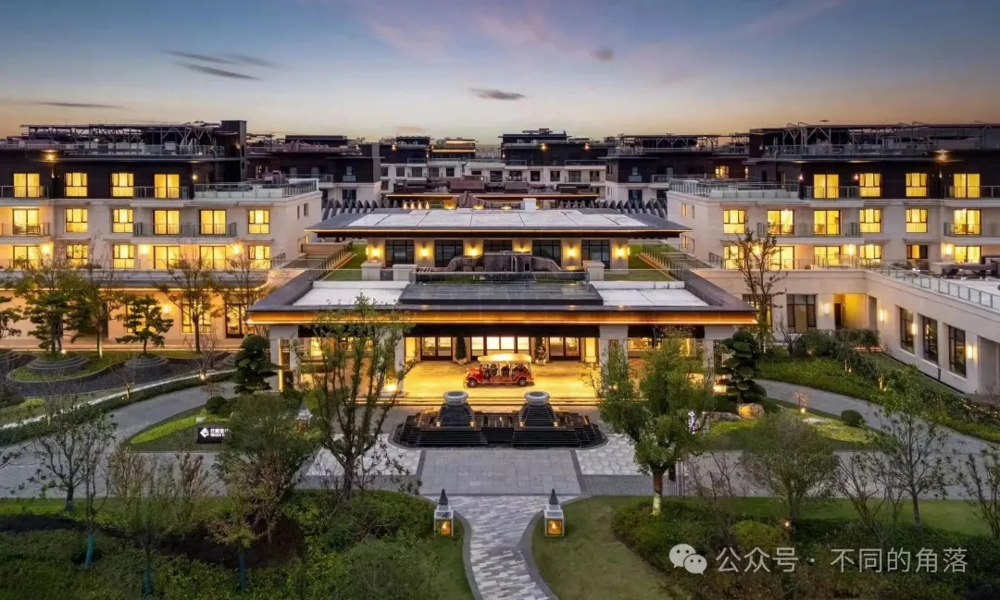

22、锦江之星品尚上海南京路步行街酒店：原1917年建成开业的上海先施百货公司大楼，被誉为“中华百货第一楼”，除经营环球百货外，还兼营旅馆、酒楼、游艺场，吃、喝、玩、乐应有尽有，被称作十里洋场的“销金窟”，百货大楼其中一部分是当年华人开设的国内第一家高等旅馆东亚旅馆。解放后，1952年先施公司歇业，原先施公司的东亚旅馆和东亚中西大酒楼合二为一，取名为“东亚饭店”。上世纪80年代，在老上海人心中，东亚饭店的早茶、音乐茶座及食街小吃成为当时上海餐饮、娱乐的创始典范。2011年锦江将东亚饭店划归锦江之星管理，锦江之星将其翻牌为锦江之星升级版锦江之星品尚首店，于2013年6月28日重新开业。

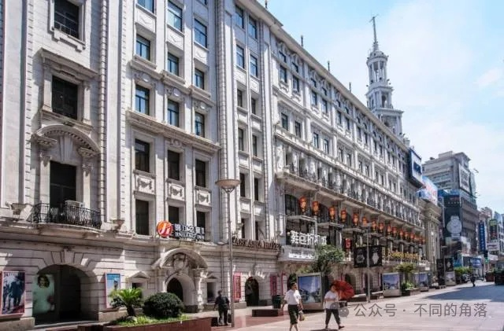

**锦江旗下酒店品牌****：**

1、原锦江旗下酒店品牌

高端品牌有奢华五星品牌J酒店、豪华五星品牌昆仑、高端品牌岩花园和锦江。

锦江品牌酒店从普通五星品牌锦江(豪华)、四星品牌锦江(高端)到三星级档次的都有，之前三星级的重庆欧瑞锦江商务酒店(现重庆欧瑞精品商务酒店)，在锦江官方平台可以预订的3种房型(酒店共6种房型)中，商务大床房和商务双床房2种房型都是无窗房。

岩花园是海岩创建的品牌，在10年前有一家店，是海岩开在北京顺义一片明清园林内的北京榈园黄花梨艺术馆岩花园酒店（现北京榈园黄花梨艺术馆），收藏有海岩多年来收藏的800多件黄花梨和紫檀木明清家具，后来不再做酒店用途。目前位于上海西郊的上海岩花园酒店在建中。

中档品牌锦江都城（包括锦江都城经典、锦江都城）、白玉兰，当初锦江积分房兑换把锦江都城经典品牌定义为和普通五星锦江(豪华)一档，锦江官方对锦江都城品牌的宣传则是定位国际四星级的文旅探索型中高端酒店品牌档次。不过实在搞不懂很多只提供住宿和早餐服务，还有众多无窗房的有限服务品牌锦江都城酒店，怎么能和国际四星级的文旅探索型中高端酒店划等号。

经济品牌锦江之星系列（包括锦江之星品尚、锦江之星、锦江之星风尚）、金广快捷。曾经的锦江之星，每家酒店除了早餐之外，茶餐厅还都提供中餐和晚餐，现在好像已经找不到提供中餐和晚餐服务的锦江之星酒店了。

超经济品牌百时快捷，也即是低端经济品牌。

2、原法国卢浮旗下酒店品牌

高端品牌皇家金煦(国内之前加盟的几家都已退出，国内目前无)，中档品牌郁锦香、金煦(国内之前加盟的几家都已退出，国内目前无)，经济品牌凯里亚德(Kyriad，国内拔高到中档)、康铂(Campanile，国内拔高到中档)、憬黎(Tulip Lodj)，经济品牌Première Classe(国内目前无)。还有卢浮收购的印度经济酒店Sarovar(国内目前无)。

3、原铂涛旗下酒店品牌

高端品牌铂涛菲诺(最初加盟的2家都是时间不长就退出了，后来加盟一家降级为中档品牌名称也改为菲诺房价200多元起，后来也退出了，目前无)，中档品牌丽枫、希岸系列（希岸Deluxe、希岸、希岸·轻雅）、喆啡系列(喆啡锐品、喆啡)、潮漫、满兮(ZMAX，由ZMAX潮漫分拆为潮漫和满兮2个品牌)、非繁系列（非繁城品、非繁轻简），经济品牌窝趣公寓、7天系列（7天、7天优品）、IU、派等。之前还有经济品牌7天阳光和中档品牌铂乐精选、品乐、瑞辰、城品。

4、原维也纳旗下酒店品牌

高端品牌维纳斯皇家，中档品牌维纳斯度假村、维纳斯国际、维也纳国际、维也纳好眠、维也纳、维也纳公寓、维也纳智好、维也纳3好，经济品牌诚悦。没被锦江收购之前，部分维也纳品牌酒店是四星级档次全服务酒店；现在很多维也纳国际品牌酒店也只是有限服务酒店。

5、原丽笙旗下酒店品牌

高端品牌丽笙精选、丽笙(Radisson Blue)、丽筠(Radisson)、丽祺(2020年推出品牌，国内目前无)，中档品牌丽亭、丽芮(Radisson Red)、丽柏、丽怡，经济品牌普利泽特(Prizeotel，国内目前无)。还有合作的高端品牌Art'otel(国内目前无)，是丽笙授权的欧洲、中东、非洲丽亭品牌特许经营方英国PPHE酒店集团旗下酒店品牌。

丽笙精选品牌刚推出时是定位豪华五星到奢华五星一档，结果后来将普通五星档次的扬子江万丽和上海海仑宾馆翻牌为丽笙精选，丽笙精选品牌也就成了普通五星到奢华五星档次都有的大杂烩品牌。

6、整合后新推出的酒店品牌

锦江国际酒店集团全球创新中心孵化的中档品牌欧暇·地中海、暻阁、云居系列(云居、晖廷云居、庭冉云居)、枫渡、原拓、荟语、舒与、缤跃、亦岚、陶瑞。

锦江旗下目前虽然有近60个品牌，但旗下为大众熟知的酒店品牌只有7天、锦江之星、丽枫、希岸、喆啡、维也纳、维也纳国际、锦江都城等不到10个品牌，都是经济品牌和中档品牌。

**常旅客会员计划****：**

锦江的常旅客会员计划，就像一条豆腐渣工程的公路，三五个月修补一次，一两年大修一次。

这十多年来，锦江常旅客会员计划变更了多少次，估计锦江酒店管理层都回答不出来，更不用说锦江客服和锦江旗下酒店员工了。导致的后果就是锦江酒店客服、锦江酒店员工都经常搞不清楚各个品牌的会员权益，锦江酒店会员应有的权益经常被抹杀。

2023年11月终于推出正常的锦江荟会员计划，几次调整后，目前算是锦江历年来最正经的常旅客会员计划了。

**简单捋一捋锦江十多年来的会员计划调整**。

之前有锦江礼享(高星级酒店)和锦江锦江之星(经济酒店)两个会员计划。有锦江之星APP和锦江礼享APP。

锦江礼享客服电话10101666，锦江之星客服电话4008209999。

锦江之星会员计划只有锦尚会员和蓝鲸会员两种等级，蓝鲸卡需要花费158元购买。

锦江礼享会员计划有经典卡、享卡、悦享卡、无限享卡四个等级。

2013年创建中档品牌锦江都城，成立锦江都城酒店管理有限公司，将锦江之星等经济酒店划归锦江都城酒店有限公司管理运营，又开发了锦江都城APP，当时共有锦江礼享、锦江都城、锦江之星三款APP。

2015年锦江旗下全服务酒店与有限服务酒店会员计划合并为一个锦江礼享会员计划。

锦江之星锦尚卡/原锦江礼享经典卡成为新的银卡，锦江之星蓝鲸卡/原锦江礼享享卡成为新的锦江礼享金卡，原锦江礼享悦享卡成为新的锦江礼享白金卡，原锦江礼享无限享卡成为不对外公开的新的锦江礼享黑卡。

两年入住80晚升级白金卡，两年入住60晚保级白金卡。

也可以直接1858元在部分锦江品牌酒店购买锦江礼享白金卡礼包（礼包含锦江酒店周末免房券2张、锦江酒店买一送一券1张、锦江酒店自助餐买一送一券2张、锦江酒店早餐券2张，还有其它客房升级券、折扣券），白金卡有双早。

原锦江礼享10101666客服电话与锦江之星4008209999客服电话合二为一，对外保留4008209999客服电话。

2017年3月推出了全新的锦江WeHotel礼享会常旅客会员计划，整合了原锦江和铂涛的会员体系，包括收购的法国卢浮酒店集团旗下部分进驻国内品牌，会员等级分为普卡V1、银卡V2、金卡V3、白金V4共4个等级，还有隐藏的黑卡V5等级。

一年入住30晚升级白金，一年入住20晚保级白金。

白金卡只有单早。

白金会员可以无限次用500积分兑换保级礼包保级白金。

当时国内上海的郁锦香、康铂、锦江都城经典酒店有售卖锦江白金卡，各店售价不同，价格568元、588元、598元三种。其余品牌门店有金卡、银卡售卖。

2018年将维也纳旗下品牌纳入锦江WeHotel礼享会员计划，同时维也纳还继续保持有单独的常旅客会员计划。

2018年12月18日，锦江将WeHotel礼享会会员计划拆分为运营全服务酒店(当时70家，2家昆仑品牌68家锦江品牌)的WeHotel尊享会会员计划和和运营有限服务酒店的WeHotel礼享会会员计划，原锦江WeHotel礼享白金卡变成WeHotel礼享白金和WeHotel尊享金卡。

尊享金卡一年内入住20S升级尊享白金卡，尊享白金卡一年内入住10S保级白金卡。

礼享白金卡入住丽枫等多个原铂涛旗下品牌，不再有免费早餐权益。

2019年4月8日，锦江旅行APP、铂涛旅行APP统一升级合并为锦江酒店APP。

2019年5月，锦江将国内开业的卢浮旗下郁锦香品牌酒店纳入锦江WeHotel尊享会员计划。

2019年7月，锦江将国内开业的丽笙旗下18家酒店(丽笙精选、丽笙、丽筠以及北京2家全服务丽亭酒店)纳入锦江WeHotel尊享会员计划。后期又将丽怡、丽柏品牌纳入锦江WeHotel尊享会员计划。

2019年7月，锦江WeHotel礼享会员计划将原来的普卡升级为蓝卡。

尊享白金卡价格1688元（免费房券1张、套房代金券500元1张、行政客房300元代金券1张、普通客房100元代金券1张，早餐券1张、自助餐买二送一1张以及洗衣券、饮品券等），只限上海锦江饭店、北京昆仑饭店、上海新锦江大酒店、上海虹桥锦江大酒店、上海华亭宾馆5家酒店有售。

昆仑/锦江品牌酒店购买尊享金卡价格298元（送1500尊享积分、早餐券1张、客房代金券100元1张、客房代金券50元1张）。

自2018年12月拆分会员计划后，锦江礼享白金会员可以可以无限次10元钱购买或是500积分兑换保级礼包保级礼享白金。

2019年时尊享白金会员可以购买98元保级礼包保级尊享白金会员。

2020年3月，锦江合并WeHotel尊享会与礼享会，重新恢复为只有一个会员计划，但继续保留尊享酒店（原尊享会酒店）与非尊享酒店（原礼享会酒店）之划分，入住还是分别累积尊享积分与标准积分（原礼享积分）。白金卡入住丽枫等原铂涛旗下部分品牌仍无免费早餐。

后续又将丽柏、丽怡、欧暇地中海、暻阁品牌纳入尊享酒店，入住累积尊享积分。

尊享会礼享会合并后，可以无限次10元钱购买保级礼包保级白金。

2020年9月，10元保级礼包下线，推出过38元保级礼包几天后也下线了。

锦江白金卡开启多渠道免费匹配。各品牌门店只卖金卡、银卡，各品牌酒店购买锦江金卡、银卡价格不同，同一品牌不同门店价格有时也不相同。

昆仑/锦江品牌酒店购买尊享金卡价格298元（送1500尊享积分、早餐券1张、客房代金券100元1张、客房代金券50元1张）。

郁锦香品牌酒店购买银卡98元，购买金卡198元，其中上海虹桥郁锦香酒店不卖锦江酒店会员卡。

丽怡/丽柏品牌（国内那时由维也纳运营管理）酒店购买银卡48元，购买金卡168元。

丽笙旗下其它品牌国内酒店不卖锦江酒店会员卡。

锦江都城经典/锦江都城/锦江之星/金广快捷/白玉兰/百时快捷门店购买银卡68元。

在康铂/凯里亚德门店购买银卡48元（康铂48元仅限康铂品牌使用，半年有效期，凯里亚德48元无额外代金券）/88元（凯里亚德有2张20元、1张30元代金券）。

锦江之星/金广快捷/白玉兰/百时快捷门店购买金卡99元。

康铂/凯里亚德国内门店购买金卡168元。

锦江都城/锦江都城经典门店购买金卡188元。

金熙/皇家金熙国内门店不卖锦江酒店会员卡。

丽枫门店购买银卡价格49元/99元，购买金卡价格199元/269元。

希岸系列门店购买银卡价格48元/58元，购买金卡价格138元/158元/198元。

喆啡系列门店购买银卡价格58元，购买金卡价格109元/158元/238元。

非繁系列门店购买银卡价格49元，购买金卡价格158元。

潮漫门店购买银卡价格49元，购买金卡价格158元/258。

ZMAX门店购买银卡价格99元，购买金卡价格159元/269。

打了几十个电话咨询不同品牌几十家门店，各品牌各门店关于同一等级会员卡价差原因也是各种说法都有，很多都是很一本正经的胡说八道。

相同等级会员卡的价差原因：有的门店说价格贵的多了一些优惠券（感觉这个算是唯一合理的说法，尽管锦江各品牌优惠券在锦江酒店APP有活动时经常可以免费领)；有的门店说价格便宜的金卡可以延时至15点退房，价格贵的金卡可以延时至16点退房（锦江官网和锦江酒店APP上品牌礼遇里这几个品牌白金卡退房时间都才是延时至14点）;有的门店说价格便宜的金卡只能在非尊享酒店用，价格贵的金卡可以在所有酒店用。

丽枫、希岸系列、喆啡系列、潮漫、非繁系列这五个原铂涛品牌都有单独的会员，价格都是99元，都是只适用单个品牌（比如丽枫会员只适用于全国丽枫品牌门店），房价都是8.5折（相当于锦江WeHotel白金卡），房间可以延时至下午15点退房（锦江WeHotel白金卡是延时至下午14点），早餐待遇相当于锦江WeHotel白金卡。一年住够单品牌酒店30晚保级，下一年度还可以享受同样待遇，如果没住够30晚，看一年入住房晚数，降一至2级，房价为9.0折和9.5折。

2021年1月18日，锦江会员积分体系再度变更，将原来的尊享积分和标准积分合并为锦江积分，标准积分余额按1:1比例转换为锦江积分，尊享积分余额按1:2比例转换为锦江积分，又重新恢复到2018年12月18日推出尊享酒店前只有一种锦江积分状态。

2021年3月18日，锦江酒店中国区系列品牌中的40个有限服务酒店品牌，包括被拉进尊享酒店充数的丽柏、丽怡、丽亭、郁锦香、欧暇·地中海品牌以及所有非尊享酒店品牌，在锦江官方渠道线上预订（不包括在维也纳、丽笙、卢浮官方平台预订），会员在不同品牌酒店享受统一会员折扣和延时退房权益，会员早餐权益还是不保证，多个品牌白金入住还是无早餐。

会员早餐权益还是不保证，多个品牌酒店白金会员入住还是无早餐。

2021年6月19日，锦江酒店APP下线了锦江旗下丽笙系列丽笙精选、丽笙、丽筠、丽亭4个高端品牌国内酒店，丽笙系列的丽芮、丽怡、丽柏3个中档品牌国内酒店并未下线。

我打电话给锦江客服咨询，锦江客服告诉我说酒店下架就是不和锦江合作了，不是锦江旗下酒店了，和锦江没有半毛钱关系了。我问客服确定不，客服告诉我确定。

我再打电话给丽笙客服咨询，丽笙客服告诉我只是暂时调整，过段时间还会上线，一个多月后重新上线了。

2021年7月1日，锦江旗下维也纳绅士会常旅客会员合并到锦江会员俱乐部常旅客会员计划。

原绅士会会员可按不同的等级匹配锦江会员，并以合并当天（2021年7月1日）为起始，设置会员等级保护期（原维也纳绅士会会员只有绅士卡才需要保级，每年8晚保级，其余等级都不需要保级；锦江银卡、金卡、白金卡明面上还都需要保级）。

原维也纳绅士会积分1:1转换为锦江会员积分。

神奇的是维也纳至尊钻石卡可以匹配2年半锦江白金，最高等级的绅士卡却只能匹配一年半锦江白金，绅士卡是维也纳会员体系里唯一需要保级的会员等级，保级不成功降为至尊钻石卡。

2021年7月1日，上海扬子江丽笙精选酒店（原普通五星档次的上海扬子江万丽酒店）、上海丽笙精选海仑宾馆（远普通五星档次的上海索菲特海仑宾馆）、南京丽笙精选度假酒店开业，本来以为丽笙精选可以对标洲际历史经典酒店，现在发现丽笙精选品牌成了大白菜。

扬子江万丽翻牌为丽笙精选后，万豪白金及以上会员可以拨打扬子江丽笙精选酒店电话免费匹配为丽笙丽赏会金卡会员（无早餐无行政待遇）和锦江白金会员（有早餐有行政待遇），本来以为活动搞半年就差不多结束，2022年上半年我打电话问酒店，酒店告知仍旧可以免费匹配。

2021年7月中旬，锦江会员入住非尊享酒店部分品牌早餐权益变更，但还是限会员预订正价房才享受免费早餐权益，丽枫、潮漫、ZMAX等多个品牌还是无早餐，锦江都城品牌酒店早餐由1人升级至2人，但锦江都城经典品牌的单人免费早餐权益消失（最初是免费双早权益）。

锦江官方宣传锦江都城品牌时都会用锦江都城经典品牌酒店来举例提高锦江都城牌高大上形象，给锦江都城品牌会员权益时就把锦江都城经典品牌一脚踢开了，毕竟6家锦江都城经典门店早餐都贵（68元到108元），取消免费改成收费能给一切朝钱看的锦江带来很大创收呢。

2021年11月30日，维也纳酒店APP升级为锦江酒店APP，锦江历时多年终于完成旗下国内酒店APP的整合。

2021年12月27日，锦江酒店APP发布锦江豪华经典酒店会员，与2018年12月18日刚发布锦江尊享酒店会员时相同，将锦江嫡亲的三个高端品牌J酒店(1家)、昆仑(2家)、锦江(55家)。

2021年12月28日，锦江酒店APP由5.4.0版更新至5.5.0版，重新发布豪华经典酒店会员权益，除了J酒店、昆仑、锦江这三个划至豪华经典酒店品牌外，以及丽笙精选、丽笙、丽筠和北京2家丽亭外，其余品牌国内会员计划更名为优选酒店会员计划。

国内丽笙旗下几个高端品牌酒店丽笙精选、丽笙、丽筠和北京2家丽亭未划入豪华经典会员计划也未划入锦江优选酒店会员计划。

锦江豪华经典酒店卓越卡和大使卡早餐权益由之前单早恢复为双早。

2022年10月，锦江优选酒店积分房重新上线，相比之前有了重大变更。

金卡和白金卡会员兑换积分房自带早餐（部分房型单早，大多数房型都是双早），当然还是仅限有早餐权益品牌酒店（唯一例外目前6家锦江都城经典品牌酒店积分房兑换都显示有双早，不知道后期是否会调整）和有早餐门店，丽枫、潮漫、非繁系列等无早餐权益品牌积分房仍然没有早餐，部分有早餐的7天酒店积分房也有早餐。

锦江优选品牌酒店全系列都可以积分兑换，全部房型都可以积分兑换。

当天可以兑换（之前只能提前一天以上兑换）。

兑换所需积分与房价有关，积分兑换比例大约在40分/元（按门市价算）。也就是不同等级会员兑换同一酒店同一房型所需积分相同，比如门市价499元/蓝卡475元/银卡450元/金卡425元/白金399元/官网专享价344元的房型兑换所需积分20000分。

锦江豪华经典酒店品牌里昆仑、锦江品牌酒店兑换还是需要提前一天以上兑换，还是只有基础房型可以积分兑换，积分房还是无早餐（豪华经典酒店卓越卡/大使卡有双早权益），积分兑换比例豪华经典酒店大约40—45积分/元，非豪华经典酒店大约45—50积分/元；J酒店未开放积分兑换。

丽笙高端品牌酒店未恢复积分兑换。

上海静安暻阁酒店（中档有限服务酒店）未开放积分兑换。

2022年11月中旬，锦江积分贬值，非豪华经典酒店积分兑换比例由40—50积分/元调整为大约80积分/元。同时J酒店积分房上线。

2023年2月底，锦江品牌圣地酒店唐山锦江贵宾楼饭店退出。在锦江酒店APP上还可以查询到唐山锦江贵宾楼酒店，但每天都是满房状态无法预订；OTA平台上酒店名称目前也未更改，可以正常预订，价格相比之前小幅上涨，近期价格基础房166元左右，之前基础房130多元。

唐山锦江贵宾楼饭店隶属于唐山饭店(集团)，是一家三星级档次酒店，之前与唐山饭店一起都是加盟了锦江旗下豪华高端品牌锦江，由锦江(北方)管理有限公司管理运营，唐山饭店于几年前先退出了锦江，唐山锦江贵宾楼饭店于2023年2月退出锦江。

唐山锦江贵宾楼饭店之前常年房价150元左右起，是锦江旗下锦江品牌酒店里房价最便宜的，之前入住过两次高级大床房，感觉客房设施比很多中档品牌酒店好一些，早餐（在唐山饭店吃早餐）更是比大多数中档品牌酒店好很多。

2023年3月初，锦江旗下中档品牌锦江都城金卡/白金卡的免费早餐权益消失。锦江都城品牌（包括锦江都城和锦江都城经典）的早餐权益几度变更，从之前的白金卡免费双早，改成白金卡免费单早，又改成白金卡免费双早，然后将6家锦江都城经典品牌早餐权益砍掉，现在又将锦江都城品牌的早餐权益砍掉。

时隔半个月后，锦江都城品牌金卡/白金卡的免费早餐权益悄悄恢复(估计是被骂惨了，才恢复的)，当然锦江都城经典品牌酒店（目前国内5家正宗锦江都城经典品牌酒店+2家不太正宗锦江都城经典品牌酒店）的免费早餐权益还是没有恢复；每次锦江推介锦江都城品牌时，都是以锦江都城经典品牌酒店的历史、设施、照片来宣传，谈到会员权益时，锦江都城经典权益就被阉割了。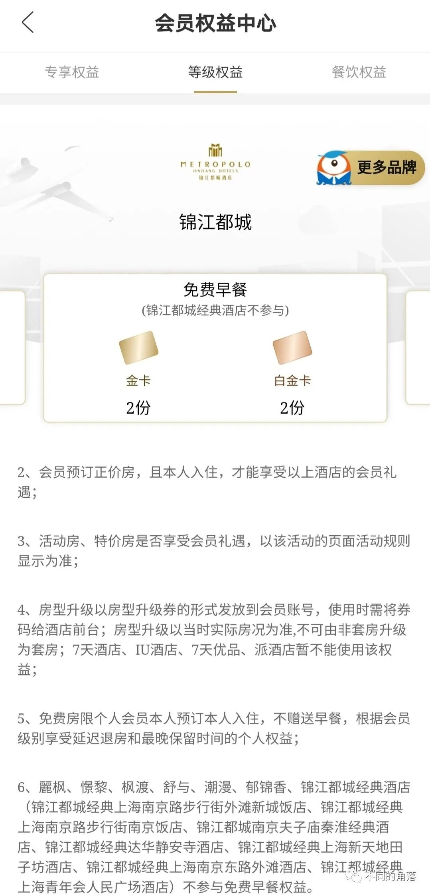

对于锦江会员计划朝令夕改，广大锦江会员早已习以为常。

另外此次备注特意写明郁锦香品牌没有免费早餐权益，结果郁锦香品牌页面又写明有免费早餐权益，自相矛盾事情锦江干得越来越顺手了，果然很锦江。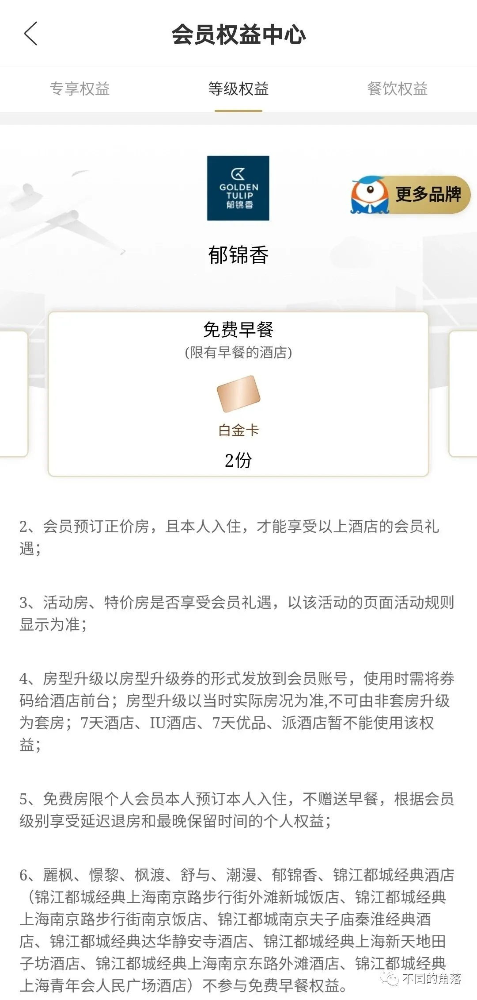

2023年5月11日，锦江发布了所谓全新升级的锦江酒店中国区新版会员计划。

将锦江豪华经典酒店会员计划与锦江优选酒店会员计划合并。同时将锦江预制菜（锦大师）、锦江旅游、锦江租车（锦江出行）三家会员也统一合并到一个锦江会员计划里。锦江预制菜、锦江旅游、锦江租车消费也可累积锦江积分用于锦江会员升级、保级。

郁锦香品牌的白金会员免费早餐权益消失（2023年3月锦江调整会员计划时备注里写着郁锦香品牌无早餐权益，但郁锦香品牌会员权益里还写着有免费双早权益）。

锦江积分有效期调整为自获得起到第二年年底。之前宣称积分永久有效，后来又调整为高级会员积分永久有效，现在变成不足2年。

每月15日设定为锦江会员日，会有秒杀和抽奖活动。

丽枫、憬黎、枫渡、舒与、潮漫、锦江都城经典这些品牌还是不参与免费早餐权益，锦江白金会员预订入住这些品牌酒店还是没有免费早餐。这次新将郁锦香品牌也添加到了无免费早餐权益品牌里。

锦江旗下有限服务品牌酒店付费入住还是只有预订正价房才可以享受会员权益。

国内23家丽笙高端品牌酒店有16家可以在锦江酒店查询到，其中几家酒店很长一段时间都可以预订并显示可以享受锦江会员权益；几家酒店5月13日起不能再预订也告知不能再享受锦江会员权益；几家酒店所有日期都不能预订全部显示满房状态。

不能在锦江酒店APP上查询到的7家酒店，有的告知可以在丽笙官方平台预订享受锦江会员权益，有的告知已与锦江无关可以在丽笙官方平台预订不能再享受锦江会员权益。

锦江酒店APP上会员计划里只有优选酒店会员权益页面明确写明免费房只有延时退房和最晚保留时间权益无其它权益，只有预订正价房才享受会员权益，高星酒店会员权益页面并没有这两条，之前高星酒店各种付费房价和免费房都享受会员权益。

电话咨询锦江客服，锦江客服一如既往的张嘴就来胡说八道，说锦江高星酒店免费房不享受会员权益，问他在锦江酒店APP上会员权益哪里有写，他找了半天说在锦江优选酒店会员权益页面有写，告诉他那上面明确写着是优选酒店，我问的是高星酒店，他无话可说然后说去反馈。

然后有自称锦江会员中心的工作人员来电话，说高星酒店免费房会员权益以预订页面显示为准，告诉她高星酒店免费房预订页面只有显示积分兑换房无早餐，并无显示是否享受会员权益，且还是写着非豪华经典会员无早餐，锦江更新会员计划已经没有豪华经典会员了。

这个工作人员也说去反馈，5月12日来电，客服明确说锦江高星酒店积分房不享受会员权益。问他为什么不像锦江优选酒店一样写清楚，男客服支支吾吾说会再反馈。

2023年5月15日，锦江再次修改会员计划内容，明确规定锦江高星酒店（J、昆仑、锦江、丽笙精选、丽笙、丽筠）积分房享受会员权益。

果然不愧是锦江，会员计划内容都写不明白，然后全球酒店业最不专业的一帮客服就自以为是按照他们的智商理解胡乱解答，非得锦江会员给它们指出问题才想起来修改。

同日，锦江官方预订平台下架锦江高星酒店（J、昆仑、锦江、丽笙精选、丽笙、丽筠），这些酒店在锦江会员APP上已经无法查询到。

2023年5月下旬，锦江高星品牌（J、昆仑、锦江、丽笙精选、丽笙、丽筠）重新上线锦江会员APP。上海兴国宾馆丽笙精选、上海虹桥西郊庄园丽笙、天津水游城丽筠、重庆融汇丽笙、重庆南温泉丽筠、武汉联投丽笙这6家之前就已下架的酒店仍旧没有上线锦江会员APP，咨询酒店均是说酒店和锦江无关，只是丽笙旗下酒店。

2023年6月8日，锦江再次更新会员计划。

除了窝趣公寓品牌外，锦江白金会员线上预订其它品牌（优选酒店限正价房）且本人入住都享有免费早餐（大多数品牌都是双早，限有早餐门店，低端的7天系列/百时快捷大多数都无餐厅无早餐、部分中档的丽枫/维也纳等品牌酒店无餐厅无早餐）。也就是锦江都城经典、郁锦香、丽枫、憬黎、枫渡、舒与、潮漫等品牌早餐权益回来了。

其实相当于回到了2017年3月推出所谓全新锦江WeHotel礼享会常旅客会员计划前的会员权益，并且相比那时的权益还是缩水阉割版。那时锦江白金入住锦江旗下百时快捷外其它品牌都有免费双早权益，铂涛白金入住铂涛旗下除窝趣和7天系外其它品牌都有免费双早权益，维也纳绅士卡/至尊钻石卡入住维也纳旗下所有品牌都有免费双早权益。并且那时还是线上线下预订本人入住所有房价都有免费早餐，不像现在优选酒店线上预订正价房本人入住才有。

锦江白金会员升房权益由每品牌每月一次调整为不限次（7天/7天优品/IU/派这4个品牌除外无升房权益），金卡会员每月可领取一张升房券升房一次。不过升房以酒店当时实际房况为准（也就是并不保证升房），最高可升一个档次房型，不可升级到套房，不可与通兑房、免费房、积分兑换房同时使用。但是，还是只有会员线上预订正价房且本人入住才可以享受会员权益。

锦江会员线上本人预订优选酒店且读取本人的实体二代身份证入住后才能获得积分。

品牌列表里再次出现锦江丽笙精选这个品牌。

知道锦江、丽笙精选这两个品牌，当时锦江丽笙精选这个品牌真的不清楚也不知道国内哪家酒店是锦江丽笙精选品牌。

打锦江客服电话咨询，一位男客服工作人员接听，问他国内哪家酒店是锦江丽笙精选品牌，客服很明确告诉我锦江丽笙精选是锦江旗下中高端酒店品牌，国内很多但不是每个城市都有。

再次告诉客服我知道锦江品牌和丽笙精选品牌但不了解锦江丽笙精选品牌，我就想知道国内哪家酒店是锦江丽笙精选品牌。这次感觉他也有些迷惘，告诉我说他去查一查，等了有一会儿，说上海虹桥西郊庄园丽笙大酒店是锦江丽笙精选品牌，我告诉他上海虹桥西郊庄园丽笙大酒店是丽笙品牌不是锦江丽笙精选品牌，他告诉我丽笙精选、丽笙、丽筠和北京两家丽亭都是锦江丽笙精选品牌，都是中高端品牌。意料之中，挂机。

之前未上线/已下线锦江官方平台的国内6家丽笙高端品牌酒店（上海兴国宾馆丽笙精选、上海虹桥西郊庄园丽笙、天津天诚丽筠、重庆融汇丽笙、重庆南温泉丽筠、武汉联投丽笙）仍旧未上线，酒店都是说和锦江无关系，只是丽笙旗下品牌。

2023年8月28日，上海临港锦江国际酒店开业。酒店属于锦江酒店集团与旗下的丽笙酒店酒店集团合作新推出的锦江丽笙精选品牌，是该品牌首店。终于知道了锦江丽笙精选这个品牌。

不过酒店还是锦江管理，不是丽笙酒店集团管理，酒店名称也和丽笙酒店没有半毛钱关系。

2023年8月22日电话咨询酒店，酒店员工明确告知酒店配备行政酒廊，酒店8月28日开业后也有欢乐时光等行政待遇。想来锦江丽笙精选品牌与现有锦江品牌的区别应该是锦江丽笙精选品牌酒店配备行政酒廊并有行政待遇。

2023年9月3日再次致电酒店，酒店员工告知行政酒廊还没有开，也没有行政待遇提供，说是目前属于试营业，9月28日正式开业后行政酒廊才会开放并提供欢乐时光等行政待遇。2023年9月28日酒店正式开业，行政酒廊还是没有开放自然也没有行政酒廊提供。2024年二季度，行政酒廊才开放，但行政待遇只有下午茶，并无欢乐时光。

2023年10月26日，锦江会员俱乐部微信公众号改名为锦江荟。

2023年11月1日，会员计划更名为锦江荟，锦江会员APP更名为锦江荟APP。

上海兴国宾馆丽笙精选、上海虹桥西郊庄园丽笙、武汉联投丽笙上线锦江荟APP，天津天诚丽筠、重庆融汇丽笙退出翻牌，重庆南温泉丽筠仍未上线。

2024年2月1日起，锦江官方APP锦江荟预订酒店，可以直接用积分按固定比例抵扣支付房费，积分用于优选酒店50积分抵扣1元，积分用于高星酒店25积分抵扣1元，每次最少500积分起抵扣。

10000锦江积分可以兑换200元的优选酒店或是400元的高星酒店。

2024年2月2日，锦江再次修改会员计划内容，锦江不同等级会员预订锦江高星酒店（J、昆仑、锦江以及丽笙系列品牌）都享受同样的会员专属价，预订锦江国内高星酒店锦江白金会员与普卡会员价格相同，预订国外锦江高星酒店（丽笙系列）甚至锦江白金房价比锦江普卡房价还要贵。

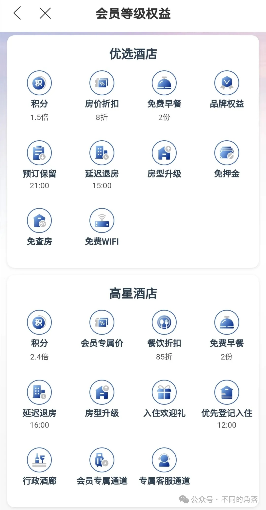

查看了沈阳海韵锦江国际酒店房价，白金卡会员与普卡会员房价相同，国内其它锦江高星酒店不同等级会员也都是相同价格。

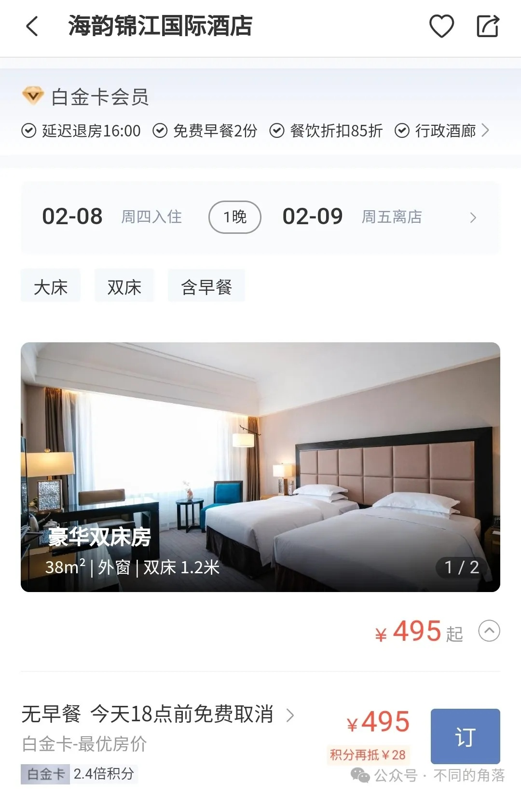

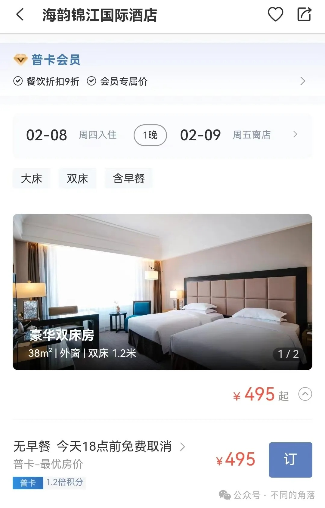

查看国外伦敦一家丽笙房价，所有房型锦江白金卡房价都比普卡房价贵，都无优惠券。想来是锦江觉得白金卡有免费早餐权益，普卡无早餐，所以白金卡房价比普卡贵，算是白金卡付费优惠购买早餐了。

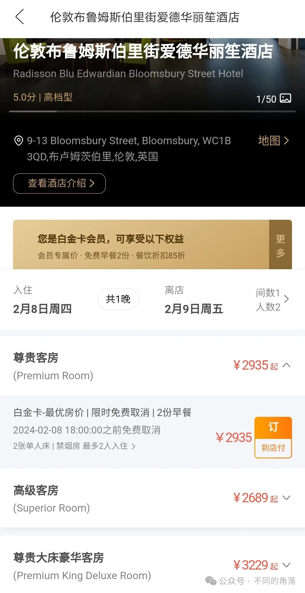

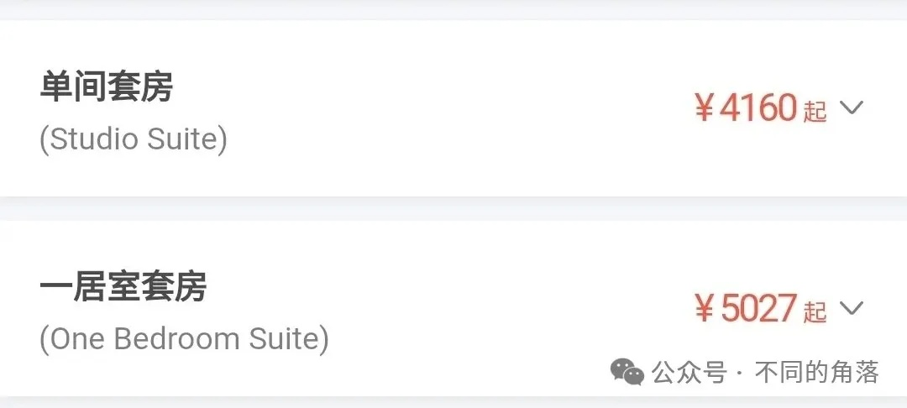

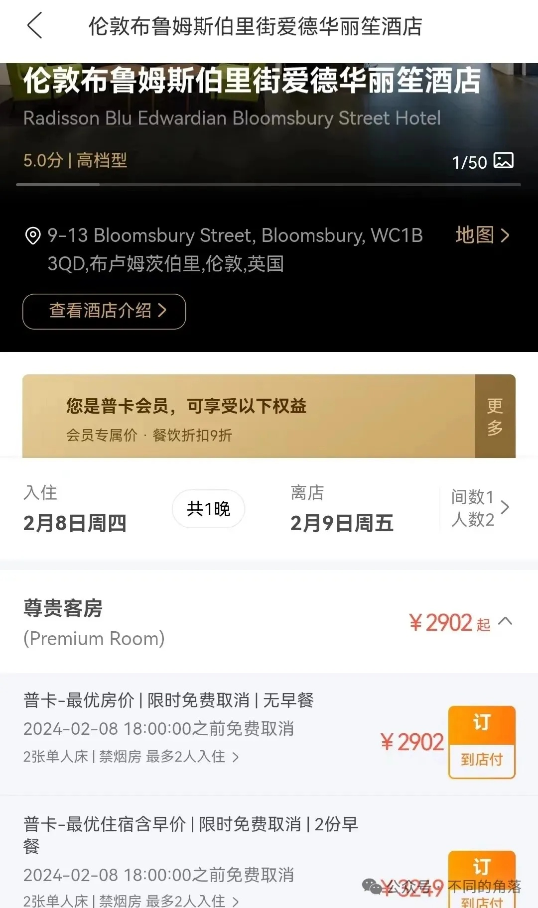

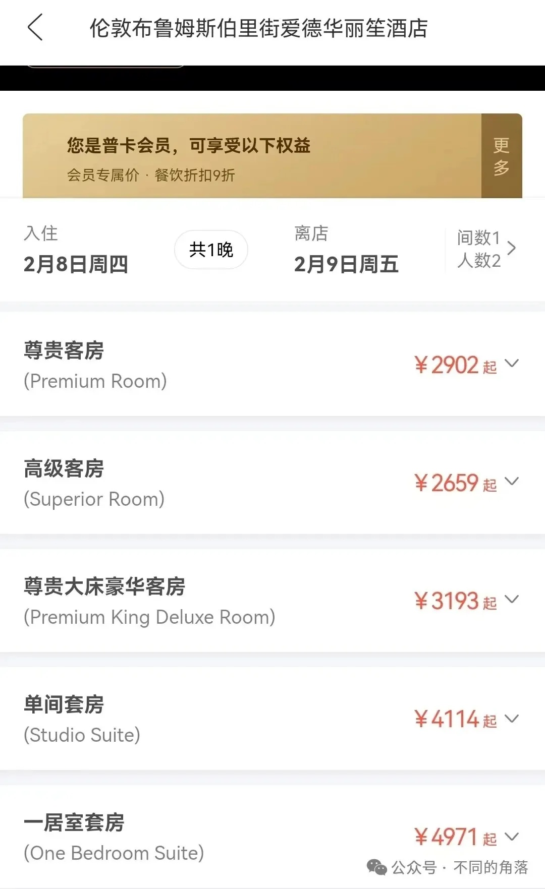

伦敦又查看两家酒店也是普卡便宜。

白金卡房价如下：

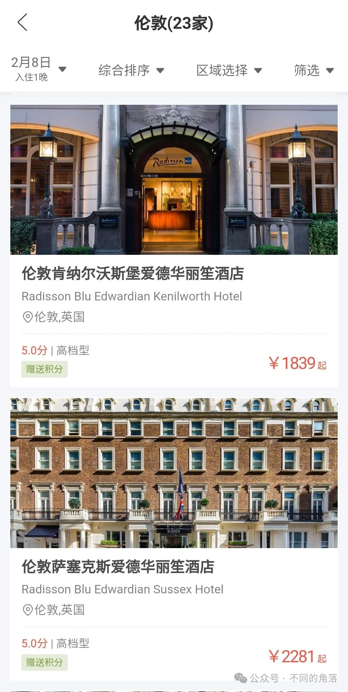        普卡房价如下：

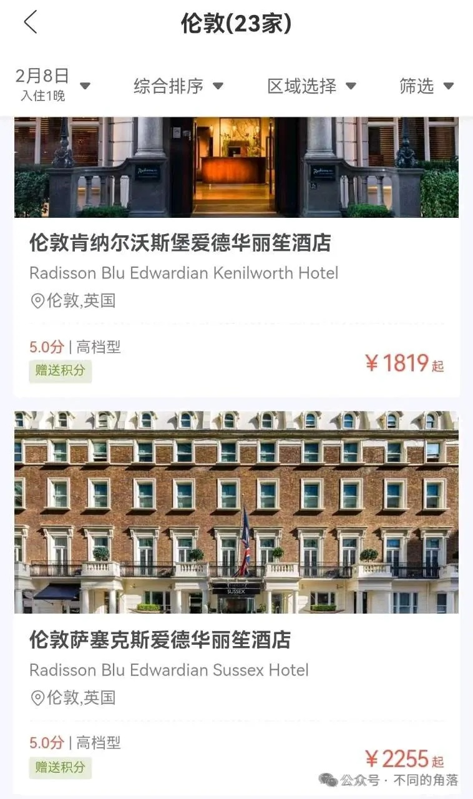

2024年2月下旬，锦江丽笙酒店官方宣布，自2024年2月1日起，丽亭酒店及郁锦香酒店品牌正式融入其管理体系（之前只有北京2家丽亭纳入锦江丽笙酒店）。

锦江丽笙酒店之前运营管理的73家国内高星酒店如下：

[锦江高星开业酒店统计2023版](http://mp.weixin.qq.com/s?__biz=MzU4OTczMzkwNw==&mid=2247514395&idx=1&sn=99d521abe7b2576f4e84ec7764acc643&chksm=fdcbf067cabc7971c2ae931e602e51e51159cd4e336e63ef845657837eaf614364b6193737a7&scene=21#wechat_redirect)

至此，锦江丽笙酒店运营管理的国内酒店品牌已经包括J酒店（1家）、岩花园（目前无，北京榈园岩花园酒店早已停业多年，上海一家岩花园酒店在建中）、昆仑（2家）、锦江（三星级到五星级档次，47家）、锦江丽笙精选（1家，上海临港锦江国际酒店）、丽笙精选、丽笙、丽筠、丽祺（目前无）、丽亭、郁锦香品牌，未来有可能加入更多品牌。

锦江官方宣称丽亭提供全方位服务，郁锦香是个性化高端全服务酒店品牌。

然而国内丽亭和郁锦香品牌的大多数酒店就是提供和如家、汉庭一样服务的有限服务酒店，很多连中餐厅都没有，同如家、汉庭一样只提供早餐。

如果说郁锦香和丽亭是全服务酒店品牌，那如家、汉庭、格林豪泰、城市便捷也都可以说是全服务酒店品牌了。

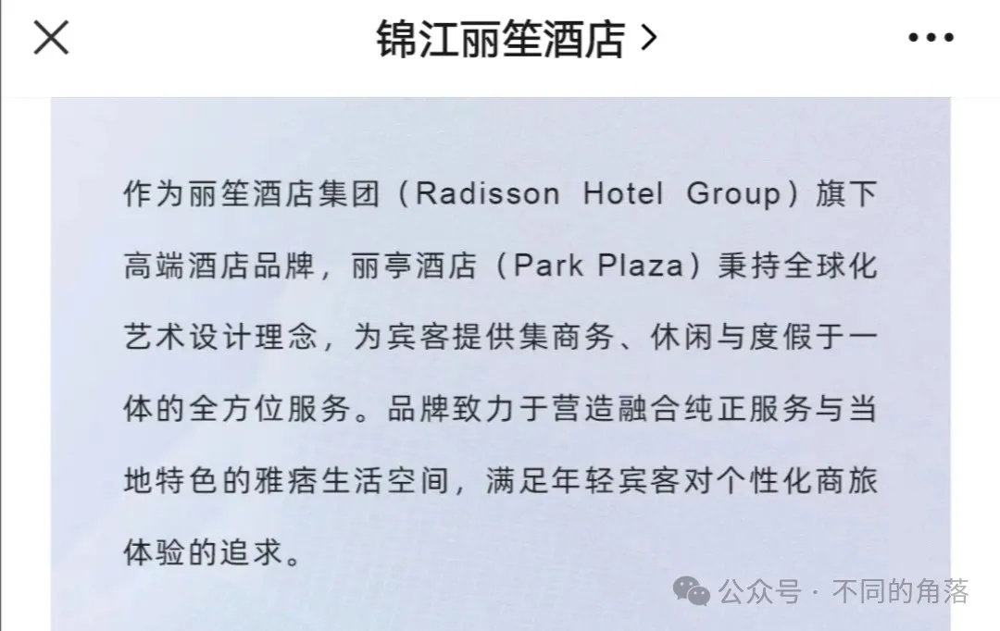

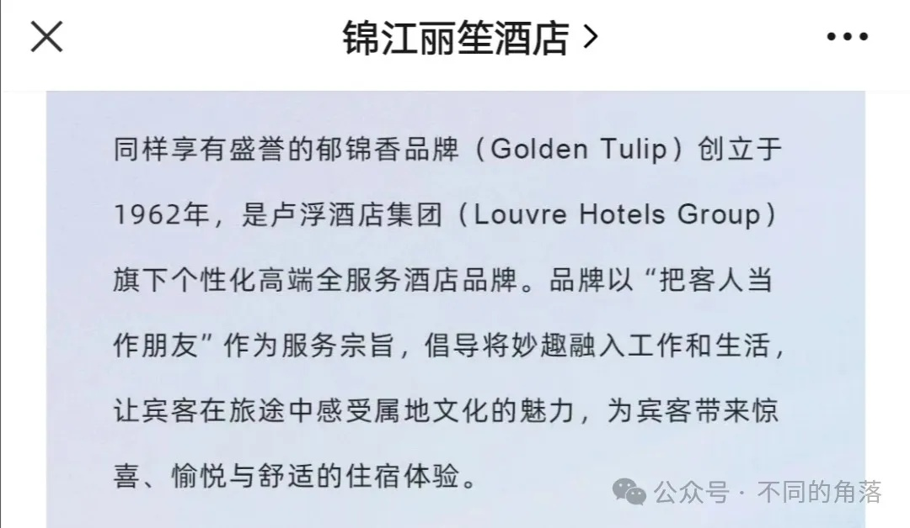

现在的锦江丽笙酒店，实际就相当于最初的锦江WeHotel尊享酒店和后来的锦江豪华经典酒店。

2024年6月上旬，锦江调整高星酒店积分抵扣比例，由25积分抵扣1元调整为50积分抵扣1元酒店，与优选酒店一致。

10000锦江积分可以兑换200元的优选酒店或是200元的高星酒店。

2024年7月3日，锦江再次调整高星酒店积分抵扣比例，由50积分抵扣1元调整为25积分抵扣1元。

10000锦江积分可以兑换200元的优选酒店或是400元的高星酒店。

2024年7月5日，锦江再次调整高星酒店积分抵扣比例，由25积分抵扣1元调整为50积分抵扣1元。

10000锦江积分可以兑换200元的优选酒店或是200元的高星酒店。

**锦江荟会员计划****：**

**升级保级规则**

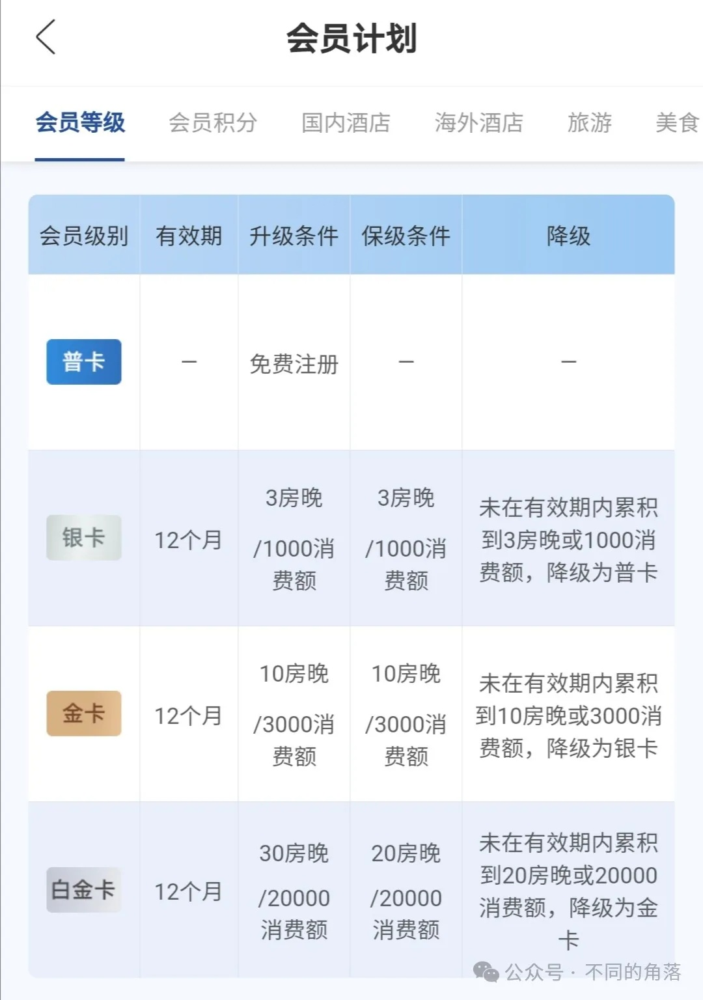

1. 通过锦江荟官方平台手机号注册成功即可成为普卡会员。

2. 锦江荟官方平台：锦江荟线上预订平台（锦江荟APP/公众号、锦江酒店官网/小程序/手机网页版、锦江丽笙酒店公众号/小程序、锦大师微信小程序、锦江旅游小程序）、锦江荟客服热线。

3. 房晚：

1) 国内酒店：会员本人通过锦江荟官方平台预订国内酒店且本人入住，有产生实付房费的房晚，可累积升级和保级房晚，离店48小时内赠送。（J酒店、昆仑、锦江、丽笙、丽笙精选、丽筠、丽亭、郁锦香等品牌赠送给入住会员账号）

2) 海外酒店：会员本人通过锦江荟官方平台预订海外酒店并入住，所产生实付房费的房晚，实际入住会员可累积升级和保级房晚，离店48小时内赠送。

4. 消费额：

1) 消费额均按人民币计算1元=1消费额，如消费的是外币则换算成人民币后再计算消费额，计算结果去除小数点取整。

2）国内酒店：按会员本人通过锦江官方平台预订并本人入住国内酒店的实付房费金额累积消费额，离店48小时内赠送。（J酒店、昆仑、锦江、丽笙、丽笙精选、丽筠、丽亭、郁锦香品牌赠送给入住会员账号）

3）海外酒店：会员本人通过锦江荟官方平台预订并入住，实际入住会员可获得实付房费金额累积的消费额并在离店48小时内赠送。

4）旅游：按会员通过锦江荟官方平台购买旅游产品产生的实付金额累积消费额，订单完成后15天内赠送。

5）美食：按会员通过锦江荟APP-美食、锦大师微信小程序购买美食产生的订单实付金额（含积分抵扣金额）累积消费额，订单完成48小时后赠送。

**会员积分规则**

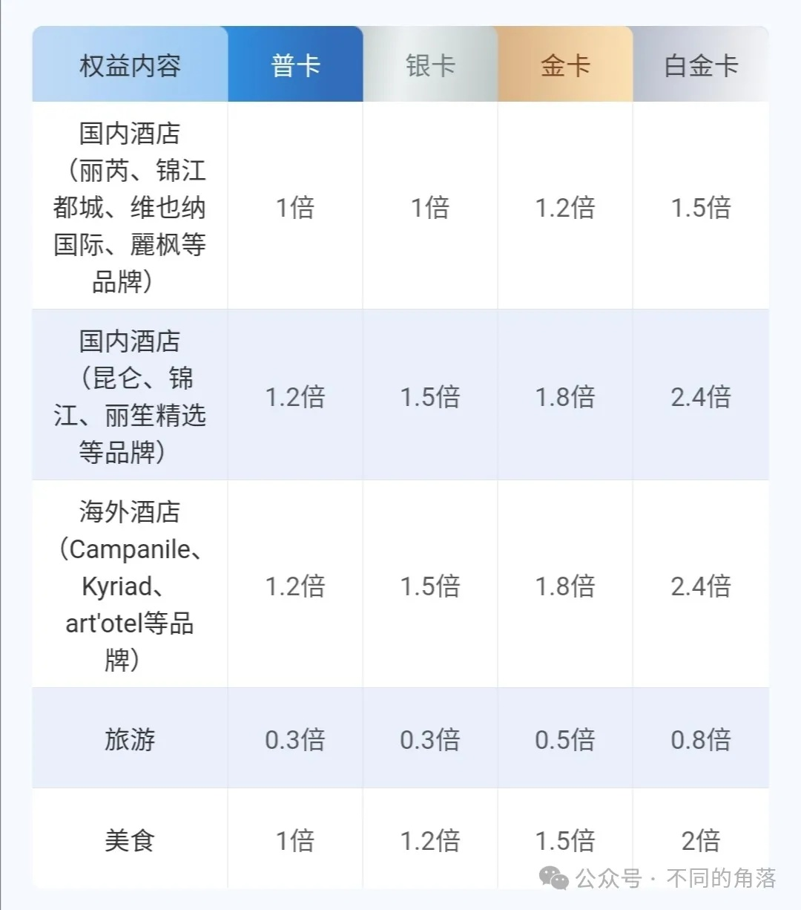      1. 积分计算方式：订单实付金额\*等级倍数，计算结果去掉小数点取整；

2. 积分均按人民币计算，如消费的是外币则换算成人民币后再计算积分；

3. 国内优选酒店品牌：

1）会员本人预订酒店，且本人入住可获得积分；

2）订单渠道：锦江荟线上预订平台、锦江荟客服热线；

3）计算方式：房费实付金额\*等级倍数，房费实付金额不含税费、服务费、小费和第三方费用等，税费金额根据酒店当地政策规定收取；

4）到账时间：离店48小时内发放给预订会员账号；

5）每位会员每天最多可获得1个房晚的酒店入住积分。

4. 国内锦江丽笙酒店品牌：

1）会员本人入住酒店可获得积分；

2）订单渠道：锦江丽笙酒店公众号/小程序、锦江荟线上预订平台、锦江丽笙酒店前台/预订部、锦江荟客服热线；

3）计算方式：房费实付金额\*等级倍数，房费实付金额不含税费、服务费、小费和第三方费用等，税费金额根据酒店当地政策规定收取；

4）到账时间：离店48小时内发放给入住会员账号。

5. 海外品牌酒店：

1）会员本人预订入住酒店可获得积分；

2）订单渠道：锦江丽笙酒店公众号/小程序、锦江荟线上预订平台、锦江丽笙酒店前台/预订部、锦江荟客服热线；

3）计算方式：房费实付金额\*等级倍数，房费实付金额不含税费、服务费、小费和第三方费用等，税费金额根据酒店当地政策规定收取；

4）到账时间：离店48小时内发放给入住会员账号。

6. 旅游

1）会员购买锦江旅游产品可获得积分；

2）订单渠道：锦江荟APP/公众号、锦江旅行小程序；

3）旅旅游度假订单实付金额，不含使用礼品卡、优惠券、部分退订金额以及保险费；出行返程后的48小时内发放积分到预订人会员账户，单张旅游度假订单的积分发放上限为 20000 积分；

4）门票、签证订单实付金额，不含返现金额、优惠券以及保险费；订单完成后的 48小时内发放积分到预订人会员账户。

7. 美食

1）会员购买锦大师美食商品可获得积分；

2）订单渠道：锦江荟APP-美食、锦大师微信小程序；

3）计算方式：订单实付金额（含积分抵扣金额）\*等级倍数；

4）到账时间：订单完成48小时后发放给下单会员账号

积分自获取日起至次年年底有效，到期的积分将会被自动清理。

**国内优选酒店会员权益**

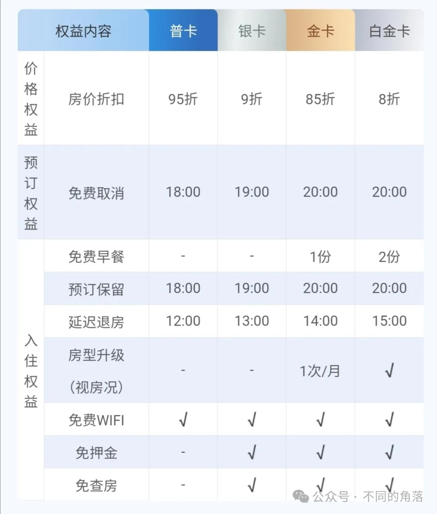

1. 会员通过锦江荟官方平台预订优选酒店，并且会员本人入住，方可享受以上权益；部分品牌有增加单品牌权益，以品牌介绍页面展示为准。

## 

2. 房价折扣：酒店门市价基础上进行折扣。

3. 免费早餐：会员通过锦江荟官方平台预订，并且会员本人入住，按照会员等级享受早餐权益。该权益仅适用于有早餐供应的酒店；仅适用于会员本人及同住人。

4. 免费取消：会员通过锦江荟官方平台预订优选酒店，按照会员等级享受规定时间内订单免费取消的权益。

5. 预订保留、延迟退房：会员通过锦江荟官方平台预订，并且会员本人入住，按照会员等级享受预订保留、延迟退房权益。

6. 房型升级：

1) 酒店视会员抵达当日的客房供应情况，提供免费房型升级服务。房型升级为高一档次房型（不包含升级到套房），如房量不足，将在同档次房型中调整至更佳景观/更高层/更静音的客房；

2) 使用通兑房券、免费房券、或积分兑换房均可享受房型升级；IU、派暂不能使用该权益；

3) 金卡会员通过锦江荟APP“会员--点击上方会员卡--金卡--房型升级”点击领取房型升级券，享每月升级 1 次，使用该权益时将房型升级券码提供给前台；白金卡会员每次入住可享房型升级服务，使用该权益时直接咨询前台。

7. 如线上专供房、时租房等部分房型展示的权益与“锦江荟手册”约定的不一致，以锦江荟官方平台预订页面展示为准。

**国内锦江丽笙酒店会员权益**

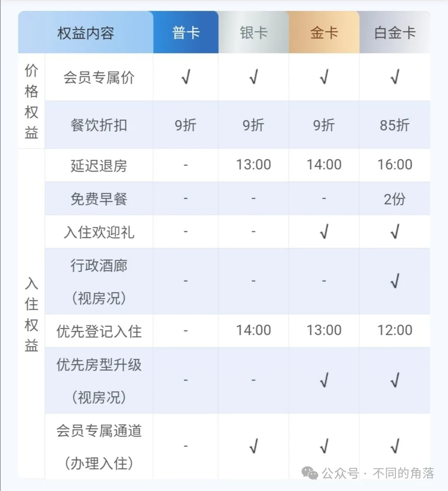

1.通过锦江荟线上预订平台、锦江荟客服热线预订锦江丽笙酒店，实际入住会员可享受对应等级的会员权益。

## 

2.餐饮折扣：参与活动的酒店餐厅或有变更，请直接联系酒店，询问酒店餐厅是否参与活动。折扣不适用于税费及小费、酒水饮料、海鲜、定制菜单、客房服务及客房送餐服务、餐饮活动及宴会。折扣不适用于10人以上（即第11人开始）活动或聚会。J酒店所有餐厅均需提前预订。非住店会员也可享受相同餐饮折扣，就餐时需会员本人在场，并在到达餐厅时，出示会员等级信息。酒店前台不能处理折扣。折扣不可与其它优惠、套餐及促销活动同时使用。

3.入住欢迎礼由酒店指定，以酒店实际情况为准。

4.优先房型升级，需视客房状况以酒店实际情况为准。

5.行政酒廊使用权适用于有行政酒廊的酒店，以酒店实际情况为准。

6.每个房间最多赠送两份早餐。

7.积分兑换房可按入住会员等级享受会员权益。

**海外品牌酒店会员权益**

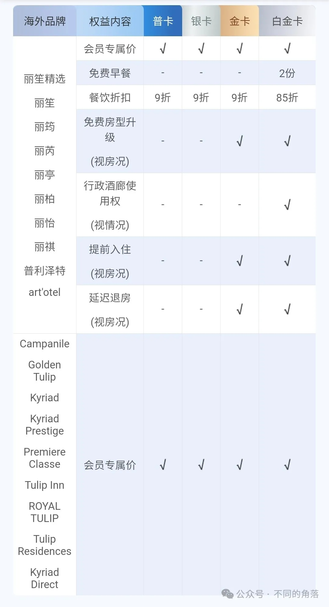

1.通过锦江荟线上预订平台、锦江荟客服热线预订，实际入住会员可享受海外酒店对应等级的会员权益。

2.餐饮折扣：参与活动的酒店餐厅或有变更，请直接联系酒店，询问酒店餐厅是否参与活动。折扣不适用于税费及小费、酒水饮料、海鲜、定制菜单、客房服务及客房送餐服务、餐饮活动及宴会。折扣不适用于10人以上（即第11人开始）活动或聚会。非住店会员也可享受相同餐饮折扣，就餐时需会员本人在场，并在到达餐厅时，出示会员等级信息。酒店前台不能处理折扣。折扣不可与其它优惠、套餐及促销活动同时使用。

3.房型升级，需视客房状况以酒店实际情况为准。

4.行政酒廊使用权适用于有行政酒廊的酒店，以酒店实际情况为准。

5.每个房间最多赠送两份早餐。

6.积分兑换房可按入住会员等级享受会员权益。

**锦江Plus卡(原超级会员)****：**

锦江荟官方平台购买开通，年卡198元，经常有活动128元。

白金会员购买可延长一年白金卡有效期，金卡以下会员购买可升级为金卡会员，有效期一年。

之前开通后订房积分翻倍，后来改成每月一张300积分券。

送1点阉割版龙腾点，只能用于国内机场国内出发休息室。

开通送10元2张、20元2张、30元1张酒店优惠券，每月再送10元2张、20元1张酒店优惠券。

**锦江联名信用卡****：**

锦江与工行、建行、浦发、广发、中信等银行合作发行联名信用卡。

大都有每住满15晚送一晚免费房（可兑换7天系列酒店），月消费2万送8000积分活动。

**酒店官方点评****：**

锦江荟官方渠道预订锦江旗下酒店，入住退房后都可以到锦江官方渠道进行点评，点评无积分。

**酒店会籍匹配****：**

之前支付宝钻石会员、银联钻石卡、航旅纵横去年飞行50次以上会员都可以匹配锦江白金。现在匹配活动都暂时结束了。

**锦江名人****：**

1、董竹君：锦江品牌创始人，近代中国第一位女企业家，中国女权运动先驱，连续七届全国政协委员。

1900年出生，12岁时为了给身患重病的父亲筹钱治病，以300大洋的代价被卖至青楼做三年清倌人卖唱抵债，13岁时遇到夏之时，14岁时因不想被当成商品，拒绝了夏之时为她赎身，将在青楼卖唱所得绫罗绸缎金银珠宝全部留给青楼，一身素衣逃离青楼与夏之时私奔，15岁时嫁给夏之时。

婚后去日本读书6年，之后回归夏之时四川老家，生育4个女儿1个儿子，后因无法忍受封建家庭和夏之时重男轻女男权思想而离婚，带4个女儿去上海打拼，几次创业后开办了锦江川菜馆和锦江茶室。

提倡女权，锦江茶室第一个公开招聘女服务员，所有服务员都是女性。创办《妇女杂志》。

日本占领上海期间带着女儿出走菲律宾，抗日胜利后返回。

回国后重整锦江两店，掩护救助多位在上海的革命人士，先后出资创办永业印刷所、协森印务局、美文印刷厂印制发行革命报刊。合资开办锦华进出口公司。

建国后将当时价值15万美元的锦江两店全部捐献给国家，以锦江两店为班底创建了锦江饭店。

1953年秋，被排挤退居二线，改任锦江饭店董事长兼顾问。

1953年秋应周总理邀请和三女国瑛到周总理家做客吃饭并同看戏。

1967年在秦城小汤山监狱关押4个月。

1968年2月转至功德林监狱关押9个月。

1968年12月转至半步桥监狱关押四年。

1972年10月被通知监外就医回家。

1973年5月宣布正式释放，恢复政协原职。

1986年锦江饭店举办成立三十五周年纪念会，割裂锦江前身为革命做贡献历史，纪念册上董竹君的全部职位都被取消。董竹君向有关部门反映后上海市委对恢复锦江历史做出三条决议，但并未得到落实。

同年国内外多家报刊对锦江饭店当时管理层割段锦江饭店前身历史一事都有报道：“……历史是严肃的、历史是永恒的、历史是不可磨灭的……”。

1991年6月9日锦江饭店第二次纪念大会，锦江饭店仍然割断了锦江前身的历史，没有董竹君这个锦江品牌创始人的相关内容。

1997年12月6日，因病在北京去世。

伟大的中国女性，一生为自由和独立两次逃离束缚，培养的4个女儿也都学有所成（大女董国琼1937年受邀为上海工部局乐队在上海兰心大剧院举办的音乐会上担任钢琴独奏，同年受邀参加在上海大剧院举行的普希金百年纪念音乐会担任钢琴伴奏，解放后任上海音乐学院钢琴教授；三女董国瑛创建八一电影制片厂，抗美援朝期间去朝鲜拍摄纪录片《慰问最可爱的人》，拍摄《西湖风景》、《苏州园林》等影片，还兼任过北京饭店经理；四女国璋曾为周总理、刘少奇、彭真做过口语翻译工作）。

提倡女权，锦江茶室第一个公开招聘女服务员，所有服务员都是女性。创办《妇女杂志》。

锦江两店盈利大都捐献给革命事业，建国后更是将锦江两店捐赠给国家，一生未曾有一套自己拥有产权的房产。

生前著有自传《我的一个世纪》（建议锦江酒店员工都看一看这本书），1999年被拍成31集电视连续剧《世纪人生》。

2、任百尊：1953年秋起成为锦江饭店经理，直至上世纪80年代锦江集团成立成为锦江集团首任董事长总经理。

1920年出生，曾任职上海敌 伪时期交通银行行长秘书，得董竹君介绍去苏北根据地加入中国共产党，然后返回上海跟随董竹君在锦江两店工作，得董竹君掩护一直居住在董竹君上海租住的房子里，政治上、经济上一直得到董竹君的帮助，深得董竹君器重，协助董竹君创办永业印刷所、协森印务局、美文印刷厂、锦华进出口公司。

解放后任上海市公安局侦查处科员，后调到一家尚未结束的进出口公司，锦江两店搬迁成立锦江饭店后，申请调任至锦江饭店任职副经理。

1953年秋成为锦江饭店经理，接待过多个国家和地区领导人；接待过多位中国领导人。

曾担任锦江集团总经理董事长、中国旅游饭店协会副会长、上海市饭店业协会执行会长、华东师范大学和上海交通大学客座教授等职。

1989年出版了《中国人怎样管好饭店》一书。也不知道锦江的管理层是看了他这本书还是没看这本书，锦江全服务酒店越开越少管理一塌糊涂，不知道是锦江管理层看了这本书学习的缘故是没看这本书没学习的缘故。

1991年6月9日锦江饭店第二次纪念大会，仍然割断了锦江前身的历史。

1996年，中国《新闻报》连续70天连载长篇传记文学《儒商任百尊》。

1997年8月，传记文学《儒商任百尊》由汉语大词典出版社出版。

1997年12月11日因心脏病在上海华东医院病逝。

董先生《我的一个世纪》书中记录的任百尊一件事情如下：

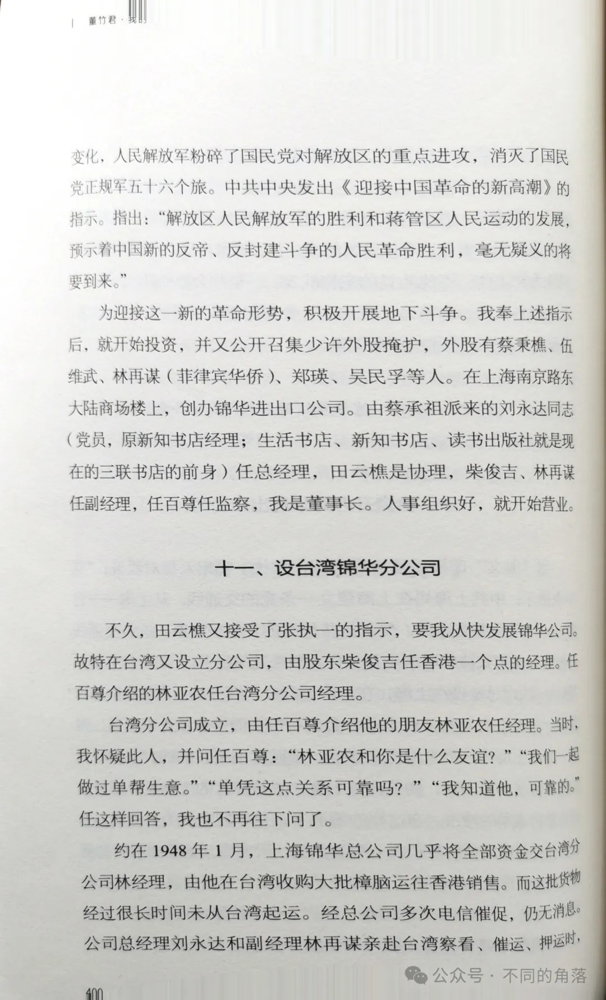

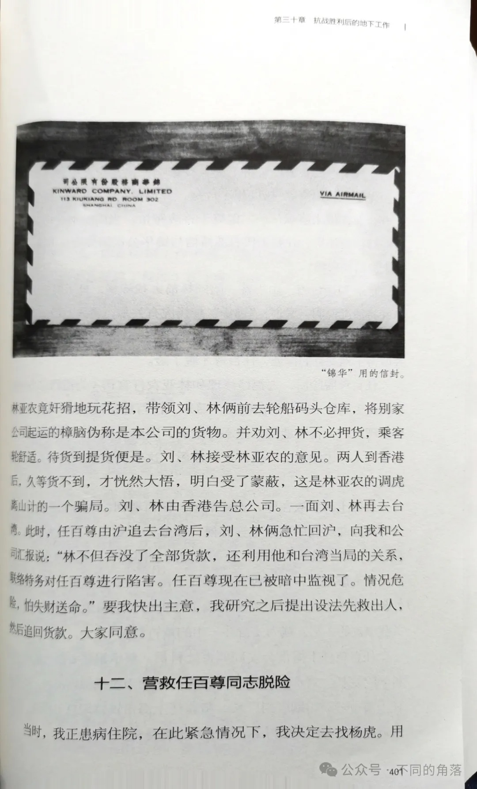

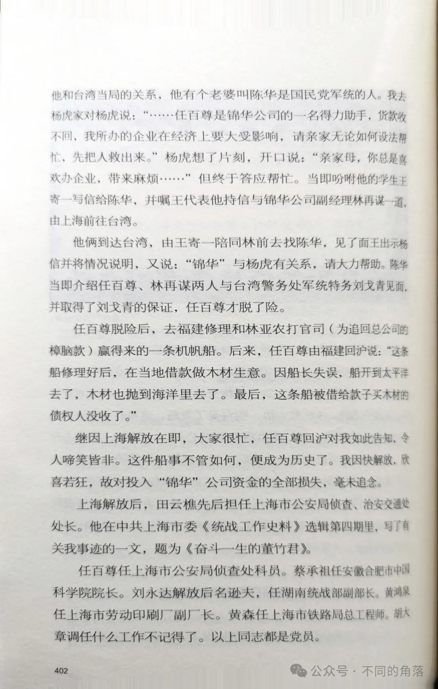

3、俞敏亮：曾任上海新亚（集团）股份有限公司总经理，上海新亚（集团）有限公司总经理、党委书记，锦江（集团）有限公司董事长、党委书记，锦江国际(集团)有限公司董事长、党委书记、首席执行官；现任锦江国际(集团)有限公司董事长、党委书记，上海锦江国际酒店（集团）股份有限公司董事长、执行董事，上海锦江国际酒店发展股份有限公司董事长。

4、徐祖荣：锦江之星品牌创始人，1977年恢复高考第一年考入上海旅行游览专科学校（现上海旅游高等专科学校）饭店管理系，毕业后分配到锦江酒店，后升任锦江集团旗下上海国际饭店总经理。

1994年锦江进军海外，徐祖荣出任旧金山分店总经理，在美国两年接触了美国的经济型酒店汽车旅馆，1996年旧金山分店关店徐祖荣回国筹备锦江之星，成立锦江之星旅馆有限公司，推出国内第一个经济连锁酒店品牌锦江之星，并带领锦江之星发展成为国内经济连锁酒店第一品牌。

后锦江之星门店数量被快速发展的如家、7天、汉庭、格林豪泰赶超，仍始终在保证锦江之星品牌门店品质前提下稳步发展，不盲目追求数量，锦江之星品牌曾经是国内五大经济连锁酒店品牌中唯一一家所有门店都配备有茶餐厅并提供早餐、午餐、晚餐服务的酒店品牌（现在都是只有早餐不再提供午餐晚餐了）。

5、侣海岩：笔名海岩，作家兼编剧，同时也是酒店管理业务上不优秀的企业家（锦江北方管理公司管理的多家锦江品牌酒店都是一塌糊涂）、经济师、设计师，多栖跨界大师。

锦江集团有限公司副总裁、锦江（北方）管理有限公司董事长、总经理和北京昆仑饭店有限公司董事长，曾担任中国旅游协会副会长、中国旅游饭店业协会会长、中国国有资产青年总裁协会副会长等职。

他著作的很多小说（便衣警察、永不瞑目、一场风花雪月的事、你的生命如此多情、玉观音、拿什么拯救你我的爱人）和电视剧本，均获得好评。

6、维克多·沙逊：英籍犹太人，旧上海首富，世袭准男爵，在第一次世界大战中加入了英国皇家空军，作战时左脚负伤致残，人称“跛脚沙逊”。

锦江旗下多家旧上海时老建筑改造成的酒店都是原来沙逊所建造持有的物业。

沙逊家族是闻名于世的犹太家族，1872年伊利亚斯·台维特·沙逊在上海建立了新沙逊洋行。

1918年，维克多·沙逊在印度孟买继承祖业后掌管了新沙逊洋行，1923年来上海后从事包括军火、鸦片等各种赚钱生意并大量投资上海房地产。

从20年代中期到30年代中期，短短10年内，维克多·沙逊成为上海最大的房地产投资商。他在南京路、福州路、淮海路、四川路一带繁华地区，买进大批地产、房屋，占有地皮六百多亩，拥有房屋一千九百多幢，几乎占据了整条南京路的房地产。

在旧上海28幢10层以上的高楼中，他一人独占6幢，为沙逊大厦（现和平饭店），华懋公寓（现锦江饭店锦北楼），格林文纳公寓（现锦江饭店贵宾楼和峻岭楼），都城饭店（现锦江都城经典上海新城外滩酒店）、汉弥尔登大厦（现福州大楼）、河滨大楼，旧上海外滩第二高楼百老汇大厦（今上海大厦）也是沙逊投资1934年建成，后于1939年卖给日资恒产株式会社，其它还有凡尔登公寓、仙乐斯产业等，还相继开办了华懋洋行、业广地产公司、祥泰本行、安利洋行等企业。

7、郑南雁：铂涛创始人，1993年创办劳业电脑软件公司，主攻酒店管理软件，开发千里马酒店管理系统。2000年加盟携程旅行网，先后任职副总裁兼华南区总经理，2004年10月离开携程后创办7天连锁酒店，后期发展为铂涛集团。在铂涛集团经营不善陷入亏损时，成功把铂涛卖出过百亿高价。现任浙江开元酒店股份有限公司董事长、德胧集团董事长。在郑的带领下，德胧集团造假成风，点评造假、兑房造假，更是以爆改原开元商祺会会员ID出圈，爆改出了“训练打造延时猛男”、“基金再跌我出门站街”、“中华人夫推广大使”、“梦想是得到一个男人”、“做一个傻比不怕那风雨吹”等一批毁三观的经典ID。

8、黄德满：维也纳创始人，维也纳酒店集团董事长。依靠画大饼和夸大宣传（三星消费三星体验的维也纳被宣传为二星消费五星体验）带领维也纳酒店从偏居一地的小型酒店集团发展为国内中档酒店老大，IPO无望的情况下成功被锦江收购。

**消失的福利****：**

蓝鲸卡时每年有一张98元房券，可以98元预订一晚全国的锦江都城（包括6家锦江都城经典）、锦江之星、金广快捷、百时快捷四个品牌门店。

后来合并为新的锦江礼享会员计划后蓝鲸卡变更为金卡，改为金卡、白金卡每年有一张98元房券，再后来就取消不再发放了。

与铂涛会员计划合并之前，在原锦江之星APP和合并后的锦江礼享APP上预订酒店，很多锦江之星酒店都有APP特惠房。上海浦东的一家锦江之星APP特惠房最低是价格59元，并且还是那种正常有外窗的25平米左右房间，白金会员还有两份免费早餐。

每周六周日都有百元体验房，国内除了北京、上海、拉萨等几个城市外其它城市的锦江之星、金广快捷酒店，在周六周日都有百元体验房，正常会员折扣价100多元到300元的客房，可以100元预订入住，在北京、上海、拉萨几个城市百元体验房价格是200元或300元，并且各家门店百元体验房还是大床房和标准房两种房型都有。

后来APP特惠房没有了，百元体验房也取消了。

WeHotel礼享会推出后，每周日可以五折积分兑换酒店房券，平时15000分的五星级酒店平日券（周日至周四可兑换，可兑换锦江五星级酒店和锦江都城经典酒店）只需要7500分，平时17500分的五星级酒店通用券（周一至周日都可兑换，可兑换锦江五星级酒店和锦江都城经典酒店）只需要8750分；平时8000分和10000分的四星级酒店平日券（可兑换锦江四星级酒店和锦江都城酒店）和通用券也都是五折；平时5000分的7天系酒店房券只需要2000分（可兑换7天、7天优品、IU、派这4个7天系品牌酒店）。

2018年3月每周日的五折积分兑换权益消失。

2018年1月锦江与中国工商银行联手推出工银WeHotel联名信用卡，联名卡用户可以5000积分兑换锦江四星级酒店房券（可以兑换锦江四星级酒店和锦江都城酒店），2000积分兑换7天系酒店房券，先期5000积分房券入住锦江四星级酒店享受早餐延时退房免押金等会员权益，后期更改为5000积分房券入住锦江四星级酒店不享受任何会员权益，再后来5000积分房券不能兑换锦江四星级酒店只能兑换锦江都城酒店，最后5000积分连锦江都城都不能兑换了，只剩下2000积分房券了。再后来2000积分房券也没了。

之前每天签到可获得5成长值，后期改为可获得积分。

2019年11月起签到每满30天可获得一张铂涛简约免房券。

2020年2月起有部分会员签到满月获得铂涛中端免房券。

2020年9月，锦江酒店APP签到功能下线。

2020年10月前锦江金卡会员每月可享受积分减半兑换5000分铂涛简约（7天系列酒店）大床房1次。

锦江白金会员每月可享受积分减半兑换5000分铂涛简约（7天系列酒店）大床房和8000分铂涛中端大床房各1次。

2021年11月下旬，锦江取消白金会员五折兑换尊享酒店权益，11月中旬时锦江酒店APP里会员福利里还写着白金会员每年可以五折兑换原价20000/30000/40000积分尊享酒店各一次，到下旬就突然消失了。

**现在的福利****：**

每周五锦江会员日，会有积分特惠兑换酒店客房、航空里程、门票、餐食等活动，每天2场，数量有限，很多都是秒无。

**锦江优点****：**

1、酒店数量多，分布广。截止2023年底国内已覆盖31个省/直辖市/自治区的321个地区/地级市/自治州/盟。

2、大多数酒店价格都很亲民。相比同城同档次的国际连锁酒店集团旗下酒店和国内的亚朵、华住等酒店集团旗下酒店，锦江旗下酒店价格大都要便宜，便宜货锦江印象已经深入人心。

3、高级会员免费匹配，没有保级难度。锦江明面上的最高会员等级白金卡，多年来一直可以免费匹配；不符合匹配条件的，之前网上直接购买也只需要68元（现在已暂时不能免费匹配不能网上购买）。

4、人工电话客服24小时在线，有问必答。

**锦江缺点****：**

1、三天两头更改会员计划和会员权益，就像光屁股娃娃过家家一样任性。

2、会员权益形同虚设，包括锦江创始店上海锦江饭店在内的很多酒店都拒不按会员计划相关条款规定提供会员权益。

3、对会员投诉区别对待，对找媒体曝光投诉的会员给予三赔待遇（赔钱、赔积分、赔免房），还赔高级会员。对不找媒体曝光投诉的会员拒不理睬。

4、很多客服不专业，会员咨询问题给出的解答50%都是错误答案，咨询不同客服经常是给出不同答案。

**个人看法****：**

锦江集团不靠谱，但锦江旗下一些酒店还是不错的。锦江旗下普通酒店性价比和分布也都可以，还是可以考虑的。

推荐一些我入住过的一些在硬件设施、环境风景、历史文化等方面不错的锦江旗下酒店（个别酒店别考虑服务）。

上海和平饭店

上海兴国宾馆丽笙精选

上海虹桥西郊庄园丽笙大酒店

上海中信泰富朱家角锦江酒店

上海锦江饭店

上海锦江金门大酒店

屏边大围山锦江度假酒店

江苏锦江南京饭店

锦江都城经典上海外滩新城饭店

锦江都城经典上海南京饭店

锦江都城经典上海南京东路外滩酒店

锦江都城经典上海青年会人民广场酒店

锦江都城经典上海达华静安寺酒店

锦江都城经典上海外滩新亚酒店(现上海外滩郁锦香新亚酒店)

更多的酒店集团、酒店行业资讯、酒店常识、酒店入住体验、航空常识、沈阳旅游、沙发客、打油诗等相关内容可以到我的微信公众号里查看。

也欢迎大家关注我的微信公众号：**sfk024**

公众号名称：**不同的角落**

在微信公众号搜索sfk024或是不同的角落都可以搜索到，也可以直接扫码或长按识别下方二维码关注。

