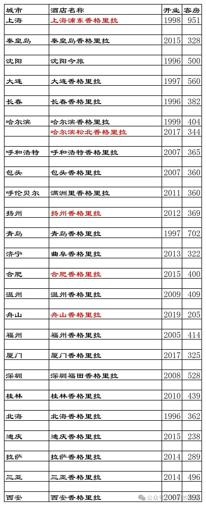
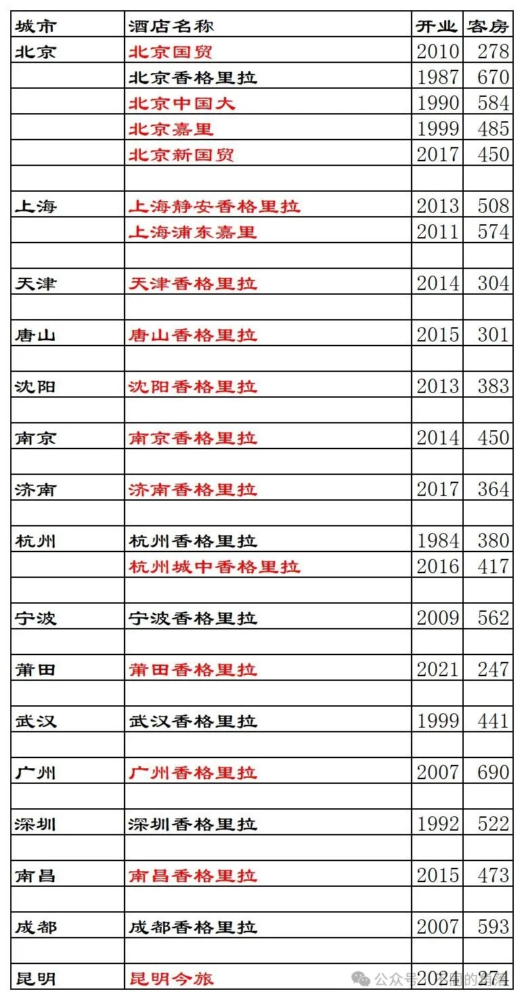
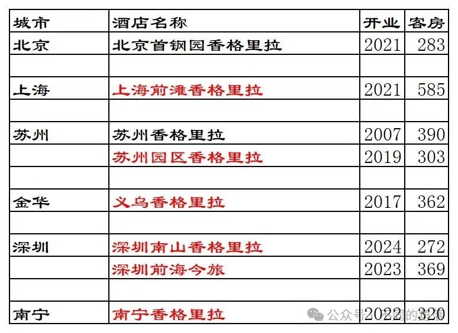
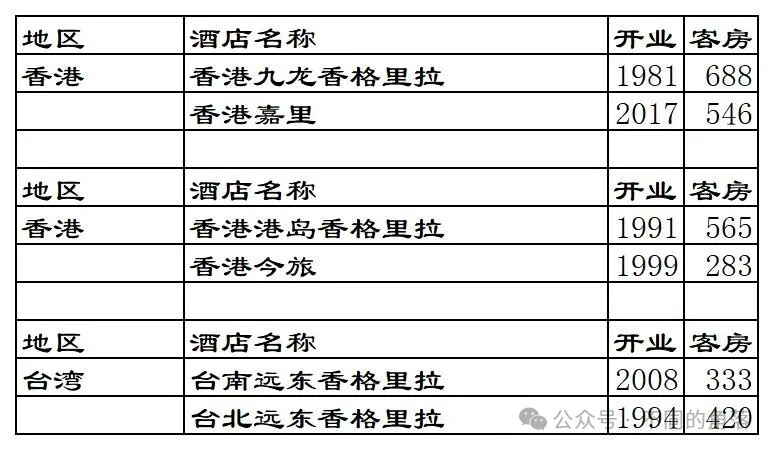
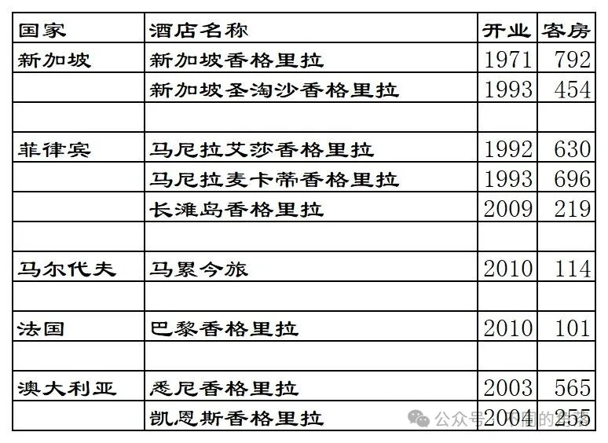
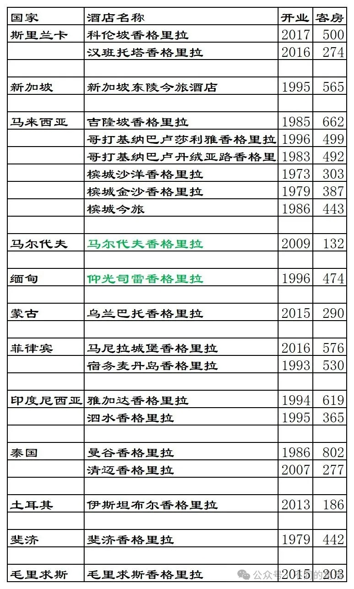
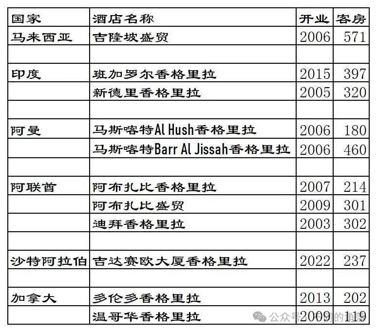
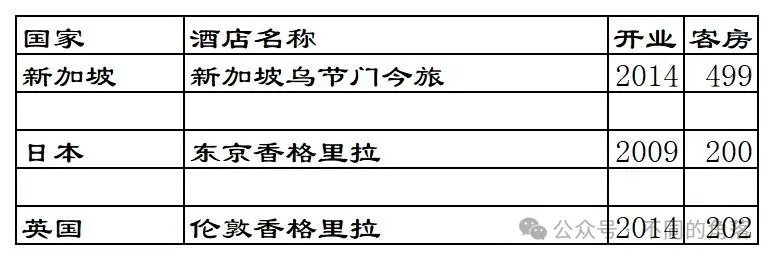
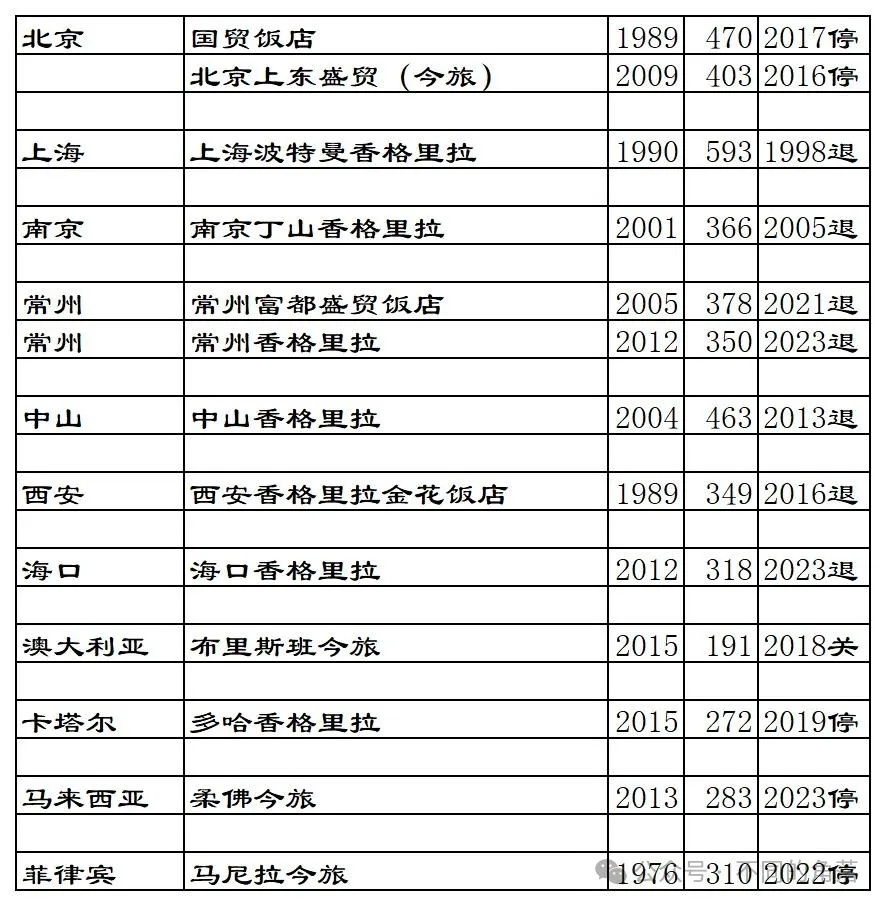

# 香港酒店集团之一香格里拉2024版

> **作者**：不同的角落  
> **发布时间**：2024年9月5日 23:36  
> **原文链接**：[香港酒店集团之一香格里拉2024版](http://mp.weixin.qq.com/s?__biz=MzU4OTczMzkwNw==&mid=2247531670&idx=1&sn=4f5722a885fee3e107542697ca32741a&chksm=fdcb35eacabcbcfc4c8d35eb7d100aac785216e1c08dcedc61c53e90ffa2b23df8e6f928f7e5)

---

本文关键词“香格里拉”，公众号发送“香格里拉”即可看到。

**香格里拉概述**：

香格里拉酒店集团，香港最大酒店集团，以酒店客房数量统计排名的《Hotels》年度全球酒店集团排名，香格里拉近10多年排名最高第34位，最低第52位；全球成规模酒店集团中少有的重资产模式为主的酒店集团，旗下近80%酒店都是自营模式或是合资模式。

截至2024年8月30日，香格里拉旗下酒店共计105家，其中中国大陆55家（24家自营、23家合资、8家委托管理），中国香港4家（自营2家、合资2家），中国台湾2家（委托管理2家），海外44家（自营10家、合资19家、委托管理11家、租赁经营3家，其中2家合资酒店目前仍停业中）。

目前香格里拉国内重庆、山西、河南、湖南、贵州、甘肃、宁夏、青海、新疆没有酒店。

国内近几年香格里拉委托管理的常州、海口3家酒店陆续退出，不过好在新开业酒店数量多于退出酒店数量，还是正增长。

国外近几年澳大利亚布里斯班、卡塔尔多哈、马来西亚柔佛、菲律宾马尼拉的香格里拉旗下品牌酒店陆续关停，国外近几年一直都是负增长。

2013年全球酒店集团排名第38位，

2014年全球酒店集团排名第36位，

2015年全球酒店集团排名第34位，

2016年全球酒店集团排名第36位，

2017年全球酒店集团排名第37位，

2018年全球酒店集团排名第37位，

2019年全球酒店集团排名第41位。

2020年全球酒店集团排名第42位。

2021年全球酒店集团排名第41位。

2022年全球酒店集团排名第39位。

2023年全球酒店集团排名第52位。

[2023年度全球酒店集团221强](http://mp.weixin.qq.com/s?__biz=MzU4OTczMzkwNw==&mid=2247523528&idx=1&sn=d6ea8152a6f05bcdfd57c924f1172ccb&chksm=fdcbd5b4cabc5ca25a1bb1fd7edec8a9d1b76c19d84c021d868c41ca6d3620b51a5659c6f33f&scene=21#wechat_redirect)

**酒店APP**：

香格里拉会APP，原来的旧版烂的要命，终于在2018年换新版了，之后不定期更新，还算好用。

**客服电话**：

4001866888，0点到早上8点是马来西亚客服接听，之前经常有临时工客服，打电话咨询经常是各种事情都不清楚，然后说自己是新来的；其余时间是国内广州客服接听。发现近期的马来西亚客服都比较专业。

国内广州客服之前也是非常不专业，很多会员权益都不清楚，很多已经变更的最新规则权益都不了解。近期的国内客服业都还算专业。

**所属集团**：

香格里拉集团是香港上市公司香格里拉(亚洲)有限公司旗下品牌，香格里拉（亚洲）有限公司旗下还包括物业租赁、物业销售等，旗下持股的国内物业有北京中国国际贸易中心、北京国贸世纪公寓、北京嘉里中心、上海商城、静安嘉里中心、上海浦东嘉里中心、天津嘉里中心、杭州嘉里中心、沈阳嘉里中心、成都香格里拉中心、青岛香格里拉中心、大连香格里拉公寓等。

香港嘉里集团及马来西亚郭氏集团(现丰益国际)拥有香格里拉(亚洲)有限公司大部分股权，马来西亚郭氏兄弟集团由“亚洲糖王”郭鹤年于1949年创立，最初在马来西亚的柔佛马鲁经营大米、食糖和面粉的贸易。1953年在新加坡设立分公司——郭兄弟（新加坡）有限公司。1971年进军酒店业在新加坡开设第一家香格里拉酒店。1974年在香港成立了嘉里集团有限公司。

旗下产业有粮油（益海嘉里公司旗下有金龙鱼、胡姬花等品牌）、航运、房地产、酒店、影视传媒（收购香港南华早报、入股香港无线电视台）等。

**品牌由来**：

香格里拉（shangri-la）是藏语“心中的日月”之意，1933年詹姆斯·希尔顿在小说《消失的地平线》书中描写了中国西南藏区一个叫香格里拉的地方，书中描述香格里拉是一个深藏在高山峡谷中的“乌托邦”式的世外桃源，四面雪山环绕，富裕祥和，逍遥自在，各种宗教和平相处。此后shangri-la成为英语词汇“世外桃源”。好莱坞制片公司买下版权将《消失的地平线》搬上银幕，立刻风磨全球，“香格里拉”一词更广为人知。香格里拉这一“世外桃源”的象征成了人们追求寻觅的理想境地。

**发展历程**：

1971年4月，新加坡香格里拉大酒店开业，委托给美国威士腾(Western)国际酒店（威士腾国际酒店1980年改名为威斯汀酒店集团，1985年定名为威斯汀酒店与度假村集团，1998年喜达屋酒店集团收购威斯汀，2015年万豪收购喜达屋）管理。

1979年，郭氏酒店管理公司成立，旗下管理槟城香格里拉沙洋度假酒店、槟城金沙度假酒店、斐济香格里拉度假酒店三家酒店。

1981年4月，香港九龙香格里拉大酒店开业，由威斯汀酒店集团管理。

1984年，郭氏酒店管理公司更名为香格里拉国际饭店管理有限公司，接管新加坡香格里拉大酒店。

1984年10月，香格里拉国际饭店管理有限公司与浙江省旅游集团公司合作，出资对西湖边原杭州饭店和西泠饭店翻新改造，并建造了一条玻璃长廊连接两家酒店，合并为杭州香格里拉饭店。香格里拉国际饭店管理有限公司占45%股份。

1984年，北京香格里拉开工兴建。

1986年3月，泰国曼谷香格里拉大酒店开业。

1986年4月，槟城香格里拉大酒店开业（后期降级为盛贸品牌，2014年更名为槟城今旅）。

1987年8月22日，北京香格里拉饭店竣工开业。

1987年11月26日，装修完成的杭州香格里拉饭店正式开业。

1989年，西安金花饭店由香格里拉接手管理运营，成为香格里拉国内第三家酒店。

1990年7月，北京中国大饭店开业。

1990年10月，上海波特曼香格里拉酒店开业。

1991年3月，香港港岛香格里拉大酒店开业。

1991年4月，香港九龙香格里拉大酒店收回管理。

1993年，香格里拉（亚洲）有限公司在香港上市。

1994年3月，台北香格里拉远东国际大饭店开业。

1996年8月，沈阳商贸饭店开业（后更名为盛贸品牌，2014年更名为沈阳今旅）。

1996年11月，缅甸仰光盛贸饭店开业（2014年4月升级为仰光司雷香格里拉大酒店）。

1998年1月，香格里拉终止与上海波特曼香格里拉酒店管理协议，但仍持有酒店30%股份，酒店改由万豪旗下奢华五星品牌Ritz-Carlton管理，翻牌为上海波特曼丽嘉酒店，2008年后万豪统一Ritz-Carlton的中文名称为 “丽思卡尔顿”，最后又更名为上海波特曼丽思卡尔顿酒店。

1998年8月，上海浦东香格里拉大酒店（浦江楼）开业。

1999年8月，北京香格里拉嘉里中心大酒店开业（2011年11月更名为北京嘉里大酒店）。

2001年，香格里拉接管南京丁山饭店，更名为南京丁山香格里拉大酒店

2003年7月，澳大利亚悉尼香格里拉大酒店开业（原ANA海湾大酒店）。

2004年1月，中山香格里拉大酒店东翼开业。

2004年8月，澳大利亚凯恩斯香格里拉大酒店开业。

2004年10月，中山香格里拉大酒店南翼开业。

2005年7月，上海浦东香格里拉酒店二期紫金楼开业，浦江楼、紫金楼客房总数951间，成为为全球最大客房数量最多的香格里拉。

2005年9月，印度新德里香格里拉大酒店开业。

2005年9月，终止南京丁山香格里拉管理协议。

2007年8月，阿联酋阿布扎比香格里拉大酒店开业。

2009年3月，日本东京香格里拉大酒店开业。

2009年7月，马尔代夫香格里拉度假酒店开业。

2010年12月，法国巴黎香格里拉大酒店开业。

2011年，推出嘉里酒店品牌。

2011年2月，上海浦东嘉里大酒店开业。

2013年6月，上海静安香格里拉大酒店开业。

2013年9月，香格里拉出售持有的中山香格里拉大酒店51%股份并退出管理，中山香格里拉大酒店更名为中山大信商务会议中心酒店。

2014年4月，西藏拉萨香格里拉大酒店开业。

2014年5月，英国伦敦香格里拉大酒店开业。

2014年8月，推出Hotel Jen（今旅）品牌。

2015年3月，北京上东盛贸饭店更名为上东今旅酒店。

2015年8月，云南省迪庆藏族自治州香格里拉市恬居·云南香格里拉大酒店开业，2018年更名为香格里拉大酒店。

2016年3月，杭州第二家香格里拉杭州城中香格里拉酒店开业。

2016年4月，香格里拉推出【香格里拉会宴精粹】及【贵宾金环会会宴奖励计划】，贵宾金环会会员在香格里拉旗下酒店举行的团体、会宴、会议及活动可以获取礼遇并兑换及赚取积分。

2016年5月，贵宾金环会推出忠诚活动计划，住满5家不同香格里拉酒店赠送5000积分。

2016年6月，出售西安金花大酒店100%股权。

2016年7月，中国工商银行发行工银香格里拉联名信用卡，信用卡消费可获得香格里拉贵宾金环会积分，持卡人可以获得快速升级礼遇。

2016年8月，香格里拉推出名为The Table尚桌计划的全新餐饮常客奖励计划，贵宾金环会会员在香格里拉旗下酒店指定餐厅就餐可以获得相应优惠及积分，并可以用积分支付餐饮消费。

2016年9月，香格里拉与新加坡航空携手推出【礼行千里】合作计划，每次付费合资格入住可以同时累积香格里拉贵宾金环会积分和新加坡航空里程，并且可以快速升级对方会员。

2016年10月，终止西安金花大酒店管理协议。

2016年12月，终止北京上东今旅管理协议。

2017年3月，香格里拉酒店集团与印度泰姬酒店集团共同启动了主题名为“盛情备至”的联盟计划，这一计划整合了香格里拉贵宾金环会和Taj InnerCircle两大常客奖励系统，规模覆盖两大集团旗下超过200家酒店。

2017年8月，厦门香格里拉酒店开业，为香格里拉酒店集团第100家酒店。

2018年1月，推出全新的香格里拉APP。

2018年7月，在武汉开设共享金融服务中心。

2018年10月，香格里拉（亚洲）有限公司推出香格里拉集团企业品牌，以管理本集团拥有及经营的各种不同资产。其中包括四个住宿品牌－香格里拉酒店及度假酒店、嘉里大酒店、今旅酒店HotelJen及盛贸饭店－以及综合发展项目，包括体育和休闲娱乐、办公室、餐饮、住宅和购物中心。

2018年11月，与腾讯合作开发和部署技术解决方案。

2018年12月，香格里拉另一个全球总部在新加坡成立。

2018年12月，澳洲布里斯班今旅土地被当地政府收回，香格里拉关闭布里斯班今旅酒店并获得3130万美元赔偿。

2019年4月30日，多哈香格里拉大酒店停业。

2020年1月，舟山香格里拉酒店一期开业，共有28间客房，酒店未加入香格里拉贵宾金环会，香格里拉贵宾金环会会员入住不享受任何会员待遇。

2020年8月，香格里拉更新会员政策，削减会员权益，会员取现收取2.5%手续费，入住今旅品牌不再有欢迎礼。

2021年，国内共有莆田香格里拉、北京首钢园香格里拉、上海前滩香格里拉3家酒店开业。

2021年7月1日，常州富都盛贸酒店翻牌为洲际旗下VOCO品牌。

2022年1月1日，香格里拉推出邀请制的最高等级会员——帝星会员。

2022年3月11日，南宁香格里拉开业。

2022年4月28日，香格里拉会会员计划上线，正式取代之前的香格里拉金环会会员计划。

2023年5月26日，海口香格里拉翻牌为雅高旗下奢华五星品牌费尔蒙。

2023年10月18日，常州香格里拉酒店将翻牌为洲际旗下豪华五星品牌洲际。

**我与香格里拉**

2015年注册香格里拉金环会会员。

2016年升级香格里拉翡翠会员。

2017年入住25S升级香格里拉钻石会员。

2024年降级为香格里拉翡翠会员。

这些年，入住过国内39家香格里拉品牌酒店、1家盛贸品牌酒店、1家今旅品牌酒店。

有的酒店只入住过1次，有的酒店入住过10多次20多次，其中10家酒店升级过套房。

入住过的酒店如下：

香格里拉：北京、上海浦东、天津、唐山、秦皇岛、沈阳、大连、长春、哈尔滨、哈尔滨松北、呼和浩特、包头、满洲里、南京、苏州、苏州园区、扬州、常州(已退)、济南、曲阜、合肥、杭州、杭州城中、宁波、温州、福州、武汉、广州、深圳、深圳福田、桂林、北海、成都、香格里拉、拉萨、海口(已退)、三亚、西安。

盛贸：常州富都盛贸(已退)；

今旅：沈阳今旅(已退)。

入住过的酒店中我个人觉得值得体验的四家酒店：拉萨香格里拉、香格里拉香格里拉、海口香格里拉(已退)、三亚香格里拉。

部分酒店入住体验：

1、香格里拉之一迪庆香格里拉

[香格里拉之一迪庆香格里拉](http://mp.weixin.qq.com/s?__biz=MzU4OTczMzkwNw==&mid=2247486125&idx=1&sn=558a960d641c8b76acdfb1e48665be57&chksm=fdc843d1cabfcac7690097e2f5c30452d30ac5e3d7f203abe70ffc2ea8c5613d3c394313de18&scene=21#wechat_redirect)

2、香格里拉之二沈阳香格里拉

[香格里拉之二沈阳香格里拉](http://mp.weixin.qq.com/s?__biz=MzU4OTczMzkwNw==&mid=2247493609&idx=1&sn=7a2021781d89803f7c56fbc0f43ba46d&chksm=fdcbae95cabc2783d21b50a6495cea35a37264b8196d36fbc65f4af648b8438fbb6d359968e1&scene=21#wechat_redirect)

3、今旅之一沈阳今旅

[今旅之一沈阳今旅](http://mp.weixin.qq.com/s?__biz=MzU4OTczMzkwNw==&mid=2247487918&idx=1&sn=cc81ea5c84952191a8efbb6fd8a58678&chksm=fdc858d2cabfd1c4284d42b31d7c979abbcf2ff4f5524ce1cf934420d064492e1e35f194b800&scene=21#wechat_redirect)

近十年入住香格里拉旗下酒店，遇到过很多不靠谱的事情，如果是某些不靠谱酒店集团旗下酒店，出现这些事情很正常。可是宣称传承待客之道，礼迎八方来宾，感受非凡的入住体验，享受宾至如归的殷勤服务的香格里拉旗下酒店，出现这些事情真的太离谱。

**1、国人老外区别对待**

入住深圳福田香格里拉酒店，当天办理入住时，前台妹子面无表情房间也未给升级，说了自己是钻卡会员想住高楼层，前台妹子并不同意给予升级豪华阁客房，然后妹子又打电话给值班经理请示后，才给了一个高楼层的豪华阁客房。第二天下午在前台看到一位老外(不知道是什么等级，那时香格里拉最高等级是钻卡会员)来办理入住，老外出示证件后一句话都没说，妹子主动给升级了豪华阁客房（并无打电话请示值班经理环节），然后笑容满面的告诉外国男人房间给升级了豪华阁在多少楼什么时间段有欢乐时光可以去享用。

新中国都成立70多年了，国内早已没有洋人租界了，没想到在香格里拉酒店体验到了旧社会洋人租界的感觉。

退房后收到香格里拉酒店集团调查问卷，对于深圳福田香格里拉酒店这种国人老外区别对待的丑恶行径，给了一分差评。

然后收到酒店董姓前厅经理打来的电话，说酒店会加强员工服务培训，酒店对中国人和外国人会同等对待；问她那个老外是不是钻卡会员，她也没有回答；然后说她是从沈阳香格里拉调到深圳福田香格里拉的，和我是老乡，让我下次再去深圳联系她，她请我吃饭表示歉意。四天之后我再去深圳，入住洲际旗下深圳富苑皇冠假日酒店，酒店离福田香格里拉7.3公里，相距不算远。我告诉董姓前厅经理我又来深圳了，这回她只字不提请我吃饭了，就好像她之前从来没有说过一样。之后去深圳多次，再未住过深圳福田香格里拉。

**2、酒店退房胡乱收费**

积分兑换入住哈尔滨香格里拉酒店，退房时告诉酒店前台员工把信用卡预授权撤销，酒店员工说稍候就撤销。

离开酒店到哈尔滨火车站了，收到短信提醒，信用卡在哈尔滨香格里拉酒店预授权完成消费400多元。

房间里没有消费，我自己一人入住，钻卡会员早餐和欢乐时光都是免费，也没有其它消费。打电话给酒店转前台，报了昨天入住房间号，问她们收费400多元是什么情况，我在酒店没有其它消费，退房时也确认过了，怎么事后就胡乱收费，前台员工支支吾吾回答不出来。

幸好刷预授权的那张信用卡有短信提醒服务，没有短信提醒估计都发现不了这笔消费，就得被他们坑400多元了。过了一个多小时后，酒店才把400多元给我退还回来。

**3、吃到指甲盖大石头**

在沈阳今旅酒店餐厅吃早饭，在炒饭里吃到手指甲盖大的石头。餐厅王姓行政总厨出来致歉，要给我装一些面包、蛋糕等西点，没要，告诉他今后尽量避免再出现同样问题。

**4、酒店退房不退押金**

有一次入住常州富都盛贸酒店，退房后酒店居然没有取消信用卡预授权。过了半个月后在另一家酒店办理入住时刷信用卡看到短信提示余额不对，打电话查询才发现是富都盛贸预授权一直没有给撤销。打电话给酒店，和他们说了情况，才给撤销。

**5、被酒店改姓氏性别**

入住过的香格里拉酒店，有的会在房间里摆放打印的欢迎信，遇到过两次把我的姓氏写错的；还遇到一次把我性别写错的。入住北海香格里拉，房间里摆放的欢迎信居然写成欢迎罗女士入住，实在是服了他们。

**6、欢迎水果烂的脏的**

大多数入住过的香格里拉酒店欢迎水果都是老三样香蕉、苹果、橙子或梨，然后一些香格里拉酒店给的欢迎水果甚至是烂的脏的，这些年遇到过四次。南京香格里拉给的水果中几个大樱桃都是烂的，宁波香格里拉给的欢迎水果中苹果梗处还有一块污泥。水果表面上明明都可以看得到是腐烂的脏的，酒店员工就是视而不见。

**7、活动混乱交通违章**

沈阳香格里拉、沈阳今旅与沈阳嘉里城联合搞了一场“打卡盛京，骑遇之旅”活动，从沈阳今旅酒店出发，骑行哈啰电单车，到沈阳香格里拉酒店，然后去嘉里城里参加抽奖活动。结果好好的活动演变成一场全程交通违章之旅，我也全程参加了活动，亲眼目睹很多参加活动人员骑电动车全程各种闯红灯、逆行交通违章，两家酒店组织活动的工作人员全程无视也无提醒大家要遵守交通规则。

**8、缺乏基本礼仪常识**

沈阳香格里拉酒店销售人员估计经常拨打电话推销产品被很多人拉黑，曾经有段时间酒店总机号码被华为手机默认为骚扰电话自动拦截。

有一次发现骚扰拦截电话名单中有沈阳香格里拉酒店来电记录，想着前几天才入住过酒店，可能酒店打电话给我有什么事情。回拨过去告诉总机转到前台问下，转到前台后听到一个妹子声音问我：你找谁？我问谁给我打电话了，妹子问我：你姓啥？我告诉妹子后，就听到电话那端妹子大声喊：谁给姓罗的打电话了？

有一次一个外地朋友单位来沈阳参加展会，要订20间客房住3天，朋友让

我帮她问下沈阳几家五星级酒店团队价格。

我打电话咨询了沈阳青年大街沿线等几家五星级酒店，沈阳康莱德、沈阳君悦、沈阳万达文华等酒店都是前台员工问了我电话号码之后，然后告诉酒店销售打电话给我，这几家酒店销售打电话过来都是先说您好，然后自我介绍自己是哪家酒店员工。

只有沈阳香格里拉酒店前台员工，告诉我销售下班了第二天再打电话；第二天打电话过去，前台问我是让我给他们酒店销售打电话还是让酒店销售给我打电话，我说让酒店销售给我打电话并告知了我的手机号码；结果第一次打过来的还不是销售，还是另一个酒店核实工作人员，要核实我是不是要订酒店，核实后问我找哪个销售；然后不一会儿一个女销售打电话来，连句您好也不说，自己姓名也不说，直接就问我订哪天酒店，我差点以为是骗子。然后给我报价比我直接在香格里拉官方平台预订价格都贵，比沈阳康莱德价格贵。最后朋友与沈阳康莱德销售签了订房协议预订了沈阳康莱德20间房3天。

沈阳香格里拉酒店外籍GM，在“打卡盛京，骑遇之旅”活动骑行出发前和到达目的地后讲话，全程英文，然后由沈阳香格里拉酒店员工再翻译。问了下酒店员工得知这个洋鬼子来中国也有几年时间了会说中国话，其它国际酒店集团的在中国各酒店的外籍GM，在参加各种活动讲话时起码的大家好、谢谢这几句简单的中文还是会说的，毕竟是在中国工作服务对象也主要是中国人，只有沈阳香格里拉酒店的洋鬼子GM全程一句中文都不说，估计是他觉得自己是高高在上的洋大人来到中国这个地方就要显摆自己与中国人不同，不讲中国语言。

**8、客房电话只是摆设**

入住成都香格里拉酒店，20多层的客房，第二天上午11点多，房间里突然进烟，我住的房间窗户是全封闭窗不能打开，打开房门一看，走廊里浓烟滚滚。赶紧回房间，按房间电话上面的服务中心按键，始终无人接听；按房间电话上的紧急服务按键，同样还是无人接听，打了几遍都是；用手机拨打酒店总机，才有人接听，问酒店走廊里都是烟是什么情况，前台说不清楚，说会派工作人员来带我离开。

等了10多分钟，没有人来，房间进烟越来越多，再次按房间电话上面的服务中心按键，还是无人接听；按房间电话上的紧急服务按键，也还是无人接听，打了几遍都是；没办法再次用手机拨打酒店总机转前台，告知再不来人，我就要用房间里椅子砸碎玻璃通风了。前台说马上安排人来接我。结果又等了10分钟，在我准备用椅子砸窗时终于来了两位酒店员工，带我坐电梯下楼。酒店电梯仍可以正常使用未受影响，我住的楼层和上下相邻两个楼层走廊里都是浓烟滚滚，其余楼层影响不大。

入住曲阜香格里拉酒店，按客房电话上面的服务中心按键，响起语音提示“您拨打的号码暂时无法接通或不在服务区”。

**9、带污泥南瓜不清洗**

入住天津香格里拉酒店，在豪华阁体验欢乐时光，有烤蜂蜜南瓜，夹了一块，吃完瓜肉后用筷子夹起剩下带瓜皮部分，准备往嘴里送时才发现瓜皮全是泥(烤干的泥污)，去放烤蜂蜜南瓜的餐盘里翻看其它南瓜块，有几块瓜皮上也都是泥。这种情况只能是厨房没有清洗南瓜（估计是南瓜地面那一侧有泥，另一侧没有泥），直接切了放到烤箱里烤。知道有一些小餐馆可能会有蔬菜不清洗直接切了烹饪的情况，没想到天津香格里拉居然也如此。当天天津香格里拉欢乐时光餐食还有其它问题，豪华阁员工找来餐厅工作人员，问我有什么诉求，告诉他们给做了一份麻辣烫，感觉还不如外边10元一份的麻辣烫好吃。

**10、煮羊肉片冒充小市羊汤**

有一次春节期间入住沈阳今旅酒店，早餐有一个菜牌是小市羊汤(本溪小市羊汤，是辽东地区特色满族美食，起源于明清时代，距今已有数百年历史。以当地土生土长的绒山羊为食材，继承和改进了满族羊汤的传统工艺，鲜羊宰杀分割后，全部放入柴锅中，武火、文火交替使用，经过数小时熬制，至汤汁呈乳白色时，肉烂、汤练、味鲜)，结果实际上是电砂锅清水煮羊肉片。问餐厅是什么情况，餐饮部经理说是春节期间沈阳菜市场都关门，买不到羊肉羊杂等食材，所以就用清水煮羊肉片了。过了半个月，再次入住沈阳今旅，早餐菜牌还有小市羊汤，结果还是电砂锅清水煮羊肉片。问酒店这次又是什么情况，沈阳菜市场早就都恢复营业了，酒店这次支支吾吾没有编出理由。

**11、豪华阁权益被阉割**

入住满洲里香格里拉酒店，酒店春节期间豪华阁没开，大堂吧也没开，只开了中餐厅。问酒店员工香格里拉钻石会员的豪华阁权益在哪里使用，酒店员工说豪华阁和大堂吧都没开，所以没有豪华阁权益提供。

**12、酒店退房不办手续**

入住三亚香格里拉酒店，早上8点把房卡还给前台，告诉房间号说办理退房。结果11点多到达海南儋州一家酒店办理入住时才知道，三亚香格里拉酒店前台员工没有给我办理退房，所以在儋州酒店无法办理入住。打电话给三亚香格里拉酒店转前台，报入住房间号，告诉她们早上8点就还了房卡说退房，现在还没给我退，其它酒店无法办理入住。酒店前台员工说立刻给我办理退房。等了十多分钟，儋州酒店还是无法给我办理入住，查询还是三亚香格里拉酒店没给我办理退房。再次拨打三亚香格里拉酒店电话，催促她们给我办理退房，又等了十分钟，三亚香格里拉酒店才给我办理退房，儋州酒店这边才可以办理入住。

**13、礼宾服务是啥服务**

香格里拉钻卡会员，之前有一个会员权益：非入住宾客可以享受香格里拉旗下酒店24小时礼宾服务。之前去过沈阳、天津、成都等多家香格里拉酒店，想要使用一下这个会员权益，寄存一个手拎袋。毫无例外在这些香格里拉酒店全部被拒，酒店员工告知只为住店客人寄存物品，不为非入住客人寄存。我问他们香格里拉钻石会员这个非入住宾客可以享受香格里拉旗下酒店24小时礼宾服务权益，他们都说不知道。打电话问香格里拉客服，这个非入住宾客可以享受香格里拉旗下酒店24小时礼宾服务权益，具体都有哪些服务是酒店礼宾服务。客服说她查询一下，查询后告诉我说香格里拉旗下酒店礼宾服务包括给客人介绍酒店服务设施、帮客人预订到访的酒店，帮客人预订其它香格里拉旗下酒店。记得香格里拉客服还特意发了疯邮件给我，写的权益也是这些。终于搞清楚了，香格里拉旗下酒店礼宾服务就是预订服务。

**14、借雨伞收现金押金**

入住广州香格里拉酒店，吃过早餐后要出门，外面下起了小雨。不想再上楼回取房间雨伞，去酒店礼宾那里，借用一把雨伞。礼宾部员工告知需要交100元现金押金才可以借雨伞。告知是香格里拉钻卡会员，把入住房间房卡放礼宾部这里是否可以不交100元现金押金。礼宾部员工告知不可以，说酒店只认钱不认人，香格里拉钻卡会员也没用。最终交100元现金，才得以借用雨伞。

**15、欢迎水果需要讨要**

入住西安香格里拉酒店，晚上22点，欢迎水果还没送来。打电话给酒店礼宾服务中心后，才送来了欢迎水果。

然后酒店当天一位女值班经理来电话，说酒店新来员工业务不熟悉，都是新来员工的工作失误，才忘了给我房间送欢迎水果。我说这不是新来员工的问题，是你们管理层的问题，并且你们管理层有问题就让新来员工背锅，毫无担当。

她说不出什么，然后说为了表示歉意，酒店会以实际行动致歉，问我有什么酒店可以为我做的事情，说酒店在能做到的情况下都可以满足我的要求。

我说那就明天早上酒店安排车送我到机场，我明天上午航班(那时东航还差几段升白金，周末在西安就飞一趟延安往返)。结果她说不行，说酒店有送机服务，是收费的。

合着她说的酒店能为我做的事，只是酒店能提供的免费服务，是对所有客人都能提供的服务。

我问她是不是这样，然后她又说可以送我免费早餐，报房间号就可以去餐厅吃。我告诉她我会员权益包含两份免费早餐，不用她给我送，告诉她我可以送她一份早餐，报我房间号可以去餐厅吃。

**海外代表酒店**：

1、巴黎香格里拉

2、伦敦香格里拉

3、东京香格里拉

4、新加坡香格里拉

5、伊斯坦布尔香格里拉

3、马尔代夫香格里拉度假酒店

6、长滩岛香格里拉度假酒店

8、毛里求斯香格里拉度假酒店

**国内代表酒店**：

1、上海浦东香格里拉，全球最大客房数量最多的香格里拉。

2、上海静安香格里拉，香格里拉大中华区旗舰店。

3、北京中国大饭店，中国首批也是唯一一批三家白金五星级酒店之一，有着北京第二国宾馆称号。

4、北京国贸大酒店，北京最高的酒店，位于北京国贸大厦64层至81层。

5、拉萨香格里拉，国内第一家藏区香格里拉。

6、杭州香格里拉，国内第一家香格里拉。

7、迪庆香格里拉大酒店，位于云南省迪庆藏族自治州香格里拉市的香格里拉酒店，国内第二家藏区香格里拉。

8、三亚香格里拉度假酒店，国内唯一的一家香格里拉度假酒店。

**旗下品牌**：

1、香格里拉（酒店及度假酒店），香格里拉酒店大多数为豪华五星档次，巴黎、伦敦、东京等少数几家为奢华五星档次。

2、嘉里，豪华五星档次，相比香格里拉品牌没什么存在感，目前一共3家酒店都在国内。

3、盛贸，定位为四星，但也有五星档次的，海外一家五星档次的盛贸升级为香格里拉，后期大都翻牌为今旅。现在一共2家，国内已无，海外2家，也没什么存在感。

4、今旅，四星档次，基本都是原来的盛贸翻牌，只有一家最早是香格里拉，后来降级为盛贸，最后又翻牌为今旅。现在一共国内3家，新开业的深圳和昆明2家今旅是全服务酒店，沈阳今旅(开业时沈阳商贸饭店，后来改为沈阳盛贸饭店，最后又改为沈阳今旅)已经由全服务酒店缩水为有限服务酒店。

**常旅客会员计划**：

香格里拉会

会员等级：

会员分为黄金会员、翡翠会员、钻石会员、帝星会员4个会员等级。

会员的升级与保级

黄金会员

注册即是黄金会员。

翡翠会员

一年内20N合资格入住或6000等级积分，保级相同。

钻石会员

一年内50N合资格入住郭15000等级积分，保级相同。

帝星会员

仅限受邀。

**第三方平台订单**：

2019年之前携程、去哪儿、美团等第三方平台订单算合资格房晚，2019年之后第三方平台非官方旗舰店订单不再算合资格房晚不再累积SNP。

通过FHR、TLC、八大洲、游虾、阡鹿等合作渠道预订算合资格房晚累积SNP。

FHR、TLC等合作渠道预定权益：

房间升至下一等级、免费双人早餐、每次入住50到100/125美金签帐额度（可以在酒店内餐厅、SPA等场所使用），原来参加的酒店数量很多，很多酒店也都有基础房型参加（怀念400多元一晚房费送50美元餐饮消费/600多元一晚房费送100美元消费的好日子）。

现在很多酒店都退出了，部分没退出的酒店有些也只有豪华阁以上房型才参加了。另外少部分酒店还有住三付二、住四付三活动。

飞猪/携程香格里拉旗舰店订单：

在飞猪香格里拉酒店集团旗舰店预订香格里拉旗下酒店日历房部分房型部分房价（有香格里拉会员权益标识）才有间夜累积无积分累积可享受会员权益。

在携程香格里拉酒店集团旗舰店预订香格里拉旗下酒店日历房部分房型部分房价（有香格里拉会员权益标识）才有间夜累积无积分累积可享受会员权益。

**会员权益**：

黄金会员

1美元消费累积1积分。

翡翠会员

3项欢迎礼物迎宾项目三选一(100积分、10美元餐饮消费、10美元洗衣消费)；入住今旅品牌只有一杯迎宾饮品）、免费双人早餐、可提前至11点入住并延时至16点退房(6家酒店不适用)。

1美元消费累积1.25积分，同一客房类别升级(6家酒店不适用)，专门区域优先办理入住及退房。

钻石会员

3项欢迎礼物迎宾项目三选一(150积分、12美元餐饮消费、12美元洗衣消费)；入住今旅品牌只有一杯迎宾饮品）、免费双人早餐、可三人享受豪华阁(行政酒廊)待遇、一家好礼(为家庭会籍成员积分兑房，家庭成员入住可以享受钻石会员权益)、可提前至8点入住并延时至18点退房(6家酒店不适用)。

1美元消费累积1.5积分，同一客房类别升级(6家酒店不适用)，专门区域优先办理入住及退房、免费熨烫一套西服(今旅酒店不适用)。

帝星会员

享受钻石会员全部权益、不用入住酒店即可畅享全球香格里拉旗下酒店健身房/游泳池等设施、可于抵达当天任意时间入住、香格里拉所有酒店可享客房升级服务、入住香格里拉享受免费豪华轿车服务、专属私人礼宾服务、可赠送一位家庭成员钻石会籍。

**备注**：

1、香格里拉会员与家人和朋友同时入住同一家酒店，会员为所有客房付费，最多可同时赚取3间客房积分。

2、积分有效期，积分获得年份延后两年年底。比如2024年获得的香格里拉积分有效期到2026年12月31日。

3、家庭会籍，每个日历年最多可添加5位18周岁及以上香格里拉会会员到家庭会籍成员名单。

4、翡翠/钻石会员升房及提前入住/延迟退房权益不适用的6家酒店为北京国贸大酒店、东京香格里拉、巴黎香格里拉、伦敦香格里拉、多伦多香格里拉、温哥华香格里拉。

**香格里拉会积分用途**：

1、积分兑换酒店消费，在香格里拉旗下酒店用餐、SPA、购物、兑换免费住宿或客房升级。

固定比例15积分：1美元。

2、积分兑换合作的20多家航司里程，没有加赠活动都是血亏。

**酒店等级划分**：

2022年4月28日全新会员计划上线前有酒店等级划分，全新会员计划上线后酒店积分兑换只与房价有关，不再有酒店等级划分。

香格里拉旗下酒店分为A、B、C、D、E、F、G共7个等级。不同等级兑换免费住宿需要的积分不同。

A级酒店基础房型兑换1000积分；

B级酒店基础房型兑换2000积分；

C级酒店基础房型兑换3500积分；

D级酒店基础房型兑换5000积分；

E级酒店基础房型兑换6500积分；

F级酒店基础房型兑换9500积分；

G级酒店基础房型兑换20000积分。

**新航礼行千里**：

活动注册后，每次付费合资格入住香格里拉旗下酒店，可同时累积500新加坡航空里程。

**银行联名卡**：

中国工商银行、中国民生银行发行有香格里拉联名卡。

工行香格里拉联名信用卡、民生香格里拉联名信用卡官方渠道预订时输入推广代码房价可以打九折，结账须使用联名卡支付房费。

使用联名卡付费入住有10晚升级翡翠会员活动，今年上半年民生联名卡有5晚速升翡翠会员活动。

工行香格里拉联名卡消费120:1累积香格里拉积分；民生香格里拉联名标准白金卡消费120:1累积香格里拉积分，民生香格里拉联名豪华白金卡消费60:1累积香格里拉积分。民生联名卡在香格里拉旗下酒店消费双倍累积。

**酒店点评**：

之前是每次入住之后都会收到点评，包括第三方平台预订入住，现在基本上是有入住情况下一个月才会收到一次调查问卷。

之前严重依赖不靠谱的猫途鹰，入住多家香格里拉酒店，豪华阁员工都会请求扫码直达猫途鹰点评。香格里拉之前非常重视不靠谱的猫途鹰上面虚假点评，猫途鹰上不需要入住就可以点评，超级不靠谱。

**最低房价保证**：

会员通过香格里拉官方渠道预订旗下品牌酒店享受最优房价。

在第三方线上预订渠道同等预订条件下以低于香格里拉官方渠道（官网、APP、微信小程序）的价格成功下单，可进行申诉，申诉成功后可在第三方平台最低房价基础上再打九折。

**香会星期二**：

每周二抢快闪优惠券，有自助餐75折优惠券、客房升级券、住宿多倍积分券、住宿额外积分券等，每周二只能抢一张券，住宿多倍积分券/额外积分券限预订指定房价才可以使用，有时会限预订指定酒店才可以使用。

**香格里拉名人**：

1、**郭鹤年**，亚洲糖王、酒店大王、粮油大王、传媒大亨、马来西亚华人，香格里拉创始人。

2、**郭惠光**，郭鹤年之女，现香格里拉亚洲有限公司董事会主席，执行董事。

**客房老干部风+脑残不通风设计**

香格里拉国内的酒店也大都没什么特色，除了三亚的香格里拉度假酒店以及拉萨和迪庆州香格里拉两家开在藏区的香格里拉酒店外，其余香格里拉酒店很多都是纯粹的商务风老干部风，房间设施差不多一个模子出来的，很多都是那种老干部招待所的感觉，实在是没什么特色。如果只考虑住宿，香格里拉很多酒店的普通客房还不如国内一些中档品牌酒店客房住着舒服。

香格里拉旗下国内多家酒店都是那种全封闭设计，所有客房都没有可以打开的窗户，不能通自然风。

国内香格里拉旗下55家酒店中，北京中国大、北京国贸、北京新国贸、北京嘉里、上海静安香、浦东香、天津香等27家都是如此，酒店员工还振振有词说国家和地方有相关规定高层建筑不能开窗，都是为了安全考虑。

《全国民用建筑技术措施》2009版要求高层建筑不应采用外平开窗；北京、上海等城市的一些地方性标准如北京的《住宅建筑门窗技术规范》规定：建筑外窗宜为内平开下悬开启形式，中高层、高层及超过100m高度的住宅建筑严禁设计、采用外平开窗。

国家和地方相关标准及规定都是禁止高层设计、采用外平开窗，但并没有禁止高层建筑采用其它多种形式开窗，《GB/T8478铝合金门窗》2020版以及之前的2008版、2003版中，窗的品种按开启类别和开启形式分为3种开启类别14种开启形式，14种开启形式中多种开启形式都可以应用于高层建筑（需要有防脱设计，上悬窗/下悬窗对开启角度、开启距离有限定）。

**自相矛盾的会员权益**

之前的香格里拉会员权益里明确写着：翡翠会员和钻石会员若入住时如会员预订之房型已满，可优先客房升级至更高一级别客房。

估计香格里拉香港总部制定会员政策的高管语文是纯土生土长的非洲体育老师教的。只想问下，如果是黄金会员或者是非会员入住时预订之房型已满，酒店难道不给升级至更高一级别客房？还是要给降级至低一级别客房？如果订的是基础房型，是不是要给客人安排在酒店大厅或是外面道路上睡觉？还是按照你们酒店一些二百五员工说的那样，要黄金会员或是非会员加钱升级？

另外按照规则，官方渠道预订才可以享受会员权益，那通过第三方平台预订的客人到店无房，你们给不给升级？给升级了明显与你们制定的会员权益不符（官方渠道翡翠会员和钻石会员专享），不给升级你们怎么处理？难道也是要客人加钱升级房型？

**看人下菜碟，扯淡的会员政策**

国内多家香格里拉旗下酒店对香格里拉会员政策的执行很是随意，对同一等级会员区别对待，完全看酒店当班员工个人心情和客人情况。

有酒店直接给黄金会员甚至非会员由基础房型升级至套房的（非满房情况也非客人入住后发现房间有问题），然而对钻石会员却是只升一级或是不升级房型。

还有过国内多家酒店对同一名黄金会员给予与钻石会员相同的待遇（免费早餐、豪华阁待遇），该会员每次入住都会与酒店前台员工谈心要升房早餐豪华阁等待遇，如果前台员工说没权限就让找值班经理，向值班经理讨要，每次都屡试不爽得到满足然后发帖炫耀。该会员后期升级至翡翠后每次也都要豪华阁待遇，入住的酒店也都予以满足。该会员每次入住都索要多套酒店备品（小瓶装欧舒丹或香格里拉小绿瓶的洗发水、护发素、沐浴露、润肤露以及牙具等），有一次住店甚至要了9套。

**名不副实，越来越鸡肋**

香格里拉官网宣称是奢华酒店及度假村，但实际上只有国外少数几家酒店可以称得起是奢华五星档次酒店，其余的则基本都是豪华五星档次酒店或是普通五星档次酒店，还有的只是四星档次酒店，离着奢华远去了。

香格里拉官网上宣称的传承待客之道，礼迎八方来宾，感受非凡的入住体验，享受宾至如归的殷勤服务，则更是扯蛋。

是有一些香格里拉酒店服务的确很好，但是还有一些香格里拉酒店的服务根本不在线，入住香格里拉和入住如家、汉庭等经济酒店的服务体验并没有什么不同，有的服务体验甚至还不如入住如家、汉庭。

2020年8月削减会员权益后，最具特色的免费取现活动收费了，收费标准还不低；钻石会员入住大多数时候也很少升级，升级也基本上就是基础房升级到豪华阁客房，个别善于谈心或颜值高的有时会升级到套房，与万豪、凯悦、万达对待高级会员入住有套房升套房的待遇相差太大；酒店数量少，分布也不好，很多省会城市还没有香格里拉，国内平均一年一家的开业速度；很多酒店客房风格雷同设施陈旧，单以住宿体验来说并不算好；一些香格里拉的客房洗浴备品连欧舒丹都取消了，只有明辉生产的无牌子小绿瓶。

之前25S或50N保级香格里拉钻卡。2022年4月28日新会员计划上线后，只能50N保级钻卡。

2023年我和认识的很多香格里拉钻卡会员都放弃保级香格里拉钻卡。综合考虑酒店数量、分布、特色、高级会员权益，同样每年50N保级高级会员，有更多更好选择。

**香格里拉开业酒店统计**：

国内酒店名称红色的，客房为全封闭窗设计，无可以打开通风的窗户。

国内直营酒店25家

国内合资酒店22家

大多数酒店合资方为香格里拉大股东嘉里集团旗下公司，其实也可以算自营；杭州香格里拉、武汉香格里拉等少数酒店合资方为当地国资。

国内委托管理8家

香港自营酒店2家

香港合资酒店2家

台湾委托管理2家

国外自营酒店9家

国外合资酒店21家

马尔代夫、仰光司雷2家香格里拉酒店继续停业中。

有些酒店合资方为嘉里集团旗下公司。

国外委托管理11家

国外租赁经营酒店3家

已经退出和停业拆除或改做它用酒店

**其它酒店集团**：

1、国内酒店集团之一锦江2024版

[国内酒店集团之一锦江2024版](http://mp.weixin.qq.com/s?__biz=MzU4OTczMzkwNw==&mid=2247530974&idx=1&sn=f60552db1b496639acda9eb1d66288f3&chksm=fdcb30a2cabcb9b487396cb98c816ed0d79a94cb4ef3998b014e3d111ba32e44621e19c41e25&scene=21#wechat_redirect)

更多的酒店集团、航空常识、酒店常识、酒店行业资讯、酒店体验、铁路常识、沈阳旅游、沙发客等相关内容可以到我的微信公众号里查看。

也欢迎大家关注我的微信公众号：**sfk024**

公众号名称：**不同的角落**

在微信公众号搜索sfk024或是不同的角落都可以搜索到，也可以直接扫码或长按识别下方二维码关注。

