# 航空常识之五国内城市机场交通江苏篇

> **作者**：不同的角落  
> **发布时间**：2024年10月6日 22:00  
> **原文链接**：[航空常识之五国内城市机场交通江苏篇](https://mp.weixin.qq.com/s?__biz=MzU4OTczMzkwNw==&mid=2247539326&idx=1&sn=80baa03cb02c115d3a802a76045bf7a8)

---

听从各位朋友们的建议，分直辖市/省/自治区单独发帖，多个省份机场交通放在一篇文章中查找是不方便。

并分别设置关键词自动回复，本文关键词“江苏交通”，公众号发送“江苏交通”即可看到。

A——市区机场巴士，市区/县城城区机场巴士。部分机场巴士可刷公交卡，部分机场巴士支持交通联合一卡通、支付宝乘车码、微信乘车码、银联乘车码、银行卡闪付等方式乘车。

B——机场公交，经停多个站点，大都可刷公交卡，很多城市机场公交支持交通联合一卡通、支付宝乘车码、微信乘车码、银联乘车码、银行卡闪付等方式乘车。

部分城市机场巴士与机场公交专线无区分，随意划分到A或B。

C——城际班车，包括城际/省际机场巴士、长途汽车、定制专线等，以及县城机场发往县城周边班车。

D——城市轨道交通，包括地铁、轻轨、跨座式单轨、市域快轨、磁浮系统、有轨电车等。

E——铁路交通，C/D/G开头的动车组旅客列车，可以在铁路12306查询购票。

除了A、B、C、D、E这五类公共交通外，各机场都有出租车，少数机场有网约车。

另很多机场周边酒店会提供免费接送机服务，少数距离机场较远的酒店也提供免费接送机服务。上海浦东机场周边多家距离10公里以上的酒店提供免费接送机服务，贵阳一家距离机场30多公里远的亚朵酒店提供免费接送机服务。

极少数机场官方微信公众号才可以查询到正确的机场公共交通！！！

极少数机场客服电话工作人员才能告知准确的机场交通！！！

另外不建议到航旅纵横/机场行/飞常准/航班管家四款航服APP查询机场交通信息，这四款航服APP上机场交通信息基本都是几年之前的信息，错误太多，并且大多数机场交通信息为零。

本文各机场公共交通时间都是2024年夏秋季运营时间。

各地机场地铁、公交线路大都只写首末站和中途经停主要站（火车站、汽车站），各城市地铁/公交经停站、时间、票价、详细站点等信息仅供参考，请自行百度/高德/腾讯地图查询（百度、高德、腾讯有时也不准确）或是拨打当地地铁/公交公司电话咨询。

受不确定因素（包括但不限于大雨、大雪、沙尘暴、雾霾等天气因素）影响，部分城市机场巴士/机场公交/城市轨道交通线路、站点、时刻、票价可能会发生变动调整，相关信息以各机场当天实际情况为准。

**关于更新**：

各机场公共交通有**小调整**时，会在**文末留言并置顶**。

航班换季机场交通**大调整**时，会**重新发文更新**。

更新不一定群发通知，在公众号发送“**江苏交通**”就可以看到自动回复的最新内容。

**特别提示：**

各地机场巴士咨询电话，手机号码大都为调度、司机、售票员**个人手机号码**，未标注问询时间的，**请于当地上班时间时段内拨打**，**谢谢**！！！

新疆地区大都10:00上班，14:00-16:00为午休时间。

新疆各地有机场巴士的支线机场，机场巴士（非6座8座商务车）大都根据外地进出疆航班时间以及乌鲁木齐到发航班时间安排发车，很少为疆内支线航班单独安排发车。

疆内各地支线机场间航班大都是小飞机执飞旅客大多数时候都不多，我乘坐过的疆内支线航班10位旅客、11位旅客的情况都遇到过，还有一次在一个支线机场，当天只有我一位出港旅客。

个人精力有限，如有差错纰漏烦请各位指正！！！

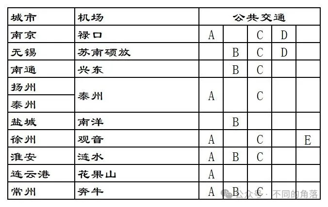

**1、南京禄口机场**

**A**：**市区机场巴士**，目前有3条线路，2号线河西万达广场发车第二班起经停南京南站。

可以在“南京机场空港快线”微信公众号查询线路信息，具体发车信息已当天公布为准。

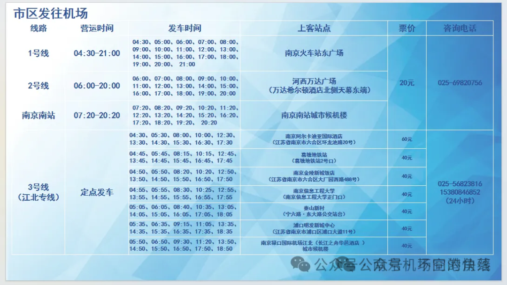

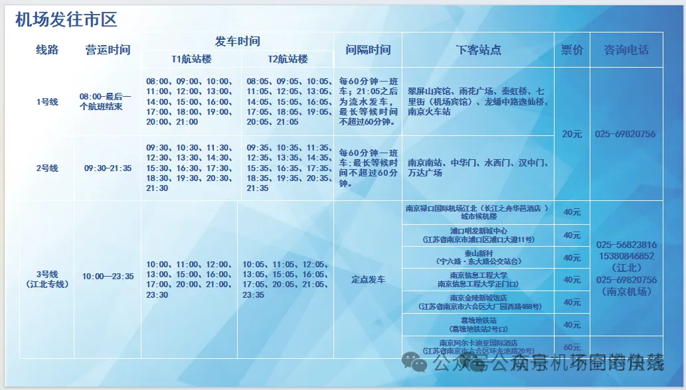

**C：城际班车，**有从南京禄口机场发往沐阳、淮安、泰州、泰兴、靖江、扬州、仪征、江都、高邮、宝应、镇江、句容、丹阳、扬中、常州、金坛、溧阳、宜兴、江阴等江苏省内城市和安徽省芜湖、滁州、天长、马鞍山、来安等城市。

可以在“南京机场空港快线”微信公众号查询线路信息，具体发车信息已当天公布为准。

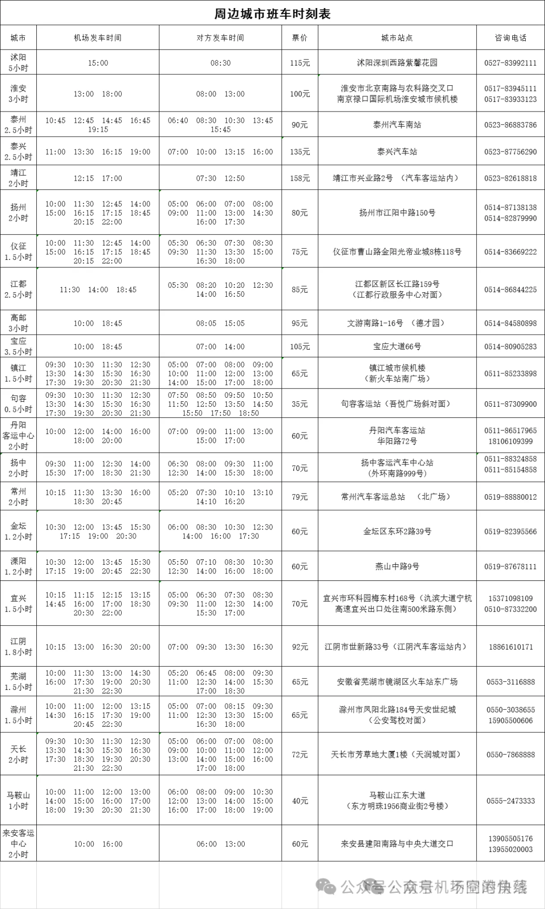

**D**：**地铁S1线**，票价2-7元。

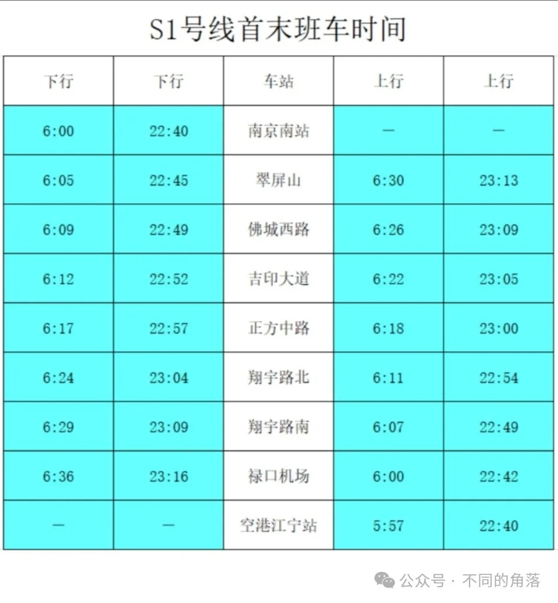

**2、无锡硕放机场**

**B**：无锡市区公交773路，城际公交苏锡公交1号线。

**773路**，票价2元。

工博园枢纽→无锡硕放机场，

发车时间：6:00-18:00；

航达路(无锡硕放机场)→无锡硕放机场→工博园枢纽，

发车时间：6:00-18:00。

**苏锡公交1号线**，票价2元。

沪宁城铁新区站(苏州)→无锡硕放机场，

发车时间：6:30-17:30；

无锡硕放机场→沪宁城铁新区站，

发车时间：6:30-17:30。

**C：城际班车，**有苏州、常熟、靖江、张家港、宜兴、江阴等江苏省内线路。

可以到“无锡客运”微信公众号、“苏汽直通车”微信公众号或“巴士管家”小程序查询购票。

咨询电话：0510-82588188。

机场↔常熟，票价55元。

常熟南站→无锡硕放机场，

发车时间：8:58-18:00。

无锡硕放机场→常熟南站，

发车时间：9:30-20:00。

常熟北站→无锡硕放机场，

发车时间：9:55。

无锡硕放机场→常熟北站，

发车时间：17:20-20:00。

机场↔靖江，票价90元。

靖江汽车站→无锡硕放机场，

发车时间：5:55-16:45。

无锡硕放机场→常熟南站，

发车时间：10:00-19:20。

机场↔张家港，票价65元。

张家港客运站→无锡硕放机场，

发车时间：7:50-18:30。

无锡硕放机场→张家港客运站，

发车时间：9:20-19:00。

机场↔宜兴，票价65元。

宜兴客运站→无锡硕放机场，

发车时间：7:10、9:30。

无锡硕放机场→宜兴客运站，

发车时间：9:35-16:45。

机场↔江阴周庄，票价50元。

江阴周庄汽车站→无锡硕放机场，

发车时间：6:30-16:00。

无锡硕放机场→无锡东站→顾山→新桥→华士→华西→江阴周庄汽车站，

发车时间：9:10-18:00。

机场↔苏州，票价35-59元。

苏州火车站北广场客运站→无锡硕放机场，

发车时间：8:30-18:00。

无锡硕放机场→苏州火车站北广场客运站，

发车时间：9:10-19:00。

苏州城市航站楼→无锡硕放机场，

发车时间：5:20-20:20。

无锡硕放机场→元和之春公交站→苏州园区(苏州城市航站楼)，

发车时间：10:30-19:40。

苏州高新区城市航站楼→无锡硕放机场，

发车时间：5:00-18:00。

无锡硕放机场→苏州新区(苏州高新区城市航站楼)→团结桥地铁站，

发车时间：11:00-21:40。

无锡硕放机场→苏州西环路地铁站→团结桥地铁站→金库桥地铁站，

发车时间：21:00。

无锡硕放机场→苏州火车站，

发车时间：22:30。

**D**：**地铁3号线**，票价2-6元。

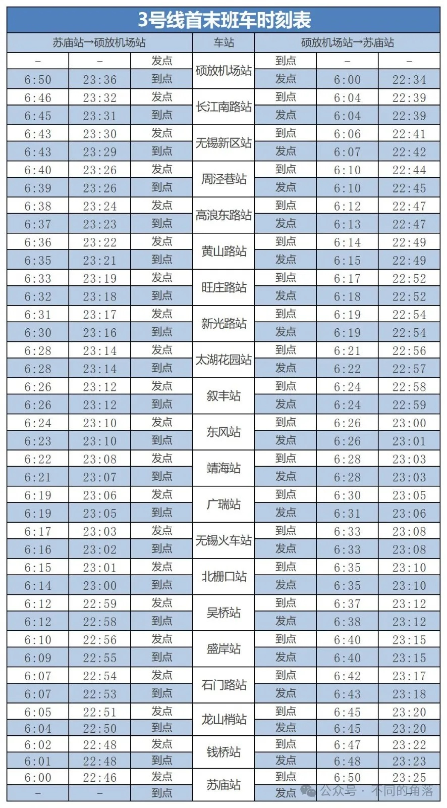

**3****、南通兴东机场**

**B**：公交**D23路、213路、611路、622路、633路、677路、803路**。

咨询电话：0513-85896196(D23)，

咨询电话：0513-86513102(213)，

咨询电话：0513-83519379(其它)。

**D23路**，票价2元。

灰堆坝(内)→南通机场，

发车时间：7:00-18:00；

南通机场→灰堆坝(内)，

发车时间：8:00-19:00。

**213路**，票价2元。

兴仁派出所→南通机场→胜利桥公交回车场，

发车时间：6:30-18:40；

胜利桥公交回车场→南通机场→兴仁派出所，

发车时间：5:30-17:40。

**611路**，票价2元。

校西公交停车场→南通机场→兴东公交回车场，

发车时间：5:30-19:20；

兴东公交回车场→南通机场→校西公交停车场，

发车时间：5:30-19:20。

**622路**，票价2元。

口腔医院北院→南通机场，

发车时间：8:00、10:30、12:30、13:15、14:30、15:30、16:30；

南通机场→口腔医院北院，

发车时间：10:00-18:00。

**633路**，票价2元。

海风街桃园路北→南通机场，

发车时间：8:00、9:30、10:20、11:50、13:20、14:50、17:00；

南通机场→海风街桃园路北，

发车时间：9:30、11:00、12:30、14:00、16:00、17:00、18:00。

**677路**，票价3元。

南通西站→南通机场，

发车时间：9:00、12:00、15:00、18:00；

南通机场→南通西站，

发车时间：10:30、13:30、16:30、19:30。

**803路**，票价6元。

通州湾汽运中心北→南通机场→南通站，

发车时间：6:30-15:30；

南通站→南通机场→通州湾汽运中心北，

发车时间：8:30-17:30。

**C：城际班车，**有如皋、海安班车。

机场↔如皋，票价45元。

可以在“巴士管家”小程序、“飞鹤购票”小程序或“南通汽运集团”微信公众号查询购票。

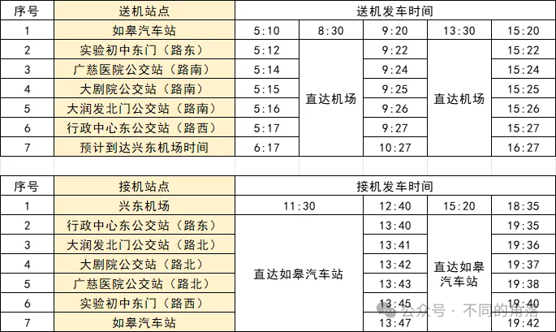

机场↔海安(商务车)，票价50元。

海安汽车站→机场，

发车时间：8:00、13:00。

机场→海安汽车站，

发车时间：10:50、14:50。

**4****、扬州泰州机场**

**A**：扬州市区机场巴士，票价30元。

目前有东线和西线，可以在“巴士管家”小程序查询预订部分站点班次。

咨询电话：0514-86100777。

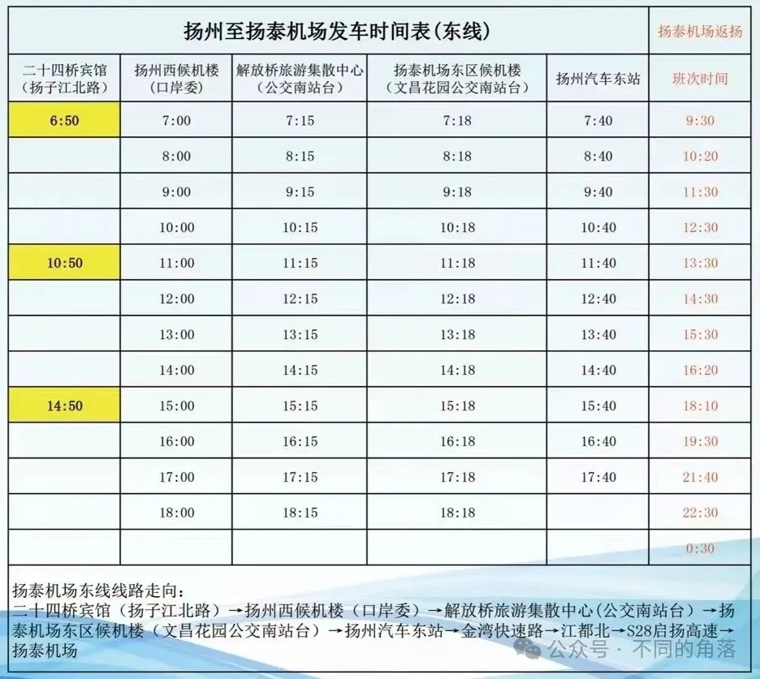

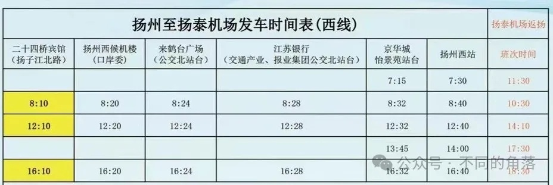

西区候机楼：维扬路252号，

东区候机楼：文昌中路1号运河城市广场3栋。

**C：城际班车，**有泰州、高邮、姜堰城市候机楼班车。

咨询电话：0523-86050011。

机场↔泰州(大巴车)，票价25元。

泰州候机楼→机场，

发车时间：8:00、10:00、12:00、14:00、16:00、19:30。

机场→泰州候机楼，

发车时间：10:10、12:10、14:10、16:10、18:10、22:30。

机场↔泰州(商务车)，票价50元。

可以上门接送。

泰州候机楼→机场，

发车时间：7:00、9:00、11:00、13:00、15:00、17:00、18:30。

机场→泰州候机楼，

发车时间：9:10、11:10、13:10、15:10、17:10、19:10、20:30。

泰州候机楼：海陵区青年南路2号(泰州汽车客运南站)。

机场↔高邮，票价35元。

高邮候机楼→机场，

发车时间：8:00、11:10、15:30。

机场→高邮候机楼，

发车时间：10:00、13:30、17:30。

高邮候机楼：高邮市海潮路51号。

机场↔姜堰，票价50元。

姜堰候机楼→机场，

发车时间：7:30、9:00、10:00、11:30、13:00、14:30、16:00、18:00、19:30。

机场→姜堰候机楼，

发车时间：9:30、11:00、12:00、13:30、15:00、16:50、19:00、21:30、22:30。

姜堰候机楼：姜堰区人民中路1号(姜堰汽车客运站)。

**5、盐城南洋机场**

**B**：公交**98路、15路、K****203路、夜1路**。

咨询电话：0515-69009900。

**98路机场专线**，票价2元。

市行政中心(西)→盐城南洋国际机场，

发车时间：7:30-21:50。

盐城南洋国际机场→市行政中心(西)，

发车时间：8:00-21:00。

**15路**，票价1元。

万达广场→盐城南洋机场，

发车时间：6:30-18:30。

盐城南洋机场→万达广场，

发车时间：6:30-18:30。

**K203路**，票价1-6元。

高铁站西广场→南洋机场→洋马车站，

发车时间：6:30-18:00。

洋马车站→南洋机场→高铁站西广场，

发车时间：6:30-18:00。

**夜1路**，票价2元。

高铁站西广场→南洋机场，

发车时间：19:00-23:00。

南洋机场→高铁站西广场，

发车时间：19:00-23:00。

**6、徐州观音机场**

**A**：目前有徐州汽车总站(徐州火车站)、云龙万达广场(如家精选酒店)、徐州汽车东站(徐州高铁东站)3条线路，单程票价都是25元。

还有市区定制专线，票价40元。

寒暑假放假时，可能会临时开通矿大南湖校区→观音机场单向班车，票价30元。

寒暑假开学时，可能会临时开通观音机场→矿大南湖校区→单向班车，票价30元。

三条固定班线、定制专线、临时班车都可以在“徐州空港巴士”微信公众号查询购票。

咨询电话：0516-83707377。

**徐州汽车总站线**：

徐州汽车总站→陶瓷市场→汽车南站→观音机场，

发车时间：6:00、6:30、7:00、7:30、8:10、9:00-20:00每小时一班，20:00班次经停徐州高铁东站。

观音机场→汽车南站→陶瓷市场→徐州汽车总站，

发车时间：根据航班到达时间安排发车，有航班进港就有班车。

**云龙万达广场线**：

云龙万达广场→观音机场，

发车时间：8:10、8:50、9:30、10:30、13:10、15:30、16:30、18:00。

观音机场→云龙万达广场，

发车时间：根据航班到达时间安排发车，有航班进港就有班车。

**徐州汽车东站线**：

徐州汽车东站→美的广场→观音机场，

发车时间：8:40、9:20、10:00、11:00、12:30、13:40、16:00、17:00、18:30、20:30(徐州汽车总站始发车)。

观音机场→美的广场→徐州汽车东站，

发车时间：根据航班到达时间安排发车，有航班进港就有班车。

徐州市区↔观音机场定制专线：

徐州市区上门接送，票价40元。

预约电话：17327676735(工作时间咨询预约8:30-11:30、15:00-17:30)。

**C：城际班车，**有江苏省内丰县、沛县、新沂、邳州、宿迁、连云港，山东省枣庄，河南省永城，安徽省淮北、宿迁线路。

都可以在“徐州空港巴士”微信公众号或“巴士管家”小程序查询购票。

咨询电话：0516-83707377。

机场↔丰县，票价70元。

丰县汽车站→观音机场，

发车时间：7:00、13:30。

观音机场→丰县汽车站，

发车时间：10:30、15:30。

机场↔沛县，票价60元。

丰县汽车站→观音机场，

发车：7:00、9:00、14:00、16:30。

观音机场→丰县汽车站，

发车:10:30、13:00、17:30、19:00。

机场↔新沂，票价66元。

新沂汽车站→观音机场，

发车：7:00、10:00、13:00。

观音机场→新沂汽车站，

发车：10:30、13:00、15:00。

机场↔邳州，票价40元。

邳州汽车站→观音机场，

发车：6:30、8:00、11:30、13:00、15:00、17:10。

观音机场→邳州汽车站，

发车：9:30、11:00、13:00、15:00、16:30、18:30。

机场↔宿迁，票价50元。

宿迁汽车站→观音机场，

发车：7:00、8:30、11:00、13:40、16:00。

观音机场→宿迁汽车站，

发车：9:30、11:00、13:00、15:30、18:00。

机场↔连云港，票价120元。

海连西路农工商超市→观音机场，

发车：7:30、9:30、12:00、16:00。

观音机场→海连西路农工商超市，

发车：9:30、11:00、13:00、15:30、18:00。

机场↔枣庄，票价60元。

枣庄薛城高铁站→观音机场，

发车：7:00、9:00、11:00、14:00、16:30。

观音机场→枣庄薛城高铁站，

发车：9:30、11:00、13:00、15:30、18:00。

机场↔永城，票价100元。

永城客运站→观音机场，

发车：7:00、14:00。

观音机场→永城客运站，

发车：10:40、18:00。

机场↔宿州，票价60元。

宿州快客站→观音机场，

发车：6:00、10:00、14:10。

观音机场→宿州快客站，

发车：9:30、13:00、15:00、18:30。

机场↔淮北，票价70元。

淮北客运中心站→观音机场，

发车：6:30、8:00、10:00、12:30、14:00、16:00、18:00、19:30。

观音机场→淮北客运中心站，

发车：10:30、13:00、15:00、18:00、20:00。

**D**：徐州观音机场坐免费摆渡车至**观音机场高铁站**，有去往徐州东、南京、扬州、盐城、宿迁、睢宁、泗阳、商丘、郑州东、武汉、长沙南、贵阳北、淮安东、南通西、镇江、高邮、马鞍山东、芜湖、铜陵、池州、安庆、海安、东台、如皋南、常熟、张家港、太仓、上海虹桥等站高铁动车。

每一趟高铁到达，都有摆渡车在站前等候；高铁发车前半小时，观音机场T2航站楼前摆渡车发车。

详细运营时间和票价可以到铁路12306官网/APP查询。

**7、淮安涟水机场**

**A**：淮安市区机场巴士，免费乘坐。

咨询电话：0517-81666666-1。

徐州鼎立酒店→翔宇北道·健康路站→淮海中学站→机场，鼎立酒店发车10分钟到翔宇北道·健康路站，20分钟到淮海中学。

发车时间：19:00、21:00，21:00班次根据客流情况发车，不一定每天都有。

机场→淮海中学站→翔宇北道·健康路站→鼎立酒店，

发车时间：20:00、22:00、最后一班航班到达30分钟。

**B**：公交**733路**，票价3-4元。

咨询电话：0517-9688996。

北京新村→机场航站楼，

发车时间：6:30-17:30；

机场航站楼→北京新村，

发车时间：8:00-18:50。

**C：城际班车，**有发往沭阳、宿迁线路。

咨询电话：13815739168。

机场↔沭阳，票价25元。

随车电话：13815739168。

沭阳东站→淮安机场→涟水汽车站，途经马厂镇、沂涛镇、高沟镇、梁岔镇、成集镇、陈师街道到淮安涟水机场，终到涟水汽车站，

发车时间：7:50、14:00；

淮安机场→沭阳东站，

发车时间：10:30(涟水汽车站10:00始发，途经涟水高铁站、涟水机场)、15:20(涟水机场始发，途经涟水高铁站，16:00途经涟水汽车站)。途经陈师街道、成集镇、梁岔镇、高沟镇、沂涛镇、马厂镇终到沭阳汽车客运东站。

机场↔宿迁，票价70元。

随车电话：13812408429。

宿迁客运站→淮安机场，

发车时间：7:30、13:30；

淮安机场→宿迁客运站，

发车时间：9:30、15:20。

**8、连云港花果山机场**

**A**：市区机场巴士，票价20元。

咨询电话：0518-85366666。

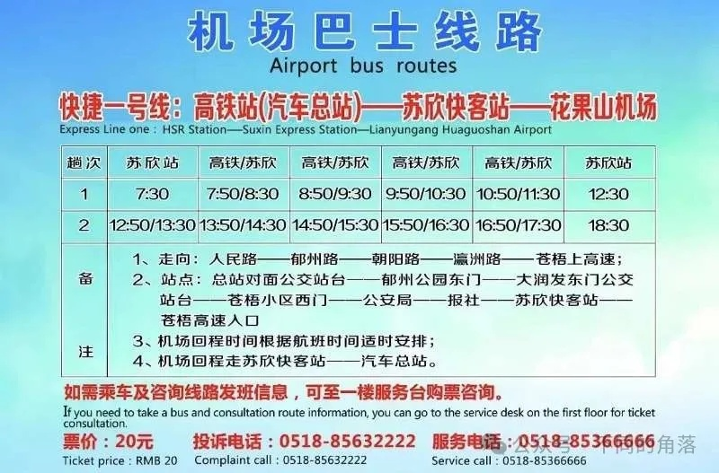

**9、常州奔牛机场**

**A**：**市区机场巴士**，目前有火车站北广场、通江路候机楼、武进汽车站、常州北站4条线路。

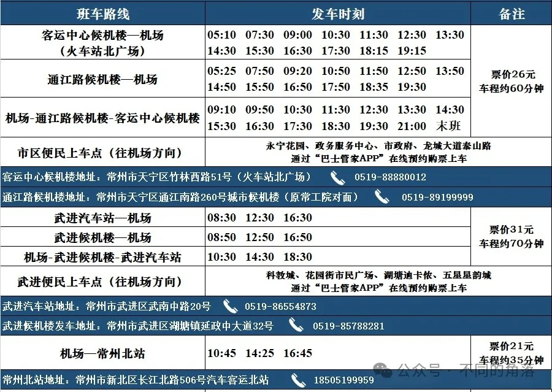

**B**：公交**32路**，票价3元。

咨询电话：0519-67896683。

火车站公交中心站→民航机场，

发车时间：6:30-17:00；

民航机场→火车站公交中心站，

发车时间：6:40-18:11。

**C：城际班车，**有发往镇江、丹阳、江阴、璜土、靖江线路。

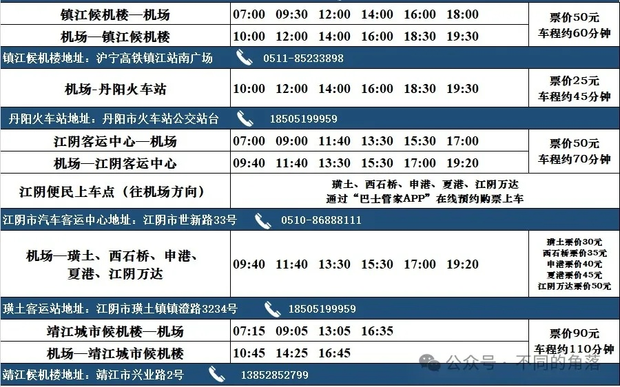

**国内其它省市区机场交通**：

01、北京+天津

[航空常识之五国内城市机场交通京津篇](http://mp.weixin.qq.com/s?__biz=MzU4OTczMzkwNw==&mid=2247526891&idx=1&sn=7459bf1b32f6f8dda4f8e9bcdaa1f8bf&chksm=fdcb2097cabca98132ad10b5d04f67b994da206aa37f822b18f2bd32eeaed49910aa42a3e7d9&scene=21#wechat_redirect)

02、上海交通

[航空常识之五国内城市机场交通上海篇](http://mp.weixin.qq.com/s?__biz=MzU4OTczMzkwNw==&mid=2247516893&idx=1&sn=fb77af6a6d79dd71b089b880099adc79&chksm=fdcbcba1cabc42b739e7509f11d95d8c95b4b4d987f7d42de53289296fc6cbb8874b6b1b47df&scene=21#wechat_redirect)

03、重庆交通

[航空常识之五国内城市机场交通重庆篇](http://mp.weixin.qq.com/s?__biz=MzU4OTczMzkwNw==&mid=2247515264&idx=1&sn=058956ac26bf998af33d12cb74a67a5e&chksm=fdcbf5fccabc7cea4c4fd9e8e3f3ac9fc136abfe18cea6d33c2558d101b36ec4403a4ee24d1c&scene=21#wechat_redirect)

04、河北交通

[航空常识之五国内城市机场交通河北篇](http://mp.weixin.qq.com/s?__biz=MzU4OTczMzkwNw==&mid=2247515187&idx=1&sn=58041e1b7779e76783c48e076fadca3d&chksm=fdcbf54fcabc7c594d1a810035a30e713f141e8869e82e99bb3583342c3417077f8dbec639e7&scene=21#wechat_redirect)

05、山西交通

[航空常识之五国内城市机场交通山西篇](http://mp.weixin.qq.com/s?__biz=MzU4OTczMzkwNw==&mid=2247519772&idx=1&sn=6f844d3f187eae5b64311cd15551f237&chksm=fdcbc760cabc4e76386b790aaff5ba7ffb59ac0f5f98f3f1292162244916bd07dce71971b6ea&scene=21#wechat_redirect)

06、河南交通

[航空常识之五国内城市机场交通河南篇](http://mp.weixin.qq.com/s?__biz=MzU4OTczMzkwNw==&mid=2247521754&idx=1&sn=d4168d889454b2a4c39f4d19cb499f91&chksm=fdcbdca6cabc55b04b3d51265d7a2a80e1ee7994ad755f0e565fe75241223fb51be9c982914c&scene=21#wechat_redirect)

07、辽宁交通

[航空常识之五国内城市机场交通辽宁篇](http://mp.weixin.qq.com/s?__biz=MzU4OTczMzkwNw==&mid=2247523674&idx=1&sn=db52f5f213636a12d09753cf3883609a&chksm=fdcbd426cabc5d306bc94656ff517542c1534f0fc8293139bfe7fb0bd7856c393704a197a0f8&scene=21#wechat_redirect)

08、吉林交通

[航空常识之五国内城市机场交通吉林篇](http://mp.weixin.qq.com/s?__biz=MzU4OTczMzkwNw==&mid=2247516944&idx=1&sn=626b5684cecceb3d0fee0f5eb2670de2&chksm=fdcbca6ccabc437a50a691c92f70f5d9f7b332cad9bf8de22d7d08966c425deade78e8b17ad5&scene=21#wechat_redirect)

09、黑龙江交通

[航空常识之五国内城市机场交通黑龙江篇](http://mp.weixin.qq.com/s?__biz=MzU4OTczMzkwNw==&mid=2247522371&idx=1&sn=62b46df0a9d6861ea1f84631e5cd5060&chksm=fdcbd13fcabc58296df9130282a542a65ea486f0f2c1454616c5cdd2157c8b62fb46ccedb41a&scene=21#wechat_redirect)

10、内蒙古交通

[航空常识之五国内城市机场交通内蒙古篇](http://mp.weixin.qq.com/s?__biz=MzU4OTczMzkwNw==&mid=2247522056&idx=1&sn=23020741b40b5817fa3d525f3ab28f8f&chksm=fdcbde74cabc576228854b373226a24e79dd0ec084f0f73f713ed9b22049fb49cd945f4d77bc&scene=21#wechat_redirect)

13、安徽交通

[航空常识之五国内城市机场交通安徽篇](http://mp.weixin.qq.com/s?__biz=MzU4OTczMzkwNw==&mid=2247527490&idx=1&sn=fe6ee629e160504d75c4728d694c051d&chksm=fdcb253ecabcac2850aaab81ed997d44b7e7c9b1ca93b5fccd6c321e98943d72a12c96e03c7f&scene=21#wechat_redirect)

16、湖北交通

[航空常识之五国内城市机场交通湖北篇](http://mp.weixin.qq.com/s?__biz=MzU4OTczMzkwNw==&mid=2247516942&idx=1&sn=e6d68352a5b4c6a2eb16620cf517c849&chksm=fdcbca72cabc43641fd9d656c6a5e6cffd92917e68f0ee2866300c5c3f62932de8d426dc65cf&scene=21#wechat_redirect)

17、湖南交通

[航空常识之五国内城市机场交通湖南篇](http://mp.weixin.qq.com/s?__biz=MzU4OTczMzkwNw==&mid=2247522046&idx=1&sn=d29a3606543ea354a873a0da37c01e0d&chksm=fdcbdf82cabc56941926684286d5c5a1b5797166a503993549707f9fec498a03e0f8031ed6a3&scene=21#wechat_redirect)

18、广东交通

[航空常识之五国内城市机场交通广东篇](http://mp.weixin.qq.com/s?__biz=MzU4OTczMzkwNw==&mid=2247523223&idx=1&sn=75bee260befb70235db9c51073fb4d37&chksm=fdcbd2ebcabc5bfd7a1ad825bc45169358b93bb3caa9dd3b6418785cb712c577b77d0930212d&scene=21#wechat_redirect)

19、广西交通

[航空常识之五国内城市机场交通广西篇](http://mp.weixin.qq.com/s?__biz=MzU4OTczMzkwNw==&mid=2247536045&idx=1&sn=4cd93b952b43ddddd25b375c9be07c1f&chksm=fdcb04d1cabc8dc75c407e2f9cf80649c42c8ffc907c20c850ff8be0d44731a8fcfbf8cdc056&scene=21#wechat_redirect)

20、江西交通

[航空常识之五国内城市机场交通江西篇](http://mp.weixin.qq.com/s?__biz=MzU4OTczMzkwNw==&mid=2247516125&idx=1&sn=425e38f0dc82ebcb183140073a80299b&chksm=fdcbf6a1cabc7fb7a3254acc6cc20fcd3bbcf619b3ed12258f2bd06314dacf88490354118889&scene=21#wechat_redirect)

21、四川交通

[航空常识之五国内城市机场交通四川篇](http://mp.weixin.qq.com/s?__biz=MzU4OTczMzkwNw==&mid=2247523176&idx=1&sn=726daa85b46e1290efe86684797eb11b&chksm=fdcbd214cabc5b0237bce9f944d9aeff734df39fceca6d1561aab2482d0c2e64c5072b125fac&scene=21#wechat_redirect)

22、贵州交通

[航空常识之五国内城市机场交通贵州篇](http://mp.weixin.qq.com/s?__biz=MzU4OTczMzkwNw==&mid=2247517961&idx=1&sn=3ebe973ef18943497fed7a7aff20ea66&chksm=fdcbce75cabc4763069147b87a63f9eccf72bb10c6316484d16a167d66f08b8e9b98b52c63dd&scene=21#wechat_redirect)

23、云南交通

[航空常识之五国内城市机场交通云南篇](http://mp.weixin.qq.com/s?__biz=MzU4OTczMzkwNw==&mid=2247517544&idx=1&sn=5d5f2675db763d067e9c0e7dc4b7dddc&chksm=fdcbcc14cabc4502858cd32031f20e913e6c8719fa3ec09fd3a002a84eb1d85dca4fcc9bbb36&scene=21#wechat_redirect)

24、西藏交通

[航空常识之五国内城市机场交通西藏篇](http://mp.weixin.qq.com/s?__biz=MzU4OTczMzkwNw==&mid=2247523638&idx=1&sn=396892311ba2d73a6855ebb03e957a8e&chksm=fdcbd44acabc5d5c7cb70ea30dc2edb4f6439ed5169187510830d4217343584eb17e6d94cce2&scene=21#wechat_redirect)

25、海南交通

[航空常识之五国内城市机场交通海南篇](http://mp.weixin.qq.com/s?__biz=MzU4OTczMzkwNw==&mid=2247526801&idx=1&sn=8870a982773c64626f5e70910709fe1c&chksm=fdcb20edcabca9fbd15e60cf9a859621f4b51d30fb1f3a9907f9a921cb180f3422eacfe4e2de&scene=21#wechat_redirect)

26、陕西交通

[航空常识之五国内城市机场交通陕西篇](http://mp.weixin.qq.com/s?__biz=MzU4OTczMzkwNw==&mid=2247533037&idx=1&sn=352cfc7a59cda8801aacd13dc5f3e7ee&chksm=fdcb0891cabc8187ae01d6321b1b6ad334a46de9c684fd18e346c89b21fb4dbdd097f01398b4&scene=21#wechat_redirect)

27、甘肃交通

[航空常识之五国内城市机场交通甘肃篇](http://mp.weixin.qq.com/s?__biz=MzU4OTczMzkwNw==&mid=2247522283&idx=1&sn=afd366d57e4127b1d56c94b4f8eaf172&chksm=fdcbde97cabc5781486c8aa33b08d71a1744c41c29280dbfc2bd4d49381e8624a3e37a1a6293&scene=21#wechat_redirect)

28、宁夏交通

[航空常识之五国内城市机场交通宁夏篇](http://mp.weixin.qq.com/s?__biz=MzU4OTczMzkwNw==&mid=2247515148&idx=1&sn=8154a39c597d3f10675ba40dee198fa7&chksm=fdcbf570cabc7c660a38a9561c98a00041dbe7715cc79c13f40e50137ecb9d4f1695cb7b5228&scene=21#wechat_redirect)

29、青海交通

[航空常识之五国内城市机场交通青海篇](http://mp.weixin.qq.com/s?__biz=MzU4OTczMzkwNw==&mid=2247519998&idx=1&sn=8c5fd86bce03bca7f41f0cf4d5d4a222&chksm=fdcbc782cabc4e94d1ec71b767bcf0603fcf1dea8814f6f71eb1f9b5b1420e9d27c88c5b59e9&scene=21#wechat_redirect)

30、新疆交通

[航空常识之五国内城市机场交通新疆篇](http://mp.weixin.qq.com/s?__biz=MzU4OTczMzkwNw==&mid=2247531003&idx=1&sn=656e1128bef27fe67ccdb6a0eecb075e&chksm=fdcb3087cabcb991215ace2eb315e8131b55c0d8c21091bd953a5a24dee45b5d18d2fea6c6dd&scene=21#wechat_redirect)

更多的航空常识、酒店常识、酒店行业资讯、酒店集团、沈阳旅游、沙发客等相关内容可以到我的微信公众号里查看。

也欢迎大家关注我的微信公众号：**sfk024**

公众号名称：**不同的角落**

在微信公众号搜索sfk024或是不同的角落都可以搜索到，也可以直接扫码或长按识别下方二维码关注。

