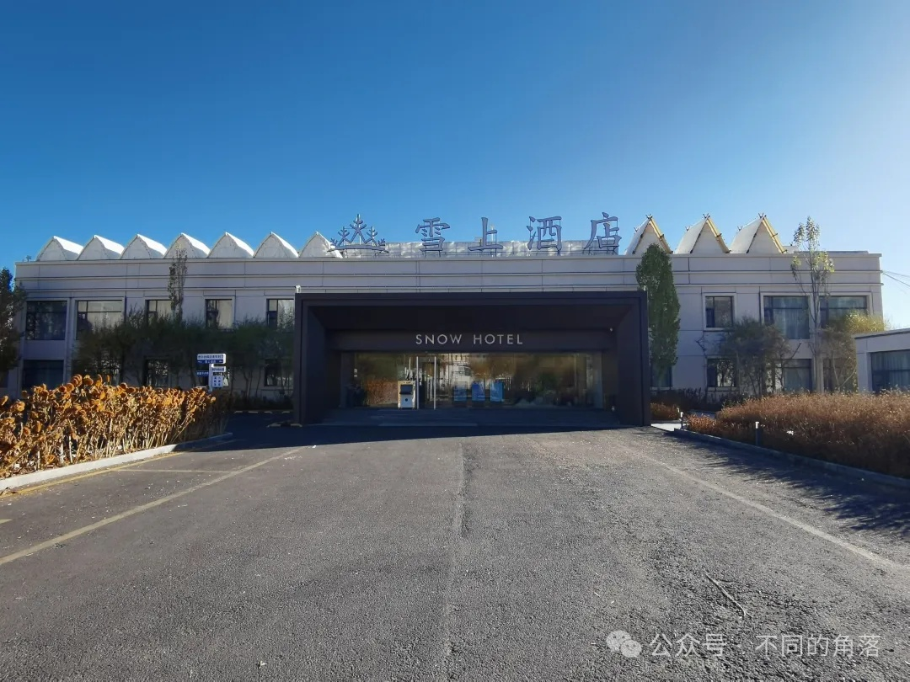
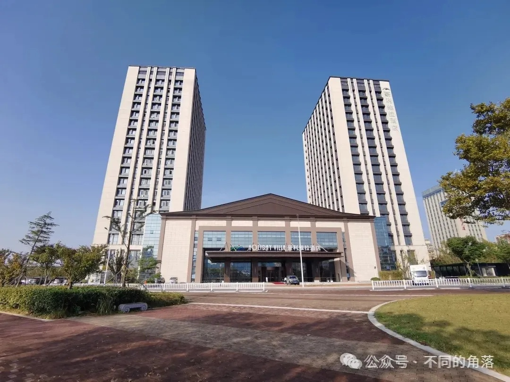
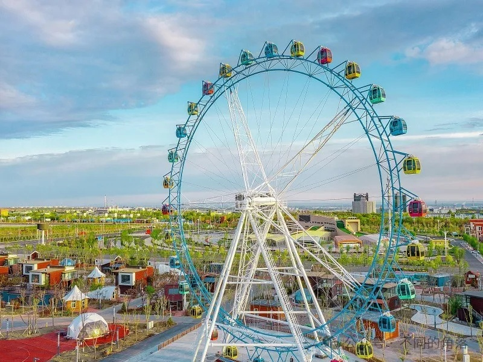
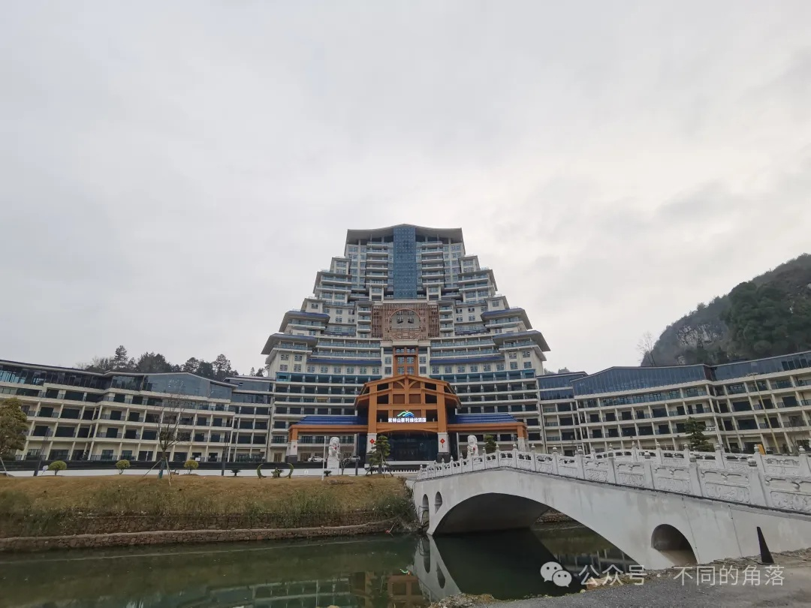
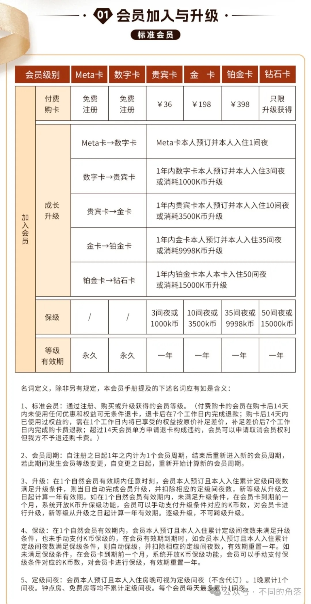
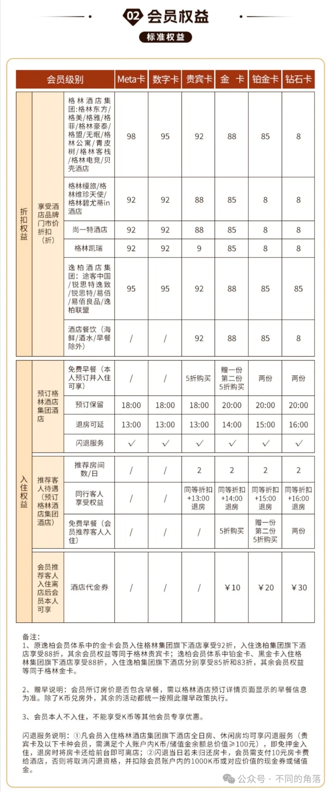
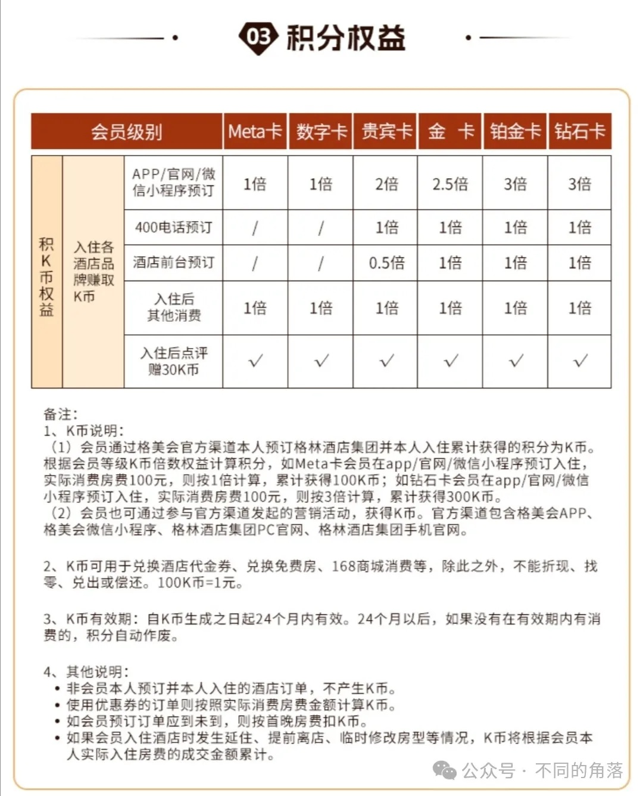
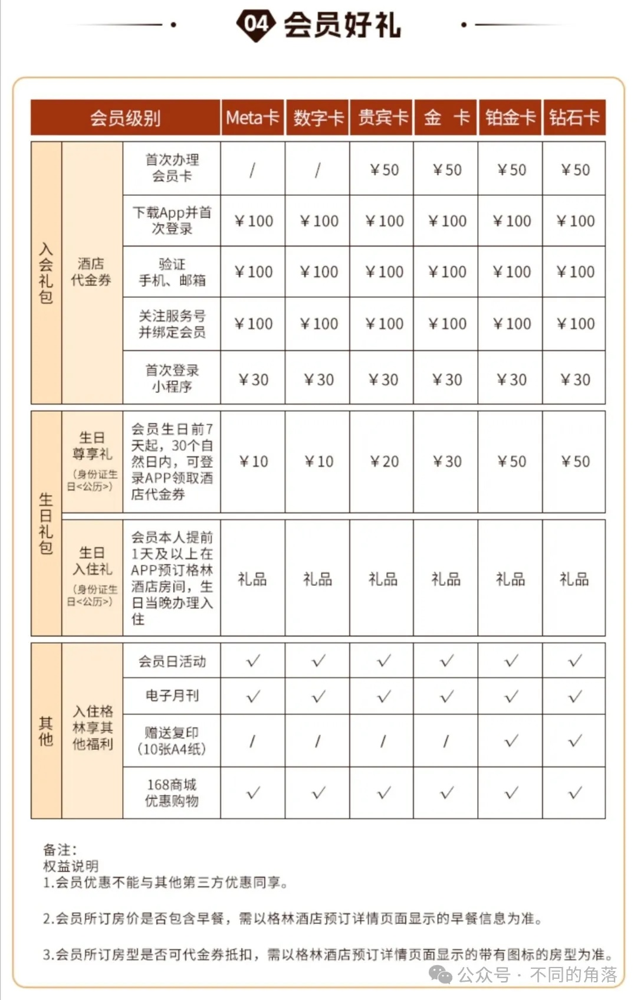

# 国内酒店集团之四格林

> **作者**：不同的角落  
> **发布时间**：2025年2月19日 23:53  
> **原文链接**：[国内酒店集团之四格林](http://mp.weixin.qq.com/s?__biz=MzU4OTczMzkwNw==&mid=2247555441&idx=1&sn=fd78cd9b07aa50647bb22b00647c41ef&chksm=fdcb500dcabcd91b8b00407ebb9101bc62be656506d3660765e1d83520794f8adca7c7d5e257)

---

本文关键词“格林”，公众号发送“格林”就可看到。

国内四大酒店集团，如果每家都起一个响亮的绰号，我个人觉得如下名称比较般配，

锦江——拾荒大师，

华住——忽悠大师，

首旅——摆烂大师，

格林——分手大师。

**格林的N次分手**：

格林历年来与多家酒店集团有过合作，其中部分合作模式是格林注资入股或是成立合资酒管公司，现在大多数都已分手。

有的是彻底分手一别两宽，有的是纠缠不清藕断丝连，有的是分了又合再续前缘。

1、第一次分手—格林与中青旅。

2013年，格林豪泰联合中青旅酒店推出高端酒店品牌——中青旅东方国际酒店，布局高端酒店市场。

2015年1月，中青旅东方上海嘉定国际酒店、中青旅东方九江庐山白云山庄酒店、中青旅东方上海淮海国际酒店陆续上线格林豪泰官网开放预订。

2016年，中青旅东方九江庐山白云山庄酒店、中青旅东方上海淮海国际酒店陆续退出。

2018年，中青旅东方上海嘉定国际酒店退出，至此格林旗下高端品牌中青旅东方酒店彻底消失，格林与中青旅合作结束。

2、第二次分手—格林与雅阁。

2019年1月，格林宣布将收购雅阁酒店(澳大利亚)集团多数股权。

2019年4月，格林入股雅阁酒店管理(北京)有限公司，持股60%成为大股东，雅阁酒店(澳大利亚)集团由全资持股降至40%。

2019年7月，雅阁国内20多家酒店上线格林酒店官方预订平台，格林酒店格美会不同等级会员预订雅阁国内酒店可以享受对应的房价折扣和其它权益。

2019年7月12日，雅阁酒店集团宣布全新升级集团会员忠诚计划，由原来的旅佳会升级为格林酒店格美会常旅客会员计划。

2020年雅阁酒店会员计划又由格美会改为旅佳会。

2020年部分雅阁酒店从格林酒店官方预订平台下架。

2021年时格林酒店APP上雅阁旗下品牌酒店还剩余10多家（雅阁国内酒店50多家），且仅能查询不能预订。

2023年初格林APP全线下架雅阁旗下品牌酒店。后期又有10多家上线格林APP，但都是显示“今日满房”，不能预订。

目前格林APP国内各城市总共还有10多家雅阁旗下品牌酒店，都是显示“今日满房”，不能预订。

2019年至2022年格林年报里公布的旗下已开业酒店都包括雅阁旗下国内已开业酒店，2023年格林年报里公布的旗下已开业酒店不再包括雅阁旗下国内已开业酒店。

3、第三次分手—格林与都市。

2019年12月格林注资入股山东星辉都市酒店管理集团有限公司，持股70%。

格林酒店2019、2020、2021年三年年报，公布的旗下已开业酒店包括都市旗下全部酒店（2019年都市701家酒店、2020年都市749家酒店、2021年都市750家酒店）。

不过都市旗下酒店并没有上线格林官方预订平台。

2022年12月格林转让持有的都市70%股份给都市创始人相关公司，与都市合作结束，格林2022年年报公布的旗下已开业酒店不再包括都市旗下酒店。

2023年12月，岭南集团收购都市70%股份，跃居国内第九大酒店集团。

4、第四次分手—格林与凯瑞。

2021年1月，格林与武汉凯瑞天空酒店管理集团合资(格林出资50%)成立武汉格林凯瑞酒店管理有限公司。之后凯瑞天空酒店集团旗下酒店上线格林官方预订平台，凯瑞酒店会员计划尊爵会升级为格美会。

现在格林APP上只有几家凯瑞品牌酒店，都是显示“即将开业”，不能预订。凯瑞酒店集团原有的尊爵会会员计划也停了，现在凯瑞酒店集团旗下酒店只能在OTA预订。目前武汉格林凯瑞酒店管理有限公司还是存续状态。

5、第五次分手—格林与尚格。

2020年1月，格林同尚一特酒店品牌达成战略合作庆祝仪式在武汉举办，计划未来三年，尚一特酒店将通过跟格林酒店集团的战略合作计划将门店数扩张至600家。随后尚一特酒店上线格林官方预订平台，原尚一特会员计划升级为格美会。

2021年3月格林与尚格酒店管理(武汉)有限公司合资(格林出资51%)成立格林尚格酒店管理(武汉)有限公司。

现在格林APP上只有十多家尚一特品牌酒店，都是显示“今日满房”，不能预订。尚格酒店集团原有的“尚格酒店”小程序预订也停了，现在尚格旗下酒店只能在OTA预订。目前格林尚格酒店管理(武汉)有限公司还是存续状态。目前尚格旗下品牌酒店查询还是到只有几十家。

6、第六次分手—格林与橡树林。

2021年4月，格林与重庆和悦庄酒店集团战略合作签约仪式暨首家大健康主题酒店“橡树林”品牌发布会在重庆举行。随后和悦庄酒店集团旗下七家橡树林酒店上线格林官方预订平台，后续新开业的三家橡树林酒店也陆续上线格林官方预订平台。但时间不长就不能预订了。

现在格林APP上还有十家橡树林品牌酒店，都是显示“今日满房”或“即将开业”，不能预订。

7、第七次分手—格林与慧友。

2021年9月，格林与湖南慧友美宿酒店集团签署战略合作协议，后续慧友旗下美宿、欢致、欢漫等品牌80多家酒店陆续上线格林官方预订平台，格林会员可以会员价预订享受不同等级会员权益并累积积分。

2024年下半年，慧友旗下酒店全部从格林官方平台下架，合作结束。

8、第八次分手—格林与施泰根博阁。

2016年底，格林豪泰与德国施泰根博阁酒店集团（2017年更名为德意志酒店集团）达成战略合作，共同部署在华酒店业务。施泰根博阁酒店集团2014年进驻国内，至2016年底已签约7家国内酒店，开业的仅有没有挂牌施泰根博阁旗下品牌的北京万世名流酒店(2014年开业)和青岛施泰根博阁城际酒店(2016年11月开业，先期计划命名青岛城际酒店，后来开业时改名为施泰根博阁城际酒店，后期来又更名为青岛施泰根博阁酒店)。2019年华住收购德意志酒店集团后退出，2021年酒店更名为青岛汉德博阁酒店。

2017年，黑河银建施泰根博阁酒店开业。北京万世名流、青岛施泰根博阁、黑河银建施泰根博阁三家酒店上线2019年退出翻牌为首旅旗下建国品牌黑河银建建国酒店，2022年退出首旅更名为黑河银建酒店。

当时北京万世名流、青岛施泰根博阁、黑河银建施泰根博阁都上线格林官方平台。格林豪泰会员可以会员价预订享受不同等级会员权益并累积积分。

2019年华住收购德意志酒店集团后，三家酒店退出德意志，陆续从格林官方平台下线。青岛施泰根博阁更名为更名为青岛汉德博阁酒店，黑河银建施泰根博阁翻牌为首旅旗下建国品牌黑河银建建国酒店。

9、第九次分手—格林与国外酒店。

之前格林在美国、日本、韩国、阿联酋、越南、马来西亚等国家有十多家合作酒店，在格林APP上部分酒店部分日期可以预订。

现在格林APP上有几家国外酒店已下线，但还有十多家国外酒店(其中三家为格林2022年合作的马来西亚豪利维拉酒店集团旗下豪利维拉品牌酒店)，但都是都是显示“今日满房”或“即将开业”，不能预订。格林近两年年报里开业酒店分布也不再有国外酒店。

其中已经下线的日本hotel MONday旗下东京丰洲曼迪尊贵设计酒店，在德胧完成对hotel MONday控股投资后，目前已上线德胧官方预订平台百达屋。

10、第十次分手—格林与逸柏。

2017年4月，格林与韩国私募基金联合注资入股逸柏，格林成为逸柏最大股东，逸柏原有会员计划逸柏会升级为格美会，逸柏旗下酒店全部上线格林官方预订平台。

2024年1月，逸柏旗下400多家酒店全部从格林官方预订平台下线，逸柏重新启用逸柏会会员计划。

2024年下半年，逸柏旗下400多家酒店重新上线格林官方预订平台开放预订，目前逸柏酒店同时启用逸柏会和格美会两个会员计划。

格林历年年报开业酒店数量并不包含逸柏旗下酒店。

目前与格林合作旗下品牌国内酒店可以在格林官方预订平台预订的酒店集团有马来西亚豪利维拉酒店集团、逸柏酒店集团、江西缦旅酒店集团。

**格林概述**：

格林酒店集团，截至2023年12月31日，旗下开业酒店数量4238家（自营+租赁经营65家）客房309495间，在国内酒店集团以客房数量统计排名中，位居锦江、华住、首旅之后排名第四。

自2013年参加中国旅游饭店协会年度中国饭店集团60强排名以来，已连续11年排名第四位，未来几年中，估计还是继续排名第四位。

在2023年以开业酒店客房数量统计的全球酒店集团221强排名中，位居第12名。

格林旗下各品牌酒店数量如下：雪上1家、格林东方222家、无眠7家、格美71家、格雅71家、格菲92家、格林豪泰2220家、格林联盟+格盟568家、格林公寓20家、青皮树110家、贝壳789家、格丽+格林电竞+格林客栈67家。

[2023年度全球酒店集团221强](http://mp.weixin.qq.com/s?__biz=MzU4OTczMzkwNw==&mid=2247523528&idx=1&sn=d6ea8152a6f05bcdfd57c924f1172ccb&chksm=fdcbd5b4cabc5ca25a1bb1fd7edec8a9d1b76c19d84c021d868c41ca6d3620b51a5659c6f33f&scene=21&token=1015337714&lang=zh_CN#wechat_redirect)

**所属集团**：

格美集团。

2017年，格林豪泰酒店集团更名为格美集团，并先后收购大娘水饺、家有好面、避风塘等，进军餐饮业，由单一住宿业变更为集住宿业、餐饮业及其它产业于一体的多元化集团。原格林豪泰酒店集团业务成为格美集团旗下酒店版块，并于2018年将旗下酒店版块更名为格林酒店集团。

现旗下有大娘水饺、千家万户速食餐厅（原大娘水饺旗下快餐连锁）、家有好面、避风塘、蜀江烤鱼、重庆老灶火锅、巴贝拉、御蒸笼等餐饮品牌。

**品牌由来**：

“格林豪泰”英文Green Tree，格林为Green中文音译。

**发展历程**：

2004年，由美籍华人徐曙光携手多家美国公司在中国创办的专业化酒店管理公司格林豪泰进入中国，落户上海。

2004年11月30日，格林豪泰首店上海静安新闸路商务酒店开门迎客。

2007年，酒店数量突破100家。

2008年，格林豪泰推出非标品牌格林联盟和超经济酒店品牌格林豪泰贝壳。

2008年4月24日，首家格林豪泰贝壳酒店上海长风公园店开业。

2010年，格林豪泰酒店已经覆盖北京、上海近150个城市，格林豪泰酒店数量接近500家。

2011年，格林豪泰酒店推出中档酒店品牌格林东方。

2011年12月6日，首家格林东方酒店格林东方太原亲贤酒店开业。

2012年，格林豪泰覆盖全国200多个城市，已开业酒店700多家，推出年轻时尚品牌青皮树。

2013年，格林豪泰联合中青旅推出高端酒店品牌——中青旅东方国际酒店，布局高端酒店市场。

2014年3月19日，格林联盟孟加拉国达卡世纪公园酒店开业，这也是格林豪泰海外第一家开业酒店。

2014年4月1日，首家青皮树酒店青皮树泰安岱宗大街酒店开业。

2014年，格林豪泰在美国、韩国、孟加拉国、越南等海外国家成功布点开业几家门店。

2015年1月，中青旅东方上海嘉定国际酒店、中青旅东方九江庐山白云山庄酒店、中青旅东方上海淮海国际酒店陆续上线格林豪泰官网开放预订。

2016年，格林豪泰新推出低端经济酒店品牌贝壳，贝壳品牌不设置加盟酒店客房数量限制，同时原格林豪泰贝壳品牌停止加盟。

2016年，中青旅东方九江庐山白云山庄酒店、中青旅东方上海淮海国际酒店陆续退出。

2016年底，格林豪泰与德国施泰根博阁酒店集团（2017年更名为德意志酒店集团）开达成战略合作，共同部署在华酒店业务。

2017年4月，格林豪泰与境外私募基金联合注资1.5亿入股逸柏，逸柏酒店集团正式与格林豪泰酒店集团达成战略合作伙伴关系。

2017年4月，格林豪泰酒店集团收购大娘水饺100%股权。

2017年4月，格林豪泰酒店集团更名为格美集团，原格林豪泰酒店集团成为格美集团旗下酒店版块。

2017年10月，推出格美、格菲、格雅三个中档品牌。

2018年，格林联盟品牌更名为格盟，格美旗下酒店版块（原格林豪泰酒店集团）更名为格林酒店集团，推出中档品牌无眠。

2018年3月27日晚，格林酒店集团正式在纽约证券交易所挂牌交易。

2018年，中青旅东方上海嘉定国际酒店退出，至此格林旗下高端品牌中青旅东方酒店彻底消失。

2019年1月，格林酒店集团宣布股权收购协议，将以现金注入和交叉持股形式入资雅阁酒店，成为雅阁酒店集团（澳大利亚）的主要股东。雅阁酒店集团截至2018年12月31日全球共有40多家酒店，其中澳大利亚有10多家酒店，国内有30多家酒店。

2019年4月，格林入股雅阁酒店管理(北京)有限公司，持股60%成为大股东，雅阁酒店(澳大利亚)集团由全资持股降至40%。

2019年5月1日，格林酒店集团宣布与都市酒店集团达成战略合作关系。

格林酒店集团将对都市酒店集团进行战略投资，投资将以换股方式进行。交易完成后，都市酒店集团将保持团队、品牌和运营的独立，双方将在会员体系、信息系统、采购等层面进行协同和打通。

2019年12月格林注资入股山东星辉都市酒店管理集团有限公司，持股70%。

2019年7月，雅阁酒店集团宣布加入格美会会员体系，上线格林APP。不过后来只上线了10多家酒店。

2020年1月，格林同尚一特酒店品牌达成战略合作庆祝仪式在武汉举办，计划未来三年，尚一特酒店将通过跟格林酒店集团的战略合作计划将门店数扩张至600家。

2021年1月，格林与武汉凯瑞天空酒店管理集团合资(格林出资50%)成立武汉格林凯瑞酒店管理有限公司。

2021年3月格林与尚格酒店管理(武汉)有限公司合资(格林出资51%)成立格林尚格酒店管理(武汉)有限公司。

2021年4月格林与江西尚格缦旅酒店管理有限公司合资(格林出资51%)成立江西格林缦旅商务管理有限公司。随后格林缦旅旗下格林缦旅、格林维珍天使、格林碧尤蒂in品牌20多家酒店上线格林官方预订平台。

2021年4月，格林与重庆和悦庄酒店集团战略合作签约仪式暨首家大健康主题酒店“橡树林”品牌发布会在重庆举行。随后和悦庄酒店集团旗下七家橡树林酒店上线格林官方预订平台。

2021年6月17日，格美集团与湖北中青国际旅游集团共同成立“格美康养文旅发展有限公司”，并在武汉举行签约仪式暨新闻发布会。

2021年9月，格林与湖南慧友美宿酒店集团签署战略合作协议，后续慧友旗下美宿、欢致、欢漫等品牌80多家酒店陆续上线格林官方预订平台。

2021年12月24日，格林发布新版格美会会员权益，新增最高等级钻石卡。

2022年，格林酒店与马拉西亚豪利维拉酒店集团达成合作，在国内开发运营后续开业的豪利维拉品牌酒店，之前国内已开业3家豪利维拉酒店，都是四星级档次。

2023年，格林推出高端度假酒店品牌雪上。

2023年8月，雪上酒店新疆喀什地区塔什库尔干县红其拉甫路酒店开业。

2024年1月，逸柏旗下400多家酒店全部从格林官方预订平台下线，逸柏重新启用逸柏会会员计划。

2024年4月11日，第十八届贵州旅游产业发展大会在黔西南州兴义市开幕。开幕式上徐曙光表示，未来将加大在贵州投资力度，将在贵阳、遵义、安顺、荔波打造4个以大型演艺、特色酒店、美食等业态相结合的国内独特的一流的体验文旅演艺小镇，推动格林美旗下更多的酒店和餐饮项目落地，力争三年内在贵州新增酒店240家，同贵州省旅游产业发展集团一起打造净心谷酒店和景区业态。

2024年下半年，逸柏旗下400多家酒店重新上线格林官方预订平台开放预订。

2024年7月，山东威海豪利维拉酒店开业，成为格林管理运营的豪利维拉品牌第一家酒店。

2024年10月，上海豪利维拉酒店上线格林APP。酒店与格林只是合作关系，并未转由格林格林管理运营。

2024年10月，豪利维拉贵州独山净心谷酒店上线格林APP，显示状态为“即将开业”。酒店前身就是曾经的贫困县独山县举债2亿多元建设的烂尾楼——贵州“天下第一水司楼”。目前酒店名称已经更改为紫林山豪利维拉酒店。

2024年12月28日，紫林山豪利维拉酒店试营业。

**酒店APP**：格林APP，可以预订格林国内酒店。

**客服电话**：4006998998。

工作时间：24小时。

**我与格林**

2010年注册格林豪泰会员。

2012年通过入住升级为格林豪泰铂金卡会员，那时的格林豪泰铂金会员永久有效不用保级。

2022年通过入住升级为格内会钻石会员并每年保级至今。

我这十多年入住过的格林旗下各品牌酒店有200多家。

**入住过的部分格林旗下品牌酒店如下**：

1家雪上：雪上酒店新疆喀什地区塔什库尔干县红其拉甫路雪上酒店。

2家豪利维拉：威海豪利维拉酒店、贵州紫林山豪利维拉(原天下第一水司楼)。

其它格林东方、格美、格雅、格菲、格丽、格林豪泰、格林联盟(格盟)、青皮树、贝壳等品牌都住过不少。

**部分酒店入住体验帖**如下：

雪上酒店之一新疆喀什地区塔什库尔干县红其拉甫路酒店：

[雪上酒店之一雪上新疆喀什地区塔什库尔干县红其拉甫路酒店](https://mp.weixin.qq.com/s?__biz=MzU4OTczMzkwNw==&mid=2247550928&idx=1&sn=bfb2d880bbc8329e2f854d493b90518b&scene=21#wechat_redirect)

豪利维拉之一威海豪利维拉：

[豪利维拉之一威海豪利维拉](https://mp.weixin.qq.com/s?__biz=MzU4OTczMzkwNw==&mid=2247548928&idx=1&sn=ffab85ddab27dc685eacf582abf12b38&scene=21#wechat_redirect)

豪利维拉之二天下第一水司楼改建的紫林山豪利维拉酒店：

[豪利维拉之二天下第一水司楼改建的紫林山豪利维拉酒店](https://mp.weixin.qq.com/s?__biz=MzU4OTczMzkwNw==&mid=2247555243&idx=1&sn=b90afb226a4fa483a71006e3409caf13&scene=21#wechat_redirect)

**格林代表酒店**：

1、雪上酒店新疆喀什地区塔石库尔干县红其拉甫路酒店：高端度假酒店品牌雪上首店同时也是目前雪上品牌唯一一家酒店，酒店共有客房51间。酒店位于中国唯一白种人塔吉克族聚集地，有“雪山之乡”称号的塔石库尔干县。县城海拔都在3000米以上，塔县地区海拔平均4000米以上。酒店2023年8月开业后房价长期保持在1000元起，目前房价已降至200多元起。

2、威海豪利维拉酒店：格林开发运营的豪利维拉品牌酒店首店，酒店共有客房236间。酒店总建筑面积4.4万㎡，是集客房、餐饮、宴会、康体、商务、会议于一体的全服务型高端酒店。酒店2024年7月开业后房价500多元起，三个月后房价降至200多元起。

3、新疆独山子格美自驾车营地：独库公路格美花园自驾营地酒店，酒店共有客房131间。酒店位于独库公路起点，独库公路博物馆旁边。

4、紫林山豪利维拉酒店：酒店位于贵州省黔南布依族苗族自治州独山县影山镇净心谷景区内胭脂河中游河湾处，由原“天下第一水司楼”改建而成。酒店于2024年12月28日开启试营业，计划于2025年5月1日正式开业。酒店建筑总面积达7.1万平方米，客房共计376间，试营业期间开放其中5至12层219间客房。酒店试营业后房价200多元起。

**格林旗下酒店品牌****：**

高端品牌雪上、豪利维拉。

雪上，格林酒店集团2023年新推出的高端度假酒店品牌，选址位于新疆、西藏、青海、四川、云南等有雪山的高海拔地区。目前仅开业一家酒店。

豪利维拉，格林酒店集团旗下的高端酒店品牌。豪利维拉原本是马来西亚豪利维拉酒店集团（1987年成立）旗下高端酒店品牌，已进驻国内多年。目前豪利维拉全球酒店已有10多家，国内之前在上海、长沙、株洲炎陵各有一家开业酒店。2022年，格林酒店与豪利维拉达成合作，在国内开发运营后续开业的豪利维拉品牌酒店。目前格林开发运营的豪利维拉酒店有山东威海和贵州紫林山两家，上海豪利维拉也已上线格林官方预订平台。

中档品牌格林东方、阅宿、无眠、格美、格菲、格雅、格林电竞、格林客栈。

格林东方是格林旗下主力中档酒店品牌，档次高于格林旗下其它中档品牌，部分格林东方酒店为挂牌四星级酒店。

阅宿是格林新推出中档酒店品牌，目前尚无开业酒店。

经济品牌格林豪泰、格盟(格林联盟)、格丽、青皮树，低端经济酒店品牌贝壳。

格林豪泰是格林旗下主力酒店品牌，开业酒店2200多家，目前国内位居汉庭之后的第二大经济酒店品牌。如果算上低端经济酒店品牌尚客优，格林豪泰品牌开业酒店数量略少于尚客优排第三位，但总客房数量远超尚客优还是排第二位。

格林联盟是格林旗下非标经济酒店品牌，后来更名为格盟，但先期开业的酒店名称还是格林联盟。

公寓品牌格林公寓，目前仅上海有门店。

备注：格林官方一直宣称格林豪泰、格林联盟(格盟)、格丽、青皮树是中档酒店，格林豪泰、格林联盟少数酒店也的确是中档酒店，个别酒店是挂牌三星级酒店；但占据多数的还是经济酒店档次。

格林旗下目前有16个品牌，但旗下为大众熟知的酒店品牌只有格林豪泰、格林东方这2个品牌。

**常旅客会员计划****：**

格林之前会员计划，分为数字卡、VIP卡、金卡、铂金卡四个等级，VIP卡以上会员等级升级后都不用保级，永久有效。

后来将VIP卡更名为贵宾卡。

2021年12月24日，格林发布新版格美会会员权益，新增最高等级钻石卡会员，贵宾卡以上会员等级每年需要保级，之前的格美会金卡和铂金会员等级仍旧永久有效，不用保级。

2023年6月7日，格林再次发布新版格美会会员权益，新增最低等级Mera卡。

**格林酒店集团养了一群吃闲饭的员工**，2023年8月雪上酒店首店开业上线格林官方平台，2024年7月豪利维拉首店开业上线格林官方平台，然而至今格美会会员手册里都无雪上、豪利维拉2个品牌会员权益，也无格丽、阅宿2个品牌会员权益。

**格美会会员计划**

升级保级规则

会员权益和积分权益

会员好礼

备注：

1、积分(K币)兑房原来格林豪泰大都是6000积分、8000积分，还有两家酒店3000积分，现在格林豪泰兑房最低8000积分。

2、998特惠房权益，格美会会员可享受99.8元或158元(格林东方品牌)预订并入住一间一晚的全日房权益。

数字卡会员仅有1次，贵宾卡、金卡会员每月1次，铂金卡、钻石卡每月2次。

之前可以直接预订，现在需要先到格林APP或小程序先领取久久发专享券，再使用久久发专享券预订。当月领取的久久发专享券仅限当月使用。

998特惠房需通过格林APP或微信小程序提前一天以上预订，只能预订7天内的酒店。

**高卡会员不保证早餐权益**

格美会钻石卡/铂金卡并不保证早餐权益。

部分酒店没有餐厅，也没有合作餐饮商家，钻石卡/铂金卡一样没有早餐。

有提供早餐酒店积分房、特惠房高卡会员是否有早餐权益，由各酒店自行设定。

之前华住、锦江的积分房、特惠房高卡会员也都没有会员早餐权益，现在华住、锦江高卡会员预订积分房、特惠房都可以享受会员早餐权益。不过华住官方平台售卖的房券还是明确写明没有早餐。

格林还是需要向华住、锦江学习。

**酒店品质参差不齐**

格林官方一直宣称格林豪泰、格林联盟品牌是中档酒店，其实大多数这两个品牌酒店就是经济酒店，和汉庭、如家同档，当然达标的这两个品牌门店还是大都比如家和老版汉庭品牌门店要好些的，但是也还是经济酒店档次。

少数格林豪泰、格林联盟品牌酒店的确档次可以达到全季(早期)、如家精选等中档品牌档次，有的更是已经获评为三星级酒店。我之前住过两家挂牌三星级的格林豪泰酒店，比起很多全季(早期)、如家精选都要好，但这样的门店毕竟是少数。

少数品控差的格林豪泰酒店，有的还不如如家。

之前曾经住过新疆的一家格林豪泰酒店，卫生纸、牙具、洗发水等都是那种30元一晚的小旅店档次的，客房电话是坏的，淋浴喷头是坏的，被罩也是有两个大窟窿的，记得那次统计了下，那家格林豪泰酒店一共有12个问题是与格林豪泰标榜的高品位、高性价比完全不符的。

去年曾经住过新疆的另一家格林豪泰酒店，卫生纸是那种劣质卫生纸，卫生纸外包装上同时标有GB15979和GB/T20810两个不可能同时符合的国标。

不了解这两个国标的可以看这篇：

[提供劣质生活用纸的智选假日，用卫生纸替代纸巾纸的塔城机场头等舱休息室，聊聊卫生纸和纸巾纸](https://mp.weixin.qq.com/s?__biz=MzU4OTczMzkwNw==&mid=2247516796&idx=1&sn=04f97fc854288defb840455408a285dc&scene=21#wechat_redirect)

国内四大酒店集团旗下酒店中，其余三家旗下经济品牌酒店中，住过的华住旗下怡莱品牌酒店和首旅旗下云系列品牌酒店有遇到过卫生纸质量不好的，但是客房里卫生纸没有外包装也不知道是不是小厂家生产的标有两个国标的劣质品。

国际三大酒店集团国内旗下酒店中，住过的一家洲际旗下智选假日酒店客房卫生纸和纸巾纸都是那种劣质纸，卫生纸包装上同时标有GB15979和GB/T20810两个不可能同时符合的国标。

国内四大酒店集团旗下酒店和国际三大酒店集团国内旗下酒店，很多酒店卫生纸和纸巾纸都不是国内生活用纸四大集团维达国际、恒安国际、中顺洁柔、金红叶旗下品牌，很多客房卫生纸和纸巾纸看包装主要原料都不是100%原生木浆。

之前住过江西一家格林豪泰，早餐大米粥真的是粥，都可以数出一碗粥里有几粒米，鸡蛋装在一个盆中由餐厅人员举起放在窗台上，每人限量发放一枚鸡蛋。

2023年9月下旬，包括央广网、北京普法、新京报、北京青年报、北京晚报、新民周刊在内的多家媒体，都报道过北京市朝阳区的格林豪泰智选酒店北京建国门首都儿研所店6平米封闭窗楼梯间房。9月24日，北京市朝阳区消防救援支队检查发现，该酒店的三间“楼梯间房”均存在未设置烟感报警器和防火分隔等级不达标等问题，责令其整改，并清空房间。9月25日下午，执法人员对该酒店“楼梯间房”采取了临时查封的措施。

998特惠房也同样品质参差不齐，一些酒店提供的998房都是酒店正常的有外窗客房，住过成都一家格盟酒店998特惠房，居然是酒店卖价最贵的60多平米套房；而一些酒店提供的998特惠房是该酒店最差的房间，无窗的、内窗的、天井窗的、房间不到15平米的都有。

**酒店会籍匹配**：

之前支付宝钻石卡都可以免费匹配格美会铂金卡，现在匹配活动暂时结束了。

**酒店官方点评**：

官方渠道预订格林旗下各档次酒店，入住退房后都可以到格林官网或是格林APP进行点评，点评可获得30K币奖励，点评发布后不能修改不能删除。

**APP每日签到**

1、在格林APP可以每日签到。

2、签到可获得K币奖励。

**格林钱包**

1、可以在格林官网、APP、微信公众号、微信小程序储值，充值金额为50元的倍数。

2、储值金不能提现，不能退还，可用于官网、APP、官方微信预订支付，以及格林168网上商城购物。

3、充值时不开具发票，使用储值金支付房费，由酒店前台按实际支付储值金额开具发票。

**格林名人**：

1、徐曙光：美籍华人，格林创始人，格美集团董事长，格林酒店集团董事长、CEO，上海市威海商会荣誉会长，世界酒店联盟常务副主席。

出生于山东省威海市乳山市，1984年毕业于现北京理工大学，1984-1986年在航天部工作；1987-1990年在美国南加州大学学习获得应用数学硕士、电脑工程硕士学位。1990 年至 1993 年任美国百老汇控股公司财务经理和信息经理，1994 年至 1995 年任美国 SantaAnita 财务总监，1995 年至 1997 年任美国统一投资公司首席运营官，1997 年创办并任美国太平洋之家 APH 董事长。2004年回国创建格林豪泰酒店，后发展为格美集团。

**格林优点****：**

1、人工客服电话24小时。

2、贵宾卡及以上会员，每月可以预订1-2间998房。

3、大多数酒店价格都很亲民。相比同城同档次的国际连锁酒店集团旗下酒店和国内的亚朵、华住等酒店集团旗下酒店，格林旗下酒店价格大都要便宜，便宜货格林和首旅、锦江一样已经深入人心。

**格林缺点****：**

1、提供早餐门店，钻石卡/铂金卡免费早餐权益都没有保证。

2、数量占比达50%以上的主力品牌格林豪泰，很多酒店品质也没有保障。

3、旗下大多数酒店员工服务意识相比华住、锦江、首旅(不包括云系列和华驿系列)旗下酒店的确要差一些。

4、高端酒店版块不给力，目前旗下已开业高端酒店仅有3家。

**个人看法****：**

格林已开业的3家高端酒店和200多家格林东方品牌酒店品质都不错。主力品牌格林豪泰有半数酒店也都不错，酒店性价比和分布也还都可以，可以考虑辅修。

推荐两家我入住过的在硬件设施、员工服务、环境风景等方面不错的格林旗下酒店。

雪上新疆喀什地区塔什库尔干县红其拉甫路酒店

紫林山豪利维拉酒店

**后话****：**

希望格林旗下雪上、豪利维拉两个高端品牌能开出更多酒店。

希望格林开发管理运营的豪利维拉酒店行政酒廊能开放，并提供类似国际高端连锁品牌的行政待遇。

国内酒店前三强锦江、华住、首旅旗下高端品牌酒店行政待遇是没希望了，格林高端酒店在数量上是无法与前三强比拼了，希望能在行政待遇上胜出。

希望格林旗下酒店能覆盖更多城市，目前格林覆盖城市数量相比锦江、华住、首旅还有一定差距。

**其它酒店集团**：

1、国内酒店集团之一锦江2024版

[国内酒店集团之一锦江2024版](http://mp.weixin.qq.com/s?__biz=MzU4OTczMzkwNw==&mid=2247530974&idx=1&sn=f60552db1b496639acda9eb1d66288f3&chksm=fdcb30a2cabcb9b487396cb98c816ed0d79a94cb4ef3998b014e3d111ba32e44621e19c41e25&scene=21#wechat_redirect)

2、国内酒店集团之二华住

[国内酒店集团之二华住](https://mp.weixin.qq.com/s?__biz=MzU4OTczMzkwNw==&mid=2247548611&idx=1&sn=45a621dade1fe36311c715794f511331&scene=21#wechat_redirect)

3、国内酒店集团之三首旅2024版

[国内酒店集团之三首旅2024版](https://mp.weixin.qq.com/s?__biz=MzU4OTczMzkwNw==&mid=2247535770&idx=1&sn=e83588110786d2c20cf39e502e6ade60&scene=21#wechat_redirect)

4、香港酒店集团之一香格里拉2024版

[香港酒店集团之一香格里拉2024版](http://mp.weixin.qq.com/s?__biz=MzU4OTczMzkwNw==&mid=2247531670&idx=1&sn=4f5722a885fee3e107542697ca32741a&chksm=fdcb35eacabcbcfc4c8d35eb7d100aac785216e1c08dcedc61c53e90ffa2b23df8e6f928f7e5&scene=21#wechat_redirect)

更多的酒店集团、酒店行业资讯、酒店常识、酒店入住体验、航空常识、沈阳旅游、沙发客、打油诗等相关内容可以到我的微信公众号里查看。

也欢迎大家关注我的微信公众号：**sfk024**

公众号名称：**不同的角落**

在微信公众号搜索sfk024或是不同的角落都可以搜索到，也可以直接扫码或长按识别下方二维码关注。

