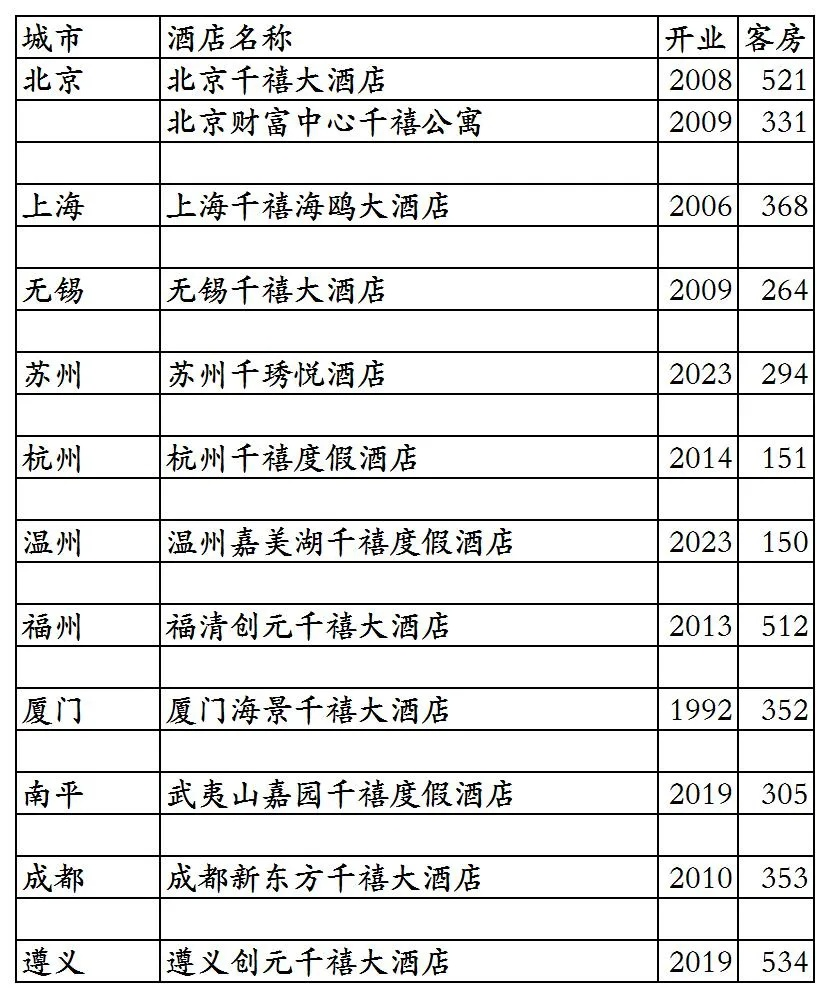

# 千禧国敦国内开业酒店统计2025版

> 本文转载自微信公众号 **不同的角落**，已获作者授权。  
> 原文发布于 2025年10月10日 22:52  
> 原文链接：[mp.weixin.qq.com](http://mp.weixin.qq.com/s?__biz=MzU4OTczMzkwNw==&mid=2247576105&idx=1&sn=b9a2985fcef77d2fb4207884b3e3ffe0&chksm=fdcae355cabd6a436e7f703b55310664020dcc9e82f49fa4a357d04dc4cb0f5a9b0780fd537a)

---

千禧国敦旗下国内已开业酒店统计，统计截至2025年10月10日。

千禧国敦总部位于新加坡，全球酒店数量约150家，分布在全球21个国家。

千禧国敦旗下有千禧、国敦、千琇悦、君门、Studio M等酒店品牌。

我的千禧(MyMillennium)全球旅行忠诚会员计划，会员等级分为经典(Classic)、银卡(Silver)、至尊(Prestige)三个等级。

客房数据主要来自于千禧国敦官方平台与OTA，部分酒店客房数量打过酒店电话核实，记录的是酒店员工告知的客房数量。

个人精力有限，部分酒店开业/退出/下线时间以及客房数量难免有错误，欢迎各位告知指正，谢谢！

截至2025年10月10日，千禧国敦国内开业在营酒店11家客房3084间，还有1家酒店式服务公寓，331间客房。共计12家，客房总数4135间。

千禧国敦位于北京的酒店式服务公寓有一居室、二居室、三居室三种户型，一居室约100平米，二居室约150平米，三居室200多平米。按月起租，不能在OTA平台预订，需要与公寓销售人员联系商定价格。

2025年12月31日前如有新开业酒店，会在2026年1月1日修改。

目前千禧国敦旗下国内开业在营酒店已覆盖北京、上海2个直辖市和江苏、浙江、福建、四川、贵州5个省，共计11个城市。

开业：新酒店开业或是其它酒店翻牌开业时间；

客房：客房数量。

  千禧国敦国内11家酒店及1家公寓

更多的国内酒店统计、年度酒店排行、酒店常识、酒店行业资讯、酒店集团、航空常识、沈阳旅游等相关内容可以到我的微信公众号里查看。

也欢迎大家关注我的微信公众号：**sfk024**

公众号名称：**不同的角落**

在微信公众号搜索sfk024或是不同的角落都可以搜索到，也可以直接扫码或长按识别下方二维码关注。

