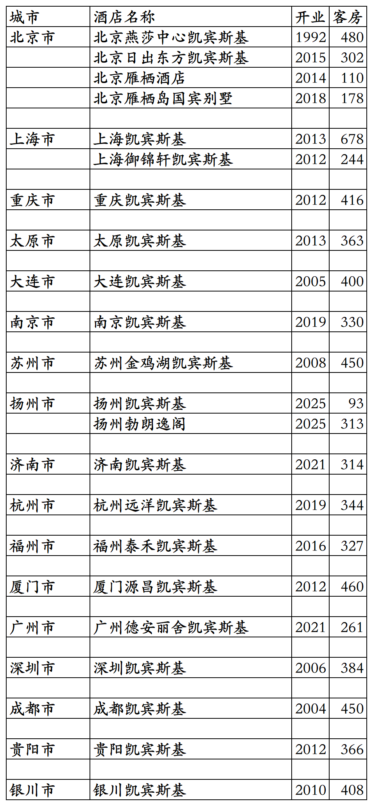
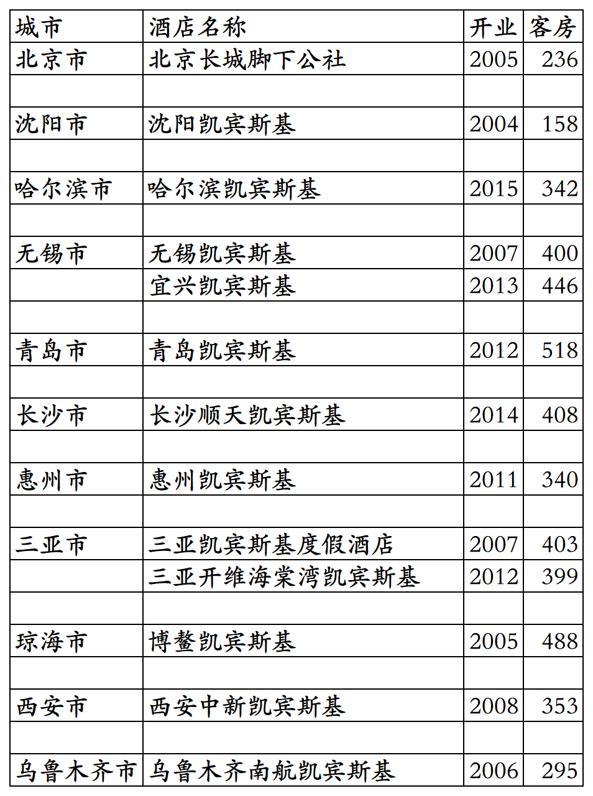

# 凯宾斯基国内开业及退出酒店统计2025版

> 本文转载自微信公众号 **不同的角落**，已获作者授权。  
> 原文发布于 2025年10月11日 23:40  
> 原文链接：[mp.weixin.qq.com](http://mp.weixin.qq.com/s?__biz=MzU4OTczMzkwNw==&mid=2247576218&idx=1&sn=297877d418eba4a8c30a260e966bbce6&chksm=fdcae3e6cabd6af093f3ed870874dbd7d14fa1e0929b5dad61bbc07e4be191662b4cadd0a344)

---

凯宾斯基旗下国内已开业酒店统计，统计截至2025年10月11日。

凯宾斯基总部位于德国，全球酒店数量已经减少至80家，分布在全球30多个国家与地区。

2001年凯宾斯基与首旅合资成立北京凯燕国际饭店管理有限公司，开发管理运营国内和蒙古的凯宾斯基品牌酒店，以及后来推出的诺金品牌酒店，还有凯宾斯基后推出的新品牌酒店。

凯宾斯基旗下之前只有凯宾斯基单一品牌，近年又新推出Bristoria品牌酒店，中文原名毕思图，国内扬州首店今年十一开业前中文名更名为勃朗逸阁。

2004年凯宾斯基联合泛太平洋、欧姆尼、宾乐雅、美诺等中小规模酒店集团成立了GHA(Global Hotel Alliance)全球酒店联盟。

联盟内各酒店集团旗下酒店共用GHA DISCOVERY忠诚会员计划。

GHA酒店联盟内酒店集团已进驻国内的有凯宾斯基、美诺、泛太平洋、嘉佩乐、九龙仓、素凯泰等，已进驻国内开店的酒店品牌有凯宾斯基、勃朗逸阁、安纳塔拉、缇沃丽、盛橡、泛太平洋、嘉佩乐、马哥孛罗、尼依格罗、素凯泰、诺金(凯宾斯基与首旅合作推出的新品牌，品牌归属首旅)。

之前还有一家开业后一直未上线GHA的沈阳诺翰酒店(原沈阳碧桂园玛丽蒂姆酒店翻牌)，后来退出翻牌为碧桂园凤凰酒店。

GHA忠诚会员计划，会员等级分为银卡、金卡、白金、钛金四个等级，还有隐藏的最高等级尊红卡(邀请制，原来的红卡)，尊红卡有双早、升级套房、提前至10点入住、延时至18点退房权益。

客房数据主要来自于GHA官方平台与OTA，部分酒店客房数量打过酒店电话核实，记录的是酒店员工告知的客房数量。

个人精力有限，部分酒店开业/退出/下线时间以及客房数量难免有错误，欢迎各位告知指正，谢谢！

截至2025年12月31日，凯宾斯基国内开业在营酒店22家客房7671间。

2026年修改。

目前凯宾斯基旗下国内开业在营酒店已覆盖北京、上海、重庆3个直辖市和山西、辽宁、江苏、浙江、福建、湖南、广东、四川、贵州9个省及宁夏1个自治区，共计18个城市。

开业：新酒店开业或是其它酒店翻牌开业时间；

客房：客房数量。

  凯宾斯基国内在营酒店

凯宾斯基国内已退出酒店

沈阳凯宾斯基翻牌为瑞士、哈尔滨凯宾斯基翻牌为JW万豪、宜兴凯宾斯基翻牌为帕佛伦斯、青岛凯宾斯基翻牌为温德姆至尊、三亚凯宾斯基翻牌为君澜、三亚开维海棠湾凯宾斯基翻牌为万达文华后又翻牌为费尔蒙、博鳌凯宾斯基翻牌为蓝色海岸、西安凯宾斯基翻牌为锦江、乌鲁木齐南航凯宾斯基翻牌为南航明珠。

更多的国内酒店统计、年度酒店排行、酒店常识、酒店行业资讯、酒店集团、航空常识、沈阳旅游等相关内容可以到我的微信公众号里查看。

也欢迎大家关注我的微信公众号和视频号，名称都是：**不同的角落**

微信直接搜索不同的角落就可以搜索到。

也可以直接点开下方公众号名片关注。