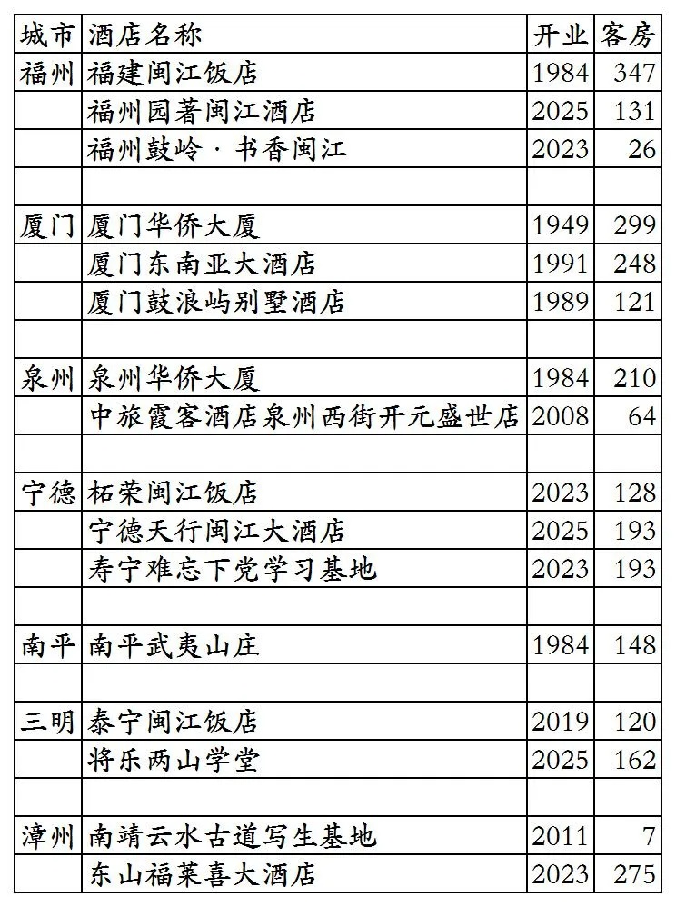
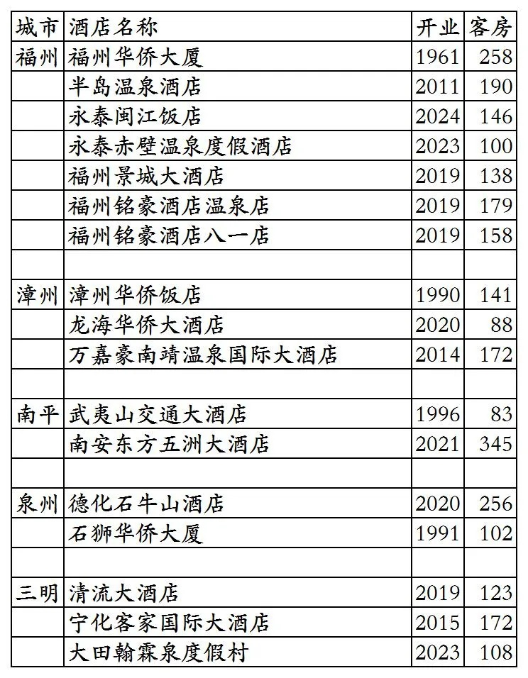
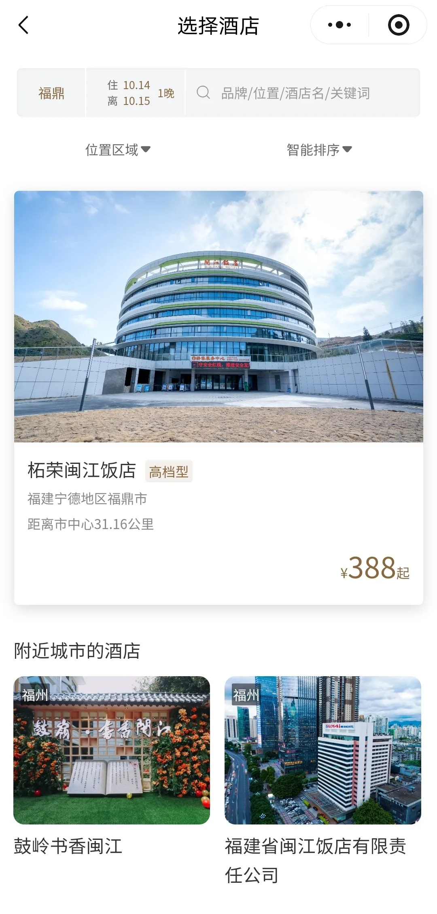
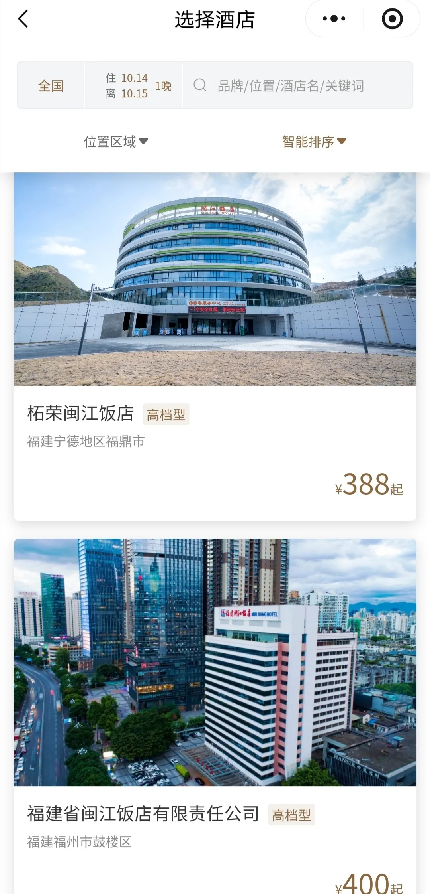
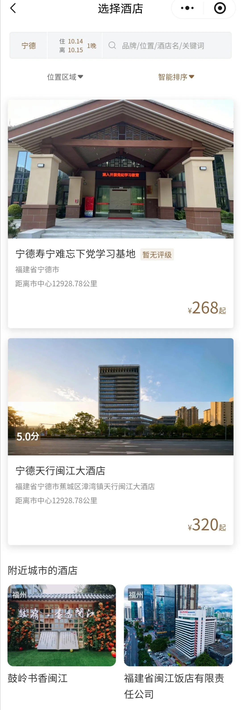

# 福建旅发开业及退出酒店统计2025版

> 本文转载自微信公众号 **不同的角落**，已获作者授权。  
> 原文发布于 2025年10月14日 18:42  
> 原文链接：[mp.weixin.qq.com](https://mp.weixin.qq.com/s?__biz=MzU4OTczMzkwNw==&mid=2247576672&idx=1&sn=bcbdf134ca973ca406d8e5d572069de3&scene=21#wechat_redirect)

---

福建中旅饭店管理集团(隶属于福建省旅游发展集团)旗下已开业酒店统计，统计截至2025年10月14日。

自2023年8月起，福建中旅饭店管理集团对外宣传开始以“福建旅发酒店”替代“福建中旅饭店管理集团”，后续官方公众号名称也更改为“福建旅发酒店”，但认证主体目前仍是福建中旅饭店管理集团有限公司。

客房数据主要来自于福旅荟平台与各大OTA，部分酒店客房数量打过酒店电话核实，记录的是酒店员工告知的客房数量。

福建旅发酒店总部在福建省福州市，旗下酒店二星级到五星级档次都有。

福建旅发酒店旗下品牌有闽江、华侨、霞客。

福旅荟会员计划。

之前曾上线福旅荟平台的福旅家·燕山香舍尚未划归福建中旅饭店管理集团，属于福建省旅游发展集团旗下其它公司，目前已从福旅荟平台下线。

截至2025年10月14日“福旅荟”微信小程序可以查询到的国内已开业酒店共计12家客，其中有3家不能预订。10月12日时福旅荟上还有多家已退出酒店挂在上面。

OTA平台还有4家福建旅发旗下酒店。

截至2025年10月14日查询到福建旅发酒店旗下开业酒店共计16家客房2672间。

2025年12月31日前如有新开业酒店或退出酒店，会在2026年1月1日修改。

目前福建旅发酒店旗下所有酒店都在福建省，目前在福州市、厦门市、泉州市、宁德市、南平市、三明市、漳州市有酒店。

开业：新酒店开业或是其它酒店翻牌开业时间；

客房：客房数量。

个人精力有限，部分酒店开业/退出/下线时间以及客房数量难免有错误，欢迎各位告知指正，谢谢！

福建旅发酒店旗下16家酒店

福建旅发酒店退出及关停酒店

福旅荟小程序上，居然将位于宁德市柘荣县柘荣闽江饭店，划归到宁德地区福鼎市，查询宁德市，没有这家柘荣闽江饭店。

更多的国内酒店统计、年度酒店排行、酒店常识、酒店行业资讯、酒店集团、航空常识、沈阳旅游、沙发客、打油诗等相关内容可以到我的微信公众号里查看。

也欢迎大家关注我的微信公众号和视频号，名称都是：**不同的角落**

微信直接搜索不同的角落就可以搜索到。

也可以直接点开下方公众号名片关注。