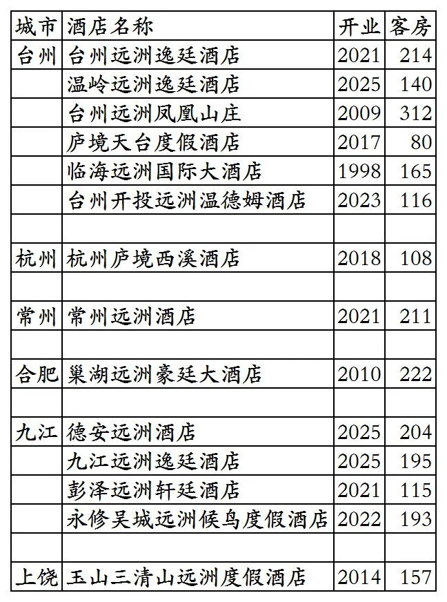
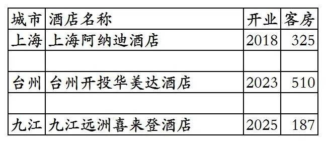
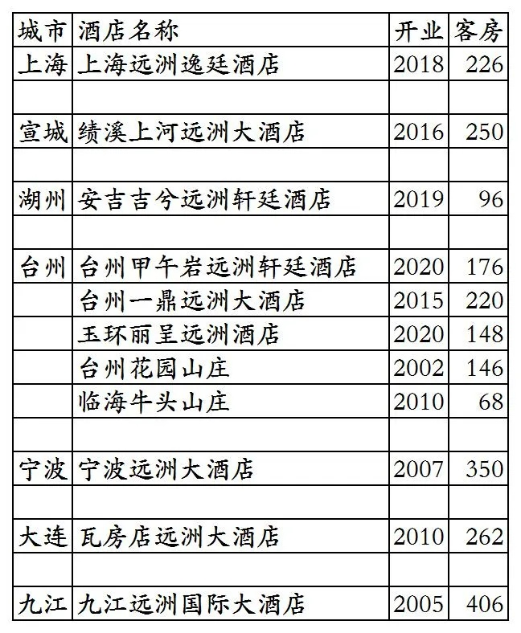

# 远洲旅业开业及退出酒店统计2025版

> 本文转载自微信公众号 **不同的角落**，已获作者授权。  
> 原文发布于 2025年10月16日 16:36  
> 原文链接：[mp.weixin.qq.com](https://mp.weixin.qq.com/s?__biz=MzU4OTczMzkwNw==&mid=2247576868&idx=1&sn=a5fc7218eb9630362828b884a61f4d6d&scene=21#wechat_redirect)

---

远洲旅业旗下已开业酒店统计，统计截至2025年10月16日。

客房数据主要来自于远洲官方平台与OTA，部分酒店客房数量打过酒店电话核实，记录的是酒店员工告知的客房数量。

远洲总部在浙江省台州市，远洲旗下酒店四星级到五星级档次都有。

远洲旗下有远洲、远洲豪廷、远洲轩廷、远洲逸廷、庐境等品牌，远洲引进的阿纳迪品牌，远洲也为业主。还有特许经营的温德姆旗下温德姆、华美达品牌，以及一家远洲为业主万豪旗下的喜来登品牌酒店。

远洲会(之前名称悦廷会)会员计划，分为银卡、金卡、白金卡、黑金卡四个等级。

2019年时远洲曾与丽呈合作，部分酒店加挂丽呈品牌上线丽呈会，后都退出丽呈。

截至2025年10月16日远洲官方平台和OTA可以查询到的国内已开业酒店共计17家客房3454间。

中国旅游饭店业协会经过严格缜密的数据统计、分析与核实，发布的2021-2024年度中国饭店集团60强榜单中，统计的远洲旅业开业酒店与客房数量如下：

2021年29家酒店7051间客房，

2022年31家酒店7854间客房，

2023年34家酒店8770间客房，

2024年37家酒店9250间客房。

目前远洲在上海、浙江、安徽、江苏、江西有酒店。

开业：新酒店开业或是其它酒店翻牌开业时间；

客房：客房数量。

个人精力有限，部分酒店开业/退出/下线时间以及客房数量难免有错误，欢迎各位告知指正，谢谢！

远洲会小程序可查询预订的14家酒店

其中临海远洲国际大酒店在OTA平台被分拆为2家酒店，1家165间客房的临海远洲国际大酒店，1家2015年开业38间客房的临海远洲酒店贵宾楼。

OTA平台3家非远洲自有品牌酒店

远洲退出及关停酒店

九江远洲国际大酒店停业后分拆改造为九江远洲逸廷酒店和九江远洲喜来登酒店。

宁波远洲大酒店2019年与丽呈合作时更名宁波远洲丽呈华廷。

更多的国内酒店统计、年度酒店排行、酒店常识、酒店行业资讯、酒店集团、航空常识、沈阳旅游、沙发客、打油诗等相关内容可以到我的微信公众号里查看。

也欢迎大家关注我的微信公众号和视频号，名称都是：**不同的角落**

微信直接搜索不同的角落就可以搜索到。

也可以直接点开下方公众号名片关注。