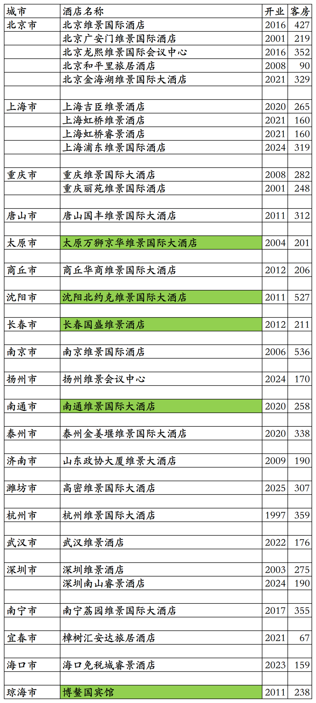
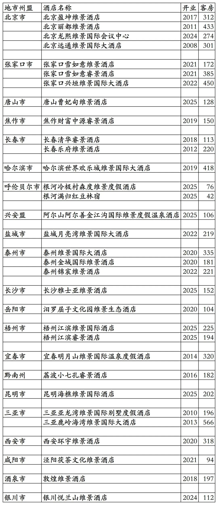
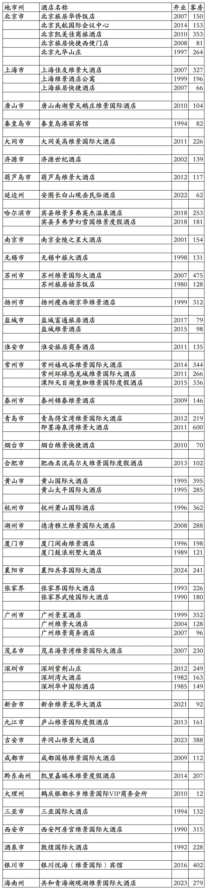
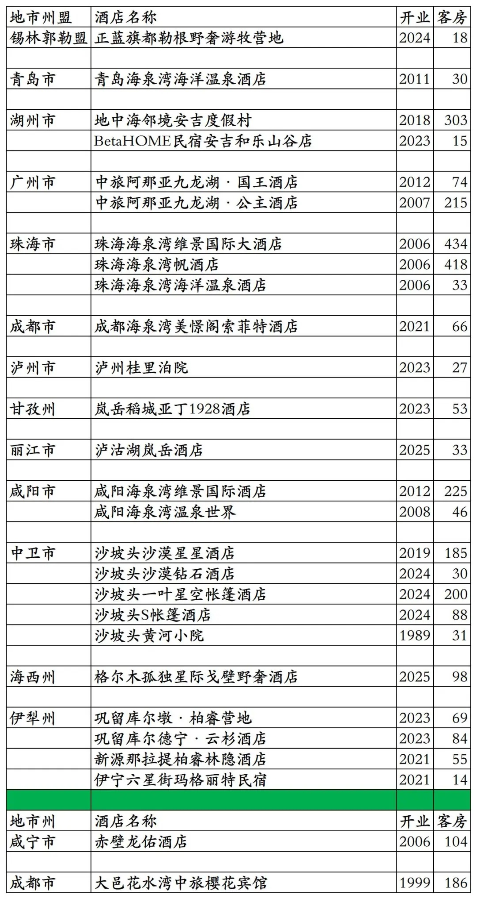

# 中旅国内开业及退出酒店统计2025版

> 本文转载自微信公众号 **不同的角落**，已获作者授权。  
> 原文发布于 2025年10月17日 21:16  
> 原文链接：[mp.weixin.qq.com](https://mp.weixin.qq.com/s?__biz=MzU4OTczMzkwNw==&mid=2247577094&idx=1&sn=fd7d1711998de8f9bcbb32dd52ef7f3f&scene=21#wechat_redirect)

---

中旅酒店集团旗下国内已开业及退出酒店统计，不包括中旅酒店今年投资控股的雅阁酒店集团旗下国内已开业酒店，统计截至2025年12月31日。

客房数据主要来自于中旅酒店官方平台与OTA，部分酒店客房数量打过酒店电话核实，记录的是酒店员工告知的客房数量。

中旅酒店总部在北京市，旗下酒店三星级到五星级档次都有。

中旅酒店旗下有维景国际、维景、睿景、旅居等品牌。

中旅酒店收购的英国第三方酒店管理公司以及泰国合资酒店管理公司，旗下特许经营万豪、希尔顿、洲际、温德姆等国际酒店集团旗下品牌酒店。

中旅酒店心享会会员计划，分为银星、金星、铂星、五星四个等级。

国内目前仅剩25家酒店参加中旅心享会会员计划。2026年新增几家酒店参加。

中旅酒店心享会会员可以匹配国内多家酒店集团会员。

截至2025年12月31日中旅酒店官方平台和OTA可以查询到的国内已开业酒店共计62家客房15324间。

中国旅游饭店业协会经过严格缜密的数据统计、分析与核实，发布的2021-2024年度中国饭店集团60强榜单中，统计的中旅酒店国内开业酒店与客房数量如下：

2021年54家酒店17313间客房，

2022年67家酒店18503间客房，

2023年100家酒店28142间客房，

2024年103家酒店29108间客房。

目前中旅在北京、上海、重庆、河北、山西、河南、辽宁、吉林、黑龙江、内蒙古、江苏、山东、浙江、湖北、湖南、广东、广西、江西、贵州、云南、海南、陕西、甘肃、宁夏有酒店。

开业：新酒店开业或是其它酒店翻牌开业时间；

客房：客房数量。

个人精力有限，部分酒店开业/退出/下线时间以及客房数量难免有错误，欢迎各位告知指正，谢谢！

中旅酒店心享会小程序可查询预订的30家酒店

其中绿色的5家酒店不参加中旅酒店心享会会员计划，不能累积积分间夜。2026年又有几家酒店上线中旅酒店心享会。

OTA平台32家中旅酒店旗下酒店

历年退出及关停酒店

中旅酒店与君亭合作，将旗下北京旅居华侨饭店改造翻牌为君亭旗下北京华侨夜泊君亭酒店。

中旅集团旗下非中旅酒店旗下酒店

目前属于中旅国际旗下的中旅景区和中旅度假，包括2家维景国际品牌酒店、1家地中海度假村品牌酒店、1家美憬阁品牌酒店。另外中旅景区还持有杭州开元森泊旅游投资有限公司34%股份，开元森泊旗下有多家开元森泊酒店。

除了成都海泉湾美憬阁酒店、刚下线的BetaHOME民宿安吉和乐山庄店、今年刚加入中旅国际的格尔木孤独星际戈壁野奢酒店外，其余16家酒店目前都可以在中旅景区小程序查询预订，享受中旅景区会员权益。

格尔木孤独星际戈壁野奢酒店可以在中旅度假小程序查询预订，其余多数酒店也可以在中旅度假小程序预订，享受中旅景区会员权益。

不过在中旅景区小程序、中旅度假小程序预订酒店，房价基本都比OTA平台贵。

2024年加入中旅度假的丽江楠缦嵌雪楼，今年已经退出中旅度假。后面2家为已退出酒店。

更多的国内酒店统计、年度酒店排行、酒店常识、酒店行业资讯、酒店集团、航空常识、沈阳旅游、沙发客、打油诗等相关内容可以到我的微信公众号里查看。

也欢迎大家关注我的微信公众号和视频号，名称都是：**不同的角落**

微信直接搜索不同的角落就可以搜索到。

也可以直接点开下方公众号名片关注。