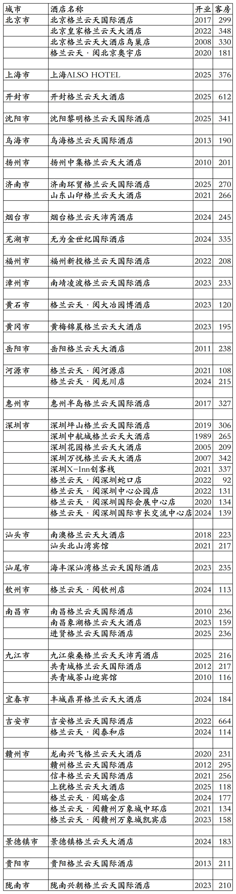
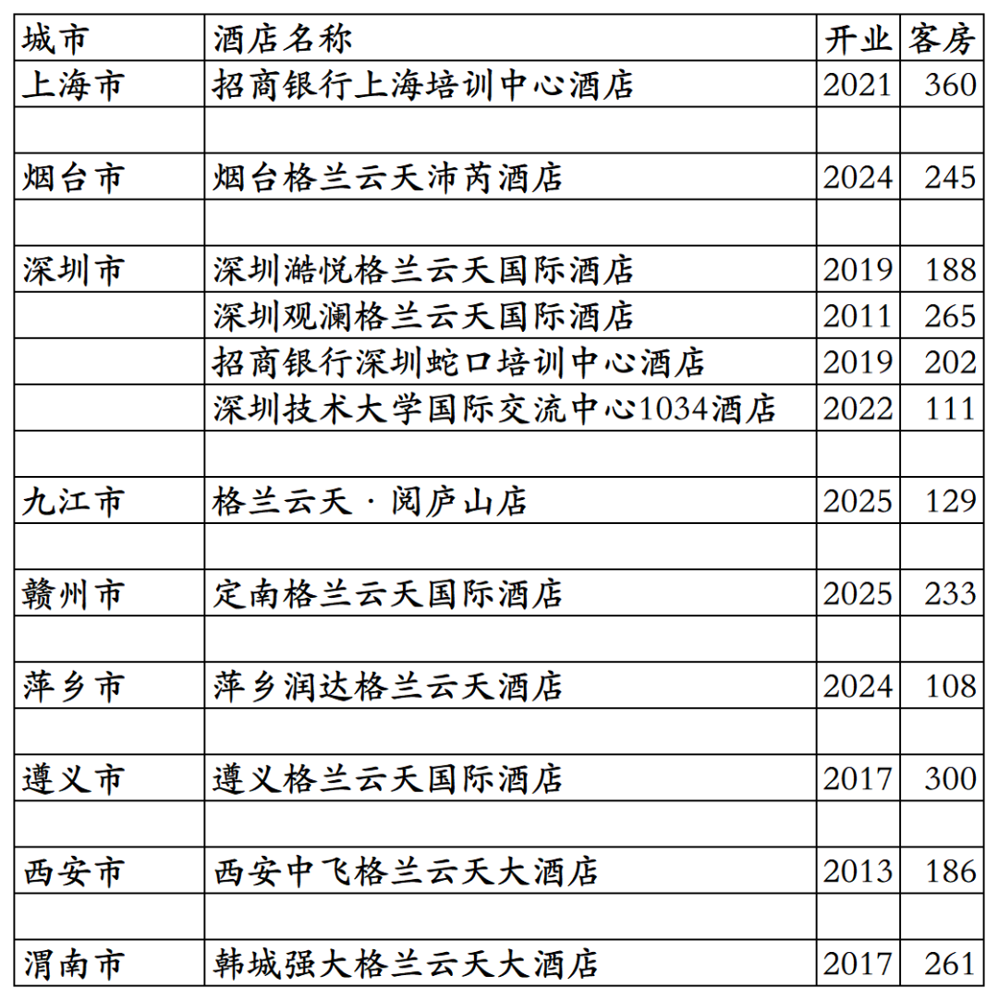
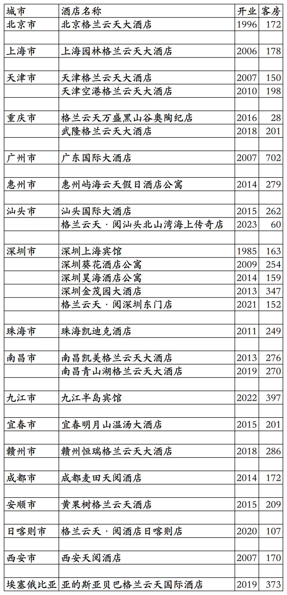

# 格兰云天开业及退出酒店统计2025版

> 本文转载自微信公众号 **不同的角落**，已获作者授权。  
> 原文发布于 2025年10月23日 18:21  
> 原文链接：[mp.weixin.qq.com](https://mp.weixin.qq.com/s?__biz=MzU4OTczMzkwNw==&mid=2247579183&idx=1&sn=5a1fea0a80f62d8e92af07c25e0c1c1d&scene=21#wechat_redirect)

---

格兰云天旗下已开业酒店统计，统计截至2025年12月31日。

客房数据主要来自于格兰云天官方平台与OTA，部分酒店客房数量打过酒店电话核实，记录的是酒店员工告知的客房数量。

格兰云天总部在广东省深圳市，旗下酒店三星级到五星级档次都有。

格兰云天旗下有格兰云天国际、格兰云天、沛芮、格兰云天·阅等品牌。

嘉赏会会员计划，分为银卡、金卡、白金卡、钻石卡、金钻卡五个等级。

截至2025年12月31日格兰云天官方平台和OTA可以查询到的国内已开业酒店共计63家客房14522间。还有2家格兰云天管理不对外的招商银行深/沪培训中心酒店。共计65家酒店15084间客房。

2025年12月31日前如有新开业酒店或退出酒店，会在2026年1月1日修改。

目前格兰云天在北京、上海、河南、内蒙古、江苏、山东、安徽、福建、湖北、湖南、广东、广西、江西、贵州、陕西、甘肃有酒店。

开业：新酒店开业或是其它酒店翻牌开业时间；

客房：客房数量。

个人精力有限，部分酒店开业/退出/下线时间以及客房数量难免有错误，欢迎各位告知指正，谢谢！

格兰云天小程序可查询预订的53家酒店

其余12家格兰云天旗下酒店

其中招商银行上海培训中心酒店和招商银行深圳蛇口培训中心酒店不对外营业，深圳人才研修院东部分院在OTA平台对应酒店名称是深圳坪山山海堂酒店。

格兰云天退出及关停酒店

深圳上海宾馆是格兰云天第一家酒店，目前已退出不再是格兰云天管理运营。非洲埃塞俄比亚那家格兰云天也已经退出。

更多的国内酒店统计、年度酒店排行、酒店常识、酒店行业资讯、酒店集团、航空常识、沈阳旅游、沙发客、打油诗等相关内容可以到我的微信公众号里查看。

也欢迎大家关注我的微信公众号和视频号，名称都是：**不同的角落**

微信直接搜索不同的角落就可以搜索到。

也可以直接点开下方公众号名片关注。