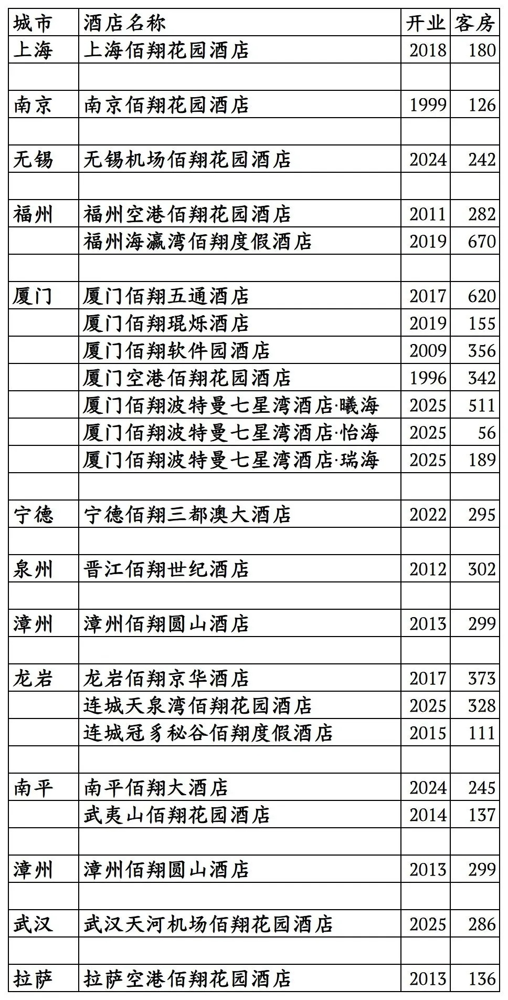
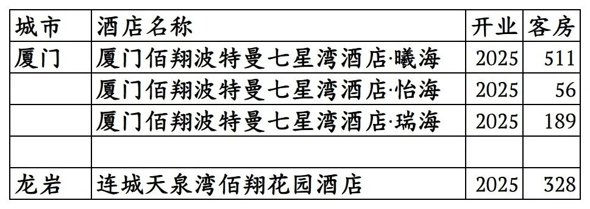
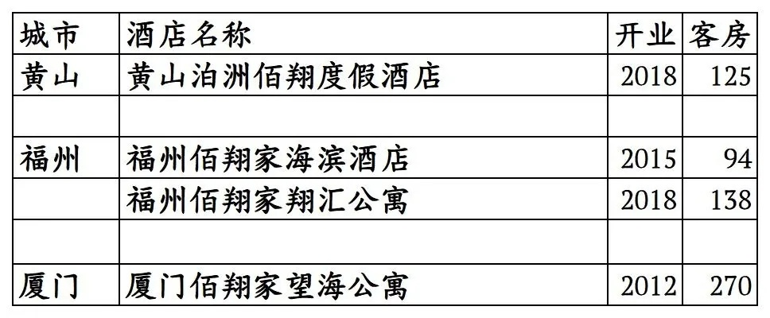

# 厦门佰翔开业及退出酒店统计2025版

> 本文转载自微信公众号 **不同的角落**，已获作者授权。  
> 原文发布于 2025年10月27日 21:13  
> 原文链接：[mp.weixin.qq.com](https://mp.weixin.qq.com/s?__biz=MzU4OTczMzkwNw==&mid=2247579739&idx=1&sn=89912fcad6eab52a875ba40260bdef98&scene=21#wechat_redirect)

---

厦门佰翔酒店集团旗下已开业酒店统计，统计截至2025年10月27日。

客房数据主要来自于厦门佰翔官方平台与OTA，部分酒店客房数量打过酒店电话核实，记录的是酒店员工告知的客房数量。

厦门佰翔总部在福建省厦门市，旗下酒店三星级到五星级档次都有。

佰翔旗下有佰翔、佰翔度假、佰翔琨烁、佰翔花园、佰翔家等品牌。

翔业尊享会会会员计划，分为E卡、银卡、金卡、铂金卡、大使卡五个等级。

截至2025年10月27日厦门佰翔官方平台和OTA平台可以查询到的国内已开业酒店共计23家客房6540间。其中5家为2025年开业/翻牌。厦门佰翔波特曼七星湾3家酒店在一起，合称厦门佰翔波特曼七星湾酒店。

2025年12月31日前如有新开业酒店或退出酒店，会在2026年1月1日修改。

中国旅游饭店业协会经过严格缜密的数据统计、分析与核实，发布的2021-2024年度中国饭店集团60强榜单中，统计的厦门佰翔国内开业酒店与客房数量如下：

2021年20家酒店7507间客房，

2022年22家酒店8423间客房，

2023年22家酒店8663间客房，

2024年26家酒店9765间客房。

目前佰翔在上海、江苏、福建、湖北、西藏有酒店。

开业：新酒店开业或是其它酒店翻牌开业时间；

客房：客房数量。

个人精力有限，部分酒店开业/退出/下线时间以及客房数量难免有错误，欢迎各位告知指正，谢谢！

厦门佰翔旗下的23家酒店

其中只能OTA平台预订的4家酒店

估计过段时间应该会上线佰翔官方预订平台。

厦门佰翔退出及关停酒店

更多的国内酒店统计、年度酒店排行、酒店常识、酒店行业资讯、酒店集团、航空常识、沈阳旅游、沙发客、打油诗等相关内容可以到我的微信公众号里查看。

也欢迎大家关注我的微信公众号和视频号，名称都是：**不同的角落**

微信直接搜索不同的角落就可以搜索到。

也可以直接点开下方公众号名片关注。