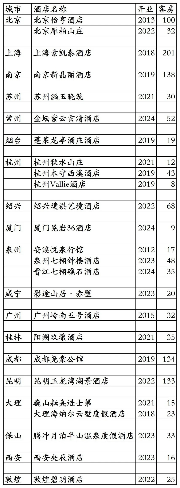

# SLH酒店联盟国内加盟酒店统计2025版

> 本文转载自微信公众号 **不同的角落**，已获作者授权。  
> 原文发布于 2025年10月28日 21:12  
> 原文链接：[mp.weixin.qq.com](http://mp.weixin.qq.com/s?__biz=MzU4OTczMzkwNw==&mid=2247580203&idx=1&sn=1123b6a76b4d7a620bf70f8d7cc8dd6b&chksm=fdcaf357cabd7a4121292c0ae37631fb9b24679b857fbf1b66bd4a33612ca018b965c7faa07b)

---

Small Luxury Hotel(SLH，全球奢华精品酒店联盟）旗下国内加盟酒店统计，统计截至2025年10月28日。

客房数据主要来自于SLH官方平台与OTA，部分酒店客房数量打过酒店电话核实，记录的是酒店员工告知的客房数量。

酒店联盟，通俗来说就是一个提供联盟内酒店预订的第三方组织，通过联盟这个平台，可以实现联盟内各酒店间资源共享，客源互通，一些酒店联盟也有类似酒店集团一样的会员忠诚计划。

联盟内成员酒店与联盟只是合作关系，联盟内成员酒店不受酒店联盟管理，酒店联盟对加入联盟的酒店也没什么约束力，有的酒店同时加入两家酒店联盟。

比如上海素凯泰酒店，同时加入了SLH和GHA两家酒店联盟；上海嘉佩乐酒店，则是同时加入了立鼎世和GHA两家酒店联盟。

酒店联盟酒店的组成有单体酒店也有各品牌连锁酒店，有的酒店联盟由多家酒店集团组成，酒店联盟更像一个仅提供联盟内酒店预订的小型OTA平台。

可以把酒店联盟当成一个超小型的携程/飞猪/美团这种OTA平台，并且还大都只提供酒店预订，个别还提供餐厅预订。

目前各酒店联盟内成员酒店的订单主要还是来自于各大OTA网站，在联盟的预订平台上预订所占比例并不多。

加入各大国际酒店联盟的国内酒店有的很好，有的非常一般。

国内很多经典酒店并没有加入各大国际酒店联盟，比如北京饭店诺金、上海和平饭店、天津利顺德大酒店、中卫沙漠钻石酒店等等。

酒店联盟介绍可以看这篇：

[酒店常识之六酒店联盟介绍](https://mp.weixin.qq.com/s?__biz=MzU4OTczMzkwNw==&mid=2247514721&idx=1&sn=c35e25082ba6b4a06de4e70424feb1fa&scene=21#wechat_redirect)

SLH成立于1991年，总部在英国伦敦，在全球90多个国家有600多家酒店，国内在上海有设立代表处，国内无客服电话。

SLH会员计划，分为Club01、Club02、Club03三个等级。

Club02会员有免费双早、客房升级等权益，之前有过几次通过指定活动链接注册直接升级Club02会员活动。

2018年8月SLH与凯悦开始合作，2018年12月起SLH旗下酒店开始陆续上线凯悦官方预订平台，可以享受凯悦会员权益，与凯悦合作到2024年5月15日结束。

2024年5月与凯悦合作结束后，SLH与希尔顿开始合作，2024年9月SLH旗下酒店陆续上线希尔顿官方预订平台。

截至2025年9月，已有超过450家SLH酒店上线希尔顿官方预订平台，参与希尔顿荣誉客会会员计划。

在希尔顿荣誉客会中文版APP查询不到SLH酒店，希尔顿荣誉客会英文版才可以查询到，另部分SLH酒店输入城市查询不到，要输入酒店英文名称才能查询到，比如杭州秋水山庄。

截至2025年10月28日，SLH官方平台可以查询到的国内已开业酒店共计25家客房1278间。

之前还有北京古城·老院、江油花厢欧洲院子、苏州震泽水岸寒舍精品酒店、鄢陵建业花满地、徐州回悦精品酒店等酒店加入SLH，后都已退出。

2025年12月31日前如有新加盟酒店或退出酒店，会在2026年1月1日修改。

目前SLH在北京、上海、江苏、山东、浙江、福建、湖北、广东、广西、四川、云南、陕西、甘肃有酒店。

开业：酒店开业时间，非加入SLH时间。

客房：客房数量。

个人精力有限，部分酒店开业/退出/下线时间以及客房数量难免有错误，欢迎各位告知指正，谢谢！

SLH旗下国内25家加盟酒店

更多的国内酒店统计、年度酒店排行、酒店常识、酒店行业资讯、酒店集团、航空常识、沈阳旅游、沙发客、打油诗等相关内容可以到我的微信公众号里查看。

也欢迎大家关注我的微信公众号和视频号，名称都是：**不同的角落**

微信直接搜索不同的角落就可以搜索到。

也可以直接点开下方公众号名片关注。