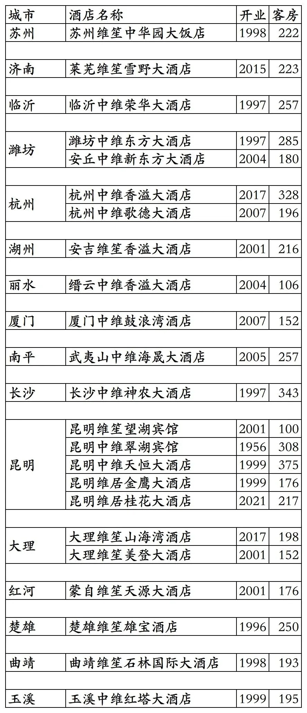
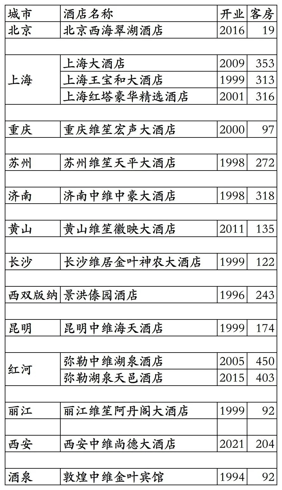
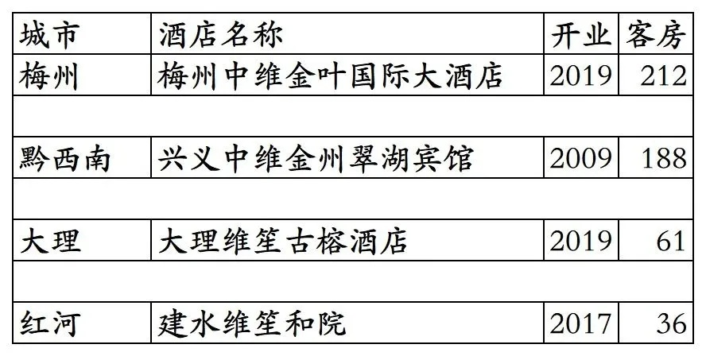

# 中维开业及退出酒店统计2025版

> **作者**：不同的角落  
> **发布时间**：2025年11月2日 22:53  
> **原文链接**：[中维开业及退出酒店统计2025版](https://mp.weixin.qq.com/s?__biz=MzU4OTczMzkwNw==&mid=2247581530&idx=1&sn=72add848f0fb5f82831f2d46855ee507&scene=21)

---

中维酒店集团旗下已开业及退出酒店统计，统计截至2025年11月2日。

客房数据主要来自于中维官方平台与OTA，部分酒店客房数量打过酒店电话核实，记录的是酒店员工告知的客房数量。

中维总部在云南省昆明市，旗下酒店三星级到五星级档次都有。

中维旗下有中维、维尊、维笙、维居等品牌。

维享会会会员计划，分为荣誉会员、金卡、白金卡三个等级。

中国烟草想用中维整合烟草系统酒店，结果国内多地烟草系统酒店根本不买账，不参与维享会会员计划。

截至2025年11月2日中维官方平台和OTA平台可以查询到的国内已开业酒店共计39家客房8708间。

2025年12月31日前如有新开业酒店或退出酒店，会在2026年1月1日修改。

中国旅游饭店业协会经过严格缜密的数据统计、分析与核实，发布的2023-2024年度中国饭店集团60强榜单中，统计的中维国内开业酒店与客房数量如下：

2023年39家酒店8088间客房，

2024年39家酒店8973间客房。

目前中维在北京、上海、重庆、江苏、山东、安徽、浙江、福建、湖南、云南、陕西、甘肃有酒店。

开业：新酒店开业或是其它酒店翻牌开业时间；

客房：客房数量。

个人精力有限，部分酒店开业/退出/下线时间以及客房数量难免有错误，欢迎各位告知指正，谢谢！

中维官方平台可查询预订的23家酒店

其余13家酒店

中维退出及关停酒店

更多的国内酒店统计、年度酒店排行、酒店常识、酒店行业资讯、酒店集团、航空常识、沈阳旅游、沙发客、打油诗等相关内容可以到我的微信公众号里查看。

也欢迎大家关注我的微信公众号和视频号，名称都是：**不同的角落**

微信直接搜索不同的角落就可以搜索到。

也可以直接点开下方公众号名片关注。