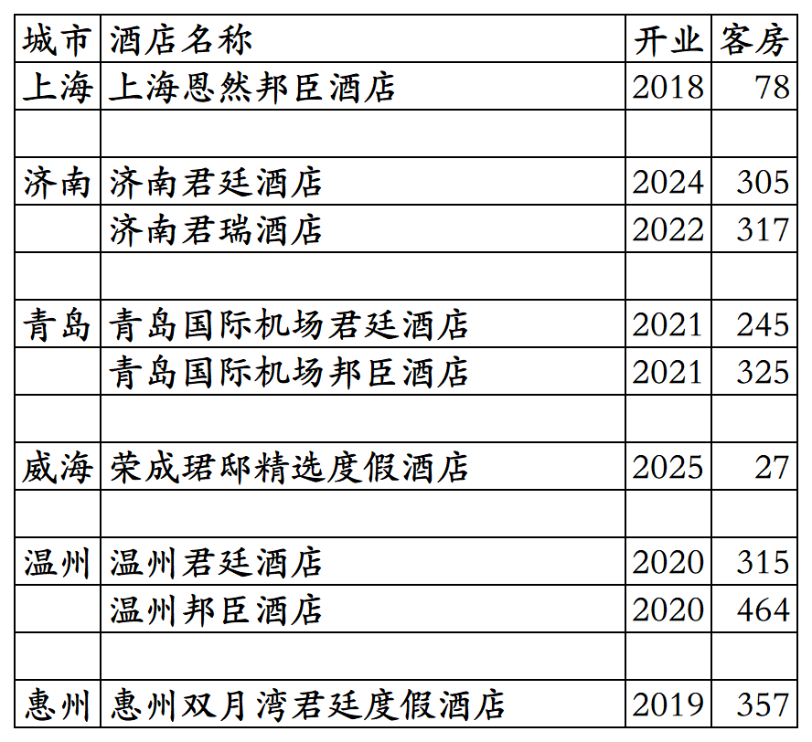
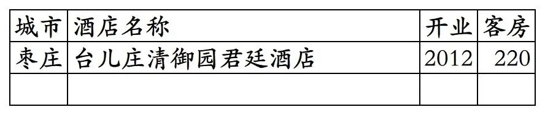
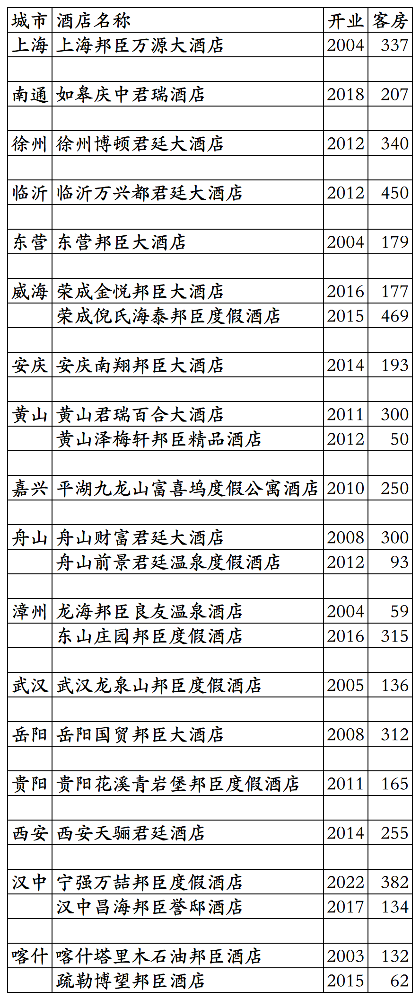

# 君廷国内开业及退出酒店统计2025版

> **作者**：不同的角落  
> **发布时间**：2025年11月5日 00:35  
> **原文链接**：[君廷国内开业及退出酒店统计2025版](http://mp.weixin.qq.com/s?__biz=MzU4OTczMzkwNw==&mid=2247581694&idx=1&sn=d12e05e9fa818b7f61a26a4f4d480e88&chksm=fdcaf682cabd7f947cd1c51df5d10fbd079f355d6e54789c9488ee0f413e237c8a18f65b1fd3)

---

君廷酒店集团国内开业及退出酒店统计，统计截至2025年11月4日。

客房数据主要来自于君廷官方平台与OTA，部分酒店客房数量打过酒店电话核实，记录的是酒店员工告知的客房数量。

君廷总部在英国，国内总部在上海，旗下酒店三星级到五星级档次都有。

君廷旗下有君域、珺邸、君廷、君瑞、富岛坞、邦臣、君瑞嘉萃、邦臣嘉选等品牌酒店和君廷行政公寓。

君誉会会会员计划，分为荣誉会员、菁英会员、至臻会员三个等级。

截至2025年12月31日君廷官方平台和OTA平台可以查询到的国内开业在营酒店共计10家客房2653间。

2025年12月31日前如有新开业酒店或退出酒店，会在2026年1月1日修改。

中国旅游饭店业协会经过严格缜密的数据统计、分析与核实，发布的2024年度中国饭店集团60强榜单中，统计的君廷国内开业酒店与客房数量如下：

2024年52家酒店17044间客房。

目前君廷在上海、山东、浙江、广东、陕西有酒店。

开业：新酒店开业或是其它酒店翻牌开业时间；

客房：客房数量。

个人精力有限，部分酒店开业/退出/下线时间以及客房数量难免有错误，欢迎各位告知指正，谢谢！

君廷官方平台可查询到的9家酒店

只能OTA平台预订的1家酒店

君廷国内历年退出及关停酒店

更多的国内酒店统计、年度酒店排行、酒店常识、酒店行业资讯、酒店集团、航空常识、沈阳旅游、沙发客、打油诗等相关内容可以到我的微信公众号里查看。

也欢迎大家关注我的微信公众号和视频号，名称都是：**不同的角落**

微信直接搜索不同的角落就可以搜索到。

也可以直接点开下方公众号名片关注。