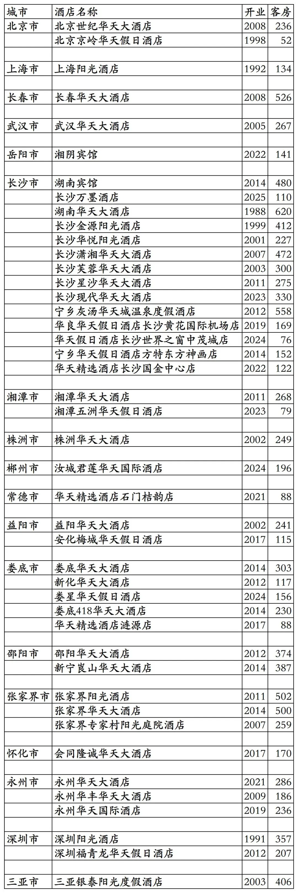
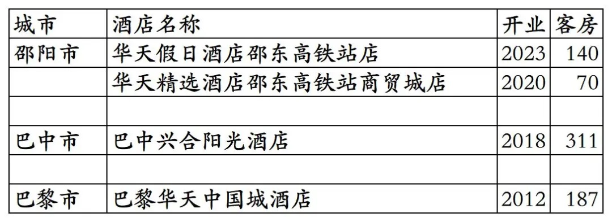
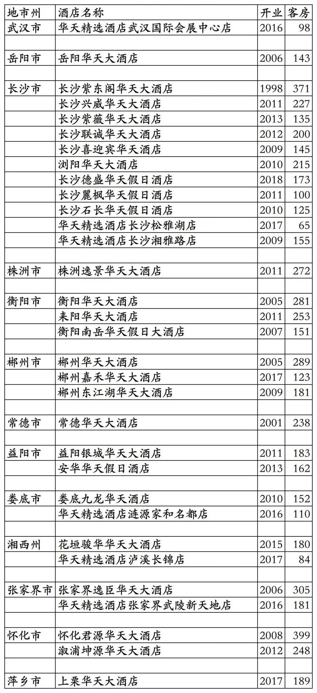

# 华天开业及退出酒店统计2025版

> **作者**：不同的角落  
> **发布时间**：2025年11月14日 22:35  
> **原文链接**：[华天开业及退出酒店统计2025版](https://mp.weixin.qq.com/s?__biz=MzU4OTczMzkwNw==&mid=2247583997&idx=1&sn=46d5ab82f71c6249eb3f811ec108a794&scene=21)

---

华天酒店集团旗下开业及退出酒店统计，统计截至2025年12月31日。

客房数据主要来自于华天官方平台与OTA，部分酒店客房数量打过酒店电话核实，记录的是酒店员工告知的客房数量。

华天总部位于湖南省长沙市，旗下酒店三星级到五星级档次都有。

华天旗下有华天大酒店、华天国际酒店、华天假日酒店、华天精选酒店、阳光酒店(非中石油旗下阳光酒店集团旗下阳光酒店品牌)等品牌。

华开天下贵宾会会会员计划，分为普卡、金卡、白金卡、钻石卡四个等级。

截至2025年12月31日华天官方平台和OTA平台可以查询到的国内已开业酒店共计47家客房12181间。另外法国巴黎还有1家华天品牌酒店。

中国旅游饭店业协会经过严格缜密的数据统计、分析与核实，发布的2021-2024年度中国饭店集团60强榜单中，统计的华天国内开业酒店与客房数量如下：

2021年76家酒店18034间客房，

2022年86家酒店21092间客房，

2023年115家酒店23667间客房，

2024年121家酒店24034间客房。

目前华天在北京、上海、吉林、湖北、湖南、广东、四川、海南有酒店。

开业：新酒店开业或是其它酒店翻牌开业时间；其中8家阳光酒店2025年才划归华天管理。

客房：客房数量。

个人精力有限，部分酒店开业/退出/下线时间以及客房数量难免有错误，欢迎各位告知指正，谢谢！

华天官方平台可查询的44家酒店

只能OTA平台预订的3家国内酒店和法国巴黎1家酒店

华天历年退出及关停酒店，不含华天出售给7天酒店的20多家华天之星经济酒店。

更多的国内酒店统计、年度酒店排行、酒店常识、酒店行业资讯、酒店集团、航空常识、沈阳旅游、沙发客、打油诗等相关内容可以到我的微信公众号里查看。

也欢迎大家关注我的微信公众号和视频号，名称都是：**不同的角落**

微信直接搜索不同的角落就可以搜索到。

也可以直接点开下方公众号名片关注。