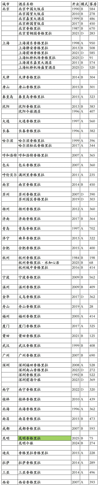
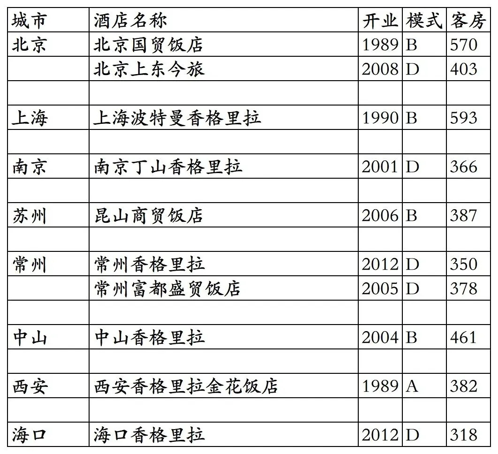
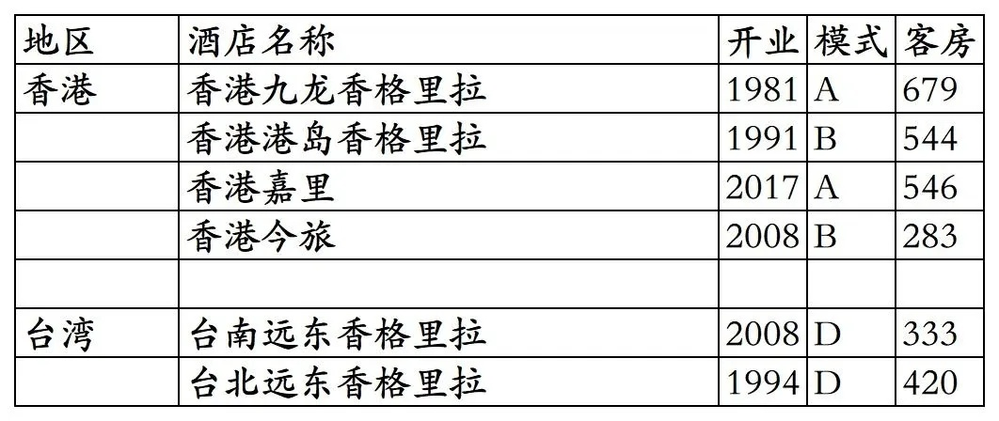
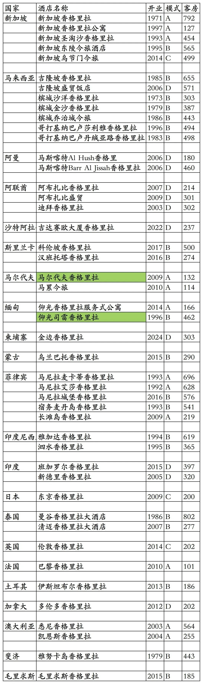
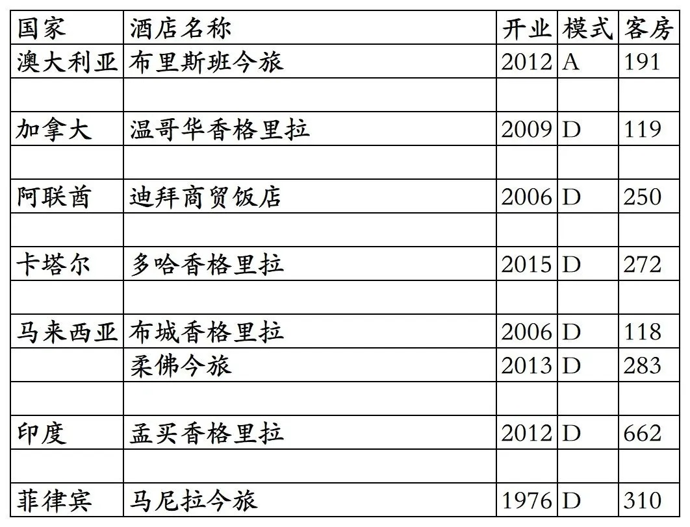
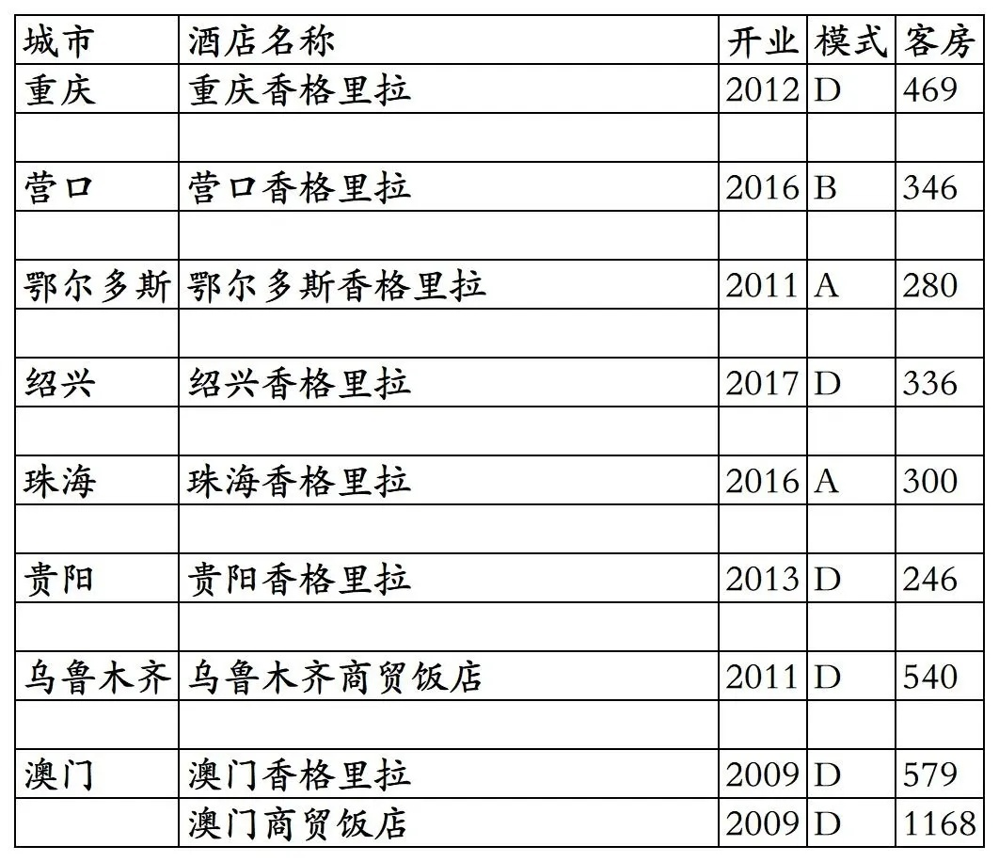
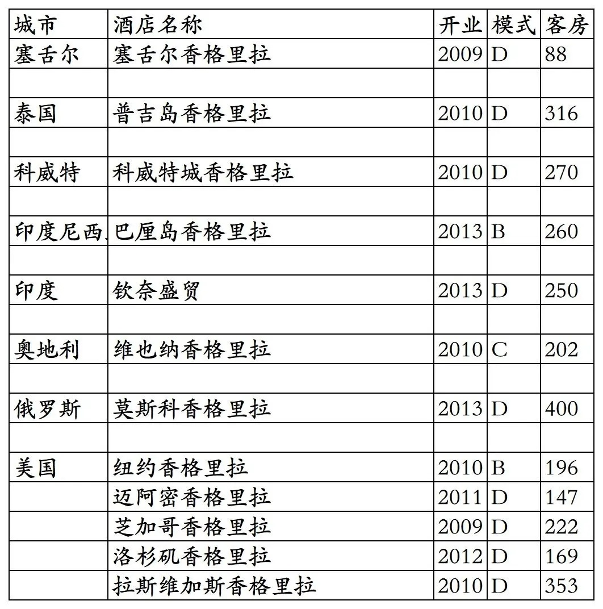

# 香格里拉开业及退出酒店统计2025版

> 本文转载自微信公众号 **不同的角落**，已获作者授权。  
> 原文发布于 2025年11月22日 21:52  
> 原文链接：[mp.weixin.qq.com](http://mp.weixin.qq.com/s?__biz=MzU4OTczMzkwNw==&mid=2247584908&idx=1&sn=a0e56396b3768294dd4b6b6c69d1f31d&chksm=fdcac5f0cabd4ce6efc33dab45940252a59988fd42c0a70dd44e0b011f8f5403cc36c09bd84c)

---

香格里拉酒店集团旗下开业及退出酒店统计，统计截至2025年11月22日。

客房数据主要来自于香格里拉官方平台与OTA，部分酒店客房数量打过酒店电话核实，记录的是酒店员工告知的客房数量。

香格里拉总部位于香港，旗下酒店三星级到五星级档次都有。

香格里拉旗下有香格里拉、嘉里、盛贸、今旅、水知心居等品牌。

香格里拉会会会员计划，分为黄金、翡翠、钻石、四个等级。

截至2025年11月22日香格里拉国内已开业酒店共计58家客房23191间。

全球已开业酒店(含2家年底将重新开业酒店)共计110家客房43497间。

2025年12月31日前如有新开业酒店或退出酒店，会在2026年1月1日修改。

目前香格里拉在国内北京、上海、天津、辽宁、吉林、黑龙江、内蒙古、江苏、安徽、山东、浙江、福建、湖北、广东、广西、江西、四川、云南、西藏、海南、陕西有酒店。

开业：新酒店开业或是其它酒店翻牌开业时间。夭折名单里为计划开业时间。

客房：客房数量。

模式：A—自营，香格里拉持股100%；

B—合资，合资方有的是与香格里拉一家的嘉里，有的是第三方；

C—租赁经营；

D—委托管理。

个人精力有限，部分酒店开业/退出/下线时间以及客房数量难免有错误，欢迎各位告知指正，谢谢！

香格里拉国内开业在营酒店，昆明香格里拉将于今年12月底开业。

国内历年退出及关停酒店

港澳台地区酒店

分布在国外22个国家的酒店，马尔代夫香格里拉与仰光司雷香格里拉将于今年12月底重新开业。

国外历年关停及退出酒店

部分夭折酒店，其中重庆香格里拉变成了重庆JW万豪，营口香格里拉变成了营口万达颐华。

更多的酒店统计、年度酒店排行、酒店常识、酒店资讯、酒店集团、航空常识、沈阳旅游、沙发客、打油诗等相关内容可以到我的微信公众号里查看。

也欢迎大家关注我的微信公众号和视频号，名称都是：**不同的角落**

微信直接搜索不同的角落就可以搜索到。

也可以直接点开下方公众号名片关注。