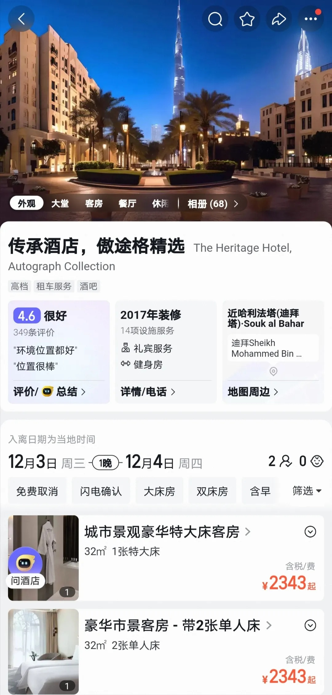
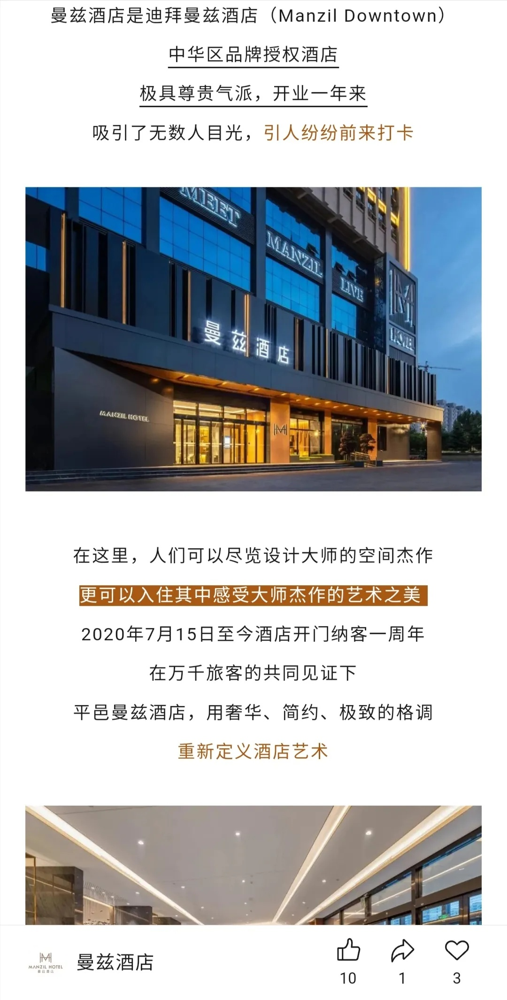
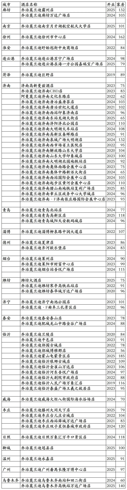

# 乔治莫兰迪开业酒店统计2025版

> 本文转载自微信公众号 **不同的角落**，已获作者授权。  
> 原文发布于 2025年12月2日 23:07  
> 原文链接：[mp.weixin.qq.com](https://mp.weixin.qq.com/s?__biz=MzU4OTczMzkwNw==&mid=2247590594&idx=1&sn=ccb2ef8da02e866e2706c5dffced1fbd&scene=21#wechat_redirect)

---

乔治莫兰迪酒店集团(山东百宅一生酒店管理有限公司)旗下开业酒店统计，统计截至2025年12月2日。

客房数据主要来自于乔治莫兰迪官方平台与OTA，部分酒店客房数量打过酒店电话核实，记录的是酒店员工告知的客房数量。

乔治莫兰迪总部在山东省济南市，旗下酒店都为中档酒店。

2024年6月，东呈集团入股乔治莫兰迪品牌，东呈通过旗下全资子公司济南凯达利酒店管理有限公司持有山东百宅一生酒店管理有限公司30%股份。

乔治莫兰迪旗下有乔治莫兰迪品牌。

乔治莫兰迪会员计划，分为银卡、金卡、黑金卡、钻石卡四个等级。

截至2025年12月2日乔治莫兰迪官方平台可以查询到的国内已开业酒店共计68家客房6556间。

乔治莫兰迪官方平台可以查询预订的68家酒店也已全部上线东呈青猫会，可以在东呈青猫会平台预订，可以享受东呈青猫会不同等级会员对应权益。

其中乔治莫兰迪品牌酒店67家，包括1家阿曼莫兰迪酒店、2家乔治莫兰迪·F酒店、1家未挂乔治莫兰迪品牌的潍坊大酒店。

另外还有1家酒店是非乔治莫兰迪管理非乔治莫兰迪旗下品牌的济南高新曼兹酒店，为曼兹品牌酒店，与乔治莫兰迪只是合作关系，只是上线乔治莫兰迪官方平台和东呈青猫会平台，参加乔治莫兰迪和东呈会员权益。

之前乔治莫兰迪还与丽呈合作过一段时间，旗下有10多家酒店上线丽呈会，不过合作时间不长就分手了。

OTA平台还有1家位于德州市庆云县乔治莫兰迪·F庆云海岛金山寺人民医院店，已经退出乔治莫兰迪，但名称目前还未改。

济南高新曼兹酒店与临沂平邑曼兹酒店同为曼兹品牌，同一家业主，同一家公司管理，平邑曼兹酒店2020年开业，济南曼兹酒店2023年开业。

曼兹酒店为阿联酋迪拜依玛尔酒店集团旗下高端酒店品牌，之前有一家2006年开业的豪华五星档次的迪拜中心曼兹酒店，不过已于2022年底退出翻牌为万豪旗下傲途格精选品牌酒店。目前依玛尔酒店集团旗下无在营曼兹品牌酒店。

2020年开业的平邑曼兹酒店与2023年开业的济南曼兹酒店都只是中档酒店，平邑曼兹酒店宣称是迪拜曼兹酒店中华区品牌授权酒店。

国外低端档次品牌酒店进驻国内后升档情况比较常见，比如几大国际酒店集团旗下一些经济酒店品牌，和国内如家同档的酒店品牌，进驻国内后很多品牌都被拔高为中档和高端酒店，有的酒店在OTA平台还被划分到五星(钻)/豪华一档。国外高端品牌酒店进驻国内后降档的情况还真不多见。

2025年12月31日前如有新开业酒店或退出酒店，会在2026年1月1日修改。

目前乔治莫兰迪在河北、江苏、山东、浙江、广东、新疆有酒店。

开业：新酒店开业或是其它酒店翻牌开业时间；

客房：客房数量。

个人精力有限，部分酒店开业/退出/下线时间以及客房数量难免有错误，欢迎各位告知指正，谢谢！

乔治莫兰迪官方平台的68家酒店

更多的国内酒店统计、年度酒店排行、酒店常识、酒店行业资讯、酒店集团、航空常识、沈阳旅游、沙发客、打油诗等相关内容可以到我的微信公众号里查看。

也欢迎大家关注我的微信公众号和视频号，名称都是：**不同的角落**

微信直接搜索不同的角落就可以搜索到。

也可以直接点开下方公众号名片关注。