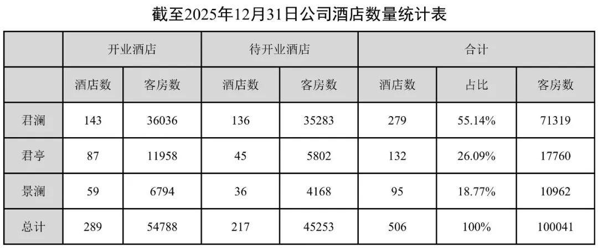
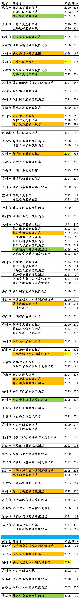
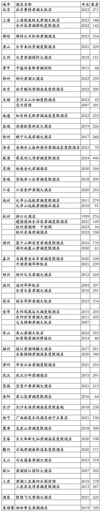
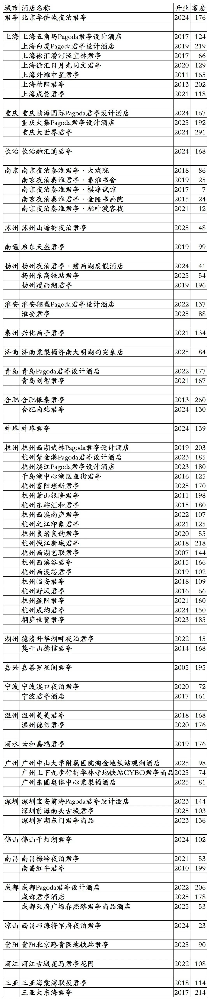
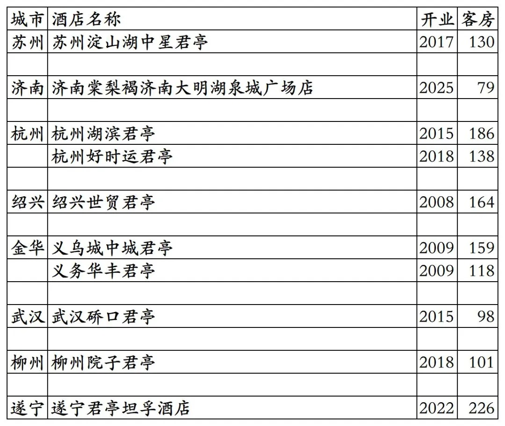
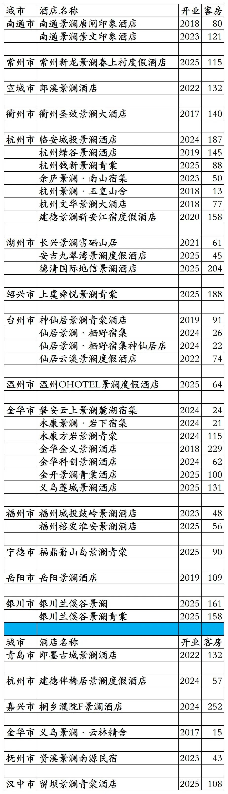
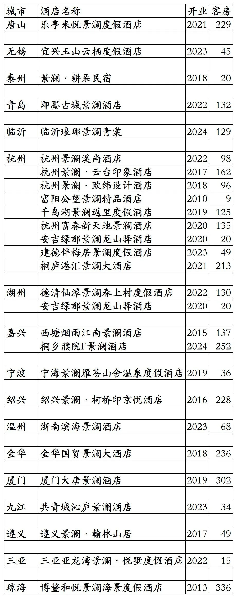

# 君亭开业及退出酒店统计2025版

> 本文转载自微信公众号 **不同的角落**，已获作者授权。  
> 原文发布于 2025年12月7日 21:54  
> 原文链接：[mp.weixin.qq.com](https://mp.weixin.qq.com/s?__biz=MzU4OTczMzkwNw==&mid=2247593231&idx=1&sn=e77507548dc06ec4350502f21ad6b17f)

---

君亭酒店集团旗下开业及退出酒店统计，统计截至2025年12月7日。

说在前面：抄袭我2025年11月22日发布的原创《香格里拉开业及退出酒店统计2025版》文章，于2025年11月26日发布将文章改名为《2025最新香格里拉酒店清单-含历年摘牌/夭折项目》并标注原创的那个“暨南酒旅人”微信公众号，如果再抄袭我的原创文章后改文章名发布，请要点脸别再标注原创了。

客房数据主要来自于君亭官方平台与OTA，部分酒店客房数量打过酒店电话核实，记录的是酒店员工告知的客房数量。

君亭总部位于浙江省杭州市，旗下酒店三星级到五星级档次都有。

君亭旗下分为君澜、君亭、景澜三个版块，三个版块有各自的400客服电话；有君澜、君澜度假、君澜理、君亭、夜泊君亭、Pagoda君亭、君亭尚品、观涧、棠梨褐、景澜、景澜度假、景澜青棠等品牌。

四季澜嘉会会会员计划，稀巴烂的常旅客会员计划，分为银卡、金卡、白金卡、钻石卡四个等级。

湖北文旅集团收购君亭完成后，应该会将旗下湖北文旅酒店集团会员计划金羽会与四季澜嘉会合并为一个新的会员计划。

两个稀巴烂的会员计划不知道能不能合并成一个不那么烂的会员计划。

截至2025年12月31日君亭官方平台和OTA平台可以查询到的国内已开业酒店在营共计201家客房33077间。

北京君澜理酒店至今客房仍未对外营业，目前还是只开放了餐饮，故未将其统计在开业酒店名单里。与广州黄埔君澜酒店一起的广州黄埔国际会议中心二期，不是那种常规酒店业态，只有几栋别墅整栋售卖住宿套餐，故也未将其统计在开业酒店名单里。

目前开业在营酒店：

君澜系列酒店86家19225间，

君亭系列酒店75家客房9860间，

景澜系列酒店40家客房3992间。

历年退出酒店(应该有一些遗漏)：

君澜系列酒店55家客房12092间，

君亭系列酒店10家客房1399间，

景澜系列酒店27家客房3305间。

君亭酒客2025年报已开业酒店共计289家客房54788间。我是真查询不到其余酒店开在哪里。

如果把君澜系列、君亭系列、景澜系列历年来退出酒店都算上，目前开业在营酒店数量客房数量加上历年来退出酒店数量客房数量，就与君亭酒店近四年年报里的君澜系列、君亭系列、景澜系列开业酒店数量客房数量差不多了。

毕竟君亭年报季报酒店数量统计表里写的是开业酒店，不是开业在营酒店，那数量加上之前开业后来退出的酒店也没毛病。

君澜酒店86+57=143家，

君澜客房19225+13054=32279间。

君亭酒店75+10=85家，

君亭客房9860+1399=11259间。

景澜酒店40+25=65家，

景澜客房3992+2945=6937间。

截至2025年12月31日，统计君亭历年来

开业酒店数量143+85+65=293家，

客房32279+11259+6937=50475间。

2026年修改。

中国旅游饭店业协会经过严格缜密的数据统计、分析与核实，发布的2021-2024年度中国饭店集团60强榜单(2021年君亭尚未收购君澜，统计数量为60强榜单中君澜+君亭开业酒店数量之和)中，统计的君亭国内开业在营酒店与客房数量如下：

2021年158家酒店33256间客房，

2022年183家酒店35653间客房，

2023年219家酒店43102间客房，

2024年243家酒店46934间客房。

目前君亭在北京、上海、重庆、河北、山西、河南、吉林、江苏、山东、安徽、浙江、福建、湖北、湖南、广东、广西、江西、四川、贵州、云南、海南、陕西、宁夏有酒店。

开业：新酒店开业或是其它酒店翻牌开业时间。

客房：客房数量。

个人精力有限，部分酒店开业/退出/下线时间以及客房数量难免有错误，欢迎各位告知指正，谢谢！

君澜系列品牌开业在营酒店，其中蓝条下面那7家酒店未上线君亭官方平台。

君澜系列品牌历年退出酒店，包括国外柬埔寨西哈努克1家酒店；另阿拉尔塔河花园酒店2021年开业后曾签约君澜，但未等管理就换管理方了，故未统计在内。

君亭系列品牌开业在营酒店，其中淮安君亭前身是2019年开业2022年退出的淮安朵悦君亭(之前119间客房)，其于2025年重新加盟翻牌为君亭；另外棠梨褐2家、观涧1家，放到君亭系列了。

君亭系列品牌历年退出酒店

景澜系列品牌开业在营酒店，其中蓝条下面那6家酒店未上线君亭官方平台。

景澜系列品牌历年退出酒店

更多的国内酒店统计、年度酒店排行、酒店常识、酒店行业资讯、酒店集团、航空常识、机场交通、行政区划、沈阳旅游、沙发客、打油诗等相关内容可以到我的微信公众号里查看。

也欢迎大家关注我的微信公众号和视频号，名称都是：**不同的角落**

微信直接搜索不同的角落就可以搜索到。

也可以直接点开下方公众号名片关注。