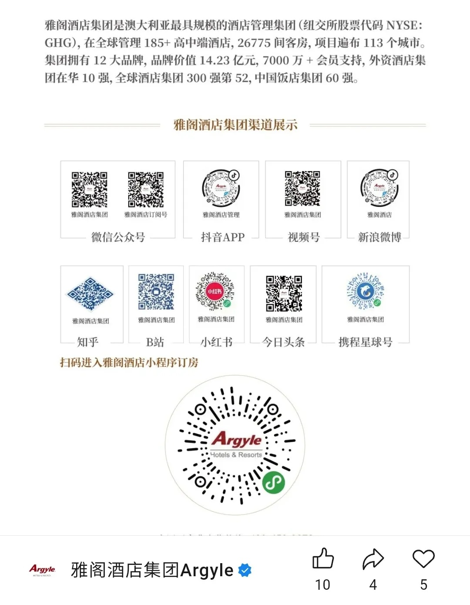
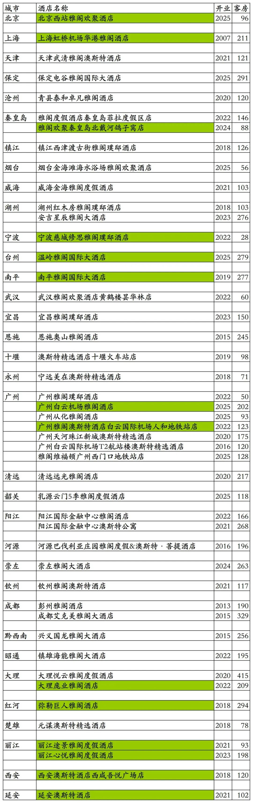
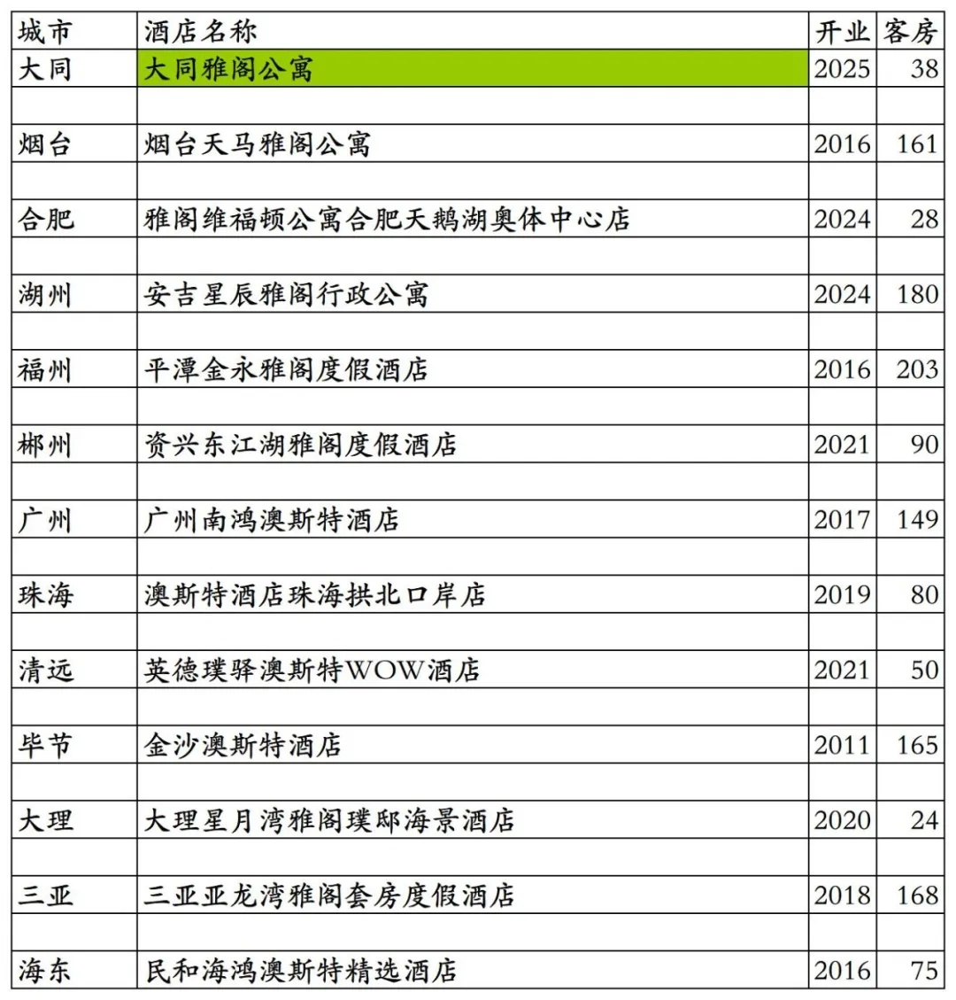
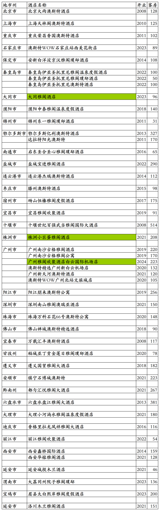

# 雅阁国内开业及退出酒店统计2025版

> 本文转载自微信公众号 **不同的角落**，已获作者授权。  
> 原文发布于 2025年12月29日 22:27  
> 原文链接：[mp.weixin.qq.com](http://mp.weixin.qq.com/s?__biz=MzU4OTczMzkwNw==&mid=2247606646&idx=1&sn=06f16fecc46574c51e4e3d2e82d28cd4&chksm=fdca680acabde11ca2825b27050164f9e4b4a89442e80b99d248eec6d591fadee5289dfbfe3c)

---

雅阁旗下国内开业酒店统计，统计截至2025年12月31日。

说在前面：抄袭我2025年11月22日发布的原创《香格里拉开业及退出酒店统计2025版》文章，于2025年11月26日发布将文章改名为《2025最新香格里拉酒店清单-含历年摘牌/夭折项目》并标注原创的那个“暨南酒旅人”微信公众号，如果再抄袭我的原创文章后改文章名发布，请要点脸别再标注原创了。

客房数据主要来自于雅阁官方平台与OTA，部分酒店客房数量打过酒店电话核实，记录的是酒店员工告知的客房数量。

雅阁酒店总部在澳大利亚，国内经营主体为雅阁酒店管理（北京）有限公司，国内酒店老四格林酒店集团曾出资18万美元占股60%成为大股东，雅阁对外宣传长期以美国纽交所上市公司自居(GHG为格林酒店代码)。后来雅阁与格林闹掰，央企中旅酒店入股雅阁酒店管理（北京）有限公司，旗下酒店中档到五星级档次都有。

雅阁酒店旗下有雅阁国际大酒店(原雅阁大酒店升级，雅阁官方宣称为奢华旗舰)、雅阁璞邸(雅阁官方宣称为奢华精品)、雅阁度假酒店、雅阁酒店、雅阁欢聚酒店、雅阁公寓、雅阁维福顿公寓、澳斯特酒店、雅阁澳斯特酒店、澳斯特精选酒店、澳斯特公寓、澳斯特WOW酒店、Metro酒店等品牌。

旅佳会会员计划，分为旅佳卡、悠雅卡、金卡、黑金卡四个等级。之前曾使用过格林酒店集团格美会会员计划。

个人精力有限，部分酒店开业时间以及客房数量难免有错误，欢迎各位告知指正，谢谢！

截至2025年12月31日雅阁官方平台可以查询到的国内已开业酒店共计57家。

57家酒店中，有3家酒店已退出翻牌为其它酒店，在雅阁官方平台所有日期都不能预订；有8家公寓是广州维福顿旗下公寓，与雅阁合作上线雅阁官方预订平台，但并不是雅阁旗下品牌，有1家是雅阁与维福顿合作的雅阁维福顿品牌。

去除这11家酒店与公寓，雅阁官方平台雅阁旗下开业酒店46家客房7660间。其中32家酒店可以预订，其余14家酒店所有日期都无法预订。

在OTA平台还可以查询到雅阁旗下品牌国内酒店13家客房1411间。

雅阁国内开业酒店共计59家客房9071间，比2024年略有增长。

雅阁官方平台预订价格基本都比OTA平台价格贵。

中国旅游饭店业协会经过严格缜密的数据统计、分析与核实，发布的2021-2024年度中国饭店集团60强榜单中，统计的雅阁酒店国内开业酒店与客房数量如下：

2021年77家酒店14832间客房，

2022年121家酒店24179间客房，

2023年149家酒店30048间客房，

2024年175家酒店38409间客房。

目前雅阁在北京、上海、天津、河北、江苏、山东、安徽、浙江、福建、湖北、湖南、广东、广西、江西、四川、贵州、云南、海南、陕西、青海有酒店。

开业：新酒店开业或是其它酒店翻牌开业时间；客房：客房数量。北京西站雅阁欢聚酒店目前试营业中，温岭雅阁国际大酒店已于2025年12月29日开业，目前网上尚未开放预订。

OTA平台其余13家雅阁酒店，大同雅阁公寓目前停业中，与大同雅阁公寓一起的大同雅阁酒店已退出翻牌为其它酒店。

雅阁历年退出及关停酒店，大同雅阁酒店、株洲小巨蛋雅阁酒店、广州雅阁欢聚酒店白云国际机场店已退出翻牌为其它酒店，但目前还在雅阁官方平台，只是所有日期都不能预订。

更多的国内酒店统计、年度酒店排行、酒店常识、酒店行业资讯、酒店集团、航空常识、机场交通、行政区划、沈阳旅游、行政区划、沙发客、打油诗等相关内容可以到我的微信公众号里查看。

也欢迎大家关注我的微信公众号和视频号，名称都是：**不同的角落**

微信直接搜索不同的角落就可以搜索到。

也可以直接点开下方公众号名片关注。