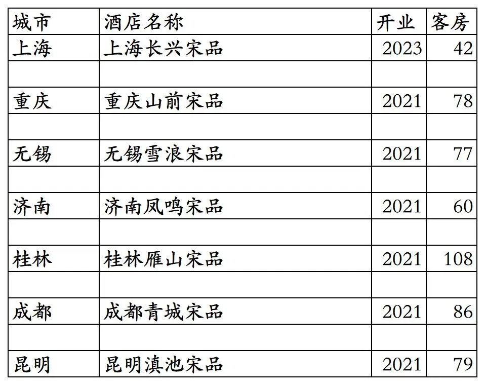
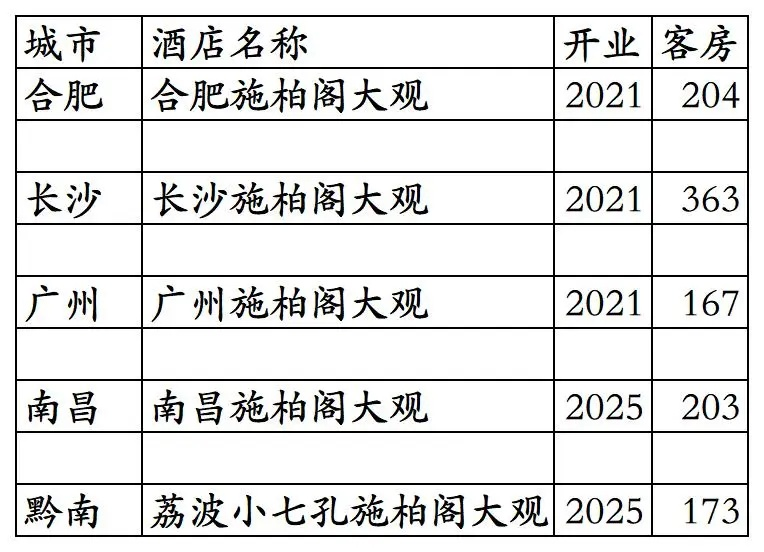
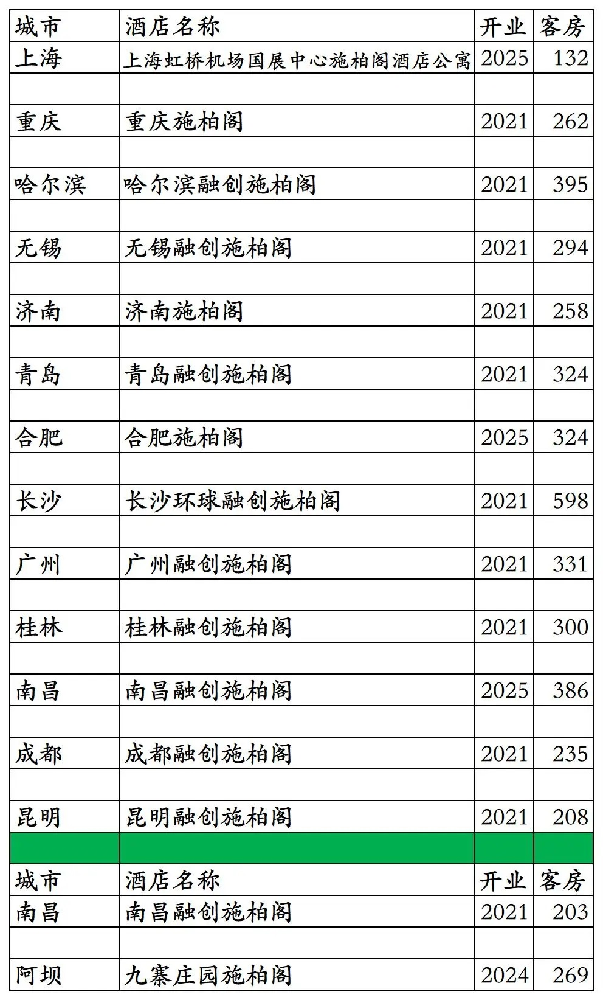
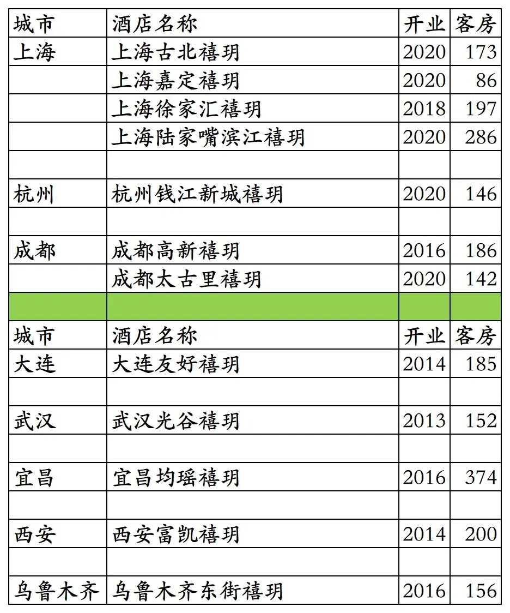
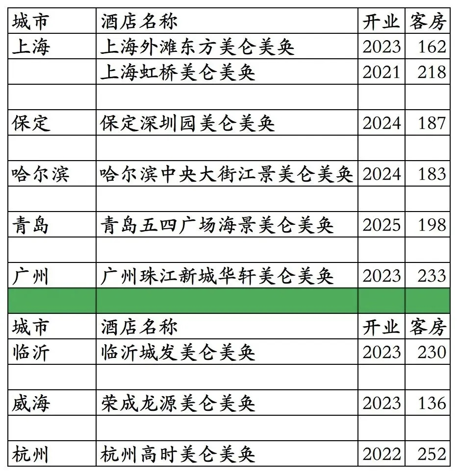
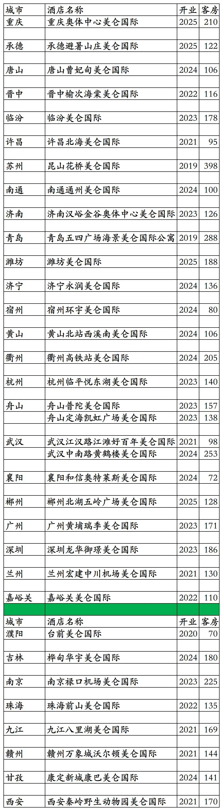
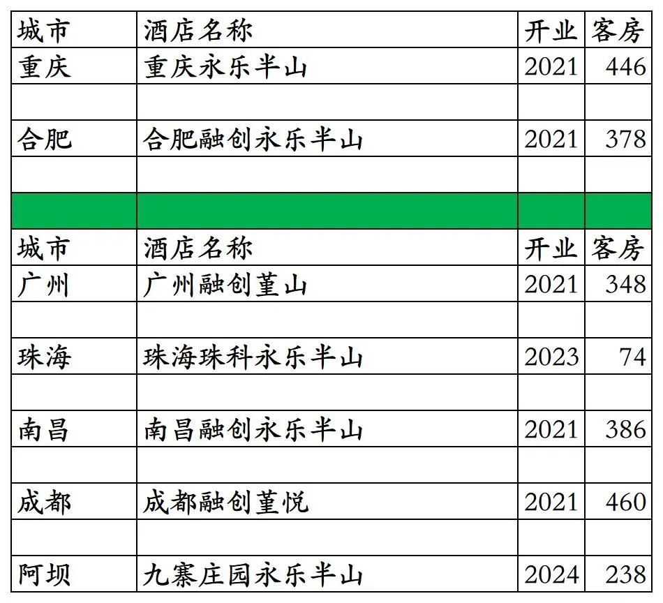
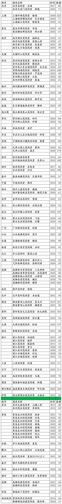
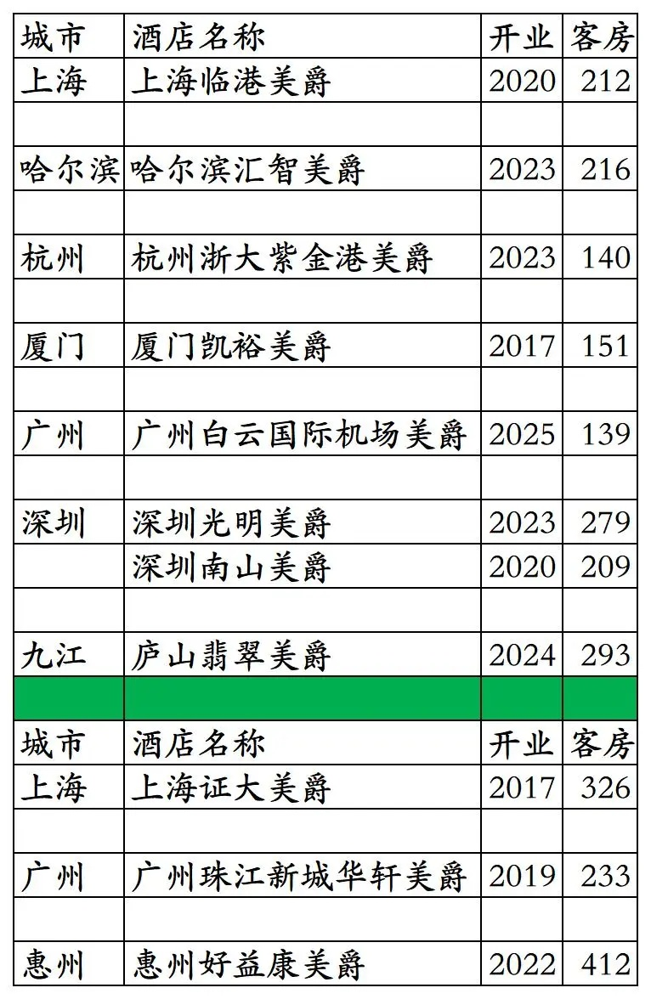

# 华住国内高端酒店开业及退出统计2025版

> 本文转载自微信公众号 **不同的角落**，已获作者授权。  
> 原文发布于 2025年12月30日 19:36  
> 原文链接：[mp.weixin.qq.com](https://mp.weixin.qq.com/s?__biz=MzU4OTczMzkwNw==&mid=2247606873&idx=1&sn=68d0d9a13b1fd7c801ba71d81d56c9fa&scene=21#wechat_redirect)

---

华住旗下国内高端酒店开业及退出统计，统计截至2025年12月31日。

华住酒店集团介绍可以看这篇：

[国内酒店集团之二华住](https://mp.weixin.qq.com/s?__biz=MzU4OTczMzkwNw==&mid=2247548611&idx=1&sn=45a621dade1fe36311c715794f511331&scene=21#wechat_redirect)

客房数据主要来自于华住官方平台与OTA，部分酒店客房数量打过酒店电话核实，记录的是酒店员工告知的客房数量。

个人精力有限，部分酒店开业/退出/下线时间以及客房数量难免有错误，欢迎各位告知指正，谢谢！

华住国内高端品牌酒店包括：华住与融创合资公司永乐华住旗下的宋品、施柏阁大观、施柏阁、花间堂系列、永乐半山5个品牌酒店（可以在华住会APP/小程序预订，也可以在华住高端度假小程序预订，在华住高端度假小程序预订不能使用优惠券）；华住2012年推出的高端品牌禧玥（2020年至今未再开发新店，最初的5家禧玥目前都已经退出或降级翻牌）；美仑家族（华住集团美仑事业部）旗下的美仑美奂品牌（华住收购的德意志酒店集团旗下高端酒店品牌）和美仑国际品牌（华住2019年推出的中档品牌美仑酒店升级版）；华住特许经营的雅高旗下美爵品牌。

其中花间堂系列品牌数量最多，酒店品质差距也最大，酒店档次从中档酒店到高端酒店都有。

截至2025年12月31日宋品7家、施柏阁大观5家、施柏阁13家、花间堂系列77家、永乐半山2家、禧玥7家、美仑美奂6家、美仑国际26家、美爵8家（国内其余美爵品牌酒店为雅高开发运营）。

目前华住高端品牌酒店在北京、上海、重庆、山西、河南、黑龙江、江苏、山东、安徽、浙江、福建、湖北、湖南、广东、广西、江西、四川、贵州、云南、陕西、甘肃、新疆有酒店。

开业：新酒店开业或是其它酒店翻牌开业时间；客房：客房数量。

宋品2025年无新店开业。

小七孔施柏阁大观酒店2025年上线华住会，南昌施柏阁酒店2025年翻牌为施柏阁大观酒店。

九寨庄园施柏阁2025年退出，南昌融创永乐半山2025年翻牌为施柏阁，合肥施柏阁2025年新开业。

武汉光谷禧玥2024年翻牌为城际，大连友好禧玥2021年翻牌为美居，乌鲁木齐东街禧玥2019年翻牌为美居，西安富凯禧玥2018年翻牌为亚朵S，唯一一家五星级禧玥由原锦江翻牌的宜昌均瑶禧玥2022年退出。

美仑美奂2025年新开业酒店1家。

台前美仑国际、康定新城康巴美仑国际、西安秦岭野生动物园美仑国际3家酒店在OTA平台名称未变，打华住会客服电话咨询，说已经不再合作。

广州融创堇山翻牌为花间堂，成都融创堇悦翻牌为花间阁，九寨庄园永乐半山翻牌为全季和桔子(改造中)，珠海珠科永乐半山退出。

稻城亚丁花间岭·杜鹃谷再次停业，不知明年还会不会再次开业。

上海证大美爵2025年退出，广州珠江新城华轩美爵2023年翻牌为美仑美奂。

更多的国内酒店统计、年度酒店排行、酒店常识、酒店行业资讯、酒店集团、航空常识、机场交通、行政区划、沈阳旅游、沙发客、打油诗等相关内容可以到我的微信公众号里查看。

也欢迎大家关注我的微信公众号和视频号，名称都是：**不同的角落**

微信直接搜索不同的角落就可以搜索到。

也可以直接点开下方公众号名片关注。