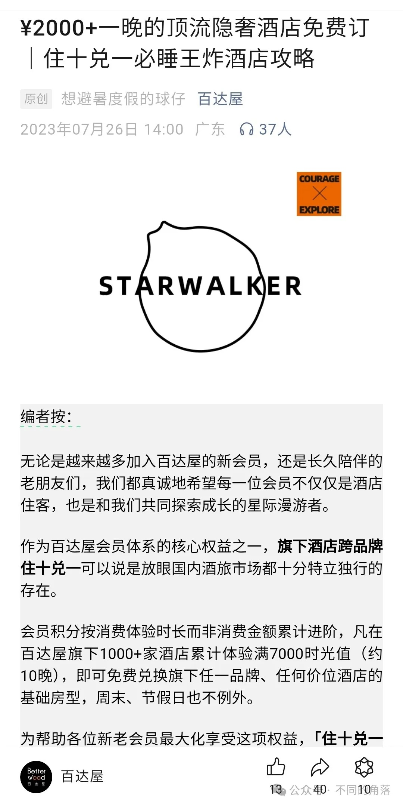

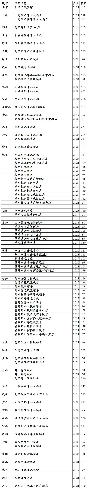
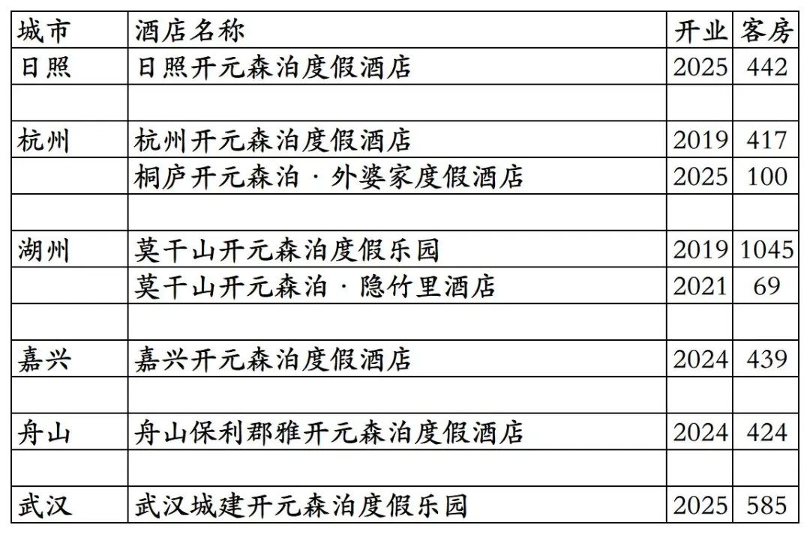
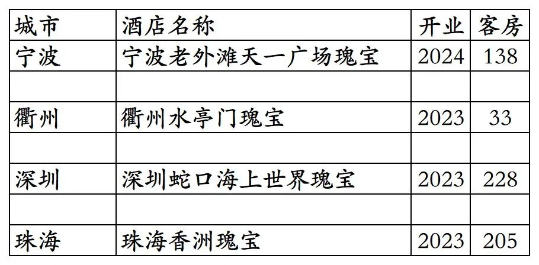
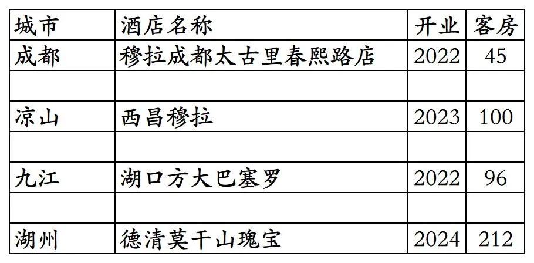
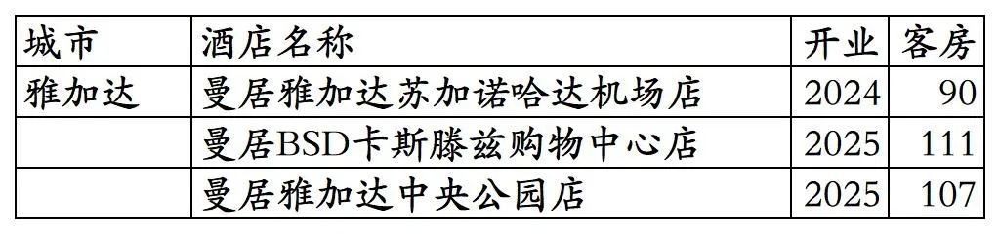
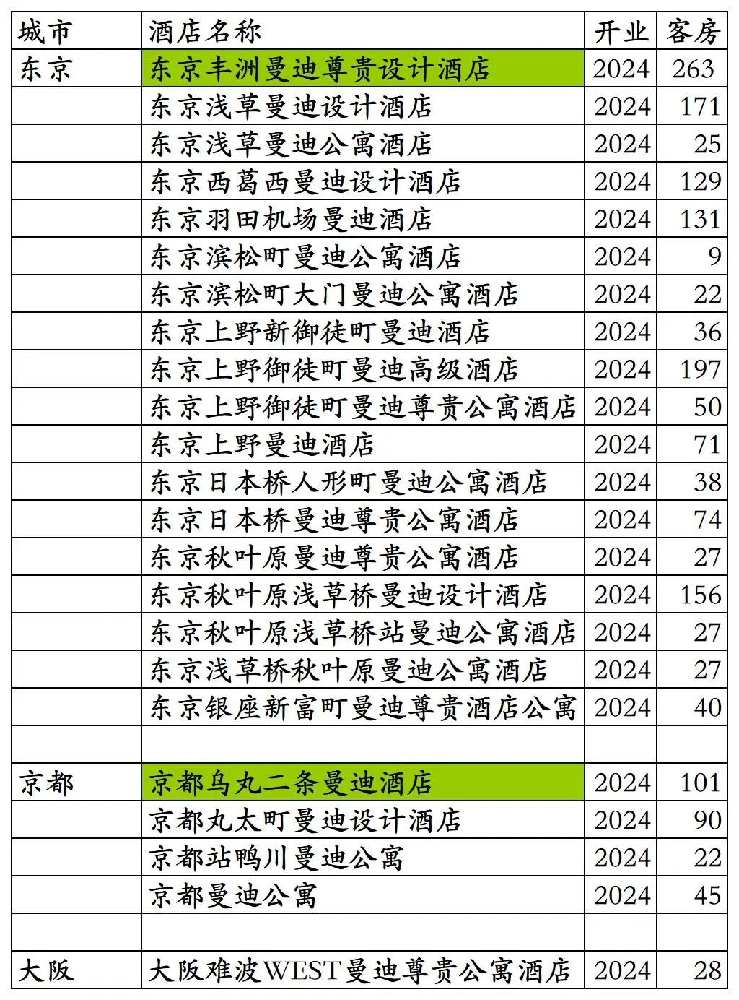


# 开元开业及退出酒店统计2025版

> **作者**：不同的角落  
> **发布时间**：2026年1月2日 20:36  
> **原文链接**：[开元开业及退出酒店统计2025版](https://mp.weixin.qq.com/s?__biz=MzU4OTczMzkwNw==&mid=2247607605&idx=1&sn=b497ea72bace78160605c89c0b16bfa9&scene=21#wechat_redirect)

---

开元旗下国内已开业及退出酒店统计，统计截至2025年12月31日。

客房数据主要来自于百达屋APP与OTA。

个人精力有限，部分酒店开业/退出/下线时间以及客房数量难免有错误，欢迎各位告知指正，谢谢！

截至2025年12月31日，百达屋APP可以查询到德胧旗下各品牌酒店517家。

517家酒店包括国外印尼曼居酒店3家；德胧旗下百达屋旗下品牌瑰宝酒店4家；已退出/关停(多家酒店2023年时就已退出，多家酒店早已翻牌)所有日期都不能预订的开元旗下品牌酒店84家；所有日期都不能预订的开元森泊品牌酒店2家。

截至2025年12月31日百达屋平台可预订并累积时光值的德胧旗下酒店(开元+百达屋+其它)共计400多家，还不足百达屋2023年7月吹牛13的1000+酒店的一半。

去除3家德胧旗下印尼酒店，4家百达屋旗下品牌酒店，84家已退出酒店，2家开元森泊，截至2025年12月31日，百达屋平台德胧旗下开元旗下国内酒店共计424家客房69070间(部分酒店所有日期都不能预订)。

加上4家百达屋旗下瑰宝品牌酒店，德胧国内酒店共计428家客房69674间。

加上国外印尼3家曼居品牌酒店，德胧全球酒店共计431家客房69982间。

目前国内黑龙江、甘肃、青海无酒店。

开业：新酒店开业或是其它酒店翻牌开元时间；客房：客房数量。

  百达屋平台424家开元旗下品牌酒店

      百达屋平台84家已退出/关停开元旗下品牌酒店，部分酒店目前仍挂开元品牌，但已与德胧无关。

开元酒店集团原大股东开元旅业旗下8家开元森泊品牌酒店，杭州开元森泊、莫干山开元森泊目前还挂在百达屋平台，所有日期都不能预订。

舟山保利郡雅开元森泊记得好像之前上线过百达屋。 莫干山开元森泊度假乐园分出69间客房命名为莫干山开元森泊·隐竹里酒店在OTA上单独售卖，实际上还是莫干山开元森泊的一部分。

百达屋平台4家德胧旗下百达屋引进的瑰宝品牌酒店。

瑰宝为百达屋引进的德国瑰宝酒店集团旗下酒店品牌，现在瑰宝集团旗下瑰宝酒店品牌已经被洲际收购，成为洲际旗下品牌。

 

 4家已经退出的百达屋旗下品牌酒店。

 2022年5月开业并上线开元商祺会APP，仅半年就退出翻牌为其它酒店的穆拉酒店成都太古里春熙路店(挂牌穆拉之前是成都间白酒店春熙路太古里店，退出穆拉后加盟瓦当瓦舍现在是瓦当瓦舍成都春熙路IFS国金中心店)。

西昌穆拉开业后一直未上线百达屋平台，目前酒店名称未变，打电话咨询告知已与德胧无关。

 2022年9月开业并上线开元商祺会APP，但一直不能预订的湖口方大巴塞罗酒店(现湖口方大九钢酒店)。巴塞罗为百达屋引进的西班牙巴塞罗酒店集团旗下品牌。

      百达屋平台3家印尼曼居酒店。

德胧2024年投资的Hotel Monday旗下23家酒店，之前有2家曾上线百达屋平台，今年已下线。打百达屋客服电话咨询，告知已不再合作。

历年退出和关掉的开元旗下品牌酒店，有的开业后从未上线过开元商祺会平台和后来的百达屋平台。

更多的国内酒店统计、年度酒店排行、酒店常识、酒店行业资讯、酒店集团、航空常识、机场交通、行政区划、沈阳旅游、沙发客、打油诗等相关内容可以到我的微信公众号里查看。

也欢迎大家关注我的微信公众号和视频号，名称都是：**不同的角落**

微信直接搜索不同的角落就可以搜索到。

也可以直接点开下方公众号名片关注。