
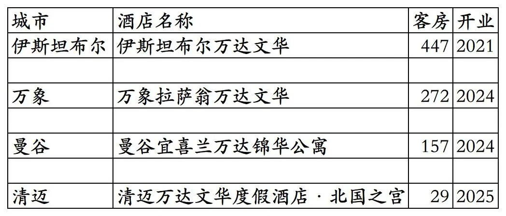
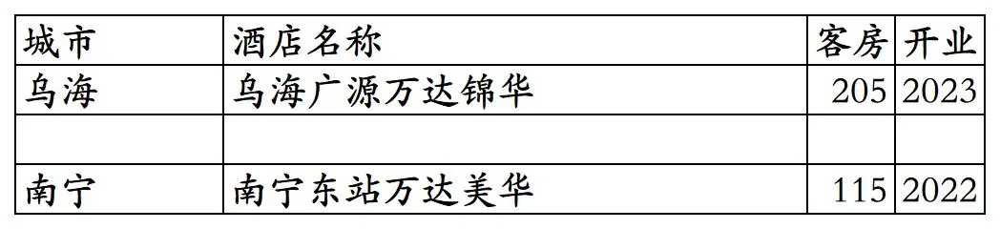
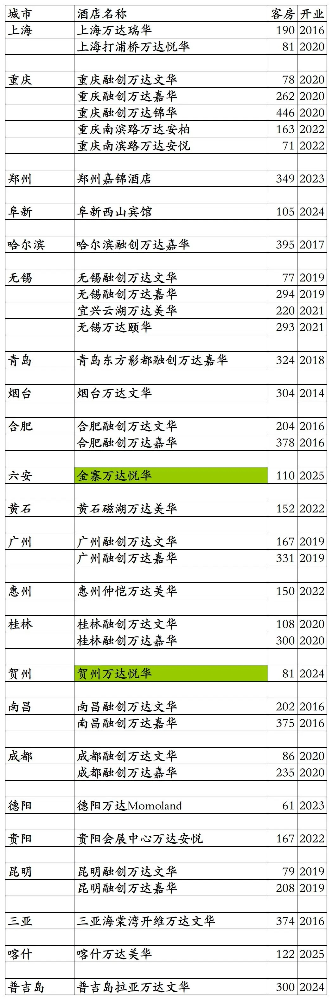

# 万达开业及退出酒店统计2025版

> 本文转载自微信公众号 **不同的角落**，已获作者授权。  
> 原文发布于 2026年1月3日 22:49  
> 原文链接：[mp.weixin.qq.com](https://mp.weixin.qq.com/s?__biz=MzU4OTczMzkwNw==&mid=2247607837&idx=1&sn=fa333c513bfaaa4c680f27e130ae2132&scene=21#wechat_redirect)

---

万达酒店集团旗下开业及退出酒店统计，统计截至2025年12月31日。

客房数据主要来自于万悦会小程序与OTA平台，部分酒店客房数量打过酒店电话核实，记录的是酒店员工告知的客房数量。

个人精力有限，部分酒店开业/退出/下线时间以及客房数量难免有错误，欢迎各位告知指正，谢谢！

截至2025年12月31日万达酒店集团旗下已开业酒店共计258家客房46803间。包括国外4家酒店，包括未上线万悦会只能在OTA平台预订的2家酒店。

万达瑞华3家、万达文华24家、万达嘉华49家、万达锦华28家、万达颐华(包括万达颐华府邸)18家、万达美华(包括万达美华轻尚、万达美华别院)84家、万达悦华43家、其它(包括万达锦寓、万达安柏、万达安悦、万达Momoland等其它万达品牌酒店和万达管理未挂牌万达旗下酒店品牌酒店)共计9家。

宜兴西岸凰川酒店在万悦会小程序上被划分到万达瑞华品牌，但在万达酒店年报里不是万达瑞华品牌，是其它品牌。

国内共计254家酒店45898间客房。国外4家酒店905间客房。

万悦会小程序可以查询到的其中256家酒店如下。部分酒店所有日期都不能预订，其中有一些酒店是试营业中尚未开放万悦会平台预订，另有一些酒店是关闭了万悦会平台预订。

比如西双版纳融创万达文华度假酒店2021年10月退出万达更名宋品酒店后下线；然后业主更换，2021年12月酒店更名为西双版纳稷泽万达文华度假酒店，又重新上线万悦会；不过上线不久后又下线。2025年下半年重新上线万悦会开放预订，不过时间不长又关闭万悦会平台预订。

开业：新酒店开业或是其它酒店翻牌万达时间；客房：客房数量。

OTA平台可以查询预订的2家万达品牌酒店，不享受万悦会会员权益不能累积积分间夜。

2023年开业后未一直未上线万悦会小程序的乌海广源万达锦华酒店，已于2024年下半年退出万达更名乌海广源锦华酒店，2025年又重新更名为乌海广源万达锦华酒店。

南宁东站万达美华2025年从万悦会小程序下线。

万达旗下历年已退出酒店统计。

金寨万达悦华酒店2025年开业，不过时间不长就退出更名为金寨悦华酒店，万悦会小程序目前未下架只是已不能预订。

贺州万达悦华酒店2025年已退出翻牌为美豪旗下美丽豪品牌，万悦会小程序目前未下架只是已不能预订。

普吉岛拉亚万达文华度假酒店2024年加盟万达由万达酒店团队管理并上线万悦会小程序但不能预订，2024年底退出万达更换酒店管理团队从万悦会下线，OTA平台更名为普吉岛拉亚度假村。

更多的国内酒店统计、年度酒店排行、酒店常识、酒店行业资讯、酒店集团、航空常识、机场交通、行政区划、沈阳旅游、沙发客、打油诗等相关内容可以到我的微信公众号里查看。

也欢迎大家关注我的微信公众号和视频号，名称都是：**不同的角落**

微信直接搜索不同的角落就可以搜索到。

也可以直接点开下方公众号名片关注。