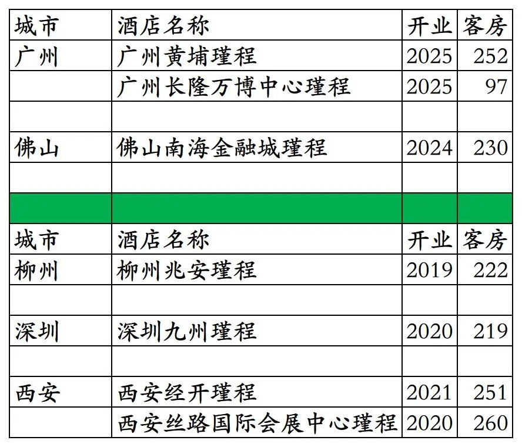
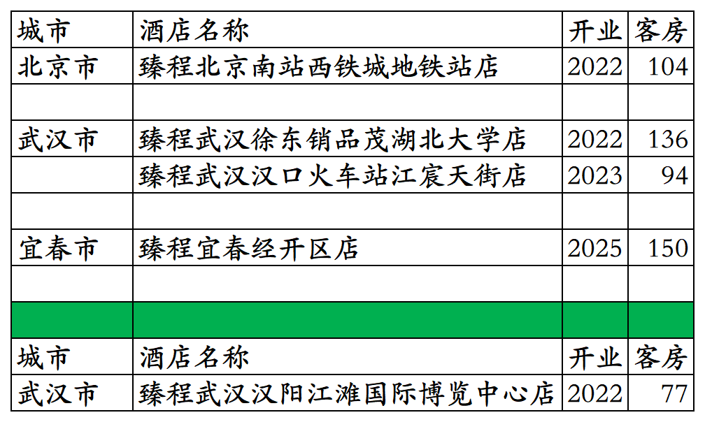
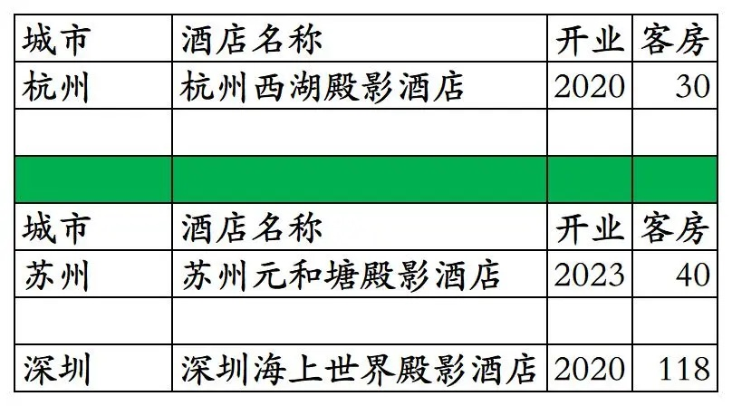
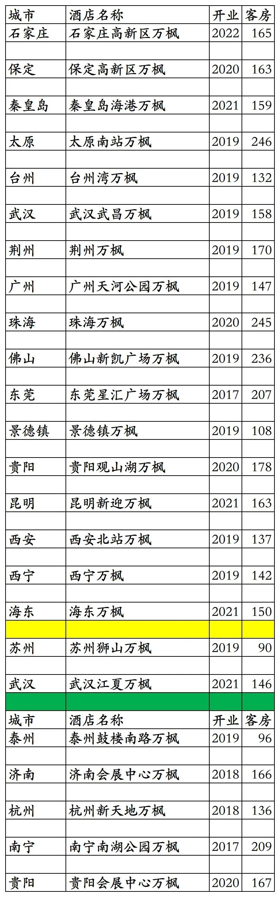


# 东呈高端品牌开业及退出酒店统计2025版

> **作者**：不同的角落  
> **发布时间**：2026年1月6日 23:23  
> **原文链接**：[东呈高端品牌开业及退出酒店统计2025版](https://mp.weixin.qq.com/s?__biz=MzU4OTczMzkwNw==&mid=2247609471&idx=1&sn=3f9b86e6bb44de42272efdb69f66966f&scene=21#wechat_redirect)

---

东呈旗下高端品牌开业及退出酒店统计，统计截至2025年12月31日。

客房数据主要来自于东呈官方平台与OTA，部分酒店客房数量打过酒店电话核实，记录的是酒店员工告知的客房数量。

个人精力有限，部分酒店开业/退出/下线时间以及客房数量难免有错误，欢迎各位告知指正，谢谢！

东呈高端品牌酒店包括：瑾程、臻程、殿影、吾公馆、蓓利夫人等五个品牌酒店。

其中2018年1月发布的吾公馆、蓓利夫人两个品牌，至今未开出一家。

截至2025年12月31日瑾程3家、臻程4家、殿影1家。

目前东呈高端品牌在北京、浙江、湖北、广东、江西有酒店。

开业：新酒店开业或是其它酒店翻牌开业时间；客房：客房数量。

瑾程共开业7家，目前剩3家

臻程共开业5家，目前剩4家

殿影共开业3家，目前剩1家

另东呈特许经营的万豪旗下低端品牌万枫，国内已开业24家，目前剩19家。其中苏州狮山寺万枫和武汉江夏万枫未上线东呈青猫会。

2016年2月，东呈与万豪签署万枫品牌国内特许经营协议，计划5年开发140家万枫酒店，计划2021年底前开业100家酒店；2019年5月1日，万豪宣布与东呈解除万枫品牌合作协议，东呈将继续筹建和管理之前开发的万枫酒店。

其中杭州新天地万枫2025年9月倒闭跑路，酒店拖欠30多名员工工资。杭州新天地万枫为一家众筹酒店。

截至2025年12月31日，东呈青猫会平台开业在营酒店各品牌分布数量如下，其中部分酒店所有日期都不能预订，不包括已上线东呈青猫会平台但尚未未开业酒店。

更多的国内酒店统计、年度酒店排行、酒店常识、酒店行业资讯、酒店集团、航空常识、机场交通、行政区划、沈阳旅游、沙发客、打油诗等相关内容可以到我的微信公众号里查看。

也欢迎大家关注我的微信公众号和视频号，名称都是：**不同的角落**

微信直接搜索不同的角落就可以搜索到。

也可以直接点开下方公众号名片关注。