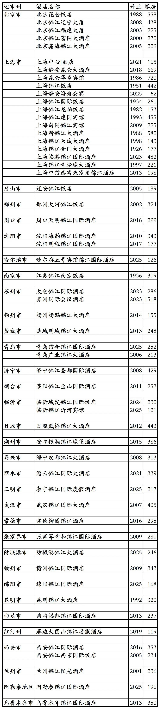
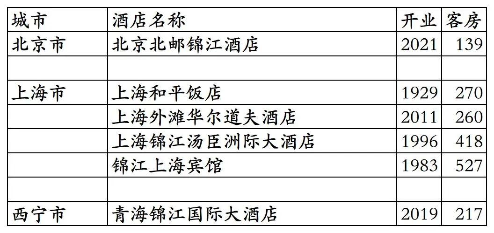
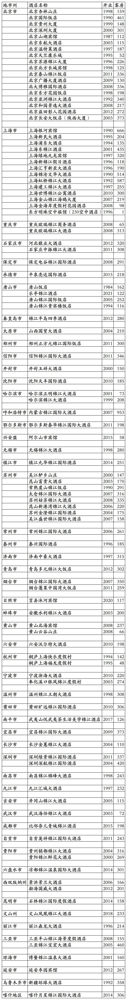
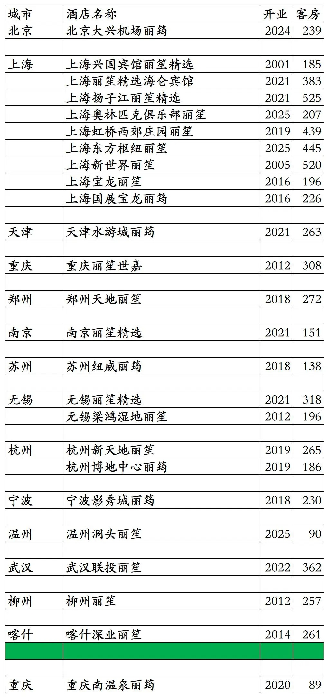
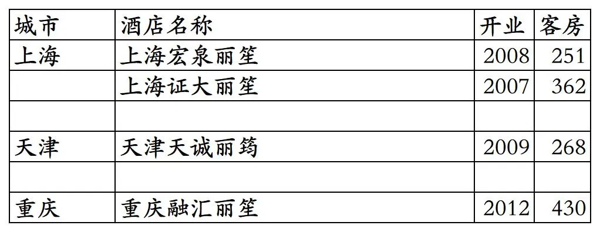
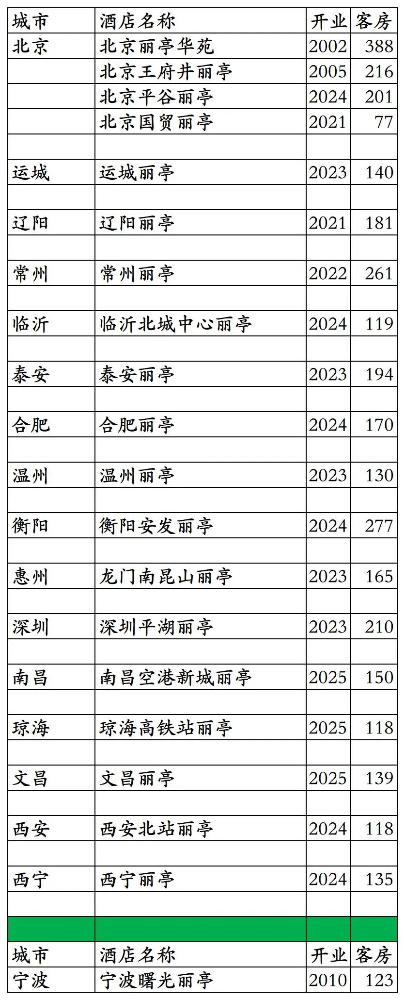
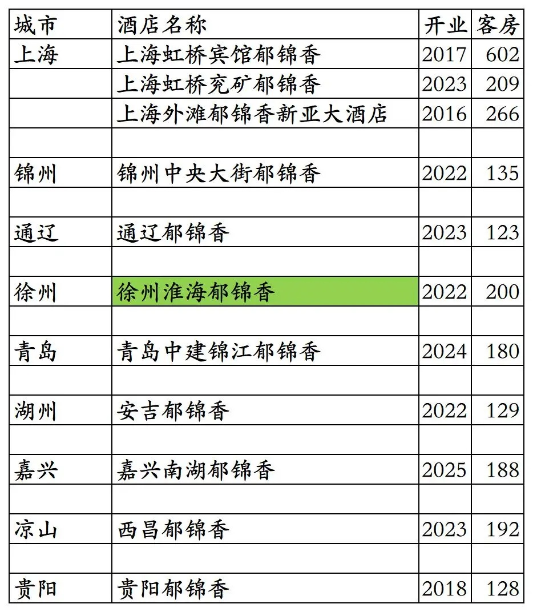
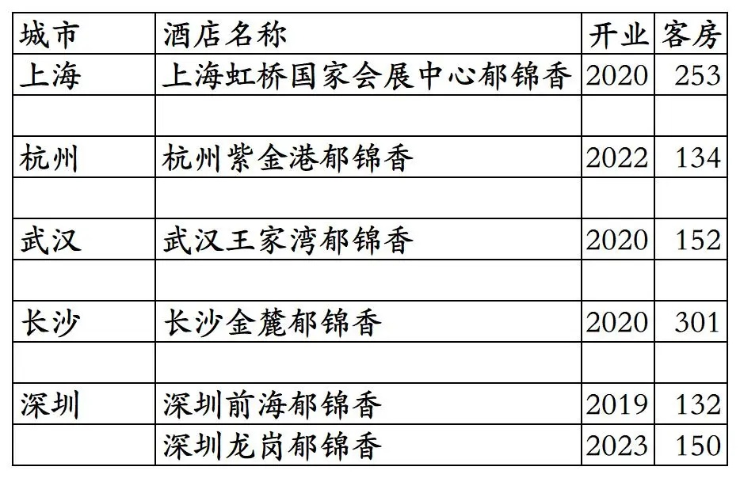

# 锦江国内高端酒店开业及退出统计2025版

> 本文转载自微信公众号 **不同的角落**，已获作者授权。  
> 原文发布于 2026年1月12日 23:51  
> 原文链接：[mp.weixin.qq.com](https://mp.weixin.qq.com/s?__biz=MzU4OTczMzkwNw==&mid=2247609898&idx=1&sn=1bf95d3afb9ca7c4c201c8844fb7be47&scene=21#wechat_redirect)

---

锦江旗下国内已开业锦江丽笙酒店统计，锦江将锦江丽笙系列品牌酒店宣传为豪华酒店，统计截至2025年12月31日。

说在前面：抄袭我2025年11月22日发布的原创《香格里拉开业及退出酒店统计2025版》文章，于2025年11月26日发布将文章改名为《2025最新香格里拉酒店清单-含历年摘牌/夭折项目》并标注原创的那个“暨南酒旅人”微信公众号，如果再抄袭我的原创文章后改文章名发布，请要点脸别再标注原创了。

锦江酒店集团介绍可以看这篇：

[国内酒店集团之一锦江2024版](https://mp.weixin.qq.com/s?__biz=MzU4OTczMzkwNw==&mid=2247530974&idx=1&sn=f60552db1b496639acda9eb1d66288f3&scene=21#wechat_redirect)

客房数据主要来自于锦江官方平台与OTA，部分酒店客房数量打过酒店电话核实，记录的是酒店员工告知的客房数量。

个人精力有限，部分酒店开业/退出/下线时间以及客房数量难免有错误，欢迎各位告知指正，谢谢！

截至2025年12月31日，锦江荟平台可以查询到的国内开业在营锦江丽笙酒店共计109家。

不包括锦江为业主及持股的委托给国际品牌管理的上海和平饭店、上海锦江汤臣洲际、上海华尔道夫等酒店，不包括锦江特许经营的非锦江旗下品牌上海东锦江希尔顿逸林酒店。

锦江丽笙酒店包括J酒店、岩花园、昆仑、锦江（三星级到五星级档次都有）4个品牌和中国区域丽笙精选、丽笙、丽筠、丽祺、丽亭、郁锦香这6个品牌。

目前J酒店只有1家；岩花园酒店无，2013年时开过一家北京榈园岩花园酒店（海岩的产业）但早已停业多年，上海岩花园酒店目前在建中，宣称2024年开业但并未开业，又宣称2025年开业但仍未开业；昆仑目前有3家酒店；锦江品牌目前还有54家（10多年前60多家）。

开业：新酒店开业或是酒店翻牌开业时间；客房：客房数量。

锦江荟平台55家原锦江旗下品牌高星酒店。其中上海华亭宾馆2026年升级改造后重新开业改成昆仑品牌，客房也减少至540间。

3家不在锦江荟平台的锦江酒店及3家锦江为业主委托国际品牌管理的酒店。北京北邮锦江酒店2024年从锦江荟下线，上海宾馆停业翻新中，青海锦江国际大酒店开业后一直未上线锦江官方平台。

历年来退出/关停的锦江品牌酒店。感谢zwj提供的部分锦江退出/关停酒店名单。

丽笙旗下国内3个高端品牌酒店25家。其中重庆南温泉丽筠开业至今从未上线锦江官方预订平台。

丽笙国内4家已退出的高端品牌酒店。上海宏泉丽笙已翻牌为Pagoda君亭设计酒店，上海证大丽笙先翻牌为华住管理的上海证大美爵，2025年1月1日退出翻牌，不久又翻牌为雅高管理的上海证大美爵。

丽笙旗下国内中档品牌丽亭酒店19家。1家早已退出的宁波曙光丽亭，但还是一直挂牌丽亭。

卢浮旗下国内中档品牌郁锦香酒店11家。其中徐州淮海郁锦香已关闭锦江荟预订通道。上海虹桥宾馆郁锦香为原上海锦江虹桥宾馆翻牌，上海外滩郁锦香新亚大酒店为原上海新亚大酒店，后翻牌为锦江都城经典，最终又翻牌为上海外滩郁锦香。

郁锦香国内6家已退出的酒店。武汉王家湾郁锦香之前为首旅建国管理运营的武汉铁桥建国大酒店，深圳前海郁锦香已翻牌为亚朵S酒店。

更多的国内酒店统计、年度酒店排行、酒店常识、酒店行业资讯、酒店集团、航空常识、机场交通、行政区划、沈阳旅游、沙发客、打油诗等相关内容可以到我的微信公众号里查看。

也欢迎大家关注我的微信公众号和视频号，名称都是：**不同的角落**

微信直接搜索不同的角落就可以搜索到。

也可以直接点开下方公众号名片关注。