# 八大民营酒店集团官方平台国内开业酒店数量统计2025版

> **作者**：不同的角落  
> **发布时间**：2026年1月14日 22:43  
> **原文链接**：[八大民营酒店集团官方平台国内开业酒店数量统计2025版](http://mp.weixin.qq.com/s?__biz=MzU4OTczMzkwNw==&mid=2247609997&idx=1&sn=ab1871f4abd5e3d48f026aa3281f8ce7&chksm=fdca67f1cabdeee7b06535f59b5a2770de48986cdd1cf112cb95caecf0d0caa7e82e511b4e25)

---

华住、格林、东呈、尚美、亚朵、旅悦、艺龙、丽呈8家民营酒店集团(联盟)国内开业酒店数量统计，统计数据截至2025年12月31日。

个人精力有限，手动统计，部分酒店集团官方平台酒店数量难免有些许误差，欢迎各位告知指正，谢谢！

先来看下8家酒店集团(联盟)在中国旅游饭店业协会2024年度中国饭店集团60强榜单中的开业酒店数量(截至2024年12月31日，旅悦未参与中国旅游饭店业协会年度60强评比，为中国饭店协会年度中国酒店集团50强榜单数据)与我统计的截至2025年12月31日在各家酒店集团官方平台开业酒店数量对比。

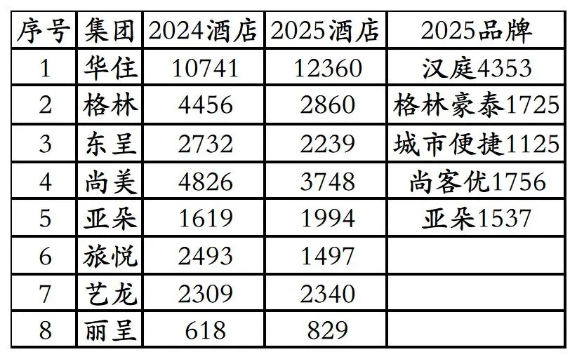

1、2024年中国饭店集团60强榜单华住国内开业酒店数量10741家。

截至2025年12月31日，华住会APP上可查询到的华住旗下国内酒店(包括华住特许经营的雅高旗下美爵、诺富特、美居、宜必思尚品、宜必思5个品牌酒店，已去除华住会APP上雅高管理运营的美爵、诺富特、美居)数量12360家，其中：

汉庭4353家、

全季3507家、

桔子1037家、

星程665家、

海友652家、

你好496家、

桔子水晶320家、

漫心190家、

城际107家、

花间堂77家、

怡莱45家、

CitiGO37家、

城家公寓34家、

美仑国际26家、

瑞贝庭23家、

馨乐庭10家、

施柏阁13家、

城家公寓酒店12家、

宋品7家、

禧玥7家、

美仑美奂6家、

施柏阁大观5家、

励业公寓1家、

城家员宿1家，

特许经营的雅高旗下

美爵8家、

诺富特42家、

美居219家、

宜必思尚品86家、

宜必思283家。

不知道OTA平台还有多少家未上线华住会的华住旗下品牌酒店。

2、2024年中国饭店集团60强榜单格林国内开业酒店数量4456家。

截至2025年12月31日，格林APP上可查询到的格林旗下开业在营可预订酒店数量2860家(不含格林APP上可预订的20多家尚格和逸柏旗下品牌，不含格林APP上所有日期都不能预订的部分酒店)，其中：

格林豪泰1725家。

不知道OTA平台还有多少家未上线格林的格林旗下品牌酒店。

格林APP上一些所有日期都不能预订的酒店，主要有如下三种类型：

①酒店早已退出翻牌为其它品牌，但在格林APP上未下线，所有日期不能预订。

比如格林豪泰伊春南山公园快捷酒店，2024年时就已退出翻牌为首旅如家旗下驿居酒店，但格林APP一直未下线。

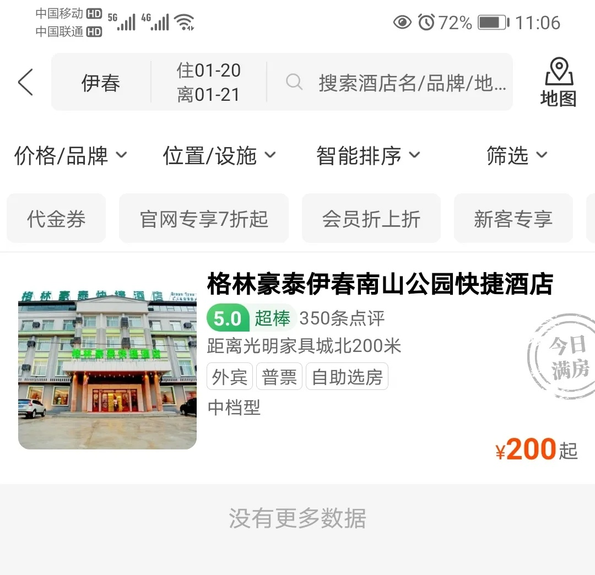

②已经不再与格林合作的酒店集团旗旗下酒店，在格林APP上未下线，所有日期不能预订。

比如2023年已与格林分手投入中旅酒店旗下的雅阁酒店，旗下广州3家澳斯特系列品牌酒店，在格林APP一直未下线，所有日期不能预订。

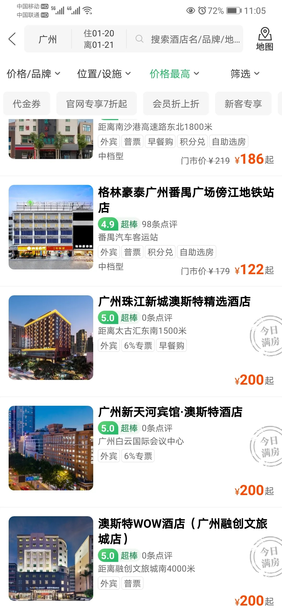

③酒店未翻牌，在格林APP上所有日期不能预订，在OTA平台可以预订。

3、2024年中国饭店集团60强榜单东呈开业酒店数量2732家。

截至2025年12月31日，东呈青猫会APP上可查询到的东呈旗下酒店数量2239家，部分酒店所有日期不能预订，其中：

城市便捷1125家。

不知道OTA平台还有多少家未上线东呈青猫会的东呈旗下品牌酒店。

4、2024年中国饭店集团60强榜单尚美开业酒店数量4826家。

截至2025年12月31日，心里美APP上可查询到的尚美旗下酒店数量3748家，部分酒店所有日期不能预订，其中：

尚客优1756家。

不知道OTA平台还有多少家未上线心里美的尚美旗下品牌酒店。

5、2024年中国饭店集团60强榜单亚朵开业酒店数量1619家。

截至2025年12月31日，亚朵APP上可查询到的亚朵旗下酒店数量1994家，部分酒店所有日期不能预订，其中：

亚朵1537家。

2025年12月31日亚朵ATOUR和几木里微信公众号官宣亚朵第2000家亚朵——香格里拉独克宗古城月光广场亚朵酒店已开业。

OTA平台应该有几家家未上线亚朵的亚朵旗下品牌酒店。

另亚朵有些酒店不在亚朵APP上城市列表里，需要手动输入城市搜索才能搜索到，城市列表里有些城市名称错误也搜不到酒店。比如城市列表里有晋中平遥，但是没有晋中市，选择“晋中平遥”，搜索出来的是晋中市以外的国内各地酒店。

手动输入“晋中”，才能搜到到晋中市榆次区和介休市的3家亚朵酒店。

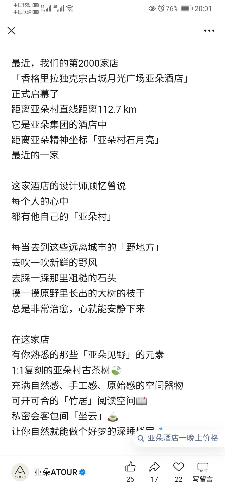

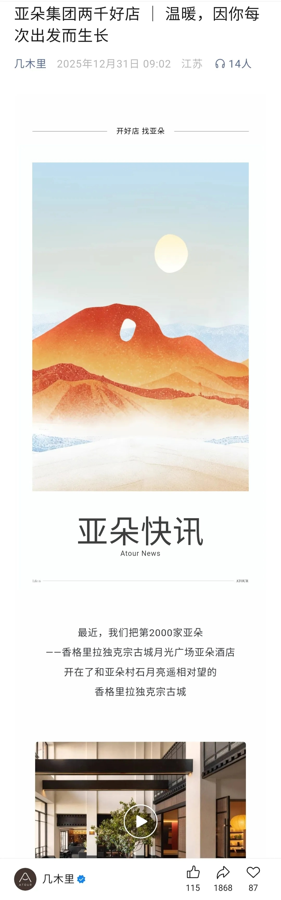

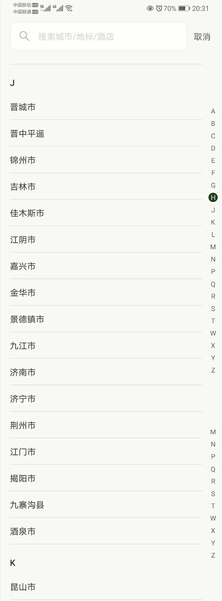

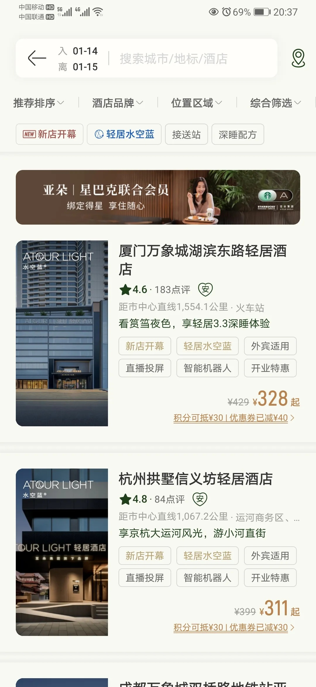

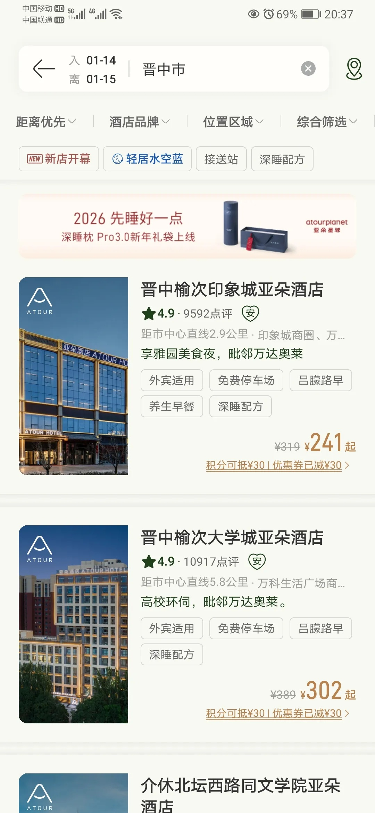

6、2024年中国饭店协会年度酒店集团50强榜单旅悦(携程旗下去哪儿孵化)开业酒店数量2493家。

截至2025年12月31日，花筑旅行APP上可查询到的旅悦旗下酒店数量1497家，部分酒店所有日期不能预订。1497家酒店不含带有酒店联盟标识的酒店。

花筑旅行上带有酒店联盟标识的酒店，不是旅悦旗下酒店，只是与旅悦合作上线花筑旅行平台，花筑旅行会员预订可以享受花筑旅行会员权益。

酒店联盟标识酒店有些是单体酒店，有些之前是连锁酒店已退出现为单体酒店。

比如平凉静宁这家已经退出雅高退出华住的宜必思酒店，与旅悦合作上线花筑旅行平台。

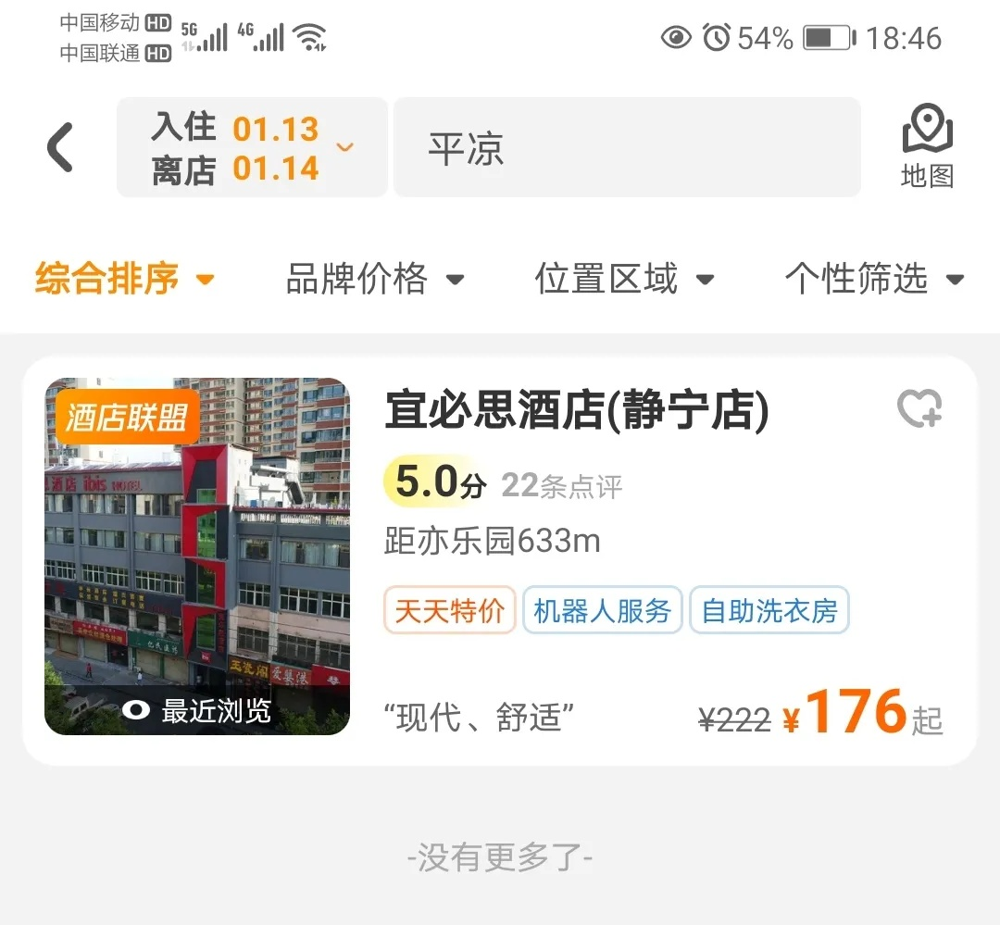

7、2024年中国饭店集团60强榜单艺龙酒店联盟(同程旗下)开业酒店数量2309家。

截至2025年12月31日，艺龙会小程序上可查询到的艺龙会旗下酒店数量2340家，部分酒店所有日期不能预订。

还是一如既往的有一些地理错误，比如把新疆生产建设兵团第二师铁门关市的酒店划分到巴音郭楞蒙古自治州库尔勒市。

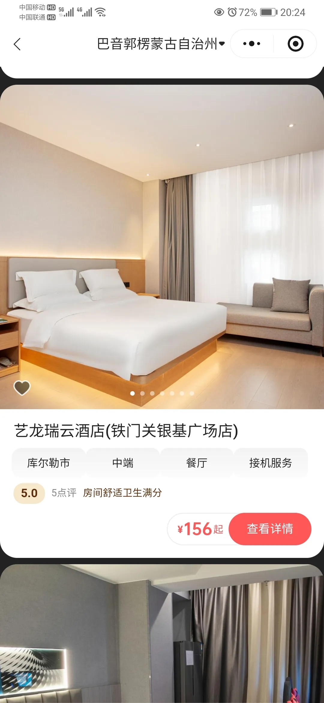

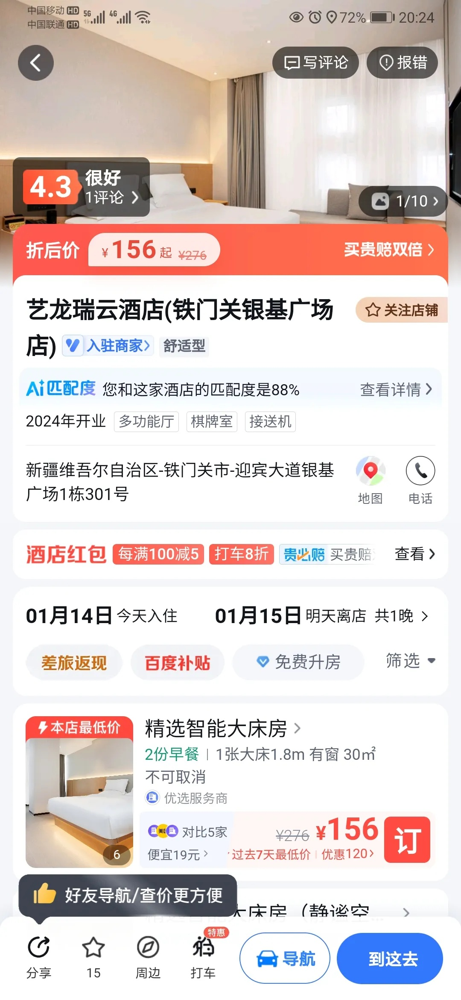

8、2024年中国饭店集团60强榜单丽呈酒店联盟(携程旗下)开业酒店数量618家。

截至2025年12月31日，丽呈会小程序上可查询到的丽呈会旗下酒店数量829家，部分酒店所有日期不能预订。

丽呈会上同样有各种错误。

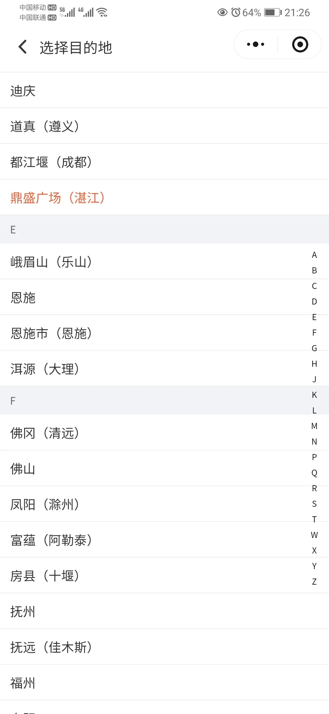

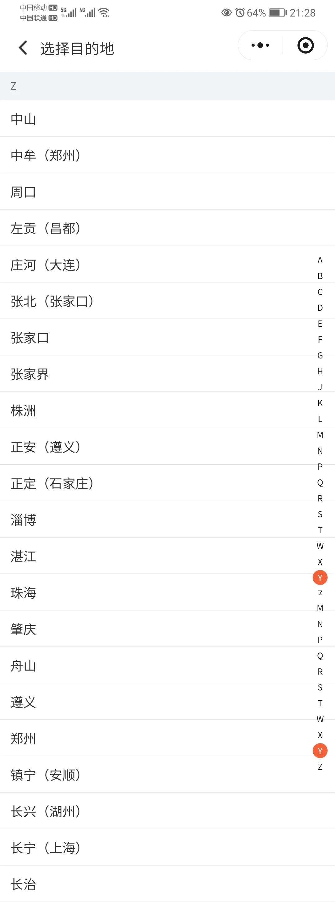

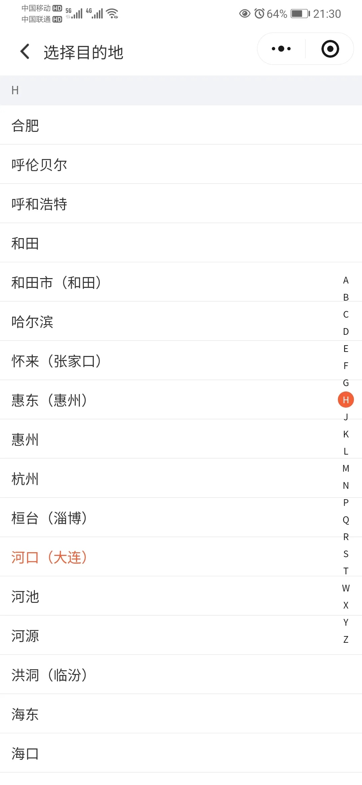

更多的国内酒店统计、年度酒店排行、酒店常识、酒店行业资讯、酒店集团、航空常识、机场交通、行政区划、沈阳旅游、沙发客、打油诗等相关内容可以到我的微信公众号里查看。

也欢迎大家关注我的微信公众号和视频号，名称都是：**不同的角落**

微信直接搜索不同的角落就可以搜索到。

也可以直接点开下方公众号名片关注。