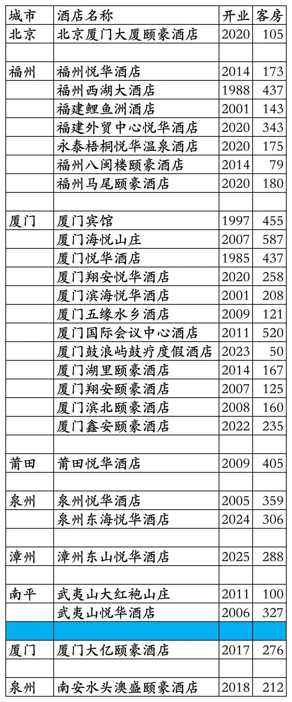
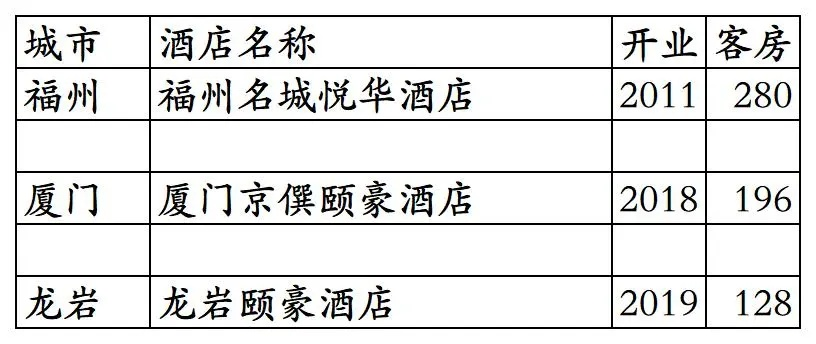

# 厦门建发开业及退出酒店统计2025版

> **作者**：不同的角落  
> **发布时间**：2026年1月19日 22:30  
> **原文链接**：[厦门建发开业及退出酒店统计2025版](https://mp.weixin.qq.com/s?__biz=MzU4OTczMzkwNw==&mid=2247610581&idx=1&sn=397cee1f3684486c32ebeb215249ffce&scene=21#wechat_redirect)

---

厦门建发旅游集团旗下已开业及退出酒店统计，统计数据截至2025年12月31日。

客房数据主要来自于厦门建发官方平台与OTA，部分酒店客房数量打过酒店电话核实，记录的是酒店员工告知的客房数量。

厦门建发总部在福建省厦门市，旗下酒店三星级到五星级档次都有。

建发旗下有悦华、颐豪2个酒店品牌。

鹭悦会会会员计划，分为贵宾会员、白金会员、钻石会员三个等级。

截至2025年12月31日厦门建发官方平台和OTA平台可以查询到的国内开业在营酒店共计28家客房7231间。其中2家酒店厦门大亿颐豪和南安水头澳盛颐豪未上线建发官方平台。

目前建发在北京、福建有酒店。

开业：新酒店开业或是其它酒店翻牌开业时间；

客房：客房数量。

个人精力有限，部分酒店开业/退出/下线时间以及客房数量难免有错误，欢迎各位告知指正，谢谢！

厦门建发旗下的28家酒店，其中福建鲤鱼洲酒店和厦门海悦山庄为福建省国宾馆。

厦门建发退出及关停酒店

更多的国内酒店统计、年度酒店排行、酒店常识、酒店行业资讯、酒店集团、航空常识、沈阳旅游、沙发客、打油诗等相关内容可以到我的微信公众号里查看。

也欢迎大家关注我的微信公众号和视频号，名称都是：**不同的角落**

微信直接搜索不同的角落就可以搜索到。

也可以直接点开下方公众号名片关注。