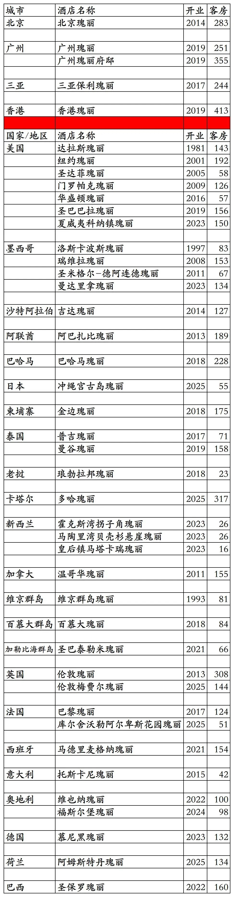
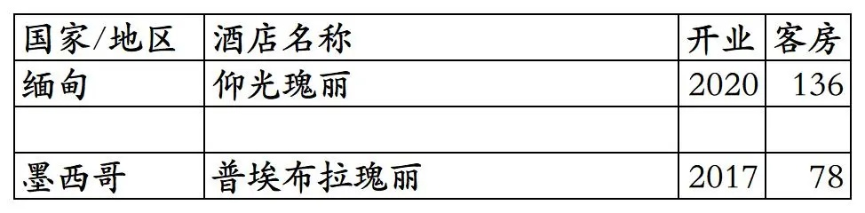
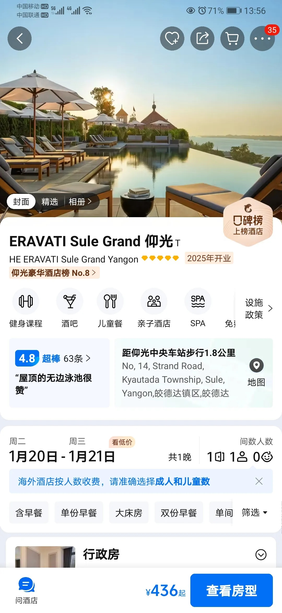
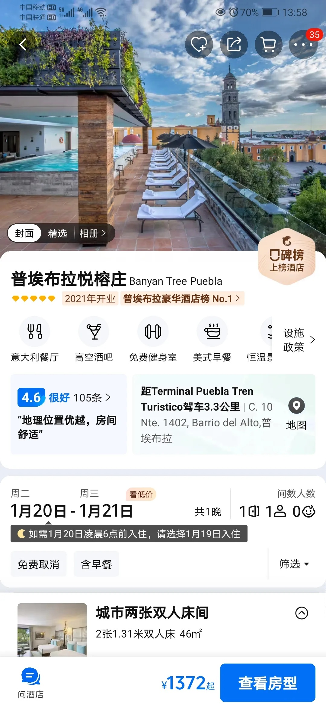
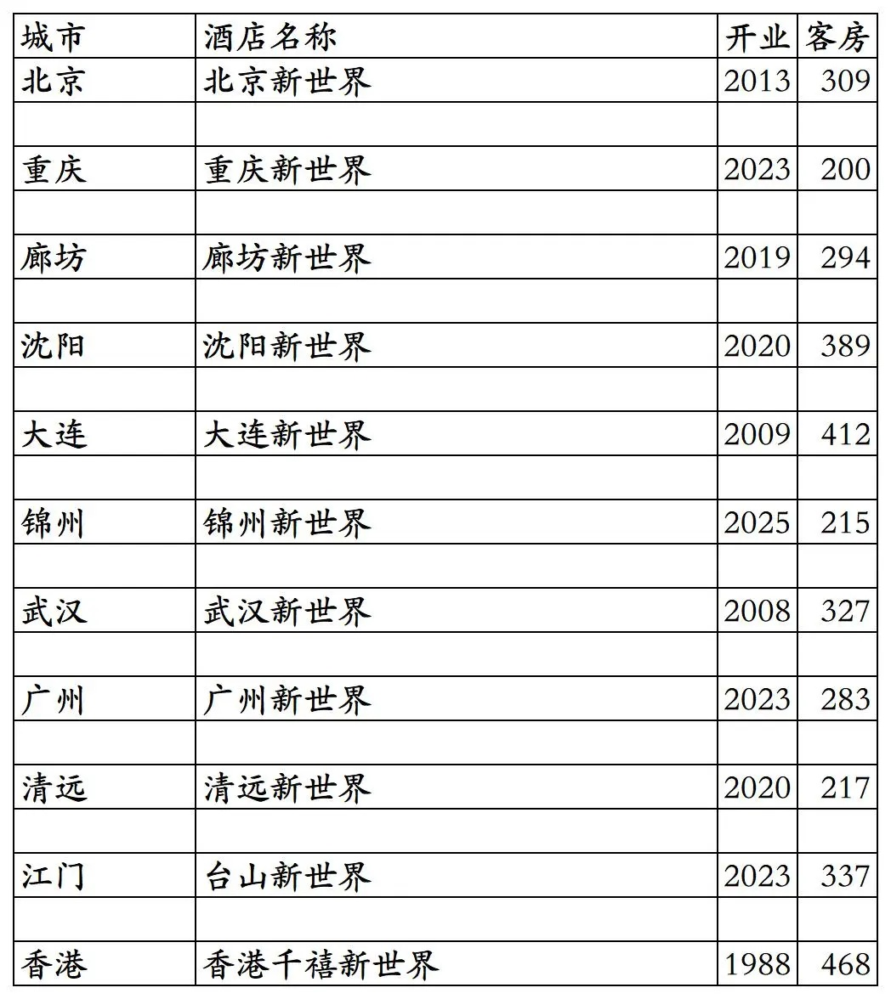
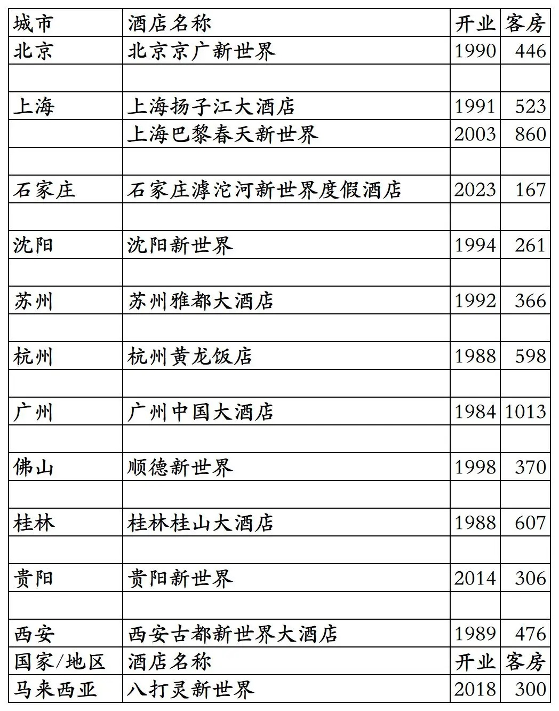
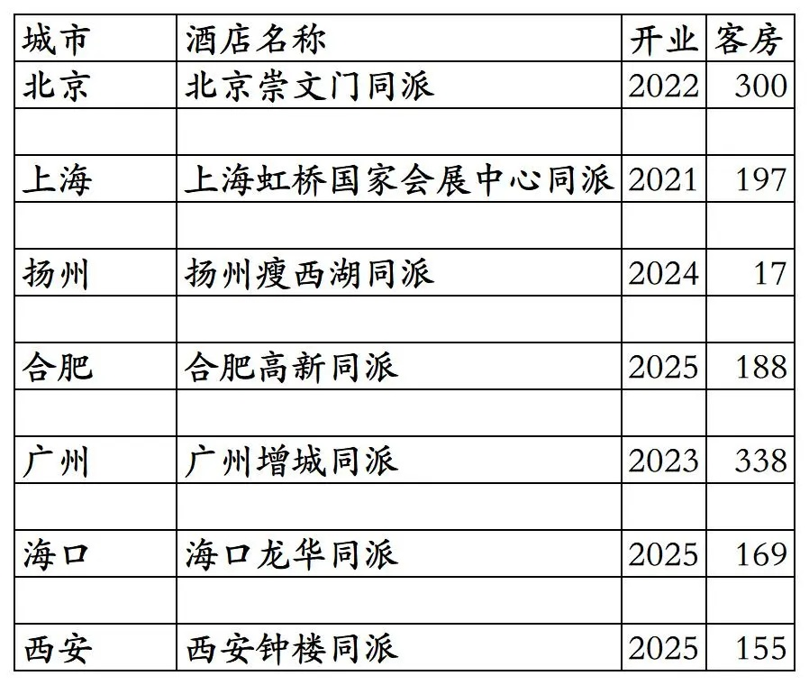
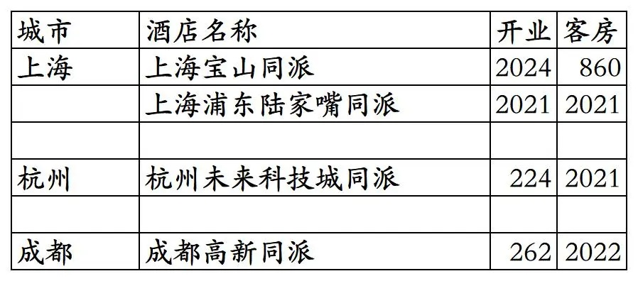

# 瑰丽开业酒店统计2025版

> 本文转载自微信公众号 **不同的角落**，已获作者授权。  
> 原文发布于 2026年1月20日 23:42  
> 原文链接：[mp.weixin.qq.com](http://mp.weixin.qq.com/s?__biz=MzU4OTczMzkwNw==&mid=2247610591&idx=1&sn=5df731aabe88049aa0eb517d6a3bb641&chksm=fdca79a3cabdf0b5bff6514ccf646e7d0892db273a765a68b680717a43e6f1c93ffe972478c3)

---

瑰丽旗下开业酒店统计，统计数据截至2025年12月31日。不包括新世界集团为业主的万豪、凯悦等其它酒店集团旗下品牌酒店。

客房数据主要来自于瑰丽官方平台与OTA。

个人精力有限，部分酒店开业/退出/下线时间以及客房数量难免有错误，欢迎各位告知指正，谢谢！

截至2025年12月31日，瑰丽旗下开业在营酒店共计66家。

瑰丽旗下酒店包括奢华五星酒店瑰丽、普通五星酒店新世界、中档酒店同派3个品牌。3家芊丽酒店已翻牌为新世界，芊丽品牌已成为过去时；之前的贝尔特酒店有的翻牌为同派有的退出，贝尔特品牌也已成为过去时。

2011年香港新世界酒店集团收购瑰丽酒店及度假村，2013年新世界酒店集团更名为瑰丽酒店集团。

大中华区4家瑰丽(不含广州瑰丽府邸)与国外12家瑰丽酒店可以在瑰丽酒店小程序预订，但无会员计划，其余26家国外瑰丽酒店不能在瑰丽酒店小程序预订。

国内新世界酒店和同派酒店可用在“新聚汇会员商城”小程序预订，享受新聚汇会员权益。

新聚汇会员分为初遇、相识、好友、知己4个等级。

另除了北京新世界酒店、沈阳新世界酒店、北京崇文门同派酒店外其余国内新世界酒店和同派酒店，都与丽呈有合作，可以在“丽呈会”小程序预订，享受丽呈会会员权益。

开业：新酒店开业或是原酒店翻牌开业时间；客房：客房数量。

瑰丽品牌43家酒店。

2家退出的瑰丽酒店(新世界收购瑰丽后开发的)。还有大约20家退出的瑰丽没有统计，是新世界收购瑰丽之前开业的，大多数在新世界收购瑰丽之前就已退出。

现在仰光瑰丽酒店已翻牌为400多元一晚的酒店，普埃布拉瑰丽已翻牌为悦榕庄。

16家新世界酒店。其中廊坊新世界、沈阳新世界、清远新世界是由芊丽品牌翻牌。

已退出/停业的国内新世界品牌酒店。包括几家由新世界管理未挂牌新世界品牌的酒店。

北京京广新世界就是现在北京瑰丽的前身，上海扬子江大饭店现在是上海扬子江丽笙精选，上海巴黎春天新世界现在是上海中山公园凯悦尚萃，石家庄滹沱新世界现在是石家庄滹沱宾馆，沈阳新世界(之前是三星级酒店，后来升级为四星级酒店)已于2013年拆除原地新建新世界名汇住宅，苏州雅都大酒店就是现在的苏州金陵雅都大酒店，顺德新世界已改为桔子水晶刚开业，贵阳新世界已改为贵阳恒世纪酒店。

7家同派品牌酒店。其中北京崇文门同派酒店为原北京贝尔特酒店改造翻牌。

已退出的同派酒店。

更多的酒店统计、年度酒店排行、酒店常识、酒店行业资讯、酒店集团、航空常识、机场交通、行政区划、沈阳旅游、沙发客、打油诗等相关内容可以到我的微信公众号里查看。

也欢迎大家关注我的微信公众号和视频号，名称都是：**不同的角落**

微信直接搜索不同的角落就可以搜索到。

也可以直接点开下方公众号名片关注。