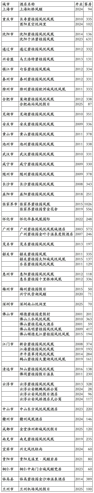
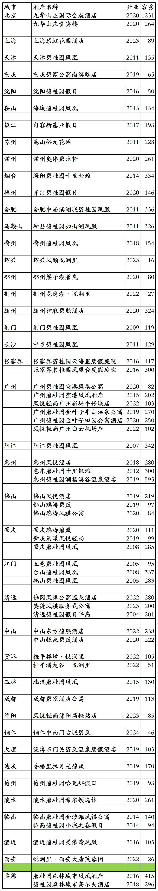

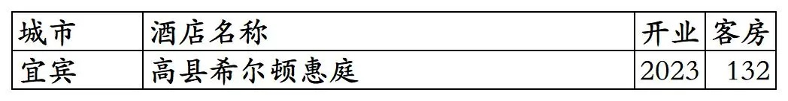
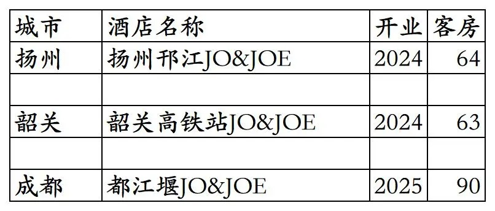
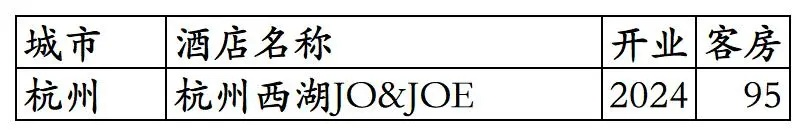

# 凤悦开业及退出酒店统计2025版

> 本文转载自微信公众号 **不同的角落**，已获作者授权。  
> 原文发布于 2026年1月22日 22:06  
> 原文链接：[mp.weixin.qq.com](https://mp.weixin.qq.com/s?__biz=MzU4OTczMzkwNw==&mid=2247610996&idx=1&sn=9771839fa64947b727044b9dd070ac86&scene=21#wechat_redirect)

---

凤悦旗下开业及退出酒店统计，统计数据截至2025年12月31日。

客房数据主要来自于凤悦官方平台与OTA，部分酒店客房数量打过酒店电话核实，记录的是酒店员工告知的客房数量。

个人精力有限，部分酒店开业/退出/下线时间以及客房数量难免有错误，欢迎各位告知指正，谢谢！

截至2025年12月31日凤悦平台可以查询到的自有品牌已开业酒店共计59家客房14905间。已去除挂在凤悦官方平台所有日期不能预订实际上早已经退出/关停的几家酒店。

凤悦自有品牌包括凤悦凤凰、凤悦假日、凤悦轻尚、凤颐、悦涧里、凤琪公寓。

特许经营的希尔顿旗下进驻国内低端品牌希尔顿惠庭（与普通五星酒店档次的希尔顿品牌相差4个等级）已开业酒店117家客房17390间，包括未上线凤悦官方平台的沈阳于洪希尔顿惠庭和曲靖陆良希尔顿惠庭2家酒店。另部分酒店所有日期显示满房不可预订，实际酒店已开业但未开放凤悦平台预订。

特许经营的雅高旗下青旅品牌JO&JOE已开业酒店3家客房217间。

截至2025年12月31日凤悦在天津、吉林、青海没有开业在营酒店。

开业酒店共179家客房32512间。

开业：新酒店开业或是其它酒店翻牌开业时间；客房：客房数量。

  凤悦自有品牌酒店

上海虹桥凤颐酒店之前是上海南航明珠虹桥大酒店；沈阳于洪碧桂园凤凰酒店最初是沈阳碧桂园玛丽蒂姆酒店，后来翻牌为美诺旗下的诺翰品牌沈阳诺翰酒店，翻牌诺翰后一直未上线GHA官方平台，只上线凤悦官方平台，不过酒店员工说酒店不享受凤悦会员权益，在2025年又翻牌为凤悦自有品牌。

凤悦自有品牌历年退出/关停/合并酒店，包括2家国外酒店。

凤悦特许经营的希尔顿惠庭品牌酒店。

很多城市希尔顿惠庭酒店的房价和比希尔顿惠庭品牌高4个等级的希尔顿品牌酒店房价持平。

部分希尔顿惠庭品牌酒店可以在希尔顿官方平台预订并累积希尔顿荣誉客会积分间夜（希尔顿惠庭品牌在希尔顿官方平台预订也没什么权益）。

部分希尔顿惠庭酒店在凤悦平台显示满房状态不可预订，暂时只能在OTA平台预订，不能享受凤悦会员权益也不能累积凤悦会员积分间夜。

铜仁古城希尔顿惠庭酒店自2022年开业后一直未开放网上平台预订，只能线下预订，酒店主要承接公务接待。

希尔顿惠庭品牌已退出酒店

凤悦特许经营的青旅品牌JO&JOE

已退出的JO&JOE品牌酒店

更多的国内酒店统计、年度酒店排行、酒店常识、酒店行业资讯、酒店集团、航空常识、沈阳旅游等相关内容可以到我的微信公众号里查看。

也欢迎大家关注我的微信公众号和视频号，名称都是：**不同的角落**

微信直接搜索不同的角落就可以搜索到。

也可以直接点开下方公众号名片关注。