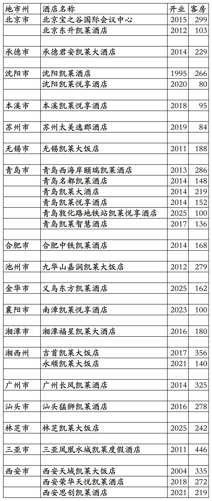
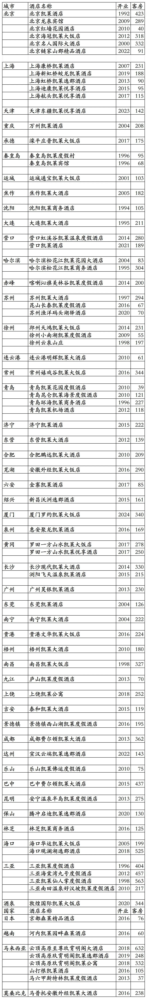

# 凯莱开业及退出酒店统计2025版

> 本文转载自微信公众号 **不同的角落**，已获作者授权。  
> 原文发布于 2026年1月25日 22:04  
> 原文链接：[mp.weixin.qq.com](https://mp.weixin.qq.com/s?__biz=MzU4OTczMzkwNw==&mid=2247611049&idx=1&sn=bf910cbfed36554af7ec82ad3196cf20&scene=21#wechat_redirect)

---

凯莱酒店集团旗下已开业及退出酒店统计，统计数据截至2025年12月31日。

客房数据主要来自于凯莱官方平台与OTA，部分酒店客房数量打过酒店电话核实，记录的是酒店员工告知的客房数量。

凯莱酒店集团是央企中粮集团于1992年在香港设立的酒店管理公司，国内运营主体公司是凯莱国际酒店管理(北京)有限公司，旗下酒店三星级到五星级档次都有。

凯莱旗下有凯莱大饭店、凯莱酒店、凯莱度假酒店、凯莱逸郡酒店、凯莱悦享酒店、凯莱至尊公寓、凯莱公寓等酒店品牌。

凯莱酒店会员计划，分为微信会员、蓝卡会员、金卡会员、铂金会员四个等级。

截至2025年12月31日凯莱官方平台和OTA平台可以查询到的国内开业在营酒店共计30家客房6140间。其中2家酒店苏州享通凯莱度假酒店和三亚南夏凯莱悦享酒店未上线凯莱官方平台。另凯莱官方平台有4家酒店已退出凯莱。

目前凯莱在北京、河北、辽宁、江苏、山东、安徽、浙江、湖北、湖南、广东、西藏、海南、陕西有酒店。

开业：新酒店开业或是其它酒店翻牌开业时间；

客房：客房数量。

个人精力有限，部分酒店开业/退出/下线时间以及客房数量难免有错误，欢迎各位告知指正，谢谢！

凯莱旗下的30家酒店，其中部分酒店不能在凯莱官方平台预订，林芝凯莱大饭店(华能林芝会议中心)目前不对外营业。

凯莱历年退出/关停酒店，北京凯莱酒店2010年拆除后原址中粮新建了北京W酒店于2014年开业，2019年出售给明宇后先翻牌为北京长安街天府尊雅酒店，没几天又翻牌为北京长安索菲特。2009年三亚凯莱度假酒店停业后，中粮对酒店进行扩建，保留老楼新建东楼，2011年扩建完成后中粮牵手美高梅开出国内首家美高梅酒店以三亚亚龙湾美高梅度假酒店。

更多的国内酒店统计、年度酒店排行、酒店常识、酒店行业资讯、酒店集团、航空常识、沈阳旅游、沙发客、打油诗等相关内容可以到我的微信公众号里查看。

也欢迎大家关注我的微信公众号和视频号，名称都是：**不同的角落**

微信直接搜索不同的角落就可以搜索到。

也可以直接点开下方公众号名片关注。