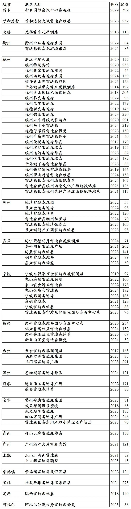
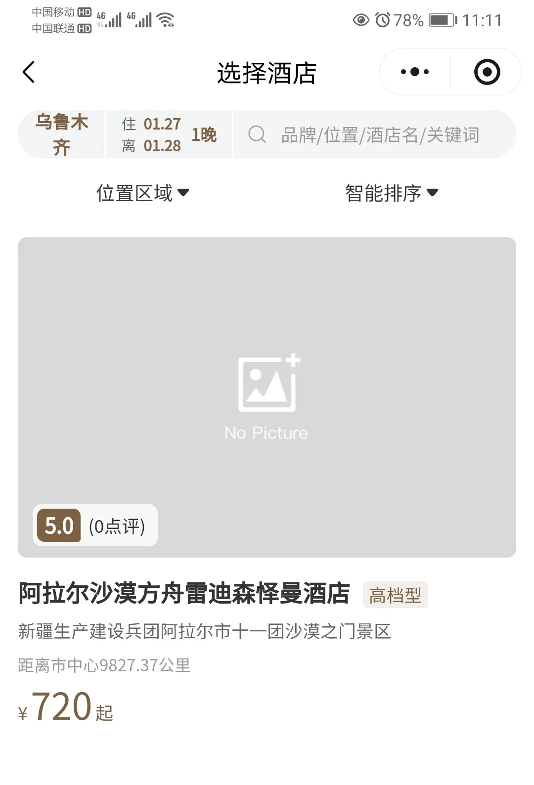
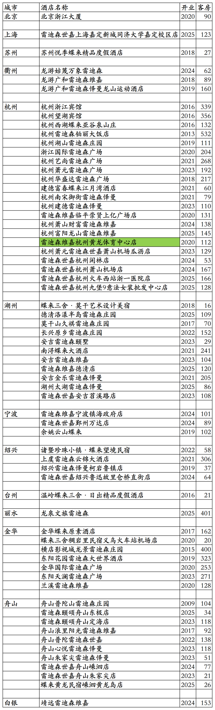
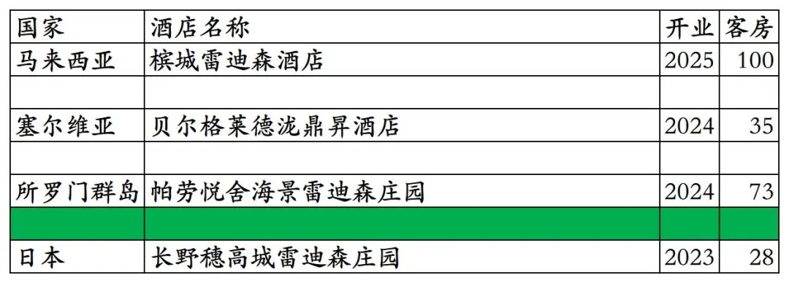
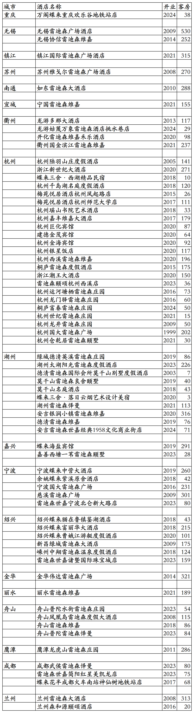

# 雷迪森开业及退出酒店统计2025版

> **作者**：不同的角落  
> **发布时间**：2026年1月27日 20:22  
> **原文链接**：[雷迪森开业及退出酒店统计2025版](https://mp.weixin.qq.com/s?__biz=MzU4OTczMzkwNw==&mid=2247611063&idx=1&sn=4d963acb21a83c6fc1caa1050de3badd&scene=21#wechat_redirect)

---

雷迪森酒店集团旗下已开业酒店统计，统计截至2025年12月31日。不含雷迪森酒店集团为全资业主或大股东委托给其它酒店集团管理的杭州香格里拉、浙旅开元名庭等几家酒店。

客房数据主要来自于雷迪森官方平台与OTA，部分酒店客房数量打过酒店电话核实，记录的是酒店员工告知的客房数量。

个人精力有限，部分酒店开业/退出/下线时间以及客房数量难免有错误，欢迎各位告知指正，谢谢！

雷迪森总部在浙江省杭州市，旗下酒店三星级到五星级档次都有。

雷迪森旗下有雷迪森、雷迪森庄园、雷迪森广场、雷迪森颐墅、雷迪森颐颂、雷迪森维嘉、雷迪森世嘉、雷迪森怿曼、蝶来系列等酒店品牌。

悦来荟会会员计划，分为银卡、金卡、铂金卡三个等级。

截至2025年12月31日，雷迪森旗下国内可查询到已开业酒店137家客房19096间，其中雷迪森官方平台“悦来荟CLUB”小程序可以查询到72家酒店9868间客房。

在OTA平台可以查询到雷迪森旗下国内其它65家酒店9228间客房，不能享受雷迪森会员权益也不能累积积分间夜。

中国旅游饭店业协会经过严格缜密的数据统计、分析与核实，发布的2021-2024年度中国饭店集团60强榜单中，统计的雷迪森国内开业在营酒店与客房数量如下：

2021年169家酒店28070间客房，

2022年195家酒店34888间客房，

2023年325家酒店41937间客房，

2024年385家酒店45680间客房。

目前雷迪森在国内北京、上海、河南、内蒙古、江苏、浙江、广东、江西、陕西、甘肃、新疆有酒店。

在国外还有4家合作挂牌酒店。

开业：新酒店开业或是其它酒店翻牌开业时间；客房：客房数量。

雷迪森官方平台可查询到的72家酒店

雷迪森酒店集团那帮高管中国地理估计都是非洲体育老师教的，把新疆生产建设兵团第一师阿拉尔市给划分到了乌鲁木齐市管辖，阿拉尔市距离乌鲁木齐市800多公里远。阿拉尔这家雷迪森怿曼酒店不在阿拉尔市区，在阿拉尔市下辖的十一团，距离阿拉尔市区50多公里远。

OTA平台可查询到的64家酒店，原浙江金都宾馆2020年改名为雷迪森维嘉杭州黄龙体育中心店；2025年停业装修改造，改造后将更名为杭州金都雷迪森维嘉酒店。

国外的4家雷迪森合作挂牌酒店，日本长野县穗高城雷迪森庄园酒店目前在OTA平台查询不到。

雷迪森历年退出/关停酒店

更多的国内酒店统计、年度酒店排行、酒店常识、酒店行业资讯、酒店集团、航空常识、沈阳旅游、沙发客、打油诗等相关内容可以到我的微信公众号里查看。

也欢迎大家关注我的微信公众号和视频号，名称都是：**不同的角落**

微信直接搜索不同的角落就可以搜索到。

也可以直接点开下方公众号名片关注。