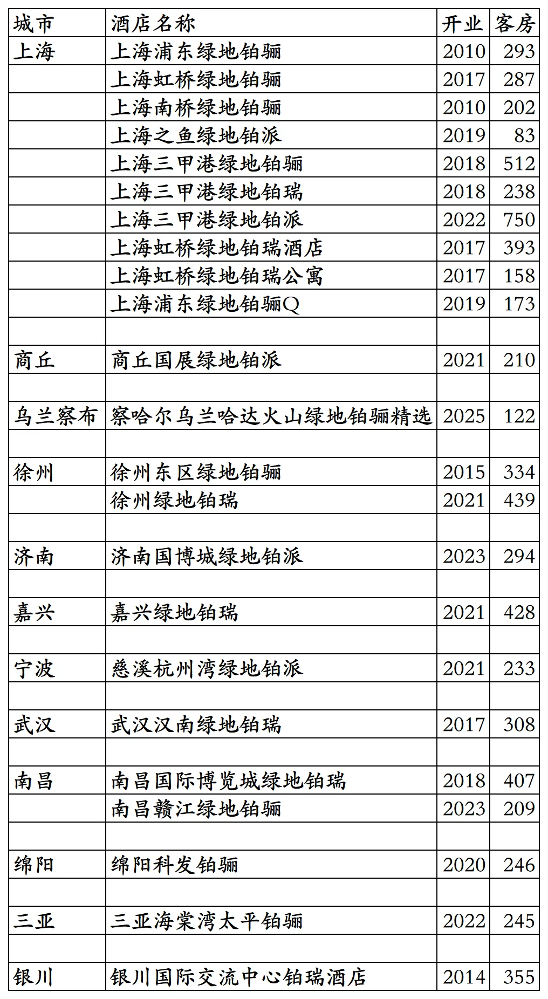
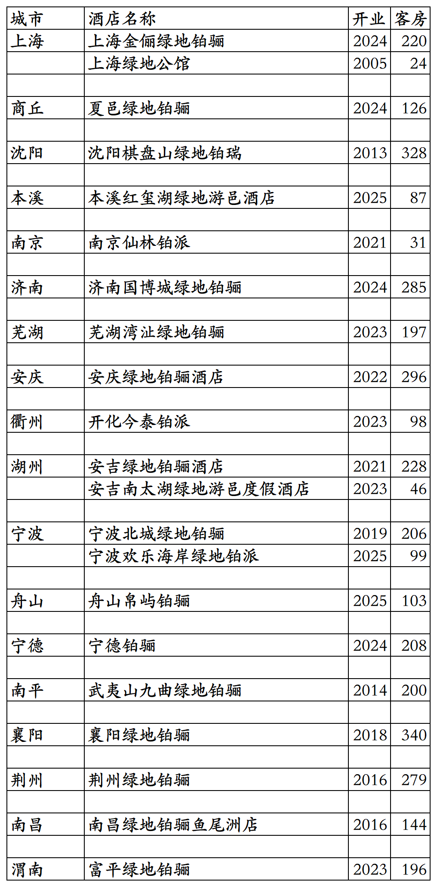
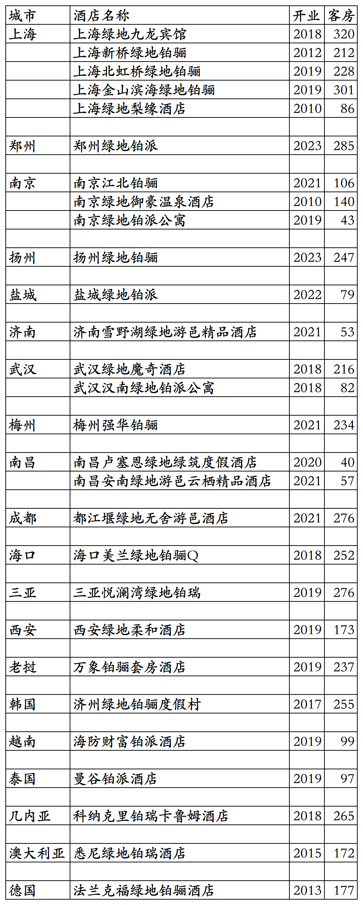
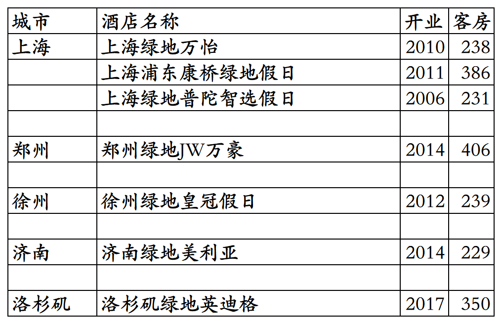
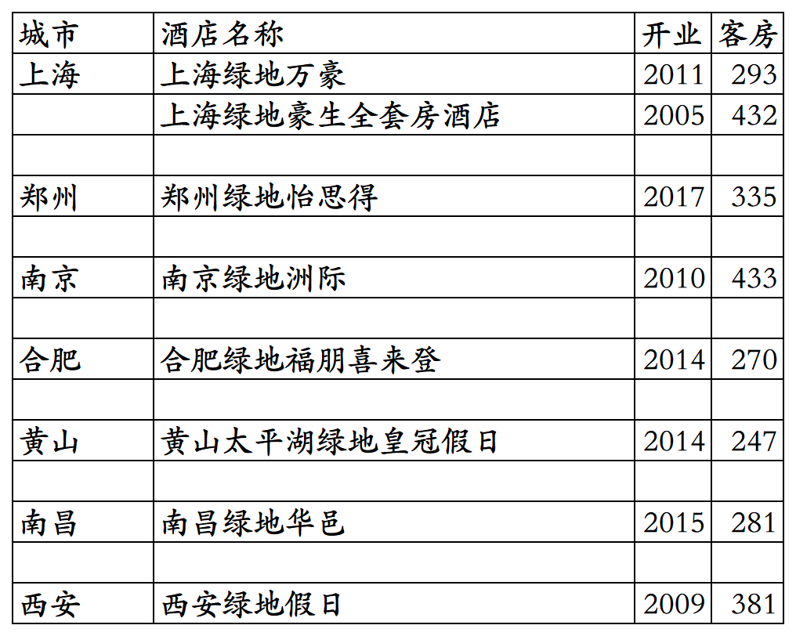

# 绿地开业及退出酒店统计2025版

> 本文转载自微信公众号 **不同的角落**，已获作者授权。  
> 原文发布于 2026年2月22日 21:22  
> 原文链接：[mp.weixin.qq.com](https://mp.weixin.qq.com/s?__biz=MzU4OTczMzkwNw==&mid=2247611758&idx=1&sn=04c4aacebb06c3a01883f452c18aad52&scene=21#wechat_redirect)

---

上海绿地酒店管理有限公司旗下开业及退出酒店统计，统计数据截至2025年12月31日。

客房数据主要来自于绿地官方平台与OTA，部分酒店客房数量打过酒店电话核实，记录的是酒店员工告知的客房数量。

四川明宇商旅收购绿地酒店管理有限公司52%股份后，已成为绿地酒管最大股东。绿地旗下酒店三星级到五星级档次都有。

绿地旗下有铂瑞、铂骊、铂骊Q、铂派、柔和、魔奇、游邑度假、绿筑度假、澄境度假等自有酒店品牌，还有几家与万豪、洲际、美利亚合作的酒店。

绿地尊享会会员计划，分为尊享会员、银卡会员、金卡会员、铂金会员四个等级。

截至2025年12月31日绿地酒店官方平台和OTA平台可以查询到的绿地自有品牌开业在营酒店共计44家客房10660间。

万豪、洲际、美利亚旗下品牌酒店7家，包括美国洛杉矶1家英迪格。

目前绿地自有品牌在上海、河南、辽宁、内蒙古、江苏、山东、安徽、浙江、福建、湖北、广东、江西、四川、海南、陕西、宁夏有酒店。

开业：新酒店开业或是其它酒店翻牌开业时间；

客房：客房数量。

个人精力有限，部分酒店开业/退出/下线时间以及客房数量难免有错误，欢迎各位告知指正，谢谢！

绿地官方平台可查询到的23家酒店。

OTA平台其余21酒店。

绿地自有品牌历年退出/关停酒店。

万豪、洲际、美利亚旗下品牌酒店。

已出售的国际品牌酒店。

**其它国内酒店集团开业酒店统计**：

01、锦江国内高端酒店开业及退出统计

[锦江国内高端酒店开业及退出统计2025版](https://mp.weixin.qq.com/s?__biz=MzU4OTczMzkwNw==&mid=2247609898&idx=1&sn=1bf95d3afb9ca7c4c201c8844fb7be47&scene=21#wechat_redirect)

02、华住国内高端酒店开业及退出统计

[华住国内高端酒店开业及退出统计2025版](https://mp.weixin.qq.com/s?__biz=MzU4OTczMzkwNw==&mid=2247606873&idx=1&sn=68d0d9a13b1fd7c801ba71d81d56c9fa&scene=21#wechat_redirect)

03、东呈高端酒店

[东呈高端酒店开业及退出统计2025版](https://mp.weixin.qq.com/s?__biz=MzU4OTczMzkwNw==&mid=2247609471&idx=1&sn=3f9b86e6bb44de42272efdb69f66966f&scene=21#wechat_redirect)

04、开元开业及退出酒店统计

[开元开业及退出酒店统计2025版](https://mp.weixin.qq.com/s?__biz=MzU4OTczMzkwNw==&mid=2247607605&idx=1&sn=b497ea72bace78160605c89c0b16bfa9&scene=21#wechat_redirect)

05、万达开业及退出酒店统计

[万达开业及退出酒店统计2025版](https://mp.weixin.qq.com/s?__biz=MzU4OTczMzkwNw==&mid=2247607837&idx=1&sn=fa333c513bfaaa4c680f27e130ae2132&scene=21#wechat_redirect)

06、君亭开业及退出酒店统计

[君亭开业及退出酒店统计2025版](https://mp.weixin.qq.com/s?__biz=MzU4OTczMzkwNw==&mid=2247593231&idx=1&sn=e77507548dc06ec4350502f21ad6b17f&scene=21#wechat_redirect)

07、雷迪森开业及退出酒店统计

[雷迪森开业及退出酒店统计2025版](https://mp.weixin.qq.com/s?__biz=MzU4OTczMzkwNw==&mid=2247611063&idx=1&sn=4d963acb21a83c6fc1caa1050de3badd&scene=21#wechat_redirect)

08、凤悦开业及退出酒店统计

[凤悦开业及退出酒店统计2025版](https://mp.weixin.qq.com/s?__biz=MzU4OTczMzkwNw==&mid=2247610996&idx=1&sn=9771839fa64947b727044b9dd070ac86&scene=21#wechat_redirect)

09、中旅国内开业及退出酒店统计

[中旅国内开业及退出酒店统计2025版](https://mp.weixin.qq.com/s?__biz=MzU4OTczMzkwNw==&mid=2247577094&idx=1&sn=fd7d1711998de8f9bcbb32dd52ef7f3f&scene=21#wechat_redirect)

10、金陵开业及退出酒店统计

[金陵开业及退出酒店统计2025版](https://mp.weixin.qq.com/s?__biz=MzU4OTczMzkwNw==&mid=2247576523&idx=1&sn=243a19d77fcfb36bf194c97cc182834b&scene=21#wechat_redirect)

11、格兰云天开业及退出酒店统计

[格兰云天开业及退出酒店统计2025版](https://mp.weixin.qq.com/s?__biz=MzU4OTczMzkwNw==&mid=2247579183&idx=1&sn=5a1fea0a80f62d8e92af07c25e0c1c1d&scene=21#wechat_redirect)

12、中维开业及退出酒店统计

[中维开业及退出酒店统计2025版](https://mp.weixin.qq.com/s?__biz=MzU4OTczMzkwNw==&mid=2247581530&idx=1&sn=72add848f0fb5f82831f2d46855ee507&scene=21#wechat_redirect)

13、华天开业及退出酒店统计

[华天开业及退出酒店统计2025版](https://mp.weixin.qq.com/s?__biz=MzU4OTczMzkwNw==&mid=2247583997&idx=1&sn=46d5ab82f71c6249eb3f811ec108a794&scene=21#wechat_redirect)

14、凯莱开业及退出酒店统计

[凯莱开业及退出酒店统计2025版](https://mp.weixin.qq.com/s?__biz=MzU4OTczMzkwNw==&mid=2247611049&idx=1&sn=bf910cbfed36554af7ec82ad3196cf20&scene=21#wechat_redirect)

15、厦门建发开业及退出酒店统计

[厦门建发开业及退出酒店统计2025版](https://mp.weixin.qq.com/s?__biz=MzU4OTczMzkwNw==&mid=2247610581&idx=1&sn=397cee1f3684486c32ebeb215249ffce&scene=21#wechat_redirect)

16、厦门佰翔开业及退出酒店统计

[厦门佰翔开业及退出酒店统计2025版](https://mp.weixin.qq.com/s?__biz=MzU4OTczMzkwNw==&mid=2247579739&idx=1&sn=89912fcad6eab52a875ba40260bdef98&scene=21#wechat_redirect)

17、福建旅发开业及退出酒店统计

[福建旅发开业及退出酒店统计2025版](https://mp.weixin.qq.com/s?__biz=MzU4OTczMzkwNw==&mid=2247576672&idx=1&sn=bcbdf134ca973ca406d8e5d572069de3&scene=21#wechat_redirect)

18、远洲旅业开业及退出酒店统计

[远洲旅业开业及退出酒店统计2025版](https://mp.weixin.qq.com/s?__biz=MzU4OTczMzkwNw==&mid=2247576868&idx=1&sn=a5fc7218eb9630362828b884a61f4d6d&scene=21#wechat_redirect)

19、乔治莫兰迪开业酒店统计

[乔治莫兰迪开业酒店统计2025版](https://mp.weixin.qq.com/s?__biz=MzU4OTczMzkwNw==&mid=2247590594&idx=1&sn=ccb2ef8da02e866e2706c5dffced1fbd&scene=21#wechat_redirect)

更多的国内酒店统计、年度酒店排行、酒店常识、酒店行业资讯、酒店集团、航空常识、沈阳旅游、沙发客、打油诗等相关内容可以到我的微信公众号里查看。

也欢迎大家关注我的微信公众号和视频号，名称都是：**不同的角落**

微信直接搜索不同的角落就可以搜索到。

也可以直接点开下方公众号名片关注。