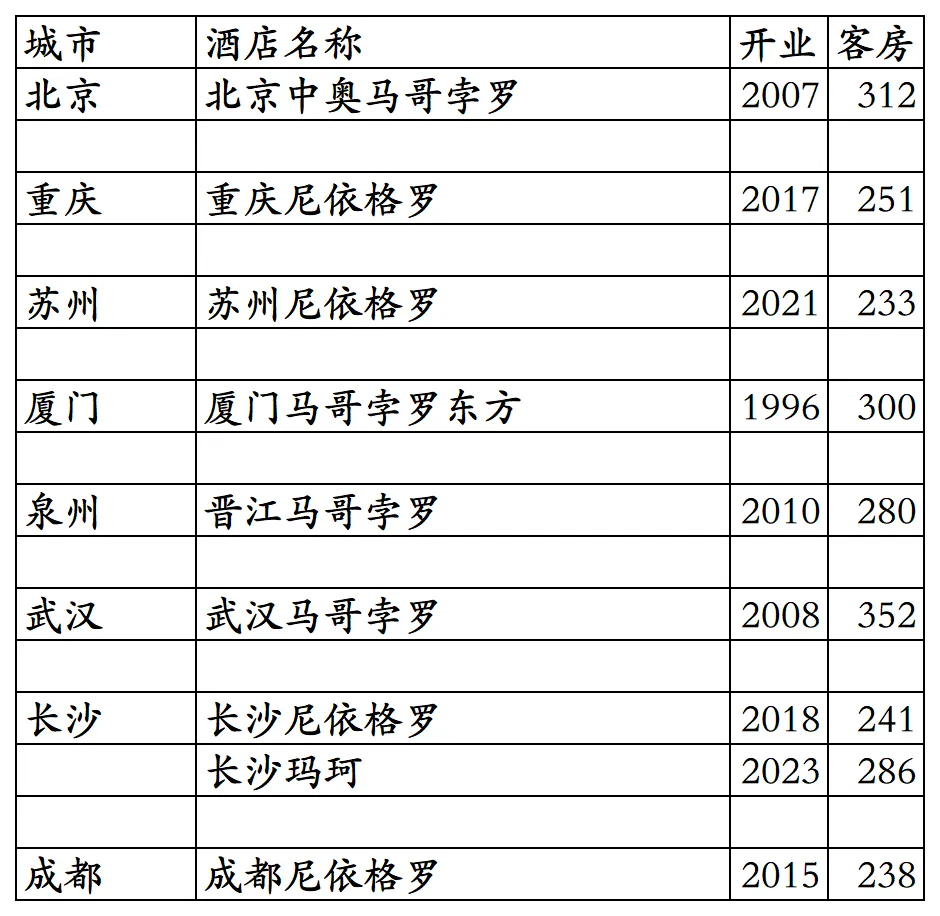
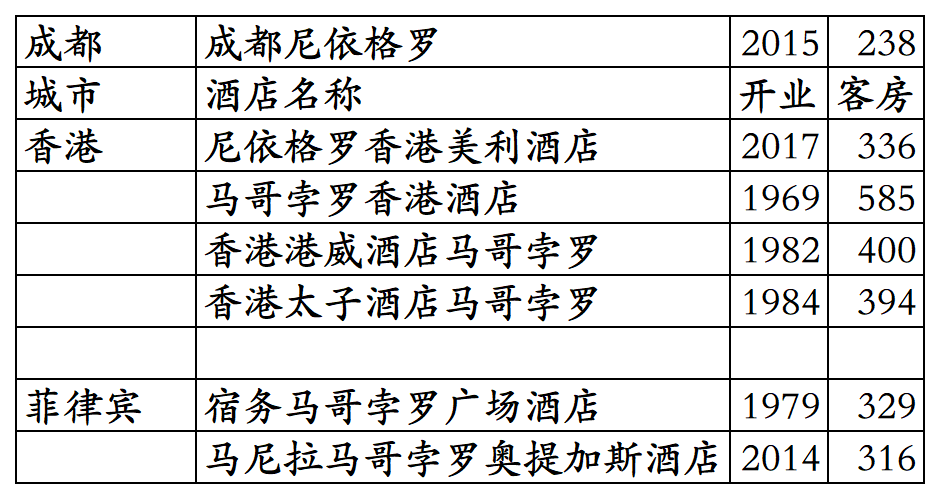
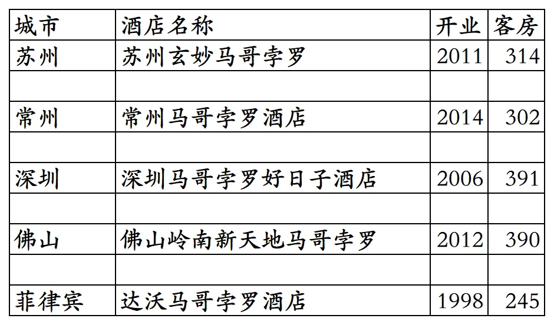

# 九龙仓开业及退出酒店统计2025版

> 本文转载自微信公众号 **不同的角落**，已获作者授权。  
> 原文发布于 2026年2月26日 21:33  
> 原文链接：[mp.weixin.qq.com](http://mp.weixin.qq.com/s?__biz=MzU4OTczMzkwNw==&mid=2247611815&idx=1&sn=4fdaf8733cf5cf5bbb1a2e9c1d2d4d43&chksm=fdca7cdbcabdf5cd37e6efc9bf8d0bb2e52923a2e54f4337b15353ef81ec35b029326b8a0ae8)

---

九龙仓酒店集团旗下开业及退出酒店统计，统计数据截至2025年12月31日。不含九龙仓为业主的长沙柏悦酒店。

客房数据主要来自于OTA，部分酒店客房数量打过酒店电话核实，记录的是酒店员工告知的客房数量。

九龙仓旗下目前有马哥孛罗、尼依格罗、玛珂三个自有酒店品牌。

九龙仓加入了GHA全球酒店联盟，与联盟内其它酒店共用GHA DISCOVERY忠诚会员计划。

GHA忠诚会员计划，会员等级分为银卡、金卡、白金、钛金四个等级，还有隐藏的最高等级尊红卡(邀请制，原来的红卡)，尊红卡有双早、升级套房、提前至10点入住、延时至18点退房权益。

截至2025年12月31日在GHA官方平台和OTA平台可以查询到的九龙仓自有品牌国内开业在营酒店共计9家客房2493间。香港和菲律宾还有开业在营酒店共计6家客房2360间。

目前九龙仓自有品牌在北京、重庆、江苏、福建、湖北、湖南、四川有酒店。

开业：新酒店开业或是其它酒店翻牌开业时间；

客房：客房数量。

个人精力有限，部分酒店开业/退出/下线时间以及客房数量难免有错误，欢迎各位告知指正，谢谢！

国内9家酒店。

香港和菲律宾6家酒店。

九龙仓自有品牌历年退出/关停酒店。

深圳马哥孛罗好日子酒店现在是深圳好日子皇冠假日酒店，佛山岭南新天地马哥孛罗酒店现在是佛山岭南新天地康得思酒店。

**其它港澳台酒店集团开业酒店统计**：

01、香格里拉开业及退出酒店统计

[香格里拉开业及退出酒店统计2025版](https://mp.weixin.qq.com/s?__biz=MzU4OTczMzkwNw==&mid=2247584908&idx=1&sn=a0e56396b3768294dd4b6b6c69d1f31d&scene=21#wechat_redirect)

02、瑰丽开业酒店统计

[瑰丽开业酒店统计2025版](https://mp.weixin.qq.com/s?__biz=MzU4OTczMzkwNw==&mid=2247610591&idx=1&sn=5df731aabe88049aa0eb517d6a3bb641&scene=21#wechat_redirect)

更多的酒店统计、年度酒店排行、酒店常识、酒店行业资讯、酒店集团、航空常识、沈阳旅游、沙发客、打油诗等相关内容可以到我的微信公众号里查看。

也欢迎大家关注我的微信公众号和视频号，名称都是：**不同的角落**

微信直接搜索不同的角落就可以搜索到。

也可以直接点开下方公众号名片关注。